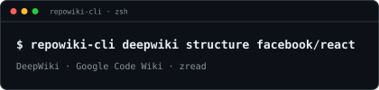

<div align="center">

# Repowiki-cli

**从终端查询任意公开 GitHub 仓库的 AI 生成文档。**



一个二进制 · 一套命令界面 · 三个 wiki 服务：**DeepWiki** · **Google Code Wiki** · **zread.ai**

[](https://www.gnu.org/licenses/gpl-3.0) 
[](#-这是什么)
[](https://pypi.org/project/pyrepowiki-cli/)
[](https://pypi.org/project/pyrepowiki-cli/)
[](https://pepy.tech/project/pyrepowiki-cli)
[](https://github.com/MaybeBio/Repowiki-cli/pulls)


<p>
  文档阅读👉
  <a href="README.md">English</a> |
  <a href="README.zh-CN.md">中文</a> 
</p>

<p>
    <a href="#-安装">安装</a> |
  <a href="#-快速上手">快速上手</a> 
</p>

</div>

> **如果这个项目对你有帮助，欢迎点亮一个 ⭐ Star。**

## 📑 索引

- [📑 索引](#-索引)
- [📖 这是什么](#-这是什么)
- [📦 安装](#-安装)
- [🚀 快速上手](#-快速上手)
- [🧭 命令总览](#-命令总览)
- [🧱 仓库格式](#-仓库格式)
- [🧾 JSON 输出](#-json-输出)
- [💾 保存（`--save`）](#-保存--save)
- [🔧 环境变量](#-环境变量)
- [🧠 DeepWiki](#-deepwiki)
  - [📋 `deepwiki structure`](#-deepwiki-structure)
  - [📄 `deepwiki contents`](#-deepwiki-contents)
  - [💬 `deepwiki ask`](#-deepwiki-ask)
  - [📇 `deepwiki list`](#-deepwiki-list)
  - [📊 `deepwiki status`](#-deepwiki-status)
  - [🔥 `deepwiki warm`](#-deepwiki-warm)
  - [📥 `deepwiki get`](#-deepwiki-get)
  - [📈 `deepwiki stat`](#-deepwiki-stat)
  - [📤 `deepwiki cp`](#-deepwiki-cp)
  - [🧩 DeepWiki 设计](#-deepwiki-设计)
  - [🔀 DeepWiki 后端详解](#-deepwiki-后端详解)
  - [🚦 DeepWiki 错误处理与退出码](#-deepwiki-错误处理与退出码)
  - [🌊 DeepWiki 流式、重试与引用](#-deepwiki-流式重试与引用)
  - [🧜 DeepWiki Mermaid](#-deepwiki-mermaid)
  - [🍳 DeepWiki 组合实践方案](#-deepwiki-组合实践方案)
  - [🔌 DeepWiki MCP 服务](#-deepwiki-mcp-服务)
- [🔷 CodeWiki](#-codewiki)
  - [📋 `codewiki structure`](#-codewiki-structure)
  - [📄 `codewiki contents`](#-codewiki-contents)
  - [💬 `codewiki ask`](#-codewiki-ask)
  - [📈 `codewiki stat`](#-codewiki-stat)
  - [📤 `codewiki cp`](#-codewiki-cp)
- [📚 Zread](#-zread)
  - [📋 `zread structure`](#-zread-structure)
  - [📄 `zread contents`](#-zread-contents)
  - [💬 `zread ask`](#-zread-ask)
  - [🔎 `zread find`](#-zread-find)
  - [📈 `zread stat`](#-zread-stat)
  - [🔍 `zread search`](#-zread-search)
  - [🏆 `zread top`](#-zread-top)
  - [🎲 `zread rand`](#-zread-rand)
  - [📤 `zread cp`](#-zread-cp)
  - [📮 `zread submit`](#-zread-submit)
  - [🔄 `zread refresh`](#-zread-refresh)
- [🔨 开发](#-开发)
  - [🔒 锁文件](#-锁文件)
- [🧰 一些Wiki 相关工具](#-一些wiki-相关工具)

## 📖 这是什么

`repowiki-cli` 是一个基于 Python/Typer 的 CLI，能在终端里读取 AI 生成的仓库文档、
并就代码提问。它在**同一套命令界面**下对接了**三个 wiki 服务**，每个服务一个命名空间：

| 服务 | 命名空间 | 传输 | 鉴权 |
|------|---------|------|------|
| **DeepWiki** | `deepwiki` | MCP（Streamable HTTP）+ 逆向 REST/WebSocket | 无需 |
| **Google Code Wiki** | `codewiki` | Google `batchexecute` RPC | 无需 |
| **Zread** | `zread` | JSON REST + SSE | `ask` / `submit` 需要 token |

DeepWiki 由两个可互换的后端提供：

| 后端 | 传输 | 命令 | 信息量 |
|------|------|------|--------|
| **MCP**（官方） | Streamable HTTP | `structure`、`contents`、`ask`、`cp` | 只有正文 |
| **逆向**（`api.devin.ai`） | REST + WebSocket | `ask`（带参数）+ `list`/`status`/`warm`/`get`/`stat` | 正文、摘要、引用、源码、统计 |

MCP 后端是 DeepWiki 官方文档化的服务，公开仓库免费、无需鉴权。逆向后端是底层引擎
`api.devin.ai`（与 DeepWiki 网页版同源）——它**不是**公开文档 API，但提供了 MCP
没有的能力：引擎选择（`fast`/`deep`/`codemap`）、流式输出、对话线程、索引管理端点。

## 📦 安装

这是一个标准的 Python 包。它在 PyPI 上的**发行名（distribution）是 `pyrepowiki-cli`**，
安装后提供的**命令名是 `repowiki-cli`** —— 两者不同，所以请始终用发行名 `pyrepowiki-cli` 安装。

免安装直接运行（需要 [uv](https://docs.astral.sh/uv/) 或 [pipx](https://pipx.pypa.io/)）：

```bash
uvx --from pyrepowiki-cli repowiki-cli --help
pipx run --spec pyrepowiki-cli repowiki-cli --help
```

装成独立的全局 CLI（推荐）：

```bash
pipx install pyrepowiki-cli        # 或：uv tool install pyrepowiki-cli
```

装进当前 Python 环境：

```bash
pip install pyrepowiki-cli
repowiki-cli --help
```

从源码：

```bash
git clone <this-repo> && cd <this-repo>
uv sync
uv run repowiki-cli --help
```

## 🚀 快速上手

```bash
repowiki-cli deepwiki structure facebook/react          # 文档目录
repowiki-cli deepwiki contents vercel/next.js           # 完整文档
repowiki-cli deepwiki ask facebook/react "What is Fiber?"
repowiki-cli codewiki ask facebook/react "What is Fiber?"
repowiki-cli zread contents vercel/next.js              # 概览页
```

## 🧭 命令总览

| 命令 | 用途 | 服务 |
|------|------|------|
| `structure REPO` | 打印文档目录 | DeepWiki（MCP） |
| `contents REPO` | 打印完整文档 | DeepWiki（MCP） |
| `ask REPO [QUESTION]` | 提问（单次或交互） | DeepWiki（MCP / 逆向） |
| `list SEARCH` | 搜索已索引的公开仓库 | DeepWiki（逆向） |
| `status REPO` | 查询仓库索引状态 | DeepWiki（逆向） |
| `warm REPO` | 预热文档缓存 | DeepWiki（逆向） |
| `get QUERY_ID` | 按 query id 重放历史回答 | DeepWiki（逆向） |
| `stat REPO` | 查询仓库索引元数据 | DeepWiki（逆向） |
| `cp REPO [OUTPUT_DIR]` | 导出整个 wiki 为 Markdown + `llms.txt`/`README.md` | DeepWiki（MCP） |
| `structure REPO` | 打印文档目录 | CodeWiki |
| `contents REPO` | 打印完整文档 | CodeWiki |
| `ask REPO [QUESTION]` | 提问（单次或交互） | CodeWiki |
| `stat REPO` | 查看 wiki 生成的 commit | CodeWiki |
| `cp REPO [OUTPUT_DIR]` | 导出整个 wiki 为 Markdown + `llms.txt`/`README.md` | CodeWiki |
| `structure REPO` | 打印文档目录 | Zread |
| `contents REPO [SLUG]` | 打印某一页文档（默认概览页） | Zread |
| `ask REPO [QUESTION]` | 提问（单次或交互，需要 token） | Zread |
| `find QUERY` | 搜索仓库 | Zread |
| `stat REPO` | 查询仓库信息与索引状态 | Zread |
| `top [WEEKS]` | 打印趋势榜 | Zread |
| `rand [TOPIC]` | 随机仓库推荐 | Zread |
| `cp REPO [OUTPUT_DIR]` | 导出整个 wiki 为 Markdown + `llms.txt`/`README.md` | Zread |
| `submit REPO` | 提交仓库进行索引（需要 token） | Zread |

每个服务在下方各自独立成节：[DeepWiki](#-deepwiki)、[CodeWiki](#-codewiki)、
[Zread](#-zread)。

## 🧱 仓库格式

`REPO` 接受以下任意形式：

- `owner/repo`
- `github.com/owner/repo`
- `www.github.com/owner/repo`
- `https://github.com/owner/repo`（可带 `/tree/main` 或 `.git`）

统一归一化为 `owner/repo`。

## 🧾 JSON 输出

主命令输出带 `repo` 与 `command` 的信封：

```json
{
  "repo": "facebook/react",
  "command": "ask",
  "question": "What is Fiber?",
  "answer": "..."
}
```

DeepWiki 的 `ask` 在逆向后端提供数据时，还会附带 `summary`、`references`、
`sources`、`stats`、`query_id`。管理命令（`list`/`status`/`warm`/`get`/`stat`）
省略 `repo`，仅含 `command` + 字段。错误以 `{"error": ..., "kind": ...}` 写到 stderr。

## 💾 保存（`--save`）

`--save` 把答案写入 Markdown 文件：

- `--save PATH` 写入（并追加到）指定路径，自动创建父目录。
- 裸 `--save`（三个服务均支持）自动命名为当前目录下的
  `repowiki-<owner>-<repo>_<timestamp>.md`。
- 交互模式下整个会话的所有回答追加到同一文件；单次回答在文件已存在时追加。
- 可与 `--json` 组合：stdout 保持 JSON，同时把 Markdown 写入文件。

## 🔧 环境变量

| 变量 | 用途 | 默认值 |
|------|------|--------|
| `DEEPWIKI_MCP_URL` | DeepWiki MCP 端点 | `https://mcp.deepwiki.com/mcp` |
| `DEEPWIKI_API_URL` | DeepWiki 逆向后端端点 | `https://api.devin.ai` |
| `DEEPWIKI_REPL_RETRIES` | DeepWiki 逆向 REPL 重试次数 | `4` |
| `DEEPWIKI_TIMEOUT` | DeepWiki 逆向回答超时（秒） | `120`（`--mode deep` 为 `300`） |
| `CODEWIKI_CACHE_DIR` | CodeWiki 引导缓存目录 | `$XDG_CACHE_HOME` 或 `~/.cache` |
| `ZREAD_TOKEN` | Zread `ask` / `submit` 的鉴权 token | — |
| `ZREAD_LANG` | Zread 默认语言 | `en` |
| `ZREAD_MODEL` | Zread `ask` 模型 | `glm-5.1` |
| `REPOWIKI_MOCK_TEXT` | mock MCP 结果（测试用） | — |
| `REPOWIKI_DEVIN_MOCK` | mock 逆向回答（测试用） | — |
| `REPOWIKI_CODEWIKI_MOCK` | mock CodeWiki 结果（测试用） | — |
| `REPOWIKI_ZREAD_MOCK` | mock Zread 结果（测试用） | — |

## 🧠 DeepWiki

[DeepWiki](https://deepwiki.com) 是首要服务，挂在 `deepwiki` 命名空间下。它读取
**公开仓库**、**无需鉴权**。


### 📋 `deepwiki structure`

```bash
repowiki-cli deepwiki structure REPO [--json]
```

打印文档目录（MCP `read_wiki_structure`）。

### 📄 `deepwiki contents`

```bash
repowiki-cli deepwiki contents REPO [--page TITLE] [--rich] [--json]
```

打印完整文档（MCP `read_wiki_contents`），可能很大。

- `--page TITLE` — 只打印标题匹配（大小写不敏感的精确匹配）的那一页。会去掉
  `# Page:` 分隔符，选中的页面只显示一个标题。若无匹配，会在 stderr 列出可用标题，
  并以错误类型 `page_not_found` 退出。
- `--rich` — 用 `rich` 渲染 Markdown（带颜色和格式）。
- `--json` — 输出 JSON 信封而非 Markdown。

### 💬 `deepwiki ask`

```bash
repowiki-cli deepwiki ask REPO [QUESTION] \
  [--rich] [--json] [--save [PATH]] \
  [--mode fast|deep|codemap] [--id QUERY_ID] \
  [--sources] [--no-summary] [--context TEXT] [--repo REPO]... \
  [--mermaid] [--stream] [--timeout SECONDS]
```

带 `QUESTION` 则单次回答后退出；不带则进入交互式 REPL（输入 `/exit` 退出）。

**后端路由。** 除非出现任一逆向参数，`ask` 使用 MCP 后端。`--mode`、`--id`、
`--sources`、`--repo`、`--context`、`--no-summary`、`--stream` 中的任意一个都会
切换到逆向后端。单独的 `--mermaid` **不会**切换后端——请与 `--mode codemap` 搭配。

- `--mode fast|deep|codemap` — 引擎选择。底层映射：`fast` → `multihop_faster`、
  `deep` → `agent`、`codemap` → `codemap`。
- `--id QUERY_ID` — 复用之前的 query id 继续同一对话线程。
- `--sources` — 为每条引用追加带行号的源码切片。
- `--context TEXT` — 随问题附带额外上下文。
- `--no-summary` — 跳过摘要生成。
- `--repo REPO` — 可重复；一次对多个仓库提问（位置参数 `repo` + 每个 `--repo`）。
- `--mermaid` — 把 `codemap` 答案渲染成 Mermaid `flowchart TB`。若答案不是
  codemap，则告警并回退为纯文本。可粘贴到 mermaid.live、GitHub 或 VS Code 查看。
- `--stream` — 通过 WebSocket 逐字流式输出答案，然后追加摘要和源码。输出为纯
  文本，因此 `--rich` 无效。答案中途断开会降级为轮询。与 `--json` 一起使用时
  无效。
- `--timeout SECONDS` — 逆向后端的回答超时（秒）。默认 `120`，`--mode deep` 为
  `300`。优先级高于 `DEEPWIKI_TIMEOUT`。
- `--save [PATH]` — 把每个答案保存为 Markdown 文件（见「保存」）。
- `--rich` — 用 `rich` 渲染答案。与 `--stream` 一起使用时无效。
- `--json` — 输出 JSON 信封；交互模式下忽略。

### 📇 `deepwiki list`

```bash
repowiki-cli deepwiki list SEARCH [--json]
```

搜索 DeepWiki 公开索引（逆向 `list_public_indexes`）。

### 📊 `deepwiki status`

```bash
repowiki-cli deepwiki status REPO [--json]
```

查询仓库索引状态（逆向 `public_repo_indexing_status`）。未索引仓库返回 `unknown`
属于正常结果，退出码 `0`。

### 🔥 `deepwiki warm`

```bash
repowiki-cli deepwiki warm REPO [--json]
```

预热仓库文档缓存（逆向 `warm_public_repo`）。

### 📥 `deepwiki get`

```bash
repowiki-cli deepwiki get QUERY_ID [--rich] [--sources] [--json] [--mermaid]
```

按 query id 重放历史回答（逆向 `get_query`）。

### 📈 `deepwiki stat`

```bash
repowiki-cli deepwiki stat REPO [--human] [--stale] [--json]
```

展示某仓库的索引元数据，来自逆向 `list_public_indexes` —— 短 commit sha
（索引 `id` 的最后一段）和 `last_modified`（即 deepwiki.com 上显示的
"Last indexed" 时间）。

- `--human` — 把 `last_modified` 渲染成本地、以空格分隔的时间。
- `--stale` — 把已索引的短 sha 与 GitHub HEAD（
  `api.github.com/.../commits/HEAD`）对比，打印 `最新`/`过期`。注意：
  refresh（重新索引）没有公开端点 —— `index_public_repo` 被 reCAPTCHA 拦截
  —— 所以 `stat` 只能*检测*过期，无法修复。
- `--json` — 输出 JSON 信封（设置 `--stale` 时附带 `stale`）。

### 📤 `deepwiki cp`

```bash
repowiki-cli deepwiki cp REPO [OUTPUT_DIR]
```

把完整 wiki（MCP `read_wiki_contents`）按每个 `# Page:` 分节导出为一个
Markdown 文件，外加 `llms.txt`/`README.md`（索引）与 `llms-full.txt`（合并全文）。
`OUTPUT_DIR` 缺省为 `owner_repo`。

**实现：** 原始 Markdown 由 `shared/output.py::split_pages` 按 `# Page:` 分隔符
切分（没有分隔符的载荷变成单个 `Overview` 页）。文件由共享的
`shared/export.py::export_pages` 助手写入，每页命名为 `NN-slug.md`，并额外生成
`llms.txt`（`- [title](NN-slug.md)` 链接索引）、内容相同的 `README.md`（供 GitHub
自动渲染）与 `llms-full.txt`（合并全文）。

### 🧩 DeepWiki 设计

整个 CLI 共用同一个结果类型 `Answer`，让两个后端都接入同一套格式化层：

```python
@dataclass
class Answer:
    body: str                          # 主回答文本
    summary: str | None = None         # 仅逆向后端
    references: list[Reference] = []   # {file_path, range_start, range_end}
    sources: list[SourceFile] = []     # {repo, path, content}
    stats: dict[str, float] = {}       # 仅逆向后端
    query_id: str | None = None        # 仅逆向后端
```

MCP 后端只产生裸的 `Answer(body=...)`；逆向后端补齐 summary、references、sources、
stats、query_id——`--json` 会全部携带。

### 🔀 DeepWiki 后端详解

**MCP 后端（`services/deepwiki/client.py`）**

- 端点：`DEEPWIKI_MCP_URL`，默认 `https://mcp.deepwiki.com/mcp`。
- 使用 **Streamable HTTP**（SSE 端点已废弃）。
- 工具：`read_wiki_structure`、`read_wiki_contents`、`ask_question`。
- 工具参数用 camelCase：`repoName`（`ask_question` 还有 `question`）。
- 连接生命周期：
  - 单次命令每次调用开关一次会话。
  - 交互式 REPL 只开**一条**会话，跨问题复用。
  - 首次连接失败重试一次；会话中途断开会重开一次恢复。

**逆向后端（`services/deepwiki/devin.py`）**

- 端点：`DEEPWIKI_API_URL`，默认 `https://api.devin.ai`。
- 回答流程（`ask`）：
  1. `POST /ada/query`（见下方 payload），然后流式或轮询。
  2. **流式** — 打开 `wss://…/ada/ws/query/{query_id}`，从事件组装答案。
  3. **轮询** — 按间隔 `GET /ada/query/{query_id}`，直到 `state` 为 `done` 或 `error`。

请求 payload（`POST /ada/query`）：

```json
{
  "engine_id": "agent",
  "user_query": "...",
  "keywords": [],
  "repo_names": ["owner/repo"],
  "additional_context": "",
  "query_id": "<uuid>",
  "use_notes": false,
  "attached_context": [],
  "generate_summary": true
}
```

引擎映射：`fast` → `multihop_faster`，`deep` → `agent`，`codemap` → `codemap`。

WebSocket 流上观测到的事件类型：`snapshot`、`file_contents`、`stats`、`chunk`、
`reference`、`summary_chunk`、`summary_done`、`done`。流携带完整答案，因此流式结束
后无需再 `GET` —— `parse_response` 直接从事件组装 `Answer`。

管理端点：

| 方法 | 路径 | 对应命令 |
|------|------|---------|
| `GET` | `/ada/list_public_indexes?search_repo=` | `list` |
| `GET` | `/ada/public_repo_indexing_status?repo_name=` | `status` |
| `POST` | `/ada/warm_public_repo?repo_name=` | `warm` |
| `GET` | `/ada/query/{query_id}` | `get` |

### 🚦 DeepWiki 错误处理与退出码

异常被归入一个小型分类，并映射到退出码：

| 错误类型 | 含义 | 退出码 |
|---------|------|--------|
| 成功 | — | `0` |
| `not_indexed` | 仓库未在 DeepWiki 建立索引 | `2` |
| `connection` | 无法连接服务器 | `3` |
| `tool` / `error` / `invalid_repo` / `invalid_input` / `page_not_found` / `unexpected` | 其他 | `1` |

两个核心异常是 `ConnectionError`（传输层失败）和 `ToolError`（服务器返回的
`{"detail": …}` 或工具错误）。HTTP 错误体会通过 FastAPI 的 `detail` 字段透出，供
CLI 区分「未索引」和普通工具错误。

`--json` 模式下，错误以单行 JSON 写到 **stderr**：

```json
{"error": "Could not connect to DeepWiki server...", "kind": "connection"}
```

### 🌊 DeepWiki 流式、重试与引用

仅适用于**逆向**后端。

**单次 `--stream`** 通过 WebSocket 把 chunk 流式写到 stdout，之后打印摘要/源码尾巴。
每个 `reference` 事件到达时即输出行内 `[i]` 引用标记，因此流式正文会带上引用，
与结尾的 `## Sources` 列表一一对应。

**交互式逆向 REPL** 改为轮询每个答案并渲染完整结果，因此行内 `[i]` 引用、摘要和
源码都能对上。每个追问复用上一个 `query_id`，让服务端保持同一对话线程
（`/new` 开启新线程）。

**重试。** 单次 `ask` 与交互式 REPL 都会对瞬时故障——`ConnectionError` 或含
`HTTP 5` 的 `ToolError`——用**带抖动的指数退避**重试：延迟 =
`1.0s × 2^attempt + random(0 … 0.5s)`。默认 **4 次**尝试，可用
`DEEPWIKI_REPL_RETRIES` 覆盖。只有在**尚未流式输出任何内容**时才重试。若单次
`--stream` 在**答案中途**断开，CLI 会降级为轮询同一个 `query_id`，重新完整打印
答案（正文、引用、摘要、源码）；已流式输出的前半段会重复出现一次，但答案不会丢。

为什么需要重试：逆向端点是非官方的，偶尔会拒绝 WebSocket 握手（毫秒级的连接
重置，而非缓慢超时）。退避重试吸收偶发抖动。

**引用行号。** 每个引用附带的 `range_start`/`range_end` 是模型估计的，应视为近似
而非精确：

1. **精度问题** — 该区间指向模型把某条论断关联到的*区域*，未必是支撑它的确切行号；
   可能有偏差。
2. **版本问题** — 这些行号反映的是 DeepWiki 索引时的快照，可能与你本地 checkout 的
   代码对不上。

CLI 原样透传这些行号，不做偏移，也不重新解读。

### 🧜 DeepWiki Mermaid

`--mode codemap` 返回 codemap（形如 `{"traces": [...]}` 的 JSON）。`--mermaid` 把
它渲染成 `flowchart TB`，每条 trace 一个子图并带配色。粘贴到 mermaid.live、GitHub
或 VS Code 即可查看。若答案不是 codemap，`--mermaid` 会告警并打印纯文本。

### 🍳 DeepWiki 组合实践方案

以下组合按意图分组，仓库默认 `facebook/react`。

**读文档（MCP）**

```bash
repowiki-cli deepwiki structure facebook/react
repowiki-cli deepwiki contents vercel/next.js
repowiki-cli deepwiki contents vercel/next.js --page "Getting Started"   # 只看一页
repowiki-cli deepwiki contents vercel/next.js --rich                      # 富文本渲染
```

**提问（MCP）**

```bash
repowiki-cli deepwiki ask facebook/react "What is Fiber?"
repowiki-cli deepwiki ask facebook/react "What is Fiber?" --rich
repowiki-cli deepwiki ask facebook/react                                  # 交互式
```

**机器可读输出**

```bash
repowiki-cli deepwiki structure facebook/react --json
repowiki-cli deepwiki contents vercel/next.js --json
repowiki-cli deepwiki ask facebook/react "What is Fiber?" --json
repowiki-cli deepwiki ask facebook/react "What is Fiber?" --json --save out.md   # JSON + Markdown 文件
```

**保存回答到文件**

```bash
repowiki-cli deepwiki ask facebook/react "What is Fiber?" --save            # 自动命名
repowiki-cli deepwiki ask facebook/react "What is Fiber?" --save notes/answers.md
```

**逆向后端 — 引擎与深度**

```bash
repowiki-cli deepwiki ask facebook/react "What is Fiber?" --mode deep
repowiki-cli deepwiki ask facebook/react "Quick facts?" --mode fast
repowiki-cli deepwiki ask facebook/react "Show the data flow" --mode codemap --mermaid
```

**逆向后端 — 源码与摘要**

```bash
repowiki-cli deepwiki ask facebook/react "What is Fiber?" --mode deep --sources
repowiki-cli deepwiki ask facebook/react "What is Fiber?" --mode deep --no-summary
```

**逆向后端 — 流式与上下文**

```bash
repowiki-cli deepwiki ask facebook/react "What is Fiber?" --mode deep --stream
repowiki-cli deepwiki ask facebook/react "What is Fiber?" --mode deep --context "answer in Chinese"
```

**逆向后端 — 超时**

```bash
repowiki-cli deepwiki ask facebook/react "Deep dive?" --mode deep --timeout 600   # deep 回答放宽到 10 分钟
repowiki-cli deepwiki ask facebook/react "Quick facts?" --mode fast --timeout 30
DEEPWIKI_TIMEOUT=600 repowiki-cli deepwiki ask facebook/react "Deep dive?" --mode deep   # 或用环境变量
```

**逆向后端 — 线程与多仓库**

```bash
repowiki-cli deepwiki ask facebook/react "Follow-up?" --id <query-id>      # 继续线程
repowiki-cli deepwiki ask facebook/react "diff?" --repo remix-run/react-router --repo TanStack/router
repowiki-cli deepwiki ask facebook/react --mode deep                        # 交互式，自动接续线程
```

**管理命令**

```bash
repowiki-cli deepwiki list react
repowiki-cli deepwiki status facebook/react
repowiki-cli deepwiki warm facebook/react
repowiki-cli deepwiki get <query-id>
repowiki-cli deepwiki get <query-id> --sources
repowiki-cli deepwiki get <query-id> --mermaid
repowiki-cli deepwiki stat Junjie-Zhu/IDPFold2 --human --stale
repowiki-cli deepwiki stat facebook/react --stale
```

**脚本中利用退出码**

```bash
repowiki-cli deepwiki ask some/repo "q?" --json > out.json
case $? in
  0) ;;                       # 成功
  2) echo "未索引" ;;
  3) echo "连接错误" ;;
  *) echo "其他错误" ;;
esac
```

### 🔌 DeepWiki MCP 服务

官方 [DeepWiki MCP 服务](https://docs.devin.ai/work-with-devin/deepwiki-mcp) 免费、
公开仓库无需鉴权。它暴露两种传输协议：Streamable HTTP（`/mcp`，推荐）与 SSE
（`/sse`，已废弃）。`repowiki-cli` 使用 Streamable HTTP。

添加到 Claude Code：

```bash
claude mcp add -s user -t http deepwiki https://mcp.deepwiki.com/mcp
```

私有仓库不在 `repowiki-cli` 支持范围内；请使用带 Devin API key 的
[Devin MCP 服务](https://docs.devin.ai/work-with-devin/devin-mcp)。完整文档索引在
<https://docs.devin.ai/llms.txt>。


## 🔷 CodeWiki

[Google Code Wiki](https://codewiki.google) 是第二个 wiki 服务，挂在 `codewiki`
命名空间下。CodeWiki **只读取公开仓库**、**无需鉴权**，不支持私有仓库。


```bash
repowiki-cli codewiki structure REPO [--json]
repowiki-cli codewiki contents REPO [--page TITLE] [--rich] [--json]
repowiki-cli codewiki ask REPO [QUESTION] [--rich] [--json] [--save [PATH]]
repowiki-cli codewiki stat REPO [--stale] [--json]
repowiki-cli codewiki cp REPO [OUTPUT_DIR]
```

快速上手：

```bash
repowiki-cli codewiki structure facebook/react          # 目录
repowiki-cli codewiki contents vercel/next.js           # 完整文档
repowiki-cli codewiki ask facebook/react "What is Fiber?"
```

### 📋 `codewiki structure`

打印仓库的 CodeWiki 文档目录。

- `--json` — 输出 JSON 信封而非文本。

### 📄 `codewiki contents`

打印仓库的完整 CodeWiki 文档，可能很大。

- `--page TITLE` — 只打印标题匹配（大小写不敏感的精确匹配）的那一页。若无匹配，
  会在 stderr 列出可用标题，并以错误类型 `page_not_found` 退出。
- `--rich` — 用 `rich` 渲染 Markdown（带颜色和格式）。
- `--json` — 输出 JSON 信封而非 Markdown。

### 💬 `codewiki ask`

```bash
repowiki-cli codewiki ask REPO [QUESTION] [--rich] [--json] [--save [PATH]]
```

带 `QUESTION` 则单次回答后退出；不带则进入交互式 REPL——每行一个问题，输入
`/exit`（或 `/quit`/`/q`）退出。CodeWiki 的 `ask` 是无状态的，每个问题彼此独立
（不接续线程）。

- `--rich` — 用 `rich` 渲染答案的 Markdown。
- `--json` — 输出 JSON 信封；交互模式下忽略。
- `--save [PATH]` — 把答案保存为 Markdown 文件（见「保存」）。裸 `--save`
  会在当前目录自动命名。

### 📈 `codewiki stat`

```bash
repowiki-cli codewiki stat REPO [--stale] [--json]
```

展示 CodeWiki 文档所基于的 commit sha（由 `codewiki/wiki.py::parse` 从 wiki
载荷头部解析得到）。

- `--stale` — 把 wiki 的 commit 与 GitHub HEAD（`api.github.com/.../commits/HEAD`）
  对比，打印 `最新`/`过期`。CodeWiki 没有时间戳，因此没有 `--human`；wiki 当前时
  wiki sha 是完整 GitHub sha 的前缀。
- `--json` — 输出 JSON 信封（设置 `--stale` 时附带 `stale`）。

**实现：** 过期检测由共享的 `shared/github.py::fetch_github_head` 完成（经
`CodeWikiClient.github_head()` 调用），它执行
`GET https://api.github.com/repos/{owner}/{name}/commits/HEAD`（带
`follow_redirects=True` 以应对改名仓库的 301），返回完整的 40 位 `sha` 与
`commit.committer.date`；`shared/github.py::format_stale` 负责渲染结论。当
GitHub sha `startswith` wiki 的（可能为短）sha 时，wiki 即为最新。

### 📤 `codewiki cp`

```bash
repowiki-cli codewiki cp REPO [OUTPUT_DIR]
```

把完整 wiki 按每个分节导出为一个 Markdown 文件，外加 `llms.txt`/`README.md`
（索引）与 `llms-full.txt`（合并全文）。`OUTPUT_DIR` 缺省为 `owner_repo`。

**实现：** 每个 `Section` 由 `codewiki/wiki.py::render_section` 渲染（标题 + 正文 +
`dot` 图），全文由 `render_markdown` 渲染；两者都交给共享的
`shared/export.py::export_pages` 助手（见 `deepwiki cp`）。

## 📚 Zread

[zread.ai](https://zread.ai) 是第三个 wiki 服务，挂在 `zread` 命名空间下。Zread
提供预先生成的文档，**只读取公开仓库**，所有读取命令都**无需鉴权**；`ask` 和
`submit` 这两个命令需要一个 token（见下文）。


> **实现说明**：`structure`/`contents` 通过 zread 的 JSON REST API（`GET
> /api/v1/wiki/{id}` 与 `/api/v1/wiki/{id}/page/{slug}`）获取目录与页面
> Markdown，而非抓取 Next.js RSC flight payload。REST 比解析 `self.__next_f.push`
> 更稳定、更快。若这些端点日后变更，旧的 RSC 抓取实现仍保留在 git 历史
> （`git log`）中，而不是在代码里养一份脆弱的 fallback。

```bash
repowiki-cli zread structure REPO [--lang zh|en] [--json]
repowiki-cli zread contents REPO [SLUG] [--file PATH] [--start N] [--end M] [--lang zh|en] [--rich] [--json]
repowiki-cli zread ask REPO [QUESTION] [--model MODEL] [--lang zh|en] [--rich] [--json] [--save [PATH]] [--stream] [--show-reasoning]
repowiki-cli zread find QUERY [--limit N] [--lang zh|en] [--json]
repowiki-cli zread stat REPO [--lang zh|en] [--human] [--stale] [--json]
repowiki-cli zread search REPO QUERY [--lang zh|en] [--json]
repowiki-cli zread top [WEEKS] [--lang zh|en] [--json]
repowiki-cli zread rand [TOPIC] [--lang zh|en] [--json]
repowiki-cli zread cp REPO [OUTPUT_DIR] [--concurrency N] [--lang zh|en]
repowiki-cli zread submit REPO [--json]
repowiki-cli zread refresh REPO [--json]
```

快速上手：

```bash
repowiki-cli zread structure facebook/react          # 目录
repowiki-cli zread contents vercel/next.js           # 概览页
repowiki-cli zread find react                        # 搜索仓库
```

`--lang zh|en` 选择文档语言（默认 `en`，或环境变量 `ZREAD_LANG`）。

### 📋 `zread structure`

打印仓库在 zread.ai 上的文档目录。

- `--lang zh|en` — 语言。
- `--json` — 输出 JSON 信封而非文本。

### 📄 `zread contents`

打印某一页 Markdown 文档。不带 `SLUG` 时打印概览（第一）页。

`REPO` 参数也接受带行号片段的 GitHub blob URL，此时直接读取该源文件而非 wiki 页：

```bash
repowiki-cli zread contents https://github.com/o/r/blob/main/src/a.py#L10-L20
```

- `--file PATH` — 改为读取仓库中的某个源文件（与 `SLUG` 互斥）。
- `--start N` / `--end M` — 配合 `--file`，限定行范围。
- `--lang zh|en` — 语言。
- `--rich` — 用 `rich` 渲染 Markdown。
- `--json` — 输出 JSON 信封而非 Markdown。

### 💬 `zread ask`

```bash
repowiki-cli zread ask REPO [QUESTION] [--model MODEL] [--rich] [--json] [--save [PATH]] [--stream] [--show-reasoning]
```

带 `QUESTION` 则单次回答后退出；不带则进入交互式 REPL——每行一个问题，输入
`/exit`（或 `/quit`/`/q`）退出。REPL 中每轮都是**多轮续接**的：复用同一个
`talk_id`，并把上一轮答案的 message id 作为 `parent_message_id` 发送，因此追问
能携带上下文记忆。输入 `/new`（或 `/reset`）可开启一个新线程。

与其他命令不同，`ask` 需要鉴权 token（一个 JWT）。登录 zread.ai 后，在浏览器
DevTools 控制台执行
`JSON.parse(localStorage.getItem("CGX_AUTH_STORAGE")).state.token`，即可得到 token，
把它设为 `ZREAD_TOKEN` 环境变量。

- `--model MODEL` — 模型（默认 `glm-5.1`，或环境变量 `ZREAD_MODEL`）。对应网页端的
  `CGX_CHAT_MODEL`（如 `glm-5.1`、`claude-sonnet-4.6`）。
- `--lang zh|en` — 语言。
- `--rich` — 用 `rich` 渲染答案的 Markdown。与 `--stream` 一起使用时无效（流式输出为纯文本）。
- `--json` — 输出 JSON 信封；交互模式下忽略。与 `--stream` 一起使用时无效。
- `--save [PATH]` — 把答案保存为 Markdown 文件（见「保存」）。裸 `--save`
  会在当前目录自动命名。
- `--stream` — 通过 SSE 把 `answer` 事件的分片逐字写到 stdout，流式输出纯文本答案。
- `--show-reasoning` — 同时展示模型的思考过程（SSE 的 `reasoning_content` 字段，
  在回答之前流式下发）。`--stream` 模式下会先输出 `reasoning:` 块再输出
  `answer:` 块；否则以暗色打印在答案上方。与 `--json` 一起使用时无效。

### 🔎 `zread find`

在 zread.ai 上搜索仓库。

- `--limit N` — 限制结果数量。
- `--lang zh|en` — 语言。
- `--json` — 输出 JSON 信封。

### 📈 `zread stat`

打印仓库在 zread.ai 上的信息与索引状态。

- `--lang zh|en` — 语言。
- `--human` — 把时间戳（`created_at`、`updated_at`、`last_commit.when`）翻译成
  人类可读的本地时间。
- `--stale` — 自动查询 GitHub HEAD，将其提交 sha 与 `last_commit.hash` 对比，
  打印“最新/过期”结论。
- `--json` — 输出 JSON 信封。

```bash
❯ repowiki-cli zread stat google-deepmind/alphafold3 --human
## Zread: google-deepmind/alphafold3 (stat)

- repo_id: 5fa748a6-6785-11f0-817c-3a18d81350c2
- owner: google-deepmind
- name: alphafold3
- url: https://github.com/google-deepmind/alphafold3
- description: AlphaFold 3 inference pipeline.
- description_zh: AlphaFold 3 推理管线实现
- star_count: 8570
- language: python
- topics: []
- wiki_id: 89e1aa24-7878-494b-95a1-7de0c860b94e
- status: success
- visibility: public
- created_at: 1753248298 (2025-07-23 13:24:58 CST)
- updated_at: 1789875263 (2026-09-20 11:34:23 CST)
- last_commit: {'hash': 'c0f97eda2f1f482fd94d3a38bece18c7069b4a5c', 'when': 1787154197 (2026-08-19 23:43:17 CST)}

❯ repowiki-cli zread stat google-deepmind/alphafold3 --stale
## Zread: google-deepmind/alphafold3 (stat)

- repo_id: 5fa748a6-6785-11f0-817c-3a18d81350c2
- owner: google-deepmind
- name: alphafold3
- url: https://github.com/google-deepmind/alphafold3
- description: AlphaFold 3 inference pipeline.
- description_zh: AlphaFold 3 推理管线实现
- star_count: 8570
- language: python
- topics: []
- wiki_id: 89e1aa24-7878-494b-95a1-7de0c860b94e
- status: success
- visibility: public
- created_at: 1753248298
- updated_at: 1789875263
- last_commit: {'hash': 'c0f97eda2f1f482fd94d3a38bece18c7069b4a5c', 'when': 1787154197}

最新 (up-to-date): c0f97eda2f1f482fd94d3a38bece18c7069b4a5c
```

### 🔍 `zread search`

在仓库的 wiki 文档内搜索文本，返回匹配的页面标题与高亮片段。

```bash
repowiki-cli zread search REPO QUERY [--lang zh|en] [--json]
```

- `--lang zh|en` — 语言。
- `--json` — 输出 JSON 信封。

### 🏆 `zread top`

打印 zread.ai 趋势榜。`WEEKS` 限制显示的周分组数量。

- `--lang zh|en` — 语言。
- `--json` — 输出 JSON 信封。

### 🎲 `zread rand`

打印随机仓库推荐，可用 `TOPIC` 按主题过滤。

- `--lang zh|en` — 语言。
- `--json` — 输出 JSON 信封。

### 📤 `zread cp`

把整个 wiki 导出为 Markdown（`NN-slug.md` 文件）以及 `llms.txt`、`README.md` 和
`llms-full.txt`，写入 `OUTPUT_DIR`（默认使用仓库名）。

- `--concurrency N` — 并发抓取页数（默认 `5`）。
- `--lang zh|en` — 语言。

### 📮 `zread submit`

向 zread.ai 提交仓库进行索引。需要一个 token（JWT）：登录 zread.ai 后，在 DevTools
控制台执行
`JSON.parse(localStorage.getItem("CGX_AUTH_STORAGE")).state.token`，把结果设为
`ZREAD_TOKEN` 环境变量。未设置时，`submit` 会打印警告并跳过。成功后还会报告收录
排队等待时间（前面还有 `backlog` 个仓库，预计 `estimate_minutes` 分钟）。

- `--json` — 输出 JSON 信封（含 `eta` 字段）。

### 🔄 `zread refresh`

请求对仓库的 wiki 重新索引（刷新）。无需鉴权。

```bash
repowiki-cli zread refresh REPO [--json]
```

- `--json` — 输出 JSON 信封。

## 🔨 开发

```bash
uv sync
uv run pytest
```

### 🔒 锁文件

`uv.lock` 锁定了每个依赖（含传递依赖）的确切版本与哈希，并覆盖所有受支持的
平台与 Python 版本。**要提交进 git** —— 它才是 `uv sync` 能在别的机器和 CI 上
可复现的原因。

- **不要手改**：它由 uv 生成，下次 `uv sync` 会覆盖手工修改。
- **改 `pyproject.toml` 里的 `version` 也会改动 `uv.lock`** —— 锁文件里同样记录了
  项目自身（`source = { editable = "." }`），所以那里变动一行是正常的，不是杂散改动。
- **CI 里用 `uv sync --frozen`**：锁文件过期时让构建直接失败，而不是悄悄重新解析依赖图。

```bash
uv lock              # 重新解析并更新 uv.lock
uv sync              # 严格按锁文件安装
uv sync --frozen     # 绝不更新锁文件（CI 用）
uv lock --upgrade    # 在 pyproject 允许的范围内升级依赖
```

## 🧰 一些Wiki 相关工具

以下是同一领域的参考/替代 CLI，重造轮子前值得先看看：

- [Zread CLI](https://github.com/ZreadAI/zread_cli) — 用 LLM 从你的仓库本地生成
  wiki 文档（配置 `~/.zread/config.yaml`）。
- [readmeX CLI](https://github.com/aibox22/readmeX) — 官方 CLI。
- [deepwiki-open](https://github.com/AsyncFuncAI/deepwiki-open) — 开源的 DeepWiki CLI。

如果目标是用自己的 API **生成** wiki，而非查询公开的 Wiki 索引，上述官方 CLI
已经解决了这个问题——不必自己造轮子。