## DeepWiki: Junjie-Zhu/IDPFold2 (contents)

# Page: Overview

# Overview

<details>
<summary>Relevant source files</summary>

The following files were used as context for generating this wiki page:

- [README.md](README.md)

</details>


This document provides a high-level introduction to IDPFold2, describing its purpose, architecture, and main components. For detailed information about specific subsystems, refer to the corresponding section pages:
- For installation and setup instructions, see [Getting Started](#2)
- For training a model, see [Training](#6)
- For generating ensembles, see [Inference](#7)
- For model architecture details, see [Model Architecture](#5)

## Purpose and Scope

IDPFold2 is a generative framework for predicting protein conformational ensembles, particularly designed to handle intrinsically disordered proteins (IDPs), multidomain proteins, and protein complexes. The system addresses the challenge of modeling heterogeneous protein thermodynamics by integrating a Mixture-of-Experts (MoE) architecture into a flow matching framework.

The codebase provides:
- **Training infrastructure** for building models on hybrid protein datasets
- **Inference pipeline** for generating diverse conformational ensembles
- **Evaluation tools** for validating generated structures against experimental data

IDPFold2 is trained on a hybrid dataset combining structural data from PDB, mdCATH, IDRome-o, and AF-CALVADOS, and has been tested against BioEmu-Benchmarks and PeptoneBench.

Sources: [README.md:1-14]()

## System Architecture

The IDPFold2 system consists of five major subsystems that work together to enable protein ensemble generation:

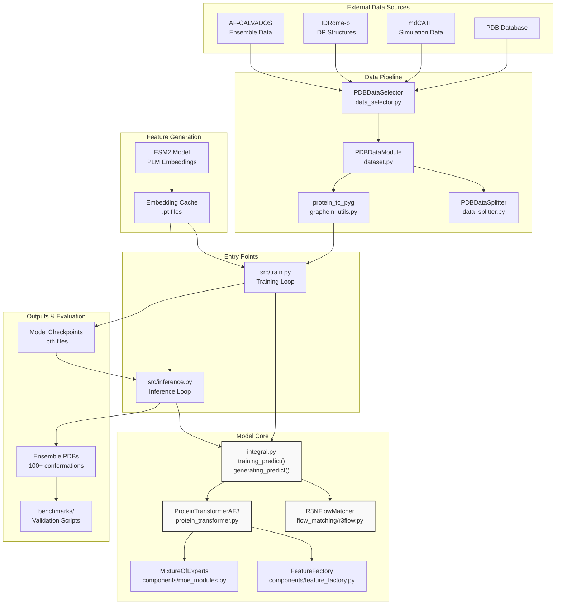
```mermaid
graph TB
    subgraph "External Data Sources"
        PDB["PDB Database"]
        MDCATH["mdCATH<br/>Simulation Data"]
        IDROME["IDRome-o<br/>IDP Structures"]
        AFCALVADOS["AF-CALVADOS<br/>Ensemble Data"]
    end
    
    subgraph "Data Pipeline<br/>(src/data/)"
        SELECTOR["PDBDataSelector<br/>data_selector.py"]
        MODULE["PDBDataModule<br/>dataset.py"]
        PROCESSOR["protein_to_pyg<br/>graphein_utils.py"]
        SPLITS["PDBDataSplitter<br/>data_splitter.py"]
    end
    
    subgraph "Feature Generation"
        PLM["ESM2 Model<br/>PLM Embeddings"]
        EMBCACHE["Embedding Cache<br/>.pt files"]
    end
    
    subgraph "Model Core<br/>(src/model/)"
        INTEGRAL["integral.py<br/>training_predict()<br/>generating_predict()"]
        TRANSFORMER["ProteinTransformerAF3<br/>protein_transformer.py"]
        FLOWMATCH["R3NFlowMatcher<br/>flow_matching/r3flow.py"]
        MOE["MixtureOfExperts<br/>components/moe_modules.py"]
        FEATURES["FeatureFactory<br/>components/feature_factory.py"]
    end
    
    subgraph "Entry Points"
        TRAIN["src/train.py<br/>Training Loop"]
        INFERENCE["src/inference.py<br/>Inference Loop"]
    end
    
    subgraph "Outputs & Evaluation"
        CKPT["Model Checkpoints<br/>.pth files"]
        ENSEMBLES["Ensemble PDBs<br/>100+ conformations"]
        EVAL["benchmarks/<br/>Validation Scripts"]
    end
    
    PDB --> SELECTOR
    MDCATH --> SELECTOR
    IDROME --> SELECTOR
    AFCALVADOS --> SELECTOR
    
    SELECTOR --> MODULE
    MODULE --> PROCESSOR
    MODULE --> SPLITS
    
    PROCESSOR --> TRAIN
    PLM --> EMBCACHE
    EMBCACHE --> TRAIN
    
    TRAIN --> INTEGRAL
    INTEGRAL --> TRANSFORMER
    TRANSFORMER --> MOE
    TRANSFORMER --> FEATURES
    INTEGRAL --> FLOWMATCH
    
    TRAIN --> CKPT
    CKPT --> INFERENCE
    
    INFERENCE --> INTEGRAL
    EMBCACHE --> INFERENCE
    
    INFERENCE --> ENSEMBLES
    ENSEMBLES --> EVAL
    
    style INTEGRAL fill:#f9f9f9,stroke:#333,stroke-width:2px
    style TRANSFORMER fill:#f9f9f9,stroke:#333,stroke-width:2px
    style FLOWMATCH fill:#f9f9f9,stroke:#333,stroke-width:2px
```

**System Architecture: Major Components and Code Entities**

This diagram maps the high-level system components to their corresponding code files and key functions. The system flows from external data sources through data preparation, into the model core, and produces checkpoints and ensembles for evaluation.

Sources: [README.md:1-14](), [src/train.py:1-50](), [src/inference.py:1-50](), [src/model/integral.py:1-100]()

## Core Workflows

IDPFold2 operates in two primary modes: **Training** and **Inference**. These workflows share common components but have distinct objectives and data flows.

### Training Workflow

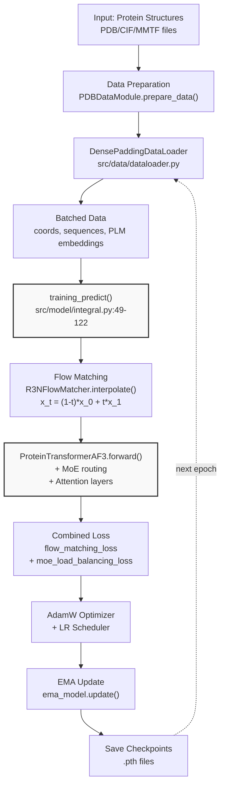
```mermaid
graph TB
    START["Input: Protein Structures<br/>PDB/CIF/MMTF files"]
    
    PREP["Data Preparation<br/>PDBDataModule.prepare_data()"]
    
    LOADER["DensePaddingDataLoader<br/>src/data/dataloader.py"]
    
    BATCH["Batched Data<br/>coords, sequences, PLM embeddings"]
    
    TRAINPRED["training_predict()<br/>src/model/integral.py:49-122"]
    
    INTERPOLATE["Flow Matching<br/>R3NFlowMatcher.interpolate()<br/>x_t = (1-t)*x_0 + t*x_1"]
    
    FORWARD["ProteinTransformerAF3.forward()<br/>+ MoE routing<br/>+ Attention layers"]
    
    LOSS["Combined Loss<br/>flow_matching_loss<br/>+ moe_load_balancing_loss"]
    
    OPT["AdamW Optimizer<br/>+ LR Scheduler"]
    
    EMA["EMA Update<br/>ema_model.update()"]
    
    SAVE["Save Checkpoints<br/>.pth files"]
    
    START --> PREP
    PREP --> LOADER
    LOADER --> BATCH
    BATCH --> TRAINPRED
    TRAINPRED --> INTERPOLATE
    INTERPOLATE --> FORWARD
    FORWARD --> LOSS
    LOSS --> OPT
    OPT --> EMA
    EMA --> SAVE
    SAVE -.next epoch.-> LOADER
    
    style TRAINPRED fill:#f9f9f9,stroke:#333,stroke-width:2px
    style FORWARD fill:#f9f9f9,stroke:#333,stroke-width:2px
```

**Training Workflow: From Structures to Model Checkpoints**

The training workflow processes protein structures through data preparation, batches them for efficient processing, performs flow matching-based training with the transformer model and MoE, computes combined losses, optimizes parameters, maintains exponential moving average (EMA) weights, and saves checkpoints.

Sources: [src/train.py:97-200](), [src/model/integral.py:49-122](), [src/data/dataset.py:1-100]()

### Inference Workflow

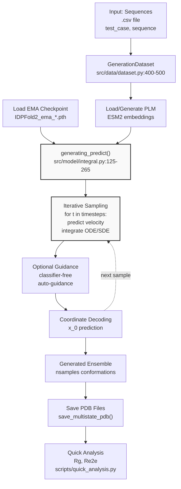
```mermaid
graph TB
    SEQINPUT["Input: Sequences<br/>.csv file<br/>test_case, sequence"]
    
    GENDATASET["GenerationDataset<br/>src/data/dataset.py:400-500"]
    
    PLMLOAD["Load/Generate PLM<br/>ESM2 embeddings"]
    
    CKPTLOAD["Load EMA Checkpoint<br/>IDPFold2_ema_*.pth"]
    
    GENPRED["generating_predict()<br/>src/model/integral.py:125-265"]
    
    SAMPLE["Iterative Sampling<br/>for t in timesteps:<br/>  predict velocity<br/>  integrate ODE/SDE"]
    
    GUIDANCE["Optional Guidance<br/>classifier-free<br/>auto-guidance"]
    
    DECODE["Coordinate Decoding<br/>x_0 prediction"]
    
    ENSEMBLE["Generated Ensemble<br/>nsamples conformations"]
    
    SAVEPDBS["Save PDB Files<br/>save_multistate_pdb()"]
    
    ANALYSIS["Quick Analysis<br/>Rg, Re2e<br/>scripts/quick_analysis.py"]
    
    SEQINPUT --> GENDATASET
    GENDATASET --> PLMLOAD
    CKPTLOAD --> GENPRED
    PLMLOAD --> GENPRED
    GENPRED --> SAMPLE
    SAMPLE --> GUIDANCE
    GUIDANCE --> DECODE
    DECODE -.next sample.-> SAMPLE
    DECODE --> ENSEMBLE
    ENSEMBLE --> SAVEPDBS
    SAVEPDBS --> ANALYSIS
    
    style GENPRED fill:#f9f9f9,stroke:#333,stroke-width:2px
    style SAMPLE fill:#f9f9f9,stroke:#333,stroke-width:2px
```

**Inference Workflow: From Sequences to Conformational Ensembles**

The inference workflow takes protein sequences as input, loads or generates PLM embeddings, loads a trained EMA checkpoint, performs iterative flow matching sampling with optional guidance mechanisms, decodes coordinates to generate multiple conformations, saves them as PDB files, and provides quick structural analysis.

Sources: [src/inference.py:1-200](), [src/model/integral.py:125-265](), [scripts/quick_analysis.py:1-50]()

## Key Components

### Data Pipeline

The data pipeline transforms raw protein structures into model-ready tensors through several stages:

| Component | File Path | Purpose |
|-----------|-----------|---------|
| **PDBDataSelector** | `src/data/data_selector.py` | Filters PDB structures by resolution, length, experiment type |
| **PDBDataModule** | `src/data/dataset.py` | Orchestrates data preparation, splitting, and loading |
| **PDBDataSplitter** | `src/data/data_splitter.py` | Creates train/val splits using sequence similarity clustering |
| **protein_to_pyg** | `src/utils/graphein_utils.py` | Converts protein structures to PyTorch Geometric format |
| **DensePaddingDataLoader** | `src/data/dataloader.py` | Batches variable-length proteins with dense padding |
| **GenerationDataset** | `src/data/dataset.py` | Prepares sequences and embeddings for inference |

For detailed information, see [Data Pipeline](#4).

Sources: [src/data/data_selector.py:1-100](), [src/data/dataset.py:1-500](), [src/data/dataloader.py:1-100]()

### Model Architecture

The core model consists of multiple integrated components:

| Component | File Path | Key Functionality |
|-----------|-----------|-------------------|
| **ProteinTransformerAF3** | `src/model/protein_transformer.py` | Main transformer architecture with 10 layers, 12 attention heads |
| **R3NFlowMatcher** | `src/model/flow_matching/r3flow.py` | Flow matching framework for generative modeling |
| **MixtureOfExperts** | `src/model/components/moe_modules.py` | 5 experts with top-2 routing for conditional computation |
| **FeatureFactory** | `src/model/components/feature_factory.py` | Generates sequence and pair features from inputs |
| **AdaptiveLayerNorm** | `src/model/components/adaln.py` | Time-conditioned normalization layers |
| **DenseMultiheadAttention** | `src/model/components/attention.py` | Multi-head attention with pair bias |

For detailed information, see [Model Architecture](#5).

Sources: [src/model/protein_transformer.py:1-200](), [src/model/flow_matching/r3flow.py:1-150](), [src/model/components/moe_modules.py:1-200]()

### Training Components

The training system manages the optimization process:

| Component | File Path | Key Functionality |
|-----------|-----------|-------------------|
| **training_predict** | `src/model/integral.py:49-122` | Computes flow matching predictions during training |
| **FlowMatchingLoss** | `src/model/integral.py` | Loss function for flow matching objective |
| **MoELoadBalancingLoss** | `src/model/components/moe_modules.py` | Auxiliary loss for expert load balancing |
| **AdamW Optimizer** | `src/train.py` | Parameter optimization |
| **AlphaFold3Scheduler** | `src/model/lr_schedulers.py` | Learning rate scheduling strategy |
| **EMA Wrapper** | `src/utils/ema.py` | Exponential moving average for stable inference |

For detailed information, see [Training](#6).

Sources: [src/model/integral.py:49-122](), [src/train.py:150-250](), [src/model/lr_schedulers.py:1-100]()

### Inference Components

The inference system generates conformational ensembles:

| Component | File Path | Key Functionality |
|-----------|-----------|-------------------|
| **generating_predict** | `src/model/integral.py:125-265` | Iterative sampling for structure generation |
| **ClassifierFreeGuidance** | `src/model/integral.py` | Conditional generation with guidance scaling |
| **AutoGuidance** | `src/model/integral.py` | Secondary model-based guidance |
| **save_multistate_pdb** | `src/utils/pdb_utils.py` | Writes ensemble to PDB format with MODEL/ENDMDL |
| **Multi-device inference** | `src/inference.py` | Distributed generation with torchrun |

For detailed information, see [Inference](#7).

Sources: [src/model/integral.py:125-265](), [src/inference.py:1-200](), [src/utils/pdb_utils.py:1-150]()

### Evaluation Tools

The evaluation suite validates generated ensembles:

| Component | File Path | Purpose |
|-----------|-----------|---------|
| **quick_analysis.py** | `scripts/quick_analysis.py` | Calculates Rg and Re2e for ensembles |
| **compare_to_multi_conf.py** | `benchmarks/compare_to_multi_conf.py` | RMSD and native contact analysis vs BioEmu |
| **analyze_saxs_integrative.py** | `benchmarks/analyze_saxs_integrative.py` | SAXS profile reweighting |
| **analyze_cs_integrative.py** | `benchmarks/analyze_cs_integrative.py` | Chemical shift reweighting |
| **analyze_pre_integrative.py** | `benchmarks/analyze_pre_integrative.py` | PRE data reweighting |
| **analyze_rdc_integrative.py** | `benchmarks/analyze_rdc_integrative.py` | RDC data reweighting |
| **_cg2all.py** | `scripts/_cg2all.py` | Backmapping to all-atom structures |

For detailed information, see [Evaluation and Analysis](#8).

Sources: [scripts/quick_analysis.py:1-50](), [benchmarks/compare_to_multi_conf.py:1-100](), [scripts/_cg2all.py:1-50]()

## Data Flow

The following diagram illustrates how data flows through the IDPFold2 system from raw input to final output:

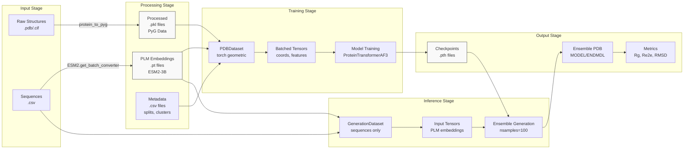
```mermaid
graph LR
    subgraph "Input Stage"
        RAWPDB["Raw Structures<br/>.pdb/.cif"]
        RAWSEQ["Sequences<br/>.csv"]
    end
    
    subgraph "Processing Stage"
        PKL["Processed<br/>.pkl files<br/>PyG Data"]
        EMB["PLM Embeddings<br/>.pt files<br/>ESM2-3B"]
        META["Metadata<br/>.csv files<br/>splits, clusters"]
    end
    
    subgraph "Training Stage"
        TRAINDATASET["PDBDataset<br/>torch geometric"]
        TRAINBATCH["Batched Tensors<br/>coords, features"]
        MODEL["Model Training<br/>ProteinTransformerAF3"]
    end
    
    subgraph "Inference Stage"
        INFERDATASET["GenerationDataset<br/>sequences only"]
        INFERBATCH["Input Tensors<br/>PLM embeddings"]
        GENERATE["Ensemble Generation<br/>nsamples=100"]
    end
    
    subgraph "Output Stage"
        CKPT["Checkpoints<br/>.pth files"]
        PDB["Ensemble PDB<br/>MODEL/ENDMDL"]
        METRICS["Metrics<br/>Rg, Re2e, RMSD"]
    end
    
    RAWPDB -->|"protein_to_pyg"| PKL
    RAWSEQ -->|"ESM2.get_batch_converter"| EMB
    
    PKL --> TRAINDATASET
    EMB --> TRAINDATASET
    META --> TRAINDATASET
    TRAINDATASET --> TRAINBATCH
    TRAINBATCH --> MODEL
    MODEL --> CKPT
    
    RAWSEQ --> INFERDATASET
    EMB --> INFERDATASET
    CKPT --> GENERATE
    INFERDATASET --> INFERBATCH
    INFERBATCH --> GENERATE
    GENERATE --> PDB
    PDB --> METRICS
    
    style PKL fill:#f9f9f9,stroke:#333,stroke-width:1px
    style EMB fill:#f9f9f9,stroke:#333,stroke-width:1px
    style CKPT fill:#f9f9f9,stroke:#333,stroke-width:1px
```

**Data Flow: Processing Pipeline from Input to Output**

This diagram shows the transformation of data through IDPFold2. Raw structures are converted to PyTorch Geometric format and cached as `.pkl` files. PLM embeddings are generated using ESM2 and cached as `.pt` files. During training, these are combined with metadata and batched for the model, producing checkpoints. During inference, sequences are combined with cached embeddings to generate ensembles saved as PDB files, which can then be analyzed.

Sources: [src/utils/graphein_utils.py:1-200](), [scripts/get_esm_embedding.py:1-100](), [src/data/dataset.py:1-500]()

## Technical Approach

IDPFold2 employs two key technical innovations for protein ensemble generation:

### Flow Matching Framework

The system uses **continuous normalizing flows** implemented via the `R3NFlowMatcher` class to model the distribution of protein conformations. The approach:

1. **Interpolates** between initial noise distribution `x_0` and target structure `x_1` at time `t`:
   ```
   x_t = (1 - t) * x_0 + t * x_1
   ```

2. **Predicts velocity field** `v_t` that describes how coordinates should move at each timestep

3. **Samples** by integrating the learned vector field from `t=1` to `t=0` using ODE/SDE solvers

This is implemented in `R3NFlowMatcher.interpolate()` for training and `R3NFlowMatcher.sample()` for generation.

Sources: [src/model/flow_matching/r3flow.py:1-150](), [src/model/integral.py:49-265]()

### Mixture of Experts Architecture

The system integrates a **Mixture of Experts (MoE)** layer into each transformer block to handle the heterogeneous nature of protein structures (ordered vs. disordered, monomers vs. multimers):

- **5 expert networks** provide specialized processing capabilities
- **Top-2 routing** activates 2 experts per token for conditional computation
- **Load balancing loss** ensures experts are utilized evenly across the batch
- **Capacity factors** control how many tokens each expert can process

The MoE implementation supports both PyTorch-native and MegaBlocks-accelerated versions, configured in `configs/train.yaml`.

Sources: [src/model/components/moe_modules.py:1-200](), [README.md:46-58]()

## Configuration System

IDPFold2 uses **Hydra** for configuration management with YAML files:

- **`configs/train.yaml`**: Training parameters including model architecture, data settings, optimizer configuration, and conditioning strategies
- **`configs/inference.yaml`**: Inference parameters including sampling settings, guidance options, and output configuration

Configuration parameters can be overridden via command line:
```bash
python src/train.py batch_size=8 epochs=500 data.data_dir=/path/to/data
```

For complete configuration reference, see [Configuration Reference](#10).

Sources: [configs/train.yaml:1-200](), [configs/inference.yaml:1-100](), [README.md:34-58]()

## Directory Structure

The codebase is organized into the following key directories:

| Directory | Purpose |
|-----------|---------|
| `src/` | Core implementation code |
| `src/data/` | Data loading, processing, and transformation |
| `src/model/` | Model architecture and training logic |
| `src/model/components/` | Modular components (MoE, attention, features) |
| `src/model/flow_matching/` | Flow matching implementation |
| `src/utils/` | Utility functions for PDB I/O, distributed training |
| `src/common/` | Constants and shared definitions |
| `configs/` | Hydra configuration files |
| `scripts/` | Standalone scripts for preprocessing and analysis |
| `benchmarks/` | Evaluation scripts for validation against experimental data |
| `megablocks/` | Optional accelerated MoE implementation |

Sources: [README.md:1-284]()

## Getting Started

To begin using IDPFold2:

1. **Installation**: Set up the environment and download model weights - see [Getting Started](#2)
2. **Run Inference**: Generate ensembles for your sequences - see [Inference](#7)
3. **Train a Model**: Build custom models on your data - see [Training](#6)
4. **Evaluate Results**: Validate generated structures - see [Evaluation and Analysis](#8)

For quick testing, you can run inference on example sequences:
```bash
python src/inference.py \
    prefix=TEST \
    ckpt_dir=IDPFold2_ema_0.999_260114.pth \
    plm_emb_dir=./embeddings \
    csv_dir=data/example.csv \
    nsamples=100
```

Sources: [README.md:65-114]()

---

# Page: Getting Started

# Getting Started

<details>
<summary>Relevant source files</summary>

The following files were used as context for generating this wiki page:

- [README.md](README.md)
- [environment.yaml](environment.yaml)
- [src/model/components/moe_modules_torch.py](src/model/components/moe_modules_torch.py)
- [src/model/components/moe_operations.py](src/model/components/moe_operations.py)
- [src/utils/dense_dataloader_utils.py](src/utils/dense_dataloader_utils.py)

</details>


This page provides practical instructions for setting up IDPFold2 and running your first inference or training job. It covers installation, basic usage patterns for generating protein conformational ensembles, and initial evaluation of results.

For detailed information about the underlying model architecture, see [Model Architecture](#5). For comprehensive training configuration options, see [Training](#6). For advanced inference features like guidance mechanisms, see [Inference](#7).

## Installation

### Prerequisites

IDPFold2 requires Python 3.11 and PyTorch 2.0+. The system uses PyTorch Geometric for graph-based protein representation and ESM2 for protein language model embeddings.

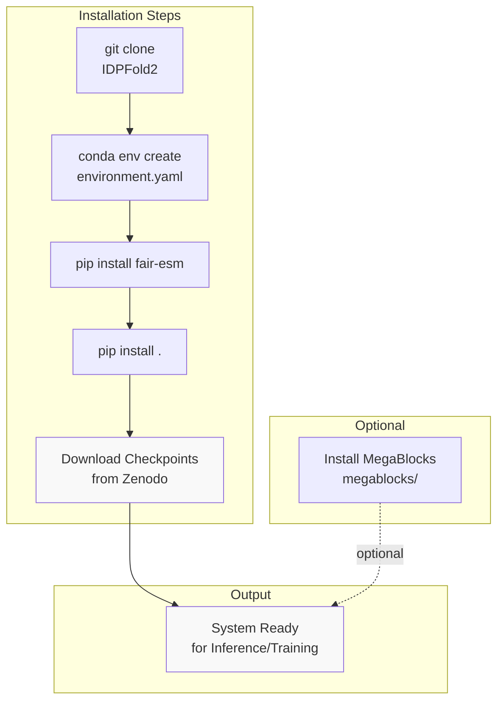
```mermaid
graph TB
    subgraph "Installation Steps"
        CLONE["git clone<br/>IDPFold2"]
        ENV["conda env create<br/>environment.yaml"]
        ESM["pip install fair-esm"]
        INSTALL["pip install ."]
        WEIGHTS["Download Checkpoints<br/>from Zenodo"]
    end
    
    subgraph "Optional"
        MEGA["Install MegaBlocks<br/>megablocks/"]
    end
    
    subgraph "Output"
        READY["System Ready<br/>for Inference/Training"]
    end
    
    CLONE --> ENV
    ENV --> ESM
    ESM --> INSTALL
    INSTALL --> WEIGHTS
    WEIGHTS --> READY
    
    MEGA -.optional.-> READY
    
    style WEIGHTS fill:#f9f9f9
    style READY fill:#f9f9f9
```

**Sources:** [README.md:34-58](), [environment.yaml:1-29]()

### Environment Setup

Create and activate the conda environment using the provided configuration:

```bash
git clone https://github.com/Junjie-Zhu/IDPFold2
cd IDPFold2
conda env create -f environment.yml
conda activate idpfold2
```

The `environment.yaml` file specifies all core dependencies including PyTorch 2.4.1, PyTorch Geometric 2.6.1, and MMseqs2 for sequence similarity clustering.

**Sources:** [environment.yaml:1-29]()

### Dependency Installation

Install the ESM2 protein language model and the IDPFold2 package:

```bash
pip install fair-esm
pip install .
```

**Optional:** For accelerated Mixture of Experts computation (not required for inference):

```bash
cd megablocks
pip install .
```

Note: MegaBlocks may raise undefined symbol errors on some systems. The torch-based MoE implementation in [src/model/components/moe_modules_torch.py]() is used by default and is functionally equivalent.

**Sources:** [README.md:42-58](), [src/model/components/moe_modules_torch.py:48-107]()

### Model Checkpoints

Download the pretrained weights from [Zenodo](https://zenodo.org/records/18239596):

| Checkpoint | Purpose | Required For |
|------------|---------|--------------|
| `IDPFold2_ema_0.999_260114.pth` | EMA weights for inference | Inference only, or as EMA checkpoint for training |
| `IDPFold2_260114.pth` | Model weights for training | Training/fine-tuning only |

The EMA (Exponential Moving Average) checkpoint contains stabilized weights optimized for generation quality. For inference, only the EMA checkpoint is required. For training or fine-tuning, both checkpoints are needed.

**Sources:** [README.md:60-63]()

## Running Inference

### Input Data Format

Inference requires a CSV file with two columns: `test_case` (system name) and `sequence` (amino acid sequence). The system handles monomers and multimers differently based on the sequence format.

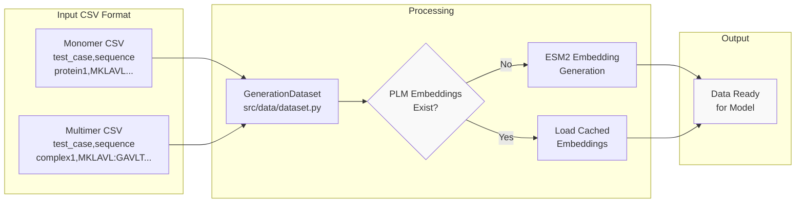
```mermaid
graph LR
    subgraph "Input CSV Format"
        MONO_CSV["Monomer CSV<br/>test_case,sequence<br/>protein1,MKLAVL..."]
        MULTI_CSV["Multimer CSV<br/>test_case,sequence<br/>complex1,MKLAVL:GAVLT..."]
    end
    
    subgraph "Processing"
        GEN_DATASET["GenerationDataset<br/>src/data/dataset.py"]
        PLM_CHECK{"PLM Embeddings<br/>Exist?"}
        ESM_GEN["ESM2 Embedding<br/>Generation"]
        PLM_LOAD["Load Cached<br/>Embeddings"]
    end
    
    subgraph "Output"
        DATA_READY["Data Ready<br/>for Model"]
    end
    
    MONO_CSV --> GEN_DATASET
    MULTI_CSV --> GEN_DATASET
    GEN_DATASET --> PLM_CHECK
    PLM_CHECK -->|No| ESM_GEN
    PLM_CHECK -->|Yes| PLM_LOAD
    ESM_GEN --> DATA_READY
    PLM_LOAD --> DATA_READY
    
    style PLM_CHECK fill:#f9f9f9
    style DATA_READY fill:#f9f9f9
```

**Monomer format:** Single sequence per row
```csv
test_case,sequence
alpha_synuclein,MDVFMKGLSKAKEGVVAAAEKTKQGVAEAAGKTKEGVLYVGSKTKEGVVHGVATVAEKTKEQVTNVGGAVVTGVTAVAQKTVEGAGSIAAATGFVKKDQLGKNEEGAPQEGILEDMPVDPDNEAYEMPSEEGYQDYEPEA
```

**Multimer format:** Multiple sequences separated by `:`
```csv
test_case,sequence
complex1,MDVFMKGLSKAK:GAVLTGVTAVAQKTV
```

**Sources:** [README.md:67-69](), [README.md:96-98]()

### Monomer Inference

The basic inference command for generating conformational ensembles:

```bash
python src/inference.py \
    prefix=MONOMER \
    ckpt_dir=/PATH/TO/CHECKPOINT/IDPFold2_ema_0.999_260114.pth \
    plm_emb_dir=./embeddings \
    csv_dir=/PATH/TO/INPUT/SEQUENCES \
    nsamples=100 \
    max_batch_length=6000
```

**Key parameters:**

| Parameter | Description | Default/Example |
|-----------|-------------|-----------------|
| `prefix` | Output file prefix | `MONOMER` |
| `ckpt_dir` | Path to EMA checkpoint `.pth` file | Required |
| `plm_emb_dir` | Directory for PLM embeddings | `./embeddings` |
| `csv_dir` | Input CSV file path | Required |
| `nsamples` | Number of conformations to generate | `100` |
| `max_batch_length` | Max residues per batch (controls memory) | `6000` |

The `max_batch_length` parameter controls memory usage. For a 120-residue protein with `nsamples=100`, setting `max_batch_length=6000` generates 50 samples per iteration. The value of 6000 works for all test proteins on 64GB devices.

**Sources:** [README.md:71-88]()

### Inference Workflow

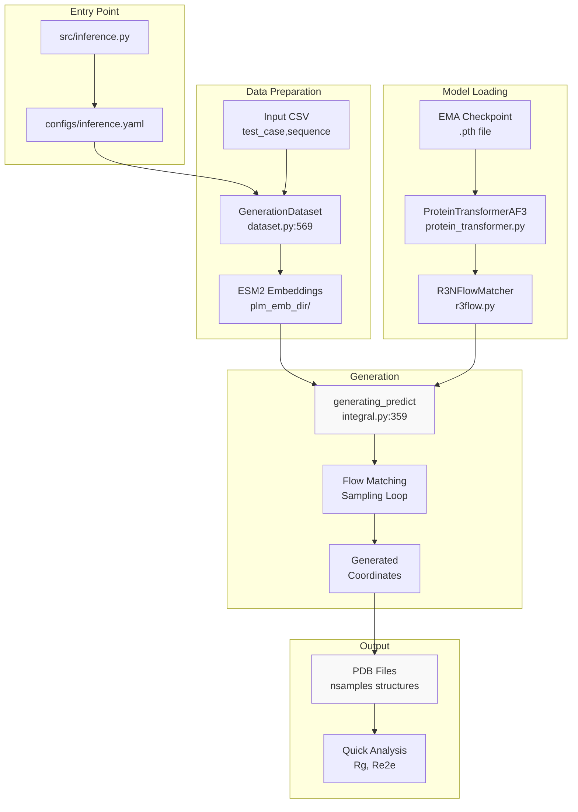
```mermaid
graph TB
    subgraph "Entry Point"
        INFERENCE_PY["src/inference.py"]
        CONFIG["configs/inference.yaml"]
    end
    
    subgraph "Data Preparation"
        CSV["Input CSV<br/>test_case,sequence"]
        GEN_DS["GenerationDataset<br/>dataset.py:569"]
        PLM_EMB["ESM2 Embeddings<br/>plm_emb_dir/"]
    end
    
    subgraph "Model Loading"
        CKPT["EMA Checkpoint<br/>.pth file"]
        MODEL["ProteinTransformerAF3<br/>protein_transformer.py"]
        FLOW["R3NFlowMatcher<br/>r3flow.py"]
    end
    
    subgraph "Generation"
        GEN_PRED["generating_predict<br/>integral.py:359"]
        SAMPLE["Flow Matching<br/>Sampling Loop"]
        COORDS["Generated<br/>Coordinates"]
    end
    
    subgraph "Output"
        PDB_OUT["PDB Files<br/>nsamples structures"]
        ANALYSIS["Quick Analysis<br/>Rg, Re2e"]
    end
    
    INFERENCE_PY --> CONFIG
    CONFIG --> GEN_DS
    CSV --> GEN_DS
    GEN_DS --> PLM_EMB
    
    CKPT --> MODEL
    MODEL --> FLOW
    PLM_EMB --> GEN_PRED
    FLOW --> GEN_PRED
    
    GEN_PRED --> SAMPLE
    SAMPLE --> COORDS
    COORDS --> PDB_OUT
    PDB_OUT --> ANALYSIS
    
    style GEN_PRED fill:#f9f9f9
    style PDB_OUT fill:#f9f9f9
```

The inference pipeline follows this sequence:
1. **Data Loading:** `GenerationDataset` loads sequences and PLM embeddings
2. **Model Initialization:** Loads `ProteinTransformerAF3` with `R3NFlowMatcher` from checkpoint
3. **Generation:** `generating_predict` performs iterative flow matching to sample conformations
4. **Output:** Saves structures as PDB files with multiple MODEL entries

**Sources:** [README.md:71-94](), [src/inference.py]() (implied from README structure)

### Multimer Inference

For protein complexes with multiple chains, use `load_multimer=True`:

```bash
python src/inference.py \
    prefix=MULTIMER \
    ckpt_dir=/PATH/TO/CHECKPOINT/IDPFold2_ema_0.999_260114.pth \
    plm_emb_dir=./embeddings \
    csv_dir=/PATH/TO/INPUT/SEQUENCES \
    nsamples=100 \
    max_batch_length=6000 \
    load_multimer=True
```

The multimer mode processes chains separately for PLM embedding generation but models inter-chain contacts during generation. Chains are separated by `:` in the input CSV.

**Important:** Monomers and multimers cannot be processed in the same run. Use separate CSV files and runs with/without the `load_multimer` flag.

**Sources:** [README.md:96-113]()

### Multi-Device Inference

For faster generation using multiple GPUs, use `torchrun`:

```bash
torchrun --nproc-per-node=4 src/inference.py \
    prefix=MULTIMER \
    ckpt_dir=/PATH/TO/CHECKPOINT/IDPFold2_ema_0.999_260114.pth \
    plm_emb_dir=./embeddings \
    csv_dir=/PATH/TO/INPUT/SEQUENCES \
    nsamples=100
```

**Note:** With fixed random seeds, each device generates identical samples. For diverse ensembles, adjust seed settings or generate different sample counts per device.

**Sources:** [README.md:90-94]()

### Output Structure

Generated ensembles are saved as PDB files with multiple MODEL entries:

```
output_dir/
├── MONOMER_protein1.pdb    # Contains nsamples MODEL entries
├── MONOMER_protein2.pdb
└── ...
```

Each PDB file contains `nsamples` conformations in standard PDB format with MODEL/ENDMDL delimiters. Coordinates are in Ångströms, representing coarse-grained Cα positions.

**Sources:** [README.md:71-113]() (implied from inference description)

## Training Models

### Training Data Requirements

Training requires preprocessed protein structures in `.pkl` format. The data directory structure must contain:

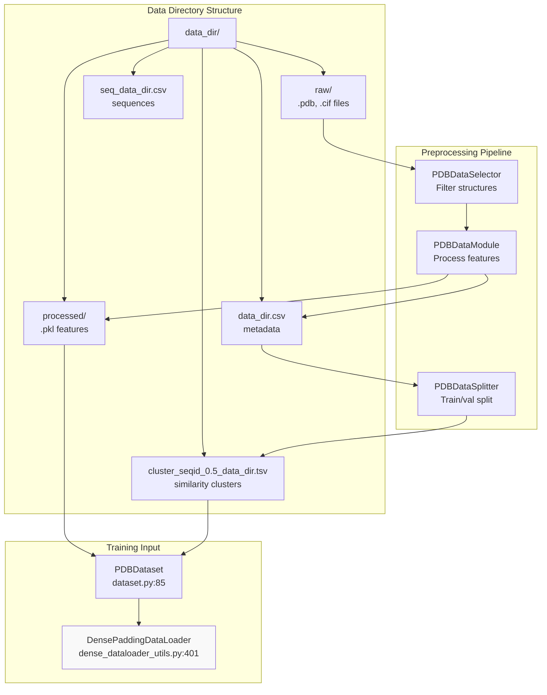
```mermaid
graph TB
    subgraph "Data Directory Structure"
        ROOT["data_dir/"]
        RAW["raw/<br/>.pdb, .cif files"]
        PROCESSED["processed/<br/>.pkl features"]
        META["data_dir.csv<br/>metadata"]
        SEQ["seq_data_dir.csv<br/>sequences"]
        CLUSTER["cluster_seqid_0.5_data_dir.tsv<br/>similarity clusters"]
    end
    
    subgraph "Preprocessing Pipeline"
        SELECT["PDBDataSelector<br/>Filter structures"]
        DATAMOD["PDBDataModule<br/>Process features"]
        SPLIT["PDBDataSplitter<br/>Train/val split"]
    end
    
    subgraph "Training Input"
        DATASET["PDBDataset<br/>dataset.py:85"]
        LOADER["DensePaddingDataLoader<br/>dense_dataloader_utils.py:401"]
    end
    
    ROOT --> RAW
    ROOT --> PROCESSED
    ROOT --> META
    ROOT --> SEQ
    ROOT --> CLUSTER
    
    RAW --> SELECT
    SELECT --> DATAMOD
    DATAMOD --> PROCESSED
    DATAMOD --> META
    META --> SPLIT
    SPLIT --> CLUSTER
    
    PROCESSED --> DATASET
    CLUSTER --> DATASET
    DATASET --> LOADER
    
    style LOADER fill:#f9f9f9
```

**Sources:** [README.md:115-181](), [src/utils/dense_dataloader_utils.py:401-447]()

### Data Preprocessing

Two preprocessing options are available:

**Option 1: PDB Data (Automatic Download)**

Uncomment the data preprocessing code in [src/train.py:97-142](). Configure `PDBDataSelector` parameters:

```python
dataselector = PDBDataSelector(
    data_dir=args.data.data_dir,
    molecule_type="protein",                    # Only proteins
    experiment_types=["diffraction", "EM"],     # X-ray and cryo-EM
    min_length=args.data.min_length,
    max_length=args.data.max_length,
    best_resolution=args.data.best_resolution,
    worst_resolution=args.data.worst_resolution,
    remove_non_standard_residues=True,
    remove_pdb_unavailable=True
)
```

**Option 2: Custom Data**

For simulation data (mdCATH, IDRome-o, AF-CALVADOS), place `.pdb` or `.cif` files in `data_dir/raw/` and run training directly. The system will process structures on first run.

**Sources:** [README.md:119-160]()

### Training Configuration

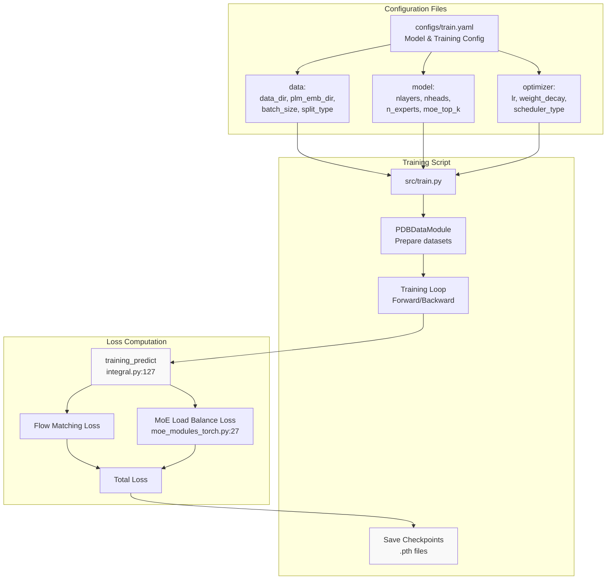
```mermaid
graph TB
    subgraph "Configuration Files"
        TRAIN_YAML["configs/train.yaml<br/>Model & Training Config"]
        DATA_CFG["data:<br/>data_dir, plm_emb_dir,<br/>batch_size, split_type"]
        MODEL_CFG["model:<br/>nlayers, nheads,<br/>n_experts, moe_top_k"]
        OPT_CFG["optimizer:<br/>lr, weight_decay,<br/>scheduler_type"]
    end
    
    subgraph "Training Script"
        TRAIN_PY["src/train.py"]
        DATAMOD["PDBDataModule<br/>Prepare datasets"]
        TRAINER["Training Loop<br/>Forward/Backward"]
        CHECKPOINT["Save Checkpoints<br/>.pth files"]
    end
    
    subgraph "Loss Computation"
        TRAIN_PRED["training_predict<br/>integral.py:127"]
        FM_LOSS["Flow Matching Loss"]
        MOE_LOSS["MoE Load Balance Loss<br/>moe_modules_torch.py:27"]
        TOTAL["Total Loss"]
    end
    
    TRAIN_YAML --> DATA_CFG
    TRAIN_YAML --> MODEL_CFG
    TRAIN_YAML --> OPT_CFG
    
    DATA_CFG --> TRAIN_PY
    MODEL_CFG --> TRAIN_PY
    OPT_CFG --> TRAIN_PY
    
    TRAIN_PY --> DATAMOD
    DATAMOD --> TRAINER
    TRAINER --> TRAIN_PRED
    TRAIN_PRED --> FM_LOSS
    TRAIN_PRED --> MOE_LOSS
    FM_LOSS --> TOTAL
    MOE_LOSS --> TOTAL
    TOTAL --> CHECKPOINT
    
    style TRAIN_PRED fill:#f9f9f9
    style CHECKPOINT fill:#f9f9f9
```

**Sources:** [README.md:162-183](), [src/model/components/moe_modules_torch.py:27-45]()

### Training from Scratch

Basic training command:

```bash
python src/train.py \
    task_prefix=HYBRID_TRAIN \
    batch_size=8 \
    epochs=500 \
    data.data_dir=/PATH/TO/DATASET \
    data.plm_emb_dir=/PATH/TO/EMBEDDING
```

**Critical parameters:**

| Parameter | Description | Notes |
|-----------|-------------|-------|
| `data.data_dir` | Root dataset directory | Must contain raw/, processed/, metadata files |
| `data.plm_emb_dir` | PLM embedding directory | Extract embeddings first using `scripts/get_esm_embedding.py` |
| `batch_size` | Structures per batch | Adjust based on GPU memory |
| `epochs` | Training epochs | 500 recommended for full training |

**Distributed training:** Use `torchrun` for multi-GPU training on a single machine:

```bash
torchrun --nproc-per-node=4 src/train.py \
    task_prefix=HYBRID_TRAIN \
    batch_size=8 \
    epochs=500
```

**Important:** Multi-machine distributed training is not supported due to device-level load balancing requirements in the MoE implementation.

**Sources:** [README.md:162-183]()

### Fine-tuning from Pretrained Checkpoints

To fine-tune from the pretrained IDPFold2 model, both checkpoints are required:

```bash
python src/train.py \
    task_prefix=FINETUNE \
    resume.ckpt_dir=/PATH/TO/IDPFold2_260114.pth \
    resume.ema_dir=/PATH/TO/IDPFold2_ema_0.999_260114.pth \
    resume.load_model_only=False \
    data.data_dir=/PATH/TO/CUSTOM_DATA \
    data.plm_emb_dir=/PATH/TO/EMBEDDINGS
```

The `resume.load_model_only=False` parameter ensures optimizer state is also restored. Set to `True` if starting fresh optimization.

**Sources:** [README.md:196-206]()

### Training with Multimer Data

To include multimer structures during training, provide a contact file and specify the proportion:

```bash
python src/train.py \
    task_prefix=HYBRID_TRAIN \
    data.complex_dir=/PATH/TO/contacts.csv \
    data.complex_prop=0.8 \
    ...
```

The `contacts.csv` file contains inter-chain contact information. Multimers are assembled on-the-fly during training with probability `complex_prop`.

**Sources:** [README.md:185-194]()

## Quick Evaluation

### Structural Metrics

Calculate radius of gyration (Rg) and end-to-end distance (Re2e) for generated ensembles:

```bash
python scripts/quick_analysis.py /PATH/TO/GENERATED/ENSEMBLE
```

This script computes ensemble averages of basic structural properties directly from the coarse-grained coordinates.

**Sources:** [README.md:208-216]()

### Backmapping to All-Atom

Convert coarse-grained ensembles to all-atom structures using [cg2all](https://github.com/huhlim/cg2all):

```bash
# Verify cg2all installation
convert_cg2all

# Run backmapping
export OMP_NUM_THREAD=2
python scripts/_cg2all.py \
    -i /PATH/TO/GENERATED/ENSEMBLE \
    -o /PATH/TO/OUTPUT/STRUCTURES \
    --num_proc 20
```

Adjust `OMP_NUM_THREAD` and `num_proc` based on available CPU cores. The recommended setting (2 threads × 20 processes) works well for 40-core systems.

**Sources:** [README.md:218-229]()

### Evaluation Pipeline

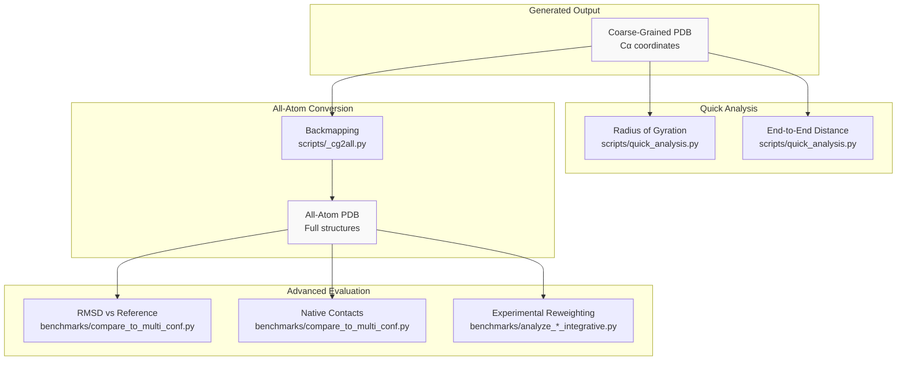
```mermaid
graph TB
    subgraph "Generated Output"
        CG_PDB["Coarse-Grained PDB<br/>Cα coordinates"]
    end
    
    subgraph "Quick Analysis"
        RG["Radius of Gyration<br/>scripts/quick_analysis.py"]
        RE2E["End-to-End Distance<br/>scripts/quick_analysis.py"]
    end
    
    subgraph "All-Atom Conversion"
        CG2ALL["Backmapping<br/>scripts/_cg2all.py"]
        AA_PDB["All-Atom PDB<br/>Full structures"]
    end
    
    subgraph "Advanced Evaluation"
        RMSD["RMSD vs Reference<br/>benchmarks/compare_to_multi_conf.py"]
        CONTACTS["Native Contacts<br/>benchmarks/compare_to_multi_conf.py"]
        REWEIGHT["Experimental Reweighting<br/>benchmarks/analyze_*_integrative.py"]
    end
    
    CG_PDB --> RG
    CG_PDB --> RE2E
    CG_PDB --> CG2ALL
    
    CG2ALL --> AA_PDB
    AA_PDB --> RMSD
    AA_PDB --> CONTACTS
    AA_PDB --> REWEIGHT
    
    style CG_PDB fill:#f9f9f9
    style AA_PDB fill:#f9f9f9
```

**Sources:** [README.md:208-268]()

### RMSD and Native Contact Analysis

For comparison against [BioEmu-Benchmarks](https://github.com/microsoft/bioemu-benchmarks):

```bash
python benchmarks/compare_to_multi_conf.py /PATH/TO/GENERATED/ENSEMBLE
```

This script calculates:
- Local RMSD against reference conformations
- Global RMSD across the ensemble
- Fraction of native contacts (for unfolding cases)

Download BioEmu benchmark data before running.

**Sources:** [README.md:231-237]()

### Experimental Data Reweighting

Reweight ensembles using experimental observables from [PeptoneDB](https://zenodo.org/record/17306061):

```bash
# Analyze SAXS and Chemical Shifts
python benchmarks/analyze_saxs_integrative.py \
    -i /PATH/TO/SAXS/PROFILES \
    -e /PATH/TO/EXP/DATA

python benchmarks/analyze_cs_integrative.py \
    -i /PATH/TO/CS/PROFILES \
    -e /PATH/TO/EXP/DATA \
    --bmrb_path cs_stat_aa_filt.csv \
    --info_path PeptoneDB-Integrative.csv

# Analyze PRE and RDC (requires SAXS/CS reweighting info)
python benchmarks/analyze_pre_integrative.py \
    -i /PATH/TO/SAXS/PROFILES \
    -e /PATH/TO/EXP/DATA \
    --pre_path /PATH/TO/PRE/PROFILES

python benchmarks/analyze_rdc_integrative.py \
    -i /PATH/TO/CS/PROFILES \
    -e /PATH/TO/EXP/DATA \
    --rdc_path /PATH/TO/RDC/PROFILES \
    --info_path PeptoneDB-Integrative.csv
```

The reweighting pipeline uses pre-calculated SAXS or CS weights to refine PRE and RDC predictions, following the PeptoneBench protocols.

**Sources:** [README.md:239-268]()

## Next Steps

After completing the setup and basic workflows:

- **For model architecture details:** See [Model Architecture](#5) for `ProteinTransformerAF3`, `R3NFlowMatcher`, and `MoE` components
- **For training configuration:** See [Training Configuration](#10.1) for complete parameter reference
- **For inference options:** See [Inference](#7) for guidance mechanisms, sampling strategies, and advanced features
- **For data preparation:** See [Data Pipeline](#4) for detailed data processing workflows

**Sources:** This section provides navigation context based on the wiki structure.

---

# Page: Core Concepts

# Core Concepts

<details>
<summary>Relevant source files</summary>

The following files were used as context for generating this wiki page:

- [README.md](README.md)
- [src/data/dataset.py](src/data/dataset.py)
- [src/model/components/feature_factory.py](src/model/components/feature_factory.py)
- [src/model/flow_matching/r3flow.py](src/model/flow_matching/r3flow.py)
- [src/model/integral.py](src/model/integral.py)

</details>


This page explains the fundamental concepts underlying IDPFold2's approach to protein conformational ensemble generation. We cover the generative modeling framework based on flow matching, protein structure representation, mixture of experts architecture, and how these components interact during training and inference.

For implementation details of specific components, see [Model Architecture](#5) for the neural network architecture, [Training](#6) for the training pipeline, and [Inference](#7) for generation procedures.

---

## Generative Modeling Framework

IDPFold2 models protein conformational ensembles as a generative problem using **flow matching** on 3D coordinate space. The system learns a continuous transformation from a simple noise distribution to the complex distribution of protein structures.

### Overview

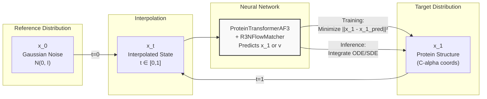
```mermaid
graph LR
    subgraph Reference Distribution
        X0["x_0<br/>Gaussian Noise<br/>N(0, I)"]
    end
    
    subgraph Interpolation
        XT["x_t<br/>Interpolated State<br/>t ∈ [0,1]"]
    end
    
    subgraph Target Distribution
        X1["x_1<br/>Protein Structure<br/>(C-alpha coords)"]
    end
    
    subgraph Neural Network
        MODEL["ProteinTransformerAF3<br/>+ R3NFlowMatcher<br/>Predicts x_1 or v"]
    end
    
    X0 -->|"t=0"| XT
    X1 -->|"t=1"| XT
    XT --> MODEL
    MODEL -->|"Training:<br/>Minimize ||x_1 - x_1_pred||²"| X1
    MODEL -->|"Inference:<br/>Integrate ODE/SDE"| X1
    
    style MODEL fill:#f9f9f9,stroke:#333,stroke-width:2px
```

**Key Principles:**

| Concept | Description | Code Reference |
|---------|-------------|----------------|
| **Reference Distribution** | Standard Gaussian noise in (R³)^n space | [src/model/flow_matching/r3flow.py:365-398]() |
| **Target Distribution** | Real protein structures (C-alpha coordinates) | [src/data/dataset.py:474-495]() |
| **Interpolation** | Linear interpolation x_t = (1-t)x_0 + t·x_1 | [src/model/flow_matching/r3flow.py:106-136]() |
| **Vector Field** | Neural network learns v = dx_t/dt | [src/model/flow_matching/r3flow.py:163-194]() |

Sources: [src/model/flow_matching/r3flow.py:1-666](), [src/model/integral.py:1-403](), [README.md:6-12]()

---

## Flow Matching on (R³)^n

Flow matching learns a time-dependent vector field that transforms noise into structured data. IDPFold2 implements flow matching specifically for protein C-alpha coordinates.

### Interpolation Scheme

The system uses **stochastic interpolation** between reference (x_0) and target (x_1) distributions:

```
x_t = (1 - t) * x_0 + t * x_1,  where t ∈ [0, 1]
```

**Centering Constraint:** All coordinates are zero-centered (center of mass = 0) to remove translational degrees of freedom.

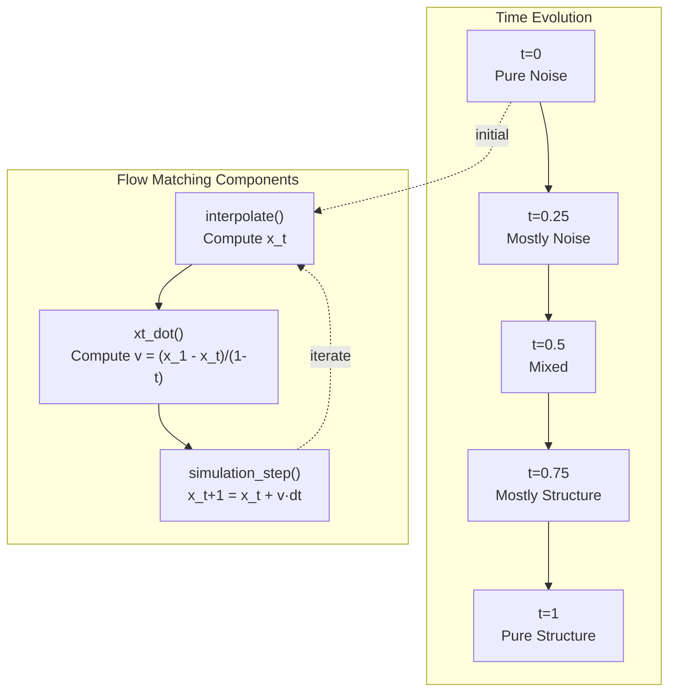
```mermaid
graph TB
    subgraph Time Evolution
        T0["t=0<br/>Pure Noise"]
        T25["t=0.25<br/>Mostly Noise"]
        T50["t=0.5<br/>Mixed"]
        T75["t=0.75<br/>Mostly Structure"]
        T1["t=1<br/>Pure Structure"]
    end
    
    T0 --> T25
    T25 --> T50
    T50 --> T75
    T75 --> T1
    
    subgraph Flow Matching Components
        INTERP["interpolate()<br/>Compute x_t"]
        XTDOT["xt_dot()<br/>Compute v = (x_1 - x_t)/(1-t)"]
        STEP["simulation_step()<br/>x_t+1 = x_t + v·dt"]
    end
    
    T0 -.initial.-> INTERP
    INTERP --> XTDOT
    XTDOT --> STEP
    STEP -.iterate.-> INTERP
```

### Vector Field Prediction

The neural network predicts either:
- **x_1** (clean structure directly): Used for direct prediction
- **v** (velocity field): Used for flow matching loss

The relationship is: `v = (x_1 - x_t) / (1 - t)`

**Training Loss:**
```
L_fm = mean(||x_1 - x_1_pred||² * weight(t))
weight(t) = 1 / ((1-t)² + ε)
```

This weighting emphasizes later timesteps where the model refines structure details.

Sources: [src/model/flow_matching/r3flow.py:106-136](), [src/model/flow_matching/r3flow.py:163-194](), [src/model/integral.py:174-201]()

### Sampling Modes

During inference, two integration schemes are available:

| Mode | Integration Type | Equation | Use Case |
|------|-----------------|----------|----------|
| **vf** | ODE | dx_t = v(x_t, t) dt | Standard generation |
| **sc** | SDE | dx_t = [v + g(t)·s]dt + √(2g(t))dw_t | Stochastic/low-temp sampling |

The **score** s(x_t, t) is derived from the vector field: `s = (t·v - x_t) / ((1-t)·scale_ref²)`

Sources: [src/model/flow_matching/r3flow.py:251-334](), [src/model/flow_matching/r3flow.py:335-363]()

### Scheduling

Time discretization schedules control sampling quality:

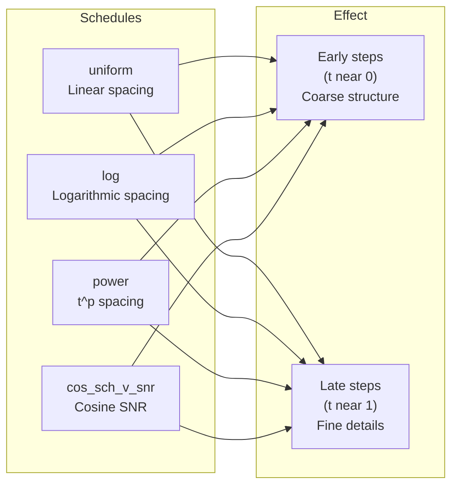
```mermaid
graph LR
    subgraph Schedules
        UNIFORM["uniform<br/>Linear spacing"]
        LOG["log<br/>Logarithmic spacing"]
        POWER["power<br/>t^p spacing"]
        COSINE["cos_sch_v_snr<br/>Cosine SNR"]
    end
    
    subgraph Effect
        EARLY["Early steps<br/>(t near 0)<br/>Coarse structure"]
        LATE["Late steps<br/>(t near 1)<br/>Fine details"]
    end
    
    UNIFORM --> EARLY
    UNIFORM --> LATE
    LOG --> EARLY
    LOG --> LATE
    POWER --> EARLY
    POWER --> LATE
    COSINE --> EARLY
    COSINE --> LATE
```

The `get_schedule()` function implements multiple discretization strategies. Log scheduling allocates more steps to early denoising phases.

Sources: [src/model/flow_matching/r3flow.py:612-666](), [src/model/flow_matching/r3flow.py:551-610]()

---

## Protein Structure Representation

IDPFold2 operates on coarse-grained protein representations using C-alpha atom coordinates.

### Coordinate Format

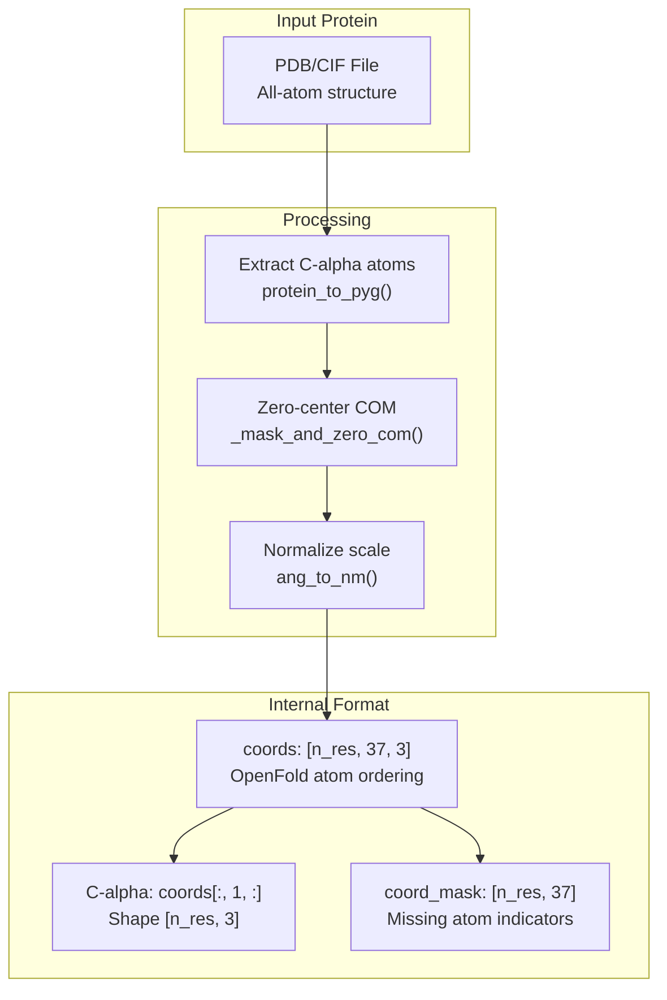
```mermaid
graph TB
    subgraph Input Protein
        PDB["PDB/CIF File<br/>All-atom structure"]
    end
    
    subgraph Processing
        EXTRACT["Extract C-alpha atoms<br/>protein_to_pyg()"]
        CENTER["Zero-center COM<br/>_mask_and_zero_com()"]
        NORMALIZE["Normalize scale<br/>ang_to_nm()"]
    end
    
    subgraph Internal Format
        COORDS["coords: [n_res, 37, 3]<br/>OpenFold atom ordering"]
        CA["C-alpha: coords[:, 1, :]<br/>Shape [n_res, 3]"]
        MASK["coord_mask: [n_res, 37]<br/>Missing atom indicators"]
    end
    
    PDB --> EXTRACT
    EXTRACT --> CENTER
    CENTER --> NORMALIZE
    NORMALIZE --> COORDS
    COORDS --> CA
    COORDS --> MASK
```

**Key Details:**

- **Atom Convention**: Coordinates use OpenFold ordering, not PDB ordering. Conversion is applied via `PDB_TO_OPENFOLD_INDEX_TENSOR`.
- **C-alpha Focus**: Position index 1 in the 37-atom representation corresponds to C-alpha.
- **Units**: Internally uses nanometers (nm), converted from Ångströms via `ang_to_nm_scale = 10.0`.
- **Masking**: Boolean masks handle variable-length proteins and missing atoms.

Sources: [src/data/dataset.py:474-495](), [src/model/integral.py:13-16](), [src/model/integral.py:158-172](), [src/common/atom37_constants.py]()

### Feature Representation

Proteins are represented as graphs with sequence and pair features:

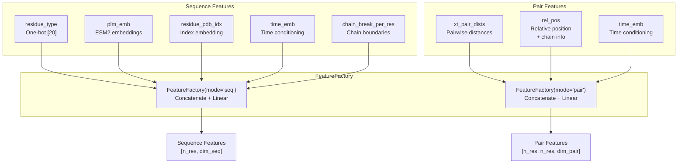
```mermaid
graph TB
    subgraph Sequence Features
        RESIDUE["residue_type<br/>One-hot [20]"]
        PLM["plm_emb<br/>ESM2 embeddings"]
        RESIDX["residue_pdb_idx<br/>Index embedding"]
        TIME["time_emb<br/>Time conditioning"]
        CHAIN["chain_break_per_res<br/>Chain boundaries"]
    end
    
    subgraph Pair Features
        DIST["xt_pair_dists<br/>Pairwise distances"]
        RELPOS["rel_pos<br/>Relative position<br/>+ chain info"]
        TIMEPAIR["time_emb<br/>Time conditioning"]
    end
    
    subgraph FeatureFactory
        SEQFACTORY["FeatureFactory(mode='seq')<br/>Concatenate + Linear"]
        PAIRFACTORY["FeatureFactory(mode='pair')<br/>Concatenate + Linear"]
    end
    
    RESIDUE --> SEQFACTORY
    PLM --> SEQFACTORY
    RESIDX --> SEQFACTORY
    TIME --> SEQFACTORY
    CHAIN --> SEQFACTORY
    
    DIST --> PAIRFACTORY
    RELPOS --> PAIRFACTORY
    TIMEPAIR --> PAIRFACTORY
    
    SEQFACTORY --> OUTPUT1["Sequence Features<br/>[n_res, dim_seq]"]
    PAIRFACTORY --> OUTPUT2["Pair Features<br/>[n_res, n_res, dim_pair]"]
```

The `FeatureFactory` class dynamically composes features based on configuration:

| Feature Type | Input | Output Dimension | Purpose |
|--------------|-------|------------------|---------|
| `res_type` | Residue identity (0-19) | 20 | One-hot amino acid type |
| `plm_emb` | ESM2 embeddings | Configurable (default 1280→256) | Sequence context |
| `res_idx` | Residue index | Configurable | Positional information |
| `time_emb` | Timestep t | Configurable | Flow matching time |
| `xt_pair_dists` | C-alpha distances | Configurable | Spatial geometry |
| `rel_pos` | Chain + residue offset | 2 + 2·(r_max + 1) | Relative position |

Sources: [src/model/components/feature_factory.py:303-425](), [src/model/components/feature_factory.py:74-295]()

### Data Processing Pipeline

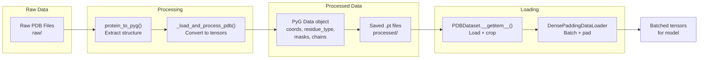
```mermaid
graph LR
    subgraph Raw Data
        RAWPDB["Raw PDB Files<br/>raw/"]
    end
    
    subgraph Processing
        GRAPHEIN["protein_to_pyg()<br/>Extract structure"]
        PROCESS["_load_and_process_pdb()<br/>Convert to tensors"]
    end
    
    subgraph Processed Data
        GRAPH["PyG Data object<br/>coords, residue_type,<br/>masks, chains"]
        PKL["Saved .pt files<br/>processed/"]
    end
    
    subgraph Loading
        DATASET["PDBDataset.__getitem__()<br/>Load + crop"]
        LOADER["DensePaddingDataLoader<br/>Batch + pad"]
    end
    
    RAWPDB --> GRAPHEIN
    GRAPHEIN --> PROCESS
    PROCESS --> GRAPH
    GRAPH --> PKL
    PKL --> DATASET
    DATASET --> LOADER
    LOADER --> BATCH["Batched tensors<br/>for model"]
```

Sources: [src/data/dataset.py:822-891](), [src/utils/graphein_utils.py](), [src/utils/dense_dataloader_utils.py]()

---

## Mixture of Experts (MoE)

IDPFold2 uses MoE layers to model heterogeneous protein dynamics by routing different inputs to specialized expert networks.

### MoE Architecture

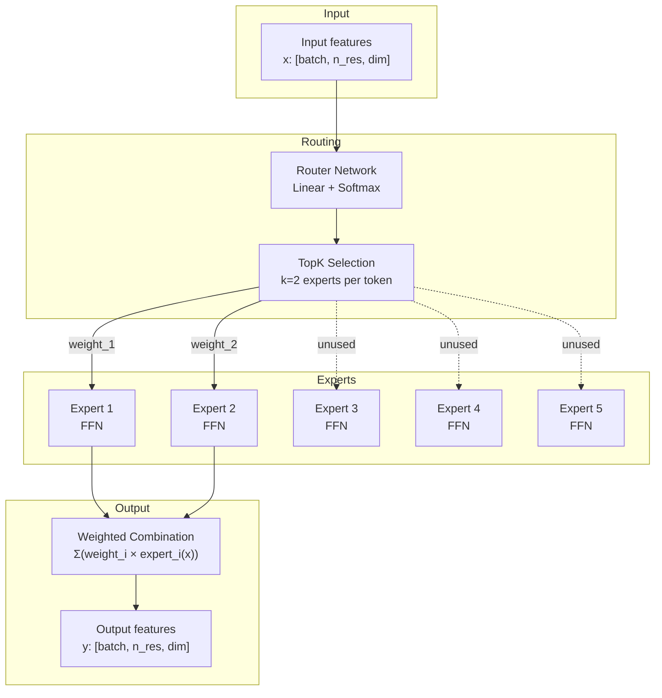
```mermaid
graph TB
    subgraph Input
        X["Input features<br/>x: [batch, n_res, dim]"]
    end
    
    subgraph Routing
        ROUTER["Router Network<br/>Linear + Softmax"]
        TOPK["TopK Selection<br/>k=2 experts per token"]
    end
    
    subgraph Experts
        E1["Expert 1<br/>FFN"]
        E2["Expert 2<br/>FFN"]
        E3["Expert 3<br/>FFN"]
        E4["Expert 4<br/>FFN"]
        E5["Expert 5<br/>FFN"]
    end
    
    subgraph Output
        COMBINE["Weighted Combination<br/>Σ(weight_i × expert_i(x))"]
        Y["Output features<br/>y: [batch, n_res, dim]"]
    end
    
    X --> ROUTER
    ROUTER --> TOPK
    TOPK -->|"weight_1"| E1
    TOPK -->|"weight_2"| E2
    TOPK -.unused.-> E3
    TOPK -.unused.-> E4
    TOPK -.unused.-> E5
    
    E1 --> COMBINE
    E2 --> COMBINE
    COMBINE --> Y
```

**Configuration:**
- **Number of Experts**: 5 (configurable via `n_experts`)
- **Active Experts**: 2 per token (configurable via `top_k`)
- **Routing**: Softmax-based with learned weights
- **Load Balancing**: Auxiliary loss encourages uniform expert usage

Sources: [src/model/components/moe_modules.py](), [src/model/integral.py:232-236]()

### Load Balancing Loss

To prevent expert collapse (all tokens routed to few experts), a load balancing loss is computed:

```
L_moe = weight · balance_loss(routing_weights, num_layers, num_experts, top_k)
```

This loss is accumulated during forward passes and added to the flow matching loss during training.

Sources: [src/model/integral.py:232-236](), [src/model/integral.py:298-314]()

### MoE Conditioning

During training, MoE can be conditioned on additional labels (e.g., CATH, TED):

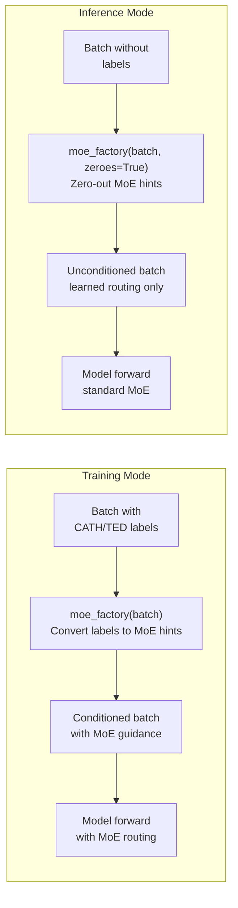
```mermaid
graph LR
    subgraph Training Mode
        BATCH["Batch with<br/>CATH/TED labels"]
        MOEFACTORY["moe_factory(batch)<br/>Convert labels to MoE hints"]
        CONDITIONED["Conditioned batch<br/>with MoE guidance"]
        MODEL["Model forward<br/>with MoE routing"]
    end
    
    subgraph Inference Mode
        BATCHINF["Batch without<br/>labels"]
        ZEROES["moe_factory(batch, zeroes=True)<br/>Zero-out MoE hints"]
        UNCOND["Unconditioned batch<br/>learned routing only"]
        MODELINF["Model forward<br/>standard MoE"]
    end
    
    BATCH --> MOEFACTORY
    MOEFACTORY --> CONDITIONED
    CONDITIONED --> MODEL
    
    BATCHINF --> ZEROES
    ZEROES --> UNCOND
    UNCOND --> MODELINF
```

During inference, MoE conditioning can be zeroed out to rely on learned routing patterns.

Sources: [src/model/integral.py:54-60](), [src/model/integral.py:274-275]()

---

## Training vs Inference Predict Functions

The core prediction logic differs between training and inference modes.

### training_predict()

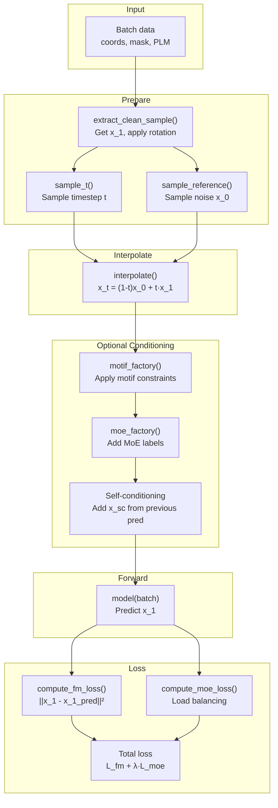
```mermaid
graph TB
    subgraph Input
        BATCH["Batch data<br/>coords, mask, PLM"]
    end
    
    subgraph Prepare
        EXTRACT["extract_clean_sample()<br/>Get x_1, apply rotation"]
        SAMPLET["sample_t()<br/>Sample timestep t"]
        SAMPLEX0["sample_reference()<br/>Sample noise x_0"]
    end
    
    subgraph Interpolate
        INTERP["interpolate()<br/>x_t = (1-t)x_0 + t·x_1"]
    end
    
    subgraph Optional Conditioning
        MOTIF["motif_factory()<br/>Apply motif constraints"]
        MOE["moe_factory()<br/>Add MoE labels"]
        SC["Self-conditioning<br/>Add x_sc from previous pred"]
    end
    
    subgraph Forward
        MODEL["model(batch)<br/>Predict x_1"]
    end
    
    subgraph Loss
        FMLOSS["compute_fm_loss()<br/>||x_1 - x_1_pred||²"]
        MOELOSS["compute_moe_loss()<br/>Load balancing"]
        TOTAL["Total loss<br/>L_fm + λ·L_moe"]
    end
    
    BATCH --> EXTRACT
    EXTRACT --> SAMPLET
    EXTRACT --> SAMPLEX0
    SAMPLET --> INTERP
    SAMPLEX0 --> INTERP
    INTERP --> MOTIF
    MOTIF --> MOE
    MOE --> SC
    SC --> MODEL
    MODEL --> FMLOSS
    MODEL --> MOELOSS
    FMLOSS --> TOTAL
    MOELOSS --> TOTAL
```

**Key Operations:**

1. **Random Rotation**: Training data is augmented with random SO(3) rotations
2. **Time Sampling**: Timestep t sampled from uniform, logit-normal, or beta distributions
3. **Interpolation**: Create noisy intermediate state x_t
4. **Conditioning**: Apply motif, MoE, or self-conditioning (probabilistic)
5. **Prediction**: Model predicts clean structure x_1
6. **Loss**: Compute flow matching + MoE losses

Sources: [src/model/integral.py:238-321](), [src/model/integral.py:121-135](), [src/model/integral.py:93-118]()

### generating_predict()

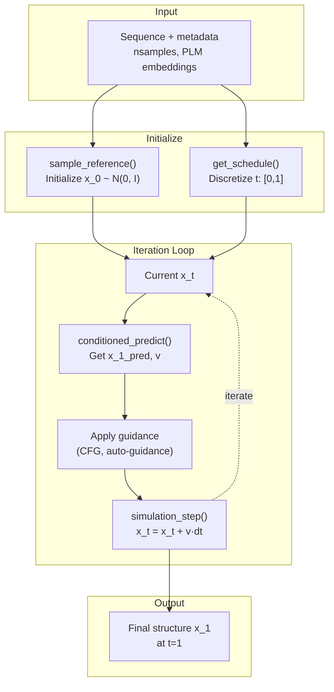
```mermaid
graph TB
    subgraph Input
        SEQ["Sequence + metadata<br/>nsamples, PLM embeddings"]
    end
    
    subgraph Initialize
        X0["sample_reference()<br/>Initialize x_0 ~ N(0, I)"]
        SCHEDULE["get_schedule()<br/>Discretize t: [0,1]"]
    end
    
    subgraph Iteration Loop
        XT["Current x_t"]
        FORWARD["conditioned_predict()<br/>Get x_1_pred, v"]
        GUIDANCE["Apply guidance<br/>(CFG, auto-guidance)"]
        STEP["simulation_step()<br/>x_t = x_t + v·dt"]
    end
    
    subgraph Output
        X1["Final structure x_1<br/>at t=1"]
    end
    
    SEQ --> X0
    SEQ --> SCHEDULE
    X0 --> XT
    SCHEDULE --> XT
    XT --> FORWARD
    FORWARD --> GUIDANCE
    GUIDANCE --> STEP
    STEP -.iterate.-> XT
    STEP --> X1
```

**Key Operations:**

1. **Initialization**: Sample noise x_0 from reference distribution
2. **Schedule**: Discretize time [0,1] into steps (e.g., log, cosine)
3. **Iterative Refinement**: At each step:
   - Predict vector field v(x_t, t)
   - Apply guidance (optional)
   - Integrate: x_{t+dt} = x_t + v·dt
4. **Self-Conditioning**: Optionally use previous prediction x_1_pred as input
5. **Output**: Return refined structure at t=1

Sources: [src/model/integral.py:323-402](), [src/model/integral.py:41-91](), [src/model/flow_matching/r3flow.py:400-549]()

### Comparison Table

| Aspect | Training | Inference |
|--------|----------|-----------|
| **Input** | Ground truth structure x_1 | Sequence only |
| **Timestep** | Random t ~ distribution | Sequential t: 0→1 |
| **Direction** | Any t (single step) | Forward integration 0→1 |
| **Augmentation** | Random rotation | None |
| **Conditioning** | Motif, MoE, self-cond (probabilistic) | Guidance, self-cond (systematic) |
| **Output** | Loss for optimization | Generated structure |
| **Function** | `training_predict()` | `generating_predict()` |

Sources: [src/model/integral.py:238-321](), [src/model/integral.py:323-402]()

---

## Guidance Mechanisms

Inference supports several guidance techniques to improve generation quality.

### Classifier-Free Guidance (CFG)

```mermaid
graph TB
    subgraph Conditional
        COND["Conditioned forward<br/>with PLM embeddings"]
        PREDCOND["x_1_cond"]
    end
    
    subgraph Unconditional
        UNCOND["Unconditioned forward<br/>without PLM embeddings"]
        PREDUNCOND["x_1_uncond"]
    end
    
    subgraph Guidance
        COMBINE["x_1_guided = w·x_1_cond +<br/>(1-w)·x_1_uncond"]
        WEIGHT["w = guidance_weight<br/>(e.g., 1.5)"]
    end
    
    COND --> PREDCOND
    UNCOND --> PREDUNCOND
    PREDCOND --> COMBINE
    PREDUNCOND --> COMBINE
    WEIGHT --> COMBINE
    COMBINE --> FINAL["Enhanced prediction"]
```

CFG amplifies the effect of conditioning by contrasting conditional and unconditional predictions. Weight > 1 strengthens conditioning influence.

Sources: [src/model/integral.py:65-87]()

### Auto-Guidance

Uses a secondary model to guide generation:

```
x_1_guided = w·x_1_main + (1-w)·(α·x_1_auto + (1-α)·x_1_uncond)
```

This combines predictions from the main model, an auto-guidance model, and unconditional baseline.

Sources: [src/model/integral.py:66-72]()

### Self-Conditioning

During iterative generation, the previous prediction can be fed as additional input:

```mermaid
graph LR
    STEP1["Step i<br/>Predict x_1_pred"]
    STEP2["Step i+1<br/>Input: x_t, x_sc=x_1_pred"]
    STEP3["Step i+2<br/>Input: x_t, x_sc=x_1_pred_new"]
    
    STEP1 --> STEP2
    STEP2 --> STEP3
```

This allows the model to refine predictions based on previous estimates.

Sources: [src/model/integral.py:286-289](), [src/model/integral.py:526-527]()

---

## Summary

IDPFold2's core concepts integrate to form a powerful generative framework:

1. **Flow Matching**: Continuous transformation from noise to structure via learned vector fields
2. **Protein Representation**: C-alpha coordinates with rich sequence and pair features (PLM embeddings, distances, positional encoding)
3. **Mixture of Experts**: Conditional computation for heterogeneous protein dynamics with load balancing
4. **Training**: Learns to denoise structures at random timesteps with various conditioning strategies
5. **Inference**: Iteratively refines structures from noise using ODE/SDE integration with guidance

These concepts are implemented across the model architecture ([ProteinTransformerAF3](#5.1)), flow matching framework ([R3NFlowMatcher](#5.3)), and data pipeline ([Data Pipeline](#4)), working together to generate diverse conformational ensembles.

---

# Page: Data Pipeline

# Data Pipeline

<details>
<summary>Relevant source files</summary>

The following files were used as context for generating this wiki page:

- [src/data/dataset.py](src/data/dataset.py)
- [src/model/flow_matching/r3flow.py](src/model/flow_matching/r3flow.py)

</details>


## Purpose and Scope

The Data Pipeline is responsible for transforming raw protein structure data into model-ready batches for training and inference. This includes data selection and filtering, train/val splitting with sequence similarity clustering, coordinate processing, PLM embedding integration, and efficient batching with dense padding. The pipeline supports multiple data sources including PDB, mdCATH, IDRome, and AF-CALVADOS datasets.

For details on feature generation including PLM embeddings and coordinate transformations, see [Feature Generation](#4.2). For information on data augmentation and transforms, see [Data Transforms and Augmentation](#4.4). For batch loading mechanics, see [Data Loading and Batching](#4.3).

## Data Pipeline Overview

The data pipeline consists of four main classes that work together to prepare training data:

```mermaid
graph TB
    subgraph "Data Selection & Filtering"
        PDBDataSelector["PDBDataSelector<br/>create_dataset()"]
    end
    
    subgraph "Data Splitting"
        PDBDataSplitter["PDBDataSplitter<br/>split_data()"]
        ClusterSampler["ClusterSampler<br/>sequence similarity"]
    end
    
    subgraph "Data Processing"
        PDBDataModule["PDBDataModule<br/>prepare_data()<br/>setup()"]
        PDBManager["PDBManager<br/>metadata filtering"]
        DownloadPDB["download_pdb_multiprocessing()"]
        ProcessPDB["protein_to_pyg()"]
    end
    
    subgraph "Dataset & Loading"
        PDBDataset["PDBDataset<br/>__getitem__()"]
        DensePaddingDataLoader["DensePaddingDataLoader"]
    end
    
    PDBDataSelector --> PDBManager
    PDBDataSelector --> PDBDataModule
    PDBDataModule --> DownloadPDB
    DownloadPDB --> ProcessPDB
    PDBDataModule --> PDBDataSplitter
    PDBDataSplitter --> ClusterSampler
    PDBDataModule --> PDBDataset
    PDBDataset --> DensePaddingDataLoader
    
    style PDBDataModule fill:#f9f9f9,stroke:#333,stroke-width:2px
```

**Sources:** [src/data/dataset.py:46-1036]()

## Component Architecture

### Core Data Classes

| Class | Location | Purpose | Key Methods |
|-------|----------|---------|-------------|
| `PDBDataSelector` | [src/data/dataset.py:46-234]() | Filters PDB data by metadata criteria | `create_dataset()` |
| `PDBDataSplitter` | [src/data/dataset.py:236-336]() | Splits data with sequence similarity control | `split_data()` |
| `PDBDataset` | [src/data/dataset.py:338-626]() | PyTorch Dataset for protein structures | `__getitem__()`, cropping methods |
| `PDBDataModule` | [src/data/dataset.py:628-1036]() | Orchestrates entire pipeline | `prepare_data()`, `setup()` |

**Sources:** [src/data/dataset.py:1-1036]()

## Data Selection and Filtering

### PDBDataSelector

The `PDBDataSelector` class filters protein structures from the PDB based on various metadata criteria. It uses `PDBManager` from Graphein for metadata queries.

```mermaid
graph LR
    subgraph "Filtering Criteria"
        Fraction["fraction<br/>subsample ratio"]
        Length["min_length<br/>max_length"]
        Resolution["best_resolution<br/>worst_resolution"]
        ExpType["experiment_types<br/>X-ray, NMR, etc"]
        Oligomeric["oligomeric_min<br/>oligomeric_max"]
        Ligands["has_ligands<br/>remove_ligands"]
        Residues["remove_non_standard_residues"]
        Labels["labels<br/>uniprot_id, cath_code, ec_number"]
    end
    
    subgraph "Filtering Pipeline"
        Init["PDBManager.df<br/>all PDB entries"]
        Filter1["Apply filters sequentially"]
        Filter2["Remove unavailable PDBs"]
        Filter3["Exclude specific IDs"]
        Output["Filtered DataFrame"]
    end
    
    Fraction --> Filter1
    Length --> Filter1
    Resolution --> Filter1
    ExpType --> Filter1
    Oligomeric --> Filter1
    Ligands --> Filter1
    Residues --> Filter1
    Labels --> Filter1
    
    Init --> Filter1
    Filter1 --> Filter2
    Filter2 --> Filter3
    Filter3 --> Output
```

#### Key Parameters

The selector accepts the following filtering parameters during initialization:

- **`fraction`**: Subsample ratio for the dataset (default: 1.0)
- **`min_length`** / **`max_length`**: Sequence length constraints
- **`best_resolution`** / **`worst_resolution`**: Resolution thresholds in Angstroms
- **`experiment_types`**: List of allowed experimental methods (e.g., `["X-ray diffraction"]`)
- **`oligomeric_min`** / **`oligomeric_max`**: Number of chains in biological assembly
- **`molecule_type`**: Filter by molecule type (e.g., "protein")
- **`has_ligands`** / **`remove_ligands`**: Control presence of specific ligands
- **`remove_non_standard_residues`**: Boolean to exclude non-canonical amino acids
- **`labels`**: Include metadata labels like `"uniprot_id"`, `"cath_code"`, or `"ec_number"`
- **`exclude_ids`**: List of PDB IDs to exclude
- **`exclude_ids_from_file`**: Path to text file with IDs to exclude

**Sources:** [src/data/dataset.py:46-97]()

#### Filtering Process

The `create_dataset()` method applies filters sequentially:

1. Initialize `PDBManager` with the data directory [src/data/dataset.py:132-133]()
2. Subsample based on `fraction` if specified [src/data/dataset.py:139-142]()
3. Filter by experiment types [src/data/dataset.py:144-148]()
4. Apply length constraints [src/data/dataset.py:150-158]()
5. Filter by molecule type [src/data/dataset.py:160-165]()
6. Filter by oligomeric state [src/data/dataset.py:167-174]()
7. Filter by resolution [src/data/dataset.py:176-187]()
8. Handle ligand requirements [src/data/dataset.py:189-201]()
9. Remove non-standard residues if requested [src/data/dataset.py:203-206]()
10. Remove structures with unavailable PDB files [src/data/dataset.py:207-210]()
11. Remove structures without CATH codes if requested [src/data/dataset.py:211-215]()
12. Exclude specific IDs from list or file [src/data/dataset.py:217-231]()

Each filtering step logs the number of remaining chains, allowing tracking of data reduction.

**Sources:** [src/data/dataset.py:121-233]()

## Data Splitting Strategies

### PDBDataSplitter

The `PDBDataSplitter` class creates train/val/test splits using either random sampling or sequence similarity-based clustering to prevent data leakage.

```mermaid
graph TB
    subgraph "Split Types"
        Random["Random Split<br/>split_dataframe()"]
        SeqSim["Sequence Similarity<br/>mmseqs2 clustering"]
    end
    
    subgraph "Sequence Similarity Pipeline"
        Fasta["df_to_fasta()<br/>write sequences"]
        Cluster["cluster_sequences()<br/>mmseqs2"]
        ReadCluster["read_cluster_tsv()<br/>parse clusters"]
        SplitReps["split representatives<br/>random"]
        Expand["expand_cluster_splits()<br/>all members"]
    end
    
    subgraph "Output"
        TrainDF["train DataFrame"]
        ValDF["val DataFrame"]
        ClusterMap["cluster_id -> seq_ids mapping"]
    end
    
    Random --> TrainDF
    Random --> ValDF
    
    SeqSim --> Fasta
    Fasta --> Cluster
    Cluster --> ReadCluster
    ReadCluster --> SplitReps
    SplitReps --> Expand
    Expand --> TrainDF
    Expand --> ValDF
    Expand --> ClusterMap
```

#### Split Modes

**Random Split** (`split_type="random"`)

Randomly divides the dataset according to the specified `train_val_test` proportions. This is the simplest approach but may lead to data leakage if similar sequences appear in both training and validation sets.

Implementation: [src/data/dataset.py:283-288]()

**Sequence Similarity Split** (`split_type="sequence_similarity"`)

Clusters sequences by similarity using MMseqs2, then splits clusters to ensure training and validation sets contain dissimilar sequences. This prevents overfitting to sequence patterns.

Process:
1. Convert DataFrame to FASTA format [src/data/dataset.py:307]()
2. Run MMseqs2 clustering with specified similarity threshold [src/data/dataset.py:310-316]()
3. Select cluster representatives only [src/data/dataset.py:318-321]()
4. Randomly split representatives into train/val [src/data/dataset.py:322-324]()
5. Expand splits to include all cluster members [src/data/dataset.py:328-331]()

The `split_sequence_similarity` parameter controls the clustering threshold (e.g., 0.3 for 30% sequence identity).

**Sources:** [src/data/dataset.py:236-335](), [src/utils/cluster_utils.py]()

#### Output Structure

The `split_data()` method returns a tuple:
- **`dfs_splits`**: Dictionary mapping split names ("train", "val") to DataFrames
- **`clusterid_to_seqid_mappings`**: Dictionary mapping cluster IDs to sequence IDs (only for sequence similarity splits)

**Sources:** [src/data/dataset.py:273-335]()

## Dataset Implementation

### PDBDataset

The `PDBDataset` class is a PyTorch `Dataset` that loads processed protein structures and applies cropping, handles multimer complexes, and integrates PLM embeddings.

```mermaid
graph TB
    subgraph "Dataset Initialization"
        Params["pdb_codes<br/>chains<br/>data_dir<br/>plm_embedding<br/>complex_dir<br/>crop_size"]
        ComplexInfo["Load complex_chains.pkl<br/>or parse CSV"]
    end
    
    subgraph "__getitem__ Flow"
        GetItem["__getitem__(idx)"]
        LoadChain["process_single_chain()<br/>load .pt file"]
        LoadPLM["Load PLM embedding<br/>from plm_embedding dir"]
        CheckComplex["Check complex availability"]
        
        subgraph "Single Chain Path"
            CropSingle["continuous_crop()"]
        end
        
        subgraph "Multimer Path"
            GetCompanion["get_companion()<br/>random selection"]
            LoadCompanion["process_single_chain()<br/>companion"]
            Concat["concat_two_chains()"]
            CropMulti["spatial_crop()<br/>or multichain_continuous_crop()"]
        end
        
        Transform["Apply transforms"]
    end
    
    Params --> ComplexInfo
    GetItem --> LoadChain
    LoadChain --> LoadPLM
    LoadPLM --> CheckComplex
    
    CheckComplex -->|"No complex"| CropSingle
    CheckComplex -->|"Complex available"| GetCompanion
    GetCompanion --> LoadCompanion
    LoadCompanion --> Concat
    Concat --> CropMulti
    
    CropSingle --> Transform
    CropMulti --> Transform
```

**Sources:** [src/data/dataset.py:338-626]()

#### Initialization Parameters

| Parameter | Type | Purpose |
|-----------|------|---------|
| `pdb_codes` | `List[str]` | PDB codes to load |
| `chains` | `List[str]` | Specific chains (optional) |
| `data_dir` | `str` | Path to processed data directory |
| `plm_embedding` | `str` | Path to PLM embedding directory |
| `format` | `str` | File format (cif, pdb, mmtf) |
| `file_names` | `List[str]` | Processed file names |
| `complex_dir` | `str` | Path to complex pairing information |
| `complex_prop` | `float` | Probability of using multimer (default: 0.8) |
| `crop_size` | `int` | Maximum sequence length (default: 256) |
| `train_all_atom` | `bool` | Whether to train on all-atom structures |

**Sources:** [src/data/dataset.py:339-384]()

#### Data Loading Process

**Single Chain Processing**

The `process_single_chain()` method:
1. Loads the `.pt` file from the `processed/` directory [src/data/dataset.py:476]()
2. Filters to keep only essential keys: `residue_type`, `coord_mask`, `coords`, `residue_pdb_idx`, `chains` [src/data/dataset.py:479-480]()
3. Loads corresponding PLM embedding if available [src/data/dataset.py:482-490]()
4. Reorders coordinates from PDB to OpenFold convention [src/data/dataset.py:493-494]()

**Sources:** [src/data/dataset.py:474-495]()

**Multimer Handling**

For multimer training:
1. Check if the chain has complex pairing information [src/data/dataset.py:433-448]()
2. With probability `complex_prop`, retrieve a companion chain [src/data/dataset.py:440-446]()
3. Load companion chain [src/data/dataset.py:441]()
4. Concatenate chains using `concat_two_chains()` [src/data/dataset.py:442]()
5. Apply spatial or multichain continuous cropping [src/data/dataset.py:443-446]()

The `complex_chains` dictionary maps query chains to companion chains with residue indices for contact-based selection.

**Sources:** [src/data/dataset.py:386-410](), [src/data/dataset.py:454-460](), [src/data/dataset.py:497-511]()

### Cropping Strategies

IDPFold2 implements three cropping strategies to handle variable-length proteins during training:

#### 1. Continuous Crop

Randomly selects a contiguous subsequence of length `crop_size`:

```mermaid
graph LR
    Input["Input: L residues"]
    Select["Random start in [0, L-crop_size]"]
    Slice["Extract [start:start+crop_size]"]
    Reindex["Reindex residue_pdb_idx from 1"]
    Output["Output: crop_size residues"]
    
    Input --> Select
    Select --> Slice
    Slice --> Reindex
    Reindex --> Output
```

Implementation: [src/data/dataset.py:591-615]()

- Generates random start position: [src/data/dataset.py:597]()
- Slices all tensors with shape `[n_res, ...]`: [src/data/dataset.py:606-607]()
- Reindexes `residue_pdb_idx` to start from 1: [src/data/dataset.py:613-614]()

**Sources:** [src/data/dataset.py:591-615]()

#### 2. Spatial Crop

Selects residues within spatial proximity to a randomly chosen central residue:

```mermaid
graph LR
    Input["Input: multimer with query_residues"]
    SelectCenter["Random central residue from query_residues"]
    CalcDist["Calculate Cα distances"]
    TopK["Select crop_size closest residues"]
    Sort["Sort selected indices"]
    Extract["Extract attributes"]
    Output["Output: crop_size residues"]
    
    Input --> SelectCenter
    SelectCenter --> CalcDist
    CalcDist --> TopK
    TopK --> Sort
    Sort --> Extract
    Extract --> Output
```

Implementation: [src/data/dataset.py:513-538]()

- Uses Cα coordinates (index 1) for distance calculation [src/data/dataset.py:518]()
- Selects `crop_size` closest residues using `torch.topk` [src/data/dataset.py:524]()
- Maintains residue ordering after selection [src/data/dataset.py:525]()

This is used for multimer training when the complex has predefined interface residues.

**Sources:** [src/data/dataset.py:513-538]()

#### 3. Multichain Continuous Crop

For multimer complexes, crops continuous segments from each chain proportionally:

```mermaid
graph TB
    Input["Input: multimer with N chains"]
    Shuffle["Shuffle chain order"]
    
    subgraph "For each chain"
        CalcQuota["Calculate crop quota<br/>based on remaining budget"]
        CropChain["Crop continuous segment<br/>from random position"]
        Reindex["Reindex residue_pdb_idx"]
        Accumulate["Add to cropped_parts"]
    end
    
    Concat["Concatenate all parts"]
    Output["Output: ≤ crop_size residues"]
    
    Input --> Shuffle
    Shuffle --> CalcQuota
    CalcQuota --> CropChain
    CropChain --> Reindex
    Reindex --> Accumulate
    Accumulate -->|"Next chain"| CalcQuota
    Accumulate -->|"Budget full"| Concat
    Concat --> Output
```

Implementation: [src/data/dataset.py:540-589]()

Key features:
- Randomizes chain processing order [src/data/dataset.py:546]()
- Dynamically allocates crop budget per chain [src/data/dataset.py:559-567]()
- Ensures minimum 3 residues per chain [src/data/dataset.py:565-567]()
- Reindexes residues to start from 1 per chain [src/data/dataset.py:576]()

**Sources:** [src/data/dataset.py:540-589]()

## PDBDataModule Workflow

### Pipeline Orchestration

The `PDBDataModule` class coordinates the entire data preparation and loading pipeline.

```mermaid
graph TB
    subgraph "Initialization"
        Config["PDBDataModule config<br/>data_dir, batch_size, etc"]
        DirSetup["Create raw/ and processed/ dirs"]
    end
    
    subgraph "prepare_data()"
        CheckCSV["Check if dataset CSV exists"]
        CreateDataset["PDBDataSelector.create_dataset()"]
        DownloadPDB["_download_structure_data()"]
        ProcessStructures["_process_structure_data()"]
        SaveCSV["Save dataset CSV"]
    end
    
    subgraph "setup()"
        LoadCSV["Load dataset CSV"]
        SplitData["PDBDataSplitter.split_data()"]
        StoreSplits["Store dfs_splits and cluster mappings"]
    end
    
    subgraph "get_train_dataloader()"
        CreateTrainDS["_get_dataset('train')"]
        CreateValDS["_get_dataset('val')"]
        CreateTrainDL["_get_dataloader() with ClusterSampler"]
        CreateValDL["_get_dataloader()"]
    end
    
    Config --> DirSetup
    DirSetup --> CheckCSV
    CheckCSV -->|"Not exists"| CreateDataset
    CreateDataset --> DownloadPDB
    DownloadPDB --> ProcessStructures
    ProcessStructures --> SaveCSV
    
    SaveCSV --> LoadCSV
    CheckCSV -->|"Exists"| LoadCSV
    LoadCSV --> SplitData
    SplitData --> StoreSplits
    
    StoreSplits --> CreateTrainDS
    StoreSplits --> CreateValDS
    CreateTrainDS --> CreateTrainDL
    CreateValDS --> CreateValDL
```

**Sources:** [src/data/dataset.py:628-1036]()

### Key Methods

#### prepare_data()

Responsible for downloading and processing raw structure files:

1. Check if dataset CSV exists [src/data/dataset.py:704-708]()
2. If not, create dataset using `PDBDataSelector` [src/data/dataset.py:710]()
3. Download PDB files using `download_pdb_multiprocessing()` [src/data/dataset.py:712-714]()
4. Process structures into PyTorch Geometric format [src/data/dataset.py:716-718]()
5. Save dataset CSV for future use [src/data/dataset.py:721-722]()

For user-provided datasets (no `dataselector`), it scans the `raw/` directory for PDB files [src/data/dataset.py:724-740]().

**Sources:** [src/data/dataset.py:700-740]()

#### _process_structure_data()

Converts raw PDB/CIF/MMTF files to PyTorch Geometric graphs:

1. Create list of structures to process (skip existing) [src/data/dataset.py:784-795]()
2. Process in parallel using multiprocessing `Pool` or sequentially [src/data/dataset.py:798-817]()
3. Each structure is processed by `_load_and_process_pdb()` [src/data/dataset.py:799-802]()

**Sources:** [src/data/dataset.py:782-820]()

#### _load_and_process_pdb()

Processes a single PDB file:

1. Load structure using `protein_to_pyg()` from Graphein utils [src/data/dataset.py:863-870]()
2. Create coordinate mask (marks valid vs missing atoms) [src/data/dataset.py:878-879]()
3. Convert residue names to indices using `resname_to_idx` [src/data/dataset.py:880-882]()
4. Compute average B-factor per residue [src/data/dataset.py:884]()
5. Extract residue PDB indices from `residue_id` strings [src/data/dataset.py:885-887]()
6. Add sequential position indices [src/data/dataset.py:888]()
7. Save as `.pt` file [src/data/dataset.py:890]()

**Sources:** [src/data/dataset.py:822-891]()

#### setup()

Loads dataset and creates train/val splits:

1. Load dataset CSV if not already loaded [src/data/dataset.py:679-687]()
2. Call `PDBDataSplitter.split_data()` to create splits [src/data/dataset.py:690-692]()
3. Store split DataFrames and cluster mappings [src/data/dataset.py:690-692]()

**Sources:** [src/data/dataset.py:678-692]()

#### _get_dataloader()

Creates PyTorch DataLoader with optional cluster sampling:

1. Check sampling mode (`"random"`, `"cluster-random"`, or `"cluster-reps"`) [src/data/dataset.py:982-999]()
2. If sequence similarity splits exist and mode is not random, use `ClusterSampler` [src/data/dataset.py:986-992]()
3. Choose `DensePaddingDataLoader` or standard `DataLoader` based on `batch_padding` [src/data/dataset.py:1001]()
4. Configure with batch size, sampler, num_workers, etc. [src/data/dataset.py:1003-1011]()

**Sources:** [src/data/dataset.py:966-1011]()

### Cluster Sampling Modes

When using sequence similarity splits, three sampling modes control how clusters are sampled:

| Mode | Behavior | Use Case |
|------|----------|----------|
| `"random"` | Sample any sequence randomly | No cluster control, fastest |
| `"cluster-random"` | Sample full clusters randomly | Ensures entire cluster in batch |
| `"cluster-reps"` | Sample only cluster representatives | Reduces redundancy, diverse batches |

The `ClusterSampler` class implements these strategies using the `clusterid_to_seqid_mapping` from the splitter.

**Sources:** [src/data/dataset.py:986-999](), [src/utils/cluster_utils.py]()

## Data Directory Structure

The data pipeline expects and creates the following directory structure:

```
data_dir/
├── raw/                          # Raw PDB/CIF/MMTF files
│   ├── 1abc.cif
│   ├── 1xyz.cif.gz
│   └── ...
├── processed/                    # Processed PyG graphs
│   ├── 1abc_A.pt               # Single chain
│   ├── 1xyz_B.pt
│   └── ...
├── plm_embeddings/              # PLM embeddings (optional)
│   ├── 1abc_A.pt
│   └── ...
├── complex_chains.pkl           # Multimer pairing info (optional)
├── df_pdb_*.csv                 # Dataset metadata CSV
├── sequences_*.fasta            # Sequences for clustering
├── clusters_*.fasta             # Cluster representatives
└── clusters_*.tsv               # Cluster membership
```

**Sources:** [src/data/dataset.py:99-100](), [src/data/dataset.py:651-654]()

## Configuration Example

Here's how the data pipeline components are typically configured:

```yaml
# Example configuration (from train.yaml structure)
data:
  data_dir: "/path/to/data"
  batch_size: 32
  num_workers: 32
  crop_size: 256
  complex_prop: 0.8
  plm_embedding: "/path/to/esm2_embeddings"
  
  # Data selection
  dataselector:
    fraction: 1.0
    min_length: 20
    max_length: 512
    experiment_types: ["X-ray diffraction"]
    best_resolution: 0.0
    worst_resolution: 3.5
    remove_non_standard_residues: true
    
  # Data splitting
  datasplitter:
    train_val_test: [0.95, 0.05]
    split_type: "sequence_similarity"
    split_sequence_similarity: 0.3
    
  # Sampling
  sampling_mode: "cluster-random"
```

**Sources:** [src/data/dataset.py:46-97](), [src/data/dataset.py:236-261](), [src/data/dataset.py:628-677]()

## Integration with Training

The data pipeline integrates with the training loop through the following flow:

```mermaid
graph LR
    subgraph "Training Script"
        Config["Load config"]
        InitModule["Initialize PDBDataModule"]
        Prepare["prepare_data()"]
        Setup["setup()"]
        GetLoaders["get_train_dataloader()"]
    end
    
    subgraph "Training Loop"
        TrainDL["Train DataLoader"]
        ValDL["Val DataLoader"]
        Batch["Get batch"]
        Model["Forward pass"]
    end
    
    Config --> InitModule
    InitModule --> Prepare
    Prepare --> Setup
    Setup --> GetLoaders
    GetLoaders --> TrainDL
    GetLoaders --> ValDL
    TrainDL --> Batch
    ValDL --> Batch
    Batch --> Model
```

The training script (e.g., `src/train.py`) uses the data module to obtain dataloaders, which are then iterated during training. Each batch contains:

- `coords`: Atomic coordinates `[batch, n_res, 37, 3]`
- `residue_type`: Residue type indices `[batch, n_res]`
- `coord_mask`: Valid atom mask `[batch, n_res, 37]`
- `plm_emb`: PLM embeddings `[batch, n_res, embedding_dim]`
- `residue_pdb_idx`: Residue numbering `[batch, n_res]`
- `chains`: Chain IDs `[batch, n_res]`

**Sources:** [src/data/dataset.py:628-1036]()

---

# Page: Data Preparation and Selection

# Data Preparation and Selection

<details>
<summary>Relevant source files</summary>

The following files were used as context for generating this wiki page:

- [README.md](README.md)
- [src/data/dataset.py](src/data/dataset.py)
- [src/model/flow_matching/r3flow.py](src/model/flow_matching/r3flow.py)

</details>


## Purpose and Scope

This page documents the data preparation and selection subsystem of IDPFold2, which handles the initial stages of the data pipeline: filtering protein structures from PDB based on metadata criteria, downloading structure files, and preprocessing them into model-ready formats. This system is primarily used during training to create datasets from PDB and custom structure sources.

For information about feature generation (PLM embeddings, coordinate processing), see [Feature Generation](#4.2). For details on data loading and batching during training/inference, see [Data Loading and Batching](#4.3). For data transformations applied during training, see [Data Transforms and Augmentation](#4.4).

---

## System Overview

The data preparation system consists of three main components that work sequentially:

```mermaid
graph TB
    subgraph "Data Selection"
        PDBMGR["PDBManager<br/>(graphein_utils.py)"]
        SELECTOR["PDBDataSelector<br/>(dataset.py:46-233)"]
    end
    
    subgraph "Data Downloading"
        DOWNLOAD["download_pdb_multiprocessing<br/>(graphein_utils.py)"]
        RAW["raw/<br/>(PDB files .cif/.pdb)"]
    end
    
    subgraph "Structure Processing"
        PROCESS["protein_to_pyg<br/>(graphein_utils.py)"]
        SAVE["processed/<br/>(.pt files)"]
    end
    
    subgraph "Data Splitting"
        SPLITTER["PDBDataSplitter<br/>(dataset.py:236-335)"]
        CLUSTER["cluster_sequences<br/>(mmseqs2)"]
        SPLITS["train/val splits<br/>(.csv files)"]
    end
    
    subgraph "Orchestration"
        MODULE["PDBDataModule<br/>(dataset.py:628-1036)"]
        METADATA["metadata.csv<br/>(filtered entries)"]
    end
    
    PDBMGR --> SELECTOR
    SELECTOR --> METADATA
    METADATA --> MODULE
    MODULE --> DOWNLOAD
    DOWNLOAD --> RAW
    RAW --> PROCESS
    PROCESS --> SAVE
    MODULE --> SPLITTER
    SPLITTER --> CLUSTER
    CLUSTER --> SPLITS
    
    style MODULE fill:#f9f9f9,stroke:#333,stroke-width:2px
    style SELECTOR fill:#f9f9f9,stroke:#333,stroke-width:2px
    style SPLITTER fill:#f9f9f9,stroke:#333,stroke-width:2px
```

**Sources:** [src/data/dataset.py:46-1036](), [src/utils/graphein_utils.py](), [README.md:116-161]()

---

## Data Selection with PDBDataSelector

The `PDBDataSelector` class filters protein structures from PDB based on metadata criteria. It uses `PDBManager` (from graphein utilities) to query and filter the PDB database.

### Initialization Parameters

The selector accepts extensive filtering criteria:

| Parameter | Type | Purpose | Example |
|-----------|------|---------|---------|
| `data_dir` | str | Root directory for dataset | `/path/to/dataset` |
| `molecule_type` | str | Filter by molecule type | `"protein"` |
| `experiment_types` | List[str] | Filter by experimental method | `["diffraction", "EM"]` |
| `min_length` / `max_length` | int | Sequence length constraints | `50` / `1024` |
| `oligomeric_min` / `oligomeric_max` | int | Oligomeric state filter | `1` / `10` |
| `best_resolution` / `worst_resolution` | float | Resolution constraints (Å) | `0.0` / `3.5` |
| `remove_non_standard_residues` | bool | Exclude non-standard amino acids | `True` |
| `remove_pdb_unavailable` | bool | Exclude unavailable structures | `True` |
| `exclude_ids` | List[str] | Explicitly exclude PDB IDs | `["1abc", "2xyz"]` |
| `fraction` | float | Random subsample fraction | `1.0` (all data) |

**Sources:** [src/data/dataset.py:46-119]()

### Filtering Workflow

```mermaid
graph TB
    START["PDBManager initialization<br/>Downloads PDB metadata"]
    SUBSAMPLE["Subsample by fraction<br/>random sampling"]
    EXPT["Filter experiment_types<br/>diffraction/EM/NMR"]
    LENGTH["Filter min/max length<br/>sequence constraints"]
    MOLTYPE["Filter molecule_type<br/>protein/DNA/RNA"]
    OLIGO["Filter oligomeric state<br/>min/max constraints"]
    RESOL["Filter resolution<br/>best/worst thresholds"]
    LIGAND["Filter ligands<br/>has_ligands/remove_ligands"]
    NONSTAND["Remove non-standard<br/>residues"]
    UNAVAIL["Remove PDB unavailable<br/>structures"]
    EXCLUDE["Exclude specific IDs<br/>from list/file"]
    OUTPUT["Filtered DataFrame<br/>self.df_data"]
    
    START --> SUBSAMPLE
    SUBSAMPLE --> EXPT
    EXPT --> LENGTH
    LENGTH --> MOLTYPE
    MOLTYPE --> OLIGO
    OLIGO --> RESOL
    RESOL --> LIGAND
    LIGAND --> NONSTAND
    NONSTAND --> UNAVAIL
    UNAVAIL --> EXCLUDE
    EXCLUDE --> OUTPUT
```

**Sources:** [src/data/dataset.py:121-233]()

### Implementation Details

The `create_dataset()` method applies filters sequentially:

1. **Initialize PDBManager**: Downloads/loads PDB metadata [src/data/dataset.py:132-133]()
2. **Subsample**: Random sampling if `fraction < 1.0` [src/data/dataset.py:138-142]()
3. **Apply filters**: Each filter reduces the DataFrame [src/data/dataset.py:144-215]()
4. **Exclude IDs**: Remove explicitly excluded structures [src/data/dataset.py:217-231]()
5. **Return DataFrame**: Contains `pdb`, `chain`, and metadata columns [src/data/dataset.py:232-233]()

After filtering, the DataFrame is passed to `PDBDataModule` for downloading and processing.

**Sources:** [src/data/dataset.py:121-233]()

---

## Data Downloading

Structure files are downloaded in parallel using multiprocessing:

```mermaid
graph LR
    FILTERED["Filtered PDB codes<br/>from DataFrame"]
    CHECK["Check existing files<br/>in raw/ directory"]
    MISSING["List of missing<br/>structures"]
    DOWNLOAD["download_pdb_multiprocessing<br/>parallel download"]
    SAVED["raw/<br/>{pdb}.cif files"]
    
    FILTERED --> CHECK
    CHECK --> MISSING
    MISSING --> DOWNLOAD
    DOWNLOAD --> SAVED
```

### Download Process

The `_download_structure_data()` method handles downloading:

1. **Identify missing files**: Check which PDB codes are not in `raw/` directory [src/data/dataset.py:895-906]()
2. **Parallel download**: Use `download_pdb_multiprocessing` with configurable workers [src/data/dataset.py:920-926]()
3. **File format**: Defaults to `.cif` format, also supports `.pdb`, `.mmtf`, `.ent` [src/data/dataset.py:913-915]()
4. **Skip existing**: If not `overwrite=True`, skips already-downloaded files [src/data/dataset.py:896-905]()

**Sources:** [src/data/dataset.py:893-930]()

---

## Structure Processing

Raw PDB files are converted to PyTorch Geometric `Data` objects and saved as `.pt` files:

```mermaid
graph TB
    RAW["raw/{pdb}.cif<br/>Structure file"]
    LOAD["protein_to_pyg()<br/>Parse structure"]
    EXTRACT["Extract features:<br/>coords, residues,<br/>bfactor, chains"]
    REORDER["Reorder atoms<br/>PDB → OpenFold convention"]
    ADDFIELDS["Add metadata:<br/>residue_type,<br/>coord_mask,<br/>residue_pdb_idx"]
    SAVE["Save to processed/<br/>{pdb}_{chain}.pt"]
    
    RAW --> LOAD
    LOAD --> EXTRACT
    EXTRACT --> REORDER
    REORDER --> ADDFIELDS
    ADDFIELDS --> SAVE
```

### Processing Pipeline

The `_load_and_process_pdb()` method processes each structure:

1. **Load structure**: Use `protein_to_pyg()` to parse PDB/CIF file [src/data/dataset.py:863-870]()
2. **Extract features**: Coordinates, residue types, B-factors, chain IDs [src/data/dataset.py:863-870]()
3. **Convert residue types**: Map 3-letter codes to indices using `resname_to_idx` [src/data/dataset.py:880-882]()
4. **Reorder coordinates**: Convert from PDB atom ordering to OpenFold convention (done later in `PDBDataset`) [src/data/dataset.py:493-494]()
5. **Add metadata**: Database identifier, sequence position, PDB residue indices [src/data/dataset.py:883-888]()
6. **Save**: Store as `.pt` file in `processed/` directory [src/data/dataset.py:890]()

### Parallel Processing

Processing uses multiprocessing for efficiency:

- **Workers**: Configurable via `num_workers` parameter [src/data/dataset.py:804-817]()
- **Chunking**: Work is divided into chunks for load balancing [src/data/dataset.py:805-810]()
- **Progress tracking**: Uses `tqdm` for progress monitoring [src/data/dataset.py:808-815]()
- **Error handling**: Failed structures are logged but don't stop processing [src/data/dataset.py:872-874]()

**Sources:** [src/data/dataset.py:782-891]()

---

## Dataset Organization

The data preparation system creates a specific directory structure:

```
data_dir/
├── raw/
│   ├── 1abc.cif
│   ├── 2xyz.cif
│   └── ...
├── processed/
│   ├── 1abc_A.pt
│   ├── 1abc_B.pt
│   ├── 2xyz_A.pt
│   └── ...
├── df_pdb_*.csv              # Metadata for all structures
├── seq_df_pdb_*.csv          # Sequences for clustering
├── cluster_seqid_0.5_*.tsv   # Sequence similarity clusters
├── cluster_seqid_0.5_*.fasta # Cluster representatives
└── complex_chains.pkl        # Inter-chain contact info (optional)
```

### File Naming Conventions

| File Type | Naming Pattern | Purpose |
|-----------|---------------|---------|
| Raw structures | `{pdb}.cif` | Original structure files |
| Processed chains | `{pdb}_{chain}.pt` | Individual chain features |
| Metadata CSV | `df_pdb_f{fraction}_minl{min}_maxl{max}_....csv` | Filtered structure metadata |
| Sequence CSV | `seq_{data_dir_name}.csv` | Sequences for clustering |
| Cluster TSV | `cluster_seqid_{similarity}_{data_dir}.tsv` | Cluster assignments |
| Cluster FASTA | `cluster_seqid_{similarity}_{data_dir}.fasta` | Cluster representatives |

**Sources:** [src/data/dataset.py:99-101](), [src/data/dataset.py:650-654](), [src/data/dataset.py:768-780]()

---

## Data Splitting with PDBDataSplitter

The `PDBDataSplitter` class creates train/validation splits using sequence similarity clustering to prevent data leakage:

```mermaid
graph TB
    INPUT["Filtered DataFrame<br/>from PDBDataSelector"]
    
    subgraph "Sequence Similarity Split"
        FASTA["Generate FASTA<br/>df_to_fasta()"]
        MMSEQS["Cluster sequences<br/>mmseqs2"]
        REPS["Extract cluster<br/>representatives"]
        RANDOM["Random split<br/>cluster representatives"]
        EXPAND["Expand clusters<br/>to all members"]
    end
    
    subgraph "Random Split"
        RANDOMSPLIT["Random shuffle<br/>and split"]
    end
    
    INPUT --> |split_type="sequence_similarity"| FASTA
    INPUT --> |split_type="random"| RANDOMSPLIT
    
    FASTA --> MMSEQS
    MMSEQS --> REPS
    REPS --> RANDOM
    RANDOM --> EXPAND
    
    RANDOMSPLIT --> OUTPUTS["Train/Val DataFrames"]
    EXPAND --> OUTPUTS
```

### Split Types

**Random Split** [src/data/dataset.py:283-288]()
- Directly splits DataFrame into train/val proportions
- No sequence similarity considerations
- Fast but may lead to data leakage

**Sequence Similarity Split** [src/data/dataset.py:290-331]()
- Clusters sequences at specified identity threshold (e.g., 50%)
- Splits cluster representatives randomly
- Expands to include all cluster members
- Prevents data leakage from similar sequences

### Clustering Implementation

The sequence similarity split uses mmseqs2 via utility functions:

1. **Generate FASTA**: Convert DataFrame to FASTA format [src/data/dataset.py:306-307]()
2. **Run mmseqs2**: Cluster at specified identity threshold [src/data/dataset.py:309-316]()
3. **Parse clusters**: Read TSV mapping cluster IDs to sequence IDs [src/data/dataset.py:326]()
4. **Split representatives**: Random split of cluster representatives [src/data/dataset.py:322-324]()
5. **Expand clusters**: Assign all cluster members to same split [src/data/dataset.py:328-331]()

### Configuration

| Parameter | Purpose | Default |
|-----------|---------|---------|
| `split_type` | "random" or "sequence_similarity" | "random" |
| `train_val_test` | Split proportions | `[0.95, 0.05]` |
| `split_sequence_similarity` | Clustering threshold (0-1) | `0.5` |
| `overwrite_sequence_clusters` | Regenerate clusters | `False` |

**Sources:** [src/data/dataset.py:236-335](), [src/utils/cluster_utils.py]()

---

## Integration with PDBDataModule

`PDBDataModule` orchestrates the entire data preparation pipeline:

```mermaid
graph TB
    subgraph "Initialization"
        INIT["PDBDataModule.__init__()<br/>Store config parameters"]
    end
    
    subgraph "prepare_data()"
        SEL["PDBDataSelector.create_dataset()<br/>Filter structures"]
        DOWN["_download_structure_data()<br/>Download PDB files"]
        PROC["_process_structure_data()<br/>Convert to .pt files"]
        META["Save metadata CSV<br/>{data_dir}.csv"]
    end
    
    subgraph "setup()"
        LOAD["Load metadata CSV<br/>pd.read_csv()"]
        SPLIT["PDBDataSplitter.split_data()<br/>Create train/val splits"]
    end
    
    subgraph "get_train_dataloader()"
        DATASET["PDBDataset<br/>Load .pt files"]
        LOADER["DensePaddingDataLoader<br/>Batch data"]
    end
    
    INIT --> SEL
    SEL --> DOWN
    DOWN --> PROC
    PROC --> META
    META --> LOAD
    LOAD --> SPLIT
    SPLIT --> DATASET
    DATASET --> LOADER
```

### Workflow Methods

**`prepare_data()`** [src/data/dataset.py:700-740]()
- Called once before training starts
- Handles data selection, downloading, and preprocessing
- Creates metadata CSV file
- Idempotent: skips if files already exist (unless `overwrite=True`)

**`setup()`** [src/data/dataset.py:678-692]()
- Called after `prepare_data()` 
- Loads metadata CSV
- Creates train/val splits using `PDBDataSplitter`
- Stores split DataFrames for later use

**`get_train_dataloader()`** [src/data/dataset.py:1013-1035]()
- Creates `PDBDataset` instances for train and val splits
- Wraps in `DensePaddingDataLoader` for batching
- Returns tuple of (train_loader, val_loader)

### Configuration Example

```python
data_module = PDBDataModule(
    data_dir="/path/to/dataset",
    dataselector=PDBDataSelector(
        data_dir="/path/to/dataset",
        molecule_type="protein",
        experiment_types=["diffraction", "EM"],
        min_length=50,
        max_length=1024,
        worst_resolution=3.5,
        remove_non_standard_residues=True,
    ),
    datasplitter=PDBDataSplitter(
        split_type="sequence_similarity",
        split_sequence_similarity=0.5,
        train_val_test=[0.99, 0.01],
    ),
    format="cif",
    batch_size=8,
    num_workers=32,
)

# Execute preparation
data_module.prepare_data()  # Downloads and processes
data_module.setup()          # Creates splits
train_dl, val_dl = data_module.get_train_dataloader()
```

**Sources:** [src/data/dataset.py:628-1036](), [src/train.py:97-143]()

---

## Custom Dataset Preparation

For custom datasets (simulation data, mdCATH, IDRome, etc.), the system can process existing structure files:

### Custom Dataset Workflow

1. **Place files**: Put `.pdb` or `.cif` files in `data_dir/raw/` directory
2. **Set dataselector to None**: Skip PDB filtering [src/data/dataset.py:724-740]()
3. **Run prepare_data()**: System auto-detects files in `raw/` [src/data/dataset.py:742-766]()
4. **Processing**: Structures are converted to `.pt` files [src/data/dataset.py:733-737]()
5. **Metadata creation**: Generates CSV with filenames [src/data/dataset.py:739-740]()

### Custom Dataset Code Path

The `_load_pdb_folder_data()` method handles custom datasets:

```python
def _load_pdb_folder_data(self, data_dir: pathlib.Path) -> pd.DataFrame:
    # Get all files with specified format
    pdb_files = list(data_dir.glob(f"*.{self.format}"))
    
    # Create DataFrame with filenames
    df_data = pd.DataFrame({
        'pdb': [pdb_file.stem for pdb_file in pdb_files],
        'id': [pdb_file.stem for pdb_file in pdb_files],
    })
    
    return df_data
```

This allows seamless processing of any structure collection without PDB database queries.

**Sources:** [src/data/dataset.py:742-766](), [README.md:156-161]()

---

## Multimer Data Preparation

For training on protein complexes, the system supports inter-chain contact information:

### Multimer Configuration

```python
data_module = PDBDataModule(
    ...,
    complex_dir="/path/to/contacts.csv",  # Inter-chain contacts
    complex_prop=0.8,  # Probability of using multimer
)
```

### Contact File Format

The `contacts.csv` file contains inter-chain residue contacts:

| Column | Type | Description |
|--------|------|-------------|
| `chain1` | str | First chain identifier |
| `chain2` | str | Second chain identifier |
| `residue_chain1` | List[int] | Contacting residues in chain1 |
| `residue_chain2` | List[int] | Contacting residues in chain2 |

### Processing

The contact information is loaded and indexed for efficient lookup:

1. **Load CSV**: Read contact information [src/data/dataset.py:386-390]()
2. **Parse lists**: Convert string representations to Python lists [src/data/dataset.py:389-390]()
3. **Create lookup**: Build dictionary mapping chain IDs to companion chains [src/data/dataset.py:392-397]()
4. **Save index**: Cache as `.pkl` for faster loading [src/data/dataset.py:399-401]()

During training, chains are randomly paired according to `complex_prop` probability.

**Sources:** [src/data/dataset.py:386-409](), [README.md:185-194]()

---

## Training Integration

The complete data preparation is invoked in the training script:

```mermaid
graph LR
    CONFIG["train.yaml<br/>Configuration"]
    SELECTOR["PDBDataSelector<br/>Filter criteria"]
    SPLITTER["PDBDataSplitter<br/>Split config"]
    MODULE["PDBDataModule<br/>Orchestration"]
    PREPARE["prepare_data()<br/>One-time setup"]
    SETUP["setup()<br/>Create splits"]
    LOADER["get_train_dataloader()<br/>Data loading"]
    TRAIN["Training loop<br/>src/train.py"]
    
    CONFIG --> SELECTOR
    CONFIG --> SPLITTER
    SELECTOR --> MODULE
    SPLITTER --> MODULE
    MODULE --> PREPARE
    PREPARE --> SETUP
    SETUP --> LOADER
    LOADER --> TRAIN
```

### Training Script Usage

```python
# From src/train.py

# Optional: Create dataselector for PDB data
dataselector = PDBDataSelector(
    data_dir=args.data.data_dir,
    fraction=args.data.fraction,
    molecule_type=args.data.molecule_type,
    experiment_types=args.data.experiment_types,
    min_length=args.data.min_length,
    max_length=args.data.max_length,
    # ... other filters
) if args.data.molecule_type is not None else None

# Create data module
data_module = PDBDataModule(
    data_dir=args.data.data_dir,
    dataselector=dataselector,
    datasplitter=PDBDataSplitter(
        split_type="sequence_similarity",
        split_sequence_similarity=0.5,
        train_val_test=[0.99, 0.01],
    ),
    # ... other parameters
)

# Execute data preparation (only runs once)
data_module.prepare_data()
data_module.setup()

# Get dataloaders
train_dl, val_dl = data_module.get_train_dataloader()
```

**Sources:** [src/train.py:97-143](), [README.md:162-183]()

---

## Performance Considerations

### Parallelization

- **Download workers**: Set via `num_workers` parameter [src/data/dataset.py:920-926]()
- **Processing workers**: Configurable for structure parsing [src/data/dataset.py:804-817]()
- **Chunk size**: Automatically calculated for load balancing [src/data/dataset.py:805]()

### Caching and Reuse

- **Skip existing downloads**: Checks `raw/` directory before downloading [src/data/dataset.py:895-906]()
- **Skip existing processing**: Checks `processed/` directory before converting [src/data/dataset.py:784-795]()
- **Reuse cluster files**: Avoids re-clustering unless `overwrite=True` [src/data/dataset.py:305-316]()
- **Metadata persistence**: CSV files enable quick setup on subsequent runs [src/data/dataset.py:704-707]()

### Resource Usage

| Operation | Memory | Disk | Time |
|-----------|--------|------|------|
| PDB metadata query | ~500 MB | Minimal | ~1 min |
| Download 10K structures | Minimal | ~50 GB | ~30 min (32 workers) |
| Process 10K structures | ~2 GB per worker | ~10 GB | ~60 min (32 workers) |
| Sequence clustering | ~4 GB | ~1 GB | ~10 min (10K sequences) |

**Sources:** [src/data/dataset.py:804-926]()

---

## Summary

The data preparation and selection subsystem provides a complete pipeline from raw PDB data to model-ready features:

1. **`PDBDataSelector`**: Filters structures using extensive metadata criteria
2. **Download**: Parallel downloading of missing structure files  
3. **Processing**: Converts structures to PyTorch Geometric format
4. **`PDBDataSplitter`**: Creates train/val splits with sequence similarity clustering
5. **`PDBDataModule`**: Orchestrates the entire workflow
6. **Custom datasets**: Supports arbitrary structure collections
7. **Multimer support**: Handles inter-chain contact information

The system is designed for efficiency with extensive caching, parallel processing, and idempotent operations. Once prepared, the processed data can be quickly loaded for training without re-downloading or re-processing.

**Sources:** [src/data/dataset.py](), [README.md:116-161](), [src/train.py:97-143]()

---

# Page: Feature Generation

# Feature Generation

<details>
<summary>Relevant source files</summary>

The following files were used as context for generating this wiki page:

- [configs/inference.yaml](configs/inference.yaml)
- [scripts/get_esm_embedding.py](scripts/get_esm_embedding.py)
- [src/data/dataset.py](src/data/dataset.py)
- [src/inference.py](src/inference.py)
- [src/model/flow_matching/r3flow.py](src/model/flow_matching/r3flow.py)
- [src/utils/pdb_utils.py](src/utils/pdb_utils.py)

</details>


## Purpose and Scope

This page describes how raw protein sequence and structure data are transformed into numerical features that can be consumed by the model. Feature generation encompasses: (1) generating and caching Protein Language Model (PLM) embeddings using ESM2, (2) processing coordinate data from PDB structures, and (3) extracting sequence-level features like residue types and indices.

For information about data selection and filtering, see [Data Preparation and Selection](#4.1). For details on how these features are batched and loaded during training, see [Data Loading and Batching](#4.3). For model-level feature processing within the neural network, see [Feature Factories](#5.4).

---

## PLM Embedding Generation

The system uses pre-trained Protein Language Models to generate sequence embeddings that capture evolutionary and structural information. These embeddings are generated once and cached to disk for efficient reuse during training and inference.

### ESM2 Model Architecture

The codebase uses the ESM2 (Evolutionary Scale Modeling 2) model to generate embeddings:

- **Model variant**: `esm2_t33_650M_UR50D` (650M parameters, 33 layers)
- **Embedding dimension**: 1280 (from layer 33 representations)
- **Token representations**: Extracted from the final transformer layer (layer 33)
- **Special tokens**: BOS and EOS tokens are stripped from output (only internal residue tokens retained)

**Sources**: [src/inference.py:122-129](), [scripts/get_esm_embedding.py:12-14]()

### Embedding Generation Process

```mermaid
graph TB
    subgraph Input
        SEQ["Protein Sequence<br/>(FASTA format)"]
        CSV["CSV with test_case<br/>and sequence columns"]
    end
    
    subgraph Processing
        LOAD["Load ESM2 Model<br/>esm2_t33_650M_UR50D"]
        BATCH["Batch Converter<br/>alphabet.get_batch_converter()"]
        FORWARD["Forward Pass<br/>repr_layers=[33]"]
        EXTRACT["Extract Tokens<br/>[1:tokens_len-1]"]
    end
    
    subgraph Output
        CACHE["Cached Embeddings<br/>{name}.pt files<br/>shape: [L, 1280]"]
    end
    
    SEQ --> BATCH
    CSV --> BATCH
    LOAD --> FORWARD
    BATCH --> FORWARD
    FORWARD --> EXTRACT
    EXTRACT --> CACHE
    
    style LOAD fill:#f9f9f9
    style CACHE fill:#f9f9f9
```

**Diagram: ESM2 Embedding Generation Pipeline**

The generation process follows these steps:

1. **Sequence Loading**: Read sequences from CSV or FASTA format
2. **Batch Conversion**: Use ESM2's batch converter to tokenize sequences
3. **Model Forward Pass**: Pass tokens through the 33-layer transformer
4. **Token Extraction**: Extract representations from layer 33, excluding BOS/EOS tokens
5. **Caching**: Save embeddings as `.pt` files with shape `[sequence_length, 1280]`

**Sources**: [src/inference.py:117-157](), [scripts/get_esm_embedding.py:41-60]()

### Caching Strategy

The system implements an intelligent caching strategy to avoid redundant computation:

| Scenario | Behavior | Code Location |
|----------|----------|---------------|
| Directory not found | Create directory and generate all embeddings | [src/inference.py:43-44]() |
| Partial embeddings | Generate only missing embeddings | [src/inference.py:43-44]() |
| All embeddings present | Load from cache, no generation | [src/inference.py:484-490]() |

**Embedding file naming conventions**:

- **Monomers**: `{test_case}.pt` (e.g., `1ubq_A.pt`)
- **Multimers**: `{test_case}_{chain_id}.pt` (e.g., `1a2k_A.pt`, `1a2k_B.pt`)
- **IDRome entries**: `{name}_f0.pt` for frame 0

**Sources**: [src/inference.py:43-44](), [src/data/dataset.py:462-472]()

### Training vs Inference Embedding Handling

```mermaid
graph LR
    subgraph Training["Training Pipeline"]
        TRAIN_DS["PDBDataset"]
        TRAIN_LOAD["Load cached .pt<br/>from plm_embedding dir"]
        TRAIN_ASSERT["Assert shape match<br/>with structure"]
    end
    
    subgraph Inference["Inference Pipeline"]
        INF_DS["GenerationDataset"]
        INF_CHECK["Check cache exists"]
        INF_GEN["Generate if missing<br/>get_esm_embedding()"]
        INF_LOAD["Load cached .pt"]
    end
    
    TRAIN_DS --> TRAIN_LOAD
    TRAIN_LOAD --> TRAIN_ASSERT
    
    INF_DS --> INF_CHECK
    INF_CHECK -->|"Missing"| INF_GEN
    INF_CHECK -->|"Present"| INF_LOAD
    INF_GEN --> INF_LOAD
    
    style TRAIN_DS fill:#f9f9f9
    style INF_DS fill:#f9f9f9
```

**Diagram: Embedding Handling in Training vs Inference**

**Key differences**:

- **Training**: Assumes embeddings are pre-generated; raises error if missing
- **Inference**: Generates embeddings on-the-fly if not found
- **Validation**: Both paths validate that embedding length matches sequence length

**Sources**: [src/inference.py:43-44](), [src/data/dataset.py:482-490]()

---

## Coordinate Processing

Raw coordinate data from PDB structures undergoes several processing steps before being used by the model.

### Atom Ordering and Representation

The system converts PDB atom ordering to OpenFold convention and uses a coarse-grained representation:

```mermaid
graph TB
    subgraph Input["Raw PDB Structure"]
        PDB_ATOMS["PDB Atom Order<br/>N, CA, C, O, CB, ..."]
        ALL_ATOMS["37 atom types possible<br/>per residue"]
    end
    
    subgraph Processing["Coordinate Processing"]
        REORDER["Reorder to OpenFold<br/>PDB_TO_OPENFOLD_INDEX_TENSOR"]
        EXTRACT["Extract CA atoms<br/>for model input"]
        MASK_APPLY["Apply coord_mask<br/>for missing atoms"]
    end
    
    subgraph Output["Processed Coordinates"]
        OPENFOLD["OpenFold Order<br/>shape: [N_res, 37, 3]"]
        CA_ONLY["CA Coordinates<br/>shape: [N_res, 3]"]
        MASKED["Masked Coordinates<br/>shape: [N_res, 37, 3]"]
    end
    
    PDB_ATOMS --> REORDER
    ALL_ATOMS --> REORDER
    REORDER --> OPENFOLD
    REORDER --> EXTRACT
    REORDER --> MASK_APPLY
    EXTRACT --> CA_ONLY
    MASK_APPLY --> MASKED
    
    style OPENFOLD fill:#f9f9f9
    style CA_ONLY fill:#f9f9f9
```

**Diagram: Coordinate Processing Pipeline**

The coordinate processing involves:

1. **Reordering**: Convert from PDB to OpenFold atom convention using `PDB_TO_OPENFOLD_INDEX_TENSOR`
2. **Mask Application**: Apply `coord_mask` to indicate which atoms are present vs missing
3. **CA Extraction**: For coarse-grained modeling, primarily use C-alpha atoms

**Sources**: [src/data/dataset.py:493-495](), [src/common/atom37_constants.py]()

### Coordinate Centering and Masking

During flow matching, coordinates are often centered to remove translational degrees of freedom:

```python
# Centering operation (conceptual)
# x_centered = x - mean(x, dim=residues)
# Applied when zero_com=True in R3NFlowMatcher
```

**Centering scenarios**:

| Context | Zero COM | Location |
|---------|----------|----------|
| Flow matching training | Yes (configurable) | [src/model/flow_matching/r3flow.py:89-91]() |
| Motif conditioning | No (preserve motif position) | [src/inference.py:226]() |
| Reference sampling | Yes (if enabled) | [src/model/flow_matching/r3flow.py:398]() |

**Sources**: [src/model/flow_matching/r3flow.py:39-91](), [src/inference.py:226]()

### Coordinate Validation

The system validates coordinate integrity at multiple points:

```mermaid
graph LR
    LOAD["Load coordinates<br/>from .pt file"]
    CHECK1["Assert shape matches<br/>sequence length"]
    CHECK2["Verify coord_mask<br/>consistency"]
    CHECK3["Check PLM embedding<br/>alignment"]
    
    LOAD --> CHECK1
    CHECK1 --> CHECK2
    CHECK2 --> CHECK3
    
    style CHECK1 fill:#f9f9f9
    style CHECK2 fill:#f9f9f9
    style CHECK3 fill:#f9f9f9
```

**Diagram: Coordinate Validation Steps**

**Sources**: [src/data/dataset.py:486-488]()

---

## Sequence Feature Extraction

Beyond PLM embeddings and coordinates, the system extracts several sequence-level features.

### Residue Type Encoding

Amino acid sequences are converted to integer indices for model processing:

```mermaid
graph LR
    subgraph Input
        SEQ_STR["Sequence String<br/>'ACDEFGHIKLMNPQRSTVWY'"]
    end
    
    subgraph Processing
        LOOKUP["restype lookup<br/>restypes.index(res)"]
        TENSOR["Convert to LongTensor"]
    end
    
    subgraph Output
        RES_ID["residue_type<br/>shape: [N_res]<br/>dtype: torch.long"]
    end
    
    SEQ_STR --> LOOKUP
    LOOKUP --> TENSOR
    TENSOR --> RES_ID
    
    style RES_ID fill:#f9f9f9
```

**Diagram: Residue Type Encoding**

The encoding uses the standard 20 amino acid alphabet defined in `residue_constants.py`:

- **Mapping**: Single letter code → integer index (0-19)
- **Special residues**: Non-standard residues are typically filtered out during data preparation
- **Output format**: `torch.long` tensor of shape `[sequence_length]`

**Sources**: [src/inference.py:159-164](), [src/common/residue_constants.py]()

### Residue Indices and Chain Information

For multimer structures, additional features track residue positions and chain assignments:

| Feature | Description | Shape | Dtype |
|---------|-------------|-------|-------|
| `residue_pdb_idx` | Residue number from PDB file | `[N_res]` | `long` |
| `residue_idx` | Sequential 0-indexed position | `[N_res]` | `long` |
| `chains` | Chain ID as integer (1-indexed) | `[N_res]` | `long` |

**Multimer feature generation**:

```python
# For multimers with multiple chains (conceptual)
plm_embs = [torch.load(path) for path in chain_paths]
chains = torch.cat([torch.ones(emb.shape[0]) + i for i, emb in enumerate(plm_embs)])
residue_idx = torch.cat([torch.arange(emb.shape[0]) for emb in plm_embs])
```

**Sources**: [src/inference.py:100-115]()

---

## Feature Dimensions and Model Input

The following table summarizes the dimensions of features passed to the model:

| Feature Name | Source | Dimension | Description |
|--------------|--------|-----------|-------------|
| `plm_emb` | ESM2 layer 33 | `[N_res, 1280]` | Protein language model embeddings |
| `coords` | PDB structure | `[N_res, 37, 3]` | Atom coordinates in OpenFold order |
| `coord_mask` | PDB structure | `[N_res, 37]` | Binary mask for present atoms |
| `residue_type` | Sequence | `[N_res]` | Integer-encoded amino acid types |
| `residue_pdb_idx` | PDB file | `[N_res]` | Residue numbering from PDB |
| `chains` | PDB/inference | `[N_res]` | Chain assignment for multimers |

**Configuration in model**:

- `plm_in_dim: 1280` - Input dimension for PLM embeddings
- `plm_out_dim: 256` - Projection dimension after linear layer
- These are projected by `FeatureFactory` before entering the transformer

**Sources**: [configs/inference.yaml:68-69](), [src/model/components/feature_factory.py]()

---

## Complete Feature Generation Flow

```mermaid
graph TB
    subgraph Data["Raw Data"]
        CSV["CSV with sequences"]
        PDB["PDB structures<br/>(for training)"]
    end
    
    subgraph PLM["PLM Embedding"]
        ESM["ESM2 Model"]
        CACHE["Embedding Cache<br/>.pt files"]
    end
    
    subgraph Structure["Structure Processing"]
        COORDS["Extract coordinates"]
        REORDER["Reorder atoms"]
        MASK["Apply masks"]
    end
    
    subgraph Sequence["Sequence Features"]
        RES_TYPE["Encode residue types"]
        RES_IDX["Extract residue indices"]
        CHAIN["Extract chain IDs"]
    end
    
    subgraph Dataset["Dataset Objects"]
        TRAIN_DS["PDBDataset<br/>(training)"]
        INF_DS["GenerationDataset<br/>(inference)"]
    end
    
    subgraph Batch["Batched Features"]
        BATCH["DensePaddingDataLoader"]
        MODEL_IN["Model Input Dict<br/>plm_emb, coords, masks, etc."]
    end
    
    CSV --> ESM
    CSV --> RES_TYPE
    CSV --> RES_IDX
    CSV --> CHAIN
    ESM --> CACHE
    
    PDB --> COORDS
    COORDS --> REORDER
    REORDER --> MASK
    
    CACHE --> TRAIN_DS
    CACHE --> INF_DS
    MASK --> TRAIN_DS
    RES_TYPE --> TRAIN_DS
    RES_TYPE --> INF_DS
    RES_IDX --> TRAIN_DS
    RES_IDX --> INF_DS
    CHAIN --> TRAIN_DS
    CHAIN --> INF_DS
    
    TRAIN_DS --> BATCH
    INF_DS --> BATCH
    BATCH --> MODEL_IN
    
    style CACHE fill:#f9f9f9
    style MODEL_IN fill:#f9f9f9
```

**Diagram: Complete Feature Generation Pipeline**

This diagram shows the end-to-end flow from raw data to model-ready features, highlighting the parallel processing of PLM embeddings, structure coordinates, and sequence features before they are combined in dataset objects and batched for model consumption.

**Sources**: [src/inference.py:31-157](), [src/data/dataset.py:338-626](), [src/utils/dense_dataloader_utils.py]()

---

# Page: Data Loading and Batching

# Data Loading and Batching

<details>
<summary>Relevant source files</summary>

The following files were used as context for generating this wiki page:

- [configs/inference.yaml](configs/inference.yaml)
- [environment.yaml](environment.yaml)
- [src/data/dataset.py](src/data/dataset.py)
- [src/inference.py](src/inference.py)
- [src/model/components/moe_modules_torch.py](src/model/components/moe_modules_torch.py)
- [src/model/components/moe_operations.py](src/model/components/moe_operations.py)
- [src/model/flow_matching/r3flow.py](src/model/flow_matching/r3flow.py)
- [src/utils/dense_dataloader_utils.py](src/utils/dense_dataloader_utils.py)
- [src/utils/pdb_utils.py](src/utils/pdb_utils.py)

</details>


This page covers the data loading and batching mechanisms in IDPFold2, including the dataset classes (`PDBDataset` for training, `GenerationDataset` for inference), the custom dense padding data loader, and strategies for handling variable-length protein sequences. For information about data preparation and preprocessing, see [Data Preparation and Selection](#4.1). For details on feature generation including PLM embeddings, see [Feature Generation](#4.2).

## Overview

IDPFold2 uses different data loading strategies for training and inference:

- **Training**: `PDBDataset` loads pre-processed protein structures from disk, applies data augmentation through cropping, and handles both single-chain and multi-chain complexes
- **Inference**: `GenerationDataset` loads protein sequences and their PLM embeddings, with on-the-fly embedding generation if needed
- **Batching**: Both use `DensePaddingDataLoader`, which handles variable-length proteins by padding to the maximum length in each batch and creating masks to track valid positions

```mermaid
graph TB
    subgraph Training["Training Data Flow"]
        PT1["Processed .pt files<br/>(coords, PLM, metadata)"]
        PDBDS["PDBDataset<br/>__getitem__()"]
        CROP["Cropping Strategy<br/>continuous/spatial/multichain"]
        TRANS["Transforms<br/>(rotation, centering)"]
    end
    
    subgraph Inference["Inference Data Flow"]
        CSV["Input CSV<br/>(sequences)"]
        PLM_DIR["PLM Embeddings<br/>(.pt files)"]
        GENDS["GenerationDataset<br/>__getitem__()"]
        ESM["ESM2 Model<br/>(on-the-fly generation)"]
    end
    
    subgraph Batching["Dense Padding & Batching"]
        COLLATE["DensePaddingCollater"]
        PAD["Dense Padding<br/>(pad to max length)"]
        MASK["Mask Generation<br/>(valid positions)"]
        BATCH["Batched Data<br/>+ mask_dict"]
    end
    
    PT1 --> PDBDS
    PDBDS --> CROP
    CROP --> TRANS
    TRANS --> COLLATE
    
    CSV --> GENDS
    PLM_DIR --> GENDS
    PLM_DIR -.missing.-> ESM
    ESM --> GENDS
    GENDS --> COLLATE
    
    COLLATE --> PAD
    PAD --> MASK
    MASK --> BATCH
    
    BATCH --> MODEL["Model Input"]
```

**Sources**: [src/data/dataset.py:338-626](), [src/inference.py:31-157](), [src/utils/dense_dataloader_utils.py:401-447]()

## PDBDataset (Training)

`PDBDataset` is the primary dataset class for training. It loads pre-processed protein structures stored as PyTorch Geometric `Data` objects and applies various transformations including cropping and augmentation.

### Dataset Initialization

```mermaid
graph LR
    INIT["PDBDataset.__init__()"]
    CODES["pdb_codes<br/>(list of IDs)"]
    COMPLEX["complex_chains<br/>(multimer info)"]
    PLM["plm_embedding<br/>(directory path)"]
    PARAMS["Configuration<br/>crop_size=256<br/>complex_prop=0.8"]
    
    CODES --> INIT
    COMPLEX --> INIT
    PLM --> INIT
    PARAMS --> INIT
    
    INIT --> READY["Ready for __getitem__()"]
```

**Key Parameters**:

| Parameter | Type | Description |
|-----------|------|-------------|
| `pdb_codes` | `List[str]` | PDB identifiers or filenames |
| `data_dir` | `str` | Path to processed data directory |
| `plm_embedding` | `str` | Path to PLM embedding directory |
| `complex_dir` | `str` | Path to complex chain information (.csv or .pkl) |
| `crop_size` | `int` | Maximum number of residues (default: 256) |
| `complex_prop` | `float` | Probability of building multimer (default: 0.8) |
| `transform` | `Callable` | Optional data transformation function |

**Sources**: [src/data/dataset.py:338-410]()

### Data Loading Process

The `__getitem__` method implements the core data loading logic:

```mermaid
graph TB
    START["__getitem__(idx)"]
    FNAME["Determine filename<br/>from idx"]
    LOAD["process_single_chain()<br/>Load .pt file"]
    CHECK{"Complex<br/>available?"}
    
    SINGLE["continuous_crop()"]
    TRANS1["Apply transforms"]
    
    COMPANION["get_companion()<br/>Find companion chain"]
    DECIDE{"Build<br/>multimer?<br/>random() < complex_prop"}
    
    LOAD2["Load companion chain"]
    CONCAT["concat_two_chains()"]
    CROP_CHOICE{"Cropping<br/>strategy?<br/>random() < 0.5"}
    
    SPATIAL["spatial_crop()<br/>Distance-based"]
    MULTI["multichain_continuous_crop()<br/>Per-chain continuous"]
    TRANS2["Apply transforms"]
    
    RETURN["Return Data object"]
    
    START --> FNAME
    FNAME --> LOAD
    LOAD --> CHECK
    
    CHECK -->|No| SINGLE
    SINGLE --> TRANS1
    TRANS1 --> RETURN
    
    CHECK -->|Yes| COMPANION
    COMPANION --> DECIDE
    
    DECIDE -->|Yes| LOAD2
    LOAD2 --> CONCAT
    CONCAT --> CROP_CHOICE
    
    CROP_CHOICE -->|spatial| SPATIAL
    CROP_CHOICE -->|continuous| MULTI
    
    SPATIAL --> TRANS2
    MULTI --> TRANS2
    
    DECIDE -->|No| SINGLE
    
    TRANS2 --> RETURN
```

**Sources**: [src/data/dataset.py:414-452]()

### Loading Single Chain Data

The `process_single_chain` method loads and prepares individual chains:

```python
# Returns processed Data object and complex availability flag
graph, complex_avail = dataset.process_single_chain(fname)
```

**Processing Steps**:
1. Load PyTorch Geometric `Data` object from `.pt` file
2. Filter to essential keys: `residue_type`, `coord_mask`, `coords`, `residue_pdb_idx`, `chains`
3. Load PLM embeddings from separate file based on naming convention
4. Reorder coordinates from PDB to OpenFold convention using `PDB_TO_OPENFOLD_INDEX_TENSOR`

**Sources**: [src/data/dataset.py:474-495]()

### Cropping Strategies

IDPFold2 implements three cropping strategies to handle proteins longer than `crop_size`:

#### 1. Continuous Crop (Single Chain)

Randomly selects a continuous segment of residues:

```mermaid
graph LR
    FULL["Full sequence<br/>N residues"]
    START["Random start<br/>0 to N-crop_size"]
    SLICE["Extract slice<br/>start:start+crop_size"]
    REINDEX["Reindex residues<br/>from 1"]
    
    FULL --> START
    START --> SLICE
    SLICE --> REINDEX
```

**Sources**: [src/data/dataset.py:591-615]()

#### 2. Spatial Crop (Multimer)

Selects residues within a distance threshold of a central residue:

```mermaid
graph LR
    CENTRAL["Select central residue<br/>from interface"]
    DIST["Calculate CA distances<br/>to central residue"]
    TOPK["Select top-K closest<br/>K=crop_size"]
    SORT["Sort by index"]
    
    CENTRAL --> DIST
    DIST --> TOPK
    TOPK --> SORT
```

This method is useful for capturing protein-protein interfaces in complexes.

**Sources**: [src/data/dataset.py:513-538]()

#### 3. Multichain Continuous Crop

Crops each chain independently with continuous segments:

```mermaid
graph TB
    CHAINS["Identify unique chains"]
    SHUFFLE["Shuffle chain order"]
    
    LOOP_START{"More chains<br/>& budget left?"}
    
    CALC["Calculate crop size<br/>min/max constraints"]
    EXTRACT["Extract continuous segment<br/>from chain"]
    ADD["Add to cropped parts"]
    UPDATE["Update token budget"]
    
    LOOP_START -->|Yes| CALC
    CALC --> EXTRACT
    EXTRACT --> ADD
    ADD --> UPDATE
    UPDATE --> LOOP_START
    
    LOOP_START -->|No| CONCAT["Concatenate all parts"]
    
    CHAINS --> SHUFFLE
    SHUFFLE --> LOOP_START
```

**Algorithm**:
- Randomly shuffle chain order
- For each chain, determine crop size based on remaining budget
- Extract continuous segment from each chain
- Ensure minimum 3 residues per chain
- Stop when reaching `crop_size` total tokens

**Sources**: [src/data/dataset.py:540-589]()

### Complex/Multimer Handling

For training on protein complexes, `PDBDataset` can load companion chains:

```mermaid
graph TB
    QUERY["Query chain ID"]
    LOOKUP["complex_chains.get()<br/>Find companions"]
    
    CHECK{"Companions<br/>exist?"}
    
    RANDOM["random.choice()<br/>Select one companion"]
    RETURN_COMP["Return companion_chain<br/>+ query_residues"]
    RETURN_NONE["Return None, None"]
    
    QUERY --> LOOKUP
    LOOKUP --> CHECK
    
    CHECK -->|Yes| RANDOM
    RANDOM --> RETURN_COMP
    
    CHECK -->|No| RETURN_NONE
```

The `complex_chains` dictionary maps query chains to lists of companion information, loaded from a CSV or pickle file containing:
- `companion_chain`: ID of the companion chain
- `query_residues`: Interface residues on the query chain
- `companion_residues`: Interface residues on the companion chain

**Sources**: [src/data/dataset.py:386-410](), [src/data/dataset.py:454-460]()

## GenerationDataset (Inference)

`GenerationDataset` is a simpler dataset class optimized for inference. It loads protein sequences and their PLM embeddings from CSV files.

### Dataset Structure

```mermaid
graph LR
    CSV["CSV File<br/>test_case, sequence"]
    PLM["PLM Embedding Dir<br/>{test_case}.pt"]
    
    INIT["GenerationDataset.__init__()"]
    
    CHECK{"Embeddings<br/>exist?"}
    
    GEN["get_esm_embedding()<br/>Generate with ESM2"]
    
    SORT["Sort by sequence length<br/>(shortest first)"]
    
    READY["Dataset ready"]
    
    CSV --> INIT
    PLM --> INIT
    
    INIT --> CHECK
    
    CHECK -->|No| GEN
    GEN --> SORT
    
    CHECK -->|Yes| SORT
    
    SORT --> READY
```

**Sources**: [src/inference.py:31-81]()

### Configuration Parameters

| Parameter | Type | Default | Description |
|-----------|------|---------|-------------|
| `csv_path` | `str` | Required | Path to CSV with sequences |
| `plm_emb_dir` | `str` | Required | Directory for PLM embeddings |
| `dt` | `float` | 0.005 | Time step for flow matching |
| `nsamples` | `int/List[int]` | 10 | Number of samples to generate |
| `load_multimer` | `bool` | False | Whether to load multi-chain sequences |

**Sources**: [src/inference.py:32-81]()

### Data Format

The `__getitem__` method returns a dictionary with the following structure:

**Monomer (single chain)**:
```python
{
    "dt": float,                    # Time step
    "nsamples": int,                # Number of samples to generate
    "nres": int,                    # Number of residues
    "plm_emb": torch.Tensor,       # [nres, 1280]
    "name": str,                    # Identifier
    "residue_type": torch.Tensor,  # [nres] (residue indices)
}
```

**Multimer (multiple chains)**:
```python
{
    "dt": float,
    "nsamples": int,
    "nres": int,                    # Total residues across all chains
    "plm_emb": torch.Tensor,       # [nres, 1280] (concatenated)
    "name": str,                    # Colon-separated chain names
    "residue_type": torch.Tensor,  # [nres] (concatenated)
    "residue_idx": torch.Tensor,   # [nres] (per-chain indexing)
    "chains": torch.Tensor,        # [nres] (chain IDs: 1, 2, 3, ...)
}
```

**Sources**: [src/inference.py:85-115]()

### On-the-Fly Embedding Generation

If PLM embeddings are not found in `plm_emb_dir`, `GenerationDataset` automatically generates them using ESM2:

```mermaid
graph TB
    MISSING["PLM dir missing<br/>or incomplete"]
    
    LOAD_ESM["Load ESM2 model<br/>esm2_t33_650M_UR50D"]
    
    BATCH["Batch sequences<br/>BATCH_SIZE=1"]
    
    LOOP{"More<br/>sequences?"}
    
    CONVERT["batch_converter()<br/>Tokenize"]
    FORWARD["model(tokens)<br/>Get layer 33"]
    SAVE["Save embeddings<br/>{name}.pt"]
    
    DONE["Log completion"]
    
    MISSING --> LOAD_ESM
    LOAD_ESM --> BATCH
    BATCH --> LOOP
    
    LOOP -->|Yes| CONVERT
    CONVERT --> FORWARD
    FORWARD --> SAVE
    SAVE --> LOOP
    
    LOOP -->|No| DONE
```

**Key Points**:
- Uses ESM2-650M model (1280-dimensional embeddings)
- Processes sequences in batches (default: 1 per batch)
- Extracts representations from layer 33
- Excludes start/end tokens (`[1:-1]`)
- Saves to disk for reuse

**Sources**: [src/inference.py:117-157]()

## DensePaddingDataLoader

`DensePaddingDataLoader` is a custom PyTorch DataLoader that handles variable-length protein sequences by padding them to the maximum length in each batch and creating masks to track valid positions.

### Architecture

```mermaid
graph TB
    subgraph DataLoader["DensePaddingDataLoader"]
        INIT["__init__()<br/>dataset, batch_size, ..."]
        COLLATOR["DensePaddingCollater"]
    end
    
    subgraph Collation["Collation Process"]
        COLLECT["Collect batch samples"]
        COLLATE_FN["collate_fn()"]
        PAD_COL["dense_padded_collate()"]
        
        PAD_TENSOR["_dense_pad_tensor()<br/>Pad individual tensors"]
        PAD_RECURSIVE["_dense_padded_collate()<br/>Recursive collation"]
    end
    
    subgraph Output["Output"]
        BATCH_OBJ["Batch object<br/>(padded data)"]
        MASK_DICT["mask_dict<br/>(validity masks)"]
    end
    
    INIT --> COLLATOR
    COLLATOR --> COLLECT
    COLLECT --> COLLATE_FN
    COLLATE_FN --> PAD_COL
    
    PAD_COL --> PAD_TENSOR
    PAD_COL --> PAD_RECURSIVE
    
    PAD_TENSOR --> BATCH_OBJ
    PAD_RECURSIVE --> BATCH_OBJ
    
    BATCH_OBJ --> MASK_DICT
```

**Sources**: [src/utils/dense_dataloader_utils.py:401-447]()

### Dense Padding Strategy

The padding process ensures all sequences in a batch have the same length:

```mermaid
graph TB
    INPUT["Batch of variable-length<br/>tensors"]
    
    DETECT["Detect tensor dtype"]
    
    FLOAT{"Floating<br/>point?"}
    
    PAD_F["Pad with 1e-8<br/>(float padding)"]
    PAD_I["Pad with -1<br/>(int padding)"]
    
    RNN["torch.nn.utils.rnn.pad_sequence()<br/>Pad to max length"]
    
    MASK["Generate mask<br/>(value != padding)"]
    
    STACK["Stack tensors<br/>along batch dimension"]
    
    OUTPUT["Padded tensor + mask"]
    
    INPUT --> DETECT
    DETECT --> FLOAT
    
    FLOAT -->|Yes| PAD_F
    FLOAT -->|No| PAD_I
    
    PAD_F --> RNN
    PAD_I --> RNN
    
    RNN --> MASK
    MASK --> STACK
    STACK --> OUTPUT
```

**Padding Values**:
- Float tensors: `1e-8` (small positive value)
- Integer tensors: `-1`
- Boolean tensors: Converted to long, then back with explicit masking

**Sources**: [src/utils/dense_dataloader_utils.py:32-99]()

### Collation Function Details

The `_dense_padded_collate` function recursively processes different data types:

| Data Type | Handling Strategy |
|-----------|-------------------|
| `torch.Tensor` (non-sparse) | Pad with `_dense_pad_tensor`, create mask |
| `int` or `float` | Convert to `torch.Tensor` |
| `Mapping` (dict) | Recursively collate each key |
| `Sequence` (list) | Recursively collate each element |
| Other | Return as-is (list of values) |

**Special Cases**:
- `edge_index` tensors (shape `[2, num_edges]`): Permute dimensions before padding
- Boolean/uint8 tensors: Convert to long for padding, then back to original dtype

**Sources**: [src/utils/dense_dataloader_utils.py:102-211]()

### Batch Output Structure

The output of the data loader is a `Batch` object with an attached `mask_dict`:

```python
batch = next(iter(dataloader))

# Batch attributes (example)
batch.coords           # [batch_size, max_length, 37, 3] - padded coordinates
batch.plm_emb          # [batch_size, max_length, 1280] - padded embeddings
batch.residue_type     # [batch_size, max_length] - padded residue types

# Mask dictionary
batch.mask_dict = {
    'coords': torch.Tensor,      # [batch_size, max_length] - validity mask
    'plm_emb': torch.Tensor,     # [batch_size, max_length] - validity mask
    'residue_type': torch.Tensor # [batch_size, max_length] - validity mask
}
```

The masks indicate which positions contain valid data (`True`) versus padding (`False`).

**Sources**: [src/utils/dense_dataloader_utils.py:298-328]()

## PDBDataModule

`PDBDataModule` orchestrates the entire training data pipeline, from data selection to dataloader creation.

### Module Structure

```mermaid
graph TB
    CONFIG["Configuration<br/>data_dir, batch_size, etc."]
    
    SELECTOR["PDBDataSelector<br/>(optional)"]
    SPLITTER["PDBDataSplitter<br/>(optional)"]
    
    MODULE["PDBDataModule"]
    
    PREPARE["prepare_data()<br/>Download & process"]
    SETUP["setup()<br/>Load & split data"]
    
    TRAIN_DS["Train PDBDataset"]
    VAL_DS["Val PDBDataset"]
    
    TRAIN_LOADER["Train DataLoader"]
    VAL_LOADER["Val DataLoader"]
    
    CONFIG --> MODULE
    SELECTOR --> MODULE
    SPLITTER --> MODULE
    
    MODULE --> PREPARE
    MODULE --> SETUP
    
    SETUP --> TRAIN_DS
    SETUP --> VAL_DS
    
    TRAIN_DS --> TRAIN_LOADER
    VAL_DS --> VAL_LOADER
```

**Sources**: [src/data/dataset.py:628-780]()

### DataLoader Creation

The module creates train and validation dataloaders with appropriate settings:

```python
# Training dataloader
train_loader = DensePaddingDataLoader(
    dataset=train_dataset,
    batch_size=batch_size,
    shuffle=True,           # or use ClusterSampler
    num_workers=num_workers,
    pin_memory=pin_memory
)

# Validation dataloader
val_loader = DensePaddingDataLoader(
    dataset=val_dataset,
    batch_size=batch_size,
    shuffle=False,
    num_workers=num_workers,
    pin_memory=pin_memory
)
```

**Configuration Parameters**:

| Parameter | Default | Description |
|-----------|---------|-------------|
| `batch_size` | 32 | Number of proteins per batch |
| `num_workers` | 32 | Parallel workers for data loading |
| `pin_memory` | False | Pin memory for faster GPU transfer |
| `batch_padding` | True | Use dense padding (vs sparse) |

**Sources**: [src/data/dataset.py:628-677]()

## Key Differences: Training vs Inference

The training and inference data loading pipelines have distinct characteristics:

| Aspect | Training (`PDBDataset`) | Inference (`GenerationDataset`) |
|--------|------------------------|--------------------------------|
| **Input Source** | Pre-processed `.pt` files | CSV with sequences + PLM embeddings |
| **Data Complexity** | Full atom coordinates (37 atoms) | Only CA coordinates needed |
| **Data Augmentation** | Cropping, rotation, centering | None |
| **Multimer Handling** | Complex pairing with interface info | Simple concatenation of chains |
| **Sorting** | By cluster or random | By sequence length (efficiency) |
| **On-the-Fly Processing** | None (all pre-processed) | Can generate PLM embeddings |
| **Batch Distribution** | Distributed across workers | Single worker, distributed inference |
| **Memory Management** | Cropping to fixed size | Batching by length for efficiency |

**Sources**: [src/data/dataset.py:338-626](), [src/inference.py:31-157]()

## Memory Efficiency Considerations

### Training

- **Cropping**: Limits maximum sequence length to `crop_size` (typically 256)
- **Dense Padding**: Pads to maximum length in each batch
- **Batch Size**: Typically 8-32 proteins per batch
- **Multi-GPU**: Data distributed across devices

### Inference

The inference pipeline includes dynamic batching based on memory constraints:

```python
# From inference.py
nsamples_per_batch = max(1, args.max_batch_length // inference_dict['nres'][0])
```

This ensures that the total number of residues (`nsamples × nres`) doesn't exceed `max_batch_length` (default: 3500 on V100-32GB).

**Sample Distribution**:
```mermaid
graph LR
    TOTAL["Total samples<br/>e.g., 100"]
    
    RANKS["Distribute across<br/>world_size ranks"]
    
    MEMORY["Split by memory<br/>max_batch_length"]
    
    BATCHES["Multiple batches<br/>per rank"]
    
    GATHER["Gather results<br/>from all ranks"]
    
    TOTAL --> RANKS
    RANKS --> MEMORY
    MEMORY --> BATCHES
    BATCHES --> GATHER
```

**Sources**: [src/inference.py:265-295](), [configs/inference.yaml:10]()

---

# Page: Data Transforms and Augmentation

# Data Transforms and Augmentation

<details>
<summary>Relevant source files</summary>

The following files were used as context for generating this wiki page:

- [src/data/dataset.py](src/data/dataset.py)
- [src/data/transforms.py](src/data/transforms.py)
- [src/model/flow_matching/r3flow.py](src/model/flow_matching/r3flow.py)

</details>


This page documents the data transformation and augmentation pipeline used to prepare protein structures for training and inference. These transforms handle coordinate modifications, structural analysis, padding, cropping, and metadata enrichment. For information about how these transforms are composed and applied within the data loading pipeline, see [Data Loading and Batching](#4.3). For the initial data preparation steps that precede transformation, see [Data Preparation and Selection](#4.1).

## Transform Pipeline Overview

Data transforms in IDPFold2 are implemented as PyTorch Geometric `BaseTransform` subclasses and are applied sequentially during data loading. The `PDBDataModule` composes transforms using `T.Compose` and applies them in the `PDBDataset.__getitem__` method.

**Diagram: Transform Application Flow**

```mermaid
graph TB
    subgraph Data Loading
        GETITEM["PDBDataset.__getitem__<br/>(idx)"]
        LOAD["torch.load<br/>processed .pt file"]
        PLM["Load PLM embedding<br/>from cache"]
        REORDER["Reorder coords<br/>PDB → OpenFold"]
    end
    
    subgraph Cropping Operations
        CHECK_COMPLEX["Check complex_avail<br/>and complex_prop"]
        CONT_CROP["continuous_crop<br/>Single chain"]
        SPATIAL["spatial_crop<br/>Multi-chain spatial"]
        MULTI_CROP["multichain_continuous_crop<br/>Multi-chain contiguous"]
    end
    
    subgraph Transform Pipeline
        COMPOSE["T.Compose<br/>transforms list"]
        COPY["CopyCoordinatesTransform"]
        ROTATE["GlobalRotationTransform"]
        CHAIN_BREAK["ChainBreakPerResidueTransform"]
        PADDING["PaddingTransform"]
        CATH["CATHLabelTransform"]
        TED["TEDLabelTransform"]
    end
    
    subgraph Output
        GRAPH["PyG Data object<br/>Ready for model"]
    end
    
    GETITEM --> LOAD
    LOAD --> PLM
    PLM --> REORDER
    REORDER --> CHECK_COMPLEX
    
    CHECK_COMPLEX -->|"single chain"| CONT_CROP
    CHECK_COMPLEX -->|"complex + random"| SPATIAL
    CHECK_COMPLEX -->|"complex + random"| MULTI_CROP
    
    CONT_CROP --> COMPOSE
    SPATIAL --> COMPOSE
    MULTI_CROP --> COMPOSE
    
    COMPOSE --> COPY
    COPY --> ROTATE
    ROTATE --> CHAIN_BREAK
    CHAIN_BREAK --> PADDING
    PADDING --> CATH
    CATH --> TED
    TED --> GRAPH
    
    style COMPOSE fill:#f9f9f9
    style GETITEM fill:#f9f9f9
```

**Sources:** [src/data/dataset.py:414-452](), [src/data/dataset.py:667-698]()

The transform pipeline operates in two phases:
1. **Cropping Phase**: Applied before the transform composition to control training sample size
2. **Transform Phase**: Sequential application of coordinate, structural, and metadata transforms

## Coordinate Transforms

Coordinate transforms modify the 3D positions of atoms in protein structures. These are essential for data augmentation and maintaining rotational invariance during training.

### GlobalRotationTransform

Applies random rotation matrices sampled uniformly from SO(3) to all coordinates. This transform should be the first coordinate-modifying operation to ensure subsequent transforms operate on consistently oriented structures.

**Diagram: Rotation Transform Implementation**

```mermaid
graph LR
    subgraph Input
        COORDS_IN["graph.coords<br/>[n_res, 37, 3]"]
    end
    
    subgraph Rotation Sampling
        STRAT["rotation_strategy<br/>uniform"]
        SCIPY["Scipy_Rotation.random"]
        ROT_MAT["Rotation matrix R<br/>[3, 3]"]
    end
    
    subgraph Application
        MATMUL["torch.matmul<br/>coords @ R"]
        COORDS_OUT["Rotated coords<br/>[n_res, 37, 3]"]
    end
    
    COORDS_IN --> MATMUL
    STRAT --> SCIPY
    SCIPY --> ROT_MAT
    ROT_MAT --> MATMUL
    MATMUL --> COORDS_OUT
```

**Sources:** [src/data/transforms.py:166-199]()

| Parameter | Type | Description |
|-----------|------|-------------|
| `rotation_strategy` | `Literal["uniform"]` | Method for sampling rotations. Currently only uniform from SO(3) is supported |

The rotation is applied via matrix multiplication: `coords' = coords @ R`, where `R` is a 3×3 orthogonal matrix with determinant 1.

### CopyCoordinatesTransform

Creates a backup copy of the original coordinates before any modifications are applied. This allows downstream operations to access both modified and unmodified coordinates.

**Implementation:**
- Copies `graph.coords` to `graph.coords_unmodified`
- Should be applied before any coordinate-modifying transforms
- Useful for computing structure comparison metrics during training

**Sources:** [src/data/transforms.py:48-66]()

## Structural Analysis Transforms

### ChainBreakPerResidueTransform

Identifies discontinuities in protein chains by measuring CA-CA distances between consecutive residues. Chain breaks are important for properly handling multi-domain proteins and ensuring valid bonding constraints.

**Diagram: Chain Break Detection Logic**

```mermaid
graph TB
    subgraph Input
        CA["graph.coords[:, 1, :]<br/>CA coordinates<br/>[n_res, 3]"]
    end
    
    subgraph Distance Calculation
        PAIRS["CA[i+1] - CA[i]<br/>Consecutive pairs"]
        NORM["torch.norm<br/>Euclidean distance"]
        DISTS["ca_dists<br/>[n_res-1]"]
    end
    
    subgraph Threshold
        CUTOFF["chain_break_cutoff<br/>default: 4.0 Å"]
        COMPARE["ca_dists > cutoff"]
        BREAKS["chain_breaks<br/>[n_res-1] bool"]
    end
    
    subgraph Padding
        PAD["Append False<br/>for last residue"]
        OUTPUT["graph.chain_breaks_per_residue<br/>[n_res] bool"]
    end
    
    CA --> PAIRS
    PAIRS --> NORM
    NORM --> DISTS
    DISTS --> COMPARE
    CUTOFF --> COMPARE
    COMPARE --> BREAKS
    BREAKS --> PAD
    PAD --> OUTPUT
```

**Sources:** [src/data/transforms.py:68-103]()

| Parameter | Type | Default | Description |
|-----------|------|---------|-------------|
| `chain_break_cutoff` | `float` | 4.0 | Maximum CA-CA distance (Å) before considering a chain break |

The transform produces a boolean mask of shape `[n_res]` indicating whether each residue is followed by a chain break. The last residue is always marked as `False`.

## Padding and Batching Transforms

### PaddingTransform

Pads all tensors in a graph to a specified maximum size along the first dimension. This ensures uniform tensor shapes within batches, though in practice, `DensePaddingDataLoader` handles most padding operations dynamically.

**Sources:** [src/data/transforms.py:105-164]()

| Parameter | Type | Default | Description |
|-----------|------|---------|-------------|
| `max_size` | `int` | 256 | Target size for padding along dimension 0 |
| `fill_value` | `int/float` | 0 | Value used for padding |

**Padding Operation:**
```
For each tensor in graph:
  if tensor.dim() >= 1 and tensor.size(0) < max_size:
    pad to [max_size, ...] with fill_value
```

The padding is applied only to the first dimension and uses `torch.nn.functional.pad` with mode `"constant"`.

## Data Augmentation via Cropping

Cropping operations reduce protein length to a manageable size for training while preserving structural and sequence context. Three cropping strategies are available depending on whether the protein is a monomer or complex.

**Diagram: Cropping Strategy Selection**

```mermaid
graph TB
    START["PDBDataset.__getitem__"]
    
    subgraph Availability Check
        LOAD["Load graph from .pt<br/>Load PLM embedding"]
        CHECK["Check complex_avail<br/>from PDB naming"]
    end
    
    subgraph Complex Decision
        AVAIL{"complex_avail<br/>and random < complex_prop"}
        GET_COMP["get_companion<br/>Select companion chain"]
        CONCAT["concat_two_chains<br/>Merge graphs"]
        CROP_CHOICE{"random < 0.5"}
    end
    
    subgraph Cropping Methods
        CONT["continuous_crop<br/>Single contiguous segment"]
        SPATIAL["spatial_crop<br/>Spatial neighborhood"]
        MULTI["multichain_continuous_crop<br/>Multi-chain contiguous"]
    end
    
    START --> LOAD
    LOAD --> CHECK
    CHECK --> AVAIL
    
    AVAIL -->|"No or<br/>random fail"| CONT
    AVAIL -->|"Yes"| GET_COMP
    GET_COMP --> CONCAT
    CONCAT --> CROP_CHOICE
    
    CROP_CHOICE -->|"< 0.5"| SPATIAL
    CROP_CHOICE -->|">= 0.5"| MULTI
    
    CONT --> TRANSFORM["Apply transforms"]
    SPATIAL --> TRANSFORM
    MULTI --> TRANSFORM
```

**Sources:** [src/data/dataset.py:430-452]()

### continuous_crop

Extracts a single contiguous segment of residues by randomly selecting a starting position and taking `crop_size` consecutive residues.

**Algorithm:**
1. If `n_res <= crop_size`, return graph unchanged
2. Sample start index: `start ~ Uniform(0, n_res - crop_size)`
3. Extract residues `[start, start + crop_size)`
4. Renumber `residue_pdb_idx` to start from 1

**Sources:** [src/data/dataset.py:591-615]()

| Attribute | Type | Default | Description |
|-----------|------|---------|-------------|
| `crop_size` | `int` | 256 | Maximum number of residues to retain |

### spatial_crop

Selects residues based on spatial proximity to a randomly chosen central residue. This is used for protein complexes to ensure interface regions are preserved.

**Algorithm:**
1. If `n_res <= crop_size`, return graph unchanged
2. Select central residue from `central_residues` (interface residues)
3. Compute CA-CA distances from central residue to all others
4. Select top-k closest residues (k = `crop_size`)
5. Sort selected indices to maintain sequence order
6. Extract and renumber residues

**Sources:** [src/data/dataset.py:513-538]()

This cropping strategy preserves spatially clustered regions, making it suitable for maintaining binding interfaces in protein complexes.

### multichain_continuous_crop

Extracts contiguous segments from multiple chains while respecting chain boundaries. This is used for protein complexes when spatial cropping is not selected.

**Diagram: Multi-Chain Cropping Logic**

```mermaid
graph TB
    START["n_res > crop_size"]
    
    subgraph Chain Processing
        UNIQUE["Get unique chain IDs<br/>Shuffle chains"]
        LOOP["For each chain in<br/>random order"]
        INDICES["Get residue indices<br/>for chain"]
    end
    
    subgraph Size Calculation
        REMAIN["Calculate n_remaining<br/>across all chains"]
        MAX_SIZE["crop_size_max =<br/>min(chain_size, crop_size - n_added)"]
        MIN_SIZE["crop_size_min =<br/>min(chain_size, max(0, crop_size - n_added - n_remaining))"]
        SAMPLE["Sample crop_size<br/>in [min, max]"]
    end
    
    subgraph Cropping
        SKIP{"crop_size < 3"}
        RAND_START["Random start<br/>in chain"]
        EXTRACT["Extract contiguous<br/>segment"]
        RENUMBER["Renumber residue_pdb_idx<br/>starting from 1"]
        ADD["Append to cropped_parts"]
    end
    
    START --> UNIQUE
    UNIQUE --> LOOP
    LOOP --> INDICES
    INDICES --> REMAIN
    REMAIN --> MAX_SIZE
    MAX_SIZE --> MIN_SIZE
    MIN_SIZE --> SAMPLE
    SAMPLE --> SKIP
    SKIP -->|"Yes"| LOOP
    SKIP -->|"No"| RAND_START
    RAND_START --> EXTRACT
    EXTRACT --> RENUMBER
    RENUMBER --> ADD
    ADD --> LOOP
    
    LOOP -->|"n_added >= crop_size"| CONCAT["torch.cat all parts"]
```

**Sources:** [src/data/dataset.py:540-589]()

**Algorithm:**
1. Identify all unique chain IDs and shuffle order
2. For each chain:
   - Calculate minimum and maximum crop size for this chain based on:
     - Remaining budget: `crop_size - n_added`
     - Remaining chains to process
   - Sample crop size within valid range
   - Skip if crop size < 3 residues
   - Randomly select contiguous segment from chain
   - Renumber residue indices to start from 1
3. Concatenate all cropped segments

This ensures fair sampling across chains while maintaining contiguous segments within each chain.

## Label Integration Transforms

Label transforms enrich protein structures with hierarchical classification metadata used for conditional generation and analysis.

### CATHLabelTransform

Adds CATH (Class, Architecture, Topology, Homology) structural classification labels to PDB structures by integrating data from SIFTS and the CATH database.

**Diagram: CATH Label Integration Pipeline**

```mermaid
graph TB
    subgraph Data Sources
        SIFTS["SIFTS Database<br/>pdb_chain_cath_uniprot.tsv.gz"]
        CATHDB["CATH Database<br/>cath-b-newest-all.gz"]
    end
    
    subgraph Initialization
        DOWNLOAD["Download if not exists<br/>via wget"]
        PARSE1["_parse_cath_id<br/>PDB chain → CATH ID"]
        PARSE2["_parse_cath_code<br/>CATH ID → CATH code"]
        MAP1["pdbchain_to_cathid_mapping<br/>Dict[str, List[str]]"]
        MAP2["cathid_to_cathcode_mapping<br/>Dict[str, str]"]
    end
    
    subgraph Transform Application
        GRAPH["graph.id<br/>e.g., 1abc_A"]
        LOOKUP1["Look up CATH IDs<br/>for chain"]
        LOOKUP2["Look up CATH codes<br/>for each ID"]
        OUTPUT["graph.cath_code<br/>List[str] or []"]
    end
    
    SIFTS --> DOWNLOAD
    CATHDB --> DOWNLOAD
    DOWNLOAD --> PARSE1
    DOWNLOAD --> PARSE2
    PARSE1 --> MAP1
    PARSE2 --> MAP2
    
    GRAPH --> LOOKUP1
    MAP1 --> LOOKUP1
    LOOKUP1 --> LOOKUP2
    MAP2 --> LOOKUP2
    LOOKUP2 --> OUTPUT
```

**Sources:** [src/data/transforms.py:201-364]()

| Parameter | Type | Description |
|-----------|------|-------------|
| `root_dir` | `str` | Directory where CATH data files are stored/downloaded |

**CATH Code Format:** `C.A.T.H` where:
- C: Class (1-4)
- A: Architecture (e.g., 10, 20)
- T: Topology (e.g., 10, 25)
- H: Homologous superfamily (e.g., 10, 20)

Example: `3.40.50.720` represents an α-β protein with 3-layer αβα sandwich architecture.

The transform handles multiple CATH domains per chain and gracefully handles missing data by setting `graph.cath_code = []`.

### TEDLabelTransform

Adds CATH labels to AlphaFold Database (AFDB) structures using the TED (Tertiary structure-based Evaluation of Domains) database. This enables CATH-conditioned generation for predicted structures.

**Sources:** [src/data/transforms.py:366-496]()

| Parameter | Type | Default | Description |
|-----------|------|---------|-------------|
| `file_path` | `str` | - | Path to `ted_365m.domain_summary.cath.globularity.taxid.tsv` file |
| `pkl_path` | `str` | - | Base path for storing processed data as chunked pickle files |
| `chunk_size` | `int` | 50000000 | Number of samples per pickle chunk |

**Processing Pipeline:**
1. **First Run**: Parse TED file and create chunked pickles for fast loading
   - Extract sample ID and CATH codes from each line
   - Group by sample ID
   - Save in chunks of `chunk_size` samples
2. **Subsequent Runs**: Load pre-processed pickle chunks
3. **Transform**: Look up CATH codes for `graph.id` and pad 3-level codes to 4-level (CAT → CATH)

The chunking mechanism handles the large size of the TED database (~365M domains) by splitting the mapping dictionary across multiple pickle files.

## Flow Matching Coordinate Operations

The `R3NFlowMatcher` class provides low-level coordinate operations used during flow matching training and sampling. While not traditional "transforms" in the PyG sense, these operations manipulate coordinates in ways that are fundamental to the generative process.

**Diagram: Flow Matching Coordinate Operations**

```mermaid
graph LR
    subgraph Coordinate Preparation
        RAW["Raw coordinates<br/>[batch, n_res, 3]"]
        MASK_OP["_apply_mask<br/>Set masked to 0"]
        CENTER["_force_zero_com<br/>Center to mean"]
        PREP["Prepared coords<br/>Masked & centered"]
    end
    
    subgraph Interpolation
        X0["x_0 (reference)<br/>Gaussian noise"]
        X1["x_1 (target)<br/>True structure"]
        T["t ~ Uniform(0,1)<br/>Interpolation time"]
        INTERP["x_t = (1-t)x_0 + t·x_1<br/>Linear interpolation"]
        XT["x_t (noisy)<br/>Training sample"]
    end
    
    subgraph Vector Field
        VF["v(x_t, t)<br/>Predicted vector field"]
        TARGET["ẋ_t = (x_1 - x_t)/(1-t)<br/>Target velocity"]
    end
    
    RAW --> MASK_OP
    MASK_OP --> CENTER
    CENTER --> PREP
    
    X0 --> INTERP
    X1 --> INTERP
    T --> INTERP
    INTERP --> XT
    
    XT --> VF
    XT --> TARGET
    X1 --> TARGET
    T --> TARGET
```

**Sources:** [src/model/flow_matching/r3flow.py:22-194]()

### Zero-Centering (_force_zero_com)

Centers coordinates by subtracting the mean position, optionally respecting a mask. This is used when `zero_com=True` to ensure rotation/translation invariance.

**Implementation:**
```
if mask is None:
    x_centered = x - mean(x, dim=-2, keepdim=True)
else:
    x_centered = (x - mean_w_mask(x, mask, keepdim=True)) * mask[..., None]
```

**Sources:** [src/model/flow_matching/r3flow.py:39-56]()

### Masking (_apply_mask)

Applies a binary mask to coordinates, setting masked positions to zero. This ensures padding positions don't contribute to computations.

**Sources:** [src/model/flow_matching/r3flow.py:58-73]()

### Interpolation

Implements the core stochastic interpolant between reference (Gaussian noise) and target (true structure) distributions:

**Formula:** `x_t = (1 - t) · x_0 + t · x_1`

Where:
- `x_0`: Sample from reference distribution (Gaussian with scale `scale_ref`)
- `x_1`: Sample from target distribution (true protein structure)
- `t`: Interpolation time in [0, 1]

Both inputs are automatically masked and zero-centered if configured.

**Sources:** [src/model/flow_matching/r3flow.py:106-135]()

### Target Velocity (xt_dot)

Computes the target vector field for flow matching loss. This is the derivative of the interpolation path:

**Formula:** `ẋ_t = (x_1 - x_t) / (1 - t)`

This target is compared against the model's predicted vector field during training.

**Sources:** [src/model/flow_matching/r3flow.py:163-194]()

## Transform Composition and Configuration

Transforms are configured through Hydra configuration files and composed in the `PDBDataModule`.

**Example Transform Configuration:**
```yaml
data:
  transforms:
    copy_coordinates:
      _target_: src.data.transforms.CopyCoordinatesTransform
    
    global_rotation:
      _target_: src.data.transforms.GlobalRotationTransform
      rotation_strategy: uniform
    
    chain_breaks:
      _target_: src.data.transforms.ChainBreakPerResidueTransform
      chain_break_cutoff: 4.0
    
    cath_labels:
      _target_: src.data.transforms.CATHLabelTransform
      root_dir: ${data.data_dir}/cath
```

The transforms are applied in the order specified in the configuration via `T.Compose`, which calls each transform sequentially on the graph.

**Sources:** [src/data/dataset.py:667-698]()

---

**Summary Table: All Transforms**

| Transform | Category | Purpose | Key Parameters |
|-----------|----------|---------|----------------|
| `CopyCoordinatesTransform` | Coordinate | Backup original coordinates | None |
| `GlobalRotationTransform` | Coordinate | Random SO(3) rotation augmentation | `rotation_strategy` |
| `ChainBreakPerResidueTransform` | Structural | Detect chain discontinuities | `chain_break_cutoff` |
| `PaddingTransform` | Batching | Pad to uniform size | `max_size`, `fill_value` |
| `CATHLabelTransform` | Label | Add CATH classification | `root_dir` |
| `TEDLabelTransform` | Label | Add TED-based CATH labels | `file_path`, `pkl_path`, `chunk_size` |
| `continuous_crop` | Augmentation | Contiguous segment extraction | `crop_size` |
| `spatial_crop` | Augmentation | Spatial neighborhood extraction | `crop_size`, `central_residues` |
| `multichain_continuous_crop` | Augmentation | Multi-chain segment extraction | `crop_size` |

---

# Page: Model Architecture

# Model Architecture

<details>
<summary>Relevant source files</summary>

The following files were used as context for generating this wiki page:

- [src/model/components/feature_factory.py](src/model/components/feature_factory.py)
- [src/model/components/moe_modules.py](src/model/components/moe_modules.py)
- [src/model/integral.py](src/model/integral.py)
- [src/model/protein_transformer.py](src/model/protein_transformer.py)

</details>


## Purpose and Scope

This document provides a complete technical overview of the IDPFold2 model architecture, focusing on the `ProteinTransformerAF3` neural network and its integration with the flow matching framework. It covers the end-to-end data flow from input features to predicted 3D coordinates, including the feature generation pipeline, transformer layers with Mixture of Experts (MoE), and adaptive conditioning mechanisms.

For detailed information about specific components, see:
- [ProteinTransformerAF3](#5.1) for the main transformer architecture
- [Mixture of Experts](#5.2) for the MoE layer implementation
- [Flow Matching Framework](#5.3) for the generative modeling approach
- [Feature Factories](#5.4) for feature generation details
- [Adaptive Layer Normalization](#5.5) for conditioning mechanisms

For information about how the model is trained or used for inference, see [Training](#6) and [Inference](#7).

## Architecture Overview

The IDPFold2 model architecture is based on a transformer neural network that predicts protein 3D coordinates through a flow matching process. The core model, `ProteinTransformerAF3`, processes corrupted coordinates (`x_t`) at diffusion time `t` and predicts clean coordinates (`x_1`).

### High-Level Architecture Flow

```mermaid
graph TB
    subgraph Input["Input Preparation"]
        XT["x_t: Corrupted Coords<br/>[b, n, 3]"]
        T["t: Time<br/>[b]"]
        MASK["mask: Residue Mask<br/>[b, n]"]
        PLM["plm_emb: PLM Embeddings<br/>[b, n, plm_dim]"]
        RTYPE["residue_type: AA Types<br/>[b, n]"]
    end
    
    subgraph FeatureGen["Feature Generation"]
        SEQFEAT["FeatureFactory(mode='seq')<br/>→ sequence features"]
        PAIRFEAT["FeatureFactory(mode='pair')<br/>→ pair features"]
        CONDFEAT["FeatureFactory(mode='seq')<br/>→ conditioning"]
    end
    
    subgraph InitRepr["Initial Representation"]
        COORD_EMB["linear_3d_embed(x_t)<br/>[b, n, token_dim]"]
        SEQ_REPR["init_repr_factory<br/>[b, n, token_dim]"]
        PAIR_REPR["pair_repr_builder<br/>[b, n, n, pair_dim]"]
        COND["cond_factory + transitions<br/>[b, n, dim_cond]"]
    end
    
    subgraph Trunk["Transformer Trunk<br/>(nlayers iterations)"]
        REGISTERS["registers (optional)<br/>[r, token_dim]"]
        LAYER["MultiheadAttnAndTransition"]
        ATTN["MultiHeadBiasedAttentionADALN_MM<br/>+ pair bias"]
        MOE["MoE Transition<br/>or TransitionADALN"]
    end
    
    subgraph Output["Output Decoding"]
        DECODER["coors_3d_decoder<br/>LayerNorm + Linear"]
        PRED["coors_pred<br/>[b, n, 3]"]
    end
    
    XT --> COORD_EMB
    PLM --> SEQFEAT
    RTYPE --> SEQFEAT
    XT --> PAIRFEAT
    T --> CONDFEAT
    
    SEQFEAT --> SEQ_REPR
    PAIRFEAT --> PAIR_REPR
    CONDFEAT --> COND
    
    COORD_EMB --> |"+ (add)"| SEQ_REPR
    SEQ_REPR --> REGISTERS
    PAIR_REPR --> LAYER
    COND --> LAYER
    
    REGISTERS --> LAYER
    LAYER --> ATTN
    ATTN --> MOE
    MOE --> |"loop nlayers times"| LAYER
    
    LAYER --> DECODER
    DECODER --> PRED
    
    MASK -.mask applied at each stage.-> LAYER
```

**Sources:** [src/model/protein_transformer.py:316-538]()

### Key Design Principles

The architecture follows these core principles:

1. **Coordinate-centric design**: The model directly processes and predicts 3D coordinates rather than working in latent space
2. **Adaptive conditioning**: Time and other conditioning variables are injected at multiple layers via Adaptive LayerNorm
3. **Mixture of Experts**: Conditional computation in transition layers allows specialized processing
4. **Pair bias attention**: Attention mechanisms incorporate pairwise structural relationships
5. **Register tokens**: Optional learnable tokens that do not correspond to residues, allowing the model to use them as memory

## Component Architecture

### ProteinTransformerAF3 Class Structure

```mermaid
graph TB
    subgraph PTModel["ProteinTransformerAF3"]
        direction TB
        
        subgraph Parameters["Model Parameters"]
            NLAYERS["nlayers: int<br/>(default: 10)"]
            TOKEN_DIM["token_dim: int<br/>(hidden dimension)"]
            PAIR_DIM["pair_repr_dim: int"]
            NHEADS["nheads: int<br/>(default: 12)"]
            NEXPERT["n_experts: int<br/>(default: 5)"]
            TOPK["top_k: int<br/>(default: 2)"]
        end
        
        subgraph Components["Components"]
            LINEAR3D["linear_3d_embed<br/>nn.Linear(3, token_dim)"]
            INITFACTORY["init_repr_factory<br/>FeatureFactory"]
            CONDFACTORY["cond_factory<br/>FeatureFactory"]
            PAIRBUILDER["pair_repr_builder<br/>PairReprBuilder"]
            REGS["registers (optional)<br/>nn.Parameter"]
            TRANSLAYERS["transformer_layers<br/>nn.ModuleList[nlayers]"]
            DECODER3D["coors_3d_decoder<br/>nn.Sequential"]
        end
        
        subgraph Methods["Main Methods"]
            FWD["forward(batch_nn, force_moe_capacity)"]
            EXTEND_REG["_extend_w_registers(seqs, pair, mask, cond)"]
            UNDO_REG["_undo_registers(seqs, pair, mask)"]
        end
    end
    
    subgraph Layer["MultiheadAttnAndTransition"]
        MHBA["mhba: MultiHeadBiasedAttentionADALN_MM"]
        TRANS["transition: MoE or TransitionADALN"]
        PARALLEL["parallel: bool<br/>(parallel vs sequential)"]
    end
    
    TRANSLAYERS --> Layer
    
    subgraph FeaturePipeline["Feature Pipeline"]
        BATCH_IN["batch_nn dict"]
        FEAT_OUT["features tensors"]
    end
    
    BATCH_IN --> INITFACTORY
    BATCH_IN --> CONDFACTORY
    BATCH_IN --> PAIRBUILDER
    INITFACTORY --> FEAT_OUT
    CONDFACTORY --> FEAT_OUT
    PAIRBUILDER --> FEAT_OUT
```

**Sources:** [src/model/protein_transformer.py:316-538]()

## Input Processing and Feature Generation

### Input Batch Structure

The model expects a batch dictionary containing the following keys:

| Key | Shape | Type | Description |
|-----|-------|------|-------------|
| `x_t` | `[b, n, 3]` | `torch.Tensor` | Corrupted 3D coordinates at time t |
| `t` | `[b]` | `torch.Tensor` | Diffusion time in [0, 1] |
| `mask` | `[b, n]` | `torch.BoolTensor` | Valid residue mask |
| `plm_emb` | `[b, n, plm_dim]` | `torch.Tensor` | Pre-computed PLM embeddings |
| `residue_type` | `[b, n]` | `torch.LongTensor` | Amino acid type indices (0-19) |
| `residue_pdb_idx` | `[b, n]` | `torch.Tensor` | PDB residue indices (optional) |
| `chains` | `[b, n]` | `torch.LongTensor` | Chain identifiers (optional) |
| `x_sc` | `[b, n, 3]` | `torch.Tensor` | Self-conditioning coordinates (optional) |

**Sources:** [src/model/protein_transformer.py:488-502](), [src/model/components/feature_factory.py:398-425]()

### Feature Factories

The model uses three separate `FeatureFactory` instances to generate different types of features:

#### 1. Initial Sequence Representation Factory (`init_repr_factory`)

Creates the initial token representation from sequence-level features.

**Configured features** (from `feats_init_seq`):
- `plm_emb`: Projected PLM embeddings via `PLMSeqFeat`
- `res_type`: One-hot amino acid type via `ResidueTypeSeqFeat`
- `res_idx`: Positional embedding via `IdxEmbeddingSeqFeat`
- `chain_break_per_res`: Chain boundary indicators via `ChainBreakPerResidueSeqFeat`

**Sources:** [src/model/protein_transformer.py:359-365](), [src/model/components/feature_factory.py:303-343]()

#### 2. Conditioning Factory (`cond_factory`)

Creates conditioning variables for Adaptive LayerNorm.

**Configured features** (from `feats_cond_seq`):
- `time_emb`: Time embedding via `TimeEmbeddingSeqFeat`
- Additional sequence features as needed

**Sources:** [src/model/protein_transformer.py:368-374](), [src/model/components/feature_factory.py:116-128]()

#### 3. Pair Representation Builder (`pair_repr_builder`)

Creates pairwise feature representation.

**Configured features** (from `feats_pair_repr`):
- `xt_pair_dists`: Binned pairwise distances via `XtPairwiseDistancesPairFeat`
- `rel_pos`: Relative position and chain information via `RelativePositionPairFeat`
- `time_emb`: Time embedding as pair feature via `TimeEmbeddingPairFeat`

**Sources:** [src/model/protein_transformer.py:380-386](), [src/model/components/feature_factory.py:275-313]()

### Feature Processing Pipeline

```mermaid
graph LR
    subgraph InputBatch["Input Batch Dictionary"]
        XT_IN["x_t"]
        T_IN["t"]
        PLM_IN["plm_emb"]
        RTYPE_IN["residue_type"]
        MASK_IN["mask"]
    end
    
    subgraph SeqFactory["init_repr_factory<br/>(mode='seq')"]
        PLM_FEAT["PLMSeqFeat<br/>linear(plm_emb)"]
        RTYPE_FEAT["ResidueTypeSeqFeat<br/>one_hot(residue_type)"]
        IDX_FEAT["IdxEmbeddingSeqFeat<br/>sin/cos(indices)"]
        CONCAT_SEQ["torch.cat(dim=-1)"]
        LINEAR_SEQ["linear_out"]
    end
    
    subgraph PairFactory["pair_repr_builder<br/>(mode='pair')"]
        DIST_FEAT["XtPairwiseDistancesPairFeat<br/>bin_pairwise_distances"]
        REL_FEAT["RelativePositionPairFeat<br/>relative positions"]
        CONCAT_PAIR["torch.cat(dim=-1)"]
        LINEAR_PAIR["linear_out"]
    end
    
    subgraph CondFactory["cond_factory<br/>(mode='seq')"]
        TIME_FEAT["TimeEmbeddingSeqFeat<br/>sin/cos(t)"]
        TRANS_C1["transition_c_1"]
        TRANS_C2["transition_c_2"]
    end
    
    subgraph InitRepresentation["Initial Representation"]
        COORD_EMB_OUT["coors_embed = linear_3d_embed(x_t)"]
        SEQ_REPR_OUT["seq_f_repr from factory"]
        SEQS_OUT["seqs = coors_embed + seq_f_repr"]
    end
    
    PLM_IN --> PLM_FEAT
    RTYPE_IN --> RTYPE_FEAT
    PLM_FEAT --> CONCAT_SEQ
    RTYPE_FEAT --> CONCAT_SEQ
    IDX_FEAT --> CONCAT_SEQ
    CONCAT_SEQ --> LINEAR_SEQ
    LINEAR_SEQ --> SEQ_REPR_OUT
    
    XT_IN --> DIST_FEAT
    DIST_FEAT --> CONCAT_PAIR
    REL_FEAT --> CONCAT_PAIR
    CONCAT_PAIR --> LINEAR_PAIR
    
    T_IN --> TIME_FEAT
    TIME_FEAT --> TRANS_C1
    TRANS_C1 --> TRANS_C2
    
    XT_IN --> COORD_EMB_OUT
    SEQ_REPR_OUT --> SEQS_OUT
    COORD_EMB_OUT --> SEQS_OUT
    
    MASK_IN -.applies to.-> LINEAR_SEQ
    MASK_IN -.applies to.-> LINEAR_PAIR
    MASK_IN -.applies to.-> TRANS_C2
```

**Sources:** [src/model/protein_transformer.py:506-520](), [src/model/components/feature_factory.py:398-425]()

## Transformer Trunk Architecture

### Layer Structure

Each transformer layer (`MultiheadAttnAndTransition`) consists of:

1. **Multi-Head Biased Attention** with pair bias and Adaptive LayerNorm
2. **Transition Layer** (either standard or Mixture of Experts) with Adaptive LayerNorm
3. Optional **parallel processing** of attention and transition

```mermaid
graph TB
    subgraph TransformerLayer["MultiheadAttnAndTransition"]
        INPUT_X["x: [b, n, token_dim]"]
        INPUT_PAIR["pair_rep: [b, n, n, pair_dim]"]
        INPUT_COND["cond: [b, n, dim_cond]"]
        INPUT_MASK["mask: [b, n]"]
        
        subgraph Attention["MultiHeadBiasedAttentionADALN_MM"]
            ADALN_ATTN["AdaptiveLayerNorm<br/>(x, cond, mask)"]
            PAIR_BIAS_ATTN["PairBiasAttention<br/>(node_feats, pair_feats, mask)"]
            SCALE_ATTN["AdaptiveLayerNormOutputScale<br/>(x, cond, mask)"]
        end
        
        subgraph TransitionBlock["Transition (MoE or Standard)"]
            ADALN_TR["AdaptiveLayerNorm<br/>(x, cond, mask)"]
            
            subgraph MoEOrStandard["MoE or TransitionADALN"]
                ROUTER["Router: Linear + Softmax"]
                EXPERTS["Experts (n=5)<br/>Each: TransitionADALN"]
                TOPK["Top-k Selection (k=2)"]
                SHARED["Shared Expert"]
            end
            
            SCALE_TR["AdaptiveLayerNormOutputScale<br/>(x, cond, mask)"]
        end
        
        RESIDUAL_ATTN["residual_mha: bool"]
        RESIDUAL_TR["residual_transition: bool"]
        PARALLEL["parallel_mha_transition: bool"]
        
        OUTPUT_X["x: [b, n, token_dim]"]
    end
    
    INPUT_X --> ADALN_ATTN
    INPUT_COND --> ADALN_ATTN
    ADALN_ATTN --> PAIR_BIAS_ATTN
    INPUT_PAIR --> PAIR_BIAS_ATTN
    PAIR_BIAS_ATTN --> SCALE_ATTN
    SCALE_ATTN --> RESIDUAL_ATTN
    
    INPUT_X --> ADALN_TR
    INPUT_COND --> ADALN_TR
    ADALN_TR --> ROUTER
    ROUTER --> TOPK
    TOPK --> EXPERTS
    ROUTER --> SHARED
    EXPERTS --> SCALE_TR
    SHARED --> SCALE_TR
    SCALE_TR --> RESIDUAL_TR
    
    RESIDUAL_ATTN --> PARALLEL
    RESIDUAL_TR --> PARALLEL
    PARALLEL --> OUTPUT_X
    
    INPUT_MASK -.applies throughout.-> OUTPUT_X
```

**Sources:** [src/model/protein_transformer.py:164-273](), [src/model/components/moe_modules.py:48-107]()

### Attention Mechanism Details

The attention mechanism uses:
- **Query-Key Layer Normalization** (optional, controlled by `use_qkln`)
- **Pair bias**: The pair representation biases attention weights
- **Multi-head attention**: Default 12 heads with dimension `token_dim // nheads` per head

```mermaid
graph LR
    subgraph PairBiasedAttention["PairBiasAttention"]
        Q["Q = to_q(x)<br/>[b, n, token_dim]"]
        K["K = to_k(x)<br/>[b, n, token_dim]"]
        V["V = to_v(x)<br/>[b, n, token_dim]"]
        
        subgraph Reshape["Reshape for Multi-Head"]
            Q_H["Q_heads: [b, heads, n, dim_head]"]
            K_H["K_heads: [b, heads, n, dim_head]"]
            V_H["V_heads: [b, heads, n, dim_head]"]
        end
        
        PAIR_PROJ["pair_to_bias(pair_rep)<br/>[b, heads, n, n]"]
        QK["QK^T / sqrt(dim_head)<br/>[b, heads, n, n]"]
        BIAS_ADD["+ pair_bias"]
        SOFTMAX["softmax(dim=-1)"]
        ATTN_V["@ V_heads"]
        MERGE["merge heads"]
        OUT_PROJ["to_out projection"]
    end
    
    Q --> Q_H
    K --> K_H
    V --> V_H
    
    Q_H --> QK
    K_H --> QK
    QK --> BIAS_ADD
    PAIR_PROJ --> BIAS_ADD
    BIAS_ADD --> SOFTMAX
    SOFTMAX --> ATTN_V
    V_H --> ATTN_V
    ATTN_V --> MERGE
    MERGE --> OUT_PROJ
```

**Sources:** [src/model/components/pair_bias_attn.py]() (referenced in [src/model/protein_transformer.py:97-133]())

### Mixture of Experts Transition

When `use_moe=True`, the transition layer uses a Mixture of Experts architecture:

| Parameter | Default Value | Description |
|-----------|---------------|-------------|
| `n_experts` | 5 | Total number of expert networks |
| `n_activated_experts` | 2 | Number of experts activated per token |
| `capacity_factor` | 1.25 | Buffer capacity for token routing |
| `normalize_expert_weights` | True | Whether to normalize expert contribution weights |
| `load_balance` | True | Whether to compute load balancing loss |

**Expert Routing Process:**
1. Router computes scores for each token-expert pair via linear layer + softmax
2. Top-k selection chooses `n_activated_experts` experts per token
3. Tokens are routed to selected experts using efficient binned gather
4. Each expert processes its assigned tokens
5. Results are weighted and aggregated via binned scatter
6. Shared expert processes all tokens in parallel

**Sources:** [src/model/protein_transformer.py:221-239](), [src/model/components/moe_modules.py:48-107]()

## Register Tokens (Optional)

The model supports optional learnable register tokens that are prepended to the sequence:

- **Purpose**: Provide memory/scratch space for the transformer that doesn't correspond to residues
- **Implementation**: Learnable parameters of shape `[num_registers, token_dim]`
- **Processing**: Extended to batch dimension, prepended to sequence, pair representation padded with zeros
- **Removal**: Removed before final coordinate prediction

```mermaid
graph LR
    subgraph WithoutRegisters["Without Registers"]
        SEQ_NR["seqs: [b, n, token_dim]"]
        PAIR_NR["pair: [b, n, n, pair_dim]"]
        MASK_NR["mask: [b, n]"]
    end
    
    subgraph WithRegisters["With Registers (r > 0)"]
        REG_PARAM["registers Parameter<br/>[r, token_dim]"]
        REG_EXP["expand to [b, r, token_dim]"]
        
        SEQ_R["seqs: [b, r+n, token_dim]"]
        PAIR_R["pair: [b, r+n, r+n, pair_dim]"]
        MASK_R["mask: [b, r+n]"]
        
        PROCESS["Transformer Processing"]
        
        SEQ_FINAL["seqs: [b, n, token_dim]"]
        PAIR_FINAL["pair: [b, n, n, pair_dim]"]
        MASK_FINAL["mask: [b, n]"]
    end
    
    REG_PARAM --> REG_EXP
    REG_EXP --> |"cat(dim=1)"| SEQ_R
    SEQ_NR --> |"zeros prepended"| PAIR_R
    PAIR_NR --> |"zeros prepended"| PAIR_R
    MASK_NR --> |"True prepended"| MASK_R
    
    SEQ_R --> PROCESS
    PAIR_R --> PROCESS
    MASK_R --> PROCESS
    
    PROCESS --> |"slice [:, r:, :]"| SEQ_FINAL
    PROCESS --> |"slice [:, r:, r:, :]"| PAIR_FINAL
    PROCESS --> |"slice [:, r:]"| MASK_FINAL
```

**Sources:** [src/model/protein_transformer.py:344-353](), [src/model/protein_transformer.py:421-486]()

## Output Decoding

The final coordinates are decoded from the sequence representation through a simple decoder:

```python
coors_3d_decoder = nn.Sequential(
    nn.LayerNorm(token_dim),
    nn.Linear(token_dim, 3, bias=False)
)
```

**Process:**
1. Apply LayerNorm to final sequence representation: `[b, n, token_dim]`
2. Linear projection to 3D coordinates: `[b, n, 3]`
3. Apply mask to zero out padding positions

**Sources:** [src/model/protein_transformer.py:416-419](), [src/model/protein_transformer.py:535-536]()

## Integration with Flow Matching

The model integrates with the flow matching framework through prediction functions in `src/model/integral.py`:

### Training Integration (`training_predict`)

```mermaid
graph TB
    subgraph TrainingFlow["training_predict Function"]
        EXTRACT["extract_clean_sample<br/>(batch, flow_matching)"]
        X1["x_1: clean coords<br/>[b, n, 3]"]
        MASK_T["mask: [b, n]"]
        
        SAMPLE_T["sample_t(mode, shape, device)<br/>t ~ [0, 1]"]
        SAMPLE_REF["flow_matching.sample_reference<br/>x_0 ~ N(0, I)"]
        
        INTERP["flow_matching.interpolate<br/>x_t = (1-t)*x_0 + t*x_1"]
        
        UPDATE_BATCH["batch.update({'x_t': x_t, 't': t, 'mask': mask})"]
        
        SELF_COND{"self_conditioning<br/>and random() < 0.5?"}
        SC_PRED["x_sc = prediction_to_x_clean<br/>(model(batch))"]
        SC_UPDATE["batch['x_sc'] = x_sc"]
        
        MODEL_PRED["model(batch, force_moe_capacity)"]
        PRED_TO_CLEAN["prediction_to_x_clean<br/>(nn_out, batch, target_pred)"]
        
        FM_LOSS["compute_fm_loss<br/>(x_1, x_pred, t, mask)"]
        MOE_LOSS["compute_moe_loss<br/>(weight, num_layers, num_experts, top_k)"]
        TOTAL["total_loss = fm_loss + moe_loss"]
    end
    
    EXTRACT --> X1
    EXTRACT --> MASK_T
    SAMPLE_T --> INTERP
    SAMPLE_REF --> INTERP
    X1 --> INTERP
    
    INTERP --> UPDATE_BATCH
    UPDATE_BATCH --> SELF_COND
    SELF_COND -->|Yes| SC_PRED
    SC_PRED --> SC_UPDATE
    SC_UPDATE --> MODEL_PRED
    SELF_COND -->|No| MODEL_PRED
    
    MODEL_PRED --> PRED_TO_CLEAN
    PRED_TO_CLEAN --> FM_LOSS
    FM_LOSS --> TOTAL
    MODEL_PRED --> MOE_LOSS
    MOE_LOSS --> TOTAL
```

**Key Functions:**
- `extract_clean_sample`: Extracts `x_1` from batch and optionally applies global rotation [src/model/integral.py:158-171]()
- `sample_t`: Samples time values from various distributions (uniform, logit-normal, beta) [src/model/integral.py:93-118]()
- `prediction_to_x_clean`: Converts model output to clean coordinate prediction [src/model/integral.py:25-38]()

**Sources:** [src/model/integral.py:238-320]()

### Inference Integration (`generating_predict`)

```mermaid
graph TB
    subgraph InferenceFlow["generating_predict Function"]
        PREP["Prepare batch data<br/>(nsamples, nres, plm_emb, etc.)"]
        REPEAT["Repeat tensors for nsamples"]
        
        PARTIAL["partial(conditioned_predict)<br/>with guidance settings"]
        
        FULL_SIM["flow_matching.full_simulation<br/>(predict_fn, dt, nsamples, n, ...)"]
        
        subgraph Simulation["Full Simulation (ODE/SDE)"]
            INIT_X["x_t = sample_reference<br/>t=0, x_0 ~ N(0,I)"]
            SCHEDULE["t_schedule = get_schedule<br/>(schedule_mode, schedule_p)"]
            
            LOOP["For each timestep t_i"]
            
            subgraph PredictStep["At each step"]
                UPDATE_BATCH_I["batch_i = {x_t, t, mask, ...}"]
                COND_PRED["conditioned_predict<br/>(batch_i, flow_matching, model)"]
                
                GUIDANCE{"guidance_weight != 1.0?"}
                CFG["Classifier-Free Guidance<br/>x_pred_uncond = model(batch w/o plm)"]
                AG["Auto-Guidance<br/>x_pred_ag = model_ag(batch)"]
                COMBINE["x_pred = guidance_weight * x_pred<br/>+ (1-w) * (ag_ratio*x_pred_ag<br/>+ (1-ag_ratio)*x_pred_uncond)"]
                
                VF["v = flow_matching.xt_dot<br/>(x_pred, x_t, t, mask)"]
                INTEGRATE["x_{t+1} = x_t + v * dt"]
            end
            
            FINAL_X["x_1: final coords<br/>[nsamples, n, 3]"]
        end
        
        CLEAR["clear_load_balancing_loss()"]
        RETURN["Return pred_structure"]
    end
    
    PREP --> REPEAT
    REPEAT --> PARTIAL
    PARTIAL --> FULL_SIM
    
    FULL_SIM --> INIT_X
    INIT_X --> SCHEDULE
    SCHEDULE --> LOOP
    
    LOOP --> UPDATE_BATCH_I
    UPDATE_BATCH_I --> COND_PRED
    COND_PRED --> GUIDANCE
    GUIDANCE -->|Yes| CFG
    GUIDANCE -->|Yes| AG
    CFG --> COMBINE
    AG --> COMBINE
    GUIDANCE -->|No| VF
    COMBINE --> VF
    VF --> INTEGRATE
    INTEGRATE --> LOOP
    
    LOOP --> FINAL_X
    FINAL_X --> CLEAR
    CLEAR --> RETURN
```

**Key Functions:**
- `conditioned_predict`: Applies model with optional motif conditioning, MoE conditioning, and guidance [src/model/integral.py:41-90]()
- `generating_predict`: Orchestrates full inference flow with sampling [src/model/integral.py:323-401]()

**Sources:** [src/model/integral.py:323-401](), [src/model/integral.py:41-90]()

## Model Configuration Parameters

### Core Architecture Parameters

| Parameter | Type | Default | Description |
|-----------|------|---------|-------------|
| `nlayers` | int | 10 | Number of transformer layers |
| `token_dim` | int | 384 | Hidden dimension of sequence tokens |
| `pair_repr_dim` | int | 128 | Dimension of pair representation |
| `nheads` | int | 12 | Number of attention heads |
| `dim_cond` | int | 128 | Dimension of conditioning variables |

### Feature Configuration

| Parameter | Type | Description |
|-----------|------|-------------|
| `feats_init_seq` | List[str] | Features for initial sequence representation |
| `feats_cond_seq` | List[str] | Features for conditioning variables |
| `feats_pair_repr` | List[str] | Features for pair representation |
| `feats_pair_cond` | List[str] | Features for pair conditioning (optional) |

### MoE Configuration

| Parameter | Type | Default | Description |
|-----------|------|---------|-------------|
| `use_moe` | bool | True | Whether to use Mixture of Experts |
| `n_experts` | int | 5 | Number of expert networks |
| `n_activated_experts` | int | 2 | Number of active experts per token |
| `capacity_factor` | float | 1.25 | Token routing capacity buffer |
| `normalize_expert_weights` | bool | True | Normalize expert contribution weights |
| `dim_moe_cond` | int | 0 | Additional conditioning dimension for router |

### Architectural Options

| Parameter | Type | Default | Description |
|-----------|------|---------|-------------|
| `residual_mha` | bool | True | Use residual connection in attention |
| `residual_transition` | bool | True | Use residual connection in transition |
| `parallel_mha_transition` | bool | False | Process attention and transition in parallel |
| `use_attn_pair_bias` | bool | True | Use pair bias in attention |
| `use_qkln` | bool | False | Use Query-Key LayerNorm |
| `num_registers` | int | 0 | Number of register tokens |

### PLM Configuration

| Parameter | Type | Default | Description |
|-----------|------|---------|-------------|
| `plm_in_dim` | int | 1280 | Input dimension of PLM embeddings |
| `plm_out_dim` | int | 128 | Projected dimension of PLM embeddings |

**Sources:** [src/model/protein_transformer.py:333-414](), [src/model/protein_transformer.py:181-201]()

## Model Forward Pass Summary

The complete forward pass through the model follows this sequence:

1. **Feature Generation** (`forward` method entry)
   - Generate conditioning variables `c` from `cond_factory`
   - Process through two transition layers
   - Generate sequence features from `init_repr_factory`
   - Generate pair features from `pair_repr_builder`

2. **Initial Representation**
   - Embed coordinates with `linear_3d_embed(x_t)`
   - Add to sequence features: `seqs = coors_embed + seq_f_repr`

3. **Register Extension** (if `num_registers > 0`)
   - Prepend learnable register tokens to sequence
   - Extend pair representation and mask with zeros/True values

4. **Transformer Trunk** (loop `nlayers` times)
   - For each layer:
     - Apply pair-biased multi-head attention with ADALN
     - Apply MoE or standard transition with ADALN
     - Use residual connections as configured
     - Apply mask throughout

5. **Register Removal** (if `num_registers > 0`)
   - Remove register positions from sequence, pair, and mask

6. **Coordinate Decoding**
   - Apply LayerNorm to final sequence representation
   - Project to 3D coordinates with linear layer
   - Apply mask to output

7. **Return**
   - Return dictionary with `coors_pred` key

**Sources:** [src/model/protein_transformer.py:488-537]()

---

# Page: ProteinTransformerAF3

# ProteinTransformerAF3

<details>
<summary>Relevant source files</summary>

The following files were used as context for generating this wiki page:

- [src/model/components/moe_modules.py](src/model/components/moe_modules.py)
- [src/model/protein_transformer.py](src/model/protein_transformer.py)

</details>


## Purpose and Scope

This document describes the `ProteinTransformerAF3` class, the main neural network architecture in IDPFold2. This model processes protein sequences and noisy 3D coordinates through a series of transformer layers to predict clean coordinates for protein conformational ensemble generation.

**Related Pages:**
- For Mixture of Experts implementation details, see [Mixture of Experts](#5.2)
- For flow matching training and sampling, see [Flow Matching Framework](#5.3)
- For feature generation from raw inputs, see [Feature Factories](#5.4)
- For adaptive normalization and conditioning, see [Adaptive Layer Normalization](#5.5)

**Sources:** [src/model/protein_transformer.py:316-538]()

---

## Architecture Overview

`ProteinTransformerAF3` implements a transformer-based architecture inspired by AlphaFold3's diffusion model. The network consists of three main stages:

1. **Input Preparation**: Constructs sequence representations from coordinates, features, and PLM embeddings; builds pair representations; generates conditioning variables
2. **Transformer Trunk**: Processes representations through multiple layers with attention, MoE, and adaptive normalization
3. **Coordinate Decoder**: Predicts final 3D coordinates from the processed sequence representation

### High-Level Architecture Diagram

```mermaid
graph TB
    subgraph Input["Input Stage"]
        X_T["x_t<br/>(noisy coords)<br/>[b, n, 3]"]
        BATCH["batch_nn<br/>(features)"]
        
        COORD_EMB["linear_3d_embed<br/>Linear(3 → token_dim)"]
        INIT_REPR["init_repr_factory<br/>FeatureFactory"]
        COND_FACT["cond_factory<br/>FeatureFactory"]
        PAIR_BUILD["pair_repr_builder<br/>PairReprBuilder"]
        
        X_T --> COORD_EMB
        BATCH --> INIT_REPR
        BATCH --> COND_FACT
        BATCH --> PAIR_BUILD
        
        COORD_EMB --> SEQ_REPR["seqs<br/>[b, n, token_dim]"]
        INIT_REPR --> SEQ_REPR
        COND_FACT --> COND["c<br/>[b, n, dim_cond]"]
        PAIR_BUILD --> PAIR["pair_rep<br/>[b, n, n, pair_repr_dim]"]
    end
    
    subgraph Registers["Optional Register Extension"]
        REG["registers<br/>Parameter<br/>[num_registers, token_dim]"]
        EXT["_extend_w_registers()"]
        
        SEQ_REPR --> EXT
        PAIR --> EXT
        COND --> EXT
        REG --> EXT
    end
    
    subgraph Trunk["Transformer Trunk (nlayers=10)"]
        LAYER["transformer_layers[i]<br/>MultiheadAttnAndTransition"]
        
        subgraph LayerDetail["Each Layer"]
            MHBA["mhba<br/>MultiHeadBiasedAttentionADALN_MM"]
            MOE["transition<br/>MoE or TransitionADALN"]
            
            MHBA --> MOE
        end
        
        EXT --> LAYER
        LAYER --> LAYER
    end
    
    subgraph Output["Output Stage"]
        UNDO["_undo_registers()"]
        DEC["coors_3d_decoder<br/>LayerNorm + Linear(token_dim → 3)"]
        
        LAYER --> UNDO
        UNDO --> DEC
        DEC --> PRED["coors_pred<br/>[b, n, 3]"]
    end
    
    style Input fill:#f9f9f9
    style Trunk fill:#f9f9f9
    style Output fill:#f9f9f9
    style LAYER stroke:#333,stroke-width:2px
```

**Sources:** [src/model/protein_transformer.py:316-538]()

---

## Key Components

### 1. Input Preparation

The model begins by constructing three key representations from the input batch:

| Component | Class/Method | Output Shape | Purpose |
|-----------|-------------|--------------|---------|
| Coordinate Embedding | `linear_3d_embed` | `[b, n, token_dim]` | Embeds noisy 3D coordinates |
| Initial Sequence Repr | `init_repr_factory` | `[b, n, token_dim]` | Builds sequence features from PLM, residue types, etc. |
| Conditioning Variables | `cond_factory` | `[b, n, dim_cond]` | Creates time and feature-based conditioning |
| Pair Representation | `pair_repr_builder` | `[b, n, n, pair_repr_dim]` | Constructs pairwise features |

#### Coordinate Embedding

The model embeds corrupted coordinates into the token space using a linear projection:

```python
self.linear_3d_embed = torch.nn.Linear(3, kwargs["token_dim"], bias=False)
```

During forward pass, coordinates are embedded and added to the sequence representation:

```python
coors_embed = self.linear_3d_embed(coors_3d) * mask[..., None]  # [b, n, token_dim]
seq_f_repr = self.init_repr_factory(batch_nn)  # [b, n, token_dim]
seqs = coors_embed + seq_f_repr  # [b, n, token_dim]
```

**Sources:** [src/model/protein_transformer.py:356-356](), [src/model/protein_transformer.py:511-517]()

#### Feature Factories

Three `FeatureFactory` instances handle different feature types:

1. **Initial Representation Factory** (`init_repr_factory`): Processes PLM embeddings, residue types, and other sequence features
2. **Conditioning Factory** (`cond_factory`): Generates conditioning variables for adaptive normalization
3. **Pair Representation Builder** (`pair_repr_builder`): Constructs pairwise features with optional adaptive normalization

The conditioning variables are further processed through two transition layers:

```python
c = self.cond_factory(batch_nn)  # [b, n, dim_cond]
c = self.transition_c_2(self.transition_c_1(c, mask), mask)  # [b, n, dim_cond]
```

**Sources:** [src/model/protein_transformer.py:359-386](), [src/model/protein_transformer.py:507-520]()

---

### 2. Register Tokens

The model supports optional register tokens - learnable parameters prepended to the sequence that can capture global information without being tied to specific residues.

| Parameter | Type | Description |
|-----------|------|-------------|
| `num_registers` | `int` | Number of register tokens (0 to disable) |
| `registers` | `Parameter[num_registers, token_dim]` | Learnable register embeddings |

#### Register Implementation

```mermaid
graph LR
    subgraph Before["Before Extension"]
        S1["seqs<br/>[b, n, dim_token]"]
        P1["pair<br/>[b, n, n, dim_pair]"]
        M1["mask<br/>[b, n]"]
        C1["cond<br/>[b, n, dim_cond]"]
    end
    
    subgraph Extension["_extend_w_registers()"]
        REG["registers<br/>[1, r, dim_token]<br/>expanded to [b, r, dim_token]"]
        CONCAT["Concatenate<br/>Registers to Front"]
        PAD["Zero Padding<br/>for Pair & Cond"]
        MASK_EXT["Mask Extension<br/>with True"]
    end
    
    subgraph After["After Extension"]
        S2["seqs<br/>[b, r+n, dim_token]"]
        P2["pair<br/>[b, r+n, r+n, dim_pair]"]
        M2["mask<br/>[b, r+n]"]
        C2["cond<br/>[b, r+n, dim_cond]"]
    end
    
    S1 --> CONCAT
    REG --> CONCAT
    CONCAT --> S2
    
    P1 --> PAD
    PAD --> P2
    
    M1 --> MASK_EXT
    MASK_EXT --> M2
    
    C1 --> PAD
    PAD --> C2
```

Registers are added before the transformer trunk and removed before coordinate decoding:

- **Extension** ([src/model/protein_transformer.py:421-469]()): Prepends register tokens to all representations
- **Processing**: Registers participate in all attention and transition layers
- **Removal** ([src/model/protein_transformer.py:471-486]()): Strips registers before outputting coordinates

**Sources:** [src/model/protein_transformer.py:344-353](), [src/model/protein_transformer.py:421-486]()

---

### 3. Transformer Trunk

The main processing occurs through `nlayers` (typically 10) identical `MultiheadAttnAndTransition` layers. Each layer combines multi-head attention with a transition (feed-forward) component, both conditioned adaptively.

#### Layer Structure

```mermaid
graph TB
    subgraph Layer["MultiheadAttnAndTransition"]
        INPUT["x<br/>[b, n, token_dim]"]
        
        subgraph Attention["Attention Branch"]
            ADALN_A["AdaptiveLayerNorm<br/>(using cond)"]
            MHBA["PairBiasAttention<br/>(with pair_rep bias)"]
            SCALE_A["AdaptiveLayerNormOutputScale<br/>(using cond)"]
            
            ADALN_A --> MHBA
            MHBA --> SCALE_A
        end
        
        subgraph Transition["Transition Branch"]
            ADALN_T["AdaptiveLayerNorm<br/>(using cond)"]
            TR["MoE or TransitionADALN<br/>(FFN)"]
            SCALE_T["AdaptiveLayerNormOutputScale<br/>(using cond)"]
            
            ADALN_T --> TR
            TR --> SCALE_T
        end
        
        INPUT --> Attention
        INPUT --> Transition
        
        SCALE_A --> ADD["Add"]
        SCALE_T --> ADD
        ADD --> OUTPUT["x<br/>[b, n, token_dim]"]
    end
    
    PAIR["pair_rep<br/>[b, n, n, pair_repr_dim]"] --> MHBA
    COND["cond<br/>[b, n, dim_cond]"] --> ADALN_A
    COND --> ADALN_T
    COND --> SCALE_A
    COND --> SCALE_T
```

**Sources:** [src/model/protein_transformer.py:164-272]()

#### Attention Mechanism

The attention component uses `MultiHeadBiasedAttentionADALN_MM`, which implements:

1. **Adaptive Layer Normalization** on inputs (conditioned on time and features)
2. **Pair-Biased Multi-Head Attention** using `PairBiasAttention`
3. **Adaptive Output Scaling** (conditioned on time and features)

Key parameters:
- `nheads`: Number of attention heads (typically 12)
- `dim_head`: Head dimension = `token_dim // nheads`
- `use_qkln`: Whether to apply layer normalization to queries and keys
- `pair_dim`: Dimension of pair representation for bias

The pair representation biases the attention mechanism, allowing the model to incorporate pairwise geometric or structural information.

**Sources:** [src/model/protein_transformer.py:97-133](), [src/model/protein_transformer.py:213-219]()

#### Transition Component

The transition (feed-forward) component can be either a standard `TransitionADALN` or a **Mixture of Experts (MoE)** version:

**Standard Transition:**
```python
TransitionADALN(
    dim=dim_token,
    dim_cond=dim_cond,
    expansion_factor=expansion_factor  # typically 2
)
```

**MoE Transition:**
```python
MoE(
    n_experts=n_experts,              # typically 5
    n_activated_experts=n_activated_experts,  # typically 2
    expert=single_expert,             # TransitionADALN instance
    dim=dim_token,
    dim_router_cond=dim_moe_cond,
    capacity_factor=capacity_factor,   # typically 1.25
    normalize_expert_weights=normalize_expert_weights,
    load_balance=load_balance
)
```

The MoE version routes tokens to specialized experts, enabling conditional computation and improved capacity. See [Mixture of Experts](#5.2) for details.

**Sources:** [src/model/protein_transformer.py:221-238](), [src/model/protein_transformer.py:136-161]()

#### Parallel vs Sequential Execution

The layer supports two execution modes controlled by `parallel_mha_transition`:

| Mode | Description | Residual Connections |
|------|-------------|---------------------|
| **Sequential** | Attention → Transition | Both can have residuals |
| **Parallel** | Attention ‖ Transition → Add | Only one can have residual |

```python
if self.parallel:
    x = self._apply_mha(x, pair_rep, cond, mask) + self._apply_transition(x, cond, mask, force_moe_capacity)
else:
    x = self._apply_mha(x, pair_rep, cond, mask)
    x = self._apply_transition(x, cond, mask, force_moe_capacity)
```

**Sources:** [src/model/protein_transformer.py:253-272]()

---

### 4. Coordinate Decoder

After processing through the transformer trunk, the final sequence representation is decoded to 3D coordinates:

```python
self.coors_3d_decoder = torch.nn.Sequential(
    torch.nn.LayerNorm(kwargs["token_dim"]),
    torch.nn.Linear(kwargs["token_dim"], 3, bias=False),
)
```

The decoder applies layer normalization followed by a linear projection to produce the predicted clean coordinates:

```python
final_coors = self.coors_3d_decoder(seqs) * mask[..., None]  # [b, n, 3]
```

**Sources:** [src/model/protein_transformer.py:416-419](), [src/model/protein_transformer.py:535-536]()

---

## Forward Pass Flow

The complete forward pass processes the input batch through the following stages:

```mermaid
graph TB
    START["batch_nn input<br/>x_t, mask, t, features"]
    
    subgraph Stage1["Stage 1: Feature Extraction"]
        F1["cond_factory(batch_nn)<br/>→ c [b,n,dim_cond]"]
        F2["transition_c_1, transition_c_2<br/>→ c [b,n,dim_cond]"]
        F3["linear_3d_embed(x_t)<br/>→ coors_embed [b,n,token_dim]"]
        F4["init_repr_factory(batch_nn)<br/>→ seq_f_repr [b,n,token_dim]"]
        F5["pair_repr_builder(batch_nn)<br/>→ pair_rep [b,n,n,pair_repr_dim]"]
        
        START --> F1
        F1 --> F2
        START --> F3
        START --> F4
        START --> F5
    end
    
    COMBINE["seqs = coors_embed + seq_f_repr"]
    F3 --> COMBINE
    F4 --> COMBINE
    
    subgraph Stage2["Stage 2: Register Extension (if enabled)"]
        REG_EXT["_extend_w_registers()<br/>seqs, pair_rep, mask, c"]
        COMBINE --> REG_EXT
        F5 --> REG_EXT
        F2 --> REG_EXT
    end
    
    subgraph Stage3["Stage 3: Transformer Trunk"]
        LOOP_START["for i in range(nlayers)"]
        TL["transformer_layers[i]<br/>(seqs, pair_rep, c, mask)"]
        
        REG_EXT --> LOOP_START
        LOOP_START --> TL
        TL --> TL
    end
    
    subgraph Stage4["Stage 4: Register Removal & Decoding"]
        UNDO["_undo_registers()<br/>seqs, pair_rep, mask"]
        DEC["coors_3d_decoder(seqs)<br/>→ final_coors [b,n,3]"]
        
        TL --> UNDO
        UNDO --> DEC
    end
    
    OUTPUT["return {coors_pred: final_coors}"]
    DEC --> OUTPUT
```

**Sources:** [src/model/protein_transformer.py:488-537]()

### Input Dictionary Structure

The `batch_nn` input dictionary contains:

| Key | Shape | Required | Description |
|-----|-------|----------|-------------|
| `x_t` | `[b, n, 3]` | Yes | Noisy/corrupted coordinates at time t |
| `mask` | `[b, n]` | Yes | Binary mask indicating valid residues |
| `t` | `[b]` | Yes | Timestep for flow matching |
| `x_sc` | `[b, n, 3]` | Optional | Self-conditioning coordinates |
| `cath_code` | `[b, ?]` | Optional | CATH classification codes |
| `plm_emb` | `[b, n, dim_plm]` | Optional | Pre-computed PLM embeddings |
| ... | ... | ... | Additional features used by FeatureFactory |

**Sources:** [src/model/protein_transformer.py:492-500]()

### Output Structure

The forward pass returns a dictionary:

```python
{
    "coors_pred": torch.Tensor  # Shape [b, n, 3], predicted clean coordinates
}
```

**Sources:** [src/model/protein_transformer.py:536-537]()

---

## Configuration Parameters

The `ProteinTransformerAF3` constructor accepts a dictionary of configuration parameters:

### Core Architecture Parameters

| Parameter | Type | Default | Description |
|-----------|------|---------|-------------|
| `nlayers` | `int` | 10 | Number of transformer layers |
| `token_dim` | `int` | 512 | Dimension of sequence token embeddings |
| `pair_repr_dim` | `int` | 128 | Dimension of pair representation |
| `nheads` | `int` | 12 | Number of attention heads |
| `dim_cond` | `int` | 256 | Dimension of conditioning variables |

### Feature Configuration

| Parameter | Type | Description |
|-----------|------|-------------|
| `feats_init_seq` | `List[str]` | Features for initial sequence representation |
| `feats_cond_seq` | `List[str]` | Features for conditioning variables |
| `feats_pair_repr` | `List[str]` | Features for pair representation |
| `feats_pair_cond` | `List[str]` | Features for pair conditioning (optional) |

### Layer Configuration

| Parameter | Type | Default | Description |
|-----------|------|---------|-------------|
| `residual_mha` | `bool` | True | Use residual connection in attention |
| `residual_transition` | `bool` | True | Use residual connection in transition |
| `parallel_mha_transition` | `bool` | False | Run attention and transition in parallel |
| `use_attn_pair_bias` | `bool` | True | Use pair representation to bias attention |
| `use_qkln` | `bool` | False | Apply layer norm to queries and keys |

### MoE Configuration

| Parameter | Type | Default | Description |
|-----------|------|---------|-------------|
| `use_moe` | `bool` | False | Enable Mixture of Experts |
| `n_experts` | `int` | 5 | Number of expert networks |
| `n_activated_experts` | `int` | 2 | Number of experts activated per token |
| `dim_moe_cond` | `int` | 0 | Dimension for router conditioning |
| `capacity_factor` | `float` | 1.25 | Expert capacity multiplier |
| `normalize_expert_weights` | `bool` | True | Normalize expert output weights |

### Register Configuration

| Parameter | Type | Default | Description |
|-----------|------|---------|-------------|
| `num_registers` | `int` | 0 | Number of register tokens (0 to disable) |

### Training Flag

| Parameter | Type | Default | Description |
|-----------|------|---------|-------------|
| `training` | `bool` | True | Enable training mode (affects MoE load balancing) |

**Sources:** [src/model/protein_transformer.py:333-414]()

---

## Usage in Training and Inference

The `ProteinTransformerAF3` model is used in both training and inference through the integral functions:

### Training Context

During training, the model is called within `training_predict()` (see [Training Predict Function](#6.2)):

1. Coordinates are corrupted using flow matching interpolation
2. The model predicts the clean coordinates
3. Loss is computed between predictions and ground truth
4. MoE load balancing loss is added if MoE is enabled

### Inference Context

During inference, the model is called within `generating_predict()` (see [Generating Predict Function](#7.2)):

1. The model iteratively denoises random coordinates
2. At each step, the model predicts clean coordinates
3. Flow matching integration advances the sampling process
4. Optional guidance mechanisms adjust predictions

### Forward Pass Control

The `force_moe_capacity` parameter controls MoE behavior:

```python
def forward(self, batch_nn: Dict[str, torch.Tensor], force_moe_capacity: bool = True) -> Dict[str, torch.Tensor]:
```

- `force_moe_capacity=True`: Enforces capacity limits in MoE routing (used during training)
- `force_moe_capacity=False`: Allows flexible capacity (used during inference for efficiency)

**Sources:** [src/model/protein_transformer.py:488-488]()

---

## Component Classes

### MultiHeadBiasedAttentionADALN_MM

Implements pair-biased multi-head attention with adaptive normalization:

```mermaid
graph LR
    X["x<br/>[b,n,token_dim]"]
    PAIR["pair_rep<br/>[b,n,n,pair_dim]"]
    COND["cond<br/>[b,n,dim_cond]"]
    
    ADALN["AdaptiveLayerNorm"]
    ATTN["PairBiasAttention"]
    SCALE["AdaptiveLayerNormOutputScale"]
    
    X --> ADALN
    COND --> ADALN
    ADALN --> ATTN
    PAIR --> ATTN
    ATTN --> SCALE
    COND --> SCALE
    SCALE --> OUT["output<br/>[b,n,token_dim]"]
```

**Sources:** [src/model/protein_transformer.py:97-133]()

### TransitionADALN

Implements feed-forward transition with adaptive normalization:

- **Structure**: ADALN → Transition (2-layer MLP with expansion) → Output Scaling
- **Expansion Factor**: Typically 2 or 4, expanding token dimension in hidden layer
- **Activation**: Uses activation function specified in Transition module

**Sources:** [src/model/protein_transformer.py:136-161]()

### PairReprBuilder

Constructs the initial pair representation with optional adaptive conditioning:

1. Builds base pair representation from features using `FeatureFactory`
2. Optionally builds pair conditioning features
3. Applies adaptive layer normalization if conditioning features are present

**Sources:** [src/model/protein_transformer.py:275-313]()

---

## Memory and Computational Considerations

### Complexity Analysis

| Component | Complexity | Memory |
|-----------|-----------|--------|
| Coordinate Embedding | O(n) | O(bn × token_dim) |
| Pair Representation | O(n²) | O(bn² × pair_dim) |
| Attention (per layer) | O(n²) | O(bn² × nheads) |
| Transition (per layer) | O(n) | O(bn × token_dim × expansion) |
| MoE (per layer) | O(n × k/E) | More efficient than dense |
| Registers | O(r × layers) | O(r × token_dim × layers) |

Where:
- `b` = batch size
- `n` = sequence length
- `r` = number of registers
- `k` = activated experts
- `E` = total experts

### Memory Optimization

The model employs several memory optimization strategies:

1. **Dense Padding**: Sequences are densely padded to enable efficient batching
2. **Masking**: Mask tensors prevent computation on padded positions
3. **MoE Routing**: Only `n_activated_experts` out of `n_experts` process each token
4. **Capacity Limiting**: MoE capacity factor controls maximum tokens per expert

**Sources:** [src/model/protein_transformer.py]()

---

## Relationship to Other Components

The `ProteinTransformerAF3` model integrates with:

- **[Feature Factories](#5.4)**: Generates sequence, pair, and conditioning features from raw inputs
- **[Mixture of Experts](#5.2)**: Provides conditional computation in transition layers
- **[Adaptive Layer Normalization](#5.5)**: Enables time-based conditioning throughout the network
- **[Flow Matching Framework](#5.3)**: Provides training signal and sampling mechanism
- **[Training Pipeline](#6.1)**: Orchestrates forward passes during training
- **[Inference Pipeline](#7.1)**: Orchestrates iterative sampling during generation

**Sources:** [src/model/protein_transformer.py:17-24]()

---

# Page: Mixture of Experts

# Mixture of Experts

<details>
<summary>Relevant source files</summary>

The following files were used as context for generating this wiki page:

- [environment.yaml](environment.yaml)
- [src/model/components/moe_modules.py](src/model/components/moe_modules.py)
- [src/model/components/moe_modules_torch.py](src/model/components/moe_modules_torch.py)
- [src/model/components/moe_operations.py](src/model/components/moe_operations.py)
- [src/model/protein_transformer.py](src/model/protein_transformer.py)
- [src/utils/dense_dataloader_utils.py](src/utils/dense_dataloader_utils.py)

</details>


## Purpose and Scope

This document describes the Mixture of Experts (MoE) implementation in IDPFold2, which provides conditional computation in the transformer architecture through sparse expert activation. The MoE system replaces standard feed-forward layers (Transition layers) with a collection of specialized expert networks, where only a subset of experts process each token based on learned routing decisions.

For information about the overall model architecture, see [ProteinTransformerAF3](#5.1). For details on the flow matching training process that uses MoE, see [Flow Matching Framework](#5.3).

---

## Overview

The Mixture of Experts mechanism enables the model to scale capacity without proportionally increasing computational cost. Instead of processing all tokens through a single large feed-forward network, MoE routes each token to a small number of specialized experts from a larger pool. This architecture provides:

- **Conditional Computation**: Different tokens activate different expert subsets
- **Increased Model Capacity**: More parameters without increased per-token computation
- **Specialization**: Experts can learn to handle different protein structure patterns
- **Load Balancing**: Auxiliary loss ensures even expert utilization

IDPFold2 implements MoE with a shared expert that processes all tokens plus multiple routed experts that process token subsets. The default configuration uses 5 experts with 2 activated per token.

**Sources**: [src/model/components/moe_modules_torch.py:48-107](), [src/model/protein_transformer.py:194-239]()

---

## Architecture Components

The MoE system consists of four main components that work together to implement sparse expert activation:

```mermaid
graph TB
    subgraph MoE["MoE Module"]
        INPUT["Input Tokens<br/>[b, n, dim]"]
        ROUTER["Router<br/>Linear + Softmax"]
        TOPK["Top-K Selection<br/>k experts per token"]
        
        subgraph Experts["Expert Network"]
            SHARED["Shared Expert<br/>TransitionADALN"]
            EXPERT1["Expert 1<br/>TransitionADALN"]
            EXPERT2["Expert 2<br/>TransitionADALN"]
            EXPERT3["Expert 3<br/>TransitionADALN"]
            EXPERT4["Expert 4<br/>TransitionADALN"]
            EXPERT5["Expert 5<br/>TransitionADALN"]
        end
        
        GATHER["Binned Gather<br/>Route tokens to experts"]
        COMPUTE["Expert Computation<br/>Process token subsets"]
        SCATTER["Binned Scatter<br/>Combine expert outputs"]
        COMBINE["Weighted Combination<br/>(shared + routed) / (k+1)"]
        OUTPUT["Output Tokens<br/>[b, n, dim]"]
    end
    
    LOADBAL["Load Balance Loss<br/>Auxiliary objective"]
    
    INPUT --> ROUTER
    ROUTER --> TOPK
    TOPK --> GATHER
    
    INPUT --> SHARED
    
    GATHER --> EXPERT1
    GATHER --> EXPERT2
    GATHER --> EXPERT3
    GATHER --> EXPERT4
    GATHER --> EXPERT5
    
    EXPERT1 --> COMPUTE
    EXPERT2 --> COMPUTE
    EXPERT3 --> COMPUTE
    EXPERT4 --> COMPUTE
    EXPERT5 --> COMPUTE
    COMPUTE --> SCATTER
    
    SCATTER --> COMBINE
    SHARED --> COMBINE
    COMBINE --> OUTPUT
    
    TOPK -.-> LOADBAL
```

**MoE Component Breakdown**:

| Component | Class/Function | Purpose |
|-----------|---------------|---------|
| Router | `MoE.router_linear` | Maps tokens to expert scores |
| Top-K Selection | `MoE._top_k` | Selects k experts per token |
| Shared Expert | `MoE.shared_expert` | Processes all tokens |
| Expert Collection | `Experts` class | Manages routed experts |
| Token Routing | `binned_gather` | Groups tokens by expert assignment |
| Expert Computation | `Experts.permute_and_compute` | Processes token subsets |
| Output Combination | `binned_scatter` | Merges expert outputs |

**Sources**: [src/model/components/moe_modules_torch.py:48-107](), [src/model/components/moe_modules_torch.py:109-141]()

---

## Router Mechanism

The router determines which experts process each token through learned scoring and top-k selection:

```mermaid
graph LR
    subgraph "Router Forward Pass"
        INPUT["Token Features<br/>x: [b*n, dim]"]
        COND["Optional Router<br/>Conditioning<br/>[b*n, dim_router_cond]"]
        CONCAT["Concatenate<br/>[b*n, dim + dim_router_cond]"]
        LINEAR["Linear Layer<br/>dim -> n_experts"]
        SOFTMAX["Softmax<br/>Normalize scores"]
        SCORES["Expert Scores<br/>[b*n, n_experts]"]
        TOPK["torch.topk<br/>k=n_activated_experts"]
        WEIGHTS["Expert Weights<br/>[b*n, k]"]
        INDICES["Expert Indices<br/>[b*n, k]"]
        NORMALIZE["Normalize<br/>sum to 1.0"]
    end
    
    INPUT --> CONCAT
    COND -.optional.-> CONCAT
    CONCAT --> LINEAR
    LINEAR --> SOFTMAX
    SOFTMAX --> SCORES
    SCORES --> TOPK
    TOPK --> WEIGHTS
    TOPK --> INDICES
    WEIGHTS --> NORMALIZE
```

### Router Implementation

The router consists of a linear projection followed by softmax normalization:

```
Router Architecture:
  Input: [batch * num_tokens, token_dim + router_cond_dim]
  Linear: (token_dim + router_cond_dim) -> n_experts (no bias)
  Softmax: Normalize along expert dimension
  Output: [batch * num_tokens, n_experts] scores
```

**Key Router Parameters**:

| Parameter | Default | Description |
|-----------|---------|-------------|
| `dim` | `token_dim` | Input token dimension |
| `dim_router_cond` | 0 | Optional conditioning dimension |
| `n_experts` | 5 | Total number of experts |
| `n_activated_experts` | 2 | Number of experts activated per token (k) |
| `normalize_expert_weights` | True | Normalize weights to sum to 1.0 |

The router can optionally use additional conditioning information (e.g., structural features) to inform routing decisions. When `dim_router_cond > 0`, the router concatenates this conditioning with token features before scoring.

**Sources**: [src/model/components/moe_modules_torch.py:88-96](), [src/model/components/moe_modules_torch.py:70-73]()

---

## Expert Selection and Token Routing

After the router produces expert scores, the system routes tokens to their assigned experts through a multi-step process:

### Top-K Selection

```mermaid
graph TB
    SCORES["Router Scores<br/>[Total_Tokens, n_experts]"]
    TOPK["torch.topk(scores, k)"]
    WEIGHTS["Expert Weights<br/>[Total_Tokens, k]"]
    INDICES["Expert Indices<br/>[Total_Tokens, k]"]
    
    FLATTEN1["Flatten<br/>[Total_Tokens * k]"]
    FLATTEN2["Flatten<br/>[Total_Tokens * k]"]
    
    SORT["torch.sort(expert_indices)"]
    HIST["torch.histc<br/>Count tokens per expert"]
    
    SORTED_IDX["Sorted Indices<br/>[Total_Tokens * k]"]
    TOKENS_PER_EXP["Tokens per Expert<br/>[n_experts]"]
    
    BINS["Cumulative Bins<br/>torch.cumsum"]
    
    SCORES --> TOPK
    TOPK --> WEIGHTS
    TOPK --> INDICES
    
    WEIGHTS --> FLATTEN1
    INDICES --> FLATTEN2
    
    FLATTEN2 --> SORT
    FLATTEN2 --> HIST
    
    SORT --> SORTED_IDX
    HIST --> TOKENS_PER_EXP
    TOKENS_PER_EXP --> BINS
```

### Binned Gather Operation

The `binned_gather` function groups tokens by their expert assignments:

**Algorithm**:
1. Flatten expert weights and indices across all tokens
2. Sort tokens by assigned expert index
3. Compute histogram of tokens per expert
4. Calculate cumulative bin boundaries
5. Gather tokens into expert-specific bins with capacity limits

```
Binned Gather:
  Input: x [Total_Tokens, dim], indices [Total_Tokens * k]
  Expert Capacity: capacity_factor * k * Total_Tokens / n_experts
  Output: x_binned [n_experts, capacity, dim]
  
  Each expert receives up to 'capacity' tokens
  Tokens beyond capacity are dropped
```

**Sources**: [src/model/components/moe_modules_torch.py:172-182](), [src/model/components/moe_operations.py:3-17]()

---

## Capacity Management

Expert capacity determines the maximum number of tokens each expert can process, preventing memory overflow and load imbalance:

### Capacity Calculation

```mermaid
graph LR
    PARAMS["Parameters:<br/>capacity_factor=1.25<br/>top_k=2<br/>n_experts=5"]
    TOKENS["Total Tokens<br/>batch_size * seq_len"]
    
    FORMULA["Capacity Formula<br/>capacity_factor * top_k * tokens / n_experts"]
    
    TPE["Actual Tokens<br/>Per Expert<br/>from histogram"]
    
    MAX_TPE["max(tokens_per_expert)"]
    
    MIN_FUNC["capacity = min(<br/>formula_capacity,<br/>max_tokens_per_expert<br/>)"]
    
    FINAL["Final Capacity<br/>per Expert"]
    
    PARAMS --> FORMULA
    TOKENS --> FORMULA
    FORMULA --> MIN_FUNC
    TPE --> MAX_TPE
    MAX_TPE --> MIN_FUNC
    MIN_FUNC --> FINAL
```

### Capacity Modes

The system supports two capacity enforcement modes controlled by the `force_capacity` parameter:

| Mode | Setting | Behavior |
|------|---------|----------|
| **Forced Capacity** | `force_capacity=True` | Use formula-based capacity with upper bound from actual distribution |
| **Dynamic Capacity** | `force_capacity=False` | Use maximum tokens assigned to any expert |

**Forced Capacity Calculation**:
```
formula_capacity = capacity_factor * top_k * total_tokens / n_experts
actual_max = max(tokens_per_expert)
final_capacity = min(formula_capacity, actual_max)
```

This ensures:
- Memory usage stays bounded by `capacity_factor`
- No unnecessary padding when load is already balanced
- Graceful handling of imbalanced routing

**Token Dropping**: When tokens exceed an expert's capacity, they are dropped from that expert's computation. With the shared expert always processing all tokens, this provides a fallback computation path.

**Sources**: [src/model/components/moe_modules_torch.py:142-170](), [src/model/components/moe_modules_torch.py:169-170]()

---

## Load Balancing

Load balancing ensures tokens are distributed evenly across experts, preventing expert underutilization and routing collapse:

### Load Balance Loss Computation

```mermaid
graph TB
    subgraph "Per-Layer Collection"
        FWD["Forward Pass<br/>MoE Layer"]
        SAVE["save_load_balancing_loss<br/>(tokens_per_expert, scores)"]
        GLOBAL["Global Loss List<br/>_LOAD_BALANCING_LOSS"]
    end
    
    subgraph "Batch Loss Calculation"
        GET["get_load_balancing_loss()"]
        UNZIP["Unzip into:<br/>tokens_per_expert list<br/>expert_scores list"]
        
        CONCAT_TPE["Concatenate<br/>tokens_per_expert"]
        CONCAT_SCORES["Concatenate & Mean<br/>expert_scores"]
        
        DOT["Dot Product<br/>tokens · scores"]
        
        SCALE["Scale Factor<br/>(n_experts * weight) /<br/>(n_layers * tokens * k)"]
        
        FINAL_LOSS["Load Balance Loss"]
    end
    
    CLEAR["clear_load_balancing_loss()"]
    
    FWD --> SAVE
    SAVE --> GLOBAL
    GLOBAL --> GET
    GET --> UNZIP
    UNZIP --> CONCAT_TPE
    UNZIP --> CONCAT_SCORES
    CONCAT_TPE --> DOT
    CONCAT_SCORES --> DOT
    DOT --> SCALE
    SCALE --> FINAL_LOSS
    FINAL_LOSS --> CLEAR
```

### Load Balance Loss Formula

The auxiliary loss encourages uniform expert utilization:

```
LoadBalanceLoss = scale * Σ(tokens_per_expert[i] * mean_score[i])

where:
  scale = (n_experts * moe_loss_weight) / (n_layers * total_tokens * top_k)
  tokens_per_expert[i] = number of tokens assigned to expert i
  mean_score[i] = mean router score for expert i across all tokens
```

**Intuition**: The loss is high when experts with high router scores also receive many tokens. This creates pressure to:
- Distribute tokens more evenly across experts
- Reduce confidence in routing decisions (flatten scores)
- Prevent routing collapse to a few dominant experts

### Global Loss Management

The load balance loss uses a global accumulator pattern:

```python
# During forward passes (each MoE layer)
save_load_balancing_loss((tokens_per_expert, expert_scores))

# After full forward pass
loss = batched_load_balancing_loss(moe_loss_weight, num_layers, num_experts, top_k)

# After backward pass
clear_load_balancing_loss()
```

**Sources**: [src/model/components/moe_modules_torch.py:9-45](), [src/model/components/moe_modules_torch.py:136-137]()

---

## Expert Computation

After tokens are routed to experts, each expert processes its assigned token subset independently:

### Expert Forward Pass

```mermaid
graph TB
    subgraph "Token Preparation"
        X["x: [b, n, dim]"]
        COND["cond: [b, n, dim_cond]"]
        MASK["mask: [b, n]"]
        
        FLATTEN_X["Flatten to<br/>[b*n, dim]"]
        FLATTEN_C["Flatten to<br/>[b*n, dim_cond]"]
        FLATTEN_M["Flatten to<br/>[b*n, 1]"]
    end
    
    subgraph "Expert Routing"
        GATHER["binned_gather<br/>Route to expert bins"]
        
        BINNED_X["x_binned<br/>[n_experts, capacity, dim]"]
        BINNED_C["cond_binned<br/>[n_experts, capacity, dim_cond]"]
        BINNED_M["mask_binned<br/>[n_experts, capacity, 1]"]
    end
    
    subgraph "Expert Processing"
        E1["expert[0]<br/>TransitionADALN"]
        E2["expert[1]<br/>TransitionADALN"]
        E3["expert[2]<br/>TransitionADALN"]
        E4["expert[3]<br/>TransitionADALN"]
        E5["expert[4]<br/>TransitionADALN"]
        
        STACK["torch.stack<br/>[n_experts, capacity, dim]"]
    end
    
    subgraph "Output Combination"
        SCATTER["binned_scatter<br/>Weighted sum by router weights"]
        UNFLATTEN["Reshape to<br/>[b, n, dim]"]
    end
    
    X --> FLATTEN_X
    COND --> FLATTEN_C
    MASK --> FLATTEN_M
    
    FLATTEN_X --> GATHER
    FLATTEN_C --> GATHER
    FLATTEN_M --> GATHER
    
    GATHER --> BINNED_X
    GATHER --> BINNED_C
    GATHER --> BINNED_M
    
    BINNED_X --> E1
    BINNED_X --> E2
    BINNED_X --> E3
    BINNED_X --> E4
    BINNED_X --> E5
    
    BINNED_C --> E1
    BINNED_C --> E2
    BINNED_C --> E3
    BINNED_C --> E4
    BINNED_C --> E5
    
    BINNED_M --> E1
    BINNED_M --> E2
    BINNED_M --> E3
    BINNED_M --> E4
    BINNED_M --> E5
    
    E1 --> STACK
    E2 --> STACK
    E3 --> STACK
    E4 --> STACK
    E5 --> STACK
    
    STACK --> SCATTER
    SCATTER --> UNFLATTEN
```

### Expert Module Structure

Each expert is a `TransitionADALN` module with the following architecture:

```
TransitionADALN:
  1. AdaptiveLayerNorm(x, cond, mask)
  2. Transition(x, mask):
     - Linear(dim -> expansion_factor * dim)
     - SiLU activation
     - Linear(expansion_factor * dim -> dim)
  3. AdaptiveLayerNormOutputScale(x, cond, mask)
```

All experts share the same architecture but have independent parameters, allowing each to specialize during training.

**Sources**: [src/model/components/moe_modules_torch.py:209-215](), [src/model/protein_transformer.py:136-161](), [src/model/protein_transformer.py:226-228]()

---

## Shared Expert and Output Combination

The MoE module uses a shared expert alongside routed experts to ensure robust computation:

### Combination Strategy

```mermaid
graph LR
    INPUT["Input Tokens<br/>[b, n, dim]"]
    
    SHARED["Shared Expert<br/>TransitionADALN<br/>Processes ALL tokens"]
    
    ROUTED["Routed Experts<br/>Experts class<br/>Sparse activation"]
    
    SHARED_OUT["Shared Output<br/>[b, n, dim]"]
    ROUTED_OUT["Routed Output<br/>[b, n, dim]<br/>weighted by router"]
    
    COMBINE["Combination Formula"]
    
    OUTPUT["Final Output<br/>[b, n, dim]"]
    
    INPUT --> SHARED
    INPUT --> ROUTED
    
    SHARED --> SHARED_OUT
    ROUTED --> ROUTED_OUT
    
    SHARED_OUT --> COMBINE
    ROUTED_OUT --> COMBINE
    
    COMBINE --> OUTPUT
```

### Combination Formula

The system offers two combination modes based on `normalize_expert_weights`:

**With Normalization** (default, `normalize_expert_weights=True`):
```
output = (shared_output + routed_output * k) / (k + 1)

where:
  k = n_activated_experts (typically 2)
  routed_output is weighted by normalized router scores
```

**Without Normalization** (`normalize_expert_weights=False`):
```
output = shared_output + routed_output

where:
  routed_output is weighted by raw router scores
```

### Rationale

The shared expert provides several benefits:
- **Baseline Processing**: All tokens receive computation even if routing fails
- **Training Stability**: Gradients always flow through shared expert
- **Graceful Degradation**: If capacity limits drop tokens, shared expert maintains coverage
- **Specialization Support**: Routed experts can focus on specific patterns while shared expert handles common features

**Sources**: [src/model/components/moe_modules_torch.py:76-86](), [src/model/components/moe_modules_torch.py:62-63]()

---

## Integration with ProteinTransformerAF3

The MoE module integrates seamlessly into the transformer architecture by replacing standard transition layers:

### Transformer Layer Integration

```mermaid
graph TB
    subgraph "MultiheadAttnAndTransition Layer"
        INPUT["Token Input<br/>[b, n, token_dim]"]
        PAIR["Pair Representation<br/>[b, n, n, pair_dim]"]
        COND["Conditioning<br/>[b, n, dim_cond]"]
        MASK["Mask<br/>[b, n]"]
        
        ATTN["Multi-Head Attention<br/>MultiHeadBiasedAttentionADALN_MM"]
        
        TRANS_CHOICE{"use_moe<br/>config flag"}
        
        STANDARD["TransitionADALN<br/>Standard FFN"]
        MOE["MoE Module<br/>n_experts routed experts<br/>+ shared expert"]
        
        PARALLEL{"parallel_mha_transition"}
        
        SEQ_ADD["Sequential:<br/>x = attn(x)<br/>x = transition(x)"]
        PAR_ADD["Parallel:<br/>x = attn(x) + transition(x)"]
        
        OUTPUT["Layer Output<br/>[b, n, token_dim]"]
    end
    
    INPUT --> ATTN
    PAIR --> ATTN
    COND --> ATTN
    MASK --> ATTN
    
    ATTN --> PARALLEL
    
    PARALLEL -->|False| SEQ_ADD
    PARALLEL -->|True| PAR_ADD
    
    SEQ_ADD --> TRANS_CHOICE
    PAR_ADD --> TRANS_CHOICE
    
    TRANS_CHOICE -->|False| STANDARD
    TRANS_CHOICE -->|True| MOE
    
    STANDARD --> OUTPUT
    MOE --> OUTPUT
```

### MoE Layer Construction

In the `ProteinTransformerAF3` model, each transformer layer is a `MultiheadAttnAndTransition` module that conditionally uses MoE:

```python
# From protein_transformer.py lines 221-239
if not use_moe:
    self.transition = TransitionADALN(
        dim=dim_token, 
        dim_cond=dim_cond, 
        expansion_factor=expansion_factor
    )
else:
    single_expert = TransitionADALN(
        dim=dim_token, 
        dim_cond=dim_cond, 
        expansion_factor=expansion_factor
    )
    self.transition = MoE(
        n_experts=n_experts,
        n_activated_experts=n_activated_experts,
        expert=single_expert,
        dim=dim_token,
        dim_router_cond=dim_moe_cond,
        capacity_factor=capacity_factor,
        normalize_expert_weights=normalize_expert_weights,
        load_balance=load_balance,
    )
```

**Sources**: [src/model/protein_transformer.py:164-273](), [src/model/protein_transformer.py:221-239]()

---

## Configuration Parameters

### Model-Level MoE Configuration

The following table lists all MoE-related parameters in the model configuration:

| Parameter | Type | Default | Description |
|-----------|------|---------|-------------|
| `use_moe` | bool | True | Enable MoE in transformer layers |
| `n_experts` | int | 5 | Total number of routed experts |
| `n_activated_experts` | int | 2 | Number of experts activated per token (top-k) |
| `dim_moe_cond` | int | 0 | Dimension for optional router conditioning |
| `capacity_factor` | float | 1.25 | Expert capacity multiplier |
| `normalize_expert_weights` | bool | True | Normalize router weights to sum to 1.0 |
| `training` | bool | True/False | Enable load balancing loss during training |

### Layer-Specific Configuration

Each `MultiheadAttnAndTransition` layer receives these MoE parameters:

```python
# From protein_transformer.py lines 392-414
MultiheadAttnAndTransition(
    dim_token=kwargs["token_dim"],
    dim_pair=kwargs["pair_repr_dim"],
    nheads=kwargs["nheads"],
    dim_cond=kwargs["dim_cond"],
    residual_mha=kwargs["residual_mha"],
    residual_transition=kwargs["residual_transition"],
    parallel_mha_transition=kwargs["parallel_mha_transition"],
    use_attn_pair_bias=kwargs["use_attn_pair_bias"],
    use_qkln=self.use_qkln,
    use_moe=kwargs["use_moe"],
    n_experts=self.n_experts,
    n_activated_experts=self.top_k,
    dim_moe_cond=kwargs["dim_moe_cond"],
    capacity_factor=kwargs["capacity_factor"],
    normalize_expert_weights=kwargs["normalize_expert_weights"],
    load_balance=kwargs["training"],
)
```

### Training-Specific Configuration

During training, additional loss configuration applies:

| Parameter | Type | Default | Description |
|-----------|------|---------|-------------|
| `moe_loss_weight` | float | Varies | Weight for load balancing loss |
| `load_balance` | bool | True | Enable load balance loss computation |
| `force_moe_capacity` | bool | True | Use formula-based capacity limits |

**Sources**: [src/model/protein_transformer.py:388-414](), [src/model/components/moe_modules_torch.py:48-74]()

---

## Implementation Variants

IDPFold2 provides two MoE implementations with identical interfaces but different backends:

### PyTorch-Native Implementation

**File**: [src/model/components/moe_modules_torch.py:1-241]()

**Features**:
- Pure PyTorch operations (no external dependencies)
- Custom `binned_gather` and `binned_scatter` implementations
- Uses `torch.sort` and `torch.histc` for token binning
- Default implementation loaded by the model

**Advantages**:
- No special dependencies required
- Easier to debug and modify
- Fully compatible with standard PyTorch training

### Megablocks-Optimized Implementation

**File**: [src/model/components/moe_modules.py:1-236]()

**Features**:
- Uses `megablocks.ops` for optimized binning operations
- Specialized sorting with configurable `sort_end_bit`
- Hardware-optimized gather/scatter operations
- Requires `megablocks` library installation

**Advantages**:
- Better performance for large-scale training
- Optimized memory usage
- Hardware-specific optimizations

Both implementations expose the same `MoE` and `Experts` classes with identical forward signatures, allowing seamless switching between backends.

**Sources**: [src/model/components/moe_modules_torch.py:1-10](), [src/model/components/moe_modules.py:1-10](), [src/model/components/moe_operations.py:1-43]()

---

## Load Balancing Loss Integration

The MoE load balancing loss integrates into the overall training loss through a global accumulator pattern:

### Training Loop Integration

```mermaid
graph TB
    START["Training Iteration Start"]
    CLEAR["clear_load_balancing_loss()"]
    
    subgraph "Forward Pass"
        FWD["model.forward(batch)"]
        
        LAYER1["Transformer Layer 1<br/>MoE.forward()"]
        SAVE1["save_load_balancing_loss()"]
        
        LAYER2["Transformer Layer 2<br/>MoE.forward()"]
        SAVE2["save_load_balancing_loss()"]
        
        LAYERN["Transformer Layer N<br/>MoE.forward()"]
        SAVEN["save_load_balancing_loss()"]
    end
    
    FLOW_LOSS["Flow Matching Loss<br/>Primary objective"]
    
    GET_MOE["get_load_balancing_loss()"]
    COMPUTE_MOE["batched_load_balancing_loss()"]
    
    COMBINE["Total Loss =<br/>flow_loss + moe_loss"]
    
    BACKWARD["loss.backward()"]
    OPT_STEP["optimizer.step()"]
    
    START --> CLEAR
    CLEAR --> FWD
    
    FWD --> LAYER1
    LAYER1 --> SAVE1
    SAVE1 --> LAYER2
    LAYER2 --> SAVE2
    SAVE2 --> LAYERN
    LAYERN --> SAVEN
    
    FWD --> FLOW_LOSS
    
    SAVEN --> GET_MOE
    GET_MOE --> COMPUTE_MOE
    
    FLOW_LOSS --> COMBINE
    COMPUTE_MOE --> COMBINE
    
    COMBINE --> BACKWARD
    BACKWARD --> OPT_STEP
```

### Loss Computation Workflow

1. **Clear**: `clear_load_balancing_loss()` resets global accumulator at iteration start
2. **Accumulate**: Each MoE layer calls `save_load_balancing_loss((tokens_per_expert, scores))`
3. **Retrieve**: After forward pass, `get_load_balancing_loss()` returns all accumulated data
4. **Compute**: `batched_load_balancing_loss()` computes weighted auxiliary loss
5. **Combine**: Add MoE loss to flow matching loss with configurable weight
6. **Backward**: Standard backpropagation through combined loss

**Sources**: [src/model/components/moe_modules_torch.py:9-45]()

---

## Key Implementation Details

### Token Routing Process

The complete token routing process from input to output:

```
1. Router Scoring:
   - Input: [batch * seq_len, token_dim]
   - Output: [batch * seq_len, n_experts] scores

2. Top-K Selection:
   - Select k highest scoring experts per token
   - Output: weights [batch * seq_len, k], indices [batch * seq_len, k]

3. Flatten and Sort:
   - Flatten to [batch * seq_len * k]
   - Sort by expert index to group tokens

4. Compute Bins:
   - Histogram: count tokens per expert
   - Cumulative sum: compute bin boundaries

5. Binned Gather:
   - Allocate [n_experts, capacity, dim] buffer
   - Gather tokens into expert-specific bins
   - Handle capacity limits

6. Expert Forward:
   - Each expert processes its bin: expert[i](x_bin[i], cond_bin[i], mask_bin[i])
   - Stack outputs: [n_experts, capacity, dim]

7. Binned Scatter:
   - Scatter expert outputs back to original positions
   - Weight by router scores
   - Sum contributions from multiple experts per token

8. Combine with Shared:
   - Add shared expert output (all tokens)
   - Normalize by (k + 1) if enabled
```

### Memory Efficiency Considerations

**Capacity Management**: The `capacity_factor` parameter controls memory-computation tradeoff:
- Higher values (e.g., 1.5): More capacity, better load balancing, higher memory
- Lower values (e.g., 1.0): Less capacity, potential token dropping, lower memory
- Default 1.25: Balanced tradeoff

**Token Dropping**: When capacity is exceeded, tokens are dropped from routed computation but still processed by shared expert, maintaining gradient flow.

**Sources**: [src/model/components/moe_modules_torch.py:142-220](), [src/model/components/moe_operations.py:3-42]()

---

# Page: Flow Matching Framework

# Flow Matching Framework

<details>
<summary>Relevant source files</summary>

The following files were used as context for generating this wiki page:

- [src/data/dataset.py](src/data/dataset.py)
- [src/model/components/feature_factory.py](src/model/components/feature_factory.py)
- [src/model/flow_matching/r3flow.py](src/model/flow_matching/r3flow.py)
- [src/model/integral.py](src/model/integral.py)

</details>


## Purpose and Scope

This document describes the flow matching framework used in IDPFold2 to learn and sample from the distribution of protein conformations. Flow matching is the core generative modeling technique that enables the model to transform random noise into realistic protein structures through a continuous interpolation process.

For the transformer model that predicts vector fields during flow matching, see [ProteinTransformerAF3](#5.1). For how flow matching is used during training, see [Training Predict Function](#6.2). For how flow matching generates structures during inference, see [Generating Predict Function](#7.2).

**Sources:** [src/model/flow_matching/r3flow.py:1-666]()

---

## Overview

The flow matching framework in IDPFold2 implements continuous normalizing flows on **(R³)ⁿ** where *n* is the number of residues. The implementation is centered around the `R3NFlowMatcher` class, which provides:

- **Interpolation** between reference noise and target structures
- **Vector field computation** for training objectives
- **ODE/SDE integration** for structure generation
- **Flexible scheduling** for controlling the generation process

The flow matching approach learns a time-dependent vector field **v(xₜ, t)** that describes how structures evolve from random noise (t=0) to realistic conformations (t=1).

**Sources:** [src/model/flow_matching/r3flow.py:22-38]()

---

## R3NFlowMatcher Class

### Class Architecture

```mermaid
graph TB
    subgraph "R3NFlowMatcher"
        INIT["__init__()<br/>Configuration"]
        
        subgraph "Core Methods"
            INTERP["interpolate()<br/>x_t = (1-t)x_0 + tx_1"]
            XTDOT["xt_dot()<br/>dx_t/dt = (x_1-x_t)/(1-t)"]
            SAMPLE["sample_reference()<br/>x_0 ~ N(0, I)"]
        end
        
        subgraph "Sampling Methods"
            FULL["full_simulation()<br/>Complete generation"]
            STEP["simulation_step()<br/>Single Euler step"]
            EULER["step_euler()<br/>ODE/SDE integration"]
        end
        
        subgraph "Utilities"
            SCHEDULE["get_schedule()<br/>Time discretization"]
            GT["get_gt()<br/>Noise schedule g(t)"]
            SCORE["vf_to_score()<br/>Convert v to score"]
        end
        
        subgraph "Masking & Centering"
            MASK["_mask_and_zero_com()<br/>Apply mask & center"]
            COM["_force_zero_com()<br/>Center coordinates"]
            APPLY["_apply_mask()<br/>Zero masked residues"]
        end
    end
    
    INIT --> INTERP
    INIT --> SAMPLE
    INTERP --> XTDOT
    SAMPLE --> FULL
    FULL --> STEP
    STEP --> EULER
    EULER --> SCORE
    FULL --> SCHEDULE
    FULL --> GT
    MASK --> INTERP
    MASK --> XTDOT
    COM --> MASK
    APPLY --> MASK
```

**Diagram: R3NFlowMatcher method hierarchy and relationships**

The `R3NFlowMatcher` class is instantiated with two key parameters:
- `zero_com`: Whether to enforce zero center of mass (default: False)
- `scale_ref`: Scale of reference distribution (default: 1.0)

**Sources:** [src/model/flow_matching/r3flow.py:22-38](), [src/model/flow_matching/r3flow.py:39-91]()

---

## Interpolation Scheme

### Linear Interpolation

The core interpolation scheme uses a simple linear path between reference noise **x₀** and target structure **x₁**:

**xₜ = (1 - t)x₀ + tx₁**

where t ∈ [0, 1] is the interpolation time.

```mermaid
graph LR
    X0["x_0<br/>(noise)<br/>t=0"] -->|"t increases"| XT["x_t<br/>(interpolated)<br/>0 < t < 1"]
    XT -->|"t increases"| X1["x_1<br/>(target)<br/>t=1"]
    
    subgraph "Interpolation Process"
        XT
    end
    
    NOTE["Formula: x_t = (1-t)x_0 + tx_1"]
    
    style X0 fill:#f9f9f9
    style X1 fill:#f9f9f9
    style XT fill:#f9f9f9
```

**Diagram: Linear interpolation between noise and target**

### Implementation

The interpolation is implemented in the `interpolate()` method:

| Parameter | Shape | Description |
|-----------|-------|-------------|
| `x_0` | `[*, n, 3]` | Reference sample (noise) |
| `x_1` | `[*, n, 3]` | Target sample (clean structure) |
| `t` | `[*]` | Interpolation times |
| `mask` | `[*, n]` | Binary mask for residues |
| **Returns** | `[*, n, 3]` | Interpolated structure **xₜ** |

The method ensures that both **x₀** and **x₁** are properly masked and centered (if `zero_com=True`) before interpolation.

**Sources:** [src/model/flow_matching/r3flow.py:106-136]()

---

## Vector Field Prediction

### Target Vector Field

During training, the model learns to predict the time derivative **dxₜ/dt**, which represents the instantaneous change in structure. For the linear interpolation scheme, this is given by:

**dxₜ/dt = (x₁ - xₜ) / (1 - t)**

This formula provides the training target that the neural network tries to match.

### xt_dot Method

```mermaid
graph TB
    INPUT["Input:<br/>x_1 (target)<br/>x_t (interpolated)<br/>t (time)"]
    
    MASK["Mask and center<br/>x_1, x_t"]
    
    CALC["Calculate:<br/>v = (x_1 - x_t) / (1 - t)"]
    
    OUTPUT["Output:<br/>dx_t/dt<br/>(vector field)"]
    
    INPUT --> MASK
    MASK --> CALC
    CALC --> OUTPUT
    
    NOTE["Used as training target<br/>for flow matching loss"]
    
    style NOTE fill:#f9f9f9
```

**Diagram: Vector field computation for training**

The `xt_dot()` method computes this target vector field:

```python
# Conceptual usage (actual code in integral.py)
v_target = flow_matching.xt_dot(x_1, x_t, t, mask)  # [*, n, 3]
loss = ||v_pred - v_target||²
```

**Sources:** [src/model/flow_matching/r3flow.py:163-194]()

---

## Reference Distribution Sampling

The reference distribution is a standard Gaussian in **(R³)ⁿ**, optionally centered:

**x₀ ~ N(0, scale_ref² · I₃)ⁿ**

The `sample_reference()` method generates initial noise:

| Parameter | Type | Description |
|-----------|------|-------------|
| `n` | int | Number of residues |
| `shape` | tuple | Batch shape (e.g., `(nsamples,)`) |
| `dtype` | torch.dtype | Data type |
| `device` | torch.device | Device (CPU/GPU) |
| `mask` | `[*, n]` | Residue mask |
| **Returns** | `[*shape, n, 3]` | Noise sample |

If `zero_com=True`, the noise is centered to have zero center of mass within the masked residues.

**Sources:** [src/model/flow_matching/r3flow.py:365-398]()

---

## Integration Schemes

### ODE vs SDE Sampling

IDPFold2 supports two sampling modes:

**Mode 1: Vector Field (vf)** - Pure ODE integration
```
dxₜ = v(xₜ, t) dt
```

**Mode 2: Score-based (sc)** - SDE with score correction
```
dxₜ = [v(xₜ, t) + g(t)·s(xₜ, t)] dt + √(2g(t))·dwₜ
```

where:
- **v(xₜ, t)** is the learned vector field
- **s(xₜ, t)** is the score function (gradient of log density)
- **g(t)** is a time-dependent noise schedule
- **dwₜ** is Brownian motion

```mermaid
graph TB
    subgraph "Vector Field to Score Conversion"
        VF["Vector Field<br/>v(x_t, t)"]
        FORMULA["s(x_t, t) = (t·v - x_t) / ((1-t)·scale²)"]
        SCORE["Score<br/>s(x_t, t)"]
        
        VF --> FORMULA
        FORMULA --> SCORE
    end
    
    subgraph "Sampling Modes"
        MODE1["Mode: vf<br/>dx_t = v dt"]
        MODE2["Mode: sc<br/>dx_t = (v + g·s)dt + √(2g)dw"]
    end
    
    VF --> MODE1
    SCORE --> MODE2
    
    NOISE["Noise scaling:<br/>sc_scale_noise"]
    SCORE_SCALE["Score scaling:<br/>sc_scale_score"]
    
    NOISE --> MODE2
    SCORE_SCALE --> MODE2
```

**Diagram: Integration modes and score-based sampling**

### Euler Integration

The `step_euler()` method implements a single Euler integration step:

| Parameter | Shape | Description |
|-----------|-------|-------------|
| `x_t` | `[*, n, 3]` | Current structure |
| `v` | `[*, n, 3]` | Predicted vector field |
| `t` | `[*, n]` | Current time |
| `dt` | float | Step size |
| `gt` | float | Noise schedule value |
| `sampling_mode` | str | `"vf"` or `"sc"` |
| `sc_scale_noise` | float | Noise scaling factor |
| `sc_scale_score` | float | Score scaling factor |
| **Returns** | `[*, n, 3]`, `[*, n]` | Updated x, updated t |

**Sources:** [src/model/flow_matching/r3flow.py:251-333](), [src/model/flow_matching/r3flow.py:335-363]()

---

## Time Scheduling

### Schedule Modes

The `get_schedule()` method supports multiple discretization strategies for the time interval [0, 1]:

| Mode | Formula | Use Case |
|------|---------|----------|
| `uniform` | Linearly spaced | Simple baseline |
| `power` | `t^p` with parameter p | Controllable density |
| `log` | `1 - logspace(-p, 0)` | More steps near t=0 |
| `cos_sch_v_snr` | Cosine schedule via SNR | Stable generation |
| `loglinear` | Linear in SNR space | Balanced coverage |
| `edm` | EDM schedule | State-of-the-art |

```mermaid
graph LR
    subgraph "Time Schedule Generation"
        NSTEPS["nsteps<br/>(from dt)"]
        MODE["schedule_mode<br/>(uniform/log/etc)"]
        PARAM["schedule_p<br/>(parameter)"]
        
        NSTEPS --> SCHEDULE
        MODE --> SCHEDULE
        PARAM --> SCHEDULE
        
        SCHEDULE["get_schedule()"]
        
        TS["ts: [0, t_1, ..., t_n, 1]<br/>(nsteps+1 values)"]
        
        SCHEDULE --> TS
    end
    
    NOTE["Used to discretize<br/>continuous time [0,1]"]
    
    style NOTE fill:#f9f9f9
```

**Diagram: Time schedule generation process**

### Noise Schedule g(t)

The `get_gt()` method computes the noise schedule for SDE sampling:

**Mode: "us" (uniform schedule)**
```
g(t) = (1-t) / t
```

**Mode: "tan" (tangent schedule)**
```
g(t) = (π/2) · sin((1-t)π/2) / cos((1-t)π/2)
```

Both modes support:
- Transformation via parameter `gt_p`
- Clamping with `gt_clamp_val` to prevent instability

**Sources:** [src/model/flow_matching/r3flow.py:551-610](), [src/model/flow_matching/r3flow.py:612-666]()

---

## Full Simulation

### Generation Pipeline

The `full_simulation()` method orchestrates the complete structure generation process:

```mermaid
graph TB
    START["Start: t=0"]
    
    INIT["Sample reference:<br/>x_0 ~ N(0, I)"]
    
    LOOP["For each time step"]
    
    PREDICT["Predict vector field:<br/>v = model(x_t, t)"]
    
    INTEGRATE["Euler integration:<br/>x_t+1 = x_t + v·dt"]
    
    COND{"Self-conditioning<br/>enabled?"}
    
    UPDATE["Store x_1_pred<br/>for next step"]
    
    CHECK{"t < 1?"}
    
    END["Return: x_1<br/>(final structure)"]
    
    START --> INIT
    INIT --> LOOP
    LOOP --> PREDICT
    PREDICT --> COND
    COND -->|Yes| UPDATE
    COND -->|No| INTEGRATE
    UPDATE --> INTEGRATE
    INTEGRATE --> CHECK
    CHECK -->|Yes| LOOP
    CHECK -->|No| END
```

**Diagram: Full simulation flow for structure generation**

### Method Signature

```python
def full_simulation(
    self,
    predict_clean_n_v: Callable,      # Model prediction function
    dt: float,                         # Integration step size
    nsamples: int,                     # Number of structures to generate
    n: int,                            # Protein length
    self_cond: bool,                   # Enable self-conditioning
    plm_embedding: torch.Tensor,       # Sequence embeddings
    residue_type: torch.Tensor,        # Residue types
    residue_idx: torch.Tensor,         # Residue indices
    chains: torch.Tensor,              # Chain identifiers
    device: torch.device,              # Computation device
    mask: Tensor,                      # Residue mask [nsamples, n]
    schedule_mode: str,                # Time discretization mode
    schedule_p: float,                 # Schedule parameter
    sampling_mode: str,                # "vf" or "sc"
    sc_scale_noise: float,             # Noise temperature
    sc_scale_score: float,             # Score scaling
    gt_mode: str,                      # Noise schedule mode
    gt_p: float,                       # Noise schedule parameter
    gt_clamp_val: float,               # Noise schedule clamp
    ...
) -> Tensor:  # Returns [nsamples, n, 3]
```

### Key Features

1. **Flexible Scheduling**: Supports multiple time discretization strategies via `schedule_mode`
2. **Self-Conditioning**: Optional iterative refinement using previous predictions
3. **Batch Generation**: Generates multiple structures in parallel
4. **Mask Awareness**: Properly handles variable-length proteins
5. **Adaptive Sampling**: Switches to deterministic mode (`"vf"`) near t=1 for stability

**Sources:** [src/model/flow_matching/r3flow.py:400-549]()

---

## Integration with Training and Inference

### Training Usage

During training, the flow matching framework is used via `training_predict()`:

```mermaid
graph TB
    BATCH["Input batch"]
    
    SAMPLE_T["Sample t ~ U(0,1)"]
    
    SAMPLE_X0["Sample x_0 ~ N(0,I)"]
    
    INTERP["Interpolate:<br/>x_t = (1-t)x_0 + tx_1"]
    
    MODEL["Model prediction:<br/>v_pred = model(x_t, t)"]
    
    TARGET["Compute target:<br/>v_target = xt_dot(x_1, x_t, t)"]
    
    LOSS["Flow matching loss:<br/>||v_pred - v_target||²"]
    
    BATCH --> SAMPLE_T
    BATCH --> SAMPLE_X0
    SAMPLE_T --> INTERP
    SAMPLE_X0 --> INTERP
    BATCH --> INTERP
    INTERP --> MODEL
    MODEL --> LOSS
    BATCH --> TARGET
    INTERP --> TARGET
    SAMPLE_T --> TARGET
    TARGET --> LOSS
```

**Diagram: Flow matching in training pipeline**

The training process:
1. Extracts clean structure **x₁** from batch
2. Samples time **t** and reference noise **x₀**
3. Computes interpolated structure **xₜ**
4. Predicts vector field **v** using model
5. Computes target vector field using `xt_dot()`
6. Calculates MSE loss weighted by **1/(1-t)²**

**Sources:** [src/model/integral.py:238-320]()

### Inference Usage

During inference, the flow matching framework generates structures via `generating_predict()`:

```mermaid
graph TB
    INPUT["Input:<br/>sequence, PLM embedding"]
    
    PARTIAL["Create partial function:<br/>conditioned_predict()"]
    
    CALL["Call:<br/>full_simulation()"]
    
    ITERATE["Iteratively sample<br/>from t=0 to t=1"]
    
    GUIDANCE{"Guidance<br/>enabled?"}
    
    COND["Apply classifier-free<br/>or auto-guidance"]
    
    OUTPUT["Output:<br/>nsamples structures"]
    
    INPUT --> PARTIAL
    PARTIAL --> CALL
    CALL --> ITERATE
    ITERATE --> GUIDANCE
    GUIDANCE -->|Yes| COND
    GUIDANCE -->|No| OUTPUT
    COND --> OUTPUT
```

**Diagram: Flow matching in inference pipeline**

Key parameters controlled by `inference.yaml`:
- `dt`: Step size (e.g., 0.01 → 100 steps)
- `schedule_args.schedule_mode`: Time discretization (`"log"`, `"uniform"`, etc.)
- `schedule_args.schedule_p`: Schedule parameter
- `sampling_args.sampling_mode`: `"vf"` (ODE) or `"sc"` (SDE)
- `sampling_args.sc_scale_noise`: Temperature for stochastic sampling
- `gt_mode`, `gt_p`, `gt_clamp_val`: Control noise schedule

**Sources:** [src/model/integral.py:323-401]()

---

## Masking and Center of Mass

### Masking Operations

The flow matcher provides three masking utilities:

| Method | Purpose | Input/Output |
|--------|---------|--------------|
| `_apply_mask()` | Zero out masked residues | `x * mask[..., None]` |
| `_force_zero_com()` | Center coordinates | `x - mean(x)` |
| `_mask_and_zero_com()` | Combined operation | Apply mask, then center if `zero_com=True` |

These operations ensure that:
1. Padding residues don't contribute to computations
2. Structures are translation-invariant (if `zero_com=True`)
3. Generated structures satisfy the same constraints as training data

### Center of Mass Centering

When `zero_com=True`, all structures are centered to have zero mean position over the masked residues. This enforces translation invariance:

```
x_centered = x - (Σᵢ xᵢ·maskᵢ) / (Σᵢ maskᵢ)
```

This is applied throughout:
- Reference sampling: `sample_reference()`
- Interpolation: `interpolate()`
- Vector field computation: `xt_dot()`
- Integration steps: `simulation_step()`

**Sources:** [src/model/flow_matching/r3flow.py:39-91]()

---

## Connection to Model Predictions

### Integration Point

The flow matcher expects a prediction function that takes a batch dictionary and returns:
- **x_1_pred**: Predicted clean structure `[*, n, 3]`
- **v**: Predicted vector field `[*, n, 3]`

This is provided by `conditioned_predict()` which wraps the model:

```mermaid
graph LR
    BATCH["Batch:<br/>x_t, t, mask, plm_emb"]
    
    MODEL["ProteinTransformerAF3"]
    
    PRED["prediction_to_x_clean()"]
    
    XTDOT["flow_matching.xt_dot()"]
    
    OUTPUT["x_1_pred, v"]
    
    BATCH --> MODEL
    MODEL --> PRED
    PRED --> XTDOT
    BATCH --> XTDOT
    XTDOT --> OUTPUT
```

**Diagram: Model integration with flow matching**

The model outputs are converted based on `target_pred`:
- If `target_pred="x_1"`: Model directly predicts clean structure
- If `target_pred="v"`: Model predicts velocity, converted to clean structure

**Sources:** [src/model/integral.py:25-38](), [src/model/integral.py:41-90]()

---

## Summary

The `R3NFlowMatcher` class provides a complete flow matching implementation for protein structure generation:

| Component | Purpose | Key Methods |
|-----------|---------|-------------|
| **Interpolation** | Connect noise to data | `interpolate()`, `sample_reference()` |
| **Training** | Compute targets | `xt_dot()`, `interpolate()` |
| **Sampling** | Generate structures | `full_simulation()`, `simulation_step()` |
| **Scheduling** | Control generation | `get_schedule()`, `get_gt()` |
| **Utilities** | Masking & centering | `_mask_and_zero_com()` |

This framework enables IDPFold2 to learn the distribution of protein conformations and generate diverse, realistic structural ensembles during inference.

**Sources:** [src/model/flow_matching/r3flow.py:1-666]()

---

# Page: Feature Factories

# Feature Factories

<details>
<summary>Relevant source files</summary>

The following files were used as context for generating this wiki page:

- [src/model/components/feature_factory.py](src/model/components/feature_factory.py)
- [src/model/components/moe_modules.py](src/model/components/moe_modules.py)
- [src/model/integral.py](src/model/integral.py)
- [src/model/protein_transformer.py](src/model/protein_transformer.py)

</details>


## Purpose and Scope

This document describes the **Feature Factory** system in IDPFold2, which provides a modular framework for computing input features for the neural network. Feature factories transform raw batch data (coordinates, embeddings, metadata) into structured feature tensors that serve as inputs to the transformer layers and conditioning variables. The system supports two modes of operation: sequence features (per-residue) and pair features (residue-residue interactions).

For information about how these features are used in the main model architecture, see [ProteinTransformerAF3](#5.1). For details on the adaptive layer normalization that consumes conditioning features, see [Adaptive Layer Normalization](#5.5).

## System Overview

The Feature Factory system implements a **factory pattern** that aggregates multiple feature types into unified feature tensors. Each feature type is implemented as a separate class inheriting from a common `Feature` base class. The `FeatureFactory` class orchestrates feature computation, concatenation, and projection to the desired output dimension.

**Key Design Principles:**
- **Modularity**: Each feature type is encapsulated in its own class
- **Configurability**: Features are selected via string identifiers in configuration files
- **Dual-mode operation**: Supports both sequence `[b, n, dim]` and pair `[b, n, n, dim]` features
- **Graceful fallback**: Provides default values when optional features are missing from batch data

Sources: [src/model/components/feature_factory.py:1-425]()

## Architecture and Class Hierarchy

### Class Hierarchy Diagram

```mermaid
graph TB
    Feature["Feature<br/>(Base Class)<br/>feature_factory.py:74-95"]
    
    subgraph Sequence Features
        TimeSeq["TimeEmbeddingSeqFeat<br/>feature_factory.py:116-128"]
        IdxSeq["IdxEmbeddingSeqFeat<br/>feature_factory.py:146-163"]
        ChainBreak["ChainBreakPerResidueSeqFeat<br/>feature_factory.py:166-184"]
        ResType["ResidueTypeSeqFeat<br/>feature_factory.py:246-274"]
        PLM["PLMSeqFeat<br/>feature_factory.py:277-295"]
    end
    
    subgraph Pair Features
        TimePair["TimeEmbeddingPairFeat<br/>feature_factory.py:131-143"]
        XtDist["XtPairwiseDistancesPairFeat<br/>feature_factory.py:229-243"]
        RelPos["RelativePositionPairFeat<br/>feature_factory.py:187-226"]
    end
    
    subgraph Utility
        Zero["ZeroFeat<br/>feature_factory.py:97-113"]
    end
    
    Factory["FeatureFactory<br/>feature_factory.py:303-425"]
    PairBuilder["PairReprBuilder<br/>protein_transformer.py:275-313"]
    
    Feature --> TimeSeq
    Feature --> IdxSeq
    Feature --> ChainBreak
    Feature --> ResType
    Feature --> PLM
    Feature --> TimePair
    Feature --> XtDist
    Feature --> RelPos
    Feature --> Zero
    
    Factory -->|"creates"| TimeSeq
    Factory -->|"creates"| IdxSeq
    Factory -->|"creates"| ChainBreak
    Factory -->|"creates"| ResType
    Factory -->|"creates"| PLM
    Factory -->|"creates"| TimePair
    Factory -->|"creates"| XtDist
    Factory -->|"creates"| RelPos
    Factory -->|"creates"| Zero
    
    PairBuilder -->|"uses"| Factory
```

Sources: [src/model/components/feature_factory.py:74-425](), [src/model/protein_transformer.py:275-313]()

### Base Feature Class

The `Feature` base class provides the interface that all feature types implement:

| Method | Purpose |
|--------|---------|
| `__init__(dim)` | Initialize with feature dimension |
| `get_dim()` | Return feature dimension for concatenation |
| `forward(batch)` | Compute feature from batch dictionary |
| `assert_defaults_allowed(batch, ftype)` | Validate that default fallbacks are permitted |

The `assert_defaults_allowed` method enforces strict feature requirements when `batch["strict_feats"]` is set to `True`, preventing silent fallbacks to default values.

Sources: [src/model/components/feature_factory.py:74-95]()

## FeatureFactory Main Class

### Initialization and Configuration

The `FeatureFactory` class is initialized with a list of feature identifiers and configuration parameters:

```python
# Example initialization from ProteinTransformerAF3
self.init_repr_factory = FeatureFactory(
    feats=["time_emb", "plm_emb", "res_type"],
    dim_feats_out=256,
    use_ln_out=False,
    mode="seq",
    **kwargs
)
```

**Constructor Parameters:**

| Parameter | Type | Description |
|-----------|------|-------------|
| `feats` | `List[str]` | List of feature identifiers to compute |
| `dim_feats_out` | `int` | Target output dimension after projection |
| `use_ln_out` | `bool` | Whether to apply LayerNorm to output |
| `mode` | `"seq"` or `"pair"` | Feature mode (sequence or pairwise) |
| `**kwargs` | `dict` | Additional feature-specific parameters |

Sources: [src/model/components/feature_factory.py:303-343]()

### Feature Computation Pipeline

```mermaid
graph LR
    Batch["Batch Dictionary<br/>{x_t, t, mask, ...}"]
    
    subgraph FeatureFactory
        Check["Check if<br/>ret_zero"]
        Compute["Compute Each<br/>Feature Type"]
        Concat["Concatenate<br/>Features"]
        Mask1["Apply Padding<br/>Mask"]
        Project["Linear Projection<br/>+ LayerNorm"]
        Mask2["Apply Padding<br/>Mask Again"]
    end
    
    Output["Feature Tensor<br/>[b, n, d] or [b, n, n, d]"]
    
    Batch --> Check
    Check -->|"feats empty"| ZeroTensor["Return Zero<br/>Tensor"]
    Check -->|"feats provided"| Compute
    Compute --> Concat
    Concat --> Mask1
    Mask1 --> Project
    Project --> Mask2
    Mask2 --> Output
```

Sources: [src/model/components/feature_factory.py:398-425]()

### Feature String Mapping

The `get_creator` method maps configuration strings to feature classes:

**Sequence Features:**

| String Identifier | Class | Required Batch Keys |
|-------------------|-------|---------------------|
| `"time_emb"` | `TimeEmbeddingSeqFeat` | `t`, `x_t` |
| `"plm_emb"` | `PLMSeqFeat` | `plm_emb` (optional) |
| `"res_type"` | `ResidueTypeSeqFeat` | `residue_type` |
| `"res_idx"` | `IdxEmbeddingSeqFeat` | `residue_pdb_idx` (optional) |
| `"chain_break_per_res"` | `ChainBreakPerResidueSeqFeat` | `chain_break_per_res` or `chains` (optional) |

**Pair Features:**

| String Identifier | Class | Required Batch Keys |
|-------------------|-------|---------------------|
| `"xt_pair_dists"` | `XtPairwiseDistancesPairFeat` | `x_t` |
| `"time_emb"` | `TimeEmbeddingPairFeat` | `t`, `x_t` |
| `"rel_pos"` | `RelativePositionPairFeat` | `chains`, `residue_pdb_idx` (optional) |

Sources: [src/model/components/feature_factory.py:345-375]()

## Sequence Features

### Time Embedding Sequence Feature

**Purpose**: Encodes the diffusion timestep `t` as a per-residue feature for time-conditional generation.

**Implementation**: `TimeEmbeddingSeqFeat` computes a sinusoidal time embedding and expands it across all residues:

```
Input:  t [b]
Step 1: get_time_embedding(t) -> [b, t_emb_dim]
Step 2: Expand to [b, 1, t_emb_dim]
Step 3: Broadcast to [b, n, t_emb_dim]
Output: [b, n, t_emb_dim]
```

The sinusoidal embedding is computed in `src/utils/idx_emb_utils.py:get_time_embedding()`, which uses frequency-based encoding similar to Transformer positional embeddings.

Sources: [src/model/components/feature_factory.py:116-128]()

### PLM Sequence Feature

**Purpose**: Projects pre-computed protein language model (PLM) embeddings from ESM2 into the model's feature space.

**Architecture**:
```
plm_emb [b, n, 1280] 
    -> Linear(1280, plm_out_dim) 
    -> ReLU 
    -> Output [b, n, plm_out_dim]
```

**Graceful Degradation**: If `plm_emb` is not present in the batch, returns a zero tensor. This enables classifier-free guidance where PLM embeddings are conditionally dropped.

**PLM Masking**: The feature checks if PLM embeddings are all-zero (indicating missing data) and masks them accordingly using `plm_mask`.

Sources: [src/model/components/feature_factory.py:277-295]()

### Residue Type Sequence Feature

**Purpose**: Encodes amino acid identity as a one-hot vector.

**Encoding**:
- Input: `residue_type` tensor with integer values 0-19 representing 20 amino acid types
- Padding: Represented as -1, which is masked out
- Output: One-hot vectors `[b, n, 20]`

The encoding follows standard amino acid indexing defined in `src/common/residue_constants.py`.

Sources: [src/model/components/feature_factory.py:246-274]()

### Index Embedding Sequence Feature

**Purpose**: Encodes residue position within the protein sequence.

**Behavior**:
- If `residue_pdb_idx` is present in batch: Uses actual PDB residue indices
- If absent: Creates sequential indices `[1, 2, 3, ..., n]` for each sequence
- Applies sinusoidal index embedding via `get_index_embedding()`

This feature is crucial for encoding sequence order information in the permutation-invariant attention layers.

Sources: [src/model/components/feature_factory.py:146-163]()

### Chain Break Sequence Feature

**Purpose**: Indicates positions where protein chains break (multi-chain complexes).

**Detection Strategy**:
1. If `chain_break_per_res` is in batch: Use it directly
2. Else if `chains` is in batch: Compute breaks as `(chains[i+1] != chains[i])`
3. Else: Return zeros (single chain assumed)

**Output Format**: Binary indicator `[b, n, 1]` where 1 indicates a chain break after that residue.

Sources: [src/model/components/feature_factory.py:166-184]()

## Pair Features

### Pairwise Distance Pair Feature

**Purpose**: Encodes distances between residue pairs in the current noisy coordinates `x_t`.

**Computation Pipeline**:
```
x_t [b, n, 3]
    -> Compute pairwise distances: ||x_i - x_j||
    -> Bin distances into intervals [min_dist, max_dist]
    -> One-hot encode bins
    -> Output [b, n, n, xt_pair_dist_dim]
```

**Binning Strategy**: The function `bin_pairwise_distances` creates `dim-1` bins:
- Bins: `[<min, (min, b1), (b1, b2), ..., (b_{d-2}, max), >max]`
- Default: `min_dist=0.0`, `max_dist=20.0`, `dim=64` (from typical config)

This feature provides local geometric context for attention bias.

Sources: [src/model/components/feature_factory.py:15-48](), [src/model/components/feature_factory.py:229-243]()

### Relative Position Pair Feature

**Purpose**: Encodes relative sequence and chain relationships between residue pairs.

**Components**:
1. **Same Chain Indicator**: One-hot `[b, n, n, 2]` indicating if residues are on same chain
2. **Relative Residue Index**: One-hot `[b, n, n, 2*(r_max+1)]` encoding `(i - j)` within range `[-r_max, r_max]`

**Calculation**:
```
d_residue = clip(idx_i - idx_j + r_max, 0, 2*r_max)
If different chains: d_residue = 2*r_max + 1 (special bin)
```

**Default `r_max`**: Typically 32, giving 65 bins for relative position encoding.

This feature enables the model to leverage sequence proximity and chain structure in attention computations.

Sources: [src/model/components/feature_factory.py:187-226]()

### Time Embedding Pair Feature

**Purpose**: Provides time conditioning for pair representations.

**Implementation**: Similar to sequence time embedding but broadcast to pair dimensions:
```
t [b] -> get_time_embedding(t) -> [b, t_emb_dim]
      -> Expand to [b, 1, 1, t_emb_dim]
      -> Broadcast to [b, n, n, t_emb_dim]
```

This enables time-dependent pair biases in the attention mechanism.

Sources: [src/model/components/feature_factory.py:131-143]()

## Integration with Model Architecture

### Feature Factory Usage in ProteinTransformerAF3

```mermaid
graph TB
    Batch["Input Batch<br/>{x_t, t, mask, residue_type, plm_emb, ...}"]
    
    subgraph ProteinTransformerAF3
        InitSeq["init_repr_factory<br/>(FeatureFactory mode='seq')"]
        CondSeq["cond_factory<br/>(FeatureFactory mode='seq')"]
        PairRepr["pair_repr_builder<br/>(PairReprBuilder)"]
        
        subgraph PairReprBuilder
            PairInit["init_repr_factory<br/>(FeatureFactory mode='pair')"]
            PairCond["cond_factory<br/>(FeatureFactory mode='pair')"]
            ADALN["AdaptiveLayerNorm"]
        end
        
        CoordsEmbed["linear_3d_embed<br/>(Linear 3->token_dim)"]
        Add["Add Initial<br/>Representation"]
        
        Layers["Transformer Layers<br/>(with pair bias)"]
        Decode["coors_3d_decoder"]
    end
    
    Output["Predicted Coordinates<br/>[b, n, 3]"]
    
    Batch --> InitSeq
    Batch --> CondSeq
    Batch --> PairRepr
    Batch --> CoordsEmbed
    
    PairRepr --> PairInit
    PairRepr --> PairCond
    PairInit --> ADALN
    PairCond --> ADALN
    
    InitSeq --> Add
    CoordsEmbed --> Add
    
    Add --> Layers
    CondSeq --> Layers
    ADALN --> Layers
    
    Layers --> Decode
    Decode --> Output
```

Sources: [src/model/protein_transformer.py:316-537]()

### Feature Types by Purpose

**Initial Sequence Representation** (`init_repr_factory`):
- Purpose: Create initial token embeddings before transformer processing
- Typical features: `["plm_emb", "res_type", "res_idx"]`
- Configuration: `use_ln_out=False` (no output normalization)
- Usage: Added to coordinate embeddings to form input tokens

**Conditioning Variables** (`cond_factory`):
- Purpose: Provide time-dependent conditioning for ADALN layers
- Typical features: `["time_emb", "chain_break_per_res"]`
- Configuration: `use_ln_out=False`
- Usage: Fed through transition layers, then used in all ADALN operations

**Pair Representation** (`pair_repr_builder`):
- Purpose: Create attention bias for pair-biased attention
- Typical features: `["xt_pair_dists", "rel_pos"]`
- Configuration: `use_ln_out=True` with optional ADALN conditioning
- Usage: Provides bias term in multi-head attention computation

Sources: [src/model/protein_transformer.py:359-386](), [src/model/protein_transformer.py:507-520]()

## Auxiliary Functions

### Binning and One-Hot Encoding

The `bin_and_one_hot` function discretizes continuous values:

```python
# Creates d bins from d-1 limits: (<l1), [l1, l2), ..., [l_{d-1}, ∞)
bin_limits = [l1, l2, ..., l_{d-1}]
Output: one-hot [*, d]
```

Used for both pairwise distances and relative positions.

Sources: [src/model/components/feature_factory.py:35-48]()

### Index Forcing Function

`indices_force_start_w_one` normalizes PDB indices to start at 1 while preserving masked elements as -1:

```python
Input:  pdb_idx = [5, 6, 7, -1, 10, 11]  (with gaps/padding)
Output: pdb_idx = [1, 2, 3, -1, 6, 7]    (renumbered, gaps preserved)
```

This ensures consistent index embeddings across different PDB structures.

Sources: [src/model/components/feature_factory.py:51-66]()

## PairReprBuilder

The `PairReprBuilder` class extends the basic FeatureFactory pattern for pair representations:

**Architecture**:
1. **Representation Factory**: Computes main pair features (e.g., distances, relative positions)
2. **Optional Conditioning Factory**: Computes conditioning features for ADALN
3. **Optional ADALN**: Applies adaptive normalization if conditioning features exist

**Usage Pattern**:
```python
pair_repr_builder = PairReprBuilder(
    feats_repr=["xt_pair_dists", "rel_pos"],  # Main features
    feats_cond=["time_emb"],                   # Conditioning (optional)
    dim_feats_out=128,
    dim_cond_pair=64
)
pair_rep = pair_repr_builder(batch)  # [b, n, n, 128]
```

This allows time-dependent pair representations where the time embedding modulates the pair features through ADALN.

Sources: [src/model/protein_transformer.py:275-313]()

## Configuration Examples

### Typical Training Configuration

```yaml
# Sequence features for initial representation
feats_init_seq: ["plm_emb", "res_type"]

# Sequence features for conditioning
feats_cond_seq: ["time_emb", "chain_break_per_res"]

# Pair features for representation
feats_pair_repr: ["xt_pair_dists", "rel_pos"]

# Pair features for conditioning (optional)
feats_pair_cond: ["time_emb"]

# Feature dimensions
token_dim: 256
dim_cond: 128
pair_repr_dim: 128
plm_in_dim: 1280
plm_out_dim: 128
idx_emb_dim: 64
t_emb_dim: 64
```

### Ablation Studies

The modular design enables easy feature ablation:

```python
# No PLM embeddings (test structure-only learning)
feats_init_seq = ["res_type", "res_idx"]

# No time conditioning (test unconditional generation)
feats_cond_seq = []

# No pair bias (test pure self-attention)
feats_pair_repr = []
```

Sources: [src/model/protein_transformer.py:333-386]()

## Feature Factory Dataflow

```mermaid
graph TB
    subgraph Input Batch
        XT["x_t<br/>[b, n, 3]"]
        T["t<br/>[b]"]
        PLM["plm_emb<br/>[b, n, 1280]"]
        RT["residue_type<br/>[b, n]"]
        MASK["mask<br/>[b, n]"]
        CHAINS["chains<br/>[b, n]"]
        IDX["residue_pdb_idx<br/>[b, n]"]
    end
    
    subgraph Sequence Features
        TE["TimeEmbeddingSeqFeat<br/>[b, n, 64]"]
        PE["PLMSeqFeat<br/>[b, n, 128]"]
        RE["ResidueTypeSeqFeat<br/>[b, n, 20]"]
        IE["IdxEmbeddingSeqFeat<br/>[b, n, 64]"]
        CB["ChainBreakPerResidueSeqFeat<br/>[b, n, 1]"]
    end
    
    subgraph Pair Features
        TEP["TimeEmbeddingPairFeat<br/>[b, n, n, 64]"]
        XD["XtPairwiseDistancesPairFeat<br/>[b, n, n, 64]"]
        RP["RelativePositionPairFeat<br/>[b, n, n, 68]"]
    end
    
    Concat["torch.cat(..., dim=-1)"]
    Linear["Linear Projection"]
    LN["LayerNorm (optional)"]
    MaskApply["Apply Padding Mask"]
    
    Output["Feature Tensor<br/>[b, n, dim] or [b, n, n, dim]"]
    
    T --> TE
    T --> TEP
    PLM --> PE
    RT --> RE
    IDX --> IE
    CHAINS --> CB
    XT --> XD
    XT --> RP
    CHAINS --> RP
    IDX --> RP
    
    TE --> Concat
    PE --> Concat
    RE --> Concat
    IE --> Concat
    CB --> Concat
    
    TEP --> Concat
    XD --> Concat
    RP --> Concat
    
    Concat --> Linear
    Linear --> LN
    LN --> MaskApply
    MASK --> MaskApply
    MaskApply --> Output
```

Sources: [src/model/components/feature_factory.py:398-425]()

## Summary

The Feature Factory system provides:

1. **Modular Feature Computation**: Each feature type is encapsulated in a separate class with clear input/output contracts
2. **Flexible Configuration**: Features are selected via string identifiers in YAML configs
3. **Dual-Mode Operation**: Supports both sequence and pair features with appropriate dimension handling
4. **Robust Fallbacks**: Provides sensible defaults when optional features are missing
5. **Clean Integration**: Seamlessly integrates with the transformer architecture through well-defined interfaces

The system is central to IDPFold2's ability to incorporate diverse information sources (PLM embeddings, geometric features, metadata) into a unified representation for structure generation.

Sources: [src/model/components/feature_factory.py:1-425](), [src/model/protein_transformer.py:275-537]()

---

# Page: Adaptive Layer Normalization

# Adaptive Layer Normalization

<details>
<summary>Relevant source files</summary>

The following files were used as context for generating this wiki page:

- [src/model/components/moe_modules.py](src/model/components/moe_modules.py)
- [src/model/protein_transformer.py](src/model/protein_transformer.py)

</details>


## Purpose and Scope

This document describes the Adaptive Layer Normalization (ADALN) mechanism used throughout IDPFold2's ProteinTransformerAF3 architecture. ADALN enables time-dependent and feature-dependent conditioning of the transformer layers during flow matching training and sampling. This conditioning mechanism is critical for the generative model to adapt its behavior based on the current timestep and other conditioning variables.

For the overall model architecture, see [ProteinTransformerAF3](#5.1). For information about how conditioning variables are created, see [Feature Factories](#5.4).

---

## Adaptive Layer Normalization Concept

Adaptive Layer Normalization modulates the layer normalization parameters using external conditioning variables. Unlike standard layer normalization which has fixed scale and shift parameters, ADALN computes these parameters dynamically based on conditioning inputs such as the flow matching timestep `t` and other features.

The key innovation is that ADALN provides a mechanism for the model to adjust its internal representations based on where it is in the generative process (early denoising vs. final refinement) and other contextual information.

### ADALN Architecture Pattern

Throughout the model, ADALN is applied in a consistent pattern:

1. **AdaptiveLayerNorm** is applied to the input before the main computation
2. The main computation is performed (attention, transition, etc.)
3. **AdaptiveLayerNormOutputScale** is applied to scale the output

This "sandwich" pattern allows both pre-normalization with adaptive parameters and adaptive output scaling.

**ADALN Pattern Flow**
```mermaid
graph LR
    X["x<br/>[b, n, dim]"]
    COND["cond<br/>[b, n, dim_cond]"]
    ADALN_IN["AdaptiveLayerNorm<br/>(Pre-normalize)"]
    COMPUTE["Main Computation<br/>(Attention/Transition)"]
    ADALN_OUT["AdaptiveLayerNormOutputScale<br/>(Output scaling)"]
    OUT["output<br/>[b, n, dim]"]
    
    X --> ADALN_IN
    COND --> ADALN_IN
    ADALN_IN --> COMPUTE
    COMPUTE --> ADALN_OUT
    COND --> ADALN_OUT
    ADALN_OUT --> OUT
```

**Sources:** [src/model/protein_transformer.py:67-94](), [src/model/protein_transformer.py:97-133](), [src/model/protein_transformer.py:136-161]()

---

## ADALN Components

IDPFold2 uses two main ADALN components imported from `af3_modules`:

### AdaptiveLayerNorm

Applied before the main computation to normalize inputs with adaptive parameters.

| Property | Description |
|----------|-------------|
| **Input** | `x`: tensor [b, n, dim]<br/>`cond`: conditioning [b, n, dim_cond]<br/>`mask`: binary mask [b, n] |
| **Output** | Normalized tensor [b, n, dim] |
| **Purpose** | Normalize inputs with scale/shift computed from conditioning |
| **Location** | `src.model.components.af3_modules.AdaptiveLayerNorm` |

### AdaptiveLayerNormOutputScale

Applied after the main computation to adaptively scale outputs.

| Property | Description |
|----------|-------------|
| **Input** | `x`: tensor [b, n, dim]<br/>`cond`: conditioning [b, n, dim_cond]<br/>`mask`: binary mask [b, n] |
| **Output** | Scaled tensor [b, n, dim] |
| **Purpose** | Apply adaptive scaling to outputs based on conditioning |
| **Location** | `src.model.components.af3_modules.AdaptiveLayerNormOutputScale` |

**Sources:** [src/model/protein_transformer.py:19-23]()

---

## ADALN Integration in Model Components

ADALN is integrated into three main component types in the ProteinTransformerAF3 architecture:

### Component Integration Overview

```mermaid
graph TB
    subgraph "ProteinTransformerAF3"
        COND["FeatureFactory<br/>(cond_factory)<br/>dim_cond"]
        
        subgraph "Each Transformer Layer"
            MHA["MultiHeadBiasedAttentionADALN_MM"]
            TRANS["TransitionADALN<br/>or MoE(TransitionADALN)"]
        end
        
        subgraph "Pair Representation"
            PAIR["PairReprBuilder<br/>(optional ADALN)"]
        end
    end
    
    COND --> MHA
    COND --> TRANS
    COND --> PAIR
    
    style MHA fill:#f9f9f9
    style TRANS fill:#f9f9f9
    style PAIR fill:#f9f9f9
```

**Sources:** [src/model/protein_transformer.py:316-537]()

---

## ADALN Wrapper Classes

IDPFold2 defines several wrapper classes that integrate ADALN into specific model components:

### MultiHeadAttentionADALN

Wraps standard multi-head attention with ADALN conditioning.

```mermaid
graph LR
    X["x<br/>[b, n, dim_token]"]
    COND["cond<br/>[b, n, dim_cond]"]
    MASK["mask<br/>[b, n]"]
    
    ADALN["AdaptiveLayerNorm<br/>(dim_token, dim_cond)"]
    MHA["MultiHeadAttention<br/>(nheads)"]
    SCALE["AdaptiveLayerNormOutputScale<br/>(dim_token, dim_cond)"]
    
    OUT["output<br/>[b, n, dim_token]"]
    
    X --> ADALN
    COND --> ADALN
    MASK --> ADALN
    ADALN --> MHA
    MASK --> MHA
    MHA --> SCALE
    COND --> SCALE
    MASK --> SCALE
    SCALE --> OUT
```

**Key attributes:**
- `dim_token`: Token dimension (typically 768)
- `dim_cond`: Conditioning dimension (computed by FeatureFactory)
- `nheads`: Number of attention heads (typically 12)
- `dropout`: Dropout rate for attention

**Sources:** [src/model/protein_transformer.py:67-94]()

### MultiHeadBiasedAttentionADALN_MM

Wraps pair-biased attention (used in AlphaFold3) with ADALN conditioning.

```mermaid
graph TB
    X["x<br/>[b, n, dim_token]"]
    PAIR["pair_rep<br/>[b, n, n, dim_pair]"]
    COND["cond<br/>[b, n, dim_cond]"]
    MASK["mask<br/>[b, n]"]
    
    ADALN["AdaptiveLayerNorm"]
    PBA["PairBiasAttention<br/>(with QK LayerNorm)"]
    SCALE["AdaptiveLayerNormOutputScale"]
    
    OUT["output<br/>[b, n, dim_token]"]
    
    X --> ADALN
    COND --> ADALN
    MASK --> ADALN
    
    ADALN --> PBA
    PAIR --> PBA
    MASK --> PBA
    
    PBA --> SCALE
    COND --> SCALE
    MASK --> SCALE
    
    SCALE --> OUT
```

**Key attributes:**
- `dim_pair`: Pair representation dimension
- `use_qkln`: Whether to use layer normalization on queries and keys

This class is used in the main transformer layers when `use_attn_pair_bias=True`.

**Sources:** [src/model/protein_transformer.py:97-133]()

### TransitionADALN

Wraps the transition (feedforward) layer with ADALN conditioning.

```mermaid
graph LR
    X["x<br/>[b, n, dim]"]
    COND["cond<br/>[b, n, dim_cond]"]
    MASK["mask<br/>[b, n]"]
    
    ADALN["AdaptiveLayerNorm"]
    TRANS["Transition<br/>(expansion_factor)"]
    SCALE["AdaptiveLayerNormOutputScale"]
    
    OUT["output<br/>[b, n, dim]"]
    
    X --> ADALN
    COND --> ADALN
    MASK --> ADALN
    ADALN --> TRANS
    MASK --> TRANS
    TRANS --> SCALE
    COND --> SCALE
    MASK --> SCALE
    SCALE --> OUT
```

**Key attributes:**
- `expansion_factor`: Expansion factor for the transition MLP (typically 2 or 4)
- The `Transition` layer is a standard MLP with GELU activation

**Usage:** Used directly in transformer layers or wrapped by MoE for expert-based computation.

**Sources:** [src/model/protein_transformer.py:136-161]()

---

## ADALN in Transformer Layers

The `MultiheadAttnAndTransition` class combines both attention and transition with ADALN:

### Transformer Layer Structure

```mermaid
graph TB
    INPUT["Input: x, pair_rep, cond, mask"]
    
    subgraph "MultiheadAttnAndTransition"
        MHBA["MultiHeadBiasedAttentionADALN_MM<br/>(pair-biased attention)"]
        
        subgraph "Transition Path"
            MOE_CHECK{"use_moe?"}
            TRANS_SIMPLE["TransitionADALN<br/>(single expert)"]
            MOE_TRANS["MoE<br/>(5 experts, 2 active)<br/>Each: TransitionADALN"]
        end
        
        RESIDUAL{"Residual<br/>Connections"}
    end
    
    OUTPUT["Output: x [b, n, dim_token]"]
    
    INPUT --> MHBA
    MHBA --> RESIDUAL
    MHBA --> MOE_CHECK
    
    MOE_CHECK -->|"False"| TRANS_SIMPLE
    MOE_CHECK -->|"True"| MOE_TRANS
    
    TRANS_SIMPLE --> RESIDUAL
    MOE_TRANS --> RESIDUAL
    
    RESIDUAL --> OUTPUT
```

**Configuration parameters:**
- `dim_token`: Token dimension
- `dim_cond`: Conditioning dimension
- `residual_mha`: Whether to add residual in attention
- `residual_transition`: Whether to add residual in transition
- `parallel_mha_transition`: Whether to run attention and transition in parallel

**Sources:** [src/model/protein_transformer.py:164-272]()

---

## ADALN for Pair Representations

ADALN is also optionally applied to pair representations in the `PairReprBuilder`:

### Pair Representation Conditioning

```mermaid
graph TB
    BATCH["batch_nn<br/>(input features)"]
    
    REPR_FACTORY["FeatureFactory<br/>(feats_pair_repr)<br/>mode='pair'"]
    
    COND_CHECK{"feats_pair_cond<br/>provided?"}
    COND_FACTORY["FeatureFactory<br/>(feats_pair_cond)<br/>mode='pair'"]
    ADALN["AdaptiveLayerNorm<br/>(dim_pair, dim_cond_pair)"]
    
    OUTPUT["pair_rep<br/>[b, n, n, dim_pair]"]
    
    BATCH --> REPR_FACTORY
    REPR_FACTORY --> COND_CHECK
    
    COND_CHECK -->|"Yes"| COND_FACTORY
    BATCH --> COND_FACTORY
    COND_FACTORY --> ADALN
    REPR_FACTORY --> ADALN
    
    ADALN --> OUTPUT
    COND_CHECK -->|"No"| OUTPUT
```

This allows the pair representation to be conditioned based on pair-wise features (e.g., relative positions, time).

**Sources:** [src/model/protein_transformer.py:275-313]()

---

## Conditioning Variables Source

The conditioning variables fed into ADALN components are generated by the `FeatureFactory` with `feats_cond_seq` configuration:

### Conditioning Pipeline

```mermaid
graph LR
    BATCH["batch_nn<br/>(t, PLM, etc.)"]
    
    COND_FACTORY["FeatureFactory<br/>(feats_cond_seq)<br/>mode='seq'"]
    
    TRANS_C1["Transition<br/>(expansion_factor=2)"]
    TRANS_C2["Transition<br/>(expansion_factor=2)"]
    
    COND_OUT["cond<br/>[b, n, dim_cond]"]
    
    BATCH --> COND_FACTORY
    COND_FACTORY --> TRANS_C1
    TRANS_C1 --> TRANS_C2
    TRANS_C2 --> COND_OUT
    
    COND_OUT -.-> ADALN["Used in all<br/>ADALN layers"]
```

**Common conditioning features:**
- **Timestep embedding**: Flow matching timestep `t` embedded as sinusoidal features
- **PLM embeddings**: Projected ESM2 embeddings (optional)
- **Sequence features**: One-hot encoded amino acid types
- **Structural features**: Chain breaks, residue indices

The conditioning is computed once at the start of the forward pass and reused across all transformer layers.

**Sources:** [src/model/protein_transformer.py:368-377](), [src/model/protein_transformer.py:506-508]()

---

## ADALN Forward Pass Example

Here's the complete flow through a single transformer layer with ADALN:

### Complete Transformer Layer Flow

| Step | Component | Input | Output | Purpose |
|------|-----------|-------|--------|---------|
| 1 | Prepare conditioning | `batch_nn` | `cond [b, n, dim_cond]` | Generate conditioning variables |
| 2 | AdaptiveLayerNorm | `x [b, n, dim]`<br/>`cond [b, n, dim_cond]` | `x_norm [b, n, dim]` | Normalize with adaptive params |
| 3 | PairBiasAttention | `x_norm [b, n, dim]`<br/>`pair_rep [b, n, n, dim_pair]` | `x_attn [b, n, dim]` | Compute attention |
| 4 | AdaptiveLayerNormOutputScale | `x_attn [b, n, dim]`<br/>`cond [b, n, dim_cond]` | `x_scaled [b, n, dim]` | Scale output adaptively |
| 5 | Residual connection | `x [b, n, dim]`<br/>`x_scaled [b, n, dim]` | `x [b, n, dim]` | Add residual (optional) |
| 6 | AdaptiveLayerNorm | `x [b, n, dim]`<br/>`cond [b, n, dim_cond]` | `x_norm [b, n, dim]` | Normalize for transition |
| 7 | Transition or MoE | `x_norm [b, n, dim]` | `x_tr [b, n, dim]` | Feedforward computation |
| 8 | AdaptiveLayerNormOutputScale | `x_tr [b, n, dim]`<br/>`cond [b, n, dim_cond]` | `x_scaled [b, n, dim]` | Scale transition output |
| 9 | Residual connection | `x [b, n, dim]`<br/>`x_scaled [b, n, dim]` | `x [b, n, dim]` | Add residual (optional) |

**Sources:** [src/model/protein_transformer.py:241-272]()

---

## ADALN in MoE Context

When using Mixture of Experts (MoE), each expert is a `TransitionADALN` instance. The ADALN conditioning is applied within each expert:

### MoE with ADALN Experts

```mermaid
graph TB
    X["x, cond, mask"]
    ROUTER["MoE Router<br/>(selects 2 of 5 experts)"]
    
    subgraph "Expert Pool"
        E0["Expert 0<br/>TransitionADALN"]
        E1["Expert 1<br/>TransitionADALN"]
        E2["Expert 2<br/>TransitionADALN"]
        E3["Expert 3<br/>TransitionADALN"]
        E4["Expert 4<br/>TransitionADALN"]
    end
    
    SHARED["Shared Expert<br/>TransitionADALN<br/>(always active)"]
    
    COMBINE["Weighted Combination<br/>(normalize)"]
    OUT["output"]
    
    X --> ROUTER
    X --> SHARED
    
    ROUTER --> E0
    ROUTER --> E1
    ROUTER --> E2
    ROUTER --> E3
    ROUTER --> E4
    
    E0 --> COMBINE
    E1 --> COMBINE
    E2 --> COMBINE
    E3 --> COMBINE
    E4 --> COMBINE
    SHARED --> COMBINE
    
    COMBINE --> OUT
```

**Key points:**
- Each expert is a complete `TransitionADALN` with its own parameters
- All experts receive the same conditioning variables `cond`
- The router selection can optionally be conditioned using `dim_moe_cond`
- The shared expert always receives the input and contributes to the output

**Sources:** [src/model/protein_transformer.py:221-239](), [src/model/components/moe_modules.py:48-107]()

---

## Configuration Parameters

ADALN behavior is controlled by several configuration parameters in `train.yaml`:

| Parameter | Type | Default | Description |
|-----------|------|---------|-------------|
| `dim_cond` | int | - | Dimension of conditioning variables |
| `feats_cond_seq` | list | `["fourier_time", ...]` | Features used for sequence conditioning |
| `feats_pair_cond` | list | `[]` | Features used for pair conditioning (optional) |
| `residual_mha` | bool | `True` | Use residual connection in attention |
| `residual_transition` | bool | `True` | Use residual connection in transition |
| `parallel_mha_transition` | bool | `False` | Run attention and transition in parallel |

**Sources:** [src/model/protein_transformer.py:333-413]()

---

## Summary

**Adaptive Layer Normalization Architecture:**

```mermaid
graph TB
    subgraph "Input Processing"
        BATCH["batch_nn features"]
        COND_FACTORY["FeatureFactory<br/>(generates conditioning)"]
    end
    
    subgraph "Layer Processing (×nlayers)"
        ADALN1["AdaptiveLayerNorm<br/>(pre-attention)"]
        ATTN["PairBiasAttention"]
        SCALE1["AdaptiveLayerNormOutputScale<br/>(post-attention)"]
        
        ADALN2["AdaptiveLayerNorm<br/>(pre-transition)"]
        TRANS["Transition/MoE"]
        SCALE2["AdaptiveLayerNormOutputScale<br/>(post-transition)"]
    end
    
    subgraph "Key Properties"
        TIME["Time-dependent<br/>modulation"]
        FEATURE["Feature-dependent<br/>conditioning"]
        ADAPTIVE["Dynamic scale/shift<br/>parameters"]
    end
    
    BATCH --> COND_FACTORY
    COND_FACTORY -.cond.-> ADALN1
    COND_FACTORY -.cond.-> SCALE1
    COND_FACTORY -.cond.-> ADALN2
    COND_FACTORY -.cond.-> SCALE2
    
    ADALN1 --> ATTN
    ATTN --> SCALE1
    SCALE1 --> ADALN2
    ADALN2 --> TRANS
    TRANS --> SCALE2
```

ADALN provides the critical mechanism for time-dependent and context-dependent conditioning throughout ProteinTransformerAF3, enabling the model to adapt its behavior during the flow matching generative process.

**Sources:** [src/model/protein_transformer.py:1-537](), [src/model/components/moe_modules.py:48-236]()

---

# Page: Training

# Training

<details>
<summary>Relevant source files</summary>

The following files were used as context for generating this wiki page:

- [README.md](README.md)
- [configs/train.yaml](configs/train.yaml)
- [src/train.py](src/train.py)

</details>


This page provides a complete overview of the training system for IDPFold2 models. It covers the training workflow, key components, configuration structure, and how to run training from scratch or fine-tune existing models.

For detailed information about specific training subsystems, see:
- Training loop mechanics: [Training Pipeline](#6.1)
- Forward pass implementation: [Training Predict Function](#6.2)
- Loss computation: [Loss Functions](#6.3)
- Optimizer and learning rate schedules: [Optimization and Scheduling](#6.4)
- Multi-GPU training: [Distributed Training](#6.5)
- Conditioning techniques: [Conditioning Strategies](#6.6)

For inference using trained models, see [Inference](#7).

---

## Training System Overview

The IDPFold2 training system implements a flow matching-based generative model for protein conformational ensemble prediction. Training uses a hybrid dataset combining PDB structures, mdCATH, IDRome-o, and AF-CALVADOS data. The system supports distributed training, exponential moving average (EMA) weight tracking, mixture-of-experts (MoE) architecture, and multiple conditioning strategies.

### High-Level Training Workflow

```mermaid
graph TB
    CONFIG["Hydra Config<br/>(train.yaml)"]
    DATA_PREP["Data Preparation"]
    MODEL_INIT["Model Initialization"]
    TRAIN_LOOP["Training Loop"]
    VAL_LOOP["Validation Loop"]
    CHECKPOINT["Checkpointing"]
    
    subgraph "Data Preparation"
        SELECTOR["PDBDataSelector<br/>Filter structures"]
        SPLITTER["PDBDataSplitter<br/>Sequence similarity split"]
        DATAMOD["PDBDataModule<br/>Load & batch data"]
        TRANSFORMS["Transforms<br/>GlobalRotation<br/>ChainBreak"]
    end
    
    subgraph "Model Components"
        PROTEIN_TRANS["ProteinTransformerAF3<br/>Main architecture"]
        FLOW_MATCH["R3NFlowMatcher<br/>Flow matching"]
        MOTIF_FACT["SingleMotifFactory<br/>Motif conditioning"]
        EMA["EMAWrapper<br/>Stabilized weights"]
    end
    
    subgraph "Training Step"
        TRAIN_PRED["training_predict()<br/>Forward pass"]
        LOSS_COMP["Loss Computation<br/>Flow + MoE + Bond"]
        BACKWARD["Backward Pass"]
        OPT_STEP["Optimizer Step<br/>Scheduler Step"]
        EMA_UPDATE["EMA Update"]
    end
    
    subgraph "Outputs"
        REGULAR_CKPT["Regular Checkpoint<br/>epoch_N.pth"]
        EMA_CKPT["EMA Checkpoint<br/>_ema_0.999_N.pth"]
        SAMPLES["Validation Samples<br/>val_N.pdb"]
        LOSS_LOG["Loss CSV<br/>loss.csv"]
    end
    
    CONFIG --> DATA_PREP
    CONFIG --> MODEL_INIT
    
    DATA_PREP --> SELECTOR
    SELECTOR --> SPLITTER
    SPLITTER --> DATAMOD
    DATAMOD --> TRANSFORMS
    
    MODEL_INIT --> PROTEIN_TRANS
    MODEL_INIT --> FLOW_MATCH
    MODEL_INIT --> MOTIF_FACT
    MODEL_INIT --> EMA
    
    TRANSFORMS --> TRAIN_LOOP
    PROTEIN_TRANS --> TRAIN_LOOP
    FLOW_MATCH --> TRAIN_LOOP
    MOTIF_FACT --> TRAIN_LOOP
    
    TRAIN_LOOP --> TRAIN_PRED
    TRAIN_PRED --> LOSS_COMP
    LOSS_COMP --> BACKWARD
    BACKWARD --> OPT_STEP
    OPT_STEP --> EMA_UPDATE
    
    EMA_UPDATE --> VAL_LOOP
    VAL_LOOP --> CHECKPOINT
    
    CHECKPOINT --> REGULAR_CKPT
    CHECKPOINT --> EMA_CKPT
    CHECKPOINT --> SAMPLES
    CHECKPOINT --> LOSS_LOG
```

**Sources:** [src/train.py:32-410](), [configs/train.yaml:1-123]()

---

## Key Training Components

### Data Pipeline Components

| Component | Class/Function | Purpose |
|-----------|----------------|---------|
| Data Filtering | `PDBDataSelector` | Filters structures by resolution, length, oligomeric state |
| Data Splitting | `PDBDataSplitter` | Creates train/val splits using sequence similarity clustering |
| Data Loading | `PDBDataModule` | Manages datasets, dataloaders, and batching |
| Transforms | `GlobalRotationTransform`, `ChainBreakPerResidueTransform` | Data augmentation and feature extraction |

The data pipeline is configured in [src/train.py:79-123](). For detailed information, see [Data Pipeline](#4).

**Sources:** [src/train.py:15-16](), [src/train.py:79-123]()

### Model Architecture Components

| Component | Class/Function | Location | Purpose |
|-----------|----------------|----------|---------|
| Main Model | `ProteinTransformerAF3` | [src/model/protein_transformer.py]() | Transformer architecture with MoE |
| Flow Matching | `R3NFlowMatcher` | [src/model/flow_matching/r3flow.py]() | Generates flow interpolations and predictions |
| Training Forward | `training_predict()` | [src/model/integral.py]() | Executes training forward pass with conditioning |
| EMA Tracking | `EMAWrapper` | [src/model/ema.py]() | Maintains exponential moving average weights |
| Motif Factory | `SingleMotifFactory` | [src/model/components/motif_factory.py]() | Handles motif conditioning |

**Sources:** [src/train.py:18-21](), [src/train.py:126-153]()

### Training Loop Components

```mermaid
graph LR
    subgraph "Training Loop Iteration"
        BATCH["Batch from<br/>train_loader"]
        TO_DEVICE["to_device()"]
        EMA_PRE["ema_wrapper.update()"]
        TRAIN_PRED["training_predict()"]
        ZERO_GRAD["optimizer.zero_grad()"]
        BACKWARD["loss.backward()"]
        OPT_STEP["optimizer.step()"]
        SCHED_STEP["scheduler.step()"]
    end
    
    BATCH --> TO_DEVICE
    TO_DEVICE --> EMA_PRE
    EMA_PRE --> TRAIN_PRED
    TRAIN_PRED --> ZERO_GRAD
    ZERO_GRAD --> BACKWARD
    BACKWARD --> OPT_STEP
    OPT_STEP --> SCHED_STEP
```

The training loop iterates over batches, performs forward passes with `training_predict()`, computes losses, and updates model parameters. EMA weights are updated before each forward pass.

**Sources:** [src/train.py:234-285]()

### Validation Loop Components

```mermaid
graph LR
    subgraph "Validation Loop"
        VAL_BATCH["Batch from<br/>val_loader"]
        EMA_APPLY["ema_wrapper.apply_shadow()"]
        VAL_PRED["training_predict()"]
        VAL_LOSS["Accumulate val_loss"]
        EMA_RESTORE["ema_wrapper.restore()"]
    end
    
    VAL_BATCH --> EMA_APPLY
    EMA_APPLY --> VAL_PRED
    VAL_PRED --> VAL_LOSS
    VAL_LOSS --> EMA_RESTORE
```

Validation runs with EMA weights applied via `ema_wrapper.apply_shadow()` and restored after validation completes. The model is in `eval()` mode with `torch.no_grad()`.

**Sources:** [src/train.py:287-334]()

---

## Configuration Structure

Training is configured using Hydra with the configuration file at [configs/train.yaml](). The configuration is organized into several groups:

### Top-Level Configuration

| Parameter | Default | Description |
|-----------|---------|-------------|
| `task_prefix` | `"HYBRID_TRAIN"` | Prefix for logging directory |
| `batch_size` | `8` | Batch size per device |
| `epochs` | `500` | Total training epochs |
| `target_pred` | `"v"` | Prediction target (velocity field) |
| `checkpoint_interval` | `2` | Save checkpoint every N epochs |
| `seed` | `42` | Random seed |
| `logging_dir` | `"./logs"` | Directory for logs and checkpoints |

**Sources:** [configs/train.yaml:1-9]()

### Conditioning Configuration

| Parameter | Default | Description |
|-----------|---------|-------------|
| `motif_conditioning` | `False` | Enable motif conditioning |
| `moe_conditioning` | `False` | Enable MoE conditioning |
| `self_conditioning` | `False` | Enable self-conditioning |
| `motif_prob` | N/A | Probability of applying motif conditioning |

These control which conditioning strategies are active during training. See [Conditioning Strategies](#6.6) for details.

**Sources:** [configs/train.yaml:11-13]()

### Resume Configuration

| Parameter | Default | Description |
|-----------|---------|-------------|
| `resume.ckpt_dir` | `null` | Path to checkpoint for resuming |
| `resume.ema_dir` | `null` | Path to EMA checkpoint |
| `resume.load_model_only` | `True` | If `True`, only load model weights, not optimizer/scheduler |

**Sources:** [configs/train.yaml:15-18]()

### EMA Configuration

| Parameter | Default | Description |
|-----------|---------|-------------|
| `ema.decay` | `0.999` | EMA decay rate (0 disables EMA) |
| `ema.mutable_param_keywords` | `[""]` | Keywords for parameters excluded from EMA |

**Sources:** [configs/train.yaml:20-22]()

### Noise Configuration

| Parameter | Default | Description |
|-----------|---------|-------------|
| `noise.mode` | `"mix_up02_beta"` | Noise sampling mode |
| `noise.p1` | `1.9` | Beta distribution parameter 1 |
| `noise.p2` | `1.0` | Beta distribution parameter 2 |

Controls time sampling distribution during training. See [Training Predict Function](#6.2) for details.

**Sources:** [configs/train.yaml:24-27]()

### Loss Configuration

| Parameter | Default | Description |
|-----------|---------|-------------|
| `loss.moe_loss_weight` | `0.3` | Weight for MoE load balancing loss |

**Sources:** [configs/train.yaml:29-30]()

### Data Configuration

Key data configuration parameters:

| Parameter | Default | Description |
|-----------|---------|-------------|
| `data.data_dir` | `"./data/hybrid_train/"` | Root directory containing training data |
| `data.plm_emb_dir` | Path to PLM embeddings | Directory with pre-computed ESM embeddings |
| `data.complex_dir` | Path to CSV | CSV file with inter-chain contacts |
| `data.complex_prop` | `0.8` | Proportion of multimer data in batches |
| `data.crop_size` | `256` | Maximum residues per crop |
| `data.batch_padding` | `True` | Enable dense padding for batches |
| `data.sampling_mode` | `"cluster-random"` | Sampling strategy |
| `data.max_length` | `256` | Maximum protein length |
| `data.split_sequence_similarity` | `0.9` | Sequence similarity threshold for clustering |
| `data.train_val_prop` | `[0.99, 0.01]` | Train/validation split proportions |

**Sources:** [configs/train.yaml:32-56]()

### Model Configuration

Key model architecture parameters:

| Parameter | Default | Description |
|-----------|---------|-------------|
| `model.training` | `True` | Training mode flag |
| `model.token_dim` | `768` | Token dimension |
| `model.nlayers` | `10` | Number of transformer layers |
| `model.nheads` | `12` | Number of attention heads |
| `model.use_moe` | `True` | Enable Mixture of Experts |
| `model.n_experts` | `5` | Number of experts |
| `model.n_activated_experts` | `2` | Active experts per token |
| `model.capacity_factor` | `1.3` | MoE capacity factor |

For complete model configuration, see [configs/train.yaml:58-102]().

**Sources:** [configs/train.yaml:58-102]()

### Optimizer Configuration

| Parameter | Default | Description |
|-----------|---------|-------------|
| `optimizer.lr` | `0.0001` | Base learning rate |
| `optimizer.weight_decay` | `0.0` | Weight decay coefficient |
| `optimizer.use_adamw` | `False` | Use AdamW (vs Adam) |
| `optimizer.lr_scheduler` | `"af3"` | Scheduler type (`"af3"` or `"cosine"`) |
| `optimizer.warmup_steps` | `4000` | Warmup steps for learning rate |
| `optimizer.decay_every_n_steps` | `80000` | Steps between decay (AF3 scheduler) |
| `optimizer.decay_factor` | `0.98` | Decay factor (AF3 scheduler) |

**Sources:** [configs/train.yaml:103-112]()

---

## Training Execution Flow

### Code-to-Component Mapping

```mermaid
graph TB
    subgraph "main() Entry Point"
        HYDRA["@hydra.main<br/>Load config"]
        SETUP["Environment Setup"]
    end
    
    subgraph "Initialization [src/train.py:32-196]"
        LOG_DIR["Create logging_dir<br/>Line 33-44"]
        DEVICE["Setup CUDA device<br/>Line 46-71"]
        SEED["seed_everything()<br/>Line 73-77"]
        DATA_INIT["Initialize data<br/>Line 79-123"]
        MODEL_INIT["Initialize model<br/>Line 126-143"]
        EMA_INIT["Initialize EMA<br/>Line 145-153"]
        OPT_INIT["Initialize optimizer<br/>Line 156-171"]
        RESUME["Load checkpoints<br/>Line 173-195"]
        SANITY["Sanity check<br/>Line 197-221"]
    end
    
    subgraph "Training Loop [src/train.py:234-410]"
        EPOCH_LOOP["for crt_epoch in range"]
        TRAIN_ITER["Training iteration"]
        VAL_ITER["Validation iteration"]
        CKPT_SAVE["Save checkpoints"]
    end
    
    HYDRA --> SETUP
    SETUP --> LOG_DIR
    LOG_DIR --> DEVICE
    DEVICE --> SEED
    SEED --> DATA_INIT
    DATA_INIT --> MODEL_INIT
    MODEL_INIT --> EMA_INIT
    EMA_INIT --> OPT_INIT
    OPT_INIT --> RESUME
    RESUME --> SANITY
    SANITY --> EPOCH_LOOP
    EPOCH_LOOP --> TRAIN_ITER
    TRAIN_ITER --> VAL_ITER
    VAL_ITER --> CKPT_SAVE
    CKPT_SAVE --> EPOCH_LOOP
```

**Sources:** [src/train.py:31-435]()

### Initialization Phase

The initialization phase sets up the training environment:

1. **Logging Directory Setup** [src/train.py:33-44](): Creates timestamped directory structure:
   ```
   logs/
   └── {task_prefix}_{timestamp}/
       ├── config.yaml
       ├── loss.csv
       ├── checkpoints/
       └── samples/
   ```

2. **Device Setup** [src/train.py:46-71](): Configures CUDA devices and distributed training with `DIST_WRAPPER`

3. **Random Seed** [src/train.py:73-77](): Sets reproducible random seed across all processes

4. **Data Initialization** [src/train.py:79-123](): Instantiates `PDBDataSelector`, `PDBDataSplitter`, and `PDBDataModule`

5. **Model Initialization** [src/train.py:126-143](): Creates `ProteinTransformerAF3`, `R3NFlowMatcher`, and wraps with DDP if multi-GPU

6. **EMA Initialization** [src/train.py:145-153](): Creates `EMAWrapper` if `ema.decay > 0`

7. **Optimizer/Scheduler** [src/train.py:156-171](): Initializes optimizer and learning rate scheduler

8. **Resume from Checkpoint** [src/train.py:173-195](): Loads model, optimizer, and scheduler states if resuming

9. **Sanity Check** [src/train.py:197-221](): Validates setup with a few validation batches

**Sources:** [src/train.py:32-221]()

### Training Iteration

Each training iteration performs:

```mermaid
graph LR
    LOAD["Load batch<br/>train_loader"]
    TO_DEV["to_device()"]
    EMA_UP["ema_wrapper.update()"]
    TRAIN_P["training_predict()"]
    ZERO["optimizer.zero_grad()"]
    BACK["loss.backward()"]
    STEP["optimizer.step()"]
    SCHED["scheduler.step()"]
    LOG["Log step_loss"]
    
    LOAD --> TO_DEV
    TO_DEV --> EMA_UP
    EMA_UP --> TRAIN_P
    TRAIN_P --> ZERO
    ZERO --> BACK
    BACK --> STEP
    STEP --> SCHED
    SCHED --> LOG
```

Key operations in [src/train.py:250-283]():

1. Load batch from `train_loader`
2. Move to device with `to_device()` [src/train.py:416-431]()
3. Update EMA weights with `ema_wrapper.update()` [src/train.py:254-255]()
4. Forward pass with `training_predict()` [src/train.py:258-270]()
5. Backpropagation and optimizer step [src/train.py:272-275]()
6. Update learning rate with `scheduler.step()` [src/train.py:275]()

**Sources:** [src/train.py:234-285]()

### Validation Iteration

Validation runs after each epoch:

```mermaid
graph LR
    EVAL["model.eval()"]
    NO_GRAD["torch.no_grad()"]
    APPLY["ema_wrapper.apply_shadow()"]
    LOAD["Load val batch"]
    TRAIN_P["training_predict()"]
    ACC["Accumulate val_loss"]
    RESTORE["ema_wrapper.restore()"]
    
    EVAL --> NO_GRAD
    NO_GRAD --> APPLY
    APPLY --> LOAD
    LOAD --> TRAIN_P
    TRAIN_P --> ACC
    ACC --> RESTORE
```

Key differences from training:
- Model in `eval()` mode [src/train.py:288]()
- `torch.no_grad()` context [src/train.py:289]()
- EMA weights applied via `ema_wrapper.apply_shadow()` [src/train.py:301-302]()
- `force_moe_capacity=False` to disable capacity limits [src/train.py:321]()
- Weights restored with `ema_wrapper.restore()` [src/train.py:331-332]()

**Sources:** [src/train.py:287-334]()

### Checkpointing Phase

Checkpoints are saved at intervals defined by `checkpoint_interval`:

```mermaid
graph TB
    CHECK["crt_epoch % checkpoint_interval == 0"]
    
    subgraph "Regular Checkpoint"
        SAVE_REG["torch.save()<br/>epoch_N.pth"]
        REG_CONTENT["model_state_dict<br/>optimizer_state_dict<br/>scheduler_state_dict<br/>epoch"]
    end
    
    subgraph "EMA Checkpoint"
        APPLY_EMA["ema_wrapper.apply_shadow()"]
        SAVE_EMA["torch.save()<br/>_ema_{decay}_N.pth"]
        EMA_CONTENT["model_state_dict only"]
        RESTORE_EMA["ema_wrapper.restore()"]
    end
    
    subgraph "Validation Sample"
        GEN_DICT["Prepare inf_dict"]
        GEN_PRED["generating_predict()"]
        SAVE_PDB["to_pdb_simple()<br/>val_N.pdb"]
    end
    
    CHECK --> SAVE_REG
    SAVE_REG --> REG_CONTENT
    REG_CONTENT --> APPLY_EMA
    APPLY_EMA --> SAVE_EMA
    SAVE_EMA --> EMA_CONTENT
    EMA_CONTENT --> GEN_DICT
    GEN_DICT --> GEN_PRED
    GEN_PRED --> SAVE_PDB
    SAVE_PDB --> RESTORE_EMA
```

Checkpoint operations in [src/train.py:345-408]():

1. **Regular Checkpoint** [src/train.py:346-352](): Saves complete training state including model, optimizer, scheduler, and epoch
2. **EMA Checkpoint** [src/train.py:353-359](): Saves model with EMA weights applied, used for inference
3. **Validation Sample** [src/train.py:361-405](): Generates sample structures using `generating_predict()` with EMA weights
4. **Loss Logging** [src/train.py:341-342](): Appends epoch losses to CSV file

**Sources:** [src/train.py:345-410]()

---

## Running Training

### Basic Training Command

To train from scratch:

```bash
python src/train.py \
    task_prefix=HYBRID_TRAIN \
    batch_size=8 \
    epochs=500 \
    data.data_dir=/path/to/dataset \
    data.plm_emb_dir=/path/to/embeddings
```

**Sources:** [README.md:164-171]()

### Distributed Training

Multi-GPU training uses `torchrun`:

```bash
torchrun --nproc-per-node=4 src/train.py \
    task_prefix=HYBRID_TRAIN \
    batch_size=8 \
    epochs=500
```

**Important:** Training across multiple machines is not supported due to MoE load balancing requirements.

**Sources:** [README.md:183]()

### Fine-Tuning from Checkpoint

To fine-tune from a pretrained model:

```bash
python src/train.py \
    task_prefix=FINETUNE \
    resume.ckpt_dir=/path/to/IDPFold2_260114.pth \
    resume.ema_dir=/path/to/IDPFold2_ema_0.999_260114.pth \
    resume.load_model_only=False \
    batch_size=8 \
    epochs=100
```

Note: Both regular checkpoint (`.pth`) and EMA checkpoint (`_ema_*.pth`) are required for resuming with optimizer state.

**Sources:** [README.md:197-206](), [src/train.py:173-195]()

### Training with Multimer Data

To include multimer assemblies:

```bash
python src/train.py \
    task_prefix=HYBRID_TRAIN \
    data.complex_dir=/path/to/contacts.csv \
    data.complex_prop=0.8
```

The `complex_dir` should point to a CSV containing inter-chain contact information. Multimers are assembled on-the-fly during training with probability `complex_prop`.

**Sources:** [README.md:187-194]()

---

## Data Requirements

### Directory Structure

The training data directory must contain:

```
data_dir/
├── raw/                          # Raw structure files (.pdb, .cif)
├── processed/                    # Processed .pkl files (auto-generated)
├── {data_dir}.csv               # Metadata (auto-generated)
├── seq_{data_dir}.csv           # Sequences for clustering (auto-generated)
└── cluster_seqid_{similarity}_{data_dir}.tsv  # Cluster assignments (auto-generated)
```

**Sources:** [README.md:175-181]()

### PLM Embeddings

Pre-computed ESM2 embeddings are required for training. Generate them using:

```bash
python scripts/get_esm_embedding.py \
    --input_dir /path/to/data_dir \
    --output_dir /path/to/plm_emb_dir
```

The embedding directory should contain `.pt` files matching structure IDs.

**Sources:** [README.md:181]()

### Data Processing Options

Two data preprocessing workflows are supported:

1. **PDB Data Download** [src/train.py:79-95](): Use `PDBDataSelector` to automatically download and filter PDB structures (commented out by default)

2. **Custom Data** [README.md:156-161](): Place your own structures in `raw/` directory and run training directly

The hybrid dataset combines multiple sources and requires manual concatenation of metadata files.

**Sources:** [README.md:119-161](), [src/train.py:79-95]()

---

## Training Outputs

### Output Files

Training produces the following outputs in `logging_dir/{task_prefix}_{timestamp}/`:

| File/Directory | Description |
|----------------|-------------|
| `config.yaml` | Saved training configuration |
| `loss.csv` | Training and validation losses per epoch |
| `checkpoints/epoch_N.pth` | Regular checkpoints with full training state |
| `checkpoints/_ema_{decay}_N.pth` | EMA checkpoints for inference |
| `samples/val_N.pdb` | Sample validation structures |

**Sources:** [src/train.py:33-44](), [src/train.py:224-225](), [src/train.py:346-405]()

### Checkpoint Contents

**Regular Checkpoint** contains:
- `model_state_dict`: Model parameters
- `optimizer_state_dict`: Optimizer state
- `scheduler_state_dict`: Learning rate scheduler state
- `epoch`: Current epoch number

**EMA Checkpoint** contains:
- `model_state_dict`: Model parameters with EMA weights applied

The EMA checkpoint is the one used for inference, as it provides more stable predictions.

**Sources:** [src/train.py:347-359]()

### Loss Logging

Training and validation losses are logged to `loss.csv` with format:

```
Epoch,Loss,Val Loss
1,0.123,0.145
2,0.098,0.132
...
```

**Sources:** [src/train.py:224-225](), [src/train.py:341-342]()

---

## Subsystem Details

For detailed information about specific training subsystems:

- **[Training Pipeline](#6.1)**: Detailed training loop mechanics, data loading cycles, progress tracking
- **[Training Predict Function](#6.2)**: Forward pass implementation, time sampling, flow interpolation
- **[Loss Functions](#6.3)**: Flow matching loss, MoE load balancing, bond loss computation
- **[Optimization and Scheduling](#6.4)**: AdamW configuration, AF3/cosine schedulers, warmup strategies
- **[Distributed Training](#6.5)**: DDP setup, synchronization, multi-GPU coordination
- **[Conditioning Strategies](#6.6)**: Motif conditioning, MoE conditioning, self-conditioning mechanisms

---

# Page: Training Pipeline

# Training Pipeline

<details>
<summary>Relevant source files</summary>

The following files were used as context for generating this wiki page:

- [configs/train.yaml](configs/train.yaml)
- [src/train.py](src/train.py)

</details>


## Purpose and Scope

This document describes the main training loop and orchestration logic for training IDPFold2 models. The training pipeline handles data loading, model initialization, distributed training coordination, loss computation, optimization, validation, and checkpointing.

For details about the model architecture being trained, see [ProteinTransformerAF3](#5.1). For information about the loss computation and forward pass during training, see [Training Predict Function](#6.2) and [Loss Functions](#6.3). For dataset preparation and loading, see [Data Pipeline](#4).

**Sources:** [src/train.py:1-435]()

---

## Training Workflow Overview

The training pipeline follows a structured sequence from configuration loading through iterative training and validation cycles:

```mermaid
graph TB
    START[Start Training] --> CONFIG["Load Hydra Config<br/>(train.yaml)"]
    CONFIG --> SETUP["Environment Setup<br/>- Logging directory<br/>- Device (CUDA/CPU)<br/>- DDP initialization<br/>- Seed setting"]
    
    SETUP --> DATA["Data Pipeline Setup<br/>PDBDataSelector<br/>PDBDataModule<br/>PDBDataSplitter"]
    DATA --> LOADER["Create DataLoaders<br/>train_loader<br/>val_loader"]
    
    LOADER --> MODEL["Model Initialization<br/>ProteinTransformerAF3<br/>R3NFlowMatcher<br/>SingleMotifFactory"]
    MODEL --> EMA["EMAWrapper<br/>(if decay > 0)"]
    EMA --> WRAP["DDP Wrapping<br/>(if world_size > 1)"]
    
    WRAP --> OPT["Optimizer Setup<br/>get_optimizer<br/>get_lr_scheduler"]
    OPT --> RESUME{"Resume from<br/>checkpoint?"}
    RESUME -->|Yes| LOAD["Load checkpoint<br/>model, optimizer, scheduler"]
    RESUME -->|No| SANITY
    LOAD --> SANITY["Sanity Check<br/>Validate on 2 batches"]
    
    SANITY --> TRAINLOOP["Training Loop<br/>(epochs iterations)"]
    
    subgraph "Each Epoch"
        TRAINLOOP --> TRAIN["Training Phase<br/>- training_predict<br/>- loss.backward<br/>- optimizer.step<br/>- scheduler.step<br/>- EMA update"]
        TRAIN --> VAL["Validation Phase<br/>- Apply EMA shadow<br/>- training_predict<br/>- Restore EMA"]
        VAL --> LOG["Logging<br/>- Save loss.csv<br/>- Progress bars"]
        LOG --> CKPT{"Checkpoint<br/>interval?"}
        CKPT -->|Yes| SAVE["Save Checkpoint<br/>- Model state<br/>- Optimizer state<br/>- Scheduler state<br/>- EMA checkpoint<br/>- Generate samples"]
        CKPT -->|No| NEXT
        SAVE --> NEXT["Next Epoch"]
        NEXT --> TRAINLOOP
    end
    
    TRAINLOOP --> END["Cleanup<br/>destroy_process_group"]
```

**Sources:** [src/train.py:32-413]()

---

## Setup and Initialization

### Configuration Management

The training pipeline uses Hydra for configuration management. The main configuration file `train.yaml` is loaded at runtime and controls all aspects of training:

```mermaid
graph LR
    HYDRA["@hydra.main<br/>config_path='../configs'<br/>config_name='train'"] --> ARGS["DictConfig args"]
    ARGS --> LOGGING["logging_dir<br/>task_prefix<br/>timestamp"]
    ARGS --> MODEL_CFG["args.model<br/>Architecture params"]
    ARGS --> DATA_CFG["args.data<br/>Data params"]
    ARGS --> OPT_CFG["args.optimizer<br/>Optimization params"]
    ARGS --> TRAIN_CFG["args.epochs<br/>args.batch_size<br/>args.seed"]
    ARGS --> COND_CFG["args.motif_conditioning<br/>args.moe_conditioning<br/>args.self_conditioning"]
```

The configuration is saved to the logging directory for reproducibility:

| Configuration Section | Key Parameters | Purpose |
|----------------------|----------------|---------|
| `task_prefix` | String identifier | Names the training run |
| `batch_size` | Batch size per device | Controls memory usage |
| `epochs` | Total training epochs | Determines training duration |
| `checkpoint_interval` | Save frequency | Controls checkpoint frequency |
| `seed` | Random seed | Ensures reproducibility |
| `logging_dir` | Directory path | Stores checkpoints and logs |

**Sources:** [src/train.py:31-44](), [configs/train.yaml:1-13]()

### Environment Setup

The training script initializes the execution environment, handling both single-GPU and multi-GPU scenarios:

```mermaid
graph TB
    CHECK["Check CUDA availability<br/>torch.cuda.device_count()"] --> DEVICE{"CUDA<br/>available?"}
    DEVICE -->|Yes| CUDA["device = cuda:local_rank<br/>Set CUDA_DEVICE_ORDER<br/>torch.cuda.set_device"]
    DEVICE -->|No| CPU["device = cpu"]
    
    CUDA --> MULTI{"world_size > 1?"}
    CPU --> MULTI
    
    MULTI -->|Yes| DDP["Initialize DDP<br/>dist.init_process_group<br/>backend='nccl'<br/>timeout=600s"]
    MULTI -->|No| SINGLE["Single process training"]
    
    DDP --> SEED["seed_everything<br/>seed=args.seed<br/>deterministic=args.deterministic"]
    SINGLE --> SEED
```

The `DIST_WRAPPER` utility manages distributed training state, tracking `rank`, `local_rank`, and `world_size` across all processes.

**Sources:** [src/train.py:46-77]()

### Distributed Training Initialization

When running with multiple GPUs, the training script initializes the NCCL backend for distributed data parallel training:

| Parameter | Value | Purpose |
|-----------|-------|---------|
| `backend` | `"nccl"` | CUDA-optimized communication backend |
| `timeout` | `600` seconds (configurable via `NCCL_TIMEOUT_SECOND`) | Prevents hanging on communication failures |
| `device_ids` | `[DIST_WRAPPER.local_rank]` | GPU assignment per process |
| `output_device` | `DIST_WRAPPER.local_rank` | Output gathering device |
| `static_graph` | `True` | Optimization for unchanging computation graph |

**Sources:** [src/train.py:56-67](), [src/train.py:135-140]()

---

## Data Pipeline Setup

### Dataset Selection and Splitting

The data pipeline begins with optional dataset selection and mandatory splitting:

```mermaid
graph TB
    SELECT["PDBDataSelector<br/>(optional)<br/>- Filter by metadata<br/>- Resolution, length<br/>- Molecule type"] --> MODULE["PDBDataModule<br/>Main data manager"]
    
    SPLIT["PDBDataSplitter<br/>- split_type='sequence_similarity'<br/>- split_sequence_similarity=0.9<br/>- train_val_prop=[0.99, 0.01]"] --> MODULE
    
    MODULE --> SETUP["data_module.setup()<br/>Prepare datasets"]
    SETUP --> TRAIN_LOAD["train_loader"]
    SETUP --> VAL_LOAD["val_loader"]
    
    TRAIN_LOAD --> BATCH["DensePaddingDataLoader<br/>batch_size=8<br/>num_workers=6"]
    VAL_LOAD --> BATCH
```

The `PDBDataSelector` filters structures based on quality metrics (currently set to `None` in the training script, relying on pre-filtered data):

```python
dataselector = PDBDataSelector(
    data_dir=args.data.data_dir,
    fraction=args.data.fraction,
    molecule_type=args.data.molecule_type,
    experiment_types=args.data.experiment_types,
    min_length=args.data.min_length,
    max_length=args.data.max_length,
    oligomeric_min=args.data.oligomeric_min,
    oligomeric_max=args.data.oligomeric_max,
    best_resolution=args.data.best_resolution,
    worst_resolution=args.data.worst_resolution,
    remove_ligands=[],
    remove_non_standard_residues=True,
    remove_pdb_unavailable=True,
    exclude_ids=[]
) if args.data.molecule_type is not None else None
```

**Sources:** [src/train.py:79-95](), [configs/train.yaml:32-56]()

### DataLoader Configuration

The `PDBDataModule` orchestrates data loading with several key features:

| Parameter | Default Value | Purpose |
|-----------|---------------|---------|
| `data_dir` | `./data/hybrid_train/` | Root directory for protein structures |
| `plm_embedding` | `./data/hybrid_train/embedding/` | Pre-computed ESM2 embeddings |
| `complex_dir` | `./data/hybrid_train/complex_contacts.csv` | Multi-chain complex contacts |
| `complex_prop` | `0.8` | Proportion of data that is multi-chain |
| `crop_size` | `256` | Maximum residues per crop |
| `batch_padding` | `True` | Enable dense padding for variable lengths |
| `sampling_mode` | `"cluster-random"` | Cluster-aware random sampling |
| `num_workers` | `6` | DataLoader parallel workers |
| `pin_memory` | `True` | Enable CUDA memory pinning |

**Sources:** [src/train.py:98-123](), [configs/train.yaml:32-56]()

### Data Transforms

Two transforms are applied to each batch during training:

```mermaid
graph LR
    BATCH["Input Batch"] --> ROT["GlobalRotationTransform<br/>Random 3D rotation<br/>Data augmentation"]
    ROT --> BREAK["ChainBreakPerResidueTransform<br/>Detect chain breaks<br/>Add per-residue flags"]
    BREAK --> OUTPUT["Transformed Batch"]
```

These transforms are configured in the `transforms` parameter:

```python
transforms=[GlobalRotationTransform(), ChainBreakPerResidueTransform()]
```

**Sources:** [src/train.py:112](), [configs/train.yaml:40-41]()

---

## Model Initialization

### Model Architecture Setup

The core model and flow matching components are instantiated:

```mermaid
graph TB
    MODEL["ProteinTransformerAF3<br/>**args.model<br/>- nlayers=10<br/>- nheads=12<br/>- token_dim=768<br/>- use_moe=True"] --> DEVICE["to(device)"]
    
    FLOW["R3NFlowMatcher<br/>zero_com=not motif_conditioning<br/>scale_ref=1.0"] --> DEVICE
    
    MOTIF["SingleMotifFactory<br/>motif_prob=args.motif_prob<br/>(0 if not conditioning)"] --> DEVICE
    
    DEVICE --> COUNT["Count Parameters<br/>nparam / 1M"]
```

Key model configuration parameters:

| Parameter | Value | Purpose |
|-----------|-------|---------|
| `token_dim` | `768` | Token embedding dimension |
| `nlayers` | `10` | Number of transformer layers |
| `nheads` | `12` | Multi-head attention heads |
| `use_moe` | `True` | Enable Mixture of Experts |
| `n_experts` | `5` | Number of expert networks |
| `n_activated_experts` | `2` | Experts activated per token |
| `pair_repr_dim` | `512` | Pair representation dimension |
| `num_registers` | `10` | Number of register tokens |

**Sources:** [src/train.py:126-143](), [configs/train.yaml:58-102]()

### Exponential Moving Average (EMA)

If `args.ema.decay > 0`, an EMA wrapper maintains shadow parameters for stable inference:

```mermaid
graph LR
    CHECK{"ema.decay > 0?"} -->|Yes| CREATE["EMAWrapper<br/>decay=0.999<br/>mutable_param_keywords=['']"]
    CREATE --> REGISTER["ema_wrapper.register()<br/>Create shadow parameters"]
    CHECK -->|No| NONE["ema_wrapper = None"]
```

The EMA wrapper serves two purposes:
1. **During training**: Updates shadow parameters after each optimizer step
2. **During validation**: Temporarily replaces model parameters with shadow parameters for evaluation

**Sources:** [src/train.py:145-153](), [configs/train.yaml:20-22]()

### Model Wrapping (DDP)

For multi-GPU training, the model is wrapped with `DistributedDataParallel`:

```python
if DIST_WRAPPER.world_size > 1:
    model = DDP(
        model,
        device_ids=[DIST_WRAPPER.local_rank],
        output_device=DIST_WRAPPER.local_rank,
        static_graph=True,
    )
```

The `static_graph=True` optimization assumes the computation graph does not change between iterations, enabling faster gradient synchronization.

**Sources:** [src/train.py:130-140]()

---

## Optimization Configuration

### Optimizer Setup

The optimizer is configured through the `get_optimizer` function:

```mermaid
graph TB
    CALL["get_optimizer<br/>model, lr, weight_decay, betas, use_adamw"] --> CHECK{"use_adamw?"}
    CHECK -->|True| ADAMW["AdamW Optimizer<br/>lr=0.0001<br/>weight_decay=0.0<br/>betas=(0.9, 0.999)"]
    CHECK -->|False| ADAM["Adam Optimizer<br/>Same parameters"]
```

Configuration parameters:

| Parameter | Default Value | Purpose |
|-----------|---------------|---------|
| `lr` | `0.0001` | Base learning rate |
| `weight_decay` | `0.0` | L2 regularization (typically 0 for AdamW) |
| `beta1` | `0.9` | First moment decay |
| `beta2` | `0.999` | Second moment decay |
| `use_adamw` | `False` | Use AdamW vs standard Adam |

**Sources:** [src/train.py:156-162](), [configs/train.yaml:103-108]()

### Learning Rate Scheduler

The scheduler modulates the learning rate over training:

```mermaid
graph TB
    SCHED["get_lr_scheduler<br/>optimizer, lr_scheduler, lr, max_steps"] --> TYPE{"lr_scheduler"}
    TYPE -->|"af3"| AF3["AlphaFold3 Scheduler<br/>- Warmup: 4000 steps<br/>- Exponential decay<br/>- decay_factor=0.98<br/>- decay_every_n_steps=80000"]
    TYPE -->|"cosine"| COS["Cosine Annealing<br/>with warmup"]
```

The AlphaFold3 scheduler (default) implements:
1. **Linear warmup** from 0 to `lr` over `warmup_steps`
2. **Exponential decay** by `decay_factor` every `decay_every_n_steps`

**Sources:** [src/train.py:163-171](), [configs/train.yaml:109-112]()

### Checkpoint Resumption

The training script supports resuming from checkpoints:

```mermaid
graph TB
    CHECK_EMA{"args.resume.ema_dir<br/>not None?"} -->|Yes| LOAD_EMA["Load EMA checkpoint<br/>- model_state_dict<br/>- Re-register EMA"]
    CHECK_EMA -->|No| CHECK_CKPT
    
    LOAD_EMA --> CHECK_CKPT{"args.resume.ckpt_dir<br/>not None?"}
    CHECK_CKPT -->|Yes| LOAD_CKPT["Load checkpoint<br/>- model_state_dict<br/>- optimizer_state_dict<br/>- scheduler_state_dict<br/>- epoch"]
    CHECK_CKPT -->|No| START
    
    LOAD_CKPT --> LOAD_MODE{"load_model_only?"}
    LOAD_MODE -->|False| LOAD_ALL["Load optimizer & scheduler<br/>Resume epoch"]
    LOAD_MODE -->|True| LOAD_MODEL["Load model only<br/>Reset training state"]
    
    LOAD_ALL --> START["Start training"]
    LOAD_MODEL --> START
```

Resume configuration:

| Parameter | Default | Purpose |
|-----------|---------|---------|
| `resume.ckpt_dir` | `null` | Path to training checkpoint |
| `resume.ema_dir` | `null` | Path to EMA checkpoint |
| `resume.load_model_only` | `True` | Skip optimizer/scheduler state |

**Sources:** [src/train.py:173-195](), [configs/train.yaml:15-18]()

---

## Training Loop

### Sanity Check

Before training begins, a sanity check validates the setup by running inference on validation batches:

```mermaid
graph LR
    START["model.eval()"] --> LOOP["Iterate 2 batches<br/>from val_loader"]
    LOOP --> FORWARD["training_predict<br/>with validation batch"]
    FORWARD --> LOSS["Compute loss<br/>Check for errors"]
    LOSS --> DONE["Sanity check done"]
```

This ensures the model, data pipeline, and loss computation work correctly before committing to full training.

**Sources:** [src/train.py:198-221]()

### Training Phase

Each training epoch iterates through the training dataset:

```mermaid
graph TB
    ITER["Enumerate train_loader"] --> BATCH["Get train_dict"]
    BATCH --> DEVICE["to_device(train_dict, device)"]
    DEVICE --> EMA_UPDATE["ema_wrapper.update()<br/>(if enabled)"]
    
    EMA_UPDATE --> FORWARD["training_predict<br/>- batch=train_dict<br/>- flow_matching<br/>- model<br/>- motif_factory<br/>- noise_kwargs<br/>- conditioning flags"]
    
    FORWARD --> LOSS["loss, loss_dict"]
    LOSS --> ZERO["optimizer.zero_grad<br/>(set_to_none=True)"]
    ZERO --> BACKWARD["loss.backward()"]
    BACKWARD --> STEP["optimizer.step()"]
    STEP --> SCHED["scheduler.step()"]
    SCHED --> LOG["Update progress bar<br/>with step_loss"]
```

Key training loop components:

| Component | Function | Purpose |
|-----------|----------|---------|
| `to_device()` | Moves tensors to GPU | Ensures data is on correct device |
| `ema_wrapper.update()` | Updates shadow parameters | Maintains EMA for inference |
| `training_predict()` | Forward pass and loss | Computes flow matching loss |
| `optimizer.zero_grad()` | Clears gradients | Prepares for new gradients |
| `loss.backward()` | Backpropagation | Computes parameter gradients |
| `optimizer.step()` | Parameter update | Applies gradient descent |
| `scheduler.step()` | LR adjustment | Modulates learning rate |

**Sources:** [src/train.py:234-285]()

### Validation Phase

After each training epoch, the model is evaluated on the validation set:

```mermaid
graph TB
    EVAL["model.eval()"] --> SHADOW["ema_wrapper.apply_shadow()<br/>(if enabled)<br/>Replace params with EMA"]
    
    SHADOW --> ITER["Enumerate val_loader"]
    ITER --> BATCH["Get val_dict"]
    BATCH --> DEVICE["to_device(val_dict, device)"]
    
    DEVICE --> FORWARD["training_predict<br/>force_moe_capacity=False<br/>(no capacity limit)"]
    
    FORWARD --> LOSS["val_loss, val_loss_dict"]
    LOSS --> ACC["epoch_val_loss += val_loss"]
    ACC --> PROG["Update validation<br/>progress bar"]
    
    PROG --> RESTORE["ema_wrapper.restore()<br/>(if enabled)<br/>Restore original params"]
```

Validation differs from training in several ways:
- No gradient computation (`torch.no_grad()`)
- EMA shadow parameters used if available
- No MoE capacity constraints (`force_moe_capacity=False`)
- No parameter updates

**Sources:** [src/train.py:287-334]()

### Loss Computation and Backpropagation

The `training_predict` function computes the loss:

```python
loss, loss_dict = training_predict(
    batch=train_dict,
    flow_matching=flow_matching,
    model=model,
    motif_factory=motif_factory,
    moe_factory=None,
    noise_kwargs=noise_kwargs,
    target_pred=args.target_pred,
    motif_conditioning=args.motif_conditioning,
    moe_conditioning=args.moe_conditioning,
    self_conditioning=args.self_conditioning,
    moe_loss_weight=args.loss.moe_loss_weight,
)
```

Loss components:
- **Flow matching loss**: Main reconstruction loss for predicted vector field
- **MoE load balancing loss**: Encourages balanced expert utilization (weighted by `moe_loss_weight=0.3`)

**Sources:** [src/train.py:258-270](), [configs/train.yaml:24-30]()

---

## Checkpointing and Logging

### Checkpoint Saving Strategy

Checkpoints are saved periodically based on `checkpoint_interval`:

```mermaid
graph TB
    CHECK{"crt_epoch %<br/>checkpoint_interval == 0<br/>OR<br/>crt_epoch == args.epochs?"} -->|Yes| SAVE
    CHECK -->|No| SKIP["Continue training"]
    
    SAVE["Save Training Checkpoint<br/>epoch_{crt_epoch}.pth"] --> DICT["Save:<br/>- epoch<br/>- model_state_dict<br/>- optimizer_state_dict<br/>- scheduler_state_dict"]
    
    DICT --> EMA_CHECK{"ema_wrapper<br/>not None?"}
    EMA_CHECK -->|Yes| EMA_SAVE["Save EMA Checkpoint<br/>_ema_{decay}_{epoch}.pth"]
    EMA_SAVE --> SAMPLE["Generate validation<br/>samples"]
    EMA_CHECK -->|No| DONE["Continue"]
    SAMPLE --> DONE
```

Checkpoint structure:

| Key | Content | Purpose |
|-----|---------|---------|
| `epoch` | Current epoch number | Resume training state |
| `model_state_dict` | Model parameters | Restore model weights |
| `optimizer_state_dict` | Optimizer state | Resume optimization |
| `scheduler_state_dict` | Scheduler state | Resume LR schedule |

**Sources:** [src/train.py:344-358]()

### EMA Checkpoints

EMA checkpoints contain only the model state with shadow parameters:

```python
ema_wrapper.apply_shadow()
ema_path = os.path.join(logging_dir, f"checkpoints/_ema_{ema_wrapper.decay}_{crt_epoch}.pth")
torch.save({
    'model_state_dict': model.module.state_dict() if DIST_WRAPPER.world_size > 1 else model.state_dict(),
}, ema_path)
```

The EMA checkpoint is specifically designed for inference and is loaded by `src/inference.py`.

**Sources:** [src/train.py:353-358]()

### Loss Logging

Loss values are logged to CSV for tracking training progress:

```mermaid
graph LR
    INIT["Initialize loss.csv<br/>Write header:<br/>Epoch,Loss,Val Loss"] --> EPOCH["After each epoch"]
    EPOCH --> APPEND["Append row:<br/>crt_epoch,epoch_loss,epoch_val_loss"]
```

Progress bars show real-time metrics:
- **Training progress**: Shows step loss and loss components
- **Validation progress**: Shows validation loss and components
- **Epoch progress**: Shows average epoch loss and validation loss

**Sources:** [src/train.py:223-342]()

### Validation Sampling

During checkpoint saving, the training script generates sample structures for visual validation:

```mermaid
graph TB
    EMA["Apply EMA shadow"] --> PREP["Prepare inference dict<br/>- dt=0.005<br/>- nsamples=5<br/>- plm_emb from last val batch<br/>- residue_type, mask, chains"]
    
    PREP --> GEN["generating_predict<br/>- guidance_weight=1.0<br/>- schedule_mode='log'<br/>- sampling_mode='vf'<br/>- No conditioning"]
    
    GEN --> SCALE["Scale coordinates<br/>* 10 (nm to Angstrom)"]
    SCALE --> PDB["to_pdb_simple<br/>Save to samples/<br/>val_{epoch}.pdb"]
    PDB --> RESTORE["Restore original params"]
```

This generates 5 structures from the last validation batch, providing a visual check of model quality during training.

**Sources:** [src/train.py:360-407]()

---

## Key Functions and Their Roles

```mermaid
graph TB
    subgraph "Entry Point"
        MAIN["main(args: DictConfig)<br/>src/train.py:32-413"]
    end
    
    subgraph "Data Pipeline"
        SELECT["PDBDataSelector<br/>Filter structures"]
        SPLIT["PDBDataSplitter<br/>sequence_similarity split"]
        MODULE["PDBDataModule<br/>Orchestrate loading"]
        LOADER["get_train_dataloader<br/>Return train/val loaders"]
    end
    
    subgraph "Model Components"
        MODEL["ProteinTransformerAF3<br/>Main architecture"]
        FLOW["R3NFlowMatcher<br/>Flow matching logic"]
        MOTIF["SingleMotifFactory<br/>Motif conditioning"]
    end
    
    subgraph "Training Core"
        TRAIN_PRED["training_predict<br/>src/model/integral.py<br/>Forward + loss computation"]
        GEN_PRED["generating_predict<br/>src/model/integral.py<br/>Sampling during validation"]
    end
    
    subgraph "Optimization"
        OPT["get_optimizer<br/>Create AdamW/Adam"]
        SCHED["get_lr_scheduler<br/>AF3/cosine scheduler"]
    end
    
    subgraph "Utilities"
        EMA_WRAP["EMAWrapper<br/>Shadow parameters"]
        TO_DEV["to_device<br/>Move tensors to GPU"]
        SEED["seed_everything<br/>Reproducibility"]
        TO_PDB["to_pdb_simple<br/>Save structures"]
    end
    
    MAIN --> SELECT
    MAIN --> SPLIT
    SELECT --> MODULE
    SPLIT --> MODULE
    MODULE --> LOADER
    
    MAIN --> MODEL
    MAIN --> FLOW
    MAIN --> MOTIF
    
    MAIN --> OPT
    MAIN --> SCHED
    
    MAIN --> EMA_WRAP
    MAIN --> SEED
    
    MODEL --> TRAIN_PRED
    FLOW --> TRAIN_PRED
    MOTIF --> TRAIN_PRED
    
    MODEL --> GEN_PRED
    FLOW --> GEN_PRED
    
    TRAIN_PRED --> |"Forward pass<br/>during training"| MAIN
    GEN_PRED --> |"Validation<br/>sampling"| MAIN
    TO_DEV --> |"Batch<br/>preparation"| MAIN
    TO_PDB --> |"Save validation<br/>samples"| MAIN
```

### Function Summary Table

| Function | Location | Purpose |
|----------|----------|---------|
| `main()` | [src/train.py:32-413]() | Main training orchestration |
| `PDBDataSelector.__init__()` | [src/data/dataset.py]() | Filter structures by metadata |
| `PDBDataSplitter.__init__()` | [src/data/dataset.py]() | Create train/val splits |
| `PDBDataModule.setup()` | [src/data/dataset.py]() | Prepare datasets |
| `PDBDataModule.get_train_dataloader()` | [src/data/dataset.py]() | Return data loaders |
| `ProteinTransformerAF3.__init__()` | [src/model/protein_transformer.py]() | Initialize model |
| `R3NFlowMatcher.__init__()` | [src/model/flow_matching/r3flow.py]() | Initialize flow matcher |
| `training_predict()` | [src/model/integral.py]() | Forward pass and loss |
| `generating_predict()` | [src/model/integral.py]() | Sampling for inference |
| `get_optimizer()` | [src/model/optimizer.py]() | Create optimizer |
| `get_lr_scheduler()` | [src/model/optimizer.py]() | Create LR scheduler |
| `EMAWrapper.__init__()` | [src/model/ema.py]() | Initialize EMA |
| `to_device()` | [src/train.py:416-431]() | Move tensors to device |
| `seed_everything()` | [src/utils/ddp_utils.py]() | Set random seeds |
| `to_pdb_simple()` | [src/utils/pdb_utils.py]() | Save PDB files |

**Sources:** [src/train.py:1-435]()

---

# Page: Training Predict Function

# Training Predict Function

<details>
<summary>Relevant source files</summary>

The following files were used as context for generating this wiki page:

- [configs/train.yaml](configs/train.yaml)
- [src/model/components/feature_factory.py](src/model/components/feature_factory.py)
- [src/model/integral.py](src/model/integral.py)
- [src/train.py](src/train.py)

</details>


## Purpose and Scope

This page documents the `training_predict` function, which is the core function that orchestrates a single training step in IDPFold2. It handles the complete forward pass during training, including time sampling, noise interpolation, conditioning application, model prediction, and loss computation.

For information about the overall training pipeline and loop structure, see [Training Pipeline](#6.1). For details on specific loss computations, see [Loss Functions](#6.3). For conditioning strategies, see [Conditioning Strategies](#6.6). For the inference counterpart of this function, see [Generating Predict Function](#7.2).

**Sources:** [src/model/integral.py:238-320]()

---

## Overview

The `training_predict` function implements the training-time forward pass for flow matching-based protein structure generation. It takes a batch of ground truth protein structures and performs the following operations:

1. Extract clean target structures (x₁) from the batch
2. Sample a time value t from a specified distribution
3. Sample reference noise structures (x₀) from a prior distribution
4. Interpolate between x₀ and x₁ to create noisy input x_t
5. Apply optional conditioning mechanisms (motif, MoE, self-conditioning)
6. Run the model to predict the clean structure
7. Compute flow matching loss and auxiliary losses
8. Return total loss and loss components

The function is called during both training and validation loops in [src/train.py:206-218, 258-270, 309-322]().

**Sources:** [src/model/integral.py:238-320](), [src/train.py:206-270]()

---

## Function Signature and Key Components

```mermaid
graph TB
    subgraph "training_predict Function"
        INPUT["Input: batch, flow_matching,<br/>model, factories, kwargs"]
        
        EXTRACT["extract_clean_sample()<br/>Get x_1, mask, batch_shape"]
        
        SAMPLE_T["sample_t()<br/>Sample time t"]
        
        SAMPLE_X0["flow_matching.sample_reference()<br/>Sample x_0 from prior"]
        
        INTERP["flow_matching.interpolate()<br/>x_t = (1-t)*x_0 + t*x_1"]
        
        COND["Apply Conditioning<br/>motif_factory, moe_factory"]
        
        SC["Self-Conditioning<br/>Optional x_sc"]
        
        MODEL["model(batch)<br/>Predict structure"]
        
        CONVERT["prediction_to_x_clean()<br/>Convert to x_1_pred"]
        
        FM_LOSS["compute_fm_loss()<br/>Flow matching loss"]
        
        MOE_LOSS["compute_moe_loss()<br/>Load balancing loss"]
        
        OUTPUT["Output: total_loss, loss_dict"]
    end
    
    INPUT --> EXTRACT
    EXTRACT --> SAMPLE_T
    EXTRACT --> SAMPLE_X0
    SAMPLE_T --> INTERP
    SAMPLE_X0 --> INTERP
    EXTRACT --> INTERP
    INTERP --> COND
    COND --> SC
    SC --> MODEL
    MODEL --> CONVERT
    CONVERT --> FM_LOSS
    MODEL --> MOE_LOSS
    FM_LOSS --> OUTPUT
    MOE_LOSS --> OUTPUT
```

**Diagram: Training Predict Function Flow**

The function accepts the following key parameters:

| Parameter | Type | Description |
|-----------|------|-------------|
| `batch` | `dict` | Batch dictionary containing protein data |
| `flow_matching` | `R3NFlowMatcher` | Flow matching object for interpolation and sampling |
| `model` | `nn.Module` | ProteinTransformerAF3 model |
| `motif_factory` | `Optional[nn.Module]` | Factory for motif conditioning |
| `moe_factory` | `Optional[nn.Module]` | Factory for MoE conditioning |
| `noise_kwargs` | `dict` | Parameters for time sampling distribution |
| `target_pred` | `str` | Prediction target: `'x_1'` or `'v'` (velocity) |
| `motif_conditioning` | `bool` | Whether to apply motif conditioning |
| `moe_conditioning` | `bool` | Whether to apply MoE conditioning |
| `self_conditioning` | `bool` | Whether to apply self-conditioning |
| `moe_loss_weight` | `float` | Weight for MoE load balancing loss |
| `force_moe_capacity` | `bool` | Whether to enforce MoE capacity limits |

**Sources:** [src/model/integral.py:238-251](), [configs/train.yaml:1-31]()

---

## Input Preparation and Clean Sample Extraction

The first step extracts the clean ground truth structure (x₁) from the batch data:

```mermaid
graph LR
    BATCH["batch['coords']<br/>[b, n, 3, 3]"]
    EXTRACT["Extract CA coords<br/>coords[:,:,1,:]"]
    MASK["batch['mask_dict']['coords']<br/>[b, n, 3, 1]"]
    
    X1["x_1: [b, n, 3]<br/>Clean structure"]
    MASK_OUT["mask: [b, n]<br/>Valid residue mask"]
    
    ROT["apply_random_rotation()<br/>Global rotation augmentation"]
    CENTER["flow_matching._mask_and_zero_com()<br/>Center at origin"]
    
    SCALE["ang_to_nm()<br/>Convert Å to nm"]
    
    BATCH --> EXTRACT
    EXTRACT --> ROT
    MASK --> MASK_OUT
    ROT --> CENTER
    CENTER --> SCALE
    SCALE --> X1
```

**Diagram: Clean Sample Extraction Pipeline**

The `extract_clean_sample` function [src/model/integral.py:158-171]() performs:

1. **Coordinate Selection**: Extracts CA (C-alpha) atom coordinates from the full `coords` tensor, which contains backbone atoms [N, CA, C]
2. **Mask Extraction**: Obtains the boolean mask indicating valid (non-padded) residues
3. **Global Rotation**: Applies random rotation augmentation if enabled (default: True)
4. **Centering**: Centers the structure at the origin by zeroing the center of mass
5. **Unit Conversion**: Converts from Ångströms (Å) to nanometers (nm) using scale factor 10.0

The output x₁ is in nanometers with shape `[b, n, 3]` where `b` is batch size, `n` is number of residues, and `3` is spatial dimensions (x, y, z).

**Sources:** [src/model/integral.py:158-171](), [src/model/integral.py:13-15]()

---

## Time Sampling

The time variable t ∈ [0, 1] determines the interpolation between the reference noise x₀ and the clean structure x₁. IDPFold2 supports multiple sampling distributions:

```mermaid
graph TB
    subgraph "sample_t Function"
        MODE{"mode parameter"}
        
        UNIFORM["uniform<br/>t ~ U(0, t_max)"]
        LOGIT["logit-normal<br/>t ~ sigmoid(N(μ, σ))"]
        BETA["beta<br/>t ~ Beta(α, β)"]
        MIX["mix_up02_beta<br/>98% Beta, 2% Uniform"]
    end
    
    MODE -->|"mode='uniform'"| UNIFORM
    MODE -->|"mode='logit-normal'"| LOGIT
    MODE -->|"mode='beta'"| BETA
    MODE -->|"mode='mix_up02_beta'"| MIX
```

**Diagram: Time Sampling Modes**

### Time Sampling Distributions

| Mode | Distribution | Parameters | Description |
|------|-------------|------------|-------------|
| `uniform` | Uniform | `p2`: upper bound (t_max) | Simple uniform sampling in [0, t_max] |
| `logit-normal` | Logit-Normal | `p1`: mean, `p2`: std | Sigmoid of normal distribution, concentrates on mid-range |
| `beta` | Beta | `p1`: α, `p2`: β | Beta distribution, flexible shape control |
| `mix_up02_beta` | Mixture | `p1`: α, `p2`: β | 98% Beta + 2% Uniform, ensures full range coverage |

The default configuration in [configs/train.yaml:24-27]() uses:
```yaml
noise:
  mode: mix_up02_beta
  p1: 1.9
  p2: 1.0
```

This mixed distribution ensures training exposure to all time values while concentrating on the Beta distribution for more stable training. The Beta(1.9, 1.0) distribution favors larger t values, focusing training on less noisy samples.

**Sources:** [src/model/integral.py:93-118](), [configs/train.yaml:24-27]()

---

## Interpolation and Noise Injection

Once time t is sampled, the function creates the noisy input x_t through linear interpolation:

```mermaid
graph TB
    subgraph "Interpolation Process"
        X0["x_0: Reference noise<br/>from prior distribution"]
        X1["x_1: Clean structure<br/>ground truth"]
        T["t: Sampled time<br/>[0, 1]"]
        
        INTERP["x_t = (1-t)·x_0 + t·x_1<br/>Linear interpolation"]
        
        XT["x_t: Noisy input<br/>[b, n, 3]"]
        
        PROPS["Properties:<br/>• t=0: pure noise (x_0)<br/>• t=1: clean structure (x_1)<br/>• 0<t<1: partial noise"]
    end
    
    X0 --> INTERP
    X1 --> INTERP
    T --> INTERP
    INTERP --> XT
    XT --> PROPS
```

**Diagram: Flow Matching Interpolation**

The interpolation is performed by `flow_matching.interpolate()` [src/model/flow_matching/r3flow.py](), which implements:

**x_t = (1 - t) · x₀ + t · x₁**

where:
- **x₀**: Reference noise sampled from the prior (typically centered Gaussian)
- **x₁**: Clean ground truth structure (centered at origin)
- **t**: Interpolation time from [0, 1]
- **x_t**: Resulting noisy structure at time t

The reference noise x₀ is sampled by `flow_matching.sample_reference()` [src/model/integral.py:266-268](), which:
1. Samples from a centered Gaussian distribution
2. Applies the mask to zero out padded positions
3. Centers the result at the origin (zero center of mass)

This interpolation scheme ensures smooth transitions from noise to structure, enabling the flow matching training objective. The model learns to predict the clean structure x₁ (or the velocity vector v) from the noisy input x_t at any time t.

**Sources:** [src/model/integral.py:266-278](), [src/model/flow_matching/r3flow.py]()

---

## Conditioning Mechanisms

Before model prediction, the function applies optional conditioning mechanisms that provide additional information or constraints:

```mermaid
graph TB
    subgraph "Conditioning Pipeline"
        BATCH["batch with x_t, t, mask"]
        
        MOTIF{"motif_conditioning<br/>enabled?"}
        MOTIF_APPLY["motif_factory(batch)<br/>Add x_1 partial structure"]
        
        MOE_COND{"moe_conditioning<br/>enabled?"}
        MOE_APPLY["moe_factory(batch)<br/>Add MoE condition vector"]
        
        SC{"self_conditioning<br/>enabled?"}
        SC_CHECK{"random() < 0.5"}
        SC_PRED["model(batch)<br/>Initial prediction"]
        SC_CONVERT["prediction_to_x_clean()<br/>Get x_sc"]
        SC_ADD["batch['x_sc'] = x_sc<br/>Add self-conditioning"]
        
        FINAL["Conditioned batch<br/>ready for model"]
    end
    
    BATCH --> MOTIF
    MOTIF -->|Yes| MOTIF_APPLY
    MOTIF -->|No| MOE_COND
    MOTIF_APPLY --> MOE_COND
    
    MOE_COND -->|Yes| MOE_APPLY
    MOE_COND -->|No| SC
    MOE_APPLY --> SC
    
    SC -->|Yes| SC_CHECK
    SC -->|No| FINAL
    SC_CHECK -->|50% chance| SC_PRED
    SC_CHECK -->|50% chance| FINAL
    SC_PRED --> SC_CONVERT
    SC_CONVERT --> SC_ADD
    SC_ADD --> FINAL
```

**Diagram: Conditioning Application Flow**

### Motif Conditioning

When `motif_conditioning=True` [src/model/integral.py:270-272]():
- `motif_factory` generates partial structure constraints
- Updates batch with `x_1` containing known structural motifs
- The model learns to maintain these structural elements during generation
- Useful for scaffold design or incorporating experimental constraints

### MoE Conditioning

When `moe_conditioning=True` [src/model/integral.py:274-275]():
- `moe_factory` provides conditional information to the Mixture of Experts layers
- Helps guide expert selection based on protein properties
- Currently configured with `dim_moe_cond=0` in default config (disabled)

### Self-Conditioning

When `self_conditioning=True` [src/model/integral.py:287-289]():
- With 50% probability, runs an initial forward pass
- Converts the prediction to x_sc (self-conditioning structure)
- Adds `x_sc` to the batch for the actual training forward pass
- Model learns to refine its own predictions, improving iterative generation

The default training configuration [configs/train.yaml:11-13]() has all conditioning disabled:
```yaml
motif_conditioning: False
moe_conditioning: False
self_conditioning: False
```

**Sources:** [src/model/integral.py:270-289](), [configs/train.yaml:11-13](), [src/model/components/motif_factory.py]()

---

## Model Prediction and Target Conversion

After preparing the conditioned batch, the model performs the forward pass:

```mermaid
graph LR
    subgraph "Model Prediction"
        BATCH["Conditioned batch<br/>x_t, t, mask, features"]
        
        MODEL["model(batch,<br/>force_moe_capacity)"]
        
        NN_OUT["nn_out dict<br/>{'coors_pred': [...],<br/>'router_logits': [...]}"]
        
        CONVERT["prediction_to_x_clean()<br/>Convert based on target_pred"]
        
        X1_PRED["x_1_pred: [b, n, 3]<br/>Predicted clean structure"]
    end
    
    BATCH --> MODEL
    MODEL --> NN_OUT
    NN_OUT --> CONVERT
    CONVERT --> X1_PRED
```

**Diagram: Model Forward Pass**

### Prediction Target Parameterization

The model output is converted to the predicted clean structure x₁_pred using `prediction_to_x_clean()` [src/model/integral.py:25-38](), which supports two parameterizations:

| Target | Formula | Description |
|--------|---------|-------------|
| `x_1` | x₁_pred = nn_pred | Directly predict the clean structure |
| `v` (velocity) | x₁_pred = x_t + (1-t)·nn_pred | Predict the velocity/direction field |

The velocity parameterization is the default [configs/train.yaml:5]():
```yaml
target_pred: v
```

This parameterization predicts the vector field v that points from x_t toward x₁, defined as:

**v = dx/dt = (x₁ - x_t) / (1 - t)**

The model prediction nn_pred represents this velocity, so the clean structure is recovered as:

**x₁_pred = x_t + (1 - t) · v**

The velocity parameterization is generally more stable for flow matching as it avoids direct prediction at t=1 (which would require infinite precision).

### Force MoE Capacity

The `force_moe_capacity` parameter [src/model/integral.py:292]() controls whether Mixture of Experts layers enforce capacity limits:
- **True** (default for training): Limits tokens per expert, may drop some tokens
- **False** (used during validation and inference): All tokens are processed

**Sources:** [src/model/integral.py:25-38, 292-293](), [configs/train.yaml:5]()

---

## Loss Computation

The training objective combines two loss terms:

```mermaid
graph TB
    subgraph "Loss Computation"
        X1["x_1: Ground truth<br/>[b, n, 3]"]
        X1_PRED["x_1_pred: Prediction<br/>[b, n, 3]"]
        T["t: Time value"]
        MASK["mask: Valid residues"]
        
        FM["compute_fm_loss()<br/>Flow matching loss"]
        
        FM_FORMULA["L_fm = ||x_1 - x_1_pred||²<br/>weighted by 1/(1-t)²"]
        
        MOE_CHECK{"moe_loss_weight<br/>> 0?"}
        
        MOE["compute_moe_loss()<br/>Load balancing loss"]
        
        MOE_FORMULA["L_moe = load balancing<br/>across experts"]
        
        TOTAL["Total Loss<br/>L = L_fm + α·L_moe"]
        
        DICT["loss_dict<br/>{'fm_loss': ...,<br/>'moe_loss': ...}"]
    end
    
    X1 --> FM
    X1_PRED --> FM
    T --> FM
    MASK --> FM
    FM --> FM_FORMULA
    FM_FORMULA --> MOE_CHECK
    
    MOE_CHECK -->|Yes| MOE
    MOE_CHECK -->|No| TOTAL
    MOE --> MOE_FORMULA
    MOE_FORMULA --> TOTAL
    
    TOTAL --> DICT
```

**Diagram: Loss Computation Pipeline**

### Flow Matching Loss

The primary training objective is the flow matching loss [src/model/integral.py:174-200]():

**L_fm = (1 / n_res) · Σᵢ ||x₁ᵢ - x₁_predᵢ||² · w(t)**

where:
- **n_res**: Number of valid (non-padded) residues × 3 (coordinates)
- **w(t) = 1 / ((1-t)² + ε)**: Time-dependent weighting factor
- **ε = 1e-5**: Small constant for numerical stability

The weighting factor w(t) increases loss weight for samples near t=1 (less noisy), encouraging the model to be more accurate when the input is cleaner. This is critical because:
- At t→1, the prediction should exactly match the ground truth
- At t→0, predictions can be less precise as the input is pure noise
- The 1/(1-t)² weighting provides proper gradient scaling

### MoE Load Balancing Loss

When using Mixture of Experts with `moe_loss_weight > 0` [src/model/integral.py:298-314]():

**L_moe = load_balancing_loss(router_logits, num_experts, top_k)**

This auxiliary loss encourages balanced token distribution across experts:
- Prevents expert collapse (all tokens routed to few experts)
- Computed from router logit statistics across all layers
- Default weight: `moe_loss_weight = 0.3` [configs/train.yaml:30]()

The total loss is:

**L_total = L_fm + α · L_moe**

where α is the `moe_loss_weight` hyperparameter.

**Sources:** [src/model/integral.py:174-200, 232-235, 296-320](), [configs/train.yaml:29-30]()

---

## Training Loop Integration

The `training_predict` function is called in three contexts within the training loop:

```mermaid
graph TB
    subgraph "Training Loop in src/train.py"
        SANITY["Sanity Check<br/>lines 200-220"]
        
        TRAIN["Training Loop<br/>lines 250-285"]
        
        VAL["Validation Loop<br/>lines 304-334"]
    end
    
    subgraph "training_predict Calls"
        CALL1["training_predict()<br/>Verify setup works"]
        
        CALL2["training_predict()<br/>Compute training loss<br/>+ backward pass"]
        
        CALL3["training_predict()<br/>Compute validation loss<br/>no backward"]
    end
    
    SANITY --> CALL1
    TRAIN --> CALL2
    VAL --> CALL3
    
    CALL2 --> BACKWARD["loss.backward()<br/>optimizer.step()"]
```

**Diagram: Training Loop Integration Points**

### 1. Sanity Check [src/train.py:200-220]()
Before training begins, runs 2-3 validation batches through `training_predict` to:
- Verify the model and data pipeline are correctly configured
- Catch any shape mismatches or device errors early
- Warm up CUDA kernels

### 2. Training Loop [src/train.py:250-285]()
For each training batch:
- EMA weights are updated before forward pass
- `training_predict` computes loss and loss_dict
- Gradients are computed via `loss.backward()`
- Optimizer updates parameters
- Learning rate scheduler steps
- Progress bar displays step loss

### 3. Validation Loop [src/train.py:304-334]()
For each validation batch:
- EMA shadow weights are applied to model
- `training_predict` computes validation loss (no gradients)
- `force_moe_capacity=False` to avoid dropping tokens
- EMA weights are restored after validation
- Progress bar displays validation loss

The function returns `(loss, loss_dict)` where loss is a scalar tensor for backpropagation and loss_dict contains individual loss components for logging.

**Sources:** [src/train.py:200-220, 250-285, 304-334]()

---

## Configuration Parameters

Key parameters controlling `training_predict` behavior:

| Parameter | Config Path | Default | Description |
|-----------|-------------|---------|-------------|
| `target_pred` | `train.yaml:5` | `v` | Prediction target: `'x_1'` or `'v'` (velocity) |
| `motif_conditioning` | `train.yaml:11` | `False` | Enable motif conditioning |
| `moe_conditioning` | `train.yaml:12` | `False` | Enable MoE conditioning |
| `self_conditioning` | `train.yaml:13` | `False` | Enable self-conditioning |
| `noise.mode` | `train.yaml:25` | `mix_up02_beta` | Time sampling distribution |
| `noise.p1` | `train.yaml:26` | `1.9` | Distribution parameter 1 |
| `noise.p2` | `train.yaml:27` | `1.0` | Distribution parameter 2 |
| `loss.moe_loss_weight` | `train.yaml:30` | `0.3` | MoE load balancing loss weight |

### Noise Configuration Examples

```yaml
# Uniform sampling (simple baseline)
noise:
  mode: uniform
  p2: 1.0  # t ~ U(0, 1.0)

# Beta distribution (flexible)
noise:
  mode: beta
  p1: 2.0  # alpha
  p2: 2.0  # beta (symmetric around 0.5)

# Mixed distribution (default, most stable)
noise:
  mode: mix_up02_beta
  p1: 1.9  # Beta alpha (favors larger t)
  p2: 1.0  # Beta beta
```

**Sources:** [configs/train.yaml:5-30](), [src/model/integral.py:238-251]()

---

## Key Differences from Inference

The `training_predict` function differs from its inference counterpart `generating_predict` [src/model/integral.py:323-401]() in several ways:

| Aspect | Training Predict | Generating Predict |
|--------|-----------------|-------------------|
| Purpose | Single forward pass for loss | Iterative sampling from noise |
| Time sampling | Random from distribution | Sequential from schedule |
| Ground truth | Uses x₁ from batch | No ground truth available |
| Interpolation | Single x_t = (1-t)x₀ + tx₁ | Iterative ODE/SDE integration |
| Conditioning | Applied before prediction | Applied at each sampling step |
| Output | Loss values | Generated structures |
| Guidance | Not applicable | Classifier-free, auto-guidance |
| Gradients | Computed for backprop | Not computed (eval mode) |

For details on the sampling process during inference, see [Generating Predict Function](#7.2).

**Sources:** [src/model/integral.py:238-320, 323-401]()

---

# Page: Loss Functions

# Loss Functions

<details>
<summary>Relevant source files</summary>

The following files were used as context for generating this wiki page:

- [configs/train.yaml](configs/train.yaml)
- [src/model/components/feature_factory.py](src/model/components/feature_factory.py)
- [src/model/integral.py](src/model/integral.py)
- [src/train.py](src/train.py)

</details>


This page documents the loss functions used during IDPFold2 model training. The system employs multiple loss terms to optimize the generative flow matching model: a primary **Flow Matching Loss** that drives the generative modeling objective, and an auxiliary **MoE Load Balancing Loss** that ensures efficient utilization of the Mixture of Experts architecture.

For information about the training pipeline that uses these losses, see [Training Pipeline](#6.1). For details on the flow matching framework, see [Flow Matching Framework](#5.3). For MoE architecture details, see [Mixture of Experts](#5.2).

## Overview

IDPFold2's training objective combines two loss terms:

| Loss Term | Weight | Purpose | Status |
|-----------|--------|---------|--------|
| Flow Matching Loss | 1.0 (fixed) | Primary generative modeling objective | Active |
| MoE Load Balancing Loss | 0.3 (configurable) | Ensure balanced expert utilization | Active |
| Bond Loss | Not used | Distance preservation (implemented but unused) | Inactive |

The total loss is computed as:

```
total_loss = fm_loss + moe_loss_weight * moe_loss
```

**Sources:** [src/model/integral.py:296-320](), [configs/train.yaml:29-30]()

## Loss Computation Flow

```mermaid
graph TB
    subgraph "training_predict Function"
        INPUT["Input Batch<br/>(coords, mask, etc.)"]
        EXTRACT["extract_clean_sample<br/>Get x_1, mask"]
        SAMPLE_T["sample_t<br/>Sample time t"]
        SAMPLE_X0["flow_matching.sample_reference<br/>Sample x_0"]
        INTERPOLATE["flow_matching.interpolate<br/>x_t = (1-t)*x_0 + t*x_1"]
        
        MODEL["model(batch)<br/>Neural network forward pass"]
        PRED["prediction_to_x_clean<br/>x_1_pred from nn_out"]
        
        FM_LOSS["compute_fm_loss<br/>(x_1, x_1_pred, t, mask)"]
        MOE_LOSS["compute_moe_loss<br/>(weight, num_layers, num_experts, top_k)"]
        
        COMBINE["total_loss = fm_loss + moe_loss"]
        RETURN["Return loss, loss_dict"]
    end
    
    INPUT --> EXTRACT
    EXTRACT --> SAMPLE_T
    EXTRACT --> SAMPLE_X0
    SAMPLE_T --> INTERPOLATE
    SAMPLE_X0 --> INTERPOLATE
    EXTRACT --> INTERPOLATE
    
    INTERPOLATE --> MODEL
    MODEL --> PRED
    PRED --> FM_LOSS
    MODEL --> MOE_LOSS
    
    FM_LOSS --> COMBINE
    MOE_LOSS --> COMBINE
    COMBINE --> RETURN
    
    style FM_LOSS fill:#e1ffe1
    style MOE_LOSS fill:#ffe1e1
    style COMBINE fill:#fff4e1
```

**Sources:** [src/model/integral.py:238-320](), [src/train.py:258-270]()

## Flow Matching Loss

The Flow Matching Loss is the primary training objective that teaches the model to predict clean protein structures from noisy intermediate states.

### Mathematical Formulation

The loss compares the true clean structure (`x_1`) with the model's predicted clean structure (`x_1_pred`):

```
loss_per_sample = ||x_1 - x_1_pred||^2 / (3 * num_residues)
weighted_loss = loss_per_sample * weight(t)
```

Where the time-dependent weight is:

```
weight(t) = 1.0 / ((1.0 - t)^2 + 1e-5)
```

This weighting scheme assigns higher importance to predictions at later times (larger `t`), when the model must make finer-grained predictions closer to the clean structure.

### Implementation Details

```mermaid
graph LR
    subgraph "compute_fm_loss Function"
        X1["x_1: True clean sample<br/>[*, n, 3]"]
        X1_PRED["x_1_pred: Predicted clean<br/>[*, n, 3]"]
        T["t: Interpolation time<br/>[*]"]
        MASK["mask: Residue mask<br/>[*, n]"]
        
        NRES["nres = sum(mask) * 3"]
        ERR["err = (x_1 - x_1_pred) * mask"]
        LOSS["loss = sum(err^2) / nres"]
        WEIGHT["weight = 1.0 / ((1-t)^2 + 1e-5)"]
        FINAL["weighted_loss = loss * weight"]
    end
    
    X1 --> ERR
    X1_PRED --> ERR
    MASK --> ERR
    MASK --> NRES
    
    ERR --> LOSS
    NRES --> LOSS
    T --> WEIGHT
    LOSS --> FINAL
    WEIGHT --> FINAL
```

The function performs the following steps:

1. **Compute residue count**: `nres = sum(mask) * 3` accounts for the 3 coordinates per residue [src/model/integral.py:192]()
2. **Compute error**: `err = (x_1 - x_1_pred) * mask` masks out padding [src/model/integral.py:194]()
3. **Compute base loss**: Sum squared errors and normalize by residue count [src/model/integral.py:195]()
4. **Apply time weighting**: Weight by `1.0 / ((1.0 - t)^2 + 1e-5)` [src/model/integral.py:197]()
5. **Return weighted loss**: Final loss value [src/model/integral.py:199]()

**Key Implementation Details:**

- Loss is computed in nanometers (nm) since coordinates are converted via `ang_to_nm` before training [src/model/integral.py:166]()
- The mask ensures padding residues don't contribute to the loss
- The `1e-5` epsilon prevents division by zero when `t` is close to 1
- Loss is averaged over the batch in `training_predict` [src/model/integral.py:297]()

**Sources:** [src/model/integral.py:174-200](), [src/model/integral.py:296-297]()

## MoE Load Balancing Loss

The Mixture of Experts (MoE) architecture requires an auxiliary loss to ensure experts are utilized evenly across training examples. Without this loss, some experts may be underutilized while others become overloaded.

### Purpose and Mechanism

The MoE load balancing loss:

1. **Tracks expert selection**: Monitors which experts are chosen by the router for each token
2. **Penalizes imbalance**: Adds a loss term when expert usage is uneven
3. **Encourages diversity**: Ensures all experts develop specialized capabilities

### Integration Points

```mermaid
graph TB
    subgraph "MoE Loss Collection"
        MODEL["ProteinTransformerAF3<br/>model.forward()"]
        LAYERS["Transformer Layers<br/>nlayers iterations"]
        MOE["MoE Module<br/>per layer"]
        ROUTER["Router<br/>Expert selection"]
        
        STORE["Store routing stats<br/>moe_modules.store_load_balancing_loss()"]
    end
    
    subgraph "Loss Computation"
        COMPUTE["compute_moe_loss<br/>(weight, num_layers, num_experts, top_k)"]
        BATCHED["moe_modules.batched_load_balancing_loss<br/>(weight, num_layers, num_experts, top_k)"]
        CLEAR["moe_modules.clear_load_balancing_loss<br/>Reset for next iteration"]
    end
    
    MODEL --> LAYERS
    LAYERS --> MOE
    MOE --> ROUTER
    ROUTER --> STORE
    
    STORE -.accumulated stats.-> BATCHED
    COMPUTE --> BATCHED
    BATCHED --> CLEAR
    
    style STORE fill:#ffe1e1
    style BATCHED fill:#ffe1e1
```

**Sources:** [src/model/integral.py:232-235](), [src/model/integral.py:307-314](), [src/model/components/moe_modules.py]()

### Configuration and Weighting

The MoE loss weight is configurable via the training configuration:

```yaml
loss:
  moe_loss_weight: 0.3  # empirically chosen
```

This weight is passed to `training_predict` and applied to the computed MoE loss [src/train.py:269](), [src/model/integral.py:308-312](). The value of 0.3 is empirically chosen to balance expert utilization without dominating the primary flow matching objective.

**Important:** During validation, the MoE capacity constraint is disabled (`force_moe_capacity=False`) to allow full model expressiveness without capacity limits [src/train.py:321]().

**Sources:** [configs/train.yaml:29-30](), [src/train.py:217-218](), [src/train.py:269](), [src/model/integral.py:298-314]()

## Bond Loss (Unused)

The codebase includes a `compute_bond_loss` function that measures the difference in pairwise distances between true and predicted structures. However, this loss is **not currently used** in the training pipeline.

### Implementation

```mermaid
graph LR
    subgraph "compute_bond_loss Function (Unused)"
        X1["x_1: True structure<br/>[*, n, 3]"]
        X1_PRED["x_1_pred: Predicted<br/>[*, n, 3]"]
        MASK["mask: Residue mask<br/>[*, n]"]
        
        DIST1["x_1_dist = cdist(x_1, x_1)"]
        DIST_PRED["x_1_pred_dist = cdist(x_1_pred, x_1_pred)"]
        DIST_MASK["distance_mask = (x_1_dist < 10.0)"]
        
        PAIR_MASK["pair_mask = mask * mask * distance_mask"]
        ERR["err = (x_1_dist - x_1_pred_dist)^2"]
        LOSS["loss = sum(err * pair_mask) / sum(pair_mask)"]
    end
    
    X1 --> DIST1
    X1_PRED --> DIST_PRED
    MASK --> PAIR_MASK
    DIST1 --> DIST_MASK
    DIST_MASK --> PAIR_MASK
    
    DIST1 --> ERR
    DIST_PRED --> ERR
    ERR --> LOSS
    PAIR_MASK --> LOSS
```

The bond loss:
- Computes all pairwise distances in both true and predicted structures
- Focuses on nearby residues (within 10.0 nm)
- Measures squared difference in distance matrices
- Is **not called** in the current `training_predict` implementation

**Sources:** [src/model/integral.py:203-229]()

## Loss Combination in Training

### Training Predict Function

The `training_predict` function orchestrates loss computation during training:

```mermaid
graph TB
    subgraph "Loss Computation Pipeline"
        START["training_predict<br/>Entry point"]
        
        CLEAN["extract_clean_sample<br/>Get x_1, mask from batch"]
        TIME["sample_t<br/>Sample interpolation time"]
        INTERP["Interpolation<br/>x_t = (1-t)*x_0 + t*x_1"]
        
        COND["Optional Conditioning"]
        MOTIF["motif_factory<br/>(if motif_conditioning)"]
        MOE_COND["moe_factory<br/>(if moe_conditioning)"]
        SELF_COND["self_conditioning<br/>(if self_conditioning)"]
        
        FORWARD["model.forward(batch)"]
        CONVERT["prediction_to_x_clean<br/>Convert to x_1_pred"]
        
        FM["compute_fm_loss"]
        MOE["compute_moe_loss<br/>(if moe_loss_weight != 0)"]
        
        SUM["total_loss = fm_loss + moe_loss"]
        DICT["loss_dict = {'fm_loss': ..., 'moe_loss': ...}"]
        RETURN["return total_loss, loss_dict"]
    end
    
    START --> CLEAN
    CLEAN --> TIME
    TIME --> INTERP
    
    INTERP --> COND
    COND --> MOTIF
    COND --> MOE_COND
    COND --> SELF_COND
    
    MOTIF --> FORWARD
    MOE_COND --> FORWARD
    SELF_COND --> FORWARD
    
    FORWARD --> CONVERT
    CONVERT --> FM
    FORWARD --> MOE
    
    FM --> SUM
    MOE --> SUM
    SUM --> DICT
    DICT --> RETURN
    
    style FM fill:#e1ffe1
    style MOE fill:#ffe1e1
    style SUM fill:#fff4e1
```

**Sources:** [src/model/integral.py:238-320]()

### Loss Dictionary

The function returns both the total loss (for backpropagation) and a dictionary of individual loss components (for logging):

```python
loss_dict = {
    "fm_loss": fm_loss.item(),
    "moe_loss": moe_loss.item(),
}
return fm_loss + moe_loss, loss_dict
```

This dictionary is used by the training loop to display per-step loss information [src/train.py:282]().

**Sources:** [src/model/integral.py:316-320](), [src/train.py:282]()

## Configuration Parameters

### Training Configuration

Loss-related parameters in `configs/train.yaml`:

| Parameter | Default | Description |
|-----------|---------|-------------|
| `loss.moe_loss_weight` | 0.3 | Weight for MoE load balancing loss |
| `target_pred` | "v" | Prediction target: "v" (velocity) or "x_1" (clean structure) |
| `motif_conditioning` | False | Enable motif-based conditioning during training |
| `moe_conditioning` | False | Enable MoE-based conditioning |
| `self_conditioning` | False | Enable self-conditioning (50% probability) |

**Sources:** [configs/train.yaml:5](), [configs/train.yaml:11-13](), [configs/train.yaml:29-30]()

### Noise Sampling Configuration

The time sampling distribution affects loss weighting behavior:

| Parameter | Default | Description |
|-----------|---------|-------------|
| `noise.mode` | "mix_up02_beta" | Time sampling mode |
| `noise.p1` | 1.9 | Beta distribution parameter 1 |
| `noise.p2` | 1.0 | Beta distribution parameter 2 |

The `mix_up02_beta` mode samples from a beta distribution 98% of the time and uniform distribution 2% of the time, providing exploration at all time scales [src/model/integral.py:107-114]().

**Sources:** [configs/train.yaml:24-27](), [src/model/integral.py:93-118]()

## Prediction Target Modes

The loss computation depends on the `target_pred` parameter, which determines what the neural network predicts:

```mermaid
graph TB
    subgraph "Prediction Target Conversion"
        NN_OUT["nn_out['coors_pred']<br/>Neural network output"]
        TARGET["target_pred parameter"]
        
        X1_MODE["mode = 'x_1'<br/>Direct prediction"]
        V_MODE["mode = 'v'<br/>Velocity prediction"]
        
        X1_DIRECT["x_1_pred = nn_pred"]
        X1_FROM_V["x_1_pred = x_t + (1-t)*nn_pred"]
        
        LOSS["compute_fm_loss<br/>(x_1, x_1_pred, t, mask)"]
    end
    
    NN_OUT --> TARGET
    TARGET --> X1_MODE
    TARGET --> V_MODE
    
    X1_MODE --> X1_DIRECT
    V_MODE --> X1_FROM_V
    
    X1_DIRECT --> LOSS
    X1_FROM_V --> LOSS
    
    style X1_MODE fill:#e1f5ff
    style V_MODE fill:#ffe1e1
```

- **"x_1" mode**: Network directly predicts the clean structure
- **"v" mode** (default): Network predicts the velocity field, converted to clean structure via `x_1_pred = x_t + (1-t)*v` [src/model/integral.py:33]()

**Sources:** [src/model/integral.py:25-38](), [configs/train.yaml:5]()

## Usage in Training Loop

The losses are computed and applied in the main training loop:

```mermaid
graph LR
    subgraph "Training Step"
        BATCH["Get training batch"]
        TRAIN_PRED["training_predict<br/>(compute losses)"]
        LOSS["total_loss"]
        ZERO["optimizer.zero_grad()"]
        BACKWARD["loss.backward()"]
        STEP["optimizer.step()"]
        SCHEDULE["scheduler.step()"]
        LOG["Log loss_dict values"]
    end
    
    BATCH --> TRAIN_PRED
    TRAIN_PRED --> LOSS
    LOSS --> ZERO
    ZERO --> BACKWARD
    BACKWARD --> STEP
    STEP --> SCHEDULE
    TRAIN_PRED --> LOG
```

The training loop accumulates epoch loss by averaging over all steps [src/train.py:277-285]():

**Sources:** [src/train.py:258-282](), [src/train.py:272-275]()

---

# Page: Optimization and Scheduling

# Optimization and Scheduling

<details>
<summary>Relevant source files</summary>

The following files were used as context for generating this wiki page:

- [configs/train.yaml](configs/train.yaml)
- [src/model/optimizer.py](src/model/optimizer.py)
- [src/train.py](src/train.py)

</details>


This page documents the optimizer and learning rate scheduler implementations used during IDPFold2 training. It covers the optimizer configuration (Adam vs AdamW with parameter grouping), the available learning rate scheduling strategies (AlphaFold3-style, cosine annealing, constant), and how these components are integrated into the training loop.

For information about the overall training pipeline and how optimization fits into the training loop, see [Training Pipeline](#6.1). For details about the loss computation that drives optimization, see [Loss Functions](#6.3).

## Optimizer Configuration

The training system supports two optimizer types: standard Adam and AdamW (Adam with decoupled weight decay). The optimizer is created by the `get_optimizer()` function in [src/model/optimizer.py:63-85]().

### Optimizer Selection

```mermaid
graph TB
    CONFIG["configs/train.yaml<br/>optimizer section"]
    GET_OPT["get_optimizer()<br/>src/model/optimizer.py"]
    
    USE_ADAMW{"use_adamw<br/>parameter"}
    
    ADAM["torch.optim.Adam<br/>Standard optimizer"]
    GET_ADAMW["get_adamw()<br/>Parameter grouping"]
    ADAMW["torch.optim.AdamW<br/>Fused if CUDA"]
    
    PARAM_GROUP["Parameter Groups:<br/>decay (2D params)<br/>nodecay (1D params)"]
    
    CONFIG --> GET_OPT
    GET_OPT --> USE_ADAMW
    USE_ADAMW -->|False| ADAM
    USE_ADAMW -->|True| GET_ADAMW
    GET_ADAMW --> PARAM_GROUP
    PARAM_GROUP --> ADAMW
    
    ADAM --> TRAIN["Training Loop<br/>optimizer.step()"]
    ADAMW --> TRAIN
```

**Sources:** [src/model/optimizer.py:63-85](), [src/train.py:156-162]()

### Parameter Grouping in AdamW

When using AdamW, the `get_adamw()` function implements parameter grouping to apply weight decay selectively. This follows best practices where only weight matrices receive weight decay, while biases and normalization parameters do not.

| Parameter Type | Weight Decay Applied | Criteria |
|---------------|---------------------|----------|
| Weight matrices | Yes | `p.dim() >= 2` |
| Biases & LayerNorms | No | `p.dim() < 2` |

The implementation in [src/model/optimizer.py:32-60]() creates two parameter groups:

```python
decay_params = [p for n, p in param_dict.items() if p.dim() >= 2]
nodecay_params = [p for n, p in param_dict.items() if p.dim() < 2]
optim_groups = [
    {"params": decay_params, "weight_decay": weight_decay},
    {"params": nodecay_params, "weight_decay": 0.0},
]
```

AdamW also uses the fused implementation when available on CUDA devices for improved performance [src/model/optimizer.py:52-57]().

**Sources:** [src/model/optimizer.py:11-60]()

### Default Hyperparameters

The default optimizer configuration from [configs/train.yaml:103-108]():

| Parameter | Default Value | Description |
|-----------|--------------|-------------|
| `lr` | 0.0001 | Base learning rate |
| `weight_decay` | 0.0 | L2 regularization strength |
| `beta1` | 0.9 | Adam momentum parameter |
| `beta2` | 0.999 | Adam second moment parameter |
| `use_adamw` | False | Use AdamW instead of Adam |

**Sources:** [configs/train.yaml:103-108]()

## Learning Rate Schedulers

The system provides three learning rate scheduling strategies through the `get_lr_scheduler()` factory function in [src/model/optimizer.py:202-237]().

### Scheduler Architecture

```mermaid
graph TB
    FACTORY["get_lr_scheduler()<br/>src/model/optimizer.py:202-237"]
    
    SCHEDULER_TYPE{"lr_scheduler<br/>parameter"}
    
    AF3["AlphaFold3LRScheduler<br/>warmup + exponential decay"]
    COSINE["CosineAnnealingWithWarmup<br/>warmup + cosine decay"]
    CONSTANT["torch.optim.lr_scheduler.ConstantLR<br/>no decay"]
    
    WARMUP["Warmup Phase:<br/>Linear ramp up<br/>from 0 to lr"]
    
    AF3_DECAY["Exponential Decay:<br/>lr * decay_factor^(step/decay_steps)"]
    COSINE_DECAY["Cosine Decay:<br/>cosine annealing to min_lr"]
    
    FACTORY --> SCHEDULER_TYPE
    SCHEDULER_TYPE -->|"af3"| AF3
    SCHEDULER_TYPE -->|"cosine_annealing"| COSINE
    SCHEDULER_TYPE -->|"constant"| CONSTANT
    
    AF3 --> WARMUP
    COSINE --> WARMUP
    
    WARMUP --> AF3_DECAY
    WARMUP --> COSINE_DECAY
    
    AF3_DECAY --> STEP["scheduler.step()<br/>after optimizer.step()"]
    COSINE_DECAY --> STEP
    CONSTANT --> STEP
```

**Sources:** [src/model/optimizer.py:202-237]()

### AlphaFold3 Learning Rate Scheduler

The `AlphaFold3LRScheduler` class [src/model/optimizer.py:163-200]() implements the scheduling strategy from AlphaFold3 Section 5.4, with linear warmup followed by exponential decay.

**Learning Rate Formula:**

For step $t$:
- **Warmup phase** ($t \leq$ `warmup_steps`): 
  $$\text{lr} = \frac{t + 1}{\text{warmup\_steps} + 1} \times \text{base\_lr}$$

- **Decay phase** ($t >$ `warmup_steps`):
  $$\text{lr} = \text{base\_lr} \times \text{decay\_factor}^{\lfloor t / \text{decay\_steps} \rfloor}$$

Implementation in [src/model/optimizer.py:182-188]():

```python
def _get_step_lr(self, step):
    if step <= self.warmup_steps:
        lr = (step + 1) / (self.warmup_steps + 1) * self.lr
    else:
        decay_count = step // self.decay_steps
        lr = self.lr * (self.decay_factor**decay_count)
    return lr
```

**Default Parameters** from [configs/train.yaml:109-112]():

| Parameter | Default Value | Description |
|-----------|--------------|-------------|
| `warmup_steps` | 4000 | Linear warmup duration |
| `decay_every_n_steps` | 80000 | Steps between decay applications |
| `decay_factor` | 0.98 | Multiplicative decay factor |

**Sources:** [src/model/optimizer.py:163-200](), [configs/train.yaml:109-112]()

### Cosine Annealing Scheduler

The `CosineAnnealingWithWarmup` class [src/model/optimizer.py:117-159]() provides an alternative scheduling strategy with smoother decay using a cosine function.

**Learning Rate Formula:**

For step $t$:
- **Warmup phase** ($t \leq$ `warmup_steps`):
  $$\text{lr} = \frac{t + 1}{\text{warmup\_steps} + 1} \times \text{base\_lr}$$

- **Decay phase** (`warmup_steps` $< t <$ `decay_steps`):
  $$\text{decay\_ratio} = \frac{t - \text{warmup\_steps}}{\text{decay\_steps} - \text{warmup\_steps}}$$
  $$\text{lr} = \text{min\_lr} + \frac{1 + \cos(\pi \times \text{decay\_ratio})}{2} \times (\text{base\_lr} - \text{min\_lr})$$

- **Final phase** ($t \geq$ `decay_steps`):
  $$\text{lr} = \text{min\_lr}$$

Implementation in [src/model/optimizer.py:134-145]():

```python
def _get_step_lr(self, step):
    if step <= self.warmup_steps:
        return (step + 1) / (self.warmup_steps + 1) * self.lr
    elif step >= self.decay_steps:
        return self.min_lr
    else:
        decay_ratio = (step - self.warmup_steps) / (
            self.decay_steps - self.warmup_steps
        )
        coff = 0.5 * (1.0 + math.cos(math.pi * decay_ratio))
        return self.min_lr + coff * (self.lr - self.min_lr)
```

**Sources:** [src/model/optimizer.py:117-159]()

### Scheduler Comparison

```mermaid
graph LR
    subgraph "AlphaFold3 Scheduler"
        AF3_W["Linear Warmup<br/>0 to lr<br/>(0-4k steps)"]
        AF3_D["Step Decay<br/>lr * 0.98^n<br/>every 80k steps"]
        AF3_W --> AF3_D
    end
    
    subgraph "Cosine Annealing"
        COS_W["Linear Warmup<br/>0 to lr<br/>(configurable)"]
        COS_D["Cosine Decay<br/>smooth curve<br/>to min_lr"]
        COS_W --> COS_D
    end
    
    subgraph "Constant"
        CONST["No Change<br/>lr = constant"]
    end
```

**Sources:** [src/model/optimizer.py:117-237]()

## Training Integration

The optimizer and scheduler are integrated into the training loop in [src/train.py:156-171]() and stepped after each batch.

### Initialization Sequence

```mermaid
graph TB
    LOAD_CFG["Load config<br/>args.optimizer.*"]
    
    CREATE_OPT["get_optimizer()<br/>Create Adam/AdamW"]
    
    CALC_STEPS["Calculate max_steps:<br/>epochs * batches_per_epoch + 100"]
    
    CREATE_SCHED["get_lr_scheduler()<br/>Create scheduler"]
    
    LOAD_CKPT{"Resume from<br/>checkpoint?"}
    
    LOAD_OPT["Load optimizer<br/>state_dict"]
    LOAD_SCHED["Load scheduler<br/>state_dict"]
    
    TRAIN["Training Loop<br/>starts"]
    
    LOAD_CFG --> CREATE_OPT
    CREATE_OPT --> CALC_STEPS
    CALC_STEPS --> CREATE_SCHED
    CREATE_SCHED --> LOAD_CKPT
    
    LOAD_CKPT -->|Yes| LOAD_OPT
    LOAD_OPT --> LOAD_SCHED
    LOAD_SCHED --> TRAIN
    
    LOAD_CKPT -->|No| TRAIN
```

**Sources:** [src/train.py:156-195]()

### Training Step Sequence

The optimizer and scheduler are called in the following sequence within each training iteration [src/train.py:272-275]():

```python
optimizer.zero_grad(set_to_none=True)
loss.backward()
optimizer.step()
scheduler.step()
```

This pattern is repeated for every batch. The `set_to_none=True` argument provides a small performance improvement by deallocating gradient buffers rather than zeroing them.

**Sources:** [src/train.py:272-275]()

## Checkpoint State Management

Both optimizer and scheduler states are saved and restored through checkpoints to enable training resumption.

### Checkpoint Saving

When saving checkpoints [src/train.py:345-352]():

```python
torch.save({
    'epoch': crt_epoch,
    'model_state_dict': model.state_dict(),
    'optimizer_state_dict': optimizer.state_dict(),
    'scheduler_state_dict': scheduler.state_dict(),
}, checkpoint_path)
```

The scheduler state includes the current step count (`last_epoch`), which ensures the learning rate continues from the correct position when resuming.

**Sources:** [src/train.py:345-352]()

### Checkpoint Loading

When resuming from a checkpoint [src/train.py:185-195]():

```python
if args.resume.ckpt_dir is not None:
    checkpoint = torch.load(args.resume.ckpt_dir, map_location=device)
    model.load_state_dict(checkpoint['model_state_dict'])
    if not args.resume.load_model_only:
        optimizer.load_state_dict(checkpoint['optimizer_state_dict'])
        scheduler.load_state_dict(checkpoint['scheduler_state_dict'])
        start_epoch = checkpoint['epoch'] + 1
```

The `load_model_only` flag allows loading only model weights while resetting the optimizer and scheduler, useful for fine-tuning scenarios.

**Sources:** [src/train.py:185-195]()

## Configuration Reference

Complete optimizer and scheduler configuration parameters from [configs/train.yaml:103-112]():

```yaml
optimizer:
  lr: 0.0001                    # Base learning rate
  weight_decay: 0.              # L2 regularization (0 = disabled)
  beta1: 0.9                    # Adam first moment decay
  beta2: 0.999                  # Adam second moment decay
  use_adamw: False              # Use AdamW instead of Adam
  lr_scheduler: "af3"           # Scheduler type: "af3", "cosine_annealing", "constant"
  warmup_steps: 4000            # Linear warmup duration
  decay_every_n_steps: 80000    # Steps between decay (af3 scheduler)
  decay_factor: 0.98            # Decay multiplier (af3 scheduler)
```

**Parameter Guidelines:**

- **Learning rate**: 0.0001 is a conservative default. AlphaFold3 uses 1.8e-3 but this may require tuning for different datasets
- **Weight decay**: Currently disabled (0.0). When using AdamW, values like 0.01-0.1 are typical
- **Warmup steps**: 4000 steps provides stable training start. Should be ~1% of total training steps
- **Decay parameters**: AF3 scheduler decays by 2% every 80k steps, providing gradual learning rate reduction

**Sources:** [configs/train.yaml:103-112]()

## Loss NaN Detection

The optimizer module includes a utility function `is_loss_nan_check()` [src/model/optimizer.py:88-114]() for detecting invalid losses across distributed training processes.

This function checks for NaN or Inf values and uses `all_reduce` to ensure all processes agree on the validity of the loss before proceeding with optimization. This prevents divergence in distributed training scenarios.

**Sources:** [src/model/optimizer.py:88-114]()

---

# Page: Distributed Training

# Distributed Training

<details>
<summary>Relevant source files</summary>

The following files were used as context for generating this wiki page:

- [.project-root](.project-root)
- [configs/train.yaml](configs/train.yaml)
- [setup.py](setup.py)
- [src/train.py](src/train.py)
- [src/utils/ddp_utils.py](src/utils/ddp_utils.py)

</details>


This page documents the distributed training infrastructure in IDPFold2, which enables multi-GPU training using PyTorch's Distributed Data Parallel (DDP). This includes the DDP setup, process group initialization, distributed data loading, checkpoint synchronization, and coordination across multiple GPUs and nodes.

For the main training loop and pipeline, see [Training Pipeline](#6.1). For optimizer and scheduler configuration, see [Optimization and Scheduling](#6.4).

---

## Overview

IDPFold2 uses PyTorch's `DistributedDataParallel` (DDP) to scale training across multiple GPUs. The system supports:
- Multi-GPU training on a single node
- Multi-node training across multiple machines
- NCCL backend for efficient GPU communication
- Rank-based coordination for logging and checkpointing
- Distributed data loading with proper batching

The distributed setup is optional - the same training script works for single-GPU training without modification.

**Sources:** [src/train.py:8-10](), [src/train.py:56-67]()

---

## Distributed Infrastructure

### DIST_WRAPPER Utility

The `DIST_WRAPPER` is a singleton object that provides convenient access to distributed training state throughout the codebase. It reads environment variables set by the launcher (e.g., `torchrun`) to determine the current process's role in the distributed setup.

```mermaid
graph TB
    subgraph "Environment Variables"
        RANK["RANK<br/>(global process rank)"]
        LOCAL_RANK["LOCAL_RANK<br/>(GPU on this node)"]
        WORLD_SIZE["WORLD_SIZE<br/>(total processes)"]
        LOCAL_WORLD_SIZE["LOCAL_WORLD_SIZE<br/>(GPUs per node)"]
    end
    
    subgraph "DIST_WRAPPER"
        DW["DistWrapper"]
        RANK_ATTR["rank (int)"]
        LOCAL_RANK_ATTR["local_rank (int)"]
        WORLD_SIZE_ATTR["world_size (int)"]
        NUM_NODES["num_nodes (int)"]
        NODE_RANK["node_rank (int)"]
    end
    
    RANK --> RANK_ATTR
    LOCAL_RANK --> LOCAL_RANK_ATTR
    WORLD_SIZE --> WORLD_SIZE_ATTR
    LOCAL_WORLD_SIZE --> NUM_NODES
    
    DW --> RANK_ATTR
    DW --> LOCAL_RANK_ATTR
    DW --> WORLD_SIZE_ATTR
    DW --> NUM_NODES
    DW --> NODE_RANK
    
    subgraph "Usage Throughout Codebase"
        CHECK_RANK["if DIST_WRAPPER.rank == 0:<br/>  # Only master process"]
        GET_DEVICE["device = cuda:DIST_WRAPPER.local_rank"]
        CHECK_MULTI["if DIST_WRAPPER.world_size > 1:<br/>  # Use DDP"]
    end
    
    RANK_ATTR --> CHECK_RANK
    LOCAL_RANK_ATTR --> GET_DEVICE
    WORLD_SIZE_ATTR --> CHECK_MULTI
```

**Key attributes:**
- `rank`: Global rank across all processes (0 to world_size-1)
- `local_rank`: Rank on the current node (0 to local_world_size-1), maps to GPU ID
- `world_size`: Total number of processes across all nodes
- `local_world_size`: Number of processes per node
- `num_nodes`: Total number of nodes
- `node_rank`: Rank of the current node

**Sources:** [src/utils/ddp_utils.py:12-34]()

### Environment Variables

The distributed training system relies on several environment variables:

| Variable | Purpose | Set By | Default |
|----------|---------|--------|---------|
| `RANK` | Global process rank | `torchrun` | 0 |
| `LOCAL_RANK` | GPU index on current node | `torchrun` | 0 |
| `WORLD_SIZE` | Total number of processes | `torchrun` | 1 |
| `LOCAL_WORLD_SIZE` | Processes per node | `torchrun` | 1 |
| `CUDA_VISIBLE_DEVICES` | Visible GPU devices | User/launcher | All GPUs |
| `CUDA_DEVICE_ORDER` | GPU enumeration order | Training script | `PCI_BUS_ID` |
| `NCCL_TIMEOUT_SECOND` | Communication timeout | User (optional) | 600 |
| `CUBLAS_WORKSPACE_CONFIG` | Deterministic cuBLAS | Training script | `:4096:8` |

**Sources:** [src/train.py:46-67](), [src/utils/ddp_utils.py:14-17]()

---

## DDP Initialization

### Process Group Setup

The training script initializes the DDP process group when `DIST_WRAPPER.world_size > 1`. This establishes communication channels between all processes using the NCCL backend.

```mermaid
graph TB
    START["Training Script Start"]
    CHECK_WORLD["Check DIST_WRAPPER.world_size"]
    
    subgraph "Single GPU Path"
        SINGLE["Use model directly<br/>No DDP wrapper"]
    end
    
    subgraph "Multi-GPU Path"
        INIT_GROUP["dist.init_process_group()<br/>backend='nccl'<br/>timeout=timedelta(seconds)"]
        WRAP_MODEL["model = DDP(model,<br/>device_ids=[local_rank],<br/>output_device=local_rank,<br/>static_graph=True)"]
    end
    
    CLEANUP["dist.destroy_process_group()"]
    
    START --> CHECK_WORLD
    CHECK_WORLD -->|"world_size == 1"| SINGLE
    CHECK_WORLD -->|"world_size > 1"| INIT_GROUP
    
    INIT_GROUP --> WRAP_MODEL
    SINGLE --> CLEANUP
    WRAP_MODEL --> CLEANUP
```

The initialization sequence [src/train.py:56-67]():

1. **Check world size**: If `DIST_WRAPPER.world_size > 1`, proceed with DDP setup
2. **Set device**: Each process assigns itself to `cuda:DIST_WRAPPER.local_rank`
3. **Log configuration**: Rank 0 logs the DDP configuration
4. **Initialize process group**: Call `dist.init_process_group()` with NCCL backend
5. **Configure timeout**: Uses `NCCL_TIMEOUT_SECOND` environment variable (default 600s)

**Sources:** [src/train.py:46-67]()

### Device Assignment

Each process is assigned to a specific GPU based on its local rank:

```python
# From src/train.py:49-53
device = torch.device("cuda:{}".format(DIST_WRAPPER.local_rank))
os.environ["CUDA_DEVICE_ORDER"] = "PCI_BUS_ID"
all_gpu_ids = ",".join(str(x) for x in range(torch.cuda.device_count()))
devices = os.getenv("CUDA_VISIBLE_DEVICES", all_gpu_ids)
torch.cuda.set_device(device)
```

This ensures each process operates on its designated GPU, preventing conflicts and enabling parallel computation.

**Sources:** [src/train.py:46-53]()

---

## Model Wrapping with DDP

### DistributedDataParallel Wrapper

When training with multiple GPUs, the model is wrapped with PyTorch's `DistributedDataParallel` class:

```mermaid
graph LR
    subgraph "Model Creation"
        BASE["ProteinTransformerAF3(**args.model)"]
        TO_DEVICE[".to(device)"]
    end
    
    subgraph "DDP Wrapping (world_size > 1)"
        WRAP["DDP(model,<br/>device_ids=[local_rank],<br/>output_device=local_rank,<br/>static_graph=True)"]
    end
    
    subgraph "State Dict Access"
        SAVE["Save: model.module.state_dict()"]
        LOAD["Load: model.module.load_state_dict()"]
    end
    
    BASE --> TO_DEVICE
    TO_DEVICE --> WRAP
    WRAP --> SAVE
    WRAP --> LOAD
```

Key DDP configuration parameters [src/train.py:135-140]():

- `device_ids=[DIST_WRAPPER.local_rank]`: Specifies which GPU this replica uses
- `output_device=DIST_WRAPPER.local_rank`: Where to gather outputs
- `static_graph=True`: Optimization for models with static computation graphs

### Accessing Model Parameters

When using DDP, the original model is wrapped and becomes accessible via the `.module` attribute:

| Context | Access Pattern |
|---------|---------------|
| **Non-DDP** | `model.state_dict()` |
| **DDP** | `model.module.state_dict()` |

The training script handles this conditionally [src/train.py:349]():

```python
# Conditional state dict access
model.module.state_dict() if DIST_WRAPPER.world_size > 1 else model.state_dict()
```

**Sources:** [src/train.py:126-143](), [src/train.py:349]()

---

## Distributed Data Loading

### Data Module Configuration

The `PDBDataModule` handles distributed data loading automatically. Each process receives a different subset of the data through PyTorch's distributed sampler.

```mermaid
graph TB
    subgraph "Data Module Setup"
        DATA_MODULE["PDBDataModule"]
        SETUP["data_module.setup()"]
        GET_LOADER["data_module.get_train_dataloader()"]
    end
    
    subgraph "Distributed Sampling"
        SAMPLER["DistributedSampler<br/>(if world_size > 1)"]
        PARTITION["Partition data by rank"]
    end
    
    subgraph "Per-Process Batch Loading"
        RANK0["Rank 0: Batch 0, 4, 8..."]
        RANK1["Rank 1: Batch 1, 5, 9..."]
        RANK2["Rank 2: Batch 2, 6, 10..."]
        RANK3["Rank 3: Batch 3, 7, 11..."]
    end
    
    DATA_MODULE --> SETUP
    SETUP --> GET_LOADER
    GET_LOADER --> SAMPLER
    SAMPLER --> PARTITION
    
    PARTITION --> RANK0
    PARTITION --> RANK1
    PARTITION --> RANK2
    PARTITION --> RANK3
```

**Batch size semantics:**
- The `batch_size` in configuration is **per GPU**
- Effective global batch size = `batch_size × world_size`
- Each process loads its own batches independently

Example with 4 GPUs and `batch_size=8`:
- Each GPU processes 8 samples per step
- Global effective batch size is 32 samples per step

**Sources:** [src/train.py:98-123](), [configs/train.yaml:3]()

### Data Worker Configuration

The data loading configuration supports distributed training:

| Parameter | Purpose | Configuration |
|-----------|---------|---------------|
| `num_workers` | Worker processes per GPU | `args.data.num_workers` (default: 6) |
| `pin_memory` | Pin memory for faster transfer | `args.data.pin_memory` (default: True) |

Each GPU spawns its own worker processes, so total workers = `num_workers × world_size`.

**Sources:** [configs/train.yaml:42-43]()

---

## Training Loop Coordination

### Rank-Based Execution

The training loop executes on all ranks, but certain operations are restricted to rank 0 to avoid duplication:

```mermaid
graph TB
    subgraph "All Ranks Execute"
        LOAD_BATCH["Load batch from dataloader"]
        TO_DEVICE["Move data to device"]
        FORWARD["Forward pass through model"]
        COMPUTE_LOSS["Compute loss"]
        BACKWARD["Backward pass"]
        OPTIMIZER["optimizer.step()"]
        SCHEDULER["scheduler.step()"]
    end
    
    subgraph "Rank 0 Only"
        LOG["Log metrics to console"]
        SAVE_LOSS["Save loss.csv"]
        SAVE_CKPT["Save checkpoints"]
        SAVE_SAMPLES["Generate validation samples"]
    end
    
    CHECK_RANK{"rank == 0?"}
    
    LOAD_BATCH --> TO_DEVICE
    TO_DEVICE --> FORWARD
    FORWARD --> COMPUTE_LOSS
    COMPUTE_LOSS --> BACKWARD
    BACKWARD --> OPTIMIZER
    OPTIMIZER --> SCHEDULER
    SCHEDULER --> CHECK_RANK
    
    CHECK_RANK -->|"Yes"| LOG
    CHECK_RANK -->|"No"| LOAD_BATCH
    LOG --> SAVE_LOSS
    SAVE_LOSS --> SAVE_CKPT
    SAVE_CKPT --> SAVE_SAMPLES
```

Key rank-specific code patterns:

**Progress bars and logging** [src/train.py:232]():
```python
epoch_progress = tqdm(...) if DIST_WRAPPER.rank == 0 else None
```

**Checkpoint saving** [src/train.py:345-358]():
```python
if DIST_WRAPPER.rank == 0:
    if crt_epoch % args.checkpoint_interval == 0:
        torch.save({...}, checkpoint_path)
```

**Loss logging** [src/train.py:341-342]():
```python
if DIST_WRAPPER.rank == 0:
    with open(f"{logging_dir}/loss.csv", "a") as f:
        f.write(f"{crt_epoch},{epoch_loss},{epoch_val_loss}\n")
```

**Sources:** [src/train.py:227-338](), [src/train.py:345-358]()

### Gradient Synchronization

DDP automatically handles gradient synchronization:

1. **Forward pass**: Each rank computes outputs independently
2. **Loss computation**: Each rank computes loss on its batch
3. **Backward pass**: Gradients are computed locally
4. **Gradient reduction**: DDP performs all-reduce to average gradients across ranks
5. **Parameter update**: All ranks apply the same averaged gradients

This synchronization is implicit - the code looks identical to single-GPU training.

**Sources:** [src/train.py:258-275]()

---

## Checkpoint Management

### Saving Checkpoints

Only rank 0 saves checkpoints to avoid write conflicts and redundant I/O:

```mermaid
graph TB
    CHECK_INTERVAL{"crt_epoch % checkpoint_interval == 0<br/>OR crt_epoch == epochs"}
    CHECK_RANK{"DIST_WRAPPER.rank == 0?"}
    
    SAVE_CHECKPOINT["torch.save({<br/>  'epoch': crt_epoch,<br/>  'model_state_dict': model.module.state_dict(),<br/>  'optimizer_state_dict': optimizer.state_dict(),<br/>  'scheduler_state_dict': scheduler.state_dict()<br/>}, checkpoint_path)"]
    
    APPLY_EMA["ema_wrapper.apply_shadow()"]
    SAVE_EMA["torch.save({<br/>  'model_state_dict': model.module.state_dict()<br/>}, ema_path)"]
    RESTORE_EMA["ema_wrapper.restore()"]
    
    SKIP["Continue training"]
    
    CHECK_INTERVAL -->|"Yes"| CHECK_RANK
    CHECK_INTERVAL -->|"No"| SKIP
    CHECK_RANK -->|"No"| SKIP
    CHECK_RANK -->|"Yes"| SAVE_CHECKPOINT
    
    SAVE_CHECKPOINT --> APPLY_EMA
    APPLY_EMA --> SAVE_EMA
    SAVE_EMA --> RESTORE_EMA
```

The checkpoint includes:
- `epoch`: Current epoch number
- `model_state_dict`: Model parameters (accessed via `.module` for DDP)
- `optimizer_state_dict`: Optimizer state
- `scheduler_state_dict`: Learning rate scheduler state

**EMA checkpoints** are saved separately with only the model state dict, after applying EMA shadow weights.

**Sources:** [src/train.py:345-408]()

### Loading Checkpoints

All ranks load the same checkpoint to ensure synchronized initialization:

```mermaid
graph TB
    CHECK_RESUME{"args.resume.ckpt_dir != None?"}
    LOAD_CKPT["checkpoint = torch.load(ckpt_dir,<br/>map_location=device)"]
    CHECK_DDP{"DIST_WRAPPER.world_size > 1?"}
    
    LOAD_DDP["model.module.load_state_dict(<br/>checkpoint['model_state_dict'])"]
    LOAD_SINGLE["model.load_state_dict(<br/>checkpoint['model_state_dict'])"]
    
    CHECK_OPTIM{"args.resume.load_model_only?"}
    LOAD_OPTIM["optimizer.load_state_dict()<br/>scheduler.load_state_dict()<br/>start_epoch = checkpoint['epoch'] + 1"]
    
    SKIP_OPTIM["Keep default optimizer state<br/>start_epoch = 1"]
    CONTINUE["Continue to training"]
    
    CHECK_RESUME -->|"No"| CONTINUE
    CHECK_RESUME -->|"Yes"| LOAD_CKPT
    LOAD_CKPT --> CHECK_DDP
    
    CHECK_DDP -->|"Yes"| LOAD_DDP
    CHECK_DDP -->|"No"| LOAD_SINGLE
    
    LOAD_DDP --> CHECK_OPTIM
    LOAD_SINGLE --> CHECK_OPTIM
    
    CHECK_OPTIM -->|"No"| LOAD_OPTIM
    CHECK_OPTIM -->|"Yes"| SKIP_OPTIM
    
    LOAD_OPTIM --> CONTINUE
    SKIP_OPTIM --> CONTINUE
```

**Resume configuration** [configs/train.yaml:15-18]():
- `ckpt_dir`: Path to checkpoint file (or `null` to train from scratch)
- `ema_dir`: Path to EMA checkpoint (optional)
- `load_model_only`: If `True`, only loads model weights, not optimizer state

**Sources:** [src/train.py:174-195]()

---

## Running Distributed Training

### Single Node Multi-GPU

To launch training on a single node with multiple GPUs, use PyTorch's `torchrun`:

```bash
# Train on 4 GPUs on one node
torchrun --nproc_per_node=4 src/train.py

# Train on 2 specific GPUs
CUDA_VISIBLE_DEVICES=0,1 torchrun --nproc_per_node=2 src/train.py

# With custom config overrides
torchrun --nproc_per_node=4 src/train.py \
    batch_size=16 \
    epochs=100 \
    optimizer.lr=0.0002
```

**Key `torchrun` arguments:**
- `--nproc_per_node`: Number of processes (GPUs) per node
- `--nnodes`: Number of nodes (default: 1)
- `--node_rank`: Rank of this node (for multi-node)
- `--master_addr`: Address of rank 0 node (for multi-node)
- `--master_port`: Port for communication (default: 29500)

**Sources:** [src/train.py:31-32]()

### Multi-Node Training

For training across multiple nodes:

**Node 0 (master):**
```bash
torchrun \
    --nproc_per_node=4 \
    --nnodes=2 \
    --node_rank=0 \
    --master_addr=192.168.1.100 \
    --master_port=29500 \
    src/train.py
```

**Node 1:**
```bash
torchrun \
    --nproc_per_node=4 \
    --nnodes=2 \
    --node_rank=1 \
    --master_addr=192.168.1.100 \
    --master_port=29500 \
    src/train.py
```

This launches 8 total processes (4 per node).

### Environment Variables for Debugging

Useful environment variables for distributed training:

```bash
# Increase NCCL timeout for slow networks
export NCCL_TIMEOUT_SECOND=1800

# Enable NCCL debug logging
export NCCL_DEBUG=INFO

# Launch training
torchrun --nproc_per_node=4 src/train.py
```

**Sources:** [src/train.py:64-66]()

---

## Synchronization and Determinism

### Seed Synchronization

All processes use the same random seed to ensure reproducible data shuffling:

```python
# From src/train.py:74-77
seed_everything(
    seed=args.seed,
    deterministic=args.deterministic,
)
```

The `seed_everything` function [src/utils/ddp_utils.py:37-49]() sets:
- Python random seed
- NumPy random seed
- PyTorch CPU random seed
- PyTorch CUDA random seed (all GPUs)
- CuDNN deterministic mode (if `deterministic=True`)
- PyTorch deterministic algorithms (if `deterministic=True`)

**Note:** Deterministic mode may reduce performance due to enforced algorithmic determinism.

**Sources:** [src/train.py:73-77](), [src/utils/ddp_utils.py:37-49](), [configs/train.yaml:7-8]()

### Process Group Cleanup

After training completes, the process group is explicitly destroyed:

```python
# From src/train.py:411-413
if DIST_WRAPPER.world_size > 1:
    dist.destroy_process_group()
```

This releases communication resources and ensures clean shutdown.

**Sources:** [src/train.py:411-413]()

---

## Performance Considerations

### Batch Size Selection

Choose batch size per GPU based on memory constraints:

| Configuration | Recommendation |
|---------------|----------------|
| **Small proteins (<128 res)** | batch_size=16-32 per GPU |
| **Medium proteins (128-256 res)** | batch_size=8-16 per GPU |
| **Large proteins (>256 res)** | batch_size=4-8 per GPU |

**Effective global batch size** = `batch_size × world_size`

Example: 4 GPUs with `batch_size=8` → effective batch size = 32

**Sources:** [configs/train.yaml:3]()

### Communication Overhead

DDP introduces gradient synchronization overhead:
- **All-reduce operation**: Happens after every backward pass
- **Overlap with computation**: DDP overlaps gradient synchronization with backward pass when possible
- **Network bandwidth**: Multi-node training requires high-bandwidth interconnect (e.g., InfiniBand)

The `static_graph=True` parameter [src/train.py:139]() enables optimizations for models with consistent computation graphs across iterations.

**Sources:** [src/train.py:135-140]()

### Memory Efficiency

Each GPU maintains:
- Full model replica
- Optimizer state for its parameters
- Batch data (1/world_size of global batch)
- Activations for its forward pass

DDP does **not** perform model sharding - each GPU has the full model. For models that don't fit on a single GPU, alternative strategies like pipeline parallelism or ZeRO would be needed (not currently implemented).

**Sources:** [src/train.py:126-143]()

---

## Common Issues and Solutions

| Issue | Cause | Solution |
|-------|-------|----------|
| **NCCL timeout** | Slow initialization or communication | Increase `NCCL_TIMEOUT_SECOND` env var |
| **Different losses across ranks** | Non-deterministic operations | Set `deterministic=True` in config |
| **OOM on multi-GPU but not single** | Effective batch size too large | Reduce per-GPU `batch_size` |
| **Checkpoints corrupted** | Multiple ranks writing | Verify only rank 0 saves (check logs) |
| **Gradient explosion** | Learning rate too high for global batch | Reduce `lr` or enable gradient clipping |
| **Slow multi-node training** | Network bandwidth bottleneck | Use high-bandwidth interconnect |

**Sources:** [src/train.py:56-67](), [src/train.py:345-358]()

---

# Page: Conditioning Strategies

# Conditioning Strategies

<details>
<summary>Relevant source files</summary>

The following files were used as context for generating this wiki page:

- [configs/train.yaml](configs/train.yaml)
- [src/model/components/feature_factory.py](src/model/components/feature_factory.py)
- [src/model/integral.py](src/model/integral.py)
- [src/train.py](src/train.py)

</details>


This page documents the three conditioning strategies available in IDPFold2: **motif conditioning**, **MoE conditioning**, and **self-conditioning**. These strategies control how additional information is provided to the model during training and inference, enabling constrained generation, improved expert routing, and iterative refinement capabilities.

For information about the training pipeline that uses these strategies, see [Training Pipeline](#6.1). For details on the model architecture components that implement conditioning, see [Adaptive Layer Normalization](#5.5) and [Mixture of Experts](#5.2).

---

## Overview

IDPFold2 supports three conditioning strategies that can be independently enabled or disabled:

| Strategy | Purpose | Training Flag | Default |
|----------|---------|---------------|---------|
| **Motif Conditioning** | Constrain specific structural regions | `motif_conditioning` | `False` |
| **MoE Conditioning** | Provide additional context to expert routing | `moe_conditioning` | `False` |
| **Self-Conditioning** | Enable iterative refinement via autoregressive feedback | `self_conditioning` | `False` |

Each strategy modifies the model's input or conditioning vectors during the forward pass, allowing the model to learn different types of structured generation behaviors.

**Sources:** [configs/train.yaml:11-13](), [src/train.py:214-216](), [src/model/integral.py:246-248]()

---

## Conditioning Architecture

```mermaid
graph TB
    subgraph Input["Input Data"]
        X1["x_1 (clean structure)"]
        X0["x_0 (reference noise)"]
        T["t (time)"]
        PLM["plm_emb"]
        MASK["mask"]
    end
    
    subgraph Conditioning["Conditioning Strategies"]
        MOTIF["Motif Conditioning<br/>SingleMotifFactory"]
        MOE_COND["MoE Conditioning<br/>moe_factory"]
        SC["Self-Conditioning<br/>x_sc prediction"]
    end
    
    subgraph Interpolation["Flow Matching"]
        INTERP["x_t = (1-t)x_0 + t*x_1"]
    end
    
    subgraph ModelInput["Model Forward Pass"]
        BATCH["batch dict:<br/>x_t, t, mask, plm_emb<br/>+ optional conditioning"]
    end
    
    subgraph Model["ProteinTransformerAF3"]
        FEATURES["FeatureFactory<br/>time_emb conditioning"]
        LAYERS["Transformer Layers<br/>+ ADALN"]
        EXPERTS["MoE Layers<br/>+ optional moe_cond"]
    end
    
    subgraph Output["Output"]
        PRED["x_pred or v_pred"]
        LOSS["Flow Matching Loss<br/>+ MoE Loss"]
    end
    
    X1 --> MOTIF
    MOTIF --> INTERP
    X0 --> INTERP
    T --> INTERP
    
    INTERP --> SC
    SC --> BATCH
    
    PLM --> BATCH
    MASK --> BATCH
    T --> BATCH
    
    MOE_COND -.optional.-> BATCH
    
    BATCH --> FEATURES
    FEATURES --> LAYERS
    LAYERS --> EXPERTS
    EXPERTS --> PRED
    
    PRED --> LOSS
    PRED -.50% probability.-> SC
    
    style MOTIF fill:#f9f9f9
    style MOE_COND fill:#f9f9f9
    style SC fill:#f9f9f9
```

**Diagram: Conditioning Strategy Integration in Training Flow**

This diagram shows how the three conditioning strategies integrate into the training pipeline. Motif conditioning modifies the clean structure before interpolation, MoE conditioning adds extra context to the batch, and self-conditioning uses the model's own predictions as input for subsequent passes.

**Sources:** [src/model/integral.py:238-321](), [src/train.py:258-270]()

---

## Motif Conditioning

Motif conditioning allows the model to generate structures that conform to predefined structural constraints. This is useful for scenarios where certain regions of the protein structure are known or must match a specific template.

### Implementation

During training with motif conditioning enabled, the `SingleMotifFactory` modifies the clean structure `x_1` by replacing certain residues with fixed coordinates:

```mermaid
graph LR
    subgraph MotifFactory["SingleMotifFactory"]
        PROB["motif_prob<br/>sampling"]
        SELECT["Select motif<br/>regions"]
        MASK["fixed_structure_mask"]
        MOTIF_X["x_motif coords"]
    end
    
    X1["x_1<br/>(original)"] --> PROB
    PROB --> SELECT
    SELECT --> MASK
    SELECT --> MOTIF_X
    
    MASK --> REPLACE["Replace x_1<br/>in motif regions"]
    MOTIF_X --> REPLACE
    
    REPLACE --> X1_MOD["x_1<br/>(modified)"]
    
    X1_MOD --> INTERP["Flow Matching<br/>Interpolation"]
```

**Diagram: Motif Conditioning Workflow**

**Sources:** [src/model/integral.py:270-272](), [src/train.py:128]()

### Configuration

| Parameter | Type | Description | Location |
|-----------|------|-------------|----------|
| `motif_conditioning` | `bool` | Enable/disable motif conditioning | [configs/train.yaml:11]() |
| `motif_prob` | `float` | Probability of applying motif constraints per batch | [src/train.py:128]() |

When `motif_conditioning=True`, the training loop creates a `SingleMotifFactory`:

```python
motif_factory = SingleMotifFactory(
    motif_prob=0 if not args.motif_conditioning else args.motif_prob
)
```

### Training Behavior

In the `training_predict` function, motif conditioning modifies the batch before interpolation:

1. **Factory Invocation**: `batch.update(motif_factory(batch))` [src/model/integral.py:271]()
2. **Structure Replacement**: The factory updates `x_1` in the batch with motif-constrained coordinates [src/model/integral.py:272]()
3. **Interpolation**: Flow matching interpolates using the modified `x_1`
4. **Zero COM**: When motif conditioning is active, `zero_com=False` in `R3NFlowMatcher` to preserve absolute coordinates [src/train.py:127]()

### Inference Behavior

During inference with `generating_predict`, motif conditioning uses a `zeroes=True` flag to compute unconditional predictions:

```python
if motif_conditioning:
    batch.update(motif_factory(batch, zeroes=True))
```

This allows classifier-free guidance to work with motif constraints by comparing conditional (with motif) and unconditional (without motif) predictions.

**Sources:** [src/model/integral.py:54-57](), [src/train.py:127-128](), [src/model/integral.py:270-272]()

---

## MoE Conditioning

MoE conditioning provides additional context vectors to the Mixture of Experts layers, allowing expert routing decisions to depend on external information beyond the standard sequence and pair features.

### Architecture Integration

```mermaid
graph TB
    subgraph MOEFactory["MoE Conditioning Factory"]
        INPUT["batch data"]
        COMPUTE["moe_factory(batch)"]
        COND["moe_cond vector<br/>dim_moe_cond"]
    end
    
    subgraph TransformerLayer["Transformer Layer"]
        SEQ["sequence features"]
        PAIR["pair features"]
        ATTN["Multi-Head Attention"]
    end
    
    subgraph MOELayer["MoE Module"]
        ROUTER["Router Network"]
        EXPERTS["5 Experts"]
        SELECT["Top-2 Selection"]
        COMBINE["Weighted Combination"]
    end
    
    INPUT --> COMPUTE
    COMPUTE --> COND
    
    SEQ --> ATTN
    PAIR --> ATTN
    ATTN --> ROUTER
    
    COND -.optional.-> ROUTER
    
    ROUTER --> SELECT
    SELECT --> EXPERTS
    EXPERTS --> COMBINE
    
    style COND fill:#f9f9f9
```

**Diagram: MoE Conditioning Flow**

**Sources:** [src/model/integral.py:274-275](), [configs/train.yaml:99]()

### Configuration

| Parameter | Type | Description | Location |
|-----------|------|-------------|----------|
| `moe_conditioning` | `bool` | Enable/disable MoE conditioning | [configs/train.yaml:12]() |
| `dim_moe_cond` | `int` | Dimension of MoE conditioning vector | [configs/train.yaml:99]() |

The model architecture accepts `dim_moe_cond` to configure the conditioning dimension. When set to 0 (default), no MoE conditioning is applied.

### Training Behavior

During training, MoE conditioning adds extra context to the batch:

1. **Factory Invocation**: `batch.update(moe_factory(batch))` [src/model/integral.py:275]()
2. **Router Enhancement**: The conditioning vector is passed to the MoE router network
3. **Expert Selection**: Routing decisions consider both standard features and conditioning information
4. **Load Balancing**: MoE loss still applies to ensure balanced expert usage

### Load Balancing Loss

When MoE conditioning is active, the load balancing loss ensures experts remain evenly utilized:

```
moe_loss = compute_moe_loss(
    weight=moe_loss_weight,
    num_layers=n_layers,
    num_experts=n_experts,
    top_k=top_k,
)
```

The `moe_loss_weight` parameter (default 0.3) controls the strength of this regularization [configs/train.yaml:30]().

**Sources:** [src/model/integral.py:274-275](), [src/model/integral.py:298-314](), [configs/train.yaml:30]()

---

## Self-Conditioning

Self-conditioning enables the model to use its own predictions as input for subsequent forward passes, implementing a form of iterative refinement during training. This technique helps the model learn to refine structures through multiple passes.

### Training Algorithm

```mermaid
graph TB
    START["Start Training Step"]
    SAMPLE["Sample t, x_0, x_t"]
    RANDOM["random.random() < 0.5?"]
    
    FIRST_PASS["First Forward Pass:<br/>x_sc = model(batch)"]
    ADD_SC["Add x_sc to batch:<br/>batch['x_sc'] = x_sc"]
    
    SECOND_PASS["Second Forward Pass:<br/>x_pred = model(batch)"]
    
    LOSS["Compute Loss:<br/>fm_loss + moe_loss"]
    BACKWARD["Backward + Optimizer Step"]
    
    START --> SAMPLE
    SAMPLE --> RANDOM
    
    RANDOM -->|Yes| FIRST_PASS
    RANDOM -->|No| SECOND_PASS
    
    FIRST_PASS --> ADD_SC
    ADD_SC --> SECOND_PASS
    
    SECOND_PASS --> LOSS
    LOSS --> BACKWARD
    
    style FIRST_PASS fill:#f9f9f9
    style ADD_SC fill:#f9f9f9
```

**Diagram: Self-Conditioning Training Flow**

**Sources:** [src/model/integral.py:287-289]()

### Implementation Details

The self-conditioning logic in `training_predict`:

```python
# self-conditioning
if self_conditioning and random.random() < 0.5:
    x_sc = prediction_to_x_clean(
        model(batch, force_moe_capacity), 
        batch, 
        target_pred=target_pred
    )
    batch['x_sc'] = x_sc
```

**Key points:**

1. **50% Probability**: Self-conditioning is applied randomly to 50% of training batches [src/model/integral.py:287]()
2. **First Pass**: Model predicts structure from `x_t` without self-conditioning
3. **Conversion**: Prediction is converted to clean structure `x_sc` using `prediction_to_x_clean`
4. **Second Pass**: The same `x_t` is processed again, but now with `x_sc` as additional context
5. **Loss Computation**: Loss is only computed on the second pass (the refined prediction)

### Feature Integration

When `x_sc` is present in the batch, the `FeatureFactory` must be configured to use it. This typically happens through pair features that compute distances from the self-conditioned structure, similar to how `x_t` distances are used.

### Inference Behavior

During inference, self-conditioning can be enabled through the `self_cond` parameter in `full_simulation`:

```python
pred_structure = flow_matching.full_simulation(
    cleaned_conditioned_predict,
    dt=batch["dt"],
    self_cond=self_conditioning,
    # ... other parameters
)
```

When enabled during inference, each denoising step uses the previous step's prediction as conditioning for the current step, implementing true iterative refinement.

**Sources:** [src/model/integral.py:287-289](), [src/model/integral.py:379](), [src/train.py:395]()

---

## Configuration Reference

### Training Configuration

All three conditioning strategies are configured in the main training configuration file:

```yaml
# configs/train.yaml
motif_conditioning: False
moe_conditioning: False
self_conditioning: False
```

These flags are passed to both `training_predict` and `generating_predict` functions throughout training and validation.

**Sources:** [configs/train.yaml:11-13]()

### Runtime Control

Each conditioning strategy can be independently controlled during:

1. **Training**: Via `args.motif_conditioning`, `args.moe_conditioning`, `args.self_conditioning`
2. **Validation**: Same flags apply to validation loop [src/train.py:309-322]()
3. **Inference**: Configured in inference configuration and passed to `generating_predict` [src/inference.py]()

### Conditioning Flags in Function Calls

The `training_predict` function signature shows all conditioning parameters:

| Parameter | Type | Default | Description |
|-----------|------|---------|-------------|
| `motif_conditioning` | `bool` | `False` | Enable motif constraints |
| `moe_conditioning` | `bool` | `False` | Enable MoE context vectors |
| `self_conditioning` | `bool` | `False` | Enable iterative refinement |
| `motif_factory` | `Optional[nn.Module]` | `None` | Factory for motif generation |
| `moe_factory` | `Optional[nn.Module]` | `None` | Factory for MoE conditioning |

**Sources:** [src/model/integral.py:238-251]()

---

## Combining Multiple Conditioning Strategies

All three conditioning strategies can be used simultaneously. The order of application is:

1. **Motif Conditioning**: Modifies `x_1` before flow matching interpolation [src/model/integral.py:270-272]()
2. **Interpolation**: Creates `x_t` from modified `x_1` [src/model/integral.py:278]()
3. **MoE Conditioning**: Adds conditioning vectors to batch [src/model/integral.py:274-275]()
4. **Self-Conditioning**: Potentially adds `x_sc` to batch (50% probability) [src/model/integral.py:287-289]()
5. **Model Forward**: Processes batch with all conditioning information

```mermaid
graph LR
    X1["x_1"] --> MOTIF["Motif<br/>Conditioning"]
    MOTIF --> X1_MOD["x_1'"]
    X1_MOD --> INTERP["Interpolation<br/>→ x_t"]
    INTERP --> BATCH["batch"]
    
    MOE_COND["MoE<br/>Conditioning"] --> BATCH
    
    BATCH --> SC_CHECK{Self-Cond<br/>50%?}
    SC_CHECK -->|Yes| FIRST["First Pass<br/>→ x_sc"]
    FIRST --> BATCH2["batch + x_sc"]
    SC_CHECK -->|No| BATCH2
    
    BATCH2 --> MODEL["Model Forward"]
    MODEL --> PRED["Prediction"]
    
    style MOTIF fill:#f9f9f9
    style MOE_COND fill:#f9f9f9
    style FIRST fill:#f9f9f9
```

**Diagram: Combined Conditioning Strategy Execution Order**

**Sources:** [src/model/integral.py:270-292]()

---

## Validation and Inference

### Validation Loop

During validation, conditioning strategies are applied identically to training, except:

- **MoE Capacity**: Set to `force_moe_capacity=False` to disable capacity limiting [src/train.py:321]()
- **No Gradient**: All operations occur within `torch.no_grad()` context [src/train.py:289]()
- **EMA Weights**: If EMA is enabled, validation uses shadow weights [src/train.py:301-302]()

### Inference Sampling

During inference with `generating_predict`, conditioning strategies affect each denoising step:

```python
cleaned_conditioned_predict = partial(
    conditioned_predict,
    flow_matching=flow_matching,
    model=model,
    motif_factory=motif_factory,
    moe_factory=moe_factory,
    target_pred=target_pred,
    motif_conditioning=motif_conditioning,
    moe_conditioning=moe_conditioning,
)
```

The `conditioned_predict` function wraps the model forward pass with conditioning logic, and is called iteratively during ODE/SDE integration.

**Sources:** [src/model/integral.py:340-352](), [src/train.py:301-322]()

---

## Implementation Notes

### Motif Factory Requirements

When implementing a custom `motif_factory`, it must:

1. Accept a `batch` dictionary as input
2. Accept optional `zeroes=True` parameter for unconditional generation
3. Return a dictionary with `x_1`, `x_motif`, and `fixed_structure_mask` keys
4. Ensure masked regions maintain correct center-of-mass properties

### MoE Factory Requirements

A custom `moe_factory` must:

1. Accept a `batch` dictionary as input
2. Accept optional `zeroes=True` parameter for unconditional generation
3. Return a dictionary with a conditioning vector of dimension `dim_moe_cond`
4. Ensure conditioning is differentiable for gradient flow

### Self-Conditioning Considerations

When using self-conditioning:

1. **Training Time**: Each step takes ~2x longer due to two forward passes
2. **Memory**: Requires storing intermediate predictions
3. **Batch Consistency**: Both passes use the same `x_t` and `t` values
4. **Target Prediction**: Conversion uses `target_pred` parameter (typically `'v'` for velocity field)

**Sources:** [src/model/integral.py:41-91](), [src/model/integral.py:287-289]()

---

# Page: Inference

# Inference

<details>
<summary>Relevant source files</summary>

The following files were used as context for generating this wiki page:

- [README.md](README.md)
- [configs/inference.yaml](configs/inference.yaml)
- [src/inference.py](src/inference.py)
- [src/utils/pdb_utils.py](src/utils/pdb_utils.py)

</details>


## Purpose and Scope

This page provides a complete guide to generating protein conformational ensembles using trained IDPFold2 models. Inference takes protein sequences as input and produces structural ensembles by sampling from the learned flow matching distribution. The inference pipeline handles data preparation, PLM embedding generation, iterative structure generation through the flow matcher, and PDB file output.

For details on specific subsystems:
- Inference pipeline mechanics: see [Inference Pipeline](#7.1)
- Flow matching sampling details: see [Generating Predict Function](#7.2)
- Guidance and conditioning: see [Guidance Mechanisms](#7.3)
- Sampling configuration: see [Sampling Strategies](#7.4)
- Distributed generation: see [Multi-Device Inference](#7.5)
- Chain handling: see [Monomer and Multimer Generation](#7.6)
- Output formatting: see [PDB Output Generation](#7.7)

For training information, see [Training](#6).

---

## Overview

The IDPFold2 inference system generates protein conformational ensembles by iteratively sampling from a flow matching model. Unlike training which learns the flow field by interpolating between noisy and ground-truth structures, inference starts from random noise and integrates the learned vector field to produce realistic protein conformations.

The inference process involves:
1. **Data Preparation**: Loading sequences and generating/loading PLM embeddings via `GenerationDataset`
2. **Model Setup**: Loading trained checkpoint with EMA weights into `ProteinTransformerAF3`
3. **Iterative Sampling**: Using `generating_predict` to integrate the flow field from noise to structure
4. **Ensemble Generation**: Producing multiple independent samples per protein
5. **Output Writing**: Converting predictions to PDB format with proper chain and model indexing

The main entry point is [src/inference.py](src/inference.py:1-370)(), which orchestrates the entire workflow using Hydra configuration management.

**Sources:** [src/inference.py:1-370](), [configs/inference.yaml:1-103](), [README.md:65-114]()

---

## Inference System Architecture

The following diagram shows the high-level architecture of the inference system, mapping natural language concepts to code entities:

```mermaid
graph TB
    subgraph Input["Input Layer"]
        CSV["CSV File<br/>(sequences)"]
        CKPT["Model Checkpoint<br/>(.pth file)"]
        CONFIG["inference.yaml<br/>(Hydra config)"]
    end
    
    subgraph DataPrep["Data Preparation"]
        GDS["GenerationDataset<br/>__init__, __getitem__"]
        ESM["ESM2 Embedding<br/>get_esm_embedding()"]
        LOADER["DataLoader<br/>(batch_size=1)"]
    end
    
    subgraph ModelSetup["Model Setup"]
        PTF["ProteinTransformerAF3<br/>(model instance)"]
        FM["R3NFlowMatcher<br/>(flow_matching)"]
        MOTIF["SingleMotifFactory<br/>(motif_factory)"]
        LOAD["load_state_dict()<br/>(EMA weights)"]
    end
    
    subgraph Sampling["Sampling Loop"]
        BATCH["Batch Dictionary<br/>(nsamples, plm_emb, etc.)"]
        GENPRED["generating_predict()<br/>(flow integration)"]
        SPLIT["Sample Splitting<br/>(memory management)"]
    end
    
    subgraph Output["Output Layer"]
        COORDS["Predicted Coordinates<br/>(N_samples x N_res x 3)"]
        PDB_SIMPLE["to_pdb_simple()<br/>(monomers)"]
        PDB_MULTI["to_pdb()<br/>(multimers)"]
        FILES["PDB Files<br/>(ensemble output)"]
    end
    
    CSV --> GDS
    GDS --> ESM
    ESM --> LOADER
    LOADER --> BATCH
    
    CONFIG --> PTF
    CONFIG --> FM
    CONFIG --> MOTIF
    CKPT --> LOAD
    LOAD --> PTF
    
    BATCH --> SPLIT
    SPLIT --> GENPRED
    PTF --> GENPRED
    FM --> GENPRED
    MOTIF --> GENPRED
    
    GENPRED --> COORDS
    COORDS --> PDB_SIMPLE
    COORDS --> PDB_MULTI
    PDB_SIMPLE --> FILES
    PDB_MULTI --> FILES
    
    style GENPRED fill:#e1ffe1,stroke:#333,stroke-width:3px
    style GDS fill:#fff4e1,stroke:#333,stroke-width:2px
    style PTF fill:#e1f5ff,stroke:#333,stroke-width:2px
```

**Sources:** [src/inference.py:31-157](), [src/inference.py:167-296](), [src/model/integral.py]()

---

## Inference Workflow

The complete inference workflow from input to output follows this sequence:

```mermaid
graph TB
    START["main() Entry Point<br/>[inference.py:168]"]
    
    SETUP["Setup Phase"]
    SETUP1["Create logging directory<br/>[inference.py:169-181]"]
    SETUP2["Initialize CUDA/CPU device<br/>[inference.py:184-195]"]
    SETUP3["Initialize DDP if multi-GPU<br/>[inference.py:196-203]"]
    
    DATA["Data Phase"]
    DATA1["Instantiate GenerationDataset<br/>[inference.py:211-217]"]
    DATA2["Check PLM embeddings exist<br/>[GenerationDataset.__init__:43-44]"]
    DATA3["Generate embeddings if missing<br/>[get_esm_embedding:118-156]"]
    DATA4["Create DataLoader<br/>[inference.py:218-222]"]
    
    MODEL["Model Phase"]
    MODEL1["Instantiate ProteinTransformerAF3<br/>[inference.py:225]"]
    MODEL2["Instantiate R3NFlowMatcher<br/>[inference.py:226]"]
    MODEL3["Instantiate SingleMotifFactory<br/>[inference.py:227]"]
    MODEL4["Load checkpoint weights<br/>[inference.py:230-240]"]
    MODEL5["Optionally load autoguidance model<br/>[inference.py:246-253]"]
    
    INFERENCE["Inference Loop"]
    INF1["Iterate over DataLoader<br/>[inference.py:258-261]"]
    INF2["Move batch to device<br/>[to_device:349-364]"]
    INF3["Distribute samples across ranks<br/>[inference.py:266-268]"]
    INF4["Split by memory limit<br/>[inference.py:271-276]"]
    INF5["Call generating_predict()<br/>[inference.py:281-295]"]
    INF6["Convert to PDB format<br/>[inference.py:298-311]"]
    INF7["Save to tmp directory<br/>[to_pdb_simple/to_pdb]"]
    
    GATHER["Gathering Phase"]
    GATHER1["Wait for all ranks (barrier)<br/>[inference.py:319-320]"]
    GATHER2["Rank 0: collect tmp files<br/>[inference.py:322-342]"]
    GATHER3["Combine into final PDB<br/>[inference.py:328-340]"]
    GATHER4["Clean up tmp files<br/>[inference.py:342]"]
    
    END["Cleanup<br/>[inference.py:345-346]"]
    
    START --> SETUP
    SETUP --> SETUP1
    SETUP1 --> SETUP2
    SETUP2 --> SETUP3
    SETUP3 --> DATA
    
    DATA --> DATA1
    DATA1 --> DATA2
    DATA2 --> DATA3
    DATA3 --> DATA4
    DATA4 --> MODEL
    
    MODEL --> MODEL1
    MODEL1 --> MODEL2
    MODEL2 --> MODEL3
    MODEL3 --> MODEL4
    MODEL4 --> MODEL5
    MODEL5 --> INFERENCE
    
    INFERENCE --> INF1
    INF1 --> INF2
    INF2 --> INF3
    INF3 --> INF4
    INF4 --> INF5
    INF5 --> INF6
    INF6 --> INF7
    INF7 --> INF1
    
    INF1 --> GATHER
    GATHER --> GATHER1
    GATHER1 --> GATHER2
    GATHER2 --> GATHER3
    GATHER3 --> GATHER4
    GATHER4 --> END
```

**Sources:** [src/inference.py:167-347]()

---

## Key Components

### GenerationDataset

The `GenerationDataset` class handles data preparation for inference. It loads sequences from CSV files, manages PLM embeddings, and prepares batches for the model.

| Component | Location | Purpose |
|-----------|----------|---------|
| `__init__` | [src/inference.py:32-80]() | Initialize dataset, check/generate PLM embeddings |
| `__getitem__` | [src/inference.py:85-115]() | Load PLM embeddings and create batch dictionary |
| `get_esm_embedding` | [src/inference.py:117-156]() | Generate ESM2 embeddings using pretrained model |
| `get_resid` | [src/inference.py:159-164]() | Convert sequence strings to residue type indices |

**Dataset Initialization:**
- Reads CSV with columns: `test_case` (name) and `sequence` (protein sequence)
- Checks if PLM embeddings exist in `plm_emb_dir`
- If missing, calls ESM2 model to generate embeddings
- Sorts sequences by length for efficient batching
- Handles both monomers and multimers (distinguished by `:` separator)

**Batch Dictionary Structure:**
```python
{
    "dt": float,                      # Time step size
    "nsamples": int,                  # Number of samples to generate
    "nres": int,                      # Number of residues
    "plm_emb": Tensor[N_res, 1280],  # PLM embeddings
    "name": str,                      # System identifier
    "residue_type": Tensor[N_res],   # Residue type indices
    # For multimers only:
    "residue_idx": Tensor[N_res],    # Residue indices per chain
    "chains": Tensor[N_res],         # Chain assignment per residue
}
```

**Sources:** [src/inference.py:31-165]()

---

### Model and Checkpoint Loading

The inference system loads trained models with specific configurations optimized for generation:

```mermaid
graph LR
    CKPT["Checkpoint File<br/>(.pth)"]
    
    subgraph Loading["Model Loading Process"]
        INST["Instantiate Model<br/>ProteinTransformerAF3(**args.model)"]
        LOAD["Load State Dict<br/>load_state_dict(checkpoint)"]
        DDP_WRAP["Optional DDP Wrapper<br/>(multi-GPU)"]
    end
    
    subgraph Components["Model Components"]
        TRANS["Transformer Layers<br/>(nlayers=10)"]
        MOE["Mixture of Experts<br/>(5 experts, 2 active)"]
        FEAT["Feature Factory<br/>(PLM projection)"]
        DEC["Coordinate Decoder"]
    end
    
    FM["R3NFlowMatcher<br/>(zero_com, scale_ref)"]
    MOTIF["SingleMotifFactory<br/>(motif_prob)"]
    
    CKPT --> LOAD
    LOAD --> INST
    INST --> DDP_WRAP
    
    DDP_WRAP --> TRANS
    TRANS --> MOE
    TRANS --> FEAT
    TRANS --> DEC
    
    INST -.uses.-> FM
    INST -.uses.-> MOTIF
```

**Key Configuration Parameters:**

| Parameter | Value | Purpose |
|-----------|-------|---------|
| `training` | `False` | Disable training-specific features |
| `nlayers` | `10` | Number of transformer layers |
| `nheads` | `12` | Multi-head attention heads |
| `token_dim` | `768` | Token embedding dimension |
| `use_moe` | `True` | Enable Mixture of Experts |
| `n_experts` | `5` | Total number of experts |
| `n_activated_experts` | `2` | Experts used per token |

**EMA Weights:** The checkpoint should contain EMA (Exponential Moving Average) weights from training, which provide more stable predictions than raw training weights. The checkpoint is loaded at [src/inference.py:230-240]().

**Auto-guidance Model:** Optionally, a second model can be loaded for auto-guidance, which combines predictions from two different checkpoints to improve quality [src/inference.py:246-253]().

**Sources:** [src/inference.py:224-253](), [configs/inference.yaml:48-92]()

---

### Flow Matching Integration

The core of inference is the `generating_predict` function, which integrates the learned flow field to transform random noise into protein structures:

```mermaid
graph TB
    INPUT["Input Batch<br/>(plm_emb, residue_type, nsamples)"]
    
    subgraph Init["Initialization"]
        NOISE["Sample Initial Noise<br/>x_0 ~ N(0, I)"]
        SCHEDULE["Create Time Schedule<br/>(log/cosine mode)"]
    end
    
    subgraph Loop["Integration Loop"]
        TIME["Current Time t_i"]
        ENCODE["Encode Features<br/>(FeatureFactory)"]
        FORWARD["Forward Pass<br/>(ProteinTransformerAF3)"]
        VF["Predict Vector Field<br/>v_theta(x_t, t)"]
        GUIDE["Apply Guidance<br/>(CFG/autoguidance)"]
        STEP["Integration Step<br/>x_{t+1} = x_t + v * dt"]
    end
    
    subgraph Output["Output"]
        FINAL["Final Structure x_1"]
        SCALE["Scale to Angstroms<br/>(multiply by 10)"]
    end
    
    INPUT --> NOISE
    INPUT --> SCHEDULE
    NOISE --> TIME
    SCHEDULE --> TIME
    
    TIME --> ENCODE
    ENCODE --> FORWARD
    FORWARD --> VF
    VF --> GUIDE
    GUIDE --> STEP
    STEP --> TIME
    
    TIME --> FINAL
    FINAL --> SCALE
```

**Integration Process:**
1. **Initialize** random noise for each sample [src/model/integral.py]()
2. **Schedule** time points from t=0 (noise) to t=1 (structure)
3. **Iterate** through time steps, predicting vector field at each step
4. **Update** coordinates using Euler/RK integration
5. **Apply** optional guidance to improve quality
6. **Return** final coordinates in nanometers

The flow matcher ensures that:
- Center of mass is preserved (if `zero_com=True`)
- Coordinates follow physical protein geometry
- Multiple samples are independent draws

**Sources:** [src/model/integral.py](), [src/inference.py:281-295](), [configs/inference.yaml:32-46]()

---

### Memory Management and Batching

Inference handles memory constraints by splitting large sample requests across multiple forward passes:

```mermaid
graph TB
    REQUEST["Total Samples Requested<br/>(nsamples from config)"]
    
    DIST["Distribute Across Ranks<br/>(DDP multi-GPU)"]
    RANK_SAMPLES["Samples per Rank<br/>(nsamples // world_size)"]
    
    MEMORY["Calculate Batch Size<br/>max_batch_length // nres"]
    BATCH_SIZE["Samples per Batch<br/>(fits in memory)"]
    
    LOOP["Generation Loop"]
    GENERATE["Generate Batch<br/>(generating_predict)"]
    SAVE["Save to tmp/<br/>(rank_X_batch_Y.pdb)"]
    INCREMENT["Increment Counter"]
    
    CHECK{"More<br/>samples?"}
    
    GATHER["Gather Phase<br/>(combine tmp files)"]
    FINAL["Final PDB File<br/>(all samples)"]
    
    REQUEST --> DIST
    DIST --> RANK_SAMPLES
    
    RANK_SAMPLES --> MEMORY
    MEMORY --> BATCH_SIZE
    
    BATCH_SIZE --> LOOP
    LOOP --> GENERATE
    GENERATE --> SAVE
    SAVE --> INCREMENT
    INCREMENT --> CHECK
    
    CHECK -->|Yes| LOOP
    CHECK -->|No| GATHER
    
    GATHER --> FINAL
```

**Memory Management Logic:**
```python
# Calculate samples per batch
nsamples_per_batch = max(1, args.max_batch_length // inference_dict['nres'][0])

# Split generation into batches
while nsamples_generated < nsamples_per_rank:
    current_batch_size = min(nsamples_per_batch, nsamples_per_rank - nsamples_generated)
    # Generate current batch
    # Save to tmp file
    nsamples_generated += current_batch_size
```

**Distributed Inference:**
- Each GPU rank handles `nsamples // world_size` samples
- Samples are further split by `max_batch_length` memory limit
- Temporary files stored as `{name}_rank_{rank}_batch_{idx}.pdb`
- Rank 0 gathers and combines all files into final output

**Sources:** [src/inference.py:266-317]()

---

## Configuration Parameters

The inference system is configured through `configs/inference.yaml` and can be overridden via command line:

### Essential Parameters

| Parameter | Default | Description |
|-----------|---------|-------------|
| `prefix` | `"DEFAULT"` | Output directory prefix |
| `csv_dir` | `null` | Path to input CSV file |
| `plm_emb_dir` | `null` | Directory for PLM embeddings |
| `ckpt_dir` | `null` | Path to model checkpoint |
| `nsamples` | `100` | Number of samples per protein |
| `max_batch_length` | `3500` | Maximum residues per batch |
| `dt` | `0.005` | Time step size |

### Conditioning Parameters

| Parameter | Default | Description |
|-----------|---------|-------------|
| `motif_conditioning` | `False` | Enable motif-based conditioning |
| `moe_conditioning` | `False` | Enable MoE-based conditioning |
| `self_conditioning` | `False` | Enable self-conditioning |
| `guidance_weight` | `1.0` | Classifier-free guidance weight |
| `autoguidance_ratio` | `0.0` | Auto-guidance vs CFG ratio |

### Sampling Configuration

| Parameter | Default | Description |
|-----------|---------|-------------|
| `sampling.sampling_mode` | `"vf"` | Sampling mode: `"vf"` or `"sc"` |
| `sampling.sc_scale_noise` | `0.0` | Noise scale for score mode |
| `sampling.gt_mode` | `"1/t"` | Guidance temperature mode |
| `schedule.schedule_mode` | `"log"` | Time schedule: `"log"` or `"cosine"` |
| `schedule.schedule_p` | `2.0` | Schedule power parameter |

### Multimer Parameters

| Parameter | Default | Description |
|-----------|---------|-------------|
| `load_multimer` | `False` | Enable multimer inference |

See [Sampling Strategies](#7.4) for detailed parameter descriptions and [Guidance Mechanisms](#7.3) for guidance options.

**Sources:** [configs/inference.yaml:1-103]()

---

## PDB Output Format

Generated structures are saved in PDB format with proper MODEL/ENDMDL formatting for ensembles:

```mermaid
graph LR
    COORDS["Predicted Coordinates<br/>(N_samples x N_res x 3)"]
    
    subgraph Writing["PDB Writing"]
        CHECK_CHAINS{"Multimer?"}
        SIMPLE["to_pdb_simple()<br/>(single chain)"]
        MULTI["to_pdb()<br/>(multiple chains)"]
    end
    
    subgraph Format["PDB Format"]
        MODEL["MODEL N"]
        ATOMS["ATOM records<br/>(CA atoms)"]
        TER["TER records<br/>(chain ends)"]
        ENDMDL["ENDMDL"]
    end
    
    OUTPUT["output_dir/name.pdb<br/>(ensemble file)"]
    
    COORDS --> CHECK_CHAINS
    CHECK_CHAINS -->|No chains| SIMPLE
    CHECK_CHAINS -->|Has chains| MULTI
    
    SIMPLE --> MODEL
    MULTI --> MODEL
    MODEL --> ATOMS
    ATOMS --> TER
    TER --> ENDMDL
    ENDMDL --> OUTPUT
```

**Output Structure:**
- Each sample starts with `MODEL N` (N = 1, 2, 3, ...)
- Contains ATOM records for CA atoms only (coarse-grained)
- Coordinates scaled from nm to Ångströms (multiply by 10)
- Multimers include TER records between chains
- Each model ends with ENDMDL
- File ends with END

**Example Output:**
```
MODEL 1
ATOM      1  CA  MET A   1       1.234   2.345   3.456  1.00  0.00           C
ATOM      2  CA  ALA A   2       4.567   5.678   6.789  1.00  0.00           C
...
ENDMDL
MODEL 2
ATOM      1  CA  MET A   1       1.111   2.222   3.333  1.00  0.00           C
...
ENDMDL
END
```

**Sources:** [src/utils/pdb_utils.py:21-107](), [src/inference.py:298-311]()

---

## Usage Examples

### Basic Monomer Inference

```bash
python src/inference.py \
    prefix=MONOMER \
    ckpt_dir=./checkpoints/IDPFold2_ema_0.999_260114.pth \
    plm_emb_dir=./embeddings \
    csv_dir=./data/input_sequences.csv \
    nsamples=100 \
    max_batch_length=6000
```

### Multimer Inference

```bash
python src/inference.py \
    prefix=MULTIMER \
    ckpt_dir=./checkpoints/IDPFold2_ema_0.999_260114.pth \
    plm_emb_dir=./embeddings \
    csv_dir=./data/multimer_sequences.csv \
    nsamples=100 \
    max_batch_length=6000 \
    load_multimer=True
```

### Multi-GPU Inference

```bash
torchrun --nproc-per-node=4 src/inference.py \
    prefix=DISTRIBUTED \
    ckpt_dir=./checkpoints/IDPFold2_ema_0.999_260114.pth \
    plm_emb_dir=./embeddings \
    csv_dir=./data/input_sequences.csv \
    nsamples=400
```

### Inference with Guidance

```bash
python src/inference.py \
    prefix=GUIDED \
    ckpt_dir=./checkpoints/IDPFold2_ema_0.999_260114.pth \
    plm_emb_dir=./embeddings \
    csv_dir=./data/input_sequences.csv \
    guidance_weight=1.5 \
    autoguidance_ratio=0.5 \
    ag_dir=./checkpoints/autoguidance_model.pth
```

**Sources:** [README.md:65-114]()

---

## Inference vs Training Comparison

| Aspect | Training | Inference |
|--------|----------|-----------|
| **Input** | Ground truth structures | Sequence only |
| **Data** | PDBDataModule with splits | GenerationDataset (no splits) |
| **Model Mode** | `training=True` | `training=False` |
| **Predict Function** | `training_predict` | `generating_predict` |
| **Time Sampling** | Random t ~ U(0,1) | Sequential schedule |
| **Direction** | Learns x₁ → x₀ flow | Samples x₀ → x₁ |
| **Batch Size** | 8-16 proteins | 1 protein, multiple samples |
| **Loss** | Flow matching + MoE | No loss computed |
| **Gradients** | Enabled | Disabled (`inference_mode`) |
| **Checkpoint** | Saves model + optimizer | Loads EMA weights only |
| **Output** | Checkpoints (.pth) | PDB structures |

**Sources:** [src/inference.py:167-347](), [src/train.py]()

---

## Next Steps

For detailed information about specific aspects of inference:

- **[Inference Pipeline](#7.1)**: Detailed execution flow and loop mechanics
- **[Generating Predict Function](#7.2)**: Flow integration implementation
- **[Guidance Mechanisms](#7.3)**: Classifier-free and auto-guidance details
- **[Sampling Strategies](#7.4)**: Schedule modes and sampling parameters
- **[Multi-Device Inference](#7.5)**: Distributed generation with torchrun
- **[Monomer and Multimer Generation](#7.6)**: Chain handling specifics
- **[PDB Output Generation](#7.7)**: Output formatting details

For evaluation of generated ensembles, see [Evaluation and Analysis](#8).

---

# Page: Inference Pipeline

# Inference Pipeline

<details>
<summary>Relevant source files</summary>

The following files were used as context for generating this wiki page:

- [configs/inference.yaml](configs/inference.yaml)
- [src/inference.py](src/inference.py)
- [src/utils/pdb_utils.py](src/utils/pdb_utils.py)

</details>


## Purpose and Scope

This page documents the main inference pipeline orchestrated by `src/inference.py`, covering the end-to-end workflow for generating protein conformational ensembles from input sequences. This includes configuration setup, dataset preparation, model checkpoint loading, iterative structure generation, and PDB file output.

For details about the core sampling algorithm, see [Generating Predict Function](#7.2). For guidance mechanisms, see [Guidance Mechanisms](#7.3). For distributed inference orchestration, see [Multi-Device Inference](#7.5). For PDB output format details, see [PDB Output Generation](#7.7).

---

## Overview

The inference pipeline transforms input protein sequences into conformational ensembles through the following stages:

1. **Configuration Loading**: Hydra loads parameters from `configs/inference.yaml`
2. **Dataset Preparation**: `GenerationDataset` processes sequences and generates/loads PLM embeddings
3. **Model Initialization**: `ProteinTransformerAF3` and `R3NFlowMatcher` are instantiated and loaded from checkpoint
4. **Iterative Generation**: For each sequence, multiple samples are generated via `generating_predict`
5. **Output Saving**: Structures are saved as PDB files with MODEL/ENDMDL formatting
6. **Result Aggregation**: Temporary files from distributed ranks are merged into final outputs

Sources: [src/inference.py:167-368](), [configs/inference.yaml:1-102]()

---

## Pipeline Architecture

### High-Level Flow

```mermaid
graph TB
    CONFIG["Hydra Config<br/>inference.yaml"]
    CSV["Input CSV<br/>test_case, sequence"]
    PLM_DIR["PLM Embedding Dir<br/>*.pt files"]
    CKPT["Model Checkpoint<br/>*.pth file"]
    
    DATASET["GenerationDataset<br/>__init__, __getitem__"]
    LOADER["DataLoader<br/>batch_size=1"]
    
    MODEL["ProteinTransformerAF3<br/>load_state_dict"]
    FLOW["R3NFlowMatcher<br/>zero_com, scale_ref"]
    MOTIF["SingleMotifFactory<br/>motif_prob"]
    
    MAIN["main() function<br/>inference.py:168-346"]
    LOOP["Generation Loop<br/>inference.py:261-316"]
    GEN_PRED["generating_predict<br/>integral.py"]
    
    TMP["Temporary PDB Files<br/>logs/tmp/"]
    FINAL["Final PDB Ensembles<br/>logs/samples/"]
    
    CONFIG --> MAIN
    CSV --> DATASET
    PLM_DIR --> DATASET
    DATASET --> LOADER
    LOADER --> MAIN
    
    CKPT --> MODEL
    MODEL --> MAIN
    FLOW --> MAIN
    MOTIF --> MAIN
    
    MAIN --> LOOP
    LOOP --> GEN_PRED
    GEN_PRED --> TMP
    TMP --> FINAL
    
    style MAIN stroke-width:3px
    style LOOP stroke-width:3px
    style DATASET stroke-width:2px
```

**Diagram 1: Inference Pipeline Architecture**

This diagram maps the main components and their code implementations. The `main()` function coordinates all stages, from loading configuration and data to model initialization and generation loops.

Sources: [src/inference.py:167-368](), [configs/inference.yaml:1-102]()

---

### Code Entity Flow

```mermaid
graph LR
    subgraph "Entry Point"
        HYDRA["@hydra.main<br/>decorator"]
        MAIN_FUNC["main(args: DictConfig)<br/>inference.py:168"]
    end
    
    subgraph "Data Preparation"
        GEN_DATASET["GenerationDataset<br/>inference.py:31-157"]
        GET_ESM["get_esm_embedding<br/>inference.py:118-156"]
        GET_RESID["get_resid<br/>inference.py:159-164"]
    end
    
    subgraph "Model Components"
        PROTEIN_TRANSFORMER["ProteinTransformerAF3<br/>protein_transformer.py"]
        R3N_FLOW["R3NFlowMatcher<br/>r3flow.py"]
        MOTIF_FACTORY["SingleMotifFactory<br/>motif_factory.py"]
    end
    
    subgraph "Generation"
        GEN_PREDICT["generating_predict<br/>integral.py"]
        TO_DEVICE["to_device<br/>inference.py:349-364"]
    end
    
    subgraph "Output"
        TO_PDB_SIMPLE["to_pdb_simple<br/>pdb_utils.py:21-58"]
        TO_PDB["to_pdb<br/>pdb_utils.py:61-106"]
    end
    
    HYDRA --> MAIN_FUNC
    MAIN_FUNC --> GEN_DATASET
    GEN_DATASET --> GET_ESM
    GEN_DATASET --> GET_RESID
    
    MAIN_FUNC --> PROTEIN_TRANSFORMER
    MAIN_FUNC --> R3N_FLOW
    MAIN_FUNC --> MOTIF_FACTORY
    
    MAIN_FUNC --> GEN_PREDICT
    MAIN_FUNC --> TO_DEVICE
    
    GEN_PREDICT --> TO_PDB_SIMPLE
    GEN_PREDICT --> TO_PDB
```

**Diagram 2: Code Entity Mapping**

This diagram shows the concrete functions and classes involved in the inference pipeline, bridging conceptual components to actual code symbols.

Sources: [src/inference.py:1-368](), [src/utils/pdb_utils.py:21-106]()

---

## GenerationDataset

The `GenerationDataset` class prepares protein sequences for inference by loading or generating PLM embeddings and organizing data for batch processing.

### Initialization and Data Loading

```mermaid
graph TB
    INIT["__init__<br/>inference.py:32-80"]
    CSV_READ["pd.read_csv<br/>csv_path"]
    CHECK_PLM["Check plm_emb_dir<br/>inference.py:43-44"]
    
    GENERATE["get_esm_embedding<br/>inference.py:118-156"]
    ESM_MODEL["esm2_t33_650M_UR50D<br/>ESM2 Model"]
    
    LOAD_MONO["Monomer Loading<br/>inference.py:49-57"]
    LOAD_MULTI["Multimer Loading<br/>inference.py:58-78"]
    
    SORT["Sort by Length<br/>inference.py:55-57, 77"]
    
    INIT --> CSV_READ
    CSV_READ --> CHECK_PLM
    CHECK_PLM -->|"Missing"| GENERATE
    GENERATE --> ESM_MODEL
    CHECK_PLM -->|"Exists"| LOAD_MONO
    CHECK_PLM -->|"Exists"| LOAD_MULTI
    
    LOAD_MONO --> SORT
    LOAD_MULTI --> SORT
```

**Diagram 3: GenerationDataset Initialization**

The dataset checks if PLM embeddings exist, generates them using ESM2 if needed, then loads and sorts sequences by length for efficient batching.

Sources: [src/inference.py:31-157]()

### Data Structure

Each item returned by `__getitem__` contains:

| Field | Type | Description |
|-------|------|-------------|
| `dt` | float | Time step for flow matching integration |
| `nsamples` | int | Number of samples to generate for this sequence |
| `nres` | int | Number of residues in the protein |
| `plm_emb` | Tensor | PLM embeddings, shape `[nres, 1280]` |
| `name` | str | Identifier for the protein |
| `residue_type` | Tensor | Residue type indices, shape `[nres]` |
| `residue_idx` | Tensor (multimer) | Residue indices per chain, shape `[nres]` |
| `chains` | Tensor (multimer) | Chain identifiers, shape `[nres]` |

Sources: [src/inference.py:85-115]()

---

## Model Initialization

### Checkpoint Loading

The pipeline loads a trained model checkpoint containing the `model_state_dict`:

```python
# From src/inference.py:229-244
checkpoint = torch.load(args.ckpt_dir, map_location=device)
if DIST_WRAPPER.world_size > 1:
    model = DDP(model, device_ids=[DIST_WRAPPER.local_rank], ...)
    model.module.load_state_dict(checkpoint['model_state_dict'])
else:
    model.load_state_dict(checkpoint['model_state_dict'])
```

The checkpoint is typically an EMA (Exponential Moving Average) checkpoint from training, ensuring stable inference weights. See [Training Pipeline](#6.1) for checkpoint creation details.

Sources: [src/inference.py:224-244]()

### Component Instantiation

Three core components are initialized:

| Component | Class | Purpose | Configuration |
|-----------|-------|---------|---------------|
| Model | `ProteinTransformerAF3` | Main architecture | `args.model` |
| Flow Matcher | `R3NFlowMatcher` | Generative sampling | `zero_com`, `scale_ref` |
| Motif Factory | `SingleMotifFactory` | Optional conditioning | `motif_prob` |

```mermaid
graph TB
    MODEL_INIT["ProteinTransformerAF3(**args.model)<br/>inference.py:225"]
    FLOW_INIT["R3NFlowMatcher<br/>zero_com=not motif_conditioning<br/>inference.py:226"]
    MOTIF_INIT["SingleMotifFactory<br/>motif_prob<br/>inference.py:227"]
    
    CKPT["Model Checkpoint<br/>*.pth file"]
    LOAD["load_state_dict<br/>inference.py:238-240"]
    
    MODEL_INIT --> LOAD
    CKPT --> LOAD
    
    FLOW_INIT --> GEN_LOOP["Generation Loop"]
    MOTIF_INIT --> GEN_LOOP
    LOAD --> GEN_LOOP
```

**Diagram 4: Model Initialization Sequence**

Sources: [src/inference.py:224-244]()

---

## Generation Loop

The main generation loop processes each sequence in the dataset, handling sample distribution across devices and memory management.

### Loop Structure

```mermaid
graph TB
    START["Iterate Dataset<br/>inference.py:258-261"]
    TO_DEV["to_device<br/>inference.py:263"]
    
    DIST_SAMPLES["Distribute Samples<br/>nsamples_per_rank<br/>inference.py:266-268"]
    
    CALC_BATCH["Calculate Batch Size<br/>max_batch_length / nres<br/>inference.py:271"]
    
    BATCH_LOOP["While Loop<br/>nsamples_generated < nsamples_per_rank<br/>inference.py:278-316"]
    
    GEN_CALL["generating_predict<br/>inference.py:281-295"]
    
    SAVE_TMP["Save to tmp/<br/>to_pdb_simple or to_pdb<br/>inference.py:298-311"]
    
    BARRIER["dist.barrier<br/>inference.py:320"]
    
    AGGREGATE["Aggregate Files<br/>Rank 0 only<br/>inference.py:322-342"]
    
    START --> TO_DEV
    TO_DEV --> DIST_SAMPLES
    DIST_SAMPLES --> CALC_BATCH
    CALC_BATCH --> BATCH_LOOP
    BATCH_LOOP --> GEN_CALL
    GEN_CALL --> SAVE_TMP
    SAVE_TMP --> BATCH_LOOP
    BATCH_LOOP -->|"Complete"| BARRIER
    BARRIER --> AGGREGATE
```

**Diagram 5: Generation Loop Control Flow**

Sources: [src/inference.py:258-342]()

### Sample Distribution

For distributed inference, samples are distributed across ranks:

```python
# From src/inference.py:266-268
nsamples_per_rank = inference_dict['nsamples'] // DIST_WRAPPER.world_size
if DIST_WRAPPER.rank < inference_dict['nsamples'] % DIST_WRAPPER.world_size:
    nsamples_per_rank += 1
```

This ensures roughly equal work distribution. Rank 0 handles remainder samples.

Sources: [src/inference.py:265-268]()

### Memory-Aware Batching

To prevent OOM errors, samples are generated in batches based on available memory:

```python
# From src/inference.py:271
nsamples_per_batch = max(1, args.max_batch_length // inference_dict['nres'][0])
```

The `max_batch_length` parameter (default 3500) defines the maximum total residue count per batch. For a 350-residue protein, this allows ~10 samples per batch.

Sources: [src/inference.py:270-280]()

---

## Structure Generation

For each batch, `generating_predict` is called with the following parameters:

| Parameter | Source | Description |
|-----------|--------|-------------|
| `batch` | `inference_dict` | Sequence data with PLM embeddings |
| `flow_matching` | `R3NFlowMatcher` | Flow matcher instance |
| `model` | `ProteinTransformerAF3` | Main model |
| `model_ag` | Optional | Auto-guidance model |
| `motif_factory` | Optional | Motif conditioning |
| `target_pred` | `args.target_pred` | Prediction target (`'v'` for velocity) |
| `guidance_weight` | `args.guidance_weight` | CFG weight |
| `autoguidance_ratio` | `args.autoguidance_ratio` | AG vs CFG ratio |
| `schedule_args` | `args.schedule` | Time schedule configuration |
| `sampling_args` | `args.sampling` | Sampling mode configuration |
| `device` | `torch.device` | Computation device |

The function returns predicted coordinates with shape `[nsamples, nres, 3]`.

Sources: [src/inference.py:281-295](), [src/model/integral.py]()

---

## PDB Output Generation

### Temporary Files

Generated structures are first saved as temporary PDB files with naming convention:

```
{protein_name}_rank_{rank_id}_batch_{batch_idx}.pdb
```

This allows parallel writing from multiple ranks and batches without conflicts.

Sources: [src/inference.py:298-311]()

### File Format Selection

The pipeline selects the appropriate output function based on whether the protein is a multimer:

```python
# From src/inference.py:297-311
if 'chains' not in inference_dict.keys():
    to_pdb_simple(atom_positions, residue_ids, output_dir, accession_code)
else:
    to_pdb(atom_positions, residue_ids, chain_ids, output_dir, accession_code)
```

- **`to_pdb_simple`**: For monomers, writes single-chain PDB with chain ID 'A'
- **`to_pdb`**: For multimers, writes multi-chain PDB with proper TER records

Sources: [src/inference.py:297-311](), [src/utils/pdb_utils.py:21-106]()

### Coordinate Scaling

Coordinates are scaled by 10× before writing to convert from nanometers (internal representation) to Ångströms (PDB standard):

```python
# From src/inference.py:299, 306
atom_positions=pred_structure * 10
```

Sources: [src/inference.py:299-306]()

---

## Result Aggregation

After all ranks complete generation, rank 0 aggregates temporary files into final outputs.

### Aggregation Process

```mermaid
graph TB
    BARRIER["dist.barrier<br/>Wait for all ranks<br/>inference.py:320"]
    
    CHECK_RANK["Check rank == 0<br/>inference.py:322"]
    
    LIST_TMP["List tmp/ files<br/>inference.py:326-327"]
    
    OPEN_OUT["Open output file<br/>samples/{name}.pdb<br/>inference.py:328"]
    
    LOOP["For each tmp file<br/>inference.py:330"]
    
    READ_MODEL["Read MODEL lines<br/>inference.py:332-339"]
    
    REINDEX["Reindex MODEL number<br/>inference.py:334"]
    
    WRITE["Write to output<br/>inference.py:339"]
    
    REMOVE["Remove tmp file<br/>inference.py:342"]
    
    BARRIER --> CHECK_RANK
    CHECK_RANK -->|"Rank 0"| LIST_TMP
    LIST_TMP --> OPEN_OUT
    OPEN_OUT --> LOOP
    LOOP --> READ_MODEL
    READ_MODEL --> REINDEX
    REINDEX --> WRITE
    WRITE --> REMOVE
```

**Diagram 6: File Aggregation on Rank 0**

The aggregation process:
1. Lists all temporary files matching the protein name
2. Opens the final output file
3. Reads each temporary file line-by-line
4. Reindexes MODEL numbers sequentially
5. Writes to the final file
6. Removes the temporary file

Sources: [src/inference.py:322-342]()

### MODEL/ENDMDL Format

The final PDB file contains multiple models:

```
MODEL 1
ATOM      1  CA  ALA A   1      12.345  23.456  34.567  1.00  0.00           C
...
ENDMDL
MODEL 2
ATOM      1  CA  ALA A   1      13.456  24.567  35.678  1.00  0.00           C
...
ENDMDL
END
```

Each MODEL represents one conformational sample from the ensemble.

Sources: [src/inference.py:333-340](), [src/utils/pdb_utils.py:42-58]()

---

## Distributed Coordination

### DDP Setup

When `world_size > 1`, the pipeline initializes distributed data parallel:

```python
# From src/inference.py:196-203
if DIST_WRAPPER.world_size > 1:
    timeout_seconds = int(os.environ.get("NCCL_TIMEOUT_SECOND", 600))
    dist.init_process_group(
        backend="nccl", 
        timeout=datetime.timedelta(seconds=timeout_seconds)
    )
```

The NCCL backend handles GPU communication. A 600-second timeout prevents hanging on slow operations.

Sources: [src/inference.py:196-203]()

### Synchronization Points

The pipeline has one main synchronization point:

```python
# From src/inference.py:319-320
if DIST_WRAPPER.world_size > 1:
    dist.barrier(async_op=False)
```

This barrier ensures all ranks finish writing temporary files before rank 0 aggregates them.

Sources: [src/inference.py:318-320]()

### Cleanup

After all sequences are processed, the process group is destroyed:

```python
# From src/inference.py:345-346
if DIST_WRAPPER.world_size > 1:
    dist.destroy_process_group()
```

Sources: [src/inference.py:344-346]()

---

## Configuration Reference

Key configuration parameters from `configs/inference.yaml`:

### Input/Output Parameters

| Parameter | Type | Default | Description |
|-----------|------|---------|-------------|
| `csv_dir` | str | null | Path to input CSV with sequences |
| `plm_emb_dir` | str | null | Directory for PLM embeddings |
| `ckpt_dir` | str | null | Model checkpoint path |
| `logging_dir` | str | "./logs" | Output directory |
| `prefix` | str | "DEFAULT" | Prefix for output directory name |

### Generation Parameters

| Parameter | Type | Default | Description |
|-----------|------|---------|-------------|
| `nsamples` | int | 100 | Number of samples per sequence |
| `max_batch_length` | int | 3500 | Max total residues per batch |
| `dt` | float | 0.005 | Integration time step |
| `target_pred` | str | "v" | Prediction target (velocity) |

### Conditioning Options

| Parameter | Type | Default | Description |
|-----------|------|---------|-------------|
| `motif_conditioning` | bool | False | Enable motif conditioning |
| `self_conditioning` | bool | False | Enable self-conditioning |
| `guidance_weight` | float | 1.0 | Classifier-free guidance weight |
| `autoguidance_ratio` | float | 0.0 | Auto-guidance vs CFG ratio |
| `ag_dir` | str | null | Auto-guidance checkpoint path |

### Dataset Parameters

| Parameter | Type | Default | Description |
|-----------|------|---------|-------------|
| `load_multimer` | bool | False | Load multi-chain proteins |
| `num_workers` | int | 6 | DataLoader worker threads |

Sources: [configs/inference.yaml:1-102]()

---

## Usage Example

Basic inference command:

```bash
python src/inference.py \
  csv_dir=data/test_sequences.csv \
  plm_emb_dir=data/plm_embeddings \
  ckpt_dir=checkpoints/model_ema.pth \
  nsamples=100 \
  logging_dir=output/inference
```

Distributed inference across 4 GPUs:

```bash
torchrun --nproc_per_node=4 src/inference.py \
  csv_dir=data/test_sequences.csv \
  plm_emb_dir=data/plm_embeddings \
  ckpt_dir=checkpoints/model_ema.pth \
  nsamples=400 \
  logging_dir=output/inference
```

For more details on distributed inference, see [Multi-Device Inference](#7.5).

Sources: [src/inference.py:167-368]()

---

## Pipeline Execution Stages

### Stage 1: Initialization (Lines 168-223)

1. Create logging directory with timestamp
2. Setup CUDA devices and DDP if applicable
3. Instantiate `GenerationDataset`
4. Create `DataLoader` with batch_size=1

Sources: [src/inference.py:168-223]()

### Stage 2: Model Setup (Lines 224-255)

1. Instantiate `ProteinTransformerAF3`, `R3NFlowMatcher`, `SingleMotifFactory`
2. Load checkpoint using `torch.load`
3. Wrap model with DDP if distributed
4. Load optional auto-guidance model
5. Set model to eval mode and enable inference_mode

Sources: [src/inference.py:224-256]()

### Stage 3: Generation (Lines 257-316)

1. Iterate through dataset
2. Move batch to device using `to_device`
3. Distribute samples across ranks
4. Calculate batch size based on memory
5. Generate structures with `generating_predict`
6. Save temporary PDB files

Sources: [src/inference.py:257-316]()

### Stage 4: Aggregation (Lines 318-342)

1. Synchronize all ranks with barrier
2. Rank 0 aggregates temporary files
3. Reindex MODEL numbers sequentially
4. Write final PDB files to samples/
5. Clean up temporary files

Sources: [src/inference.py:318-343]()

### Stage 5: Cleanup (Lines 344-346)

1. Destroy process group if distributed

Sources: [src/inference.py:344-346]()

---

## Helper Functions

### to_device

Recursively moves tensors or dictionaries of tensors to the specified device:

```python
def to_device(obj, device):
    """Move tensor or dict of tensors to device"""
    if isinstance(obj, dict):
        for k, v in obj.items():
            if isinstance(v, dict):
                to_device(v, device)
            elif isinstance(v, torch.Tensor):
                obj[k] = obj[k].to(device)
    # ...
```

This function handles nested dictionaries, which is necessary for complex batch structures.

Sources: [src/inference.py:349-364]()

### get_resid

Converts amino acid sequence string to residue type indices:

```python
def get_resid(seq: str):
    res_id = torch.tensor(
        [restypes.index(res) for res in seq],
        dtype=torch.long,
    )
    return res_id
```

The indices correspond to the `restypes` list defined in `src/common/residue_constants.py`.

Sources: [src/inference.py:159-164](), [src/common/residue_constants.py]()

---

# Page: Generating Predict Function

# Generating Predict Function

<details>
<summary>Relevant source files</summary>

The following files were used as context for generating this wiki page:

- [configs/inference.yaml](configs/inference.yaml)
- [src/inference.py](src/inference.py)
- [src/model/components/feature_factory.py](src/model/components/feature_factory.py)
- [src/model/integral.py](src/model/integral.py)
- [src/utils/pdb_utils.py](src/utils/pdb_utils.py)

</details>


## Purpose and Scope

This page documents the `generating_predict` function, which serves as the primary entry point for structure generation during inference in IDPFold2. This function orchestrates the iterative sampling process that transforms random noise into protein conformational ensembles using flow matching.

For information about the overall inference pipeline and how this function is invoked, see [Inference Pipeline](#7.1). For details on the guidance mechanisms used during generation, see [Guidance Mechanisms](#7.3). For sampling strategy configuration, see [Sampling Strategies](#7.4).

**Sources:** [src/model/integral.py:323-401](), [src/inference.py:281-295]()

---

## Overview

The `generating_predict` function is defined in `src/model/integral.py` and implements the core iterative generation loop for protein structure prediction. Unlike `training_predict` (see [Training Predict Function](#6.2)) which computes flow matching loss, `generating_predict` performs forward simulation through the flow matching ODE/SDE to generate structures from noise.

The function acts as a high-level orchestrator that:
1. Prepares batch data for multiple samples
2. Wraps the model prediction function with conditioning logic
3. Delegates to the flow matcher's `full_simulation` method for iterative sampling
4. Returns generated coordinates in nanometer scale

```mermaid
graph TB
    INPUT["Input Batch<br/>(sequence, PLM embeddings)"]
    PREP["Data Preparation<br/>Expand to nsamples"]
    PARTIAL["Create Partial Function<br/>cleaned_conditioned_predict"]
    SIMULATION["Flow Matching Simulation<br/>full_simulation()"]
    OUTPUT["Output Coordinates<br/>(nsamples, nres, 3)"]
    
    INPUT --> PREP
    PREP --> PARTIAL
    PARTIAL --> SIMULATION
    SIMULATION --> OUTPUT
    
    subgraph "Wrapped in Partial"
        COND["conditioned_predict<br/>Model + Guidance"]
    end
    
    PARTIAL -.wraps.-> COND
    SIMULATION -.calls.-> COND
```

**Diagram: High-level flow of generating_predict function**

**Sources:** [src/model/integral.py:323-401]()

---

## Function Signature and Parameters

The `generating_predict` function has the following signature:

```python
def generating_predict(
    batch,
    flow_matching: Callable,
    model: nn.Module,
    model_ag: Optional[nn.Module] = None,
    motif_factory: Optional[nn.Module] = None,
    moe_factory: Optional[nn.Module] = None,
    target_pred: str = 'x_1',
    guidance_weight = 1.0,
    autoguidance_ratio = 0.0,
    schedule_args: dict = None,
    sampling_args: dict = None,
    motif_conditioning = False,
    moe_conditioning = False,
    self_conditioning = False,
    device = 'cpu'
):
```

### Parameter Reference Table

| Parameter | Type | Default | Description |
|-----------|------|---------|-------------|
| `batch` | `dict` | Required | Input batch containing `nsamples`, `nres`, `plm_emb`, `residue_type`, optional `mask`, `residue_idx`, `chains` |
| `flow_matching` | `Callable` | Required | Instance of `R3NFlowMatcher` that performs ODE/SDE integration |
| `model` | `nn.Module` | Required | Main `ProteinTransformerAF3` model for structure prediction |
| `model_ag` | `Optional[nn.Module]` | `None` | Secondary model for auto-guidance (see [Guidance Mechanisms](#7.3)) |
| `motif_factory` | `Optional[nn.Module]` | `None` | Factory for motif conditioning constraints |
| `moe_factory` | `Optional[nn.Module]` | `None` | Factory for MoE conditioning |
| `target_pred` | `str` | `'x_1'` | Prediction target: `'x_1'` (coordinates) or `'v'` (velocity field) |
| `guidance_weight` | `float` | `1.0` | Weight for classifier-free guidance (1.0 = no guidance) |
| `autoguidance_ratio` | `float` | `0.0` | Ratio between auto-guidance and CFG (0.0 = all CFG, 1.0 = all auto-guidance) |
| `schedule_args` | `dict` | `None` | Scheduling parameters: `schedule_mode` ('log', 'cosine'), `schedule_p` |
| `sampling_args` | `dict` | `None` | Sampling parameters: `sampling_mode` ('vf', 'sc'), noise/score scales, gt parameters |
| `motif_conditioning` | `bool` | `False` | Whether to apply motif conditioning |
| `moe_conditioning` | `bool` | `False` | Whether to apply MoE conditioning |
| `self_conditioning` | `bool` | `False` | Whether to use self-conditioning during sampling |
| `device` | `str` | `'cpu'` | Device for computation ('cpu' or 'cuda:X') |

**Sources:** [src/model/integral.py:323-338](), [configs/inference.yaml:1-103]()

---

## Execution Flow

The `generating_predict` function follows a structured execution flow:

```mermaid
flowchart TD
    START["generating_predict called"]
    EXTRACT["Extract batch parameters<br/>nsamples, nres, plm_emb, etc."]
    CHECK_DIMS["Check and expand dimensions<br/>if len(mask.shape) == 1"]
    REPEAT["Repeat tensors for nsamples<br/>plm_emb, residue_type, etc."]
    CREATE_PARTIAL["Create partial function<br/>cleaned_conditioned_predict"]
    CALL_SIM["Call flow_matching.full_simulation()"]
    CLEAR_MOE["Clear MoE load balancing loss"]
    RETURN["Return pred_structure"]
    
    START --> EXTRACT
    EXTRACT --> CHECK_DIMS
    CHECK_DIMS --> REPEAT
    REPEAT --> CREATE_PARTIAL
    CREATE_PARTIAL --> CALL_SIM
    CALL_SIM --> CLEAR_MOE
    CLEAR_MOE --> RETURN
    
    style CALL_SIM fill:#f9f9f9,stroke:#333,stroke-width:2px
```

**Diagram: Execution flow of generating_predict**

### Phase 1: Data Preparation (Lines 354-372)

The function begins by extracting and preparing batch data:

1. **Extract batch parameters** [src/model/integral.py:354-360]():
   - `nsamples`: Number of structures to generate
   - `nres`: Number of residues
   - `plm_embedding`: Protein language model embeddings
   - `residue_type`: Amino acid type indices
   - `mask`: Residue validity mask (defaults to all True)
   - `residue_idx`: Residue indices (defaults to sequential)
   - `chains`: Chain identifiers (defaults to single chain)

2. **Dimension expansion** [src/model/integral.py:362-367]():
   - If inputs are 1D, unsqueeze and expand to batch dimension
   - This handles single-sequence inputs

3. **Replication for multiple samples** [src/model/integral.py:369-372]():
   - All tensors are repeated `nsamples` times to generate multiple conformations

**Sources:** [src/model/integral.py:354-372]()

---

## Conditioned Prediction Wrapper

The core of `generating_predict` is the creation of a partial function that wraps `conditioned_predict`:

```mermaid
graph LR
    PARTIAL["cleaned_conditioned_predict<br/>(partial function)"]
    COND["conditioned_predict"]
    MODEL["ProteinTransformerAF3"]
    GUIDANCE["Guidance Logic<br/>(CFG + Auto-guidance)"]
    
    PARTIAL -.binds parameters.-> COND
    COND --> MODEL
    COND --> GUIDANCE
    
    subgraph "Bound Parameters"
        FLOW_M["flow_matching"]
        MODEL_M["model"]
        MODEL_AG["model_ag"]
        MOTIF["motif_factory"]
        MOE["moe_factory"]
        TARGET["target_pred"]
        GW["guidance_weight"]
        AGR["autoguidance_ratio"]
        MOTIF_C["motif_conditioning"]
        MOE_C["moe_conditioning"]
    end
    
    PARTIAL -.binds.-> FLOW_M
    PARTIAL -.binds.-> MODEL_M
    PARTIAL -.binds.-> MODEL_AG
    PARTIAL -.binds.-> MOTIF
    PARTIAL -.binds.-> MOE
    PARTIAL -.binds.-> TARGET
    PARTIAL -.binds.-> GW
    PARTIAL -.binds.-> AGR
    PARTIAL -.binds.-> MOTIF_C
    PARTIAL -.binds.-> MOE_C
```

**Diagram: Structure of the cleaned_conditioned_predict partial function**

### Creating the Partial Function

The partial function is created at [src/model/integral.py:340-352]():

```python
cleaned_conditioned_predict = partial(
    conditioned_predict,
    flow_matching=flow_matching,
    model=model,
    model_ag=model_ag,
    motif_factory=motif_factory,
    moe_factory=moe_factory,
    target_pred=target_pred,
    guidance_weight=guidance_weight,
    autoguidance_ratio=autoguidance_ratio,
    motif_conditioning=motif_conditioning,
    moe_conditioning=moe_conditioning,
)
```

This creates a simplified function that only requires the `batch` parameter, with all configuration pre-bound.

**Sources:** [src/model/integral.py:340-352]()

---

## Conditioned Predict Function Details

The `conditioned_predict` function [src/model/integral.py:41-90]() is called iteratively during sampling and implements the core model prediction with optional guidance:

```mermaid
flowchart TD
    START["conditioned_predict(batch)"]
    MOTIF_CHECK{"motif_conditioning?"}
    MOTIF_UPDATE["Update batch with<br/>motif_factory(batch, zeroes=True)"]
    MOE_CHECK{"moe_conditioning?"}
    MOE_UPDATE["Update batch with<br/>moe_factory(batch, zeroes=True)"]
    
    MAIN_PRED["nn_out = model(batch)"]
    CONVERT_MAIN["x_pred = prediction_to_x_clean()"]
    
    GUIDANCE_CHECK{"guidance_weight != 1.0?"}
    
    AUTO_CHECK{"autoguidance_ratio > 0?"}
    AUTO_PRED["model_ag(batch)<br/>x_pred_ag"]
    AUTO_SKIP["x_pred_ag = zeros"]
    
    CFG_CHECK{"autoguidance_ratio < 1.0?"}
    CFG_PRED["model(uncond_batch)<br/>x_pred_uncond"]
    CFG_SKIP["x_pred_uncond = zeros"]
    
    COMBINE["x_pred = guidance_weight * x_pred +<br/>(1 - guidance_weight) *<br/>(auto_ratio * x_pred_ag +<br/>(1 - auto_ratio) * x_pred_uncond)"]
    
    COMPUTE_V["v = flow_matching.xt_dot()"]
    RETURN["return x_pred, v"]
    
    START --> MOTIF_CHECK
    MOTIF_CHECK -->|Yes| MOTIF_UPDATE
    MOTIF_CHECK -->|No| MOE_CHECK
    MOTIF_UPDATE --> MOE_CHECK
    MOE_CHECK -->|Yes| MOE_UPDATE
    MOE_CHECK -->|No| MAIN_PRED
    MOE_UPDATE --> MAIN_PRED
    
    MAIN_PRED --> CONVERT_MAIN
    CONVERT_MAIN --> GUIDANCE_CHECK
    
    GUIDANCE_CHECK -->|Yes| AUTO_CHECK
    GUIDANCE_CHECK -->|No| COMPUTE_V
    
    AUTO_CHECK -->|Yes| AUTO_PRED
    AUTO_CHECK -->|No| AUTO_SKIP
    AUTO_PRED --> CFG_CHECK
    AUTO_SKIP --> CFG_CHECK
    
    CFG_CHECK -->|Yes| CFG_PRED
    CFG_CHECK -->|No| CFG_SKIP
    CFG_PRED --> COMBINE
    CFG_SKIP --> COMBINE
    
    COMBINE --> COMPUTE_V
    COMPUTE_V --> RETURN
    
    style MAIN_PRED fill:#f9f9f9,stroke:#333,stroke-width:2px
    style COMBINE fill:#f9f9f9,stroke:#333,stroke-width:2px
```

**Diagram: Control flow of conditioned_predict function**

### Prediction Target Conversion

The `prediction_to_x_clean` function [src/model/integral.py:25-38]() converts model outputs to clean coordinates:

| `target_pred` | Conversion Formula | Description |
|---------------|-------------------|-------------|
| `'x_1'` | `x_1_pred = nn_pred` | Direct coordinate prediction |
| `'v'` | `x_1_pred = x_t + (1.0 - t) * nn_pred` | Velocity field prediction (integrated to coordinates) |

The velocity field formulation is typically used during inference as specified in [configs/inference.yaml:12]().

**Sources:** [src/model/integral.py:25-90]()

---

## Flow Matching Integration

After preparing the wrapped prediction function, `generating_predict` delegates to the flow matcher's `full_simulation` method:

```mermaid
graph TB
    CALL["flow_matching.full_simulation()"]
    
    subgraph "Input Parameters"
        FUNC["cleaned_conditioned_predict"]
        DT["dt: timestep size"]
        NS["nsamples: batch size"]
        N["n: number of residues"]
        SC["self_cond: enable/disable"]
        PLM["plm_embedding"]
        RT["residue_type"]
        RI["residue_idx"]
        CHAINS["chains"]
        DEV["device"]
        MASK["mask"]
        DTYPE["dtype"]
        SCHED["schedule_mode, schedule_p"]
        SAMP["sampling_mode"]
        SC_PARAMS["sc_scale_noise, sc_scale_score"]
        GT_PARAMS["gt_mode, gt_p, gt_clamp_val"]
    end
    
    subgraph "Optional (Not Implemented)"
        XMOTIF["x_motif = None"]
        FSM["fixed_sequence_mask = None"]
        FSTM["fixed_structure_mask = None"]
    end
    
    FUNC --> CALL
    DT --> CALL
    NS --> CALL
    N --> CALL
    SC --> CALL
    PLM --> CALL
    RT --> CALL
    RI --> CALL
    CHAINS --> CALL
    DEV --> CALL
    MASK --> CALL
    DTYPE --> CALL
    SCHED --> CALL
    SAMP --> CALL
    SC_PARAMS --> CALL
    GT_PARAMS --> CALL
    XMOTIF -.not used.-> CALL
    FSM -.not used.-> CALL
    FSTM -.not used.-> CALL
    
    CALL --> OUTPUT["pred_structure<br/>(nsamples, nres, 3)"]
    
    style CALL fill:#f9f9f9,stroke:#333,stroke-width:2px
```

**Diagram: Parameters passed to flow_matching.full_simulation()**

### Full Simulation Call

The call to `full_simulation` occurs at [src/model/integral.py:374-398]():

```python
pred_structure = flow_matching.full_simulation(
    cleaned_conditioned_predict,
    dt=batch["dt"].to(dtype=torch.float32),
    nsamples=nsamples,
    n=nres,
    self_cond=self_conditioning,
    plm_embedding=plm_embedding,
    residue_type=residue_type,
    residue_idx=residue_idx,
    chains=chains,
    device=device,
    mask=mask,
    dtype=torch.float32,
    schedule_mode=schedule_args.get('schedule_mode', 'log'),
    schedule_p=schedule_args.get('schedule_p', 2.0),
    sampling_mode=sampling_args["sampling_mode"],
    sc_scale_noise=sampling_args["sc_scale_noise"],
    sc_scale_score=sampling_args["sc_scale_score"],
    gt_mode=sampling_args["gt_mode"],
    gt_p=sampling_args["gt_p"],
    gt_clamp_val=sampling_args["gt_clamp_val"],
    x_motif=None,
    fixed_sequence_mask=None,
    fixed_structure_mask=None,
)
```

### Key Parameters for Flow Matching

| Parameter Group | Parameters | Source | Description |
|----------------|------------|--------|-------------|
| **Scheduling** | `schedule_mode`, `schedule_p` | `schedule_args` | Controls time discretization (see [Sampling Strategies](#7.4)) |
| **Sampling** | `sampling_mode` | `sampling_args` | 'vf' for vector field or 'sc' for score-based |
| **Score Conditioning** | `sc_scale_noise`, `sc_scale_score` | `sampling_args` | Noise and score scaling for score-based sampling |
| **Guidance Transform** | `gt_mode`, `gt_p`, `gt_clamp_val` | `sampling_args` | Guidance transformation parameters |
| **Self-Conditioning** | `self_cond` | Function parameter | Whether to use previous predictions |

**Sources:** [src/model/integral.py:374-398](), [configs/inference.yaml:32-42]()

---

## Iterative Sampling Process

While `full_simulation` is implemented in the flow matcher (see [Flow Matching Framework](#5.3)), understanding its role is crucial to `generating_predict`:

```mermaid
sequenceDiagram
    participant GP as generating_predict
    participant FM as full_simulation
    participant CP as cleaned_conditioned_predict
    participant M as ProteinTransformerAF3
    
    GP->>FM: Call with parameters
    FM->>FM: Initialize x_t = noise
    
    loop For each timestep t
        FM->>FM: Compute current t
        FM->>FM: Update batch with x_t, t
        
        alt self_conditioning enabled
            FM->>CP: Predict without self-cond
            FM->>FM: Store x_sc
            FM->>FM: Update batch with x_sc
        end
        
        FM->>CP: Call(batch)
        CP->>M: Forward pass
        M-->>CP: nn_out
        CP->>CP: Apply guidance (if enabled)
        CP-->>FM: x_pred, v
        
        FM->>FM: Integrate: x_t = x_t + v * dt
    end
    
    FM-->>GP: pred_structure
```

**Diagram: Sequence of operations during iterative sampling**

The flow matcher performs:
1. **Initialization**: Samples initial noise `x_0` from reference distribution
2. **Time discretization**: Creates timesteps according to `schedule_mode`
3. **Iterative integration**: For each timestep, calls `cleaned_conditioned_predict` and updates coordinates
4. **Optional self-conditioning**: Uses previous predictions to improve current predictions

**Sources:** [src/model/integral.py:374-398](), [src/model/flow_matching/r3flow.py]()

---

## Output and Cleanup

After `full_simulation` completes, `generating_predict` performs final cleanup:

### MoE Load Balancing Cleanup

```python
moe_modules.clear_load_balancing_loss()
return pred_structure
```

At [src/model/integral.py:400-401](), the function clears any accumulated MoE load balancing loss. This is important because:
- During inference, MoE routers may accumulate statistics
- These need to be cleared between generation calls
- This prevents memory leaks and stale statistics

### Return Value

The function returns `pred_structure` with shape `(nsamples, nres, 3)`:
- **Dimensions**: `(nsamples, nres, 3)` where:
  - `nsamples`: Number of generated structures
  - `nres`: Number of residues
  - `3`: x, y, z coordinates
- **Units**: Nanometers (nm)
- **Coordinate system**: Center of mass is at origin (0, 0, 0)
- **Format**: PyTorch tensor on the specified device

The output coordinates must be converted to Angstroms (×10) before writing to PDB files, as done in [src/inference.py:299-311]().

**Sources:** [src/model/integral.py:400-401](), [src/inference.py:296-311]()

---

## Usage in Inference Pipeline

The `generating_predict` function is called from the main inference script:

```mermaid
graph TD
    LOOP["Inference loop in src/inference.py"]
    SPLIT["Split nsamples across ranks"]
    BATCH_LOOP["Loop over batches<br/>(limited by max_batch_length)"]
    CALL["generating_predict()"]
    CONVERT["Convert to Angstroms (×10)"]
    SAVE["to_pdb_simple() or to_pdb()"]
    
    LOOP --> SPLIT
    SPLIT --> BATCH_LOOP
    BATCH_LOOP --> CALL
    CALL --> CONVERT
    CONVERT --> SAVE
    SAVE --> BATCH_LOOP
    
    style CALL fill:#f9f9f9,stroke:#333,stroke-width:2px
```

**Diagram: generating_predict in the inference pipeline context**

### Invocation Example

From [src/inference.py:281-295]():

```python
pred_structure = generating_predict(
    batch=inference_dict,
    flow_matching=flow_matching,
    model=model,
    model_ag=model_ag if args.autoguidance_ratio > 0.0 and args.ag_dir is not None else None,
    motif_factory=motif_factory if args.motif_conditioning else None,
    target_pred=args.target_pred,
    guidance_weight=args.guidance_weight,
    autoguidance_ratio=args.autoguidance_ratio,
    schedule_args=args.schedule,
    sampling_args=args.sampling,
    motif_conditioning=args.motif_conditioning,
    self_conditioning=args.self_conditioning,
    device=device,
)
```

The inference loop:
1. Loads checkpoint and instantiates models
2. Splits samples across distributed ranks
3. Further splits into batches based on `max_batch_length` (GPU memory limit)
4. Calls `generating_predict` for each batch
5. Converts coordinates to Angstroms
6. Saves to PDB files

**Sources:** [src/inference.py:258-343]()

---

## Configuration Reference

The behavior of `generating_predict` is controlled by inference configuration:

### Core Generation Parameters

| Config Path | Type | Default | Description |
|------------|------|---------|-------------|
| `inference.dt` | `float` | `0.005` | Timestep size for ODE integration |
| `inference.nsamples` | `int` | `100` | Total number of structures to generate |
| `inference.target_pred` | `str` | `'v'` | Prediction target ('x_1' or 'v') |
| `inference.self_conditioning` | `bool` | `False` | Enable self-conditioning |

### Guidance Parameters

| Config Path | Type | Default | Description |
|------------|------|---------|-------------|
| `inference.guidance_weight` | `float` | `1.0` | Classifier-free guidance weight |
| `inference.autoguidance_ratio` | `float` | `0.0` | Auto-guidance vs CFG ratio |
| `inference.ag_dir` | `str` | `null` | Path to auto-guidance checkpoint |

### Sampling Parameters

| Config Path | Type | Default | Description |
|------------|------|---------|-------------|
| `inference.sampling.sampling_mode` | `str` | `'vf'` | 'vf' (vector field) or 'sc' (score) |
| `inference.sampling.sc_scale_noise` | `float` | `0.0` | Noise scale for score-based |
| `inference.sampling.sc_scale_score` | `float` | `1.0` | Score scale for score-based |
| `inference.sampling.gt_mode` | `str` | `'1/t'` | Guidance transform: 'us', 'tan', or '1/t' |
| `inference.sampling.gt_p` | `float` | `1.0` | Guidance transform parameter |
| `inference.sampling.gt_clamp_val` | `float` | `null` | Guidance transform clamping |

### Schedule Parameters

| Config Path | Type | Default | Description |
|------------|------|---------|-------------|
| `inference.schedule.schedule_mode` | `str` | `'log'` | Time discretization: 'log' or 'cosine' |
| `inference.schedule.schedule_p` | `float` | `2.0` | Schedule parameter |

**Sources:** [configs/inference.yaml:8-46]()

---

## Comparison with Training Predict

The key differences between `generating_predict` and `training_predict`:

| Aspect | `generating_predict` | `training_predict` |
|--------|---------------------|-------------------|
| **Purpose** | Generate structures from noise | Compute training loss |
| **Input** | Sequence + PLM embeddings | Ground truth structure + noise |
| **Output** | Predicted coordinates (nm) | Loss value + loss dict |
| **Time sampling** | Discretized schedule (dt steps) | Random sampling from distribution |
| **Guidance** | Supports CFG + auto-guidance | Not applicable |
| **Self-conditioning** | Optional, using previous predictions | Optional, with 50% probability |
| **MoE capacity** | `force_moe_capacity=False` | `force_moe_capacity=True` |
| **Flow matching** | Calls `full_simulation()` | Calls `interpolate()` once |
| **Batch size** | Multiple samples per sequence | Multiple sequences per batch |

**Sources:** [src/model/integral.py:238-321](), [src/model/integral.py:323-401]()

---

## Summary

The `generating_predict` function implements the core generation logic for IDPFold2 inference:

1. **Prepares data** by extracting and expanding batch parameters for multiple samples
2. **Creates a partial function** that wraps `conditioned_predict` with all configuration
3. **Delegates to flow matching** via `full_simulation()` for iterative ODE/SDE integration
4. **Returns coordinates** in nanometer scale for conversion to PDB

The function acts as a bridge between the high-level inference pipeline and the low-level flow matching simulation, handling data preparation, model wrapping, and optional guidance mechanisms. It is designed to be called once per sequence (or small batch of sequences) and generates multiple conformations through repeated model evaluation during the simulation process.

**Sources:** [src/model/integral.py:323-401](), [src/inference.py:281-295]()

---

# Page: Guidance Mechanisms

# Guidance Mechanisms

<details>
<summary>Relevant source files</summary>

The following files were used as context for generating this wiki page:

- [configs/inference.yaml](configs/inference.yaml)
- [src/inference.py](src/inference.py)
- [src/model/components/feature_factory.py](src/model/components/feature_factory.py)
- [src/model/integral.py](src/model/integral.py)
- [src/utils/pdb_utils.py](src/utils/pdb_utils.py)

</details>


## Purpose and Scope

This document describes the guidance mechanisms used during structure generation in IDPFold2. Guidance techniques improve the quality of generated protein conformational ensembles by steering the generative process. This page focuses specifically on **Classifier-Free Guidance (CFG)** and **Auto-Guidance** during inference. For the main inference pipeline, see [Inference Pipeline](#7.1). For sampling strategies and schedules, see [Sampling Strategies](#7.4).

## Overview

IDPFold2 implements two guidance mechanisms that can be used independently or combined:

1. **Classifier-Free Guidance (CFG)**: Enhances generation quality by combining conditional and unconditional predictions from the same model
2. **Auto-Guidance**: Uses predictions from a secondary model to guide the generation process

Both mechanisms modify the predicted structure at each sampling step, allowing fine-grained control over generation quality and diversity.

**Diagram: Guidance Mechanism Architecture**

```mermaid
graph TB
    subgraph "Input Batch"
        BATCH["batch<br/>(with PLM embedding)"]
    end
    
    subgraph "Main Model Path"
        MODEL["model(batch)"]
        PRED_COND["x_pred<br/>(conditional)"]
    end
    
    subgraph "CFG Path"
        UNCOND_BATCH["uncond_batch<br/>(PLM removed)"]
        MODEL_UNCOND["model(uncond_batch)"]
        PRED_UNCOND["x_pred_uncond<br/>(unconditional)"]
    end
    
    subgraph "Auto-Guidance Path"
        MODEL_AG["model_ag(batch)"]
        PRED_AG["x_pred_ag<br/>(auto-guidance)"]
    end
    
    subgraph "Guidance Combination"
        COMBINE["Weighted Combination"]
        FINAL["x_pred_final"]
    end
    
    BATCH --> MODEL
    MODEL --> PRED_COND
    
    BATCH --> UNCOND_BATCH
    UNCOND_BATCH --> MODEL_UNCOND
    MODEL_UNCOND --> PRED_UNCOND
    
    BATCH --> MODEL_AG
    MODEL_AG --> PRED_AG
    
    PRED_COND --> COMBINE
    PRED_UNCOND --> COMBINE
    PRED_AG --> COMBINE
    
    COMBINE --> FINAL
    
    NOTE1["guidance_weight"] -.-> COMBINE
    NOTE2["autoguidance_ratio"] -.-> COMBINE
```

Sources: [src/model/integral.py:41-91](), [src/inference.py:281-295]()

## Classifier-Free Guidance (CFG)

Classifier-Free Guidance improves generation quality by computing both conditional and unconditional predictions from the same model, then extrapolating in the direction of the conditional prediction.

### Mechanism

CFG works by:
1. Computing a **conditional prediction** `x_pred` using the full input including PLM embeddings
2. Computing an **unconditional prediction** `x_pred_uncond` by removing the PLM embeddings from the batch
3. Extrapolating: `x_final = guidance_weight * x_pred + (1 - guidance_weight) * x_pred_uncond`

When `guidance_weight > 1.0`, the model extrapolates beyond the conditional prediction, effectively amplifying the conditioning signal.

### Implementation

The CFG logic is implemented in the `conditioned_predict` function:

```python
# Check if CFG should be applied (when autoguidance_ratio < 1.0)
if autoguidance_ratio < 1.0:  # Use CFG
    assert (
            "plm_embedding" in batch
    ), "Only support CFG when sequence embedding is provided"
    uncond_batch = batch.copy()
    uncond_batch.pop("plm_embedding")
    nn_out_uncond = model(uncond_batch)
    x_pred_uncond = prediction_to_x_clean(nn_out_uncond, uncond_batch, target_pred=target_pred)
else:
    x_pred_uncond = torch.zeros_like(x_pred)
```

**Key Implementation Details:**

| Component | Description |
|-----------|-------------|
| Conditional Input | Full batch including `plm_emb` (PLM embeddings from ESM2) |
| Unconditional Input | Batch with `plm_embedding` key removed |
| PLM Handling | When PLM embedding is missing, `PLMSeqFeat` returns zeros |
| Prediction Type | Both predictions use the same `target_pred` mode (`x_1` or `v`) |

Sources: [src/model/integral.py:74-83](), [src/model/components/feature_factory.py:277-295]()

### Configuration

CFG is activated when `guidance_weight != 1.0` and requires PLM embeddings in the batch:

```yaml
guidance_weight: 1.0   # Set > 1.0 to enable CFG (typical values: 1.5-3.0)
autoguidance_ratio: 0.0   # Set to 0.0 for pure CFG
```

Sources: [configs/inference.yaml:44-45]()

## Auto-Guidance

Auto-Guidance uses a secondary model (typically trained with different settings or data) to provide additional guidance signals during generation.

### Mechanism

Auto-guidance requires loading a separate checkpoint:

1. A secondary model `model_ag` is loaded from a different checkpoint
2. Both models predict the structure for the same batch
3. The auto-guidance prediction replaces or supplements the unconditional prediction

### Loading Auto-Guidance Model

The auto-guidance model is loaded during inference initialization:

```python
if args.autoguidance_ratio > 0.0 and args.ag_dir is not None:
    model_ag = ProteinTransformerAF3(**args.model).to(device)
    checkpoint_ag = torch.load(args.ag_dir, map_location=device)
    if DIST_WRAPPER.world_size > 1:
        model_ag.module.load_state_dict(checkpoint_ag['model_state_dict'])
    else:
        model_ag.load_state_dict(checkpoint_ag['model_state_dict'])
    del checkpoint_ag
```

Sources: [src/inference.py:246-253]()

### Implementation

Auto-guidance prediction is computed when `autoguidance_ratio > 0.0`:

```python
if autoguidance_ratio > 0.0:  # Use auto-guidance
    assert model_ag is not None, "Model for auto-guidance must be provided"
    nn_out_ag = model_ag(batch)
    x_pred_ag = prediction_to_x_clean(nn_out_ag, batch, target_pred=target_pred)
else:
    x_pred_ag = torch.zeros_like(x_pred)
```

Sources: [src/model/integral.py:67-72]()

### Configuration

Auto-guidance is configured via:

```yaml
autoguidance_ratio: 0.0   # Set to 1.0 for pure auto-guidance, 0.0 to disable
ag_dir: null   # Path to auto-guidance checkpoint
```

Sources: [configs/inference.yaml:45-46]()

## Combined Guidance Strategy

IDPFold2 allows mixing CFG and auto-guidance through the `autoguidance_ratio` parameter, providing flexible control over guidance strength.

**Diagram: Combined Guidance Formula**

```mermaid
graph LR
    subgraph "Prediction Components"
        COND["x_pred<br/>(conditional)"]
        UNCOND["x_pred_uncond<br/>(CFG)"]
        AG["x_pred_ag<br/>(auto-guidance)"]
    end
    
    subgraph "Weighted Combination"
        W1["guidance_weight"]
        W2["1 - guidance_weight"]
        AR["autoguidance_ratio"]
        AR2["1 - autoguidance_ratio"]
    end
    
    subgraph "Final Prediction"
        MIX["(AR × x_pred_ag) +<br/>((1-AR) × x_pred_uncond)"]
        FINAL["x_pred_final"]
    end
    
    COND --> FINAL
    AG --> MIX
    UNCOND --> MIX
    MIX --> FINAL
    
    W1 -.-> COND
    W2 -.-> MIX
    AR -.-> AG
    AR2 -.-> UNCOND
```

### Combination Formula

The final prediction combines all three components:

```
x_pred_final = guidance_weight * x_pred + (1 - guidance_weight) * (
    autoguidance_ratio * x_pred_ag + (1 - autoguidance_ratio) * x_pred_uncond
)
```

This formula allows:
- **Pure conditional** (`guidance_weight = 1.0`): No guidance applied
- **Pure CFG** (`guidance_weight > 1.0`, `autoguidance_ratio = 0.0`): Only classifier-free guidance
- **Pure auto-guidance** (`guidance_weight > 1.0`, `autoguidance_ratio = 1.0`): Only auto-guidance
- **Mixed guidance** (`0.0 < autoguidance_ratio < 1.0`): Combination of both

Sources: [src/model/integral.py:85-87]()

### Configuration Examples

| Scenario | `guidance_weight` | `autoguidance_ratio` | Result |
|----------|-------------------|----------------------|--------|
| No guidance | 1.0 | 0.0 | Standard conditional generation |
| Pure CFG | 2.0 | 0.0 | Strong classifier-free guidance |
| Pure auto-guidance | 2.0 | 1.0 | Auto-guidance only |
| Balanced mix | 2.0 | 0.5 | Equal CFG and auto-guidance |
| CFG-dominant | 2.0 | 0.25 | 75% CFG, 25% auto-guidance |

## Implementation Flow

**Diagram: Guidance Flow in Inference Pipeline**

```mermaid
graph TB
    START["generating_predict"]
    SETUP["Setup partial function<br/>cleaned_conditioned_predict"]
    
    subgraph "Flow Matching Loop"
        TIMESTEP["For each timestep t"]
        CALL_COND["Call conditioned_predict"]
        
        subgraph "conditioned_predict"
            CHECK_GW["guidance_weight != 1.0?"]
            COMP_COND["Compute x_pred<br/>model(batch)"]
            COMP_AG["autoguidance_ratio > 0.0?<br/>Compute x_pred_ag"]
            COMP_CFG["autoguidance_ratio < 1.0?<br/>Compute x_pred_uncond"]
            COMBINE_PREDS["Combine predictions"]
        end
        
        UPDATE["Update x_t"]
    end
    
    RESULT["Return pred_structure"]
    
    START --> SETUP
    SETUP --> TIMESTEP
    TIMESTEP --> CALL_COND
    CALL_COND --> CHECK_GW
    CHECK_GW -->|Yes| COMP_COND
    CHECK_GW -->|No| COMP_COND
    COMP_COND --> COMP_AG
    COMP_AG --> COMP_CFG
    COMP_CFG --> COMBINE_PREDS
    COMBINE_PREDS --> UPDATE
    UPDATE --> TIMESTEP
    TIMESTEP -->|Complete| RESULT
```

Sources: [src/model/integral.py:323-401](), [src/model/integral.py:41-91]()

### Step-by-Step Process

1. **Initialization** ([src/inference.py:281-295]()):
   - Load main model from checkpoint
   - Optionally load auto-guidance model if `ag_dir` is provided
   - Create partial function `cleaned_conditioned_predict` with guidance parameters

2. **Per-Timestep Execution** ([src/model/integral.py:340-352]()):
   - `generating_predict` calls `full_simulation` on flow matcher
   - At each timestep, `conditioned_predict` is called with current `x_t`

3. **Guidance Computation** ([src/model/integral.py:54-90]()):
   - Compute conditional prediction from main model
   - If `guidance_weight != 1.0`:
     - Compute auto-guidance prediction if enabled
     - Compute unconditional prediction if CFG enabled
     - Combine using weighted formula
   - Compute velocity field from final prediction

4. **Structure Update**:
   - Flow matcher integrates velocity to update `x_t`
   - Process repeats until `t = 1.0` (complete structure)

## Configuration Parameters

### Complete Parameter Reference

| Parameter | Type | Default | Description |
|-----------|------|---------|-------------|
| `guidance_weight` | float | 1.0 | Weight for conditional prediction. Values > 1.0 enable guidance |
| `autoguidance_ratio` | float | 0.0 | Ratio of auto-guidance vs CFG (0.0 = pure CFG, 1.0 = pure auto-guidance) |
| `ag_dir` | str | null | Path to auto-guidance model checkpoint |

Sources: [configs/inference.yaml:44-46]()

### Typical Settings

**High-Quality Generation (Slower):**
```yaml
guidance_weight: 2.5
autoguidance_ratio: 0.0
ag_dir: null
```

**Balanced Quality and Diversity:**
```yaml
guidance_weight: 1.5
autoguidance_ratio: 0.5
ag_dir: "path/to/ag_checkpoint.pth"
```

**Fast Generation (No Guidance):**
```yaml
guidance_weight: 1.0
autoguidance_ratio: 0.0
ag_dir: null
```

## Practical Considerations

### Computational Cost

Guidance mechanisms increase computational cost:

- **CFG**: 2× model evaluations per timestep (conditional + unconditional)
- **Auto-guidance**: 2× model evaluations per timestep (main + auto-guidance model)
- **Combined**: Up to 3× evaluations if both mechanisms active

The total cost depends on the parameter settings:

```python
if guidance_weight == 1.0:
    evaluations_per_step = 1  # No guidance
elif autoguidance_ratio == 0.0:
    evaluations_per_step = 2  # Pure CFG
elif autoguidance_ratio == 1.0:
    evaluations_per_step = 2  # Pure auto-guidance
else:
    evaluations_per_step = 3  # Combined guidance
```

### Memory Requirements

- **CFG**: Requires storing additional batch copy and predictions
- **Auto-guidance**: Requires loading second model (same size as main model)
- Both mechanisms operate on same batch size, so memory scales with model size

### Quality vs Speed Trade-off

| Setting | Speed | Quality | Use Case |
|---------|-------|---------|----------|
| No guidance | Fastest | Baseline | Large ensemble generation |
| Moderate CFG (w=1.5) | Medium | Good | General-purpose inference |
| Strong CFG (w=2.5) | Slow | Best | High-quality single structures |
| Auto-guidance | Slow | Variable | Specialized conditioning |

Sources: [src/model/integral.py:65-87](), [src/inference.py:246-295]()

## Code Entity Reference

### Key Functions

| Function | Location | Purpose |
|----------|----------|---------|
| `conditioned_predict` | [src/model/integral.py:41-91]() | Implements guidance logic |
| `generating_predict` | [src/model/integral.py:323-401]() | Main generation loop with guidance |
| `prediction_to_x_clean` | [src/model/integral.py:25-38]() | Converts model output to clean prediction |

### Key Parameters in Batch Dictionary

| Key | Type | Description |
|-----|------|-------------|
| `plm_emb` or `plm_embedding` | Tensor | PLM embeddings; removed for CFG unconditional path |
| `x_t` | Tensor | Current noisy structure at timestep t |
| `t` | Tensor | Current timestep value |
| `mask` | Tensor | Residue validity mask |

### Configuration Keys

| Config Key | Module | Description |
|------------|--------|-------------|
| `guidance_weight` | inference.yaml | Main guidance weight parameter |
| `autoguidance_ratio` | inference.yaml | Ratio between auto-guidance and CFG |
| `ag_dir` | inference.yaml | Path to auto-guidance checkpoint |

Sources: [configs/inference.yaml:44-46](), [src/model/integral.py:41-91]()

---

# Page: Sampling Strategies

# Sampling Strategies

<details>
<summary>Relevant source files</summary>

The following files were used as context for generating this wiki page:

- [configs/inference.yaml](configs/inference.yaml)
- [src/data/dataset.py](src/data/dataset.py)
- [src/inference.py](src/inference.py)
- [src/model/flow_matching/r3flow.py](src/model/flow_matching/r3flow.py)
- [src/utils/pdb_utils.py](src/utils/pdb_utils.py)

</details>


## Purpose and Scope

This page documents the sampling strategies used during inference to generate protein conformational ensembles in IDPFold2. It covers the different sampling modes, time discretization schedules, noise scaling parameters, and integration schemes available for controlling the generative process.

For information about the overall inference pipeline, see [Inference Pipeline](#7.1). For details on the generating_predict function that orchestrates sampling, see [Generating Predict Function](#7.2). For guidance mechanisms that can be combined with these sampling strategies, see [Guidance Mechanisms](#7.3).

---

## Overview

IDPFold2 uses flow matching to generate protein structures by solving an ordinary differential equation (ODE) or stochastic differential equation (SDE) from time t=0 (noise) to t=1 (data). The sampling process involves:

1. **Starting from reference distribution**: Sample from N(0, I) at t=0
2. **Iterative integration**: Step through time using a learned vector field
3. **Schedule control**: Discretize [0,1] interval based on selected schedule
4. **Mode selection**: Choose between deterministic (ODE) or stochastic (SDE) sampling

The sampling strategy determines the quality, diversity, and computational cost of generated ensembles.

**Sources:** [src/model/flow_matching/r3flow.py:400-549](), [src/inference.py:281-295]()

---

## Sampling Modes

IDPFold2 supports two fundamental sampling modes that control whether the generation process is deterministic or stochastic.

### Vector Field Mode (`vf`)

The vector field mode implements deterministic sampling by solving the ODE:

```
dx_t = v(x_t, t) dt
```

This is the standard flow matching approach where the model predicts the velocity field v(x_t, t) and integration proceeds via Euler method. It produces deterministic results given the same random seed.

**Configuration:**
```yaml
sampling:
  sampling_mode: vf
```

**Sources:** [src/model/flow_matching/r3flow.py:306-326](), [configs/inference.yaml:33]()

### Score-based Mode (`sc`)

The score-based mode introduces stochasticity by solving the SDE:

```
dx_t = [v(x_t, t) + g(t) * s(x_t, t)] dt + sqrt(2 * g(t) * sc_scale_noise) dw_t
```

Where:
- `s(x_t, t)` is the score function derived from the vector field
- `g(t)` is a time-dependent noise schedule controlled by `gt_mode`
- `dw_t` is Brownian motion
- `sc_scale_noise` controls noise intensity

The score is computed from the vector field using the relationship:

```
s(x_t, t) = (t * v(x_t, t) - x_t) / (scale_ref^2 * (1 - t))
```

**Configuration:**
```yaml
sampling:
  sampling_mode: sc
  sc_scale_noise: 1.0  # Default noise scale
  sc_scale_score: 1.0  # Score scaling (not currently used)
```

**Sources:** [src/model/flow_matching/r3flow.py:328-333](), [src/model/flow_matching/r3flow.py:335-363](), [configs/inference.yaml:33-35]()

---

## Time Discretization Schedules

The schedule determines how time steps are distributed across the [0,1] interval during sampling. Different schedules affect generation quality and compute requirements.

### Schedule Modes

```mermaid
graph TB
    START["t ∈ [0,1]"]
    SCHEDULE["get_schedule()"]
    
    subgraph "Schedule Modes"
        UNIFORM["uniform<br/>Evenly spaced steps"]
        POWER["power<br/>t^p distribution"]
        LOG["log<br/>Logarithmic spacing"]
        COSSNR["cos_sch_v_snr<br/>Cosine via SNR"]
        LOGLIN["loglinear<br/>Log-linear SNR"]
        EDM["edm<br/>EDM schedule"]
    end
    
    NSTEPS["nsteps = ceil(1.0 / dt)"]
    TIMESTEPS["ts: [nsteps+1] timesteps"]
    
    START --> SCHEDULE
    SCHEDULE --> UNIFORM
    SCHEDULE --> POWER
    SCHEDULE --> LOG
    SCHEDULE --> COSSNR
    SCHEDULE --> LOGLIN
    SCHEDULE --> EDM
    
    UNIFORM --> TIMESTEPS
    POWER --> TIMESTEPS
    LOG --> TIMESTEPS
    COSSNR --> TIMESTEPS
    LOGLIN --> TIMESTEPS
    EDM --> TIMESTEPS
    
    NSTEPS -.determines.-> SCHEDULE
    TIMESTEPS --> INTEGRATION["Used in full_simulation()"]
```

**Sources:** [src/model/flow_matching/r3flow.py:612-666]()

### Uniform Schedule

Distributes time steps evenly across [0,1]. Simplest schedule, suitable for baseline experiments.

```python
t = torch.linspace(0, 1, nsteps + 1)
```

**Configuration:**
```yaml
schedule:
  schedule_mode: uniform
  schedule_p: null  # Not used
```

**Sources:** [src/model/flow_matching/r3flow.py:628-630]()

### Power Schedule

Applies power transformation to uniform distribution: `t = uniform^p`. Parameter `p > 1` concentrates more steps near t=0 (early denoising), while `p < 1` concentrates steps near t=1 (final refinement).

```python
t = torch.linspace(0, 1, nsteps + 1) ** p1
```

**Configuration:**
```yaml
schedule:
  schedule_mode: power
  schedule_p: 2.0  # Recommended value
```

**Sources:** [src/model/flow_matching/r3flow.py:631-635]()

### Log Schedule

Uses logarithmic spacing that concentrates more steps near t=1, suitable for fine-grained refinement in final steps. Parameter `p` controls the density.

```python
t = 1.0 - torch.logspace(-p1, 0, nsteps + 1).flip(0)
```

**Configuration:**
```yaml
schedule:
  schedule_mode: log
  schedule_p: 2.0  # Controls density (must be > 0)
```

**Sources:** [src/model/flow_matching/r3flow.py:657-663](), [configs/inference.yaml:41-42]()

### Other Advanced Schedules

| Schedule | Description | Key Parameter |
|----------|-------------|---------------|
| `cos_sch_v_snr` | Cosine schedule defined via signal-to-noise ratio | `schedule_p`: SNR exponent |
| `loglinear` | Log-linear SNR schedule | None (fixed SNR range) |
| `edm` | EDM (Elucidating Diffusion Models) schedule | `schedule_p`: rho parameter |

**Sources:** [src/model/flow_matching/r3flow.py:636-656]()

---

## Noise Scaling and g(t) Function

When using score-based sampling (`sc` mode), the noise level is controlled by the function g(t) and scaling parameters.

### g(t) Computation Modes

The `gt_mode` parameter determines how g(t) varies with time:

```mermaid
graph LR
    subgraph "g(t) Modes"
        US["us<br/>(1-t)/t"]
        TAN["tan<br/>π/2 * sin((1-t)π/2) / cos((1-t)π/2)"]
        ONEOVERT["1/t<br/>1/t"]
    end
    
    TRANSFORM["transform_gt(gt, p)"]
    CLAMP["clamp(gt, 0, gt_clamp_val)"]
    
    US --> TRANSFORM
    TAN --> TRANSFORM
    ONEOVERT --> TRANSFORM
    TRANSFORM --> CLAMP
```

**Sources:** [src/model/flow_matching/r3flow.py:551-610]()

### g(t) Mode Descriptions

| Mode | Formula | Behavior |
|------|---------|----------|
| `us` | `(1-t) / t` | Uniform schedule, increases as t→1 |
| `tan` | `(π/2) * sin((1-t)π/2) / cos((1-t)π/2)` | Tangent-based, smoother growth |
| `1/t` | `1 / t` | Inverse time, very high noise near t=0 |

All modes are transformed by `gt_p` parameter: `gt = transform_gt(gt, f_pow=gt_p)`, where the transformation involves sigmoid-based normalization and power transformation.

**Configuration:**
```yaml
sampling:
  gt_mode: "1/t"      # Recommended mode
  gt_p: 1.0           # Transformation parameter
  gt_clamp_val: null  # Optional clamping (e.g., 10.0)
```

**Sources:** [src/model/flow_matching/r3flow.py:573-609](), [configs/inference.yaml:36-38]()

### Noise Scaling Parameters

| Parameter | Description | Default | Impact |
|-----------|-------------|---------|--------|
| `sc_scale_noise` | Multiplies noise standard deviation | 0.0 | Higher = more stochastic |
| `sc_scale_score` | Multiplies score term | 1.0 | Currently not implemented |

**Configuration:**
```yaml
sampling:
  sc_scale_noise: 0.0   # 0.0 = deterministic, >0 = stochastic
  sc_scale_score: 1.0   # Reserved for future use
```

**Sources:** [src/model/flow_matching/r3flow.py:328-333](), [configs/inference.yaml:34-35]()

---

## Integration and Simulation

The sampling process integrates the ODE or SDE from t=0 to t=1 using Euler integration.

### Integration Flow

```mermaid
graph TB
    INIT["Initialize x_0 ~ N(0, I)<br/>sample_reference()"]
    SCHEDULE["Compute timesteps ts<br/>get_schedule()"]
    GT["Compute g(t) values<br/>get_gt()"]
    
    LOOP_START["For step in range(nsteps)"]
    T_CURRENT["t = ts[step]"]
    DT["dt = ts[step+1] - ts[step]"]
    
    PREDICT["predict_clean_n_v(x_t, t)<br/>→ x_1_pred, v"]
    
    STEP["simulation_step()<br/>Euler integration"]
    
    subgraph "Euler Step Logic"
        MODE_CHECK{"sampling_mode?"}
        VF_BRANCH["x_t + v * dt"]
        SC_BRANCH["x_t + (v + g(t)*s) * dt<br/>+ sqrt(2*g(t)*sc_scale_noise) * ε"]
    end
    
    UPDATE["x_t ← x_{t+dt}"]
    LOOP_END{"step < nsteps?"}
    FINAL["Return final x_1"]
    
    INIT --> SCHEDULE
    SCHEDULE --> GT
    GT --> LOOP_START
    LOOP_START --> T_CURRENT
    T_CURRENT --> DT
    DT --> PREDICT
    PREDICT --> STEP
    STEP --> MODE_CHECK
    MODE_CHECK -->|vf| VF_BRANCH
    MODE_CHECK -->|sc| SC_BRANCH
    VF_BRANCH --> UPDATE
    SC_BRANCH --> UPDATE
    UPDATE --> LOOP_END
    LOOP_END -->|Yes| T_CURRENT
    LOOP_END -->|No| FINAL
```

**Sources:** [src/model/flow_matching/r3flow.py:400-549](), [src/model/flow_matching/r3flow.py:196-249]()

### Euler Integration Step

The `step_euler` function implements a single integration step:

**Vector Field Mode (vf):**
```
x_{t+dt} = x_t + v(x_t, t) * dt
```

**Score-based Mode (sc):**
```
score = (t * v - x_t) / (scale_ref^2 * (1 - t))
noise = sqrt(2 * g(t) * sc_scale_noise * dt) * ε
x_{t+dt} = x_t + (v + g(t) * score) * dt + noise
```

Where ε ~ N(0, I).

**Key Implementation Details:**
- Last few steps (t > 0.99) always use `vf` mode for stability
- All samples in batch must be at same time t
- Centering and masking applied at each step if `zero_com=True`

**Sources:** [src/model/flow_matching/r3flow.py:251-333]()

---

## Configuration Reference

### Complete Sampling Configuration

```yaml
# Time discretization
dt: 0.005                    # Step size (nsteps = ceil(1/dt) = 200)

# Sampling mode
sampling:
  sampling_mode: vf          # Options: vf, sc
  sc_scale_noise: 0.0        # Noise scale for sc mode
  sc_scale_score: 1.0        # Score scale (not implemented)
  gt_mode: "1/t"             # g(t) mode: us, tan, 1/t
  gt_p: 1.0                  # g(t) transformation parameter
  gt_clamp_val: null         # Optional g(t) clamping value

# Time schedule
schedule:
  schedule_mode: log         # Options: uniform, power, log, cos_sch_v_snr, loglinear, edm
  schedule_p: 2.0            # Schedule parameter (mode-dependent)
```

**Sources:** [configs/inference.yaml:11-42]()

### Relationship to Code Entities

```mermaid
graph TB
    CONFIG["inference.yaml"]
    INFERENCE["src/inference.py<br/>main()"]
    GEN_PREDICT["src/model/integral.py<br/>generating_predict()"]
    FLOWMATCHER["R3NFlowMatcher<br/>src/model/flow_matching/r3flow.py"]
    
    subgraph "Configuration Keys"
        DT["dt"]
        SAMP["sampling.*"]
        SCHED["schedule.*"]
    end
    
    subgraph "R3NFlowMatcher Methods"
        FULL_SIM["full_simulation()"]
        GET_SCHED["get_schedule()"]
        GET_GT["get_gt()"]
        SIM_STEP["simulation_step()"]
        STEP_EULER["step_euler()"]
    end
    
    CONFIG --> DT
    CONFIG --> SAMP
    CONFIG --> SCHED
    
    DT --> INFERENCE
    SAMP --> INFERENCE
    SCHED --> INFERENCE
    
    INFERENCE --> GEN_PREDICT
    GEN_PREDICT --> FLOWMATCHER
    
    FLOWMATCHER --> FULL_SIM
    FULL_SIM --> GET_SCHED
    FULL_SIM --> GET_GT
    FULL_SIM --> SIM_STEP
    SIM_STEP --> STEP_EULER
    
    SCHED -.schedule_mode,.schedule_p.-> GET_SCHED
    SAMP -.gt_mode,gt_p,gt_clamp_val.-> GET_GT
    SAMP -.sampling_mode,.sc_scale_noise.-> STEP_EULER
    DT -.nsteps.-> GET_SCHED
```

**Sources:** [configs/inference.yaml:11-42](), [src/inference.py:281-295](), [src/model/flow_matching/r3flow.py:22-666]()

---

## Practical Usage Guidelines

### Recommended Configurations

| Use Case | Configuration | Rationale |
|----------|---------------|-----------|
| **Fast sampling** | `dt=0.01`, `schedule_mode=log`, `sampling_mode=vf` | Fewer steps (100), deterministic |
| **High quality** | `dt=0.005`, `schedule_mode=log`, `sampling_mode=vf` | Standard 200 steps |
| **Diverse ensembles** | `dt=0.005`, `schedule_mode=log`, `sampling_mode=sc`, `sc_scale_noise=1.0` | Stochastic sampling |
| **Fine-grained** | `dt=0.002`, `schedule_mode=power`, `schedule_p=2.0` | 500 steps with early concentration |

### Common Parameter Combinations

**Standard Configuration (Default):**
```yaml
dt: 0.005
sampling:
  sampling_mode: vf
  gt_mode: "1/t"
  gt_p: 1.0
schedule:
  schedule_mode: log
  schedule_p: 2.0
```

**Stochastic Sampling:**
```yaml
dt: 0.005
sampling:
  sampling_mode: sc
  sc_scale_noise: 1.0
  gt_mode: "1/t"
  gt_p: 1.0
schedule:
  schedule_mode: log
  schedule_p: 2.0
```

**Sources:** [configs/inference.yaml:11-42](), [src/model/flow_matching/r3flow.py:400-549]()

---

## Implementation Details

### Key Functions and Classes

| Entity | Location | Purpose |
|--------|----------|---------|
| `R3NFlowMatcher` | [src/model/flow_matching/r3flow.py:22-666]() | Main class for flow matching on R^3 |
| `full_simulation()` | [src/model/flow_matching/r3flow.py:400-549]() | Orchestrates complete sampling from t=0 to t=1 |
| `simulation_step()` | [src/model/flow_matching/r3flow.py:196-249]() | Single integration step |
| `step_euler()` | [src/model/flow_matching/r3flow.py:251-333]() | Euler integration for ODE/SDE |
| `get_schedule()` | [src/model/flow_matching/r3flow.py:612-666]() | Computes time discretization |
| `get_gt()` | [src/model/flow_matching/r3flow.py:551-610]() | Computes noise schedule g(t) |
| `vf_to_score()` | [src/model/flow_matching/r3flow.py:335-363]() | Converts vector field to score |

### Integration with Inference Pipeline

The sampling strategies are invoked through the inference pipeline:

1. `main()` in [src/inference.py:168-368]() loads configuration
2. `generating_predict()` is called with `schedule_args` and `sampling_args`
3. `full_simulation()` receives these parameters and executes sampling
4. Results are returned as predicted structures

**Sources:** [src/inference.py:281-295](), [src/model/flow_matching/r3flow.py:400-549]()

---

## Advanced Topics

### Self-Conditioning

When `self_conditioning=True`, the previous prediction x_1_pred is fed back as input to the model at each step (except the first). This improves consistency but increases compute cost.

**Code Location:** [src/model/flow_matching/r3flow.py:526-527]()

### Centering and Masking

If `zero_com=True` (set during flow matcher initialization), structures are centered at center-of-mass at each step. Masking ensures padded positions don't contribute to predictions.

**Code Location:** [src/model/flow_matching/r3flow.py:75-91]()

### Motif Conditioning

When motif conditioning is enabled, fixed structure regions are maintained throughout sampling using `fixed_structure_mask` and `x_motif`.

**Code Location:** [src/model/flow_matching/r3flow.py:492-515]()

**Sources:** [src/model/flow_matching/r3flow.py:39-91](), [src/model/flow_matching/r3flow.py:492-549]()

---

# Page: Multi-Device Inference

# Multi-Device Inference

<details>
<summary>Relevant source files</summary>

The following files were used as context for generating this wiki page:

- [configs/inference.yaml](configs/inference.yaml)
- [src/inference.py](src/inference.py)
- [src/utils/pdb_utils.py](src/utils/pdb_utils.py)

</details>


## Purpose and Scope

This document describes how IDPFold2 performs distributed inference across multiple GPUs using PyTorch's Distributed Data Parallel (DDP) framework. Multi-device inference enables the generation of large conformational ensembles by distributing sample generation across multiple GPUs, significantly reducing total inference time.

For the general inference workflow, see [Inference Pipeline](#7.1). For the core generation function used on each device, see [Generating Predict Function](#7.2). For configuration options related to distributed inference, see [Inference Configuration](#10.2).

**Sources:** [src/inference.py:1-370]()

---

## Distributed Inference Architecture

IDPFold2's multi-device inference system distributes the generation of multiple conformational samples across available GPUs. Each GPU independently generates a subset of the total requested samples, and rank 0 aggregates the results into a single output file.

### System Components

```mermaid
graph TB
    subgraph "Launch"
        TORCHRUN["torchrun command<br/>--nproc_per_node=N"]
    end
    
    subgraph "Rank 0"
        MAIN0["main() process"]
        INIT0["DDP init_process_group"]
        LOAD0["Load checkpoint"]
        GEN0["Generate samples<br/>(subset)"]
        WRITE0["Write to tmp/<br/>name_rank_0_batch_X.pdb"]
        AGG["Aggregate all ranks<br/>tmp files"]
        FINAL["Final PDB output<br/>samples/name.pdb"]
    end
    
    subgraph "Rank 1"
        MAIN1["main() process"]
        INIT1["DDP init_process_group"]
        LOAD1["Load checkpoint"]
        GEN1["Generate samples<br/>(subset)"]
        WRITE1["Write to tmp/<br/>name_rank_1_batch_X.pdb"]
    end
    
    subgraph "Rank N"
        MAINN["main() process"]
        INITN["DDP init_process_group"]
        LOADN["Load checkpoint"]
        GENN["Generate samples<br/>(subset)"]
        WRITEN["Write to tmp/<br/>name_rank_N_batch_X.pdb"]
    end
    
    subgraph "Synchronization"
        BARRIER["dist.barrier()<br/>Wait for all ranks"]
    end
    
    TORCHRUN --> MAIN0
    TORCHRUN --> MAIN1
    TORCHRUN --> MAINN
    
    MAIN0 --> INIT0
    MAIN1 --> INIT1
    MAINN --> INITN
    
    INIT0 --> LOAD0
    INIT1 --> LOAD1
    INITN --> LOADN
    
    LOAD0 --> GEN0
    LOAD1 --> GEN1
    LOADN --> GENN
    
    GEN0 --> WRITE0
    GEN1 --> WRITE1
    GENN --> WRITEN
    
    WRITE0 --> BARRIER
    WRITE1 --> BARRIER
    WRITEN --> BARRIER
    
    BARRIER --> AGG
    AGG --> FINAL
```

**Sources:** [src/inference.py:167-347]()

---

## DDP Initialization

The distributed inference setup occurs during the initialization phase of `main()`. The system detects the number of available GPUs and initializes the process group if multiple devices are available.

### Process Group Setup

```mermaid
graph LR
    subgraph "Environment Detection"
        CUDA_CHECK["torch.cuda.device_count()"]
        WORLD_SIZE["DIST_WRAPPER.world_size"]
    end
    
    subgraph "Conditional Initialization"
        SINGLE["world_size == 1<br/>No DDP"]
        MULTI["world_size > 1<br/>Initialize DDP"]
    end
    
    subgraph "DDP Components"
        BACKEND["backend='nccl'"]
        TIMEOUT["timeout=timedelta"]
        INIT_GROUP["dist.init_process_group()"]
        DEVICE["device = cuda:local_rank"]
    end
    
    subgraph "Model Wrapping"
        MODEL["ProteinTransformerAF3"]
        WRAP["DDP(model, device_ids)"]
        LOAD["load_state_dict()"]
    end
    
    CUDA_CHECK --> WORLD_SIZE
    WORLD_SIZE --> SINGLE
    WORLD_SIZE --> MULTI
    
    MULTI --> BACKEND
    BACKEND --> TIMEOUT
    TIMEOUT --> INIT_GROUP
    INIT_GROUP --> DEVICE
    
    MODEL --> WRAP
    WRAP --> LOAD
```

The initialization logic is implemented as follows:

**Environment Setup** [src/inference.py:184-203]()
- Checks `torch.cuda.device_count()` to determine GPU availability
- Sets device to `cuda:DIST_WRAPPER.local_rank` for multi-GPU scenarios
- Reads `NCCL_TIMEOUT_SECOND` environment variable (default 600 seconds)
- Calls `dist.init_process_group(backend="nccl")` when `world_size > 1`

**Model Wrapping** [src/inference.py:224-244]()
- Creates `ProteinTransformerAF3` model instance
- Wraps model with `DDP` if `world_size > 1`
- Sets `device_ids=[local_rank]` and `output_device=local_rank`
- Enables `static_graph=True` for optimization
- Loads checkpoint into `model.module.load_state_dict()` for DDP models

**Sources:** [src/inference.py:184-244]()

---

## Sample Distribution Strategy

IDPFold2 distributes the total number of requested samples (`nsamples`) across all available ranks. Each rank independently generates its assigned subset of samples.

### Distribution Algorithm

The sample distribution logic uses a simple round-robin approach:

| Parameter | Description | Code Location |
|-----------|-------------|---------------|
| `nsamples` | Total samples requested | [inference.yaml:9]() |
| `world_size` | Number of GPUs/ranks | `DIST_WRAPPER.world_size` |
| `nsamples_per_rank` | Base samples per rank | `nsamples // world_size` |
| Extra samples | Distributed to lower ranks | `rank < nsamples % world_size` |

```mermaid
graph TD
    subgraph "Sample Assignment"
        TOTAL["Total nsamples = 100"]
        WORLD["world_size = 3"]
        
        DIV["Base per rank:<br/>100 // 3 = 33"]
        MOD["Remainder:<br/>100 % 3 = 1"]
        
        RANK0["Rank 0:<br/>33 + 1 = 34 samples"]
        RANK1["Rank 1:<br/>33 samples"]
        RANK2["Rank 2:<br/>33 samples"]
    end
    
    TOTAL --> DIV
    WORLD --> DIV
    TOTAL --> MOD
    WORLD --> MOD
    
    DIV --> RANK0
    DIV --> RANK1
    DIV --> RANK2
    MOD --> RANK0
```

**Implementation** [src/inference.py:265-268]()
```python
nsamples_per_rank = inference_dict['nsamples'] // DIST_WRAPPER.world_size
if DIST_WRAPPER.rank < inference_dict['nsamples'] % DIST_WRAPPER.world_size:
    nsamples_per_rank += 1
```

This ensures all samples are generated exactly once, with lower-numbered ranks receiving any extra samples from the remainder.

**Sources:** [src/inference.py:265-268]()

---

## Memory Management and Batch Splitting

To prevent GPU memory overflow when generating many samples for long proteins, each rank further splits its assigned samples into batches based on available memory.

### Batch Size Calculation

The batch size is determined by the `max_batch_length` configuration parameter:

```mermaid
graph TD
    subgraph "Memory Constraint"
        MAX_LEN["max_batch_length<br/>(config)"]
        NRES["nres<br/>(protein length)"]
        
        CALC["nsamples_per_batch =<br/>max(1, max_batch_length // nres)"]
    end
    
    subgraph "Batch Generation Loop"
        TOTAL_RANK["nsamples_per_rank"]
        GENERATED["nsamples_generated = 0"]
        
        CHECK{"generated <<br/>nsamples_per_rank?"}
        
        BATCH_SIZE["current_batch_size =<br/>min(nsamples_per_batch,<br/>nsamples_per_rank - generated)"]
        
        GEN["generating_predict()<br/>with current_batch_size"]
        
        SAVE["Save to tmp/<br/>name_rank_X_batch_Y.pdb"]
        
        UPDATE["nsamples_generated += batch_size<br/>batch_idx += 1"]
    end
    
    MAX_LEN --> CALC
    NRES --> CALC
    
    CALC --> TOTAL_RANK
    TOTAL_RANK --> GENERATED
    GENERATED --> CHECK
    
    CHECK -->|Yes| BATCH_SIZE
    BATCH_SIZE --> GEN
    GEN --> SAVE
    SAVE --> UPDATE
    UPDATE --> CHECK
    
    CHECK -->|No| END["Complete"]
```

**Batch Splitting Logic** [src/inference.py:270-316]()

The system:
1. Calculates `nsamples_per_batch = max(1, max_batch_length // nres)` to fit within memory
2. Iterates until all assigned samples are generated
3. Adjusts the final batch size to not exceed remaining samples
4. Saves each batch to a separate temporary file with naming: `{name}_rank_{rank}_batch_{batch_idx}.pdb`

**Configuration** [configs/inference.yaml:10]()
- `max_batch_length: 3500` - Tested for V100-32GB
- Should be adjusted based on available GPU memory
- Higher values reduce I/O overhead but increase memory usage

**Sources:** [src/inference.py:270-316](), [configs/inference.yaml:10]()

---

## Synchronization and Coordination

Distributed inference requires careful synchronization to ensure all ranks complete their work before file aggregation begins.

### Synchronization Points

```mermaid
graph TB
    subgraph "Rank 0 Operations"
        R0_GEN["Generate samples"]
        R0_WRITE["Write tmp files"]
        R0_WAIT["Wait at barrier"]
        R0_AGG["Aggregate files"]
        R0_CLEAN["Remove tmp files"]
    end
    
    subgraph "Rank 1 Operations"
        R1_GEN["Generate samples"]
        R1_WRITE["Write tmp files"]
        R1_WAIT["Wait at barrier"]
        R1_IDLE["Idle"]
    end
    
    subgraph "Rank N Operations"
        RN_GEN["Generate samples"]
        RN_WRITE["Write tmp files"]
        RN_WAIT["Wait at barrier"]
        RN_IDLE["Idle"]
    end
    
    subgraph "Barrier Synchronization"
        BARRIER["dist.barrier(async_op=False)"]
    end
    
    R0_GEN --> R0_WRITE
    R1_GEN --> R1_WRITE
    RN_GEN --> RN_WRITE
    
    R0_WRITE --> R0_WAIT
    R1_WRITE --> R1_WAIT
    RN_WRITE --> RN_WAIT
    
    R0_WAIT --> BARRIER
    R1_WAIT --> BARRIER
    RN_WAIT --> BARRIER
    
    BARRIER --> R0_AGG
    BARRIER --> R1_IDLE
    BARRIER --> RN_IDLE
    
    R0_AGG --> R0_CLEAN
```

**Barrier Implementation** [src/inference.py:318-323]()
```python
# wait for all ranks to finish
if DIST_WRAPPER.world_size > 1:
    dist.barrier(async_op=False)

if DIST_WRAPPER.rank == 0:
    pbar_inner.close()
    log_info(f"Gathering samples for {inference_dict['name'][0]}")
```

The `dist.barrier()` call with `async_op=False` ensures:
- All ranks have completed their sample generation
- All temporary files have been written to disk
- Rank 0 can safely read all files without race conditions

**Sources:** [src/inference.py:318-323]()

---

## File Output and Aggregation

Each rank writes its generated samples to temporary PDB files, and rank 0 aggregates them into a final multi-model PDB file.

### File Structure

```mermaid
graph TD
    subgraph "Temporary Files (During Generation)"
        TMP_DIR["logging_dir/tmp/"]
        
        TMP0["protein_rank_0_batch_0.pdb<br/>Models 1-10"]
        TMP1["protein_rank_0_batch_1.pdb<br/>Models 1-10"]
        TMP2["protein_rank_1_batch_0.pdb<br/>Models 1-15"]
        TMP3["protein_rank_2_batch_0.pdb<br/>Models 1-15"]
        
        TMP_DIR --> TMP0
        TMP_DIR --> TMP1
        TMP_DIR --> TMP2
        TMP_DIR --> TMP3
    end
    
    subgraph "Aggregation by Rank 0"
        GATHER["List all tmp files<br/>for protein"]
        READ["Read each file"]
        REINDEX["Reindex MODEL numbers<br/>sequentially"]
        WRITE["Write to samples/<br/>protein.pdb"]
        CLEAN["Remove tmp files"]
    end
    
    subgraph "Final Output"
        FINAL_DIR["logging_dir/samples/"]
        FINAL_FILE["protein.pdb<br/>Models 1-50 (all samples)"]
        
        FINAL_DIR --> FINAL_FILE
    end
    
    TMP0 --> GATHER
    TMP1 --> GATHER
    TMP2 --> GATHER
    TMP3 --> GATHER
    
    GATHER --> READ
    READ --> REINDEX
    REINDEX --> WRITE
    WRITE --> FINAL_FILE
    WRITE --> CLEAN
```

### Aggregation Process

**Temporary File Writing** [src/inference.py:297-312]()
- Each rank writes samples using `to_pdb_simple()` or `to_pdb()` functions
- File naming: `{name}_rank_{rank}_batch_{batch_idx}.pdb`
- Written to `logging_dir/tmp/` directory
- Each file contains multiple MODEL/ENDMDL blocks

**File Aggregation by Rank 0** [src/inference.py:322-343]()
```python
if DIST_WRAPPER.rank == 0:
    log_info(f"Gathering samples for {inference_dict['name'][0]}")
    tmp_files = [i for i in os.listdir(os.path.join(logging_dir, "tmp"))
                 if i.startswith(inference_dict['name'][0])]
    with open(os.path.join(logging_dir, "samples", f"{inference_dict['name'][0]}.pdb"), 'w') as outfile:
        model_idx = 1
        for f in tmp_files:
            with open(os.path.join(logging_dir, "tmp", f), 'r') as infile:
                for line in infile:
                    if line.startswith("MODEL"):
                        outfile.write(f"MODEL {model_idx}\n")  # reindex model number
                        model_idx += 1
                    elif line.strip() == "END":
                        continue
                    else:
                        outfile.write(line)
                outfile.write("END\n")
            # remove tmp files
            os.remove(os.path.join(logging_dir, "tmp", f))
```

The aggregation process:
1. Lists all temporary files matching the protein name
2. Opens the final output file in `samples/` directory
3. Reads each temporary file sequentially
4. Reindexes MODEL numbers to be consecutive (1, 2, 3, ...)
5. Strips redundant "END" lines between files
6. Writes a single "END" line at the end of the final file
7. Removes temporary files after successful aggregation

**Sources:** [src/inference.py:297-343](), [src/utils/pdb_utils.py:21-106]()

---

## Usage and Launch Commands

### Single-GPU Inference

For single-GPU inference, simply run:

```bash
python src/inference.py \
    csv_dir=data/sequences.csv \
    plm_emb_dir=data/plm_embeddings \
    ckpt_dir=checkpoints/model.pth \
    nsamples=100
```

The system automatically detects single-GPU mode and bypasses DDP initialization.

### Multi-GPU Inference with torchrun

For distributed inference across multiple GPUs:

```bash
torchrun --nproc_per_node=4 src/inference.py \
    csv_dir=data/sequences.csv \
    plm_emb_dir=data/plm_embeddings \
    ckpt_dir=checkpoints/model.pth \
    nsamples=100 \
    max_batch_length=3500
```

**Key Parameters:**
- `--nproc_per_node=N`: Number of GPUs to use (automatically sets `world_size`)
- `nsamples`: Total samples across all GPUs
- `max_batch_length`: Memory constraint for batch sizing

### Environment Variables

| Variable | Purpose | Default |
|----------|---------|---------|
| `CUDA_VISIBLE_DEVICES` | GPU device selection | All GPUs |
| `NCCL_TIMEOUT_SECOND` | DDP communication timeout | 600 |
| `MASTER_ADDR` | Master node address (multi-node) | localhost |
| `MASTER_PORT` | Master node port (multi-node) | 29500 |

**Sources:** [src/inference.py:184-203]()

---

## Performance Considerations

### Sample Distribution Efficiency

With `N` GPUs generating `M` total samples:
- Each GPU generates approximately `M/N` samples
- Near-linear speedup for large `M` where generation dominates I/O
- Slight overhead for barrier synchronization and file aggregation

### Memory Optimization

The `max_batch_length` parameter trades off between:
- **Higher values:** Fewer I/O operations, more memory usage
- **Lower values:** More I/O operations, less memory usage

**Recommended values by GPU memory:**
| GPU Memory | max_batch_length |
|------------|------------------|
| 16 GB | 2000 |
| 32 GB (V100) | 3500 |
| 40 GB (A100) | 5000 |
| 80 GB (A100) | 10000 |

### Batch Splitting Impact

For a protein of length `L` and `nsamples=N`:
- `nsamples_per_batch = max_batch_length / L`
- Number of batches per rank = `ceil(N/world_size / nsamples_per_batch)`
- Each batch requires separate file I/O

**Sources:** [src/inference.py:270-316](), [configs/inference.yaml:10]()

---

## Process Cleanup

After all samples are generated and aggregated, the distributed process group must be properly destroyed.

**Cleanup** [src/inference.py:344-346]()
```python
# Clean up process group when finished
if DIST_WRAPPER.world_size > 1:
    dist.destroy_process_group()
```

This ensures proper release of GPU resources and network connections established during DDP initialization.

**Sources:** [src/inference.py:344-346]()

---

# Page: Monomer and Multimer Generation

# Monomer and Multimer Generation

<details>
<summary>Relevant source files</summary>

The following files were used as context for generating this wiki page:

- [README.md](README.md)
- [configs/inference.yaml](configs/inference.yaml)
- [src/inference.py](src/inference.py)
- [src/utils/pdb_utils.py](src/utils/pdb_utils.py)

</details>


## Purpose and Scope

This document describes how IDPFold2 handles single-chain proteins (monomers) and multi-chain protein complexes (multimers) during inference. The system uses different data loading, indexing, and output strategies depending on whether structures contain one or multiple polypeptide chains. For the overall inference pipeline, see [Inference Pipeline](#7.1). For sampling and guidance mechanisms, see [Generating Predict Function](#7.2) and [Guidance Mechanisms](#7.3). For PDB file formatting details, see [PDB Output Generation](#7.7).

## Conceptual Overview

IDPFold2 treats monomers and multimers as distinct inference modes that cannot be mixed in a single run. The key differences are:

- **Monomers**: Single continuous polypeptide chains with sequential residue indexing
- **Multimers**: Multiple polypeptide chains with per-chain residue indexing and explicit chain separation

The system maintains chain boundaries throughout the generation process and outputs appropriate PDB formatting (TER records for multimers).

```mermaid
graph TB
    subgraph "Input CSV"
        MONO_CSV["Monomer CSV<br/>test_case,sequence<br/>protein1,MAEIKLG..."]
        MULTI_CSV["Multimer CSV<br/>test_case,sequence<br/>complex1,MAEI...:LKGD..."]
    end
    
    subgraph "PLM Embeddings"
        MONO_EMB["Single File<br/>protein1.pt"]
        MULTI_EMB["Multiple Files<br/>complex1_1.pt<br/>complex1_2.pt"]
    end
    
    subgraph "GenerationDataset"
        LOAD_MONO["load_multimer=False<br/>Single residue_type tensor"]
        LOAD_MULTI["load_multimer=True<br/>Concatenated tensors<br/>+ chains<br/>+ residue_idx"]
    end
    
    subgraph "Model Processing"
        MODEL["ProteinTransformerAF3<br/>generating_predict"]
    end
    
    subgraph "Output"
        PDB_MONO["to_pdb_simple<br/>Single chain A<br/>No TER records"]
        PDB_MULTI["to_pdb<br/>Multiple chains<br/>TER records"]
    end
    
    MONO_CSV --> MONO_EMB
    MULTI_CSV --> MULTI_EMB
    
    MONO_EMB --> LOAD_MONO
    MULTI_EMB --> LOAD_MULTI
    
    LOAD_MONO --> MODEL
    LOAD_MULTI --> MODEL
    
    MODEL --> PDB_MONO
    MODEL --> PDB_MULTI
```

**Sources:** [src/inference.py:31-115](), [src/utils/pdb_utils.py:21-106]()

## Input Data Format

### CSV Structure for Monomers

For single-chain proteins, the input CSV contains two required columns:

| Column | Description | Example |
|--------|-------------|---------|
| `test_case` | Unique identifier for the protein | `protein1` |
| `sequence` | Single-letter amino acid sequence | `MAEIKLGPQR...` |

### CSV Structure for Multimers

For multi-chain complexes, sequences are concatenated with colons (`:`) as separators:

| Column | Description | Example |
|--------|-------------|---------|
| `test_case` | Unique identifier for the complex | `complex1` |
| `sequence` | Colon-separated sequences | `MAEI...:LKGD...:WPQR...` |
| `chain_ids` (optional) | Colon-separated chain identifiers | `A:B:C` |

The order of sequences corresponds to chain order. If `chain_ids` is not provided, chains are numbered sequentially (1, 2, 3, ...).

**Sources:** [src/inference.py:41-78](), [README.md:66-109]()

## PLM Embedding Organization

### Monomer Embeddings

For monomers, PLM embeddings are stored as single files named after the `test_case`:

```
plm_emb_dir/
  protein1.pt
  protein2.pt
  ...
```

Each `.pt` file contains a tensor of shape `[L, 1280]` where `L` is the sequence length and 1280 is the ESM-2 embedding dimension.

### Multimer Embeddings

For multimers, each chain has a separate embedding file:

```
plm_emb_dir/
  complex1_1.pt
  complex1_2.pt
  complex1_A.pt  # if chain_ids specified
  complex1_B.pt
  ...
```

The naming convention follows:
- `{test_case}_{chain_number}.pt` when no `chain_ids` column exists
- `{test_case}_{chain_id}.pt` when `chain_ids` column is present

**Sources:** [src/inference.py:52-74]()

## GenerationDataset Implementation

### Class Initialization

The `GenerationDataset` class controls loading behavior through the `load_multimer` flag:

```mermaid
graph TB
    subgraph "GenerationDataset.__init__"
        CSV["Read CSV file"]
        CHECK{"load_multimer?"}
        MONO_PROC["Monomer Processing<br/>Convert sequences to residue IDs<br/>Single file paths"]
        MULTI_PROC["Multimer Processing<br/>Split by colon<br/>Concatenate residue IDs<br/>Multiple file paths"]
        SORT["Sort by sequence length"]
    end
    
    CSV --> CHECK
    CHECK -->|False| MONO_PROC
    CHECK -->|True| MULTI_PROC
    MONO_PROC --> SORT
    MULTI_PROC --> SORT
```

**Sources:** [src/inference.py:31-80]()

### Monomer Data Loading

When `load_multimer=False`, the `__getitem__` method returns a simple dictionary:

```mermaid
graph LR
    LOAD["Load single .pt file"]
    DICT["Return dict:<br/>nres<br/>plm_emb<br/>name<br/>residue_type<br/>dt<br/>nsamples"]
    
    LOAD --> DICT
```

The returned data structure for index `idx`:

| Key | Shape | Description |
|-----|-------|-------------|
| `nres` | scalar | Number of residues |
| `plm_emb` | `[L, 1280]` | PLM embeddings |
| `name` | string | Structure identifier |
| `residue_type` | `[L]` | Residue type indices (0-19) |
| `dt` | scalar | Time step for flow matching |
| `nsamples` | scalar | Number of samples to generate |

**Sources:** [src/inference.py:85-98]()

### Multimer Data Loading

When `load_multimer=True`, additional tensors track chain information:

```mermaid
graph TB
    LOAD["Load multiple .pt files<br/>one per chain"]
    CREATE["Create chain tensors:<br/>chains = [1,1,...,2,2,...,3,3,...]<br/>residue_idx = [0,1,2,...,0,1,2,...,0,1,2,...]"]
    CONCAT["Concatenate PLM embeddings<br/>along residue dimension"]
    DICT["Return dict:<br/>+ chains<br/>+ residue_idx"]
    
    LOAD --> CREATE
    CREATE --> CONCAT
    CONCAT --> DICT
```

The returned data structure includes additional keys:

| Key | Shape | Description |
|-----|-------|-------------|
| `chains` | `[L]` | Chain identifier per residue (1-indexed) |
| `residue_idx` | `[L]` | Per-chain residue index (0-indexed within each chain) |

Example for a two-chain complex with lengths 5 and 3:
```
residue_type: [ALA, MET, GLY, PRO, SER, LEU, LYS, ASP]
chains:       [1,   1,   1,   1,   1,   2,   2,   2  ]
residue_idx:  [0,   1,   2,   3,   4,   0,   1,   2  ]
```

**Sources:** [src/inference.py:100-115]()

## Chain Separation During Generation

### Residue Indexing System

The system maintains three levels of indexing for multimers:

```mermaid
graph TB
    subgraph "Indexing Levels"
        GLOBAL["Global Index<br/>0, 1, 2, 3, 4, 5, 6, 7<br/>(continuous across chains)"]
        CHAIN["Chain ID<br/>1, 1, 1, 1, 1, 2, 2, 2<br/>(which chain)"]
        LOCAL["Local Index<br/>0, 1, 2, 3, 4, 0, 1, 2<br/>(position within chain)"]
    end
    
    GLOBAL --> FEAT["FeatureFactory<br/>Uses all indices for features"]
    CHAIN --> MODEL["Model processes<br/>as single sequence"]
    LOCAL --> PDB["PDB output<br/>per-chain numbering"]
```

**Sources:** [src/inference.py:104-114]()

### Chain Break Detection

While the model processes multimers as a single concatenated sequence internally, chain boundaries are preserved through feature engineering. The `chain_break_per_res` feature (mentioned in model configuration) can signal chain boundaries, though this is not explicitly set in the multimer loading code.

**Sources:** [configs/inference.yaml:61]()

## Model Processing

### Generating Predict Flow

The `generating_predict` function treats monomers and multimers identically during structure generation. Chain information is carried through the batch dictionary but does not affect the core sampling process:

```mermaid
graph LR
    BATCH["Batch dict<br/>(with optional chains key)"]
    GEN["generating_predict<br/>Flow matching sampling<br/>Chain-agnostic"]
    PRED["pred_structure<br/>[nsamples, L, 3]"]
    
    BATCH --> GEN
    GEN --> PRED
```

The model generates 3D coordinates for all residues as a single concatenated sequence, regardless of chain boundaries.

**Sources:** [src/inference.py:281-295]()

## PDB Output Generation

### Output Path Selection

The inference script selects the appropriate output function based on the presence of the `chains` key:

```mermaid
graph TB
    CHECK{"chains key<br/>in batch?"}
    SIMPLE["to_pdb_simple<br/>Single chain<br/>Chain A only<br/>No TER records"]
    MULTI["to_pdb<br/>Multiple chains<br/>ALPHANUMERIC chain IDs<br/>TER records at boundaries"]
    
    CHECK -->|No| SIMPLE
    CHECK -->|Yes| MULTI
```

**Sources:** [src/inference.py:297-311]()

### Monomer PDB Format

The `to_pdb_simple` function outputs structures with:
- All residues assigned to chain `A`
- Sequential residue numbering starting from 1
- No TER records (since single chain)
- MODEL/ENDMDL delimiters for ensemble members

Example output structure:
```
MODEL 1
ATOM      1  CA  MET A   1      10.123  20.456  30.789  1.00  0.00           C
ATOM      2  CA  ALA A   2      11.234  21.567  31.890  1.00  0.00           C
...
ENDMDL
MODEL 2
...
END
```

**Sources:** [src/utils/pdb_utils.py:21-58]()

### Multimer PDB Format

The `to_pdb` function outputs structures with:
- Chain IDs mapped from integer indices to alphanumeric characters (A-Za-z0-9)
- TER records at chain boundaries
- Sequential residue numbering (currently global, not per-chain)

```mermaid
graph TB
    subgraph "Chain ID Mapping"
        INT["Integer chain IDs<br/>1, 2, 3, ..."]
        MAP["INT_TO_CHAIN dict<br/>{0:'A', 1:'B', ...}"]
        CHAR["Character IDs<br/>A, B, C, ..., Z, a, ..."]
    end
    
    INT --> MAP
    MAP --> CHAR
    
    subgraph "TER Record Insertion"
        WRITE["Write ATOM records"]
        CHECK{"Last residue<br/>OR<br/>chain changes?"}
        TER["Insert TER record"]
    end
    
    WRITE --> CHECK
    CHECK -->|Yes| TER
```

Example output structure:
```
MODEL 1
ATOM      1  CA  MET A   1      10.123  20.456  30.789  1.00  0.00           C
ATOM      2  CA  ALA A   2      11.234  21.567  31.890  1.00  0.00           C
...
ATOM      5  CA  SER A   5      14.567  24.890  35.123  1.00  0.00           C
TER       6      SER A   6
ATOM      6  CA  LEU B   6      15.678  25.901  36.234  1.00  0.00           C
ATOM      7  CA  LYS B   7      16.789  27.012  37.345  1.00  0.00           C
...
TER       9      ASP B   9
ENDMDL
...
END
```

**Sources:** [src/utils/pdb_utils.py:61-106]()

### Chain ID Mapping

The system supports up to 62 distinct chains using alphanumeric characters:

| Range | Characters | Count |
|-------|-----------|-------|
| Upper case | A-Z | 26 |
| Lower case | a-z | 26 |
| Digits | 0-9 | 10 |
| **Total** | | **62** |

The `ALPHANUMERIC` constant defines this mapping, with `CHAIN_TO_INT` and `INT_TO_CHAIN` dictionaries providing bidirectional conversion.

**Sources:** [src/utils/pdb_utils.py:12-18]()

## Configuration Parameters

### Essential Parameters

| Parameter | Monomer Value | Multimer Value | Description |
|-----------|---------------|----------------|-------------|
| `load_multimer` | `False` | `True` | Enables multimer loading mode |
| `csv_dir` | path to monomer CSV | path to multimer CSV | Input sequence file |
| `plm_emb_dir` | embedding directory | embedding directory | PLM embedding storage |

### Example Inference Commands

**Monomer inference:**
```bash
python src/inference.py \
    prefix=MONOMER \
    ckpt_dir=/path/to/checkpoint.pth \
    plm_emb_dir=./embeddings \
    csv_dir=/path/to/monomers.csv \
    nsamples=100 \
    load_multimer=False
```

**Multimer inference:**
```bash
python src/inference.py \
    prefix=MULTIMER \
    ckpt_dir=/path/to/checkpoint.pth \
    plm_emb_dir=./embeddings \
    csv_dir=/path/to/multimers.csv \
    nsamples=100 \
    load_multimer=True
```

**Sources:** [README.md:72-109](), [configs/inference.yaml:1-102]()

## Embedding Generation

### Automatic Embedding Creation

When PLM embeddings are missing, `GenerationDataset.get_esm_embedding` automatically generates them using ESM-2:

```mermaid
graph TB
    CHECK{"Embeddings<br/>directory exists<br/>and complete?"}
    LOAD["Load ESM2 model<br/>esm2_t33_650M_UR50D"]
    PARSE{"load_multimer?"}
    MONO_SEQ["Extract sequences<br/>from CSV directly"]
    MULTI_SEQ["Split sequences by colon<br/>Create separate entries"]
    PROCESS["Batch process sequences<br/>Extract layer 33 representations"]
    SAVE["Save individual .pt files"]
    
    CHECK -->|No| LOAD
    LOAD --> PARSE
    PARSE -->|False| MONO_SEQ
    PARSE -->|True| MULTI_SEQ
    MONO_SEQ --> PROCESS
    MULTI_SEQ --> PROCESS
    PROCESS --> SAVE
    CHECK -->|Yes| RETURN["Return to main flow"]
```

For multimers, the function splits colon-separated sequences and generates embeddings for each chain independently, allowing for efficient caching and reuse when the same chain appears in multiple complexes.

**Sources:** [src/inference.py:117-156]()

## Limitations and Considerations

### Current Implementation Constraints

1. **No Mixed Batching**: Monomers and multimers cannot be processed in the same inference run
2. **Sequential Residue Numbering**: Multimer PDB output uses global residue numbering rather than per-chain numbering (though TER records separate chains)
3. **Chain Limit**: Maximum of 62 chains per complex (limited by alphanumeric character set)
4. **Memory Scaling**: Multimers require proportionally more memory based on total residue count

### Chain Information Propagation

The system propagates chain information through the following keys:

| Stage | Keys Added | Purpose |
|-------|-----------|---------|
| Dataset loading | `chains`, `residue_idx` | Track chain membership |
| Model processing | (none - carried through) | Maintain for output |
| PDB writing | (none - consumed) | Generate TER records |

Chain information does not directly influence the generative process - the model treats all residues uniformly during coordinate generation.

**Sources:** [src/inference.py:100-115](), [src/inference.py:297-311]()

---

# Page: PDB Output Generation

# PDB Output Generation

<details>
<summary>Relevant source files</summary>

The following files were used as context for generating this wiki page:

- [configs/inference.yaml](configs/inference.yaml)
- [src/inference.py](src/inference.py)
- [src/utils/pdb_utils.py](src/utils/pdb_utils.py)

</details>


## Purpose and Scope

This document describes how IDPFold2 converts predicted protein structures into PDB file format after the inference process completes. This includes coordinate scaling from nanometers to Ångströms, single-chain and multi-chain structure handling, MODEL/ENDMDL formatting for ensemble outputs, and aggregation of distributed inference results.

For information about the prediction generation process itself, see [Generating Predict Function](#7.2). For multi-device inference distribution, see [Multi-Device Inference](#7.5).

---

## Overview of PDB Output Workflow

The PDB output generation occurs immediately after the `generating_predict` function returns predicted structures. The workflow involves coordinate scaling, format conversion, and file aggregation when using distributed inference.

```mermaid
graph TB
    PRED["generating_predict()<br/>Returns: pred_structure<br/>(batch_size, n_res, 3)<br/>in nanometers"]
    
    SCALE["Coordinate Scaling<br/>pred_structure * 10<br/>nm → Ångströms"]
    
    CHECK{"Multi-chain<br/>structure?"}
    
    SIMPLE["to_pdb_simple()<br/>Single chain output"]
    MULTI["to_pdb()<br/>Multi-chain output"]
    
    TMP["Write to tmp/<br/>rank_X_batch_Y.pdb<br/>with MODEL/ENDMDL"]
    
    BARRIER["DDP Barrier<br/>dist.barrier()"]
    
    AGGREGATE["Rank 0:<br/>Aggregate all tmp files<br/>Reindex MODEL numbers"]
    
    FINAL["Final output:<br/>samples/protein.pdb<br/>Single ensemble file"]
    
    PRED --> SCALE
    SCALE --> CHECK
    CHECK -->|"'chains' not in batch"| SIMPLE
    CHECK -->|"'chains' in batch"| MULTI
    SIMPLE --> TMP
    MULTI --> TMP
    TMP --> BARRIER
    BARRIER --> AGGREGATE
    AGGREGATE --> FINAL
    
    style PRED fill:#e1f5ff
    style SCALE fill:#ffe1e1
    style AGGREGATE fill:#e1ffe1
```

**Sources:** [src/inference.py:281-342]()

---

## Coordinate Scaling and Processing

After prediction, coordinates must be scaled from the model's internal representation (nanometers) to the PDB standard format (Ångströms). This is a simple multiplication by 10.

| Operation | Input Units | Output Units | Scaling Factor |
|-----------|-------------|--------------|----------------|
| Model prediction | Nanometers (nm) | N/A | 1.0 |
| PDB output | Ångströms (Å) | Ångströms (Å) | 10.0 |

The scaling occurs at lines [src/inference.py:299]() and [src/inference.py:306]():

```python
pred_structure * 10  # Convert from nm to Ångströms
```

The predicted structure tensor has shape `(n_samples, n_residues, 3)` representing Cα coordinates for each residue in each generated sample.

**Sources:** [src/inference.py:296-311]()

---

## Single-Chain Output Generation

For proteins without chain separation information, the `to_pdb_simple` function generates PDB files with all residues assigned to chain 'A'.

```mermaid
graph LR
    INPUT["Input:<br/>atom_positions<br/>residue_ids<br/>accession_code"]
    
    CONVERT["Convert residue IDs<br/>to 3-letter codes<br/>using restype_1to3"]
    
    LOOP["For each sample:<br/>Write MODEL block"]
    
    ATOMS["For each residue:<br/>Write ATOM record<br/>Chain: 'A'<br/>ResNum: sequential"]
    
    END["Write ENDMDL<br/>Close with END"]
    
    INPUT --> CONVERT
    CONVERT --> LOOP
    LOOP --> ATOMS
    ATOMS --> END
    
    style INPUT fill:#fff4e1
    style CONVERT fill:#e1ffe1
    style LOOP fill:#e1f5ff
```

### Function Signature

The `to_pdb_simple` function is defined at [src/utils/pdb_utils.py:21-59]():

**Parameters:**
- `atom_positions`: Tensor of shape `(n_samples, n_res, 3)` in Ångströms
- `residue_ids`: Tensor of shape `(n_res,)` containing residue type indices
- `output_dir`: Directory path for output file
- `accession_code`: Protein identifier (optional)

### ATOM Record Format

Each residue generates one ATOM record following PDB format:

```
ATOM  {atom_num:>5} {atom_name:<4} {resname:>3} {chain}{res_idx:>4}    {x:8.3f}{y:8.3f}{z:8.3f}  1.00  0.00           {element:>2}
```

**Fixed values:**
- `atom_name`: Always 'CA' (Cα backbone atom)
- `chain`: Always 'A'
- `occupancy`: 1.00
- `temperature_factor`: 0.00

**Sources:** [src/utils/pdb_utils.py:21-59]()

---

## Multi-Chain Output Generation

For protein complexes or multi-chain structures, the `to_pdb` function handles chain assignment and TER record insertion at chain boundaries.

```mermaid
graph TB
    INPUT["Input:<br/>atom_positions<br/>residue_ids<br/>chain_ids"]
    
    MAP["Map chain_ids to<br/>alphanumeric characters<br/>using INT_TO_CHAIN"]
    
    VALIDATE["Validate:<br/>chain_ids ≥ 0<br/>chain_ids < 62"]
    
    LOOP["For each sample:<br/>Write MODEL block"]
    
    ATOMS["For each residue:<br/>Write ATOM record<br/>Check chain boundary"]
    
    TER{"Chain<br/>boundary?"}
    
    WRITE_TER["Write TER record"]
    
    CONTINUE["Continue to<br/>next residue"]
    
    ENDMDL["Write ENDMDL"]
    
    INPUT --> MAP
    MAP --> VALIDATE
    VALIDATE --> LOOP
    LOOP --> ATOMS
    ATOMS --> TER
    TER -->|Yes| WRITE_TER
    TER -->|No| CONTINUE
    WRITE_TER --> CONTINUE
    CONTINUE --> ATOMS
    ATOMS --> ENDMDL
    
    style TER fill:#ffe1e1
    style WRITE_TER fill:#e1ffe1
```

### Chain ID Mapping

Chain IDs are mapped from integer indices to alphanumeric characters using predefined mappings at [src/utils/pdb_utils.py:12-18]():

```python
ALPHANUMERIC = string.ascii_letters + string.digits + ' '
INT_TO_CHAIN = {i: chain_char for i, chain_char in enumerate(ALPHANUMERIC)}
```

This provides 62 possible chain identifiers: A-Z, a-z, 0-9, plus space.

### TER Record Insertion

TER records are inserted at chain boundaries to properly separate chains in the PDB file. This occurs at [src/utils/pdb_utils.py:96-103]():

**Conditions for TER record:**
1. Last residue of the structure (line 96-99)
2. Current residue and next residue have different chain IDs (line 100-103)

**TER record format:**
```
TER   {atom_num:>5}      {resname:>3} {chain}{res_idx:>4}
```

**Sources:** [src/utils/pdb_utils.py:61-107]()

---

## Ensemble Formatting with MODEL/ENDMDL

Each generated conformational sample is written as a separate MODEL in the PDB file, allowing multiple structures to be stored in a single file.

### MODEL Block Structure

```
MODEL 1
ATOM  ...
ATOM  ...
ENDMDL
MODEL 2
ATOM  ...
ATOM  ...
ENDMDL
...
END
```

| Component | Purpose | Location |
|-----------|---------|----------|
| `MODEL {num}` | Begin new structure model | [src/utils/pdb_utils.py:43](), [src/utils/pdb_utils.py:83]() |
| `ATOM` records | Coordinate data | Loop body |
| `TER` records | Chain termination (multi-chain only) | [src/utils/pdb_utils.py:97-103]() |
| `ENDMDL` | End current model | [src/utils/pdb_utils.py:57](), [src/utils/pdb_utils.py:105]() |
| `END` | End of file | [src/utils/pdb_utils.py:58](), [src/utils/pdb_utils.py:106]() |

### Model Numbering

Models are numbered sequentially starting from 1. During distributed inference aggregation, MODEL numbers are reindexed to maintain sequential ordering across all ranks and batches (see next section).

**Sources:** [src/utils/pdb_utils.py:42-58](), [src/utils/pdb_utils.py:82-106]()

---

## Distributed Inference File Aggregation

When using distributed inference with multiple GPUs, each rank and batch generates temporary PDB files that must be aggregated into a single ensemble file.

```mermaid
graph TB
    subgraph "Multiple Ranks/Batches"
        R0B0["Rank 0, Batch 0<br/>protein_rank_0_batch_0.pdb"]
        R0B1["Rank 0, Batch 1<br/>protein_rank_0_batch_1.pdb"]
        R1B0["Rank 1, Batch 0<br/>protein_rank_1_batch_0.pdb"]
        RNB0["Rank N, Batch M<br/>protein_rank_N_batch_M.pdb"]
    end
    
    WRITE["All ranks write to<br/>tmp/ directory"]
    
    BARRIER["dist.barrier()<br/>Wait for all ranks"]
    
    RANK0{"Rank == 0?"}
    
    GATHER["List all tmp files<br/>matching protein name"]
    
    OPEN["Open output file:<br/>samples/protein.pdb"]
    
    ITERATE["For each tmp file:<br/>Read and process"]
    
    REINDEX["Reindex MODEL numbers<br/>sequentially"]
    
    WRITE_OUT["Write to final file<br/>Skip END markers"]
    
    CLEANUP["Remove tmp files"]
    
    FINAL["Final ensemble:<br/>samples/protein.pdb"]
    
    R0B0 --> WRITE
    R0B1 --> WRITE
    R1B0 --> WRITE
    RNB0 --> WRITE
    
    WRITE --> BARRIER
    BARRIER --> RANK0
    RANK0 -->|No| FINAL
    RANK0 -->|Yes| GATHER
    GATHER --> OPEN
    OPEN --> ITERATE
    ITERATE --> REINDEX
    REINDEX --> WRITE_OUT
    WRITE_OUT --> CLEANUP
    CLEANUP --> FINAL
    
    style BARRIER fill:#ffe1e1
    style REINDEX fill:#e1ffe1
    style FINAL fill:#fff4e1
```

### Aggregation Process

The aggregation logic is implemented at [src/inference.py:318-342]():

**Step 1: Synchronization** (line 319-320)
```python
if DIST_WRAPPER.world_size > 1:
    dist.barrier(async_op=False)
```
All ranks wait until all have finished generating their assigned samples.

**Step 2: File Discovery** (line 326-327)
```python
tmp_files = [i for i in os.listdir(os.path.join(logging_dir, "tmp"))
             if i.startswith(inference_dict['name'][0])]
```
Rank 0 identifies all temporary files for the current protein.

**Step 3: Sequential Aggregation** (line 328-340)

For each temporary file:
- Open the file and read line by line
- When encountering `MODEL` lines, replace with reindexed model number
- Skip `END` markers (only write final `END` at the end)
- Write all other lines directly to output file

**Step 4: Cleanup** (line 341-342)
```python
os.remove(os.path.join(logging_dir, "tmp", f))
```
Remove temporary files after successful aggregation.

### Output Directory Structure

```
logging_dir/
├── samples/          # Final aggregated ensembles
│   └── protein.pdb   # One file per protein
├── tmp/              # Temporary per-rank/batch files
│   ├── protein_rank_0_batch_0.pdb
│   ├── protein_rank_0_batch_1.pdb
│   └── ...
└── config.yaml       # Inference configuration
```

**Sources:** [src/inference.py:176-177](), [src/inference.py:318-342]()

---

## Chain ID Assignment and Validation

### Chain ID Validation

Before writing multi-chain structures, chain IDs are validated at [src/utils/pdb_utils.py:74-76]():

**Validation checks:**
1. `chain_ids.min() > -1`: All chain IDs must be non-negative
2. `chain_ids.max() < len(ALPHANUMERIC)`: Maximum chain ID must be less than 62

If validation fails, an assertion error is raised with a descriptive message.

### Chain ID Conversion

The conversion from integer indices to chain characters happens at [src/utils/pdb_utils.py:76]():

```python
chain_ids = [INT_TO_CHAIN[chain_ids[i].item()] for i in range(n_res)]
```

This creates a list of chain characters matching the length of the structure, where each residue is assigned its corresponding chain identifier.

### Residue Type Conversion

Residue types are converted from indices to 3-letter codes at [src/utils/pdb_utils.py:36]() and [src/utils/pdb_utils.py:72]():

```python
residue_types = [rc.restype_1to3[rc.restypes[residue_ids[i].item()]] for i in range(n_res)]
```

This uses the `restype_1to3` mapping from `residue_constants` to convert single-letter codes (e.g., 'A') to three-letter codes (e.g., 'ALA').

**Sources:** [src/utils/pdb_utils.py:12-18](), [src/utils/pdb_utils.py:74-76](), [src/common/residue_constants.py]()

---

## Usage in Inference Pipeline

The PDB output generation is automatically invoked during inference at [src/inference.py:297-311]():

### Decision Logic

```mermaid
graph LR
    CHECK{"'chains' key<br/>in batch?"}
    
    SIMPLE["to_pdb_simple()<br/>Single chain"]
    
    MULTI["to_pdb()<br/>Multi-chain"]
    
    OUTPUT["tmp/protein_rank_X_batch_Y.pdb"]
    
    CHECK -->|No| SIMPLE
    CHECK -->|Yes| MULTI
    SIMPLE --> OUTPUT
    MULTI --> OUTPUT
    
    style CHECK fill:#ffe1e1
```

### Parameters Passed

**Single-chain (to_pdb_simple):**
- `atom_positions`: `pred_structure * 10` (scaled coordinates)
- `residue_ids`: `inference_dict['residue_type'].squeeze()`
- `output_dir`: `os.path.join(logging_dir, "tmp")`
- `accession_code`: `f"{name}_rank_{DIST_WRAPPER.rank}_batch_{batch_idx}"`

**Multi-chain (to_pdb):**
- Additional parameter: `chain_ids`: `inference_dict["chains"].squeeze()`

### Configuration Parameters

Relevant inference configuration parameters from [configs/inference.yaml]():

| Parameter | Default | Description |
|-----------|---------|-------------|
| `logging_dir` | `"./logs"` | Base directory for all outputs |
| `load_multimer` | `False` | Whether to load multi-chain structures |
| `nsamples` | `100` | Number of samples per protein |

**Sources:** [src/inference.py:297-311](), [configs/inference.yaml:19](), [configs/inference.yaml:25]()

---

# Page: Evaluation and Analysis

# Evaluation and Analysis

<details>
<summary>Relevant source files</summary>

The following files were used as context for generating this wiki page:

- [README.md](README.md)
- [benchmarks/analyze_cs_integrative.py](benchmarks/analyze_cs_integrative.py)
- [benchmarks/analyze_pre_integrative.py](benchmarks/analyze_pre_integrative.py)
- [benchmarks/analyze_rdc_integrative.py](benchmarks/analyze_rdc_integrative.py)
- [benchmarks/analyze_saxs_integrative.py](benchmarks/analyze_saxs_integrative.py)
- [benchmarks/compare_to_multi_conf.py](benchmarks/compare_to_multi_conf.py)
- [scripts/_cg2all.py](scripts/_cg2all.py)
- [scripts/process_training_trajs.py](scripts/process_training_trajs.py)
- [scripts/quick_analysis.py](scripts/quick_analysis.py)

</details>


## Purpose and Scope

This section documents the evaluation and analysis tools provided in IDPFold2 for assessing generated conformational ensembles. The evaluation pipeline includes structural metrics (radius of gyration, end-to-end distance, RMSD, native contacts) and experimental data reweighting (SAXS, chemical shifts, PRE, RDC). For information about the inference process that generates these ensembles, see [Inference](#7). For details on training data preparation, see [Data Pipeline](#4).

The evaluation framework is organized into four main subsystems:

| Subsystem | Purpose | Implementation |
|-----------|---------|----------------|
| Quick Structural Analysis | Calculate ensemble-averaged structural properties | [8.1](#8.1) |
| Backmapping to All-Atom | Convert coarse-grained to all-atom structures | [8.2](#8.2) |
| Structural Validation | Compare to experimental multi-conformer structures | [8.3](#8.3) |
| Experimental Data Reweighting | Refine ensembles using NMR and SAXS data | [8.4](#8.4) |

---

## Overview of Evaluation Pipeline

The evaluation pipeline transforms generated coarse-grained ensembles into validated, experimentally consistent structural models through a multi-stage process.

```mermaid
graph TB
    subgraph Input
        PRED["Generated Ensemble<br/>.pdb files"]
    end
    
    subgraph "Quick Analysis (8.1)"
        QUICK["scripts/quick_analysis.py"]
        RG["Rg Calculation<br/>gyration_radius()"]
        RE2E["Re2e Calculation<br/>re2e()"]
        METRICS["metrics.pkl<br/>Rg, Re2e arrays"]
    end
    
    subgraph "Backmapping (8.2)"
        CG2ALL["scripts/_cg2all.py"]
        CONV["convert_cg2all<br/>External Tool"]
        AA["All-Atom PDB<br/>aa_topology.pdb<br/>aa_traj.dcd"]
    end
    
    subgraph "Structural Validation (8.3)"
        COMPARE["benchmarks/compare_to_multi_conf.py"]
        ALIGN["align_to_reference()"]
        RMSD["RMSD Calculation"]
        CONTACT["calculate_contacts()"]
        BIOEMU["BioEmu Benchmarks<br/>crypticpocket<br/>domainmotion<br/>localunfolding"]
        VALRES["metrics_rmsd.pkl"]
    end
    
    subgraph "Experimental Reweighting (8.4)"
        SAXS["analyze_saxs_integrative.py<br/>saxs_reweight_worker()"]
        CS["analyze_cs_integrative.py<br/>cs_reweight_worker()"]
        PRE["analyze_pre_integrative.py<br/>process_protein_pre()"]
        RDC["analyze_rdc_integrative.py<br/>rdc_worker()"]
        EXPDATA["Experimental Data<br/>SAXS, CS, PRE, RDC"]
        WEIGHTS["Reweighted Ensembles<br/>.npy weight files"]
    end
    
    PRED --> QUICK
    QUICK --> RG
    QUICK --> RE2E
    RG --> METRICS
    RE2E --> METRICS
    
    PRED --> CG2ALL
    CG2ALL --> CONV
    CONV --> AA
    
    PRED --> COMPARE
    BIOEMU --> COMPARE
    COMPARE --> ALIGN
    ALIGN --> RMSD
    ALIGN --> CONTACT
    RMSD --> VALRES
    CONTACT --> VALRES
    
    AA --> SAXS
    AA --> CS
    AA --> PRE
    AA --> RDC
    EXPDATA --> SAXS
    EXPDATA --> CS
    EXPDATA --> PRE
    EXPDATA --> RDC
    SAXS --> WEIGHTS
    CS --> WEIGHTS
    PRE --> WEIGHTS
    RDC --> WEIGHTS
```

**Sources:** [README.md:208-269](), [scripts/quick_analysis.py:1-81](), [scripts/_cg2all.py:1-70](), [benchmarks/compare_to_multi_conf.py:1-352]()

---

## Evaluation Scripts and Entry Points

The evaluation codebase is organized into two directories with distinct purposes:

### Directory Structure

```mermaid
graph LR
    subgraph "scripts/"
        QA["quick_analysis.py<br/>Fast structural metrics"]
        CG["_cg2all.py<br/>Backmapping wrapper"]
    end
    
    subgraph "benchmarks/"
        CMP["compare_to_multi_conf.py<br/>RMSD & contacts"]
        SAX["analyze_saxs_integrative.py<br/>SAXS reweighting"]
        CSA["analyze_cs_integrative.py<br/>CS reweighting"]
        PREA["analyze_pre_integrative.py<br/>PRE reweighting"]
        RDC["analyze_rdc_integrative.py<br/>RDC reweighting"]
    end
    
    subgraph "External Tools"
        CG2ALL["cg2all<br/>GitHub: huhlim/cg2all"]
        BIOEMU["BioEmu Benchmarks<br/>microsoft/bioemu-benchmarks"]
        PEPTONE["PeptoneBench<br/>PeptoneLtd/peptonebench"]
    end
    
    QA -.direct use.-> USER
    CG --> CG2ALL
    CMP --> BIOEMU
    SAX --> PEPTONE
    CSA --> PEPTONE
    PREA --> PEPTONE
    RDC --> PEPTONE
```

**Sources:** [README.md:208-269](), [scripts/quick_analysis.py:1-10](), [benchmarks/compare_to_multi_conf.py:1-25]()

### Script Invocation Patterns

| Script | Invocation | Input | Output |
|--------|-----------|-------|--------|
| `quick_analysis.py` | `python scripts/quick_analysis.py /path/to/ensemble` | Directory with `.pdb` files | `metrics.pkl` |
| `_cg2all.py` | `python scripts/_cg2all.py -i /input -o /output` | Coarse-grained PDB | All-atom DCD/PDB |
| `compare_to_multi_conf.py` | `python benchmarks/compare_to_multi_conf.py /path` | PDB + BioEmu references | `metrics_rmsd.pkl` |
| `analyze_saxs_integrative.py` | `python benchmarks/analyze_saxs_integrative.py -i /ensemble -e /exp` | SAXS profiles + exp data | `SAXSrew_*.npy` |
| `analyze_cs_integrative.py` | `python benchmarks/analyze_cs_integrative.py -i /ensemble -e /exp` | CS predictions + exp data | `CSrew_*.npy` |
| `analyze_pre_integrative.py` | `python benchmarks/analyze_pre_integrative.py -i /ensemble -e /exp -p /pre` | PRE data + SAXS weights | `PRE_analysis_*.json` |
| `analyze_rdc_integrative.py` | `python benchmarks/analyze_rdc_integrative.py -i /ensemble -e /exp -r /rdc` | RDC data + CS weights | `RDC_analysis_*.npy` |

**Sources:** [README.md:208-269](), [benchmarks/analyze_saxs_integrative.py:251-285](), [benchmarks/analyze_cs_integrative.py:214-245]()

---

## Quick Structural Analysis

The quick analysis module calculates basic structural properties directly from coarse-grained ensembles without backmapping.

### Metrics Computed

```mermaid
graph LR
    subgraph "Input Processing"
        INPUT["PDB Ensemble<br/>Multiple MODELs"]
        LOAD["strucio.load_structure()"]
    end
    
    subgraph "Metric Calculation"
        RG_FUNC["rg(structures)<br/>struc.gyration_radius()"]
        RE2E_FUNC["re2e(structures)<br/>CA distance calc"]
    end
    
    subgraph "Output"
        PKL["metrics.pkl<br/>{'name', 'rg_predict',<br/>'re2e_predict'}"]
    end
    
    INPUT --> LOAD
    LOAD --> RG_FUNC
    LOAD --> RE2E_FUNC
    RG_FUNC --> PKL
    RE2E_FUNC --> PKL
```

**Sources:** [scripts/quick_analysis.py:17-52]()

### Implementation Details

The `process_fn()` function handles per-protein analysis:

```mermaid
graph TB
    START["process_fn(system, pred_dir)"]
    LOAD["Load PDB<br/>strucio.load_structure()"]
    RG["Calculate Rg<br/>struc.gyration_radius()"]
    RE2E["Calculate Re2e<br/>Extract CA coords<br/>Distance between first & last"]
    RETURN["Return dict<br/>name, rg_predict, re2e_predict"]
    
    START --> LOAD
    LOAD --> RG
    LOAD --> RE2E
    RG --> RETURN
    RE2E --> RETURN
```

**Sources:** [scripts/quick_analysis.py:36-52]()

#### Radius of Gyration (Rg)

The radius of gyration measures the root-mean-square distance of atoms from the protein's center of mass. It is calculated using Biotite's built-in function [scripts/quick_analysis.py:54-55]():

- **Input**: Biotite `AtomArray` with all atoms
- **Formula**: $R_g = \sqrt{\frac{1}{N}\sum_{i=1}^{N}(r_i - r_{COM})^2}$
- **Output**: Array of Rg values for each model in the ensemble

#### End-to-End Distance (Re2e)

The end-to-end distance measures the distance between the first and last Cα atoms [scripts/quick_analysis.py:58-67]():

```
For each model:
    1. Filter to CA atoms
    2. Extract coordinates
    3. Calculate Euclidean distance: ||coords[0] - coords[-1]||
```

### Multiprocessing

The script uses multiprocessing to accelerate analysis across multiple proteins [scripts/quick_analysis.py:22-29]():

- Uses `multiprocessing.Pool` with `os.cpu_count()` workers
- Employs `functools.partial` to fix the `pred_dir` argument
- Progress tracking via `tqdm`
- Results consolidated into unified dictionary [scripts/quick_analysis.py:70-73]()

**Sources:** [scripts/quick_analysis.py:1-81]()

---

## Backmapping to All-Atom Structures

IDPFold2 generates coarse-grained (Cα-only) ensembles. For detailed analysis requiring all atoms (e.g., chemical shifts, PRE), structures must be backmapped to all-atom representations using the external `cg2all` tool.

### Backmapping Workflow

```mermaid
graph TB
    subgraph "Preprocessing"
        PDB["Input: CG PDB<br/>system.pdb"]
        TRAJ["traj_fn()<br/>Convert PDB to DCD"]
        TOP["Save topology<br/>topology.pdb"]
        DCD["Save trajectory<br/>traj.dcd"]
    end
    
    subgraph "Backmapping"
        CMD["convert_cg2all command"]
        PARAMS["--cg CalphaBasedModel<br/>--batch 500<br/>--proc 20"]
        CG2ALL["cg2all reconstruction"]
    end
    
    subgraph "Output"
        AA_DCD["aa_traj.dcd"]
        AA_TOP["aa_topology.pdb"]
    end
    
    PDB --> TRAJ
    TRAJ --> TOP
    TRAJ --> DCD
    TOP --> CMD
    DCD --> CMD
    PARAMS --> CMD
    CMD --> CG2ALL
    CG2ALL --> AA_DCD
    CG2ALL --> AA_TOP
```

**Sources:** [scripts/_cg2all.py:32-51](), [README.md:218-229]()

### Implementation

The backmapping script [scripts/_cg2all.py:1-70]() follows a two-stage process:

#### Stage 1: Format Conversion

The `traj_fn()` function converts PDB ensembles to DCD trajectory format [scripts/_cg2all.py:44-51]():

| Step | Operation | Tool |
|------|-----------|------|
| Load | Read PDB ensemble | `mdtraj.load()` |
| Split | Extract first frame as topology | `traj[0].save_pdb()` |
| Convert | Save trajectory as DCD | `traj.save_dcd()` |

#### Stage 2: Reconstruction

The `process_fn()` function invokes the external `cg2all` tool [scripts/_cg2all.py:32-41]():

**Command Template**:
```bash
convert_cg2all \
    -p {output_dir}/{system}/topology.pdb \
    -d {output_dir}/{system}/traj.dcd \
    -o {output_dir}/{system}/aa_traj.dcd \
    -opdb {output_dir}/{system}/aa_topology.pdb \
    --cg CalphaBasedModel \
    --batch {batch_size} --proc {num_proc}
```

**Performance Parameters**:
- `--batch`: Number of frames processed per batch (default: 500)
- `--proc`: Number of parallel processes (default: 20)
- `OMP_NUM_THREAD`: OpenMP threads per process (recommended: 2)

### Usage Recommendations

From [README.md:225-229]():
- Adjust `OMP_NUM_THREAD` and `num_proc` for efficiency
- Setting `OMP_NUM_THREAD=2` and `num_proc=20` works well with 40 CPU cores
- Total parallelism = `OMP_NUM_THREAD × num_proc`

**Sources:** [scripts/_cg2all.py:1-70](), [README.md:218-229]()

---

## Structural Validation Against Benchmarks

The structural validation module compares generated ensembles to experimental multi-conformer structures from the BioEmu Benchmarks suite.

### BioEmu Benchmarks

IDPFold2 evaluates against five benchmark categories [benchmarks/compare_to_multi_conf.py:25-29]():

| Benchmark | Focus | Reference File |
|-----------|-------|----------------|
| `crypticpocket/` | Cryptic pocket opening | `crypticpocket/references.csv` |
| `domainmotion/` | Large-scale domain motions | `domainmotion/references.csv` |
| `localunfolding/` | Local disorder/unfolding | `localunfolding/references.csv` |
| `ood60/` | Out-of-distribution test set | `ood60/references.csv` |
| `oodval/` | OOD validation set | `oodval/references.csv` |

### Alignment and RMSD Pipeline

```mermaid
graph TB
    subgraph "Input Loading"
        PRED["Predicted Ensemble<br/>processing/system.pdb"]
        REF["Reference Structures<br/>benchmark/reference/system/*.pdb"]
        INFO["Local Region Info<br/>local_residinfo/system.json"]
    end
    
    subgraph "Sequence Alignment"
        SEQ_PRED["get_sequence(pred)<br/>Extract sequence"]
        SEQ_REF["get_sequence(ref)<br/>Extract sequence"]
        ALIGN_SEQ["align_optimal()<br/>SubstitutionMatrix"]
        TRACE["Alignment trace<br/>matched residues"]
    end
    
    subgraph "Structural Superposition"
        ANCHOR["Define anchor regions<br/>alignment_resid_ranges"]
        METRIC["Define metric regions<br/>metrics_resid_ranges"]
        SUPER["struc.superimpose()<br/>fixed=ref, mobile=pred"]
        TRANSFORM["Transformation matrix"]
    end
    
    subgraph "Metrics"
        RMSD_LOCAL["Local RMSD<br/>struc.rmsd(anchors)"]
        RMSD_GLOBAL["Global RMSD<br/>struc.rmsd(all residues)"]
        CONTACTS["calculate_contacts()<br/>Native contact fraction"]
    end
    
    PRED --> SEQ_PRED
    REF --> SEQ_REF
    INFO --> ANCHOR
    INFO --> METRIC
    SEQ_PRED --> ALIGN_SEQ
    SEQ_REF --> ALIGN_SEQ
    ALIGN_SEQ --> TRACE
    TRACE --> ANCHOR
    TRACE --> METRIC
    ANCHOR --> SUPER
    METRIC --> SUPER
    SUPER --> TRANSFORM
    TRANSFORM --> RMSD_LOCAL
    TRANSFORM --> RMSD_GLOBAL
    METRIC --> CONTACTS
```

**Sources:** [benchmarks/compare_to_multi_conf.py:244-317]()

### Alignment Implementation

The `align_to_reference()` function [benchmarks/compare_to_multi_conf.py:244-317]() performs multi-stage alignment:

#### Stage 1: Sequence Alignment

Uses Biotite's optimal alignment with a protein substitution matrix [benchmarks/compare_to_multi_conf.py:248-262]():

- **Algorithm**: `align_optimal()` with `SubstitutionMatrix.std_protein_matrix()`
- **Output**: Alignment trace mapping predicted to reference residue indices
- **Filtering**: Only matched positions (trace[:, 0] != -1 and trace[:, 1] != -1)

#### Stage 2: Region Selection

For local unfolding benchmarks, alignment uses specific regions [benchmarks/compare_to_multi_conf.py:268-288]():

| Region Type | Purpose | Source |
|-------------|---------|--------|
| `alignment_resid_ranges` | Anchor points for superposition | Structured/folded regions |
| `metrics_resid_ranges` | Regions for RMSD calculation | Mobile/disordered regions |

If no regions specified, entire sequence is used.

#### Stage 3: Structural Superposition

Biotite's `struc.superimpose()` computes optimal rotation/translation [benchmarks/compare_to_multi_conf.py:303-315]():

```
Input: 
    fixed = reference CA coordinates (anchor region)
    mobile = predicted CA coordinates (anchor region, all models)

Output:
    aligned = transformed mobile coordinates
    transform = transformation matrix object

Metrics:
    local_rmsd = RMSD(aligned_anchors, fixed_anchors)
    global_rmsd = RMSD(transform.apply(all_coords), ref_all_coords)
```

### Native Contact Calculation

The `calculate_contacts()` function [benchmarks/compare_to_multi_conf.py:320-348]() quantifies conformational similarity:

```mermaid
graph LR
    subgraph "Contact Definition"
        DIST["Distance Matrix<br/>||CA_i - CA_j||"]
        THRESH["Threshold: 8.0 Å"]
        NEIGHBOR["Exclude neighbors<br/>|i-j| < 3"]
    end
    
    subgraph "Reference Contacts"
        REF_DIST["Reference distances"]
        REF_CONTACT["Reference contact map<br/>boolean matrix"]
    end
    
    subgraph "Predicted Contacts"
        PRED_DIST["Predicted distances<br/>per frame"]
        PRED_CONTACT["Predicted contact maps"]
    end
    
    subgraph "Fraction Calculation"
        INTERSECT["Intersection<br/>pred & ref"]
        FRAC["Fraction = |intersection| / |ref_contacts|"]
    end
    
    DIST --> THRESH
    THRESH --> NEIGHBOR
    REF_DIST --> REF_CONTACT
    PRED_DIST --> PRED_CONTACT
    REF_CONTACT --> INTERSECT
    PRED_CONTACT --> INTERSECT
    INTERSECT --> FRAC
```

**Sources:** [benchmarks/compare_to_multi_conf.py:320-348]()

#### Contact Criteria

- **Distance threshold**: 8.0 Å between Cα atoms
- **Neighbor exclusion**: Residues within ±3 sequence positions ignored
- **Output**: Fraction of native contacts preserved in each predicted model

### Multiprocessing Pipeline

The main script [benchmarks/compare_to_multi_conf.py:128-178]() uses parallel processing:

1. **System filtering**: Identify test cases present in benchmark references
2. **File preparation**: Copy relevant PDBs to `processing/` directory
3. **Parallel processing**: `multiprocessing.Pool` with `os.cpu_count()` workers
4. **Result consolidation**: Collect RMSD and contact data into `metrics_rmsd.pkl`

**Sources:** [benchmarks/compare_to_multi_conf.py:1-352]()

---

## Experimental Data Reweighting

Ensemble reweighting refines generated conformations to match experimental observables using maximum entropy principles. IDPFold2 implements reweighting for four experimental data types: SAXS, chemical shifts (CS), paramagnetic relaxation enhancement (PRE), and residual dipolar couplings (RDC).

### Reweighting Framework

All reweighting methods follow a common maximum entropy optimization framework:

```mermaid
graph TB
    subgraph "Input"
        ENSEMBLE["Generated Ensemble<br/>N conformations"]
        EXP["Experimental Data<br/>Observables O_exp"]
    end
    
    subgraph "Forward Calculation"
        CALC["Calculate Observables<br/>O_calc(conformation)"]
        DELTA["Deviation<br/>ΔO = (O_calc - O_exp) / σ"]
    end
    
    subgraph "Optimization"
        GAMMA["γ(λ, α) = ln(Z) + 0.5α||λ||²"]
        LBFGS["L-BFGS-B Minimization<br/>Warm-start across α"]
        ALPHA["Alpha Scan<br/>Regularization parameter"]
    end
    
    subgraph "Weight Calculation"
        SOFTMAX["w_i = exp(-λ·ΔO_i) / Z"]
        ESS["Effective Sample Size<br/>ESS = (Σw_i)² / Σw_i²"]
        SELECT["Select α: ESS ≥ threshold"]
    end
    
    subgraph "Output"
        WEIGHTS["Optimal Weights<br/>w_opt(α_sel)"]
        METRICS["RMSE_prior, RMSE_post<br/>ESS, alpha"]
    end
    
    ENSEMBLE --> CALC
    EXP --> DELTA
    CALC --> DELTA
    DELTA --> GAMMA
    GAMMA --> LBFGS
    ALPHA --> LBFGS
    LBFGS --> SOFTMAX
    SOFTMAX --> ESS
    ESS --> SELECT
    SELECT --> WEIGHTS
    WEIGHTS --> METRICS
```

**Sources:** [benchmarks/analyze_saxs_integrative.py:88-133](), [benchmarks/analyze_cs_integrative.py:26-64]()

### Common Optimization Components

All reweighting scripts share core optimization logic:

#### Objective Function

The dual objective function for maximum entropy reweighting [benchmarks/analyze_saxs_integrative.py:114-132]():

```
γ(λ, α) = ln(Z) + 0.5 * α * ||λ||²

where:
    Z = Σ_i exp(-λ · ΔO_i)  [partition function]
    λ = Lagrange multipliers
    α = regularization parameter
    ΔO_i = standardized deviations for conformation i

Gradient:
    ∇γ = -<ΔO>_reweighted + α * λ
```

#### Warm-Start Alpha Scanning

The `run_gamma_minimization_turbo()` function [benchmarks/analyze_saxs_integrative.py:135-178]() optimizes across multiple α values:

| Step | Purpose | Implementation |
|------|---------|----------------|
| Sort alphas | Start from high α (easier) | `np.sort(alpha_range)[::-1]` |
| Initialize | Begin at uniform weights | `last_lmbd = np.zeros(n_obs)` |
| Iterate | Use previous solution as x0 | L-BFGS-B with warm-start |
| Collect | Store λ for each α | `alpha_to_lmbd[alpha]` |

#### Weight Computation

Weights are computed via softmax normalization [benchmarks/analyze_saxs_integrative.py:17-29]():

```
w_i = exp(-λ · ΔO_i) / Z

Special handling:
    - NaN samples receive weight 0
    - Weights normalized: Σw_i = 1
```

#### Effective Sample Size (ESS)

ESS measures the information content of reweighted ensemble [benchmarks/analyze_saxs_integrative.py:32-40]():

```
ESS = (Σw_i)² / Σw_i²

Selection threshold:
    ESS_min = min(max_ESS, max(100, 0.1 * N_samples))
```

### SAXS Reweighting

Small-angle X-ray scattering provides low-resolution shape information.

```mermaid
graph TB
    subgraph "Data Loading"
        GEN_FILE["Pepsi-{protein}.csv<br/>Calculated I(q)"]
        EXP_FILE["SAXS_bift.dat<br/>Experimental I(q), σ"]
    end
    
    subgraph "Intensity Scaling"
        SCALE["Svergun Scaling<br/>c = Σ(I_exp·I_gen/σ²) / Σ(I_gen/σ)²"]
        DELTA["ΔI = (c·I_gen - I_exp) / σ"]
    end
    
    subgraph "Optimization"
        ALPHA["64 alpha values<br/>10^(-2) to 10^8"]
        OPT["run_gamma_minimization_turbo()"]
    end
    
    subgraph "Output"
        RES["SAXSrew_{protein}.npy<br/>weights, RMSE, ESS"]
    end
    
    GEN_FILE --> SCALE
    EXP_FILE --> SCALE
    SCALE --> DELTA
    DELTA --> OPT
    ALPHA --> OPT
    OPT --> RES
```

**Sources:** [benchmarks/analyze_saxs_integrative.py:181-247]()

#### Implementation: `saxs_reweight_worker()`

The worker function [benchmarks/analyze_saxs_integrative.py:181-247]() processes a single protein:

1. **Load data**: Parse SAXS profiles using `parse_gensaxs_dat()` and `parse_saxs_dat()`
2. **Scale intensities**: Apply Svergun scaling [benchmarks/analyze_saxs_integrative.py:77-86]()
3. **Optimize**: Scan 64 α values from 10⁻² to 10⁸
4. **Select**: Choose α with ESS ≥ threshold and lowest RMSE
5. **Save**: Store all weights, metrics in `.npy` file

**Key parameters**:
- `intensity_scaling=True`: Apply optimal scaling factor to match intensity magnitude
- `n_alphas=64`: Resolution of regularization parameter scan

### Chemical Shift Reweighting

NMR chemical shifts provide atomic-level structural information for backbone and side-chain atoms.

```mermaid
graph TB
    subgraph "Data Preparation"
        CALC["UCBshift-{protein}.csv<br/>Calculated shifts"]
        EXP["CS.dat<br/>Experimental shifts"]
        BMRB["cs_stat_aa_filt.csv<br/>BMRB statistics"]
        GSCORE["info.csv<br/>G-scores per residue"]
    end
    
    subgraph "Filtering"
        FILTER["BMRB 3σ filter<br/>Remove outliers"]
        COMMON["Match (resSeq, atom) pairs"]
    end
    
    subgraph "Standardization"
        SIGMA["σ(g) = σ_POTENCI + (σ_pred - σ_POTENCI)·(1-g)"]
        STAND["Δ_std = (δ_calc - δ_exp) / σ(g)"]
    end
    
    subgraph "Optimization"
        ALPHA["64 alpha values<br/>10^(-2) to 10^7"]
        OPT["cs_gamma_objective()<br/>L-BFGS-B"]
    end
    
    subgraph "Output"
        RES["CSrew_{protein}.npy<br/>weights, RMSE, ESS"]
    end
    
    CALC --> COMMON
    EXP --> FILTER
    BMRB --> FILTER
    FILTER --> COMMON
    GSCORE --> SIGMA
    COMMON --> STAND
    SIGMA --> STAND
    STAND --> OPT
    ALPHA --> OPT
    OPT --> RES
```

**Sources:** [benchmarks/analyze_cs_integrative.py:138-210]()

#### G-Score Weighted Uncertainties

Chemical shifts use residue-specific uncertainties based on structural order [benchmarks/analyze_cs_integrative.py:70-92]():

```
σ_combined(g) = σ_POTENCI + (σ_predictor - σ_POTENCI) × (1 - g)

where:
    g = G-score (0=disordered, 1=ordered)
    σ_POTENCI = intrinsic uncertainty (0.18 ppm for CA)
    σ_predictor = prediction error (1.09 ppm for UCBshift CA)
```

| Atom | POTENCI σ | UCBshift σ | Ordered σ (g=1) | Disordered σ (g=0) |
|------|-----------|------------|-----------------|-------------------|
| CA | 0.186 | 1.09 | 0.186 | 1.09 |
| CB | 0.168 | 1.34 | 0.168 | 1.34 |
| N | 0.534 | 2.61 | 0.534 | 2.61 |
| H | 0.074 | 0.45 | 0.074 | 0.45 |

#### BMRB Statistical Filtering

Experimental shifts are validated against BMRB database statistics [benchmarks/analyze_cs_integrative.py:95-113]():

```
Filter criterion:
    |δ_exp - μ_BMRB| < 3 × σ_BMRB

where μ_BMRB, σ_BMRB from BMRB Chemical Shift Statistics
```

#### Implementation: `cs_reweight_worker()`

The worker function [benchmarks/analyze_cs_integrative.py:138-210]() implements:

1. **Load**: Parse calculated shifts, experimental data, BMRB stats, g-scores
2. **Filter**: Apply BMRB 3σ filter to experimental data
3. **Standardize**: Compute g-score weighted deviations
4. **Optimize**: Scan 64 α values with warm-start L-BFGS-B
5. **Select**: Choose highest ESS meeting threshold
6. **Save**: Store weights and metrics

**Sources:** [benchmarks/analyze_cs_integrative.py:1-245]()

### PRE Reweighting

Paramagnetic relaxation enhancement measures distances from spin label to amide protons.

```mermaid
graph TB
    subgraph "Input Loading"
        SAXSW["SAXSrew_{protein}.npy<br/>SAXS weights as prior"]
        PREGEN["PREdata-{site}.npy<br/>r3, r6, angular"]
        PREEXP["{protein}/PRE-{site}.dat<br/>Experimental intensities"]
        INFO["info.csv<br/>Spectrometer freq"]
    end
    
    subgraph "Physics Calculation"
        TAUC["τ_c scan<br/>1-20 ns"]
        GAMMA2["calc_gamma2(r3, r6, ω_H, τ_c)<br/>Relaxation rate"]
        INTENSITY["calc_intensity_ratio(Γ2)<br/>I_para/I_dia"]
    end
    
    subgraph "Ensemble Averaging"
        WEIGHTS["Apply SAXS weights"]
        AVG["Weighted average<br/>I_calc = <I(τ_c)>_w"]
    end
    
    subgraph "Optimization"
        RMSE["RMSE(I_calc, I_exp)<br/>Scan τ_c values"]
        BEST["Select τ_c: min RMSE"]
    end
    
    subgraph "Output"
        RES["PRE_analysis_{protein}.json<br/>RMSE_prior, RMSE_post<br/>τ_c_prior, τ_c_post"]
    end
    
    SAXSW --> WEIGHTS
    PREGEN --> GAMMA2
    PREEXP --> RMSE
    INFO --> GAMMA2
    TAUC --> GAMMA2
    GAMMA2 --> INTENSITY
    INTENSITY --> AVG
    WEIGHTS --> AVG
    AVG --> RMSE
    RMSE --> BEST
    BEST --> RES
```

**Sources:** [benchmarks/analyze_pre_integrative.py:84-200]()

#### PRE Physics

The `calc_gamma2()` function [benchmarks/analyze_pre_integrative.py:27-35]() computes relaxation rates:

```
Γ2 = K × r⁻⁶ × [4J(0) + 3J(ω_H)]

where:
    K = 1.23×10¹⁶ Å⁶ s⁻²
    J(ω) = S² × τ_c / (1 + (ωτ_c)²) + (1-S²) × τ_t / (1 + (ωτ_t)²)
    S² = <r³>² / <r⁶>  [order parameter]
    τ_t = 0.5 ns [fast internal motion]
    τ_c = correlation time (optimized)
```

Intensity ratios depend on experiment type [benchmarks/analyze_pre_integrative.py:39-44]():

| Experiment | Intensity Formula |
|------------|-------------------|
| HSQC | `exp(-T_HSQC × Γ2) × R2H / (R2H + Γ2)` |
| HMQC | `exp(-T_HMQC × Γ2) × R2H/(R2H+Γ2) × R2MQ/(R2MQ+Γ2)` |

#### Two-Stage Reweighting

PRE reweighting uses SAXS weights as prior [benchmarks/analyze_pre_integrative.py:84-200]():

1. **Prior**: Uniform weights on valid SAXS-reweighted conformations
2. **Posterior**: Use optimal SAXS weights
3. **Selection**: Choose SAXS α with ESS ≥ 100 and best PRE RMSE

#### Correlation Time Optimization

The `perform_scan()` function [benchmarks/analyze_pre_integrative.py:132-155]() searches for optimal τ_c:

- **Range**: 1-20 ns (20 values)
- **Objective**: Minimize RMSE across all PRE sites
- **Output**: Best τ_c, calculated intensities, RMSE

**Sources:** [benchmarks/analyze_pre_integrative.py:1-235]()

### RDC Reweighting

Residual dipolar couplings measure bond vector orientations in partially aligned media.

```mermaid
graph TB
    subgraph "Input Loading"
        CSW["CSrew_{protein}.npy<br/>CS weights as prior"]
        RDCGEN["RDC/RDC.csv<br/>Calculated RDCs"]
        RDCEXP["RDC_HN.dat<br/>Experimental RDCs"]
    end
    
    subgraph "Data Preparation"
        GYRO["Apply -1 factor<br/>15N gyromagnetic ratio"]
        FILTER["Remove NaN & termini"]
        ALIGN["Match residues<br/>calc to exp"]
    end
    
    subgraph "Scaling Optimization"
        SCALE["Find optimal s:<br/>s = Σ(D_calc·D_exp) / Σ(D_calc²)"]
        SCALED["D_scaled = s × D_calc"]
    end
    
    subgraph "Quality Factor"
        QFACTOR["Q = √(<(D_scaled-D_exp)²>) / √(<D_exp²>)"]
    end
    
    subgraph "Output"
        RES["RDC_analysis_{protein}.npy<br/>Q_prior, Q_post<br/>Residues, D_prior, D_post"]
    end
    
    CSW --> FILTER
    RDCGEN --> GYRO
    RDCEXP --> FILTER
    GYRO --> ALIGN
    FILTER --> ALIGN
    ALIGN --> SCALE
    SCALE --> SCALED
    SCALED --> QFACTOR
    QFACTOR --> RES
```

**Sources:** [benchmarks/analyze_rdc_integrative.py:66-130]()

#### RDC Processing

The `scale_rdcs_to_minimize_q()` function [benchmarks/analyze_rdc_integrative.py:23-61]() implements:

1. **Weight application**: 
   - Prior: Uniform weights on non-NaN conformations
   - Posterior: Use CS reweighting
2. **Ensemble average**: Compute weighted mean RDCs
3. **Scaling**: Find optimal scaling factor for sign-matched pairs
4. **Q-factor**: Calculate Cornilescu quality metric

#### Sign Matching

Scale optimization uses only RDC pairs with matching signs [benchmarks/analyze_rdc_integrative.py:43-50]():

```
keepidxs = where(D_calc × D_exp > 0)
s = Σ(D_calc[keep] × D_exp[keep]) / Σ(D_calc[keep]²)
s = max(s, 0)  # Non-negative constraint
```

#### Q-Factor Calculation

The Cornilescu Q-factor measures agreement [benchmarks/analyze_rdc_integrative.py:58-59]():

```
Q = √(Σ(D_scaled - D_exp)²) / √(Σ(D_exp²))

Lower Q = better agreement
    Q < 0.2: Good
    Q < 0.4: Acceptable
```

#### Implementation: `rdc_worker()`

The worker function [benchmarks/analyze_rdc_integrative.py:66-130]() processes a single protein:

1. **Load CS weights**: Use as prior for RDC refinement
2. **Load RDC data**: Parse calculated and experimental files
3. **Account for gyromagnetic ratio**: Multiply by -1 [benchmarks/analyze_rdc_integrative.py:19]()
4. **Filter**: Remove NaN, spin label residue, terminal residues
5. **Align**: Match simulation to experimental residues
6. **Optimize**: Calculate scaling and Q-factors
7. **Save**: Store results with residue-level details

**Sources:** [benchmarks/analyze_rdc_integrative.py:1-175]()

---

## Multiprocessing Architecture

All evaluation scripts employ multiprocessing for efficiency:

```mermaid
graph LR
    subgraph "Main Process"
        MAIN["Main Script"]
        POOL["mp.Pool(n_workers)"]
        WORKER["partial(worker_fn, **fixed_args)"]
    end
    
    subgraph "Worker Processes"
        W1["Worker 1"]
        W2["Worker 2"]
        WN["Worker N"]
    end
    
    subgraph "Progress Tracking"
        TQDM["tqdm(pool.imap_unordered())"]
    end
    
    MAIN --> POOL
    POOL --> WORKER
    WORKER --> W1
    WORKER --> W2
    WORKER --> WN
    W1 --> TQDM
    W2 --> TQDM
    WN --> TQDM
```

**Sources:** [benchmarks/analyze_saxs_integrative.py:269-284](), [benchmarks/analyze_cs_integrative.py:234-244]()

### Worker Configuration

| Script | Worker Count | Strategy |
|--------|--------------|----------|
| `quick_analysis.py` | `os.cpu_count()` | Full CPU utilization |
| `_cg2all.py` | `os.cpu_count()` | Format conversion stage only |
| `compare_to_multi_conf.py` | `os.cpu_count()` | Per-protein parallelism |
| `analyze_saxs_integrative.py` | `min(n_proteins, cpu_count)` | Avoid oversubscription |
| `analyze_cs_integrative.py` | `min(n_proteins//3, cpu_count)` | Computational load balancing |
| `analyze_pre_integrative.py` | `min(n_proteins, cpu_count)` | Standard parallelism |
| `analyze_rdc_integrative.py` | `min(n_proteins//3, cpu_count)` | Load balancing |

### Error Handling

All multiprocessing workers return status strings for centralized error reporting:

```python
# Success
return f"Success {protein}: RMSE {rmse:.3f}"

# Failure
return f"Error {protein}: No valid data."
return f"Failed {protein}: {traceback.format_exc()}"
```

Results are filtered and reported after parallel execution completes.

**Sources:** [benchmarks/analyze_saxs_integrative.py:181-285](), [benchmarks/analyze_cs_integrative.py:138-245]()

---

## Summary of Evaluation Outputs

| Analysis Type | Input | Output | Key Metrics |
|---------------|-------|--------|-------------|
| Quick Analysis | CG PDB | `metrics.pkl` | Rg, Re2e arrays per protein |
| Backmapping | CG PDB | `aa_traj.dcd`, `aa_topology.pdb` | All-atom coordinates |
| Structural | CG PDB + BioEmu refs | `metrics_rmsd.pkl` | Local/global RMSD, contact fraction |
| SAXS | AA ensemble + exp | `SAXSrew_*.npy` | Weights, RMSE, ESS, alpha |
| Chemical Shifts | AA ensemble + exp | `CSrew_*.npy` | Weights, RMSE, ESS, alpha |
| PRE | AA ensemble + exp | `PRE_analysis_*.json` | RMSE, τ_c, site-level I_para/I_dia |
| RDC | AA ensemble + exp | `RDC_analysis_*.npy` | Q-factor, scaled RDCs |

All reweighting outputs include:
- **Prior metrics**: Uniform weighting results
- **Posterior metrics**: Optimized reweighting results  
- **Alpha scan**: Full regularization parameter sweep
- **Weights**: Per-conformation reweighting factors

**Sources:** [README.md:208-269](), [benchmarks/analyze_saxs_integrative.py:228-241](), [benchmarks/analyze_cs_integrative.py:195-208]()

---

# Page: Quick Structural Analysis

# Quick Structural Analysis

<details>
<summary>Relevant source files</summary>

The following files were used as context for generating this wiki page:

- [README.md](README.md)
- [benchmarks/analyze_cs_integrative.py](benchmarks/analyze_cs_integrative.py)
- [benchmarks/analyze_pre_integrative.py](benchmarks/analyze_pre_integrative.py)
- [benchmarks/analyze_rdc_integrative.py](benchmarks/analyze_rdc_integrative.py)
- [benchmarks/analyze_saxs_integrative.py](benchmarks/analyze_saxs_integrative.py)
- [benchmarks/compare_to_multi_conf.py](benchmarks/compare_to_multi_conf.py)
- [scripts/_cg2all.py](scripts/_cg2all.py)
- [scripts/process_training_trajs.py](scripts/process_training_trajs.py)
- [scripts/quick_analysis.py](scripts/quick_analysis.py)

</details>


## Purpose and Scope

This page describes the quick structural analysis tools for evaluating generated protein conformational ensembles. The analysis calculates two fundamental geometric properties: **radius of gyration (Rg)** and **end-to-end distance (Re2e)** directly from the coarse-grained CA-trace structures produced by IDPFold2.

This analysis is performed on the raw model output before any post-processing. For converting structures to all-atom representations, see [Backmapping to All-Atom](#8.2). For detailed structural validation against experimental benchmarks, see [Structural Validation](#8.3). For reweighting ensembles against experimental data, see [Experimental Data Reweighting](#8.4).

---

## Overview

Quick structural analysis provides rapid characterization of protein conformational ensembles through two metrics:

- **Rg (Radius of Gyration)**: Measures the compactness of each conformation
- **Re2e (End-to-End Distance)**: Measures the distance between chain termini

The analysis is designed for high throughput, processing hundreds of conformations per protein using parallel computation. It operates directly on the CA-only structures generated by IDPFold2, making it significantly faster than all-atom analysis methods.

**Key characteristics:**
- Processes multi-model PDB files (one file = one ensemble)
- Parallelized across multiple proteins using multiprocessing
- Minimal dependencies (biotite library for structure handling)
- Results stored in a single pickle file for downstream analysis

Sources: [README.md:212-216](), [scripts/quick_analysis.py:1-81]()

---

## Quick Analysis Workflow

```mermaid
graph TB
    subgraph Input
        DIR["Generated Ensemble Directory<br/>/PATH/TO/ENSEMBLE/"]
        PDB1["protein1.pdb<br/>(nsamples models)"]
        PDB2["protein2.pdb<br/>(nsamples models)"]
        PDBN["proteinN.pdb<br/>(nsamples models)"]
    end
    
    subgraph "quick_analysis.py Main"
        COLLECT["Collect System Names<br/>system_names list"]
        POOL["Multiprocessing Pool<br/>os.cpu_count() workers"]
    end
    
    subgraph "Per-Protein Processing"
        LOAD["strucio.load_structure()<br/>Load multi-model PDB"]
        RG["rg() function<br/>struc.gyration_radius()"]
        RE2E["re2e() function<br/>CA-CA distance calc"]
        RESULT["Return dict:<br/>name, rg_predict, re2e_predict"]
    end
    
    subgraph Output
        CONSOLIDATE["consolidate_results()<br/>Merge all results"]
        PKL["metrics.pkl<br/>Dictionary of arrays"]
    end
    
    DIR --> PDB1
    DIR --> PDB2
    DIR --> PDBN
    
    PDB1 --> COLLECT
    PDB2 --> COLLECT
    PDBN --> COLLECT
    
    COLLECT --> POOL
    POOL --> LOAD
    LOAD --> RG
    LOAD --> RE2E
    RG --> RESULT
    RE2E --> RESULT
    
    RESULT --> CONSOLIDATE
    CONSOLIDATE --> PKL
    
    style POOL fill:#f9f9f9
    style RG fill:#f9f9f9
    style RE2E fill:#f9f9f9
```

**Workflow Description:**

1. **Input Collection**: The script scans the target directory for all `.pdb` files
2. **Parallel Processing**: Each protein system is processed independently using `mp.Pool`
3. **Structure Loading**: Multi-model PDB files are loaded using biotite's `strucio.load_structure()`
4. **Metric Calculation**: Both Rg and Re2e are computed for all models in each ensemble
5. **Result Consolidation**: Individual results are merged into a single dictionary
6. **Output**: Final metrics are saved as a pickle file in the input directory

Sources: [scripts/quick_analysis.py:17-33]()

---

## Usage

### Command Line Interface

```bash
python scripts/quick_analysis.py /PATH/TO/GENERATED/ENSEMBLE
```

The script takes a single positional argument: the path to the directory containing generated ensemble PDB files.

**Input Requirements:**
- Directory must contain one or more `.pdb` files
- Each PDB file should be a multi-model structure (MODEL/ENDMDL format)
- Files should contain at least CA atoms for each residue

**Output:**
- Creates `metrics.pkl` in the input directory
- Pickle file contains a dictionary with keys: `name`, `rg_predict`, `re2e_predict`

**Performance:**
- Automatically uses all available CPU cores for parallel processing
- Falls back to serial processing if only one CPU core is available
- Progress bar (tqdm) displays processing status

Sources: [README.md:212-216](), [scripts/quick_analysis.py:17-33]()

---

## Metric Calculations

### Radius of Gyration (Rg)

**Definition**: The Rg measures the mass-weighted root-mean-square distance of atoms from the center of mass. For proteins, it characterizes overall compactness.

$$R_g = \sqrt{\frac{\sum_i m_i |\mathbf{r}_i - \mathbf{r}_{cm}|^2}{\sum_i m_i}}$$

**Implementation**: The calculation uses biotite's built-in `gyration_radius()` function:

```mermaid
graph LR
    STRUCT["AtomArray<br/>(all atoms)"]
    FUNC["struc.gyration_radius()"]
    RG["Rg values<br/>np.ndarray shape (nmodels,)"]
    
    STRUCT --> FUNC
    FUNC --> RG
```

The function automatically handles:
- Multi-model structures (returns array of Rg values)
- Mass weighting based on atom types
- Center of mass calculation

**Code Location**: [scripts/quick_analysis.py:54-55]()

**Output Format**: NumPy array with shape `(n_models,)` containing Rg values in Ångströms.

Sources: [scripts/quick_analysis.py:44-55]()

### End-to-End Distance (Re2e)

**Definition**: Re2e measures the Euclidean distance between the N-terminal and C-terminal CA atoms. This metric is particularly useful for characterizing extended vs. compact conformations in disordered proteins.

$$R_{e2e} = |\mathbf{r}_{CA,N} - \mathbf{r}_{CA,C}|$$

**Implementation Details**:

```mermaid
graph TB
    INPUT["Multi-model Structure<br/>AtomArray"]
    
    subgraph "Per-Model Loop"
        SELECT["Select CA atoms<br/>model[atom_name == 'CA']"]
        COORDS["Extract coordinates<br/>model.coord"]
        FIRST["First CA: coords[0]"]
        LAST["Last CA: coords[-1]"]
        DIFF["Coordinate difference<br/>coords_diff"]
        NORM["np.linalg.norm()<br/>Euclidean distance"]
    end
    
    OUTPUT["Re2e array<br/>np.ndarray shape (nmodels,)"]
    
    INPUT --> SELECT
    SELECT --> COORDS
    COORDS --> FIRST
    COORDS --> LAST
    FIRST --> DIFF
    LAST --> DIFF
    DIFF --> NORM
    NORM --> OUTPUT
```

**Key Steps**:
1. For each model in the ensemble
2. Filter to CA atoms only: `model[model.atom_name == 'CA']`
3. Extract first and last CA coordinates
4. Calculate Euclidean distance using `np.linalg.norm()`

**Code Location**: [scripts/quick_analysis.py:58-67]()

**Output Format**: NumPy array with shape `(n_models,)` containing Re2e values in Ångströms.

Sources: [scripts/quick_analysis.py:58-67]()

---

## Implementation Details

### Code Architecture

```mermaid
graph TB
    subgraph "Main Entry Point"
        MAIN["main()<br/>Line 17"]
    end
    
    subgraph "Processing Functions"
        PROCESS["process_fn(system, pred_dir)<br/>Line 36<br/>Returns: dict"]
        RG_FUNC["rg(structures)<br/>Line 54<br/>Returns: np.ndarray"]
        RE2E_FUNC["re2e(structures)<br/>Line 58<br/>Returns: np.ndarray"]
    end
    
    subgraph "Utilities"
        CONSOLIDATE["consolidate_results(results)<br/>Line 70<br/>Returns: dict of lists"]
    end
    
    subgraph "External Dependencies"
        BIOTITE["biotite.structure.io<br/>strucio.load_structure()"]
        BIOTITE_FUNC["biotite.structure<br/>struc.gyration_radius()"]
    end
    
    MAIN --> PROCESS
    PROCESS --> RG_FUNC
    PROCESS --> RE2E_FUNC
    PROCESS --> BIOTITE
    RG_FUNC --> BIOTITE_FUNC
    MAIN --> CONSOLIDATE
    
    style MAIN fill:#f9f9f9
    style PROCESS fill:#f9f9f9
```

Sources: [scripts/quick_analysis.py:1-81]()

### Multiprocessing Strategy

The script uses Python's `multiprocessing` module to parallelize across protein systems:

| Component | Implementation | Location |
|-----------|----------------|----------|
| **Worker Function** | `process_fn(system, pred_dir)` | [scripts/quick_analysis.py:36-51]() |
| **Pool Creation** | `mp.Pool(os.cpu_count())` | [scripts/quick_analysis.py:24]() |
| **Task Distribution** | `pool.imap_unordered()` | [scripts/quick_analysis.py:25]() |
| **Progress Tracking** | `tqdm` wrapper | [scripts/quick_analysis.py:25]() |
| **Fallback** | Serial processing if cpu_count() == 1 | [scripts/quick_analysis.py:23-29]() |

**Worker Function (`process_fn`)**: Each worker independently:
1. Constructs the file path: `os.path.join(pred_dir, f'{system}.pdb')`
2. Loads the structure using biotite
3. Calculates both metrics
4. Returns a result dictionary

**Benefits of this approach:**
- No shared state between workers
- Embarrassingly parallel (no inter-process communication)
- Automatic load balancing through `imap_unordered`
- Graceful degradation to serial processing

Sources: [scripts/quick_analysis.py:22-51]()

### Data Structures

#### Input Structure

```
/PATH/TO/ENSEMBLE/
├── protein1.pdb          # Multi-model PDB
│   ├── MODEL 1
│   ├── ...
│   └── MODEL n
├── protein2.pdb
└── proteinN.pdb
```

#### Processing Result (Per Protein)

```python
{
    'name': 'protein1',                    # System name
    'rg_predict': np.array([...]),        # Shape: (n_models,)
    're2e_predict': np.array([...])       # Shape: (n_models,)
}
```

**Location**: [scripts/quick_analysis.py:47-51]()

#### Consolidated Output

```python
{
    'name': ['protein1', 'protein2', ...],           # List of strings
    'rg_predict': [array1, array2, ...],            # List of arrays
    're2e_predict': [array1, array2, ...]           # List of arrays
}
```

**Consolidation Logic**: [scripts/quick_analysis.py:70-73]()

The consolidated dictionary maps each key to a list where `result_dict[key][i]` contains the value for protein `i`.

Sources: [scripts/quick_analysis.py:36-73]()

---

## Error Handling and Edge Cases

### File Validation

```mermaid
graph LR
    CHECK["Check directory exists<br/>assert os.path.exists()"]
    FILTER["Filter .pdb files<br/>f.endswith('.pdb')"]
    LOAD["Load structure<br/>strucio.load_structure()"]
    
    CHECK --> FILTER
    FILTER --> LOAD
```

**Validation Steps**:
1. **Directory Check**: Asserts that the input directory exists ([scripts/quick_analysis.py:19]())
2. **File Extension**: Only processes files ending with `.pdb` ([scripts/quick_analysis.py:20]())
3. **Structure Loading**: Relies on biotite's error handling for malformed PDB files

### Warning Suppression

The script suppresses biotite's UserWarnings to reduce console clutter during batch processing:

```python
warnings.filterwarnings('ignore', category=UserWarning)
```

**Location**: [scripts/quick_analysis.py:14]()

This is safe for batch processing but may hide legitimate warnings about structure quality.

Sources: [scripts/quick_analysis.py:14-19]()

---

## Output Format and Downstream Usage

### Pickle File Structure

The output `metrics.pkl` is a Python dictionary that can be loaded using:

```python
import pickle

with open('metrics.pkl', 'rb') as f:
    metrics = pickle.load(f)

# Access data
protein_names = metrics['name']          # List of system names
rg_values = metrics['rg_predict']        # List of Rg arrays
re2e_values = metrics['re2e_predict']    # List of Re2e arrays

# Example: Get Rg distribution for first protein
rg_protein1 = rg_values[0]               # NumPy array shape (n_models,)
mean_rg = np.mean(rg_protein1)
std_rg = np.std(rg_protein1)
```

### Data Access Patterns

| Task | Code Pattern |
|------|-------------|
| Get all Rg for protein i | `metrics['rg_predict'][i]` |
| Get all Re2e for protein i | `metrics['re2e_predict'][i]` |
| Compute mean Rg | `np.mean(metrics['rg_predict'][i])` |
| Compute std dev | `np.std(metrics['rg_predict'][i])` |
| Find protein by name | `idx = metrics['name'].index('protein1')` |

### Statistical Analysis

Typical downstream analyses include:

1. **Ensemble Averages**: Computing mean and standard deviation across models
2. **Distribution Plotting**: Histograms of Rg/Re2e distributions
3. **Comparison**: Comparing predicted distributions to experimental values
4. **Correlation Analysis**: Examining relationships between Rg and Re2e

Sources: [scripts/quick_analysis.py:31-33]()

---

## Performance Characteristics

### Computational Complexity

| Operation | Complexity | Notes |
|-----------|-----------|-------|
| **Per-model Rg** | O(N) | N = number of atoms |
| **Per-model Re2e** | O(M) | M = number of CA atoms ≈ sequence length |
| **Per-protein** | O(K × N) | K = number of models (typically 100-1000) |
| **Total** | O(P × K × N) | P = number of proteins |

### Typical Runtime

For typical IDPFold2 ensembles:
- **Single protein (100 models, 200 residues)**: ~0.1-0.5 seconds
- **10 proteins in parallel (8 cores)**: ~1-5 seconds
- **100 proteins in parallel (40 cores)**: ~10-30 seconds

**Bottlenecks**:
- PDB file I/O (reading multi-model files)
- Multiprocessing overhead for very small proteins
- Memory allocation for large ensembles (1000+ models)

**Optimization Notes**:
- The script is I/O bound for typical use cases
- Further parallelization would require distributed file systems
- For very large datasets, consider converting to DCD/XTC trajectory format

Sources: [scripts/quick_analysis.py:22-29]()

---

# Page: Backmapping to All-Atom

# Backmapping to All-Atom

<details>
<summary>Relevant source files</summary>

The following files were used as context for generating this wiki page:

- [README.md](README.md)
- [benchmarks/analyze_cs_integrative.py](benchmarks/analyze_cs_integrative.py)
- [benchmarks/analyze_pre_integrative.py](benchmarks/analyze_pre_integrative.py)
- [benchmarks/analyze_rdc_integrative.py](benchmarks/analyze_rdc_integrative.py)
- [benchmarks/analyze_saxs_integrative.py](benchmarks/analyze_saxs_integrative.py)
- [benchmarks/compare_to_multi_conf.py](benchmarks/compare_to_multi_conf.py)
- [scripts/_cg2all.py](scripts/_cg2all.py)
- [scripts/process_training_trajs.py](scripts/process_training_trajs.py)
- [scripts/quick_analysis.py](scripts/quick_analysis.py)

</details>


## Purpose and Scope

This document describes the process of converting coarse-grained (Cα-only) protein structures generated by IDPFold2 into all-atom representations using the `cg2all` tool. Backmapping is an essential step before performing detailed structural analysis, calculating experimental observables (SAXS, chemical shifts, PRE, RDC), or comparing against all-atom reference structures.

For quick structural metrics that only require Cα coordinates (radius of gyration, end-to-end distance), see [Quick Structural Analysis](#8.1). For detailed structural validation metrics that require backmapped structures, see [Structural Validation](#8.3) and [Experimental Data Reweighting](#8.4).

**Sources:** [README.md:218-229](), [scripts/_cg2all.py:1-70]()

## Overview of the Backmapping Process

IDPFold2 generates protein conformational ensembles represented as Cα-only (coarse-grained) structures. While this representation is sufficient for some analyses, many experimental observables and detailed structural comparisons require all-atom coordinates. The backmapping process reconstructs complete atomic coordinates from the coarse-grained representation.

```mermaid
graph LR
    subgraph "Input: IDPFold2 Output"
        CG["CA-only PDB<br/>protein.pdb<br/>MODEL 1-N"]
    end
    
    subgraph "Intermediate Format"
        TOP["Topology PDB<br/>topology.pdb"]
        DCD["Trajectory DCD<br/>traj.dcd"]
    end
    
    subgraph "Backmapping Tool"
        CG2ALL["convert_cg2all<br/>CalphaBasedModel"]
    end
    
    subgraph "Output: All-Atom"
        AA_DCD["All-Atom DCD<br/>aa_traj.dcd"]
        AA_TOP["All-Atom Topology<br/>aa_topology.pdb"]
    end
    
    CG --> TOP
    CG --> DCD
    TOP --> CG2ALL
    DCD --> CG2ALL
    CG2ALL --> AA_DCD
    CG2ALL --> AA_TOP
    
    style CG2ALL fill:#e1f5ff,stroke:#333,stroke-width:2px
```

**Sources:** [scripts/_cg2all.py:32-66](), [README.md:218-229]()

## The cg2all Tool

The `cg2all` package is an external tool that reconstructs all-atom structures from coarse-grained representations. It must be installed separately from IDPFold2.

### Installation

```bash
# Install cg2all
pip install cg2all

# Verify installation
convert_cg2all --help
```

### Supported Models

IDPFold2 uses the `CalphaBasedModel` from cg2all, which reconstructs all heavy atoms and hydrogens from Cα coordinates. This model is appropriate for protein backbones and standard amino acid side chains.

**Sources:** [README.md:220-221](), [scripts/_cg2all.py:18-19]()

## Workflow Implementation

The backmapping workflow is implemented in [scripts/_cg2all.py]() and consists of two main stages: format conversion and all-atom reconstruction.

### Command-Line Interface

```bash
python scripts/_cg2all.py \
    -i /path/to/generated/ensemble \
    -o /path/to/output/structures \
    -m CalphaBasedModel \
    --num_proc 20 \
    --batch_size 500
```

**Key Arguments:**

| Argument | Type | Description |
|----------|------|-------------|
| `--input_dir` / `-i` | str | Directory containing input PDB files (required) |
| `--output_dir` / `-o` | str | Directory for output structures (required) |
| `--model` / `-m` | str | Coarse-graining model (default: `CalphaBasedModel`) |
| `--num_proc` | int | Number of processes for parallel execution (default: 20) |
| `--batch_size` | int | Number of frames processed per batch (default: 500) |

**Sources:** [scripts/_cg2all.py:15-27]()

### Stage 1: Format Conversion

The first stage converts multi-model PDB files into trajectory format required by cg2all:

```mermaid
graph TB
    subgraph "Parallel Processing"
        PDB1["protein1.pdb"]
        PDB2["protein2.pdb"]
        PDBN["proteinN.pdb"]
    end
    
    subgraph "traj_fn Function"
        LOAD["md.load()<br/>Load multi-model PDB"]
        EXTRACT["Extract frames"]
        SAVE_DCD["traj.save_dcd()"]
        SAVE_TOP["traj[0].save_pdb()"]
    end
    
    subgraph "Output Structure"
        DIR1["output_dir/protein1/<br/>- topology.pdb<br/>- traj.dcd"]
        DIR2["output_dir/protein2/<br/>- topology.pdb<br/>- traj.dcd"]
        DIRN["output_dir/proteinN/<br/>- topology.pdb<br/>- traj.dcd"]
    end
    
    PDB1 --> LOAD
    PDB2 --> LOAD
    PDBN --> LOAD
    LOAD --> EXTRACT
    EXTRACT --> SAVE_DCD
    EXTRACT --> SAVE_TOP
    SAVE_DCD --> DIR1
    SAVE_TOP --> DIR1
    SAVE_DCD --> DIR2
    SAVE_TOP --> DIR2
    SAVE_DCD --> DIRN
    SAVE_TOP --> DIRN
```

**Implementation Details:**

The `traj_fn` function [scripts/_cg2all.py:44-51]() handles format conversion:

1. Loads the multi-model PDB file using `mdtraj`
2. Creates a directory for each protein system
3. Saves the trajectory as DCD format (`traj.dcd`)
4. Extracts the first frame as topology PDB (`topology.pdb`)

This process is parallelized using `multiprocessing.Pool` to handle multiple protein systems simultaneously [scripts/_cg2all.py:56-62]().

**Sources:** [scripts/_cg2all.py:44-62]()

### Stage 2: All-Atom Reconstruction

The second stage invokes `cg2all` for each protein system:

```mermaid
graph TB
    subgraph "Input Files"
        TOP["topology.pdb"]
        TRAJ["traj.dcd"]
    end
    
    subgraph "convert_cg2all Command"
        CMD["convert_cg2all<br/>--cg CalphaBasedModel<br/>--batch 500<br/>--proc 20"]
    end
    
    subgraph "Output Files"
        AA_TRAJ["aa_traj.dcd"]
        AA_TOP["aa_topology.pdb"]
    end
    
    TOP --> CMD
    TRAJ --> CMD
    CMD --> AA_TRAJ
    CMD --> AA_TOP
    
    style CMD fill:#e1ffe1,stroke:#333,stroke-width:2px
```

**Command Structure:**

The `process_fn` function [scripts/_cg2all.py:32-41]() constructs and executes the `convert_cg2all` command:

```
convert_cg2all 
    -p output_dir/{system}/topology.pdb 
    -d output_dir/{system}/traj.dcd 
    -o output_dir/{system}/aa_traj.dcd 
    -opdb output_dir/{system}/aa_topology.pdb 
    --cg CalphaBasedModel 
    --batch {batch_size} 
    --proc {num_proc}
```

**Sources:** [scripts/_cg2all.py:32-66]()

## Output Files and Format

After successful backmapping, each protein system has the following directory structure:

```
output_dir/
├── protein1/
│   ├── topology.pdb       # Original CA-only topology
│   ├── traj.dcd           # Original CA-only trajectory
│   ├── aa_topology.pdb    # All-atom topology (single frame)
│   └── aa_traj.dcd        # All-atom trajectory (all frames)
├── protein2/
│   ├── topology.pdb
│   ├── traj.dcd
│   ├── aa_topology.pdb
│   └── aa_traj.dcd
└── ...
```

### File Descriptions

| File | Format | Content |
|------|--------|---------|
| `topology.pdb` | PDB | Single-frame Cα-only structure (reference topology) |
| `traj.dcd` | DCD Binary | Multi-frame Cα-only trajectory |
| `aa_topology.pdb` | PDB | Single-frame all-atom structure with complete residues |
| `aa_traj.dcd` | DCD Binary | Multi-frame all-atom trajectory with complete residues |

The all-atom structures contain all heavy atoms and hydrogens for standard amino acids, reconstructed according to the `CalphaBasedModel` energy function.

**Sources:** [scripts/_cg2all.py:32-51]()

## Performance Considerations

### Computational Resources

Backmapping is computationally intensive, especially for large ensembles. The process can be tuned using two main parameters:

**Environment Variables:**

```bash
export OMP_NUM_THREADS=2
```

Controls the number of OpenMP threads used by cg2all's internal optimization routines.

**Script Parameters:**

```bash
python scripts/_cg2all.py \
    --num_proc 20 \
    --batch_size 500
```

| Parameter | Effect | Recommendation |
|-----------|--------|----------------|
| `OMP_NUM_THREADS` | Threads per cg2all process | Set to 2-4 to avoid oversubscription |
| `--num_proc` | Parallel protein systems | Set to available CPU cores / OMP_NUM_THREADS |
| `--batch_size` | Frames per cg2all invocation | 500 works well for most systems |

**Example Configuration:**

For a 40-core machine:
- `OMP_NUM_THREADS=2`
- `--num_proc=20` (40 cores / 2 threads per process)
- `--batch_size=500`

This configuration processes 20 protein systems in parallel, with each cg2all process using 2 threads and processing 500 frames at a time.

**Sources:** [README.md:229](), [scripts/_cg2all.py:19-20]()

## Integration with Evaluation Pipeline

Backmapped structures are required for several downstream evaluation tasks:

```mermaid
graph TB
    subgraph "Backmapping"
        CG["CA-only PDB"]
        BACKMAP["scripts/_cg2all.py"]
        AA["All-Atom DCD/PDB"]
    end
    
    subgraph "Structural Validation"
        RMSD["compare_to_multi_conf.py<br/>RMSD & Contacts"]
    end
    
    subgraph "Experimental Observables"
        SAXS["analyze_saxs_integrative.py<br/>SAXS Profiles"]
        CS["analyze_cs_integrative.py<br/>Chemical Shifts"]
        PRE["analyze_pre_integrative.py<br/>PRE Rates"]
        RDC["analyze_rdc_integrative.py<br/>RDC Values"]
    end
    
    CG --> BACKMAP
    BACKMAP --> AA
    AA --> RMSD
    AA --> SAXS
    AA --> CS
    AA --> PRE
    AA --> RDC
    
    style BACKMAP fill:#e1f5ff,stroke:#333,stroke-width:2px
    style SAXS fill:#f5e1ff,stroke:#333,stroke-width:2px
    style CS fill:#f5e1ff,stroke:#333,stroke-width:2px
    style PRE fill:#f5e1ff,stroke:#333,stroke-width:2px
    style RDC fill:#f5e1ff,stroke:#333,stroke-width:2px
```

### Structural Validation

The `compare_to_multi_conf.py` script [benchmarks/compare_to_multi_conf.py]() requires all-atom structures for:
- Accurate RMSD calculations after sequence alignment
- Native contact fraction analysis with 8 Å distance threshold

### Experimental Data Reweighting

All experimental observable calculations require all-atom coordinates:

1. **SAXS Analysis** [benchmarks/analyze_saxs_integrative.py](): Calculates small-angle X-ray scattering profiles from all-atom structures
2. **Chemical Shift Analysis** [benchmarks/analyze_cs_integrative.py](): Predicts NMR chemical shifts using tools like UCBshift
3. **PRE Analysis** [benchmarks/analyze_pre_integrative.py](): Calculates paramagnetic relaxation enhancement rates from spin-label distances
4. **RDC Analysis** [benchmarks/analyze_rdc_integrative.py](): Computes residual dipolar couplings from backbone orientations

All these analyses expect DCD trajectory format with all-atom coordinates, which is the standard output of the backmapping process.

**Sources:** [benchmarks/compare_to_multi_conf.py:1-352](), [benchmarks/analyze_saxs_integrative.py:1-285](), [benchmarks/analyze_cs_integrative.py:1-245](), [benchmarks/analyze_pre_integrative.py:1-235](), [benchmarks/analyze_rdc_integrative.py:1-175]()

## Common Issues and Troubleshooting

### Installation Issues

**Problem:** `convert_cg2all` command not found

**Solution:** Ensure cg2all is properly installed:
```bash
pip install cg2all
which convert_cg2all
```

**Problem:** Undefined symbol errors during installation

**Solution:** Refer to [MegaBlocks Issue #159](https://github.com/databricks/megablocks/issues/159) for compilation fixes, as cg2all may have similar dependencies.

**Sources:** [README.md:56-58]()

### Performance Issues

**Problem:** Very slow backmapping or system hanging

**Solution:** Adjust parallelization parameters:
1. Reduce `OMP_NUM_THREADS` to 1-2
2. Reduce `--num_proc` to avoid memory exhaustion
3. Reduce `--batch_size` if individual processes are memory-bound

**Problem:** Out of memory errors

**Solution:** 
1. Decrease `--batch_size` (try 100-200 instead of 500)
2. Decrease `--num_proc` to reduce concurrent memory usage
3. Process systems in smaller batches

### File Format Issues

**Problem:** Empty or corrupted DCD files

**Solution:** Check that input PDB files are valid multi-model format:
```python
import mdtraj as md
traj = md.load('protein.pdb')
print(f"Loaded {traj.n_frames} frames, {traj.n_atoms} atoms")
```

**Problem:** Missing residues in all-atom output

**Solution:** Ensure input structures contain only standard amino acids. Non-standard residues may not be supported by `CalphaBasedModel`.

**Sources:** [scripts/_cg2all.py:44-51]()

### Workflow Integration

**Problem:** Evaluation scripts cannot find backmapped structures

**Solution:** Ensure consistent naming conventions:
- Input: `{system_name}.pdb`
- Output directory: `output_dir/{system_name}/`
- All-atom trajectory: `output_dir/{system_name}/aa_traj.dcd`

The evaluation scripts expect this exact directory structure when loading backmapped ensembles.

**Sources:** [scripts/_cg2all.py:32-51](), [benchmarks/analyze_saxs_integrative.py:181-198]()

---

# Page: Structural Validation

# Structural Validation

<details>
<summary>Relevant source files</summary>

The following files were used as context for generating this wiki page:

- [README.md](README.md)
- [benchmarks/analyze_cs_integrative.py](benchmarks/analyze_cs_integrative.py)
- [benchmarks/analyze_pre_integrative.py](benchmarks/analyze_pre_integrative.py)
- [benchmarks/analyze_rdc_integrative.py](benchmarks/analyze_rdc_integrative.py)
- [benchmarks/analyze_saxs_integrative.py](benchmarks/analyze_saxs_integrative.py)
- [benchmarks/compare_to_multi_conf.py](benchmarks/compare_to_multi_conf.py)
- [scripts/_cg2all.py](scripts/_cg2all.py)
- [scripts/process_training_trajs.py](scripts/process_training_trajs.py)
- [scripts/quick_analysis.py](scripts/quick_analysis.py)

</details>


## Purpose and Scope

This page describes the structural validation methods used to evaluate generated protein conformational ensembles against experimental reference structures. Structural validation focuses on quantitative geometric comparisons including Root Mean Square Deviation (RMSD) and native contact analysis using the BioEmu benchmark suite.

For quick structural property calculations (Rg, Re2e), see [Quick Structural Analysis](#8.1). For converting coarse-grained structures to all-atom, see [Backmapping to All-Atom](#8.2). For validation against experimental data (SAXS, CS, PRE, RDC), see [Experimental Data Reweighting](#8.4).

## Overview

Structural validation in IDPFold2 compares generated ensembles against multi-conformational reference structures from the [BioEmu-Benchmarks](https://github.com/microsoft/bioemu-benchmarks) dataset. The validation pipeline calculates:

- **Local RMSD**: Structural deviation in stable/anchor regions
- **Global RMSD**: Overall structural deviation across all residues  
- **Native Contact Fractions**: Percentage of native contacts preserved in generated structures

The main validation script is implemented in [benchmarks/compare_to_multi_conf.py](). It uses the `biotite` structure analysis library for sequence alignment, structure superposition, and RMSD calculations.

**Sources:** [README.md:231-237](), [benchmarks/compare_to_multi_conf.py:1-352]()

## BioEmu Benchmark Datasets

The validation pipeline supports five distinct benchmark categories from BioEmu, each testing different aspects of protein conformational dynamics:

| Benchmark | Description | Reference CSV | Purpose |
|-----------|-------------|---------------|---------|
| `crypticpocket` | Cryptic pocket formation | `crypticpocket/references.csv` | Tests ability to capture transient binding sites |
| `domainmotion` | Large-scale domain movements | `domainmotion/references.csv` | Tests conformational transitions between domains |
| `localunfolding` | Local unfolding events | `localunfolding/references.csv` | Tests flexibility in specific regions |
| `ood60` | Out-of-distribution test set | `ood60/references.csv` | Tests generalization to unseen proteins |
| `oodval` | OOD validation set | `oodval/references.csv` | Additional OOD validation cases |

Each benchmark contains:
- **Reference structures**: Multiple experimental conformations for each protein
- **Alignment regions**: Residue ranges for structural alignment
- **Metric regions**: Residue ranges for RMSD/contact calculation
- **Local residue info**: JSON files defining specific regions of interest

**Sources:** [benchmarks/compare_to_multi_conf.py:25-29](), [benchmarks/compare_to_multi_conf.py:138-149]()

```mermaid
graph TB
    subgraph "BioEmu Benchmark Suite"
        CRYP["crypticpocket<br/>Transient Binding Sites"]
        DOMI["domainmotion<br/>Domain Transitions"]
        LOCA["localunfolding<br/>Regional Flexibility"]
        OOD60["ood60<br/>OOD Test Set"]
        OODVAL["oodval<br/>OOD Validation"]
    end
    
    subgraph "Reference Data Structure"
        CSV["references.csv<br/>Test case metadata"]
        REF["reference/<br/>Multi-conf PDB files"]
        JSON["local_residinfo/<br/>Region definitions"]
    end
    
    subgraph "Validation Metrics"
        LOCAL["Local RMSD<br/>Anchor regions"]
        GLOBAL["Global RMSD<br/>All residues"]
        CONTACT["Native Contacts<br/>Distance < 8Å"]
    end
    
    CRYP --> CSV
    DOMI --> CSV
    LOCA --> CSV
    OOD60 --> CSV
    OODVAL --> CSV
    
    CSV --> REF
    CSV --> JSON
    
    REF --> LOCAL
    REF --> GLOBAL
    REF --> CONTACT
```

**Sources:** [benchmarks/compare_to_multi_conf.py:25-29](), [benchmarks/compare_to_multi_conf.py:180-206]()

## Validation Workflow

The validation pipeline follows a multi-stage process from prediction files to quantitative metrics:

```mermaid
graph TB
    INPUT["Generated Ensembles<br/>.pdb files"]
    FILTER["Filter by Benchmark<br/>Match test_case names"]
    COPY["Copy to Processing Dir<br/>processing/"]
    
    subgraph "Per-Protein Processing"
        LOAD["Load Prediction<br/>strucio.load_structure"]
        FINDREF["Find Reference<br/>find_reference()"]
        ALIGN["Align & Calculate<br/>align_to_reference()"]
    end
    
    subgraph "Alignment Process"
        SEQALIGN["Sequence Alignment<br/>align_optimal()"]
        SUPERPOSE["Structure Superposition<br/>struc.superimpose()"]
        CALC["Calculate Metrics<br/>RMSD + Contacts"]
    end
    
    OUTPUT["Consolidated Results<br/>metrics_rmsd.pkl"]
    
    INPUT --> FILTER
    FILTER --> COPY
    COPY --> LOAD
    LOAD --> FINDREF
    FINDREF --> ALIGN
    ALIGN --> SEQALIGN
    SEQALIGN --> SUPERPOSE
    SUPERPOSE --> CALC
    CALC --> OUTPUT
    
    style ALIGN fill:#f9f9f9
    style CALC fill:#f9f9f9
```

**Sources:** [benchmarks/compare_to_multi_conf.py:128-178](), [benchmarks/compare_to_multi_conf.py:180-217]()

### Main Entry Point

The `main()` function orchestrates the validation process:

1. **Collect prediction files** from the input directory [compare_to_multi_conf.py:19-20]()
2. **Filter by benchmark** test cases from reference CSVs [compare_to_multi_conf.py:133-138]()
3. **Copy matching files** to processing directory [compare_to_multi_conf.py:140-149]()
4. **Process in parallel** using multiprocessing [compare_to_multi_conf.py:151-159]()
5. **Consolidate results** into a single dictionary [compare_to_multi_conf.py:162-173]()
6. **Save metrics** to pickle file [compare_to_multi_conf.py:175-177]()

The pipeline supports multimer predictions where sequences are separated by colons (e.g., `chainA:chainB`), automatically extracting the relevant test case name [compare_to_multi_conf.py:140-148]().

**Sources:** [benchmarks/compare_to_multi_conf.py:128-178]()

## Sequence Alignment and Structure Matching

Before calculating structural metrics, the pipeline aligns prediction and reference sequences to handle potential mutations, insertions, or truncations.

### Sequence Extraction

The `get_sequence()` function extracts amino acid sequences from 3D structures using a residue name mapping:

```mermaid
graph LR
    STRUCT["Biotite AtomArray"]
    ITER["Residue Iterator<br/>struc.residue_iter()"]
    MAP["RESI_THREE_TO_1<br/>3-letter to 1-letter"]
    SEQ["ProteinSequence"]
    
    STRUCT --> ITER
    ITER --> MAP
    MAP --> SEQ
```

The mapping dictionary `RESI_THREE_TO_1` handles standard residues and common modifications (MSE→M, HIP/HIE/HID→H, etc.) [compare_to_multi_conf.py:33-126]().

**Sources:** [benchmarks/compare_to_multi_conf.py:231-241]()

### Alignment Strategy

The `align_to_reference()` function performs pairwise sequence alignment using the BLOSUM62 substitution matrix:

| Step | Function | Purpose |
|------|----------|---------|
| 1. Extract sequences | `get_sequence()` | Convert 3D structures to sequences |
| 2. Optimal alignment | `align_optimal(seq_pred, seq_ref, matrix)` | Find best sequence mapping |
| 3. Extract trace | `alignment.trace` | Get residue index pairs |
| 4. Filter matches | `(trace[:, 0] != -1) & (trace[:, 1] != -1)` | Keep only matched positions |

The alignment trace is a 2D array where each row contains `[pred_index, ref_index]`. Rows with `-1` indicate gaps in either sequence [compare_to_multi_conf.py:262-267]().

**Sources:** [benchmarks/compare_to_multi_conf.py:244-318](), [benchmarks/compare_to_multi_conf.py:31]()

### Region Filtering

For benchmarks with defined regions (e.g., local unfolding), the pipeline applies two levels of filtering:

1. **Alignment regions** (`alignment_resid_ranges`): Residues used for structure superposition
2. **Metrics regions** (`metrics_resid_ranges`): Residues used for RMSD/contact calculation

```mermaid
graph TB
    TRACE["Alignment Trace<br/>[pred_idx, ref_idx]"]
    
    subgraph "Anchor Selection"
        ARANGE["alignment_resid_ranges<br/>from JSON"]
        AMASK["Create Range Mask<br/>for alignment"]
        ANCHOR["Anchor Indices<br/>for superposition"]
    end
    
    subgraph "Metric Selection"
        MRANGE["metrics_resid_ranges<br/>from JSON"]
        MMASK["Create Range Mask<br/>for metrics"]
        METRIC["Metric Indices<br/>for RMSD/contacts"]
    end
    
    TRACE --> AMASK
    ARANGE --> AMASK
    AMASK --> ANCHOR
    
    TRACE --> MMASK
    MRANGE --> MMASK
    MMASK --> METRIC
```

If no regions are specified, all matched residues are used for both alignment and metrics [compare_to_multi_conf.py:268-289]().

**Sources:** [benchmarks/compare_to_multi_conf.py:255-289]()

## RMSD Calculations

The pipeline calculates two types of RMSD using biotite's structure analysis tools:

### Local RMSD

Local RMSD measures deviation in anchor/stable regions after optimal superposition:

1. **Select anchor atoms**: CA atoms from alignment regions [compare_to_multi_conf.py:290-292]()
2. **Superimpose structures**: Find optimal rotation/translation [compare_to_multi_conf.py:303-306]()
3. **Calculate RMSD**: Compare aligned anchor regions [compare_to_multi_conf.py:307-310]()

```python
# Pseudocode representation
mobile_anchors = pred[:, anchor_pred_idx, :]  # Shape: (n_models, n_anchors, 3)
fixed_anchors = ref_struct[anchor_ref_idx]    # Shape: (n_anchors, 3)

aligned, transform = struc.superimpose(fixed=fixed_anchors, mobile=mobile_anchors)
rmsd_local = struc.rmsd(reference=fixed_anchors, subject=aligned)
```

**Sources:** [benchmarks/compare_to_multi_conf.py:290-310]()

### Global RMSD

Global RMSD measures overall structural deviation across all matched residues:

1. **Apply transformation**: Use the rotation/translation from anchor superposition [compare_to_multi_conf.py:313]()
2. **Calculate RMSD**: Compare all matched CA positions [compare_to_multi_conf.py:311-314]()

The transformation learned from anchor regions is applied to the full structure before calculating global RMSD:

```python
# Pseudocode representation
rmsd_global = struc.rmsd(
    reference=ref_struct[ref_indices],
    subject=transform.apply(pred[:, pred_indices, :])
)
```

This two-step approach (local alignment → global evaluation) is critical for proteins with large conformational changes where global alignment might be misleading.

**Sources:** [benchmarks/compare_to_multi_conf.py:311-314]()

### Multi-Reference Handling

For proteins with multiple reference conformations, the pipeline calculates RMSD against each reference independently and returns arrays:

- `local_rmsd`: Shape `(n_references, n_predicted_models)`
- `global_rmsd`: Shape `(n_references, n_predicted_models)`

This allows downstream analysis to identify which reference structures are sampled by the ensemble [compare_to_multi_conf.py:254-317]().

**Sources:** [benchmarks/compare_to_multi_conf.py:244-318]()

## Native Contact Analysis

Native contacts quantify the fraction of residue-residue proximities preserved between reference and predicted structures. This metric is particularly important for local unfolding benchmarks.

### Contact Definition

Two residues are considered in contact if their CA atoms are within 8.0 Å:

| Parameter | Value | Purpose |
|-----------|-------|---------|
| `threshold` | 8.0 Å | Distance cutoff for contacts |
| Neighbor exclusion | ±3 residues | Remove trivial sequential contacts |
| Atom type | CA only | Simplify calculation |

**Sources:** [benchmarks/compare_to_multi_conf.py:320-349]()

### Contact Calculation Workflow

```mermaid
graph TB
    INPUT["CA Coordinates<br/>pred & ref"]
    
    subgraph "Distance Calculations"
        PDIST["Predicted Pairwise<br/>distances[i,j,k]"]
        RDIST["Reference Pairwise<br/>distances[i,j]"]
    end
    
    subgraph "Contact Maps"
        PMAP["Predicted Contacts<br/>dist < 8Å"]
        RMAP["Reference Contacts<br/>dist < 8Å"]
    end
    
    NEIGHBOR["Remove Neighbors<br/>|i-j| < 4"]
    INTERSECT["Calculate Overlap<br/>pred & ref"]
    FRACTION["Contact Fraction<br/>per model"]
    
    INPUT --> PDIST
    INPUT --> RDIST
    PDIST --> PMAP
    RDIST --> RMAP
    RMAP --> NEIGHBOR
    NEIGHBOR --> INTERSECT
    PMAP --> INTERSECT
    INTERSECT --> FRACTION
```

**Sources:** [benchmarks/compare_to_multi_conf.py:320-349]()

### Implementation Details

The `calculate_contacts()` function implements native contact calculation:

1. **Compute pairwise distances** using numpy broadcasting [compare_to_multi_conf.py:329-336]()
2. **Create contact masks** by thresholding at 8.0 Å [compare_to_multi_conf.py:329-336]()
3. **Exclude neighbors** within ±3 residues in sequence [compare_to_multi_conf.py:339-342]()
4. **Calculate fractions** for each predicted model [compare_to_multi_conf.py:344-348]()

```python
# Distance calculation (pseudocode)
struct_contacts = np.linalg.norm(
    struct[:, :, np.newaxis, :] - struct[:, np.newaxis, :, :],
    axis=-1
) < threshold  # Shape: (n_models, n_res, n_res)

ref_contacts = np.linalg.norm(
    ref_struct[:, np.newaxis, :] - ref_struct[np.newaxis, :, :],
    axis=-1
) < threshold  # Shape: (n_res, n_res)

# Neighbor exclusion
neighbor_mask = np.ones(ref_contacts.shape)
for i in range(ref_contacts.shape[0]):
    neighbor_mask[i, max(0, i-3):min(n_res, i+3)] = 0

# Fraction calculation
contact_fractions = [
    (struct_contact & ref_contacts).sum() / ref_contacts.sum()
    for struct_contact in struct_contacts
]
```

The neighbor exclusion prevents artificially high contact fractions from sequential residues that are always close in space [compare_to_multi_conf.py:339-342]().

**Sources:** [benchmarks/compare_to_multi_conf.py:320-349]()

### Contact Output

Native contact fractions are saved separately from RMSD metrics:

```python
# Saved to processing/{system_name}_contacts.npy
np.save(os.path.join(processing_dir, f'{name}_contacts.npy'), contacts)
```

The array shape is `(n_references, n_predicted_models)`, matching the RMSD output format [compare_to_multi_conf.py:209]().

**Sources:** [benchmarks/compare_to_multi_conf.py:209]()

## Output Formats

The validation pipeline produces two types of output files:

### Consolidated Metrics

The main output is a pickled dictionary saved to `metrics_rmsd.pkl`:

```python
{
    'test_case': [...],        # List of protein names
    'ref': [...],              # List of reference file names
    'local_rmsd': [...],       # List of local RMSD arrays
    'global_rmsd': [...],      # List of global RMSD arrays
}
```

Each element in the lists corresponds to one protein system. RMSD arrays have shape `(n_references, n_predicted_models)` [compare_to_multi_conf.py:162-177]().

**Sources:** [benchmarks/compare_to_multi_conf.py:162-177]()

### Per-System Contact Files

Individual contact fractions are saved as numpy arrays:

```bash
processing/{system_name}_contacts.npy
```

These can be loaded with `np.load()` and have the same shape as the RMSD arrays [compare_to_multi_conf.py:209]().

**Sources:** [benchmarks/compare_to_multi_conf.py:209]()

### Result Dictionary Structure

The `process_single_prediction()` function returns a structured dictionary per protein:

```python
{
    'test_case': str,          # Protein system name
    'ref': List[str],          # Reference structure filenames
    'local_rmsd': np.ndarray,  # Shape: (n_ref, n_models)
    'global_rmsd': np.ndarray, # Shape: (n_ref, n_models)
}
```

**Sources:** [benchmarks/compare_to_multi_conf.py:211-216]()

## Usage Examples

### Basic Usage

To validate generated ensembles against BioEmu benchmarks:

```bash
python benchmarks/compare_to_multi_conf.py /PATH/TO/GENERATED/ENSEMBLE
```

The script expects:
- Prediction files in `.pdb` format in the input directory
- BioEmu benchmark directories (`crypticpocket/`, `domainmotion/`, etc.) in the current working directory
- Each benchmark directory containing `references.csv` and `reference/` subdirectory

**Sources:** [README.md:235-237](), [benchmarks/compare_to_multi_conf.py:19]()

### Directory Structure Requirements

```
.
├── benchmarks/
│   └── compare_to_multi_conf.py
├── crypticpocket/
│   ├── references.csv
│   ├── reference/
│   │   └── {test_case}/
│   │       └── *.pdb
│   └── local_residinfo/
│       └── {test_case}.json
├── localunfolding/
│   └── (same structure)
└── /PATH/TO/GENERATED/ENSEMBLE/
    └── {test_case}.pdb
```

**Sources:** [benchmarks/compare_to_multi_conf.py:180-206]()

### Processing Pipeline Behavior

1. **System filtering**: Only proteins matching benchmark test cases are processed
2. **Multiprocessing**: Automatic parallelization across CPU cores
3. **Multimer handling**: Sequences separated by `:` are split to find test case names
4. **Progress tracking**: Uses `tqdm` for visual progress indication

**Sources:** [benchmarks/compare_to_multi_conf.py:140-159]()

### Output Analysis

After validation completes:

```python
import pickle
import numpy as np

# Load consolidated metrics
with open('metrics_rmsd.pkl', 'rb') as f:
    metrics = pickle.load(f)

# Analyze results for a specific protein
idx = metrics['test_case'].index('1ubq')
local_rmsd = metrics['local_rmsd'][idx]  # Shape: (n_ref, n_models)
global_rmsd = metrics['global_rmsd'][idx]

# Calculate statistics
print(f"Local RMSD: {np.mean(local_rmsd):.2f} ± {np.std(local_rmsd):.2f} Å")
print(f"Global RMSD: {np.mean(global_rmsd):.2f} ± {np.std(global_rmsd):.2f} Å")

# Load native contacts
contacts = np.load('processing/1ubq_contacts.npy')
print(f"Contact fraction: {np.mean(contacts):.3f}")
```

**Sources:** [benchmarks/compare_to_multi_conf.py:162-177]()

## Code Structure Reference

Key functions and their roles in the validation pipeline:

| Function | Location | Purpose |
|----------|----------|---------|
| `main()` | [compare_to_multi_conf.py:128-178]() | Orchestrates validation workflow |
| `find_reference()` | [compare_to_multi_conf.py:180-185]() | Locates reference structures |
| `process_single_prediction()` | [compare_to_multi_conf.py:188-217]() | Validates one protein system |
| `select_ca()` | [compare_to_multi_conf.py:219-229]() | Extracts CA atoms |
| `get_sequence()` | [compare_to_multi_conf.py:231-241]() | Converts structure to sequence |
| `align_to_reference()` | [compare_to_multi_conf.py:244-318]() | Aligns and calculates RMSD |
| `calculate_contacts()` | [compare_to_multi_conf.py:320-349]() | Computes native contacts |

**Sources:** [benchmarks/compare_to_multi_conf.py:1-352]()

---

# Page: Experimental Data Reweighting

# Experimental Data Reweighting

<details>
<summary>Relevant source files</summary>

The following files were used as context for generating this wiki page:

- [README.md](README.md)
- [benchmarks/analyze_cs_integrative.py](benchmarks/analyze_cs_integrative.py)
- [benchmarks/analyze_pre_integrative.py](benchmarks/analyze_pre_integrative.py)
- [benchmarks/analyze_rdc_integrative.py](benchmarks/analyze_rdc_integrative.py)
- [benchmarks/analyze_saxs_integrative.py](benchmarks/analyze_saxs_integrative.py)
- [benchmarks/compare_to_multi_conf.py](benchmarks/compare_to_multi_conf.py)
- [scripts/_cg2all.py](scripts/_cg2all.py)
- [scripts/process_training_trajs.py](scripts/process_training_trajs.py)
- [scripts/quick_analysis.py](scripts/quick_analysis.py)

</details>


## Purpose and Scope

This page documents the experimental data reweighting capabilities in IDPFold2, which enable refinement of generated conformational ensembles using experimental observables. The system implements Maximum Entropy (MaxEnt) reweighting for four types of experimental data: Small-Angle X-ray Scattering (SAXS), Chemical Shifts (CS), Paramagnetic Relaxation Enhancement (PRE), and Residual Dipolar Couplings (RDC). These tools are used to post-process generated ensembles to better match experimental measurements while maintaining maximum conformational diversity.

For information about generating initial ensembles, see [Inference Pipeline](#7.1). For structural validation metrics, see [Structural Validation](#8.3).

## Maximum Entropy Reweighting Framework

All reweighting methods implement the Maximum Entropy principle, which reweights an ensemble to match experimental observables while minimizing the change from the prior (uniform) distribution. This is formulated as a constrained optimization problem solved in the dual space.

### Mathematical Formulation

The dual objective function optimized for all experimental data types is:

```
Γ(λ) = ln Z(λ) + (α/2)||λ||²

where:
  Z(λ) = Σᵢ exp(-λ · Δᵢ)         (partition function)
  Δᵢ = standardized deviation for sample i
  α = regularization parameter
  λ = Lagrange multipliers
```

The reweighted probabilities are obtained via softmax:

```
wᵢ = exp(-λ · Δᵢ) / Z(λ)
```

### Common Workflow Pattern

All reweighting scripts follow a similar structure:

```mermaid
graph TB
    subgraph "Input Data"
        GEN["Generated Observables<br/>(CSV files)"]
        EXP["Experimental Data<br/>(.dat files)"]
        INFO["Metadata<br/>(info.csv)"]
    end
    
    subgraph "Preprocessing"
        LOAD["Load & Parse Data"]
        STD["Standardize Deviations<br/>Δ = (calc - exp) / σ"]
        FILTER["Filter by Quality<br/>(BMRB, physical validity)"]
    end
    
    subgraph "Optimization"
        ALPHA["Alpha Range Scan<br/>10⁻² to 10⁸"]
        OPT["L-BFGS-B Minimization<br/>gamma_objective()"]
        WEIGHTS["Compute Weights<br/>softmax(-λ·Δ)"]
    end
    
    subgraph "Selection"
        ESS["Calculate ESS<br/>Kish Formula"]
        RMSE["Calculate RMSE"]
        SELECT["Select by ESS Threshold<br/>min(max(ESS), 0.1*N)"]
    end
    
    subgraph "Output"
        SAVE["Save Results<br/>.npy files"]
    end
    
    GEN --> LOAD
    EXP --> LOAD
    INFO --> LOAD
    LOAD --> STD
    STD --> FILTER
    FILTER --> ALPHA
    ALPHA --> OPT
    OPT --> WEIGHTS
    WEIGHTS --> ESS
    WEIGHTS --> RMSE
    ESS --> SELECT
    RMSE --> SELECT
    SELECT --> SAVE
```

**Workflow Diagram: Maximum Entropy Reweighting**

Sources: [benchmarks/analyze_saxs_integrative.py:1-285](), [benchmarks/analyze_cs_integrative.py:1-245]()

### Key Metrics

| Metric | Formula | Purpose |
|--------|---------|---------|
| **RMSE** | `√(Σᵢ wᵢ(calcᵢ - exp)²) / √N` | Measures agreement with experiment |
| **ESS** | `(Σwᵢ)² / Σwᵢ²` | Kish effective sample size, measures diversity |
| **Q-factor** | `√(Σ(scaled - exp)²) / √(Σexp²)` | RDC-specific quality metric |

Sources: [benchmarks/analyze_saxs_integrative.py:32-56](), [benchmarks/analyze_cs_integrative.py:116-136]()

## SAXS Reweighting

SAXS reweighting matches the ensemble-averaged scattering intensity profile to experimental measurements. The system uses Pepsi-SAXS calculated profiles and applies intensity scaling following the Svergun method.

### SAXS Data Flow

```mermaid
graph LR
    subgraph "Input Files"
        PEPSI["Pepsi-{protein}.csv<br/>Generated Profiles<br/>q vs I(q) per frame"]
        SAXS_EXP["exp_root/{protein}/<br/>SAXS_bift.dat<br/>q, I(q), sigma"]
    end
    
    subgraph "Processing"
        PARSE["parse_gensaxs_dat()<br/>parse_saxs_dat()"]
        SCALE["get_std_delta_saxs()<br/>Svergun Scaling:<br/>c = Σ(I_exp·I_gen/σ²) / Σ(I_gen/σ)²"]
        STD["Standardize:<br/>Δ = (c·I_gen - I_exp) / σ"]
    end
    
    subgraph "Optimization"
        TURBO["run_gamma_minimization_turbo()<br/>Warm-started L-BFGS-B<br/>64 alpha values"]
        GETW["get_weights()<br/>softmax(-λ·Δ)"]
    end
    
    subgraph "Output"
        NPY["SAXSrew_{protein}.npy<br/>weights, alpha, ESS, RMSE"]
    end
    
    PEPSI --> PARSE
    SAXS_EXP --> PARSE
    PARSE --> SCALE
    SCALE --> STD
    STD --> TURBO
    TURBO --> GETW
    GETW --> NPY
```

**Diagram: SAXS Reweighting Pipeline**

Sources: [benchmarks/analyze_saxs_integrative.py:58-112](), [benchmarks/analyze_saxs_integrative.py:135-178]()

### Key Functions

| Function | Location | Purpose |
|----------|----------|---------|
| `saxs_reweight_worker()` | [benchmarks/analyze_saxs_integrative.py:181-247]() | Main processing function for a single protein |
| `parse_gensaxs_dat()` | [benchmarks/analyze_saxs_integrative.py:58-63]() | Loads Pepsi-SAXS CSV with q and I(q) columns |
| `parse_saxs_dat()` | [benchmarks/analyze_saxs_integrative.py:65-75]() | Loads experimental SAXS with q, I(q), sigma |
| `get_std_delta_saxs()` | [benchmarks/analyze_saxs_integrative.py:77-86]() | Applies Svergun scaling and standardization |
| `gamma_objective()` | [benchmarks/analyze_saxs_integrative.py:114-133]() | Dual objective with gradient for L-BFGS-B |
| `run_gamma_minimization_turbo()` | [benchmarks/analyze_saxs_integrative.py:135-178]() | Optimizes over alpha range with warm-starting |

### Execution

```bash
python benchmarks/analyze_saxs_integrative.py \
    --ensemble_root /path/to/pepsi/profiles \
    --exp_root /path/to/experimental/data
```

The script processes all proteins with `SAXS_bift.dat` files in parallel using multiprocessing. Output is saved to `SAXSrew_{protein}.npy` containing:

- `n_obs`: Number of q-points
- `n_samples`: Number of ensemble frames
- `prior_rmse`: RMSE before reweighting
- `post_rmse`: RMSE after reweighting
- `alpha`: Selected regularization parameter
- `ess`: Effective sample size
- `weights`: Reweighting vector (shape: n_samples)
- `all_alphas`, `all_post_rmse`, `all_ess`, `all_weights`: Full scan results

Sources: [benchmarks/analyze_saxs_integrative.py:181-247](), [benchmarks/analyze_saxs_integrative.py:251-285]()

## Chemical Shift Reweighting

Chemical shift (CS) reweighting uses NMR chemical shift predictions to refine ensembles. The system incorporates residue-specific disorder scores (g-scores) to weight the uncertainty between intrinsic (POTENCI) and predictor error contributions.

### CS-Specific Features

```mermaid
graph TB
    subgraph "Uncertainty Model"
        POTENCI["POTENCI_UNCERTAINTIES<br/>{C: 0.19, CA: 0.19, CB: 0.17,<br/>N: 0.53, H: 0.07, HA: 0.03}"]
        PRED["CS_UNCERTAINTIES<br/>UCBshift/Sparta+/ShiftX2<br/>Per-atom predictor errors"]
        GSCORE["G-Score per Residue<br/>Disorder metric [0,1]<br/>0=disordered, 1=ordered"]
        COMBO["Combined σ:<br/>σ = σ_POTENCI + (σ_PRED - σ_POTENCI)·(1-g)"]
    end
    
    subgraph "Filtering"
        BMRB["BMRB Statistics<br/>cs_stat_aa_filt.csv<br/>Mean & Std per AA+Atom"]
        FILTER["3σ Outlier Removal<br/>|CS - μ_BMRB| < 3·σ_BMRB"]
    end
    
    subgraph "Standardization"
        STD["Δ = (CS_gen - CS_exp) / σ_combined"]
    end
    
    POTENCI --> COMBO
    PRED --> COMBO
    GSCORE --> COMBO
    COMBO --> STD
    BMRB --> FILTER
    FILTER --> STD
```

**Diagram: Chemical Shift Uncertainty Model**

Sources: [benchmarks/analyze_cs_integrative.py:13-21](), [benchmarks/analyze_cs_integrative.py:69-93]()

### Key Functions

| Function | Location | Purpose |
|----------|----------|---------|
| `cs_reweight_worker()` | [benchmarks/analyze_cs_integrative.py:141-210]() | Main processing function for a single protein |
| `load_filtered_exp()` | [benchmarks/analyze_cs_integrative.py:95-114]() | Loads experimental CS with BMRB filtering |
| `standardize_deltas()` | [benchmarks/analyze_cs_integrative.py:69-93]() | Computes standardized deviations using g-scores |
| `cs_gamma_objective()` | [benchmarks/analyze_cs_integrative.py:26-37]() | Dual objective function |
| `run_cs_minimization_turbo()` | [benchmarks/analyze_cs_integrative.py:39-65]() | Sequential optimization with warm-starting |

### CS Constants

The system defines predictor-specific uncertainties:

```python
POTENCI_UNCERTAINTIES = {
    "C": 0.1861, "CA": 0.1862, "CB": 0.1677, 
    "N": 0.5341, "H": 0.0735, "HA": 0.0319, "HB": 0.0187
}

CS_UNCERTAINTIES = {
    "UCBshift": {"C": 1.14, "CA": 1.09, "CB": 1.34, "N": 2.61, ...},
    "Sparta+": {"C": 1.25, "CA": 1.16, "CB": 1.36, "N": 2.73, ...},
    "ShiftX2": {"C": 1.20, "CA": 1.15, "CB": 1.37, "N": 2.73, ...}
}
```

Sources: [benchmarks/analyze_cs_integrative.py:13-21]()

### Execution

```bash
python benchmarks/analyze_cs_integrative.py \
    --ensemble_dir /path/to/ucbshift/predictions \
    --exp_dir /path/to/experimental/data \
    --bmrb_path cs_stat_aa_filt.csv \
    --info_path PeptoneDB-Integrative.csv
```

Required input files:
- `UCBshift-{protein}.csv`: Generated CS predictions with columns (resSeq, name, frame columns)
- `{protein}/CS.dat`: Experimental chemical shifts
- `{protein}/info.csv`: G-scores per residue

Output: `CSrew_{protein}.npy` with weights and metrics

Sources: [benchmarks/analyze_cs_integrative.py:214-245](), [README.md:245-251]()

## PRE Reweighting

Paramagnetic Relaxation Enhancement (PRE) reweighting refines ensembles using distance-dependent relaxation rates measured from spin-labeled proteins. Unlike SAXS/CS, PRE reweighting uses SAXS-derived weights as a starting point and optimizes over the rotational correlation time (tau_c).

### PRE Physics Model

```mermaid
graph TB
    subgraph "Distance Metrics"
        R3["r³ Average<br/>Σ wᵢ·rᵢ⁻³"]
        R6["r⁶ Average<br/>Σ wᵢ·rᵢ⁻⁶"]
        ANG["Angular Factor<br/>3cos²θ - 1"]
    end
    
    subgraph "Spectral Density"
        SPRE["S²_PRE = (r³)²/r⁶ · angular"]
        TAUC["τ_c: Rotation Time<br/>Scan 1-20 ns"]
        TAUT["τ_t = 0.5 ns<br/>(Fixed tumbling)"]
        J["J(ω) = S²·τ_c/(1+(ωτ_c)²) +<br/>(1-S²)·τ_t/(1+(ωτ_t)²)"]
    end
    
    subgraph "PRE Rate"
        GAMMA2["Γ₂ = K·r⁶·(4J(0) + 3J(ωH))<br/>K = 1.23×10¹⁶"]
    end
    
    subgraph "Intensity Ratio"
        HSQC["HSQC: exp(-Δ·Γ₂)·R₂H/(R₂H+Γ₂)"]
        HMQC["HMQC: exp(-Δ·Γ₂)·R₂H/(R₂H+Γ₂)·R₂MQ/(R₂MQ+Γ₂)"]
    end
    
    R3 --> SPRE
    R6 --> SPRE
    ANG --> SPRE
    SPRE --> J
    TAUC --> J
    TAUT --> J
    J --> GAMMA2
    GAMMA2 --> HSQC
    GAMMA2 --> HMQC
```

**Diagram: PRE Calculation Pipeline**

Sources: [benchmarks/analyze_pre_integrative.py:11-19](), [benchmarks/analyze_pre_integrative.py:22-45]()

### PRE Processing Flow

Unlike other methods, PRE reweighting operates in two stages:

1. **Use SAXS weights as prior**: Loads `SAXSrew_{protein}.npy` 
2. **Optimize tau_c**: Scans correlation times to minimize RMSE

```mermaid
graph LR
    subgraph "Input"
        SAXS["SAXSrew_{protein}.npy<br/>all_weights, all_ess"]
        PRE_EXP["exp_root/{protein}/<br/>PRE-*.dat files<br/>Per spin-label site"]
        PRE_GEN["output_path/{protein}/<br/>PREdata-{site}.npy<br/>r3, r6, angular arrays"]
        INFO["info.csv<br/>Experiment type,<br/>PRE_MHz"]
    end
    
    subgraph "Processing"
        LOAD["Load SAXS Weights<br/>Filter by ESS threshold"]
        TAUC["Tau_c Scan<br/>1-20 ns, 20 steps"]
        CALC["calc_gamma2()<br/>calc_intensity_ratio()"]
        AVG["get_ensemble_pre()<br/>Weighted average"]
        RMSE["calculate_rmse()<br/>vs experimental"]
    end
    
    subgraph "Output"
        JSON["PRE_analysis_{protein}.json<br/>Prior/Post RMSE, tau_c,<br/>intensities per site"]
    end
    
    SAXS --> LOAD
    PRE_EXP --> CALC
    PRE_GEN --> CALC
    INFO --> CALC
    LOAD --> TAUC
    TAUC --> CALC
    CALC --> AVG
    AVG --> RMSE
    RMSE --> JSON
```

**Diagram: PRE Reweighting Pipeline**

Sources: [benchmarks/analyze_pre_integrative.py:84-201]()

### Key Functions

| Function | Location | Purpose |
|----------|----------|---------|
| `process_protein_pre()` | [benchmarks/analyze_pre_integrative.py:84-201]() | Main PRE reweighting function |
| `calc_gamma2()` | [benchmarks/analyze_pre_integrative.py:22-36]() | Calculates Γ₂ from distances and correlation times |
| `calc_intensity_ratio()` | [benchmarks/analyze_pre_integrative.py:38-45]() | Converts Γ₂ to I_para/I_dia based on experiment type |
| `get_ensemble_pre()` | [benchmarks/analyze_pre_integrative.py:54-82]() | Computes weighted ensemble average for given tau_c |

### PRE Constants

```python
K_CONST = 1.23e16      # Å⁶ s⁻²
TAU_T = 0.5e-9         # 0.5 ns (fixed tumbling time)
DELAY_HSQC = 0.010     # 10 ms
DELAY_HMQC = 0.01086   # 10.86 ms
R2H_HSQC = 10.0        # s⁻¹
R2H_HMQC = 50.0        # s⁻¹
R2MQ_HMQC = 50.0       # s⁻¹
```

Sources: [benchmarks/analyze_pre_integrative.py:11-19]()

### Execution

```bash
python benchmarks/analyze_pre_integrative.py \
    --input_root /path/to/saxs/results \
    --exp_root /path/to/experimental/data \
    --pre_path /path/to/pre/calculations
```

The script requires:
- `SAXSrew_{protein}.npy` from SAXS reweighting
- `{protein}/PRE-*.dat` experimental files
- `{protein}/PREdata-{site}.npy` generated PRE arrays

Output: `PRE_analysis_{protein}.json` containing prior/post RMSE, optimal tau_c values, and intensity profiles per spin-label site

Sources: [benchmarks/analyze_pre_integrative.py:205-235](), [README.md:252-261]()

## RDC Reweighting

Residual Dipolar Coupling (RDC) reweighting uses orientational constraints to refine ensembles. Like PRE, it uses chemical shift-derived weights and performs scaling optimization.

### RDC Scaling and Q-Factor

```mermaid
graph TB
    subgraph "Input Processing"
        CSV["RDC/RDC.csv<br/>Calculated RDCs<br/>(residues × frames)"]
        EXP["RDC_HN.dat<br/>Experimental RDCs<br/>residue, value"]
        MULT["Multiply by -1<br/>(Account for ¹⁵N γ)"]
    end
    
    subgraph "Weight Loading"
        CSREW["CSrew_{protein}.npy<br/>Chemical shift weights"]
        MASK["Mask NaN Samples<br/>(Failed predictions)"]
    end
    
    subgraph "Scaling Optimization"
        ALIGN["Align Residues<br/>Match calc to exp"]
        FILTER["Filter Termini<br/>Remove res 1 and N"]
        SCALE["Optimal Scaling:<br/>s = Σ(calc·exp)/Σ(calc²)<br/>Only same-sign pairs"]
    end
    
    subgraph "Metrics"
        QFACTOR["Q-factor:<br/>√(Σ(s·calc - exp)²) / √(Σexp²)"]
    end
    
    subgraph "Output"
        NPY["RDC_analysis_{protein}.npy<br/>Prior/Post Q-factor,<br/>scaled RDCs"]
    end
    
    CSV --> MULT
    EXP --> ALIGN
    MULT --> ALIGN
    CSREW --> MASK
    MASK --> SCALE
    ALIGN --> FILTER
    FILTER --> SCALE
    SCALE --> QFACTOR
    QFACTOR --> NPY
```

**Diagram: RDC Reweighting Pipeline**

Sources: [benchmarks/analyze_rdc_integrative.py:14-62]()

### Key Functions

| Function | Location | Purpose |
|----------|----------|---------|
| `rdc_worker()` | [benchmarks/analyze_rdc_integrative.py:66-131]() | Main processing function for a single protein |
| `read_calc_RDCs()` | [benchmarks/analyze_rdc_integrative.py:14-21]() | Parses calculated RDC CSV and accounts for ¹⁵N γ |
| `scale_rdcs_to_minimize_q()` | [benchmarks/analyze_rdc_integrative.py:23-62]() | Computes optimal scaling factor and Q-factor |

### RDC Processing Logic

The scaling optimization distinguishes between prior and posterior:

```python
if is_prior:
    # Mask out unphysical conformations (NaN weights)
    mask_nan = ~np.isnan(weights)
    calc_avg = np.average(calc_all_frames[mask_nan, :], axis=0)
else:
    # Standard reweighting
    w = np.nan_to_num(weights, nan=0)
    calc_avg = np.average(calc_all_frames, weights=w / np.sum(w), axis=0)

# Scaling factor calculation (same-sign pairs only)
if scale_matching:
    prod = calc_avg * exp
    keepidxs = np.where(prod > 0)[0]
    s = np.sum(calc_filt * exp_filt) / np.sum(calc_filt ** 2)
```

Sources: [benchmarks/analyze_rdc_integrative.py:23-62]()

### Execution

```bash
python benchmarks/analyze_rdc_integrative.py \
    --proton_root /path/to/cs/results \
    --exp_root /path/to/experimental/data \
    --rdc_path /path/to/rdc/calculations \
    --info_path PeptoneDB-Integrative.csv
```

Required inputs:
- `CSrew_{protein}.npy` from chemical shift reweighting
- `{protein}/RDC_HN.dat` experimental RDCs
- `{protein}/RDC/RDC.csv` calculated RDCs

Output: `RDC_analysis_{protein}.npy` containing:
- `Prior Q`, `Post. Q`: Q-factors before/after reweighting
- `Residues`: Aligned residue indices
- `Exp`, `Prior`, `Post.`: Experimental, prior-averaged, and post-averaged RDC values

Sources: [benchmarks/analyze_rdc_integrative.py:134-175](), [README.md:257-261]()

## Common Utilities and Metrics

### Effective Sample Size (ESS)

All methods use the Kish formula to quantify ensemble diversity:

```python
def get_ESS(weights: np.ndarray) -> float:
    """Kish effective sample size."""
    mask_nan = ~np.isnan(weights)
    if not mask_nan.any():
        return np.nan
    w = weights[mask_nan]
    return float(np.sum(w)**2 / np.dot(w, w))
```

ESS ranges from 1 (all weight on one structure) to N (uniform weights). The system uses dual thresholds:
- Absolute: `ESS ≥ 100`
- Relative: `ESS ≥ 0.1 × N_samples`

Sources: [benchmarks/analyze_saxs_integrative.py:32-40](), [benchmarks/analyze_cs_integrative.py:130-136]()

### RMSE Calculation

```python
def get_RMSE(std_delta_cs: np.ndarray, 
             weights: Optional[np.ndarray] = None) -> float:
    mask_nan = ~np.isnan(std_delta_cs).any(axis=0)
    
    if weights is None:
        avg = np.average(std_delta_cs[:, mask_nan], axis=1)
    else:
        mask_nan_w = ~np.isnan(weights)
        total_mask = mask_nan & mask_nan_w
        avg = np.average(std_delta_cs[:, total_mask], 
                        weights=weights[total_mask], axis=1)
    
    return np.linalg.norm(avg) / np.sqrt(len(std_delta_cs))
```

Sources: [benchmarks/analyze_saxs_integrative.py:42-56](), [benchmarks/analyze_cs_integrative.py:116-128]()

### Optimization Strategy

All methods use warm-started L-BFGS-B optimization:

```mermaid
graph LR
    subgraph "Alpha Scan"
        ALPHAS["Alpha Range<br/>10⁻² to 10⁸<br/>64 values"]
        SORT["Sort Descending<br/>(Easy → Hard)"]
    end
    
    subgraph "Warm-Start Loop"
        INIT["λ₀ = 0<br/>(Uniform weights)"]
        OPT["L-BFGS-B<br/>x₀ = λ_prev"]
        UPDATE["λ_prev ← λ_opt"]
        NEXT["Next α"]
    end
    
    ALPHAS --> SORT
    SORT --> INIT
    INIT --> OPT
    OPT --> UPDATE
    UPDATE --> NEXT
    NEXT --> OPT
```

**Diagram: Warm-Started Optimization Strategy**

The key insight: high α (high regularization) produces solutions near λ=0, which serve as good initial guesses for lower α values.

Sources: [benchmarks/analyze_saxs_integrative.py:135-178](), [benchmarks/analyze_cs_integrative.py:39-65]()

## Execution Workflow

### Sequential Processing Order

The reweighting must be performed in sequence due to dependencies:

```mermaid
graph TB
    subgraph "1. SAXS First"
        SAXS_RUN["python analyze_saxs_integrative.py<br/>Input: Pepsi-{protein}.csv<br/>Output: SAXSrew_{protein}.npy"]
    end
    
    subgraph "2. Chemical Shifts"
        CS_RUN["python analyze_cs_integrative.py<br/>Input: UCBshift-{protein}.csv<br/>Output: CSrew_{protein}.npy"]
    end
    
    subgraph "3a. PRE (Uses SAXS)"
        PRE_RUN["python analyze_pre_integrative.py<br/>Input: SAXSrew_{protein}.npy<br/>Output: PRE_analysis_{protein}.json"]
    end
    
    subgraph "3b. RDC (Uses CS)"
        RDC_RUN["python analyze_rdc_integrative.py<br/>Input: CSrew_{protein}.npy<br/>Output: RDC_analysis_{protein}.npy"]
    end
    
    SAXS_RUN --> PRE_RUN
    CS_RUN --> RDC_RUN
    
    style SAXS_RUN fill:#f9f9f9
    style CS_RUN fill:#f9f9f9
    style PRE_RUN fill:#f9f9f9
    style RDC_RUN fill:#f9f9f9
```

**Diagram: Reweighting Execution Order**

Sources: [README.md:239-269]()

### Multiprocessing Architecture

All scripts use the same parallelization pattern:

```python
from functools import partial
import multiprocessing as mp
from tqdm import tqdm

# Configure worker function with fixed paths
worker_fn = partial(reweight_worker, 
                   ensemble_root=ENSEMBLE_ROOT, 
                   exp_root=EXP_ROOT)

# Parallel execution with progress bar
num_workers = min(len(proteins), mp.cpu_count())
with mp.Pool(num_workers) as pool:
    results = list(tqdm(pool.imap_unordered(worker_fn, proteins), 
                       total=len(proteins)))
```

Each protein is processed independently, with results saved to individual `.npy` or `.json` files.

Sources: [benchmarks/analyze_saxs_integrative.py:273-278](), [benchmarks/analyze_cs_integrative.py:238-243](), [benchmarks/analyze_pre_integrative.py:228-231](), [benchmarks/analyze_rdc_integrative.py:162-164]()

### Output File Structure

| Data Type | Output File | Key Contents |
|-----------|------------|--------------|
| **SAXS** | `SAXSrew_{protein}.npy` | `weights`, `alpha`, `ess`, `post_rmse`, `all_weights` |
| **CS** | `CSrew_{protein}.npy` | `weights`, `alpha`, `ess`, `post_rmse`, `all_weights` |
| **PRE** | `PRE_analysis_{protein}.json` | `Prior_RMSE`, `Post_RMSE`, `Prior_TauC`, `Post_TauC`, `Sites` |
| **RDC** | `RDC_analysis_{protein}.npy` | `Prior Q`, `Post. Q`, `Residues`, `Exp`, `Prior`, `Post.` |

All `.npy` files are NumPy dictionaries loadable with `np.load(file, allow_pickle=True).item()`.

Sources: [benchmarks/analyze_saxs_integrative.py:228-242](), [benchmarks/analyze_cs_integrative.py:195-208](), [benchmarks/analyze_pre_integrative.py:176-198](), [benchmarks/analyze_rdc_integrative.py:122-130]()

---

# Page: Utilities and Supporting Components

# Utilities and Supporting Components

<details>
<summary>Relevant source files</summary>

The following files were used as context for generating this wiki page:

- [.project-root](.project-root)
- [environment.yaml](environment.yaml)
- [setup.py](setup.py)
- [src/model/components/moe_modules_torch.py](src/model/components/moe_modules_torch.py)
- [src/model/components/moe_operations.py](src/model/components/moe_operations.py)
- [src/utils/ddp_utils.py](src/utils/ddp_utils.py)
- [src/utils/dense_dataloader_utils.py](src/utils/dense_dataloader_utils.py)

</details>


This document provides an overview of the utility functions and supporting infrastructure that enable IDPFold2's core functionality. These components handle cross-cutting concerns such as distributed computing, data collation, environment configuration, and system constants.

For core model architecture details, see [Model Architecture](#5). For data processing pipelines, see [Data Pipeline](#4). For training infrastructure, see [Training](#6).

---

## Purpose and Scope

The utilities and supporting components provide foundational infrastructure that is used throughout the IDPFold2 codebase. This includes:

- **Environment Setup**: Dependency management and package installation
- **Data Collation**: Custom data loading with dense padding for variable-length proteins
- **Distributed Computing**: Multi-GPU training and inference coordination
- **Constants and Definitions**: Protein structure constants and atom type mappings
- **Supporting Modules**: EMA tracking, PDB processing, and visualization configuration

These utilities are designed to be reusable across training, inference, and evaluation workflows. Detailed documentation for specific utility categories is available in the sub-pages:
- [Protein Data Processing](#9.1)
- [Constants and Definitions](#9.2)
- [Distributed Computing Utilities](#9.3)
- [Exponential Moving Average](#9.4)
- [Visualization Configuration](#9.5)

---

## Utility Module Organization

The utility infrastructure is organized into several categories based on functionality:

```mermaid
graph TB
    subgraph "Entry Points"
        SETUP["setup.py<br/>Package Installation"]
        ENV["environment.yaml<br/>Dependencies"]
    end
    
    subgraph "src/utils/"
        DDP["ddp_utils.py<br/>DistWrapper<br/>seed_everything"]
        LOADER["dense_dataloader_utils.py<br/>DensePaddingDataLoader<br/>DensePaddingCollater"]
        PDB["pdb_utils.py<br/>PDB I/O<br/>PDBManager"]
        GRAPHEIN["graphein_utils.py<br/>Graphein Integration"]
    end
    
    subgraph "src/common/"
        RESIDUE["residue_constants.py<br/>Amino Acid Mappings"]
        ATOM37["atom37_constants.py<br/>Atom Type Definitions"]
    end
    
    subgraph "src/model/components/"
        EMA["ema.py<br/>ExponentialMovingAverage"]
    end
    
    subgraph "Core Systems"
        TRAIN["Training Pipeline"]
        INFERENCE["Inference Pipeline"]
        DATA["Data Processing"]
    end
    
    ENV --> SETUP
    SETUP --> TRAIN
    SETUP --> INFERENCE
    
    DDP --> TRAIN
    DDP --> INFERENCE
    
    LOADER --> DATA
    PDB --> DATA
    GRAPHEIN --> DATA
    
    RESIDUE --> DATA
    ATOM37 --> DATA
    
    EMA --> TRAIN
    EMA --> INFERENCE
    
    DATA --> TRAIN
    DATA --> INFERENCE
    
    style DDP fill:#e1f5ff
    style LOADER fill:#ffe1e1
    style RESIDUE fill:#e1ffe1
```

**Sources**: [environment.yaml:1-29](), [setup.py:1-21](), [src/utils/ddp_utils.py:1-50](), [src/utils/dense_dataloader_utils.py:1-447]()

---

## Environment Configuration

### Dependency Management

IDPFold2 uses a Conda environment with carefully specified dependencies to ensure reproducibility. The environment configuration includes:

| Category | Key Dependencies | Purpose |
|----------|-----------------|---------|
| **Deep Learning** | pytorch=2.4.1, pyg=2.6.1 | Core neural network framework and graph operations |
| **Protein Processing** | biotite, biopandas, biopython, cpdb-protein | Structure parsing and manipulation |
| **Sequence Analysis** | mmseqs2 | Sequence clustering and similarity search |
| **Configuration** | hydra-core | Hierarchical configuration management |
| **Utilities** | einops, dm-tree, loguru, pandas, numpy | Tensor operations, logging, data handling |

The environment is defined in [environment.yaml:1-29](), which specifies exact versions for reproducibility.

### Package Installation

The package setup provides command-line entry points for common operations:

```mermaid
graph LR
    SETUP["setup.py"]
    
    subgraph "Console Commands"
        TRAIN_CMD["train_command"]
        EVAL_CMD["eval_command"]
    end
    
    subgraph "Entry Points"
        TRAIN["src.train:main"]
        EVAL["src.eval:main"]
    end
    
    SETUP --> TRAIN_CMD
    SETUP --> EVAL_CMD
    TRAIN_CMD --> TRAIN
    EVAL_CMD --> EVAL
```

The setup script [setup.py:4-20]() creates console commands that can be invoked after installation:
- `train_command`: Entry point for training workflows
- `eval_command`: Entry point for evaluation workflows

**Sources**: [environment.yaml:1-29](), [setup.py:1-21]()

---

## Dense Padding Data Loader

### Overview

The `DensePaddingDataLoader` is a custom data loader that handles variable-length protein structures by padding them to a uniform size within each batch. This is essential for efficient GPU computation with proteins of different lengths.

### Architecture

```mermaid
graph TB
    INPUT["PyG Data Objects<br/>Variable Lengths"]
    
    COLLATER["DensePaddingCollater"]
    
    subgraph "Collation Process"
        PAD["_dense_pad_tensor<br/>Pad to max length"]
        MASK["Generate Masks<br/>Track valid positions"]
        COLLATE["_dense_padded_collate<br/>Combine into batch"]
    end
    
    BATCH["Batch Object<br/>+ mask_dict"]
    LOADER["DensePaddingDataLoader<br/>torch.utils.data.DataLoader"]
    
    INPUT --> LOADER
    LOADER --> COLLATER
    COLLATER --> PAD
    PAD --> MASK
    MASK --> COLLATE
    COLLATE --> BATCH
    
    BATCH --> MODEL["Model Training<br/>or Inference"]
```

**Sources**: [src/utils/dense_dataloader_utils.py:1-447]()

### Key Components

#### DensePaddingDataLoader

The main data loader class [src/utils/dense_dataloader_utils.py:401-447]() extends PyTorch's `DataLoader` with custom collation:

| Parameter | Type | Purpose |
|-----------|------|---------|
| `dataset` | `Dataset` | PyTorch Geometric dataset to load from |
| `batch_size` | `int` | Number of samples per batch |
| `shuffle` | `bool` | Whether to shuffle data at each epoch |
| `follow_batch` | `List[str]` | Keys for which to create batch assignment vectors |
| `exclude_keys` | `List[str]` | Keys to exclude from collation |

#### DensePaddingCollater

The collater [src/utils/dense_dataloader_utils.py:331-399]() implements the padding logic:
- Handles heterogeneous data objects (different lengths, types)
- Creates padding masks to identify valid vs. padded positions
- Supports nested data structures (dictionaries, lists)
- Preserves tensor metadata and structure

#### Padding Strategy

The padding function [src/utils/dense_dataloader_utils.py:32-99]() uses different padding values based on data type:

| Data Type | Padding Value | Constant |
|-----------|---------------|----------|
| Float tensors | `1e-8` | `FLOAT_PADDING_VALUE` |
| Integer tensors | `-1` | `NON_FLOAT_PADDING_VALUE` |

Special handling for:
- **Edge indices**: Concatenated along edge dimension, not padded
- **Boolean tensors**: Converted to long for padding, then restored with masks
- **Scalar values**: Unsqueezed to add batch dimension

### Collation Process

```mermaid
graph TB
    START["Input: List of Data Objects"]
    
    GROUP["Group by Storage Key"]
    
    subgraph "Per Attribute"
        CHECK{"Tensor Type?"}
        TENSOR["Dense Pad Tensor<br/>_dense_pad_tensor"]
        SPARSE["Handle Sparse<br/>(Not Supported)"]
        MAPPING["Recursive Collate<br/>For Dictionaries"]
        SEQUENCE["Recursive Collate<br/>For Lists"]
        OTHER["Return As-Is"]
    end
    
    CREATE_MASK["Create Mask Dict<br/>Track valid positions"]
    OUTPUT["Batch + mask_dict"]
    
    START --> GROUP
    GROUP --> CHECK
    
    CHECK -->|"torch.Tensor"| TENSOR
    CHECK -->|"SparseTensor"| SPARSE
    CHECK -->|"Mapping"| MAPPING
    CHECK -->|"Sequence"| SEQUENCE
    CHECK -->|"Other"| OTHER
    
    TENSOR --> CREATE_MASK
    MAPPING --> CREATE_MASK
    SEQUENCE --> CREATE_MASK
    OTHER --> CREATE_MASK
    
    CREATE_MASK --> OUTPUT
```

The collation function [src/utils/dense_dataloader_utils.py:213-295]() recursively processes each attribute:
1. Groups data objects by storage key
2. For each attribute, determines the appropriate collation strategy
3. Pads tensors to the maximum length in the batch
4. Creates masks to identify valid positions
5. Returns a `Batch` object with attached `mask_dict`

**Sources**: [src/utils/dense_dataloader_utils.py:28-329]()

---

## Distributed Computing Infrastructure

### DistWrapper Class

The `DistWrapper` [src/utils/ddp_utils.py:12-34]() provides a unified interface for distributed training information:

```mermaid
graph TB
    ENV["Environment Variables"]
    
    subgraph "DistWrapper Attributes"
        RANK["rank<br/>Global process rank"]
        LOCAL_RANK["local_rank<br/>Rank within node"]
        WORLD_SIZE["world_size<br/>Total processes"]
        LOCAL_WORLD["local_world_size<br/>Processes per node"]
        NUM_NODES["num_nodes<br/>Total nodes"]
        NODE_RANK["node_rank<br/>Node identifier"]
    end
    
    METHODS["Methods<br/>all_gather_object"]
    
    ENV -->|"RANK"| RANK
    ENV -->|"LOCAL_RANK"| LOCAL_RANK
    ENV -->|"WORLD_SIZE"| WORLD_SIZE
    ENV -->|"LOCAL_WORLD_SIZE"| LOCAL_WORLD
    
    WORLD_SIZE --> NUM_NODES
    LOCAL_WORLD --> NUM_NODES
    RANK --> NODE_RANK
    LOCAL_WORLD --> NODE_RANK
    
    DistWrapper --> METHODS
```

Key attributes computed from environment variables:
- `rank`: Global process identifier (0 to world_size-1)
- `local_rank`: Process identifier within a node (0 to local_world_size-1)
- `world_size`: Total number of processes across all nodes
- `local_world_size`: Number of processes per node
- `num_nodes`: Total number of compute nodes (world_size / local_world_size)
- `node_rank`: Which node this process is on (rank / local_world_size)

### Global Instance

A global `DIST_WRAPPER` instance [src/utils/ddp_utils.py:34]() is created for convenient access throughout the codebase.

### Distributed Operations

The `all_gather_object` method [src/utils/ddp_utils.py:21-31]() collects objects from all processes:
- Used for synchronizing metrics across processes during logging
- Only performs gathering if multiple processes are running
- Returns a list of objects, one from each process

### Reproducibility Utilities

The `seed_everything` function [src/utils/ddp_utils.py:37-49]() ensures deterministic behavior:

| Component | Configuration | Purpose |
|-----------|--------------|---------|
| Python RNG | `random.seed(seed)` | Random number generation |
| NumPy RNG | `np.random.seed(seed)` | NumPy operations |
| PyTorch CPU | `torch.random.manual_seed(seed)` | CPU tensor operations |
| PyTorch CUDA | `torch.cuda.manual_seed_all(seed)` | GPU tensor operations |
| cuDNN | `cudnn.deterministic=True` | Deterministic convolutions |
| PyTorch Algos | `use_deterministic_algorithms(True)` | All operations |
| cuBLAS | `CUBLAS_WORKSPACE_CONFIG` | Matrix operations |

**Sources**: [src/utils/ddp_utils.py:1-50]()

---

## Integration Patterns

### Usage in Training Pipeline

```mermaid
graph TB
    INIT["Initialization"]
    
    subgraph "Setup Phase"
        SEED["seed_everything<br/>Set random seeds"]
        DDP_INIT["Initialize DDP<br/>torch.distributed.init_process_group"]
        WRAPPER["Create DIST_WRAPPER<br/>Read environment"]
    end
    
    subgraph "Data Loading"
        DATASET["Create PDBDataset"]
        LOADER["DensePaddingDataLoader<br/>+ DDP sampler"]
        BATCH["Padded Batch<br/>+ mask_dict"]
    end
    
    subgraph "Model Training"
        FORWARD["Forward Pass<br/>Use masks"]
        BACKWARD["Backward Pass<br/>DDP gradients"]
        SYNC["Synchronize<br/>all_gather_object"]
    end
    
    INIT --> SEED
    SEED --> DDP_INIT
    DDP_INIT --> WRAPPER
    
    WRAPPER --> DATASET
    DATASET --> LOADER
    LOADER --> BATCH
    
    BATCH --> FORWARD
    FORWARD --> BACKWARD
    BACKWARD --> SYNC
```

The utilities integrate seamlessly into the training workflow:
1. **Initialization**: Seeds are set for reproducibility using `seed_everything`
2. **Distribution**: `DIST_WRAPPER` provides rank and world size information
3. **Data Loading**: `DensePaddingDataLoader` handles variable-length batching
4. **Training Loop**: Masks from the data loader guide computation
5. **Synchronization**: `all_gather_object` collects metrics across processes

### Usage in Inference Pipeline

The same utilities support inference:
- `DensePaddingDataLoader` batches input sequences efficiently
- `DIST_WRAPPER` enables multi-GPU inference distribution
- Padding masks ensure correct handling of variable-length outputs

**Sources**: [src/utils/ddp_utils.py:1-50](), [src/utils/dense_dataloader_utils.py:1-447]()

---

## Helper Function Availability

### Distributed Computing Helpers

The `distributed_available` function [src/utils/ddp_utils.py:8-9]() checks if distributed training is enabled:
- Returns `True` if `torch.distributed` is available and initialized
- Used throughout the codebase to conditionally enable distributed operations
- Allows code to run in both single-process and multi-process modes

### Padding Constants

Module-level constants [src/utils/dense_dataloader_utils.py:28-29]() define padding behavior:
- `FLOAT_PADDING_VALUE = 1e-8`: Small value for float tensors to avoid numerical issues
- `NON_FLOAT_PADDING_VALUE = -1`: Sentinel value for integer tensors

These constants are referenced by collation functions to ensure consistent padding across the system.

**Sources**: [src/utils/ddp_utils.py:8-9](), [src/utils/dense_dataloader_utils.py:28-29]()

---

## Advanced Collation Features

### Shared Memory Optimization

The dense padding collater [src/utils/dense_dataloader_utils.py:146-161]() includes optimizations for multi-worker data loading:
- Writes directly to shared memory when using multiple data loader workers
- Avoids extra memory copies between processes
- Handles PyTorch version differences in shared storage API

### Edge Index Handling

Special logic [src/utils/dense_dataloader_utils.py:65-75]() handles graph edge indices:
- Assumes dimension 0 contains source and target node indices
- Dimension 1 contains the number of edges
- Pads edge lists to the maximum number of edges in the batch
- Preserves the (2, num_edges) structure

### Nested Structure Support

The collater recursively handles [src/utils/dense_dataloader_utils.py:183-210]():
- **Dictionaries**: Collates each key's values independently
- **Lists/Tuples**: Collates corresponding elements across samples
- **Mixed Types**: Combines tensors and non-tensors appropriately

This flexibility allows complex protein structure data with multiple feature types to be batched efficiently.

**Sources**: [src/utils/dense_dataloader_utils.py:32-211]()

---

## Summary

The utilities and supporting components provide essential infrastructure for IDPFold2:

| Component | Primary Purpose | Key Classes/Functions |
|-----------|----------------|----------------------|
| **Environment** | Dependency management and reproducibility | `environment.yaml`, `setup.py` |
| **Data Loading** | Efficient batching with padding | `DensePaddingDataLoader`, `DensePaddingCollater` |
| **Distribution** | Multi-GPU coordination | `DistWrapper`, `seed_everything` |
| **Constants** | Protein structure definitions | See [Constants and Definitions](#9.2) |
| **EMA** | Stable inference weights | See [Exponential Moving Average](#9.4) |
| **PDB I/O** | Structure parsing and writing | See [Protein Data Processing](#9.1) |

These utilities are designed to be modular and reusable, supporting both training and inference workflows while maintaining clean separation from core model logic.

For detailed documentation of specific utility categories, refer to the sub-pages listed at the beginning of this document.

**Sources**: [environment.yaml:1-29](), [setup.py:1-21](), [src/utils/dense_dataloader_utils.py:1-447](), [src/utils/ddp_utils.py:1-50]()

---

# Page: Protein Data Processing

# Protein Data Processing

<details>
<summary>Relevant source files</summary>

The following files were used as context for generating this wiki page:

- [src/common/atom37_constants.py](src/common/atom37_constants.py)
- [src/data/dataset.py](src/data/dataset.py)
- [src/model/ema.py](src/model/ema.py)
- [src/model/flow_matching/r3flow.py](src/model/flow_matching/r3flow.py)
- [src/utils/graphein_utils.py](src/utils/graphein_utils.py)

</details>


## Purpose and Scope

This page documents the protein data processing utilities in IDPFold2, which handle downloading, parsing, filtering, and converting protein structures into model-ready formats. The system transforms raw PDB/MMCIF/MMTF files into PyTorch Geometric `Data` objects with standardized atom representations and metadata.

For information about how processed data is loaded during training, see [Data Loading and Batching](#4.3). For details on data transformations and augmentations applied to processed structures, see [Data Transforms and Augmentation](#4.4). For PLM embedding generation, see [Feature Generation](#4.2).

---

## Processing Pipeline Overview

The protein data processing pipeline consists of several stages that transform raw structure files into training-ready tensors:

```mermaid
graph TB
    subgraph "1. Structure Acquisition"
        A["download_pdb()<br/>download_pdb_multiprocessing()"]
        B["PDBManager<br/>metadata filtering"]
        C["Raw Files<br/>.pdb, .cif, .mmtf"]
    end
    
    subgraph "2. Structure Parsing"
        D["read_pdb_to_dataframe()"]
        E["Atomic DataFrame<br/>with coordinates"]
    end
    
    subgraph "3. Filtering & Selection"
        F["PDBDataSelector<br/>create_dataset()"]
        G["Filtered DataFrame<br/>with metadata"]
    end
    
    subgraph "4. Structure Conversion"
        H["protein_to_pyg()"]
        I["protein_df_to_tensor()"]
        J["PyG Data Object<br/>coords, residue_type, chains"]
    end
    
    subgraph "5. Dataset Splitting"
        K["PDBDataSplitter<br/>split_data()"]
        L["Train/Val Splits<br/>.csv files"]
    end
    
    subgraph "6. Processing & Storage"
        M["PDBDataModule<br/>_process_structure_data()"]
        N["Processed .pt Files<br/>in processed_dir"]
    end
    
    A --> C
    B --> C
    C --> D
    D --> E
    E --> F
    F --> G
    G --> H
    H --> I
    I --> J
    J --> K
    K --> L
    G --> M
    M --> N
```

**Sources:** [src/utils/graphein_utils.py:1000-1146](), [src/data/dataset.py:46-234](), [src/data/dataset.py:236-335](), [src/data/dataset.py:628-820]()

---

## PDB Structure Downloading

### download_pdb Function

The `download_pdb` function retrieves structures from the RCSB PDB in various formats:

```mermaid
graph LR
    subgraph Input
        A["pdb_code<br/>(e.g. '3eiy')"]
        B["format<br/>(pdb/mmtf/cif/bcif)"]
        C["out_dir<br/>(output directory)"]
    end
    
    subgraph "URL Construction"
        D["BASE_URL selection"]
        E["https://files.rcsb.org/<br/>download/ (pdb/cif)"]
        F["https://mmtf.rcsb.org/<br/>v1.0/full/ (mmtf)"]
    end
    
    subgraph "Download Process"
        G["wget.download()"]
        H["Check if exists"]
        I["Handle obsolete<br/>via get_obsolete_mapping()"]
    end
    
    subgraph Output
        J["Path to downloaded file<br/>{pdb_code}.{extension}"]
    end
    
    A --> D
    B --> D
    D --> E
    D --> F
    E --> G
    F --> G
    C --> G
    H --> G
    I --> G
    G --> J
```

| Parameter | Type | Description |
|-----------|------|-------------|
| `pdb_code` | str | 4-character PDB accession code |
| `out_dir` | str/Path | Directory to save structure |
| `format` | Literal | `"pdb"`, `"mmtf"`, `"cif"`, or `"bcif"` |
| `check_obsolete` | bool | Check for deprecated PDB codes |
| `overwrite` | bool | Overwrite existing files |
| `strict` | bool | Raise exception if not found |

**Sources:** [src/utils/graphein_utils.py:1050-1146]()

### Parallel Downloading

For batch downloads, `download_pdb_multiprocessing` parallelizes the process:

```mermaid
graph TB
    A["pdb_codes: List[str]<br/>max_workers: int"]
    B["Pool(processes=max_workers)"]
    C["partial(download_pdb, ...)"]
    D["pool.imap_unordered()"]
    E["Progress bar via tqdm"]
    F["List[Path] results"]
    
    A --> B
    A --> C
    B --> D
    C --> D
    D --> E
    E --> F
```

**Sources:** [src/utils/graphein_utils.py:1000-1048]()

---

## Structure Parsing to DataFrame

### read_pdb_to_dataframe

Converts structure files to pandas DataFrames with atomic coordinates and metadata:

```mermaid
graph TB
    subgraph "Input Options"
        A["path (local file)"]
        B["pdb_code (4-char)"]
        C["uniprot_id (AlphaFold)"]
    end
    
    subgraph "Format Detection"
        D[".pdb/.pdb.gz/.ent"]
        E[".mmtf/.mmtf.gz"]
        F[".cif/.mmcif"]
    end
    
    subgraph "Parsing Libraries"
        G["cpdb.parse()"]
        H["PandasMmtf().read_mmtf()"]
        I["PandasMmcif().read_mmcif()"]
    end
    
    subgraph "Output DataFrame"
        J["Columns:<br/>atom_number, atom_name,<br/>residue_name, chain_id,<br/>x_coord, y_coord, z_coord,<br/>element_symbol, etc."]
    end
    
    A --> D
    A --> E
    A --> F
    B --> G
    C --> G
    D --> G
    E --> H
    F --> I
    G --> J
    H --> J
    I --> J
```

The output DataFrame contains columns defined in `pdb_df_columns`:

| Column | Description |
|--------|-------------|
| `record_name` | ATOM or HETATM |
| `atom_number` | Serial atom number |
| `atom_name` | Atom type (e.g., CA, CB) |
| `residue_name` | 3-letter residue code |
| `chain_id` | Chain identifier |
| `residue_number` | Residue sequence number |
| `x_coord`, `y_coord`, `z_coord` | Cartesian coordinates |
| `element_symbol` | Chemical element |
| `b_factor` | Temperature factor |

**Sources:** [src/utils/graphein_utils.py:328-401](), [src/utils/graphein_utils.py:908-931]()

---

## Converting Structures to PyTorch Geometric

### protein_to_pyg Function

The `protein_to_pyg` function is the main entry point for converting protein structures to PyTorch Geometric `Data` objects:

```mermaid
graph TB
    subgraph "Input Processing"
        A["read_pdb_to_dataframe()"]
        B["select_chains()"]
        C["deprotonate_structure()"]
        D["remove_insertions()"]
        E["filter_hetatms()"]
    end
    
    subgraph "Feature Extraction"
        F["protein_df_to_tensor()<br/>(coordinates)"]
        G["residue_type_tensor()<br/>(AA types)"]
        H["protein_df_to_chain_tensor()<br/>(chain IDs)"]
        I["get_sequence()<br/>(residue names)"]
        J["get_residue_id()<br/>(unique IDs)"]
    end
    
    subgraph "PyG Data Object"
        K["coords: Tensor<br/>[L, 37, 3]"]
        L["residue_type: Tensor<br/>[L]"]
        M["chains: Tensor<br/>[L]"]
        N["residues: List[str]<br/>(3-letter codes)"]
        O["residue_id: List[str]<br/>(chain:res:num)"]
        P["Optional: bfactor,<br/>hetatms"]
    end
    
    A --> B
    B --> C
    C --> D
    D --> E
    E --> F
    E --> G
    E --> H
    E --> I
    E --> J
    F --> K
    G --> L
    H --> M
    I --> N
    J --> O
    K --> P
    L --> P
    M --> P
    N --> P
    O --> P
```

**Key Parameters:**

| Parameter | Type | Default | Description |
|-----------|------|---------|-------------|
| `path` | str/PathLike | None | Path to structure file |
| `pdb_code` | str | None | PDB accession code |
| `chain_selection` | str/List[str] | "all" | Chains to include |
| `atom_types` | List[str] | `PROTEIN_ATOMS` | Atom types to extract (37 atoms) |
| `remove_nonstandard` | bool | True | Remove non-standard residues |
| `keep_insertions` | bool | True | Keep insertion residues |
| `fill_value_coords` | float | 1e-5 | Fill value for missing atoms |

**Sources:** [src/utils/graphein_utils.py:717-906]()

### protein_df_to_tensor

Converts atomic DataFrame to a `[L, 37, 3]` tensor where L is protein length, 37 is the number of atom types (from `PROTEIN_ATOMS`), and 3 is x/y/z coordinates:

```mermaid
graph LR
    A["Atomic DataFrame"]
    B["Filter by atom_name<br/>in PROTEIN_ATOMS"]
    C["factorize residue_ids<br/>(get residue indices)"]
    D["Map atom_name to<br/>atom index (0-36)"]
    E["Initialize tensor<br/>[L, 37, 3] + fill_value"]
    F["Populate tensor at<br/>[residue_idx, atom_idx]"]
    G["AtomTensor output"]
    
    A --> B
    B --> C
    B --> D
    C --> F
    D --> F
    E --> F
    F --> G
```

**Sources:** [src/utils/graphein_utils.py:466-503]()

---

## Atom Type Definitions and Mappings

### PROTEIN_ATOMS and Atom Ordering

IDPFold2 uses a 37-atom representation defined in `PROTEIN_ATOMS`:

```
["N", "CA", "C", "O", "CB", "OG", "CG", "CD1", "CD2", "CE1", "CE2", "CZ", 
 "OD1", "ND2", "CG1", "CG2", "CD", "CE", "NZ", "OD2", "OE1", "NE2", "OE2", 
 "OH", "NE", "NH1", "NH2", "OG1", "SD", "ND1", "SG", "NE1", "CE3", "CZ2", 
 "CZ3", "CH2", "OXT"]
```

**Sources:** [src/utils/graphein_utils.py:221-260]()

### PDB to OpenFold Coordinate Reordering

PDB files and OpenFold use different atom orderings. The conversion tensors handle this:

```mermaid
graph LR
    A["PDB Ordering<br/>(37 atoms)"]
    B["PDB_TO_OPENFOLD_INDEX_TENSOR"]
    C["OpenFold Ordering<br/>(37 atoms)"]
    D["OPENFOLD_TO_PDB_INDEX_TENSOR"]
    E["Reverse mapping"]
    
    A --> B
    B --> C
    C --> D
    D --> A
    D --> E
```

The mapping is performed in `PDBDataset.__getitem__`:

```python
graph.coords = graph.coords[:, PDB_TO_OPENFOLD_INDEX_TENSOR, :]
graph.coord_mask = graph.coord_mask[:, PDB_TO_OPENFOLD_INDEX_TENSOR]
```

**Sources:** [src/common/atom37_constants.py:101-111](), [src/data/dataset.py:493-495]()

### Atom37 to Atom14 Conversion

For all-atom representations, a mapping converts 37-atom to 14-atom format:

| Function | Returns |
|----------|---------|
| `atom37_to_atom14_indices()` | `indices_mapping` [21, 14], `mask_mapping` [21, 14], `restype_to_idx` dict |
| `ATOM37_TO_ATOM14_INDICES` | Precomputed indices tensor |
| `ATOM14_MASK` | Boolean mask for valid atoms |

**Sources:** [src/common/atom37_constants.py:138-154]()

### Residue Mappings

Three-letter to one-letter residue code conversions:

| Constant | Purpose |
|----------|---------|
| `RESI_THREE_TO_1` | Maps 3-letter codes (including non-standard) to 1-letter |
| `STANDARD_AMINO_ACID_MAPPING_3_TO_1` | Maps only standard 20 amino acids |
| `STANDARD_AMINO_ACID_MAPPING_1_TO_3` | Reverse mapping |

**Sources:** [src/utils/graphein_utils.py:83-218]()

---

## PDBManager: Metadata Management

`PDBManager` provides a comprehensive system for filtering PDB structures based on metadata:

```mermaid
graph TB
    subgraph "Metadata Sources"
        A["PDB Sequences<br/>(pdb_seqres.txt.gz)"]
        B["Resolution Index<br/>(resolu.idx)"]
        C["Entry Metadata<br/>(entries.idx)"]
        D["Experiment Types<br/>(pdb_entry_type.txt)"]
        E["Ligand Map<br/>(cc-to-pdb.tdd)"]
        F["CATH Mapping<br/>(pdb_chain_cath_uniprot.tsv)"]
        G["EC Number Map<br/>(pdb_chain_enzyme.tsv)"]
    end
    
    subgraph "PDBManager Methods"
        H["download_metadata()"]
        I["parse()"]
        J["Filter Methods:<br/>length_shorter_than()<br/>resolution_better_than()<br/>experiment_types()<br/>has_ligands()<br/>molecule_type()"]
    end
    
    subgraph Output
        K["self.df: DataFrame<br/>with filtered entries"]
    end
    
    A --> H
    B --> H
    C --> H
    D --> H
    E --> H
    F --> H
    G --> H
    H --> I
    I --> K
    J --> K
```

### Initialization Parameters

| Parameter | Type | Description |
|-----------|------|-------------|
| `root_dir` | str | Directory for storing metadata |
| `structure_format` | str | "pdb", "mmtf", or "cif" |
| `labels` | List[str] | Metadata labels: "uniprot_id", "cath_code", "ec_number" |

### Key Filtering Methods

| Method | Purpose |
|--------|---------|
| `length_shorter_than(max_length)` | Filter by sequence length |
| `resolution_better_than_or_equal_to(threshold)` | Filter by structure resolution |
| `experiment_types(types_list)` | Keep only specified experiment types |
| `has_ligands(ligand_list, inverse=False)` | Filter by presence/absence of ligands |
| `molecule_type(mol_type)` | Filter by molecule type |
| `oligomeric(count, comparison)` | Filter by oligomeric state |
| `remove_non_standard_alphabet_sequences()` | Remove non-standard residues |
| `remove_unavailable_pdbs()` | Remove structures not available for download |

**Sources:** [src/utils/graphein_utils.py:1566-2332]()

---

## PDBDataSelector: Structure Selection Pipeline

`PDBDataSelector` orchestrates the complete filtering pipeline using `PDBManager`:

```mermaid
graph TB
    A["PDBDataSelector.__init__()<br/>with filtering criteria"]
    B["create_dataset()"]
    C["Initialize PDBManager"]
    D["Apply fraction subsampling"]
    E["Filter by experiment_types"]
    F["Filter by min/max_length"]
    G["Filter by molecule_type"]
    H["Filter by oligomeric state"]
    I["Filter by resolution range"]
    J["Filter by ligands"]
    K["Remove non-standard residues"]
    L["Remove unavailable PDBs"]
    M["Remove excluded IDs"]
    N["Return filtered DataFrame"]
    
    A --> B
    B --> C
    C --> D
    D --> E
    E --> F
    F --> G
    G --> H
    H --> I
    I --> J
    J --> K
    K --> L
    L --> M
    M --> N
```

### Constructor Parameters

| Parameter | Type | Description |
|-----------|------|-------------|
| `data_dir` | str | Data directory path |
| `fraction` | float | Fraction of data to sample (0-1) |
| `min_length` / `max_length` | int | Sequence length constraints |
| `molecule_type` | str | Molecule type filter |
| `experiment_types` | List[str] | Experiment types to keep |
| `oligomeric_min` / `oligomeric_max` | int | Oligomeric state range |
| `best_resolution` / `worst_resolution` | float | Resolution range (Å) |
| `has_ligands` / `remove_ligands` | List[str] | Ligand filtering |
| `remove_non_standard_residues` | bool | Remove non-standard AAs |
| `remove_pdb_unavailable` | bool | Remove unavailable structures |
| `labels` | List[str] | Metadata labels to include |
| `remove_cath_unavailable` | bool | Remove entries without CATH codes |
| `exclude_ids` / `exclude_ids_from_file` | List[str]/str | IDs to exclude |

**Sources:** [src/data/dataset.py:46-234]()

---

## PDBDataSplitter: Train/Val Splitting

`PDBDataSplitter` creates train/validation splits with optional sequence similarity clustering:

```mermaid
graph TB
    subgraph "Random Split"
        A["split_type='random'"]
        B["split_dataframe()<br/>random sampling"]
    end
    
    subgraph "Sequence Similarity Split"
        C["split_type='sequence_similarity'"]
        D["df_to_fasta()<br/>write sequences"]
        E["cluster_sequences()<br/>MMseqs2 clustering"]
        F["read_cluster_tsv()<br/>cluster mapping"]
        G["split_dataframe()<br/>on cluster reps"]
        H["expand_cluster_splits()<br/>expand to all sequences"]
    end
    
    subgraph Output
        I["dfs_splits: Dict<br/>train/val DataFrames"]
        J["clusterid_to_seqid_mappings<br/>(if seq similarity)"]
    end
    
    A --> B
    B --> I
    
    C --> D
    D --> E
    E --> F
    F --> G
    G --> H
    H --> I
    H --> J
```

### Parameters

| Parameter | Type | Default | Description |
|-----------|------|---------|-------------|
| `df_data` | pd.DataFrame | None | DataFrame to split |
| `data_dir` | str | None | Directory for intermediate files |
| `train_val_test` | List[float] | [0.95, 0.05] | Split proportions |
| `split_type` | str | "random" | "random" or "sequence_similarity" |
| `split_sequence_similarity` | int | None | Sequence identity threshold (e.g., 30 for 30%) |
| `overwrite_sequence_clusters` | bool | False | Regenerate clusters if they exist |

**Sources:** [src/data/dataset.py:236-335]()

---

## PDBDataModule: Complete Data Preparation

`PDBDataModule` combines selection, downloading, processing, and splitting:

```mermaid
graph TB
    subgraph "Preparation Phase<br/>(prepare_data)"
        A["dataselector.create_dataset()"]
        B["_download_structure_data()<br/>download_pdb_multiprocessing()"]
        C["_process_structure_data()<br/>protein_to_pyg()"]
        D["Save to .csv and .pt files"]
    end
    
    subgraph "Setup Phase<br/>(setup)"
        E["Load dataset .csv"]
        F["datasplitter.split_data()"]
        G["Create train/val splits"]
    end
    
    subgraph "Dataset Creation"
        H["PDBDataset instances"]
        I["DensePaddingDataLoader"]
    end
    
    A --> B
    B --> C
    C --> D
    D --> E
    E --> F
    F --> G
    G --> H
    H --> I
```

### Key Methods

| Method | Purpose |
|--------|---------|
| `prepare_data()` | Downloads and processes structures, creates dataset CSV |
| `setup()` | Loads dataset CSV and creates train/val splits |
| `_download_structure_data()` | Batch downloads PDB files |
| `_process_structure_data()` | Converts structures to PyG format and saves as .pt |
| `_load_and_process_pdb()` | Single structure processing worker function |

### Processing Workflow in _load_and_process_pdb

```mermaid
graph TB
    A["Input: (index, pdb_code, chain)"]
    B["Construct file path"]
    C["protein_to_pyg()<br/>convert to PyG Data"]
    D["Add metadata:<br/>residue_pdb_idx,<br/>coord_mask"]
    E["Save to processed_dir/<br/>{pdb}_{chain}.pt"]
    F["Return filename"]
    
    A --> B
    B --> C
    C --> D
    D --> E
    E --> F
```

**Sources:** [src/data/dataset.py:628-820](), [src/data/dataset.py:822-872]()

---

## PDBDataset: Loading Processed Structures

`PDBDataset` loads preprocessed `.pt` files and applies transformations:

```mermaid
graph TB
    subgraph "Initialization"
        A["pdb_codes: List[str]"]
        B["data_dir path"]
        C["plm_embedding path"]
        D["complex_dir (.csv/.pkl)"]
    end
    
    subgraph "__getitem__(idx)"
        E["Load .pt file from<br/>processed_dir"]
        F["Filter keys to keep:<br/>residue_type, coord_mask,<br/>coords, residue_pdb_idx,<br/>chains"]
        G["Load PLM embeddings<br/>from plm_embedding dir"]
        H["Reorder coords:<br/>PDB_TO_OPENFOLD_INDEX"]
        I["Handle multimer:<br/>get_companion(),<br/>concat_two_chains()"]
        J["Apply cropping:<br/>continuous_crop(),<br/>spatial_crop()"]
        K["Apply transforms"]
    end
    
    A --> E
    B --> E
    C --> G
    D --> I
    E --> F
    F --> G
    G --> H
    H --> I
    I --> J
    J --> K
```

### Cropping Methods

| Method | Purpose |
|--------|---------|
| `continuous_crop(graph)` | Randomly crops contiguous sequence segment to `crop_size` |
| `spatial_crop(graph, central_residues)` | Crops based on 3D distance from central residue |
| `multichain_continuous_crop(graph)` | Crops multimer chains while respecting chain boundaries |

### Multimer Handling

For multimer structures, the dataset can concatenate two chains:

1. Load companion chain info from `complex_chains` dict
2. Select random companion using `get_companion()`
3. Load companion structure with `process_single_chain()`
4. Concatenate using `concat_two_chains()` which:
   - Adjusts chain IDs if they conflict
   - Concatenates all tensor attributes along residue dimension

**Sources:** [src/data/dataset.py:338-626]()

---

## Sequence and Residue Utilities

### get_sequence

Extracts amino acid sequence from a structure DataFrame:

```mermaid
graph LR
    A["Protein DataFrame"]
    B["select_chains()"]
    C["Create residue_id:<br/>chain:res_name:res_num"]
    D["Extract unique residues"]
    E["Map 3-letter to 1-letter<br/>via RESI_THREE_TO_1"]
    F["Return sequence string<br/>or List[str]"]
    
    A --> B
    B --> C
    C --> D
    D --> E
    E --> F
```

**Sources:** [src/utils/graphein_utils.py:598-656]()

### residue_type_tensor

Converts sequence to integer or one-hot tensor:

```mermaid
graph LR
    A["get_sequence()<br/>(3-letter codes)"]
    B["Map to 1-letter codes<br/>via three_to_one_mapping"]
    C["Map unknown to 'X'"]
    D["Convert to indices<br/>via vocabulary.index()"]
    E["Create torch.Tensor"]
    F["Optional: one_hot encode<br/>F.one_hot()"]
    
    A --> B
    B --> C
    C --> D
    D --> E
    E --> F
```

**Sources:** [src/utils/graphein_utils.py:658-715]()

### protein_df_to_chain_tensor

Creates tensor of chain IDs for each residue:

**Sources:** [src/utils/graphein_utils.py:505-558]()

---

## File Organization

Processed data is organized in the following structure:

```
data_dir/
├── raw/                           # Raw PDB/CIF files
│   ├── 1abc.cif
│   ├── 2def.cif
│   └── ...
├── processed/                     # Converted PyG Data objects
│   ├── 1abc_A.pt
│   ├── 1abc_B.pt
│   ├── 2def_A.pt
│   └── ...
├── df_pdb_*.csv                   # Dataset metadata CSV
├── pdb_seqres.txt                 # PDB sequences (from RCSB)
├── resolu.idx                     # Resolution index
├── source.idx                     # Source organisms
├── entries.idx                    # Entry metadata
├── pdb_entry_type.txt             # Experiment types
├── cc-to-pdb.tdd                  # Ligand map
├── pdb_chain_cath_uniprot.tsv.gz  # CATH/UniProt mapping
└── cath-b-newest-all.gz           # CATH codes
```

**Sources:** [src/data/dataset.py:99-101](), [src/data/dataset.py:650-654]()

---

# Page: Constants and Definitions

# Constants and Definitions

<details>
<summary>Relevant source files</summary>

The following files were used as context for generating this wiki page:

- [src/common/atom37_constants.py](src/common/atom37_constants.py)
- [src/common/residue_constants.py](src/common/residue_constants.py)
- [src/model/ema.py](src/model/ema.py)
- [src/utils/graphein_utils.py](src/utils/graphein_utils.py)

</details>


This page documents the constants, mappings, and definitions used throughout IDPFold2 for protein and nucleic acid representation. These constants define standard vocabularies for residue types, atom types, and provide conversion utilities between different structural representations.

For information about how these constants are used in data processing, see [Data Preparation and Selection](#4.1). For their role in feature generation, see [Feature Factories](#5.4).

---

## Overview

The IDPFold2 codebase maintains several sets of constants that standardize the representation of proteins and nucleic acids:

```mermaid
graph TB
    subgraph "Residue Constants"
        RES_ATOMS["RES_ATOMS_DICT<br/>Atom names per residue"]
        STD_RES["STD_RESIDUES<br/>PRO_STD_RESIDUES<br/>RNA_STD_RESIDUES<br/>DNA_STD_RESIDUES"]
        RES_MAP["restype_1to3<br/>restype_3to1<br/>IDX_TO_RESIDUE"]
    end
    
    subgraph "Atom Constants"
        ATOM37["atom_types<br/>ATOM_NUMBERING<br/>PROTEIN_ATOMS"]
        ATOM14["restype_name_to_atom14_names<br/>ATOM14_MASK"]
        CONVERT["PDB_TO_OPENFOLD_INDEX_TENSOR<br/>OPENFOLD_TO_PDB_INDEX_TENSOR"]
    end
    
    subgraph "Weight Constants"
        WEIGHTS["WEIGHT_MAPPING<br/>ATOM_WEIGHT_MAPPING"]
    end
    
    subgraph "Graphein Utilities"
        GRAPH_AA["STANDARD_AMINO_ACIDS<br/>RESI_THREE_TO_1"]
        GRAPH_MAP["STANDARD_AMINO_ACID_MAPPING_*"]
    end
    
    RES_ATOMS --> ATOM37
    STD_RES --> RES_MAP
    ATOM37 --> ATOM14
    ATOM37 --> CONVERT
    RES_ATOMS --> WEIGHTS
```

**Sources:** [src/common/residue_constants.py:1-586](), [src/common/atom37_constants.py:1-154](), [src/utils/graphein_utils.py:1-2793]()

---

## Residue Type Constants

### Standard Residue Definitions

The codebase defines three primary categories of biological residues:

| Category | Constant | Location | Count |
|----------|----------|----------|-------|
| Protein Amino Acids | `PRO_STD_RESIDUES` | [src/common/residue_constants.py:396-418]() | 21 (20 standard + UNK) |
| RNA Residues | `RNA_STD_RESIDUES` | [src/common/residue_constants.py:420-426]() | 5 (A, G, C, U, N) |
| DNA Residues | `DNA_STD_RESIDUES` | [src/common/residue_constants.py:428-434]() | 5 (DA, DG, DC, DT, DN) |

The combined mapping `STD_RESIDUES` merges all three categories:

```python
STD_RESIDUES = PRO_STD_RESIDUES | RNA_STD_RESIDUES | DNA_STD_RESIDUES
```

**Key Residue Indices:**

```mermaid
graph LR
    subgraph "Protein Residues 0-20"
        ALA["ALA: 0"]
        ARG["ARG: 1"]
        ASN["ASN: 2"]
        DOT1["..."]
        VAL["VAL: 19"]
        UNK["UNK: 20"]
    end
    
    subgraph "RNA Residues 21-25"
        A["A: 21"]
        G["G: 22"]
        C["C: 23"]
        U["U: 24"]
        N_RNA["N: 29"]
    end
    
    subgraph "DNA Residues 25-30"
        DA["DA: 25"]
        DG["DG: 26"]
        DC["DC: 27"]
        DT["DT: 28"]
        DN["DN: 30"]
    end
```

**Sources:** [src/common/residue_constants.py:396-437]()

### Residue Atom Definitions

The `RES_ATOMS_DICT` provides a comprehensive mapping of atom names to indices for each residue type:

```python
RES_ATOMS_DICT = {
    "ALA": {"N": 0, "CA": 1, "C": 2, "O": 3, "CB": 4, "OXT": 5},
    "ARG": {"N": 0, "CA": 1, "C": 2, "O": 3, "CB": 4, "CG": 5, ...},
    ...
}
```

This dictionary includes:
- All 20 standard amino acids with their complete atom sets
- Unknown residue type (`UNK`) with backbone atoms only
- DNA residues (DA, DC, DG, DT, DN) with sugar-phosphate backbone and bases
- RNA residues (A, C, G, U, N) with 2'-hydroxyl groups

**Sources:** [src/common/residue_constants.py:1-394]()

### Residue Name Conversion

#### One-Letter to Three-Letter Codes

```mermaid
graph LR
    subgraph "restype_1to3"
        A1["A"] --> ALA["ALA"]
        R1["R"] --> ARG["ARG"]
        N1["N"] --> ASN["ASN"]
        D1["D"] --> ASP["ASP"]
        X1["X"] --> UNK["UNK"]
    end
```

The `restype_1to3` mapping converts single-letter amino acid codes to three-letter codes. Defined at [src/common/residue_constants.py:472-494]().

#### Three-Letter to One-Letter Codes (with Modified Residues)

The `restype_3to1` dictionary is more comprehensive, handling modified and non-standard residues:

```python
restype_3to1 = {
    "ALA": "A",
    "ARG": "R",
    "MSE": "M",  # Selenomethionine → Methionine
    "HIP": "H",  # Protonated histidine → Histidine
    "SEP": "S",  # Phosphoserine → Serine
    ...
}
```

This mapping includes over 70 modified residue types, all mapped to their parent amino acid or to `X` (unknown).

**Sources:** [src/common/residue_constants.py:496-583]()

### Residue Lists and Vocabularies

The `restypes` list defines the vocabulary of single-letter codes:

```python
restypes = ["A", "R", "N", "D", "C", "Q", "E", "G", "H", "I", 
            "L", "K", "M", "F", "P", "S", "T", "W", "Y", "V", "X"]
```

This 21-element list (20 standard amino acids + unknown) is used throughout the codebase as the primary residue vocabulary.

**Sources:** [src/common/residue_constants.py:448-470]()

---

## Atom Type Constants

### Atom37 Representation

The codebase uses two primary atom representations: **Atom37** and **Atom14**.

#### Atom37 Format

Atom37 represents proteins with up to 37 atoms per residue, covering all heavy atoms in all standard amino acids:

```python
atom_types = [
    "N", "CA", "C", "CB", "O", "CG", "CG1", "CG2", "OG", "OG1", 
    "SG", "CD", "CD1", "CD2", "ND1", "ND2", "OD1", "OD2", "SD",
    "CE", "CE1", "CE2", "CE3", "NE", "NE1", "NE2", "OE1", "OE2",
    "CH2", "NH1", "NH2", "OH", "CZ", "CZ2", "CZ3", "NZ", "OXT"
]
```

The `ATOM_NUMBERING` dictionary provides a different ordering used by OpenFold:

```mermaid
graph TB
    subgraph "Atom Orderings"
        PDB_ORDER["PDB Order<br/>atom_types list"]
        OF_ORDER["OpenFold Order<br/>ATOM_NUMBERING dict"]
        
        PDB_ORDER -->|"PDB_TO_OPENFOLD_INDEX_TENSOR"| OF_ORDER
        OF_ORDER -->|"OPENFOLD_TO_PDB_INDEX_TENSOR"| PDB_ORDER
    end
```

**Conversion tensors:**
- `PDB_TO_OPENFOLD_INDEX_TENSOR`: Converts from PDB ordering to OpenFold ordering
- `OPENFOLD_TO_PDB_INDEX_TENSOR`: Converts from OpenFold ordering to PDB ordering

**Sources:** [src/common/atom37_constants.py:14-110]()

#### Atom14 Format

Atom14 is a compact representation storing up to 14 atoms per residue:

```python
restype_name_to_atom14_names = {
    'ALA': ['N', 'CA', 'C', 'O', 'CB', '', '', '', '', '', '', '', '', ''],
    'ARG': ['N', 'CA', 'C', 'O', 'CB', 'CG', 'CD', 'NE', 'CZ', 'NH1', 'NH2', '', '', ''],
    'TRP': ['N', 'CA', 'C', 'O', 'CB', 'CG', 'CD1', 'CD2', 'NE1', 'CE2', 'CE3', 'CZ2', 'CZ3', 'CH2'],
    ...
}
```

Empty strings (`''`) indicate positions not used by that residue type.

**Conversion utilities:**
- `atom37_to_atom14_indices()`: Creates mappings between atom37 and atom14 representations
- `ATOM37_TO_ATOM14_INDICES`: Tensor of shape `(21, 14)` mapping atom37 indices to atom14
- `ATOM14_MASK`: Boolean mask of shape `(21, 14)` indicating valid atoms

**Sources:** [src/common/atom37_constants.py:112-154]()

### Graphein Atom Constants

The `graphein_utils.py` module provides an equivalent list of protein atoms:

```python
PROTEIN_ATOMS = [
    "N", "CA", "C", "O", "CB", "OG", "CG", "CD1", "CD2", ...
]
```

This 37-element list matches the atom37 representation and is used in tensor conversion functions like `protein_df_to_tensor()`.

**Sources:** [src/utils/graphein_utils.py:221-259]()

---

## Index Mappings and Conversions

### Residue Index Conversions

```mermaid
graph TB
    THREE_LETTER["Three-Letter Code<br/>e.g., 'ALA', 'MSE', 'HIP'"]
    ONE_LETTER["One-Letter Code<br/>e.g., 'A', 'M', 'H'"]
    INDEX["Integer Index<br/>e.g., 0, 12, 8"]
    
    THREE_LETTER -->|"restype_3to1"| ONE_LETTER
    ONE_LETTER -->|"restype_1to3"| THREE_LETTER
    ONE_LETTER -->|"restypes.index()"| INDEX
    INDEX -->|"restypes[idx] or<br/>IDX_TO_RESIDUE[idx]"| ONE_LETTER
    THREE_LETTER -->|"resname_to_idx"| INDEX
```

**Key Mappings:**

| Mapping | Direction | Location |
|---------|-----------|----------|
| `restype_1to3` | 1-letter → 3-letter | [src/common/residue_constants.py:472-494]() |
| `restype_3to1` | 3-letter → 1-letter | [src/common/residue_constants.py:496-583]() |
| `resname_to_idx` | 3-letter → index | [src/common/residue_constants.py:585]() |
| `IDX_TO_RESIDUE` | index → 3-letter | [src/common/residue_constants.py:437]() |

**Sources:** [src/common/residue_constants.py:437-586]()

### Atom Representation Conversions

The codebase provides utilities to convert between different atom representations:

```mermaid
graph LR
    subgraph "Atom Representations"
        ATOM37["Atom37<br/>37 atoms/residue<br/>all heavy atoms"]
        ATOM14["Atom14<br/>14 atoms/residue<br/>compact format"]
        PDB_ORDER["PDB Ordering"]
        OF_ORDER["OpenFold Ordering"]
    end
    
    ATOM37 -->|"ATOM37_TO_ATOM14_INDICES"| ATOM14
    PDB_ORDER -->|"PDB_TO_OPENFOLD_INDEX_TENSOR"| OF_ORDER
    OF_ORDER -->|"OPENFOLD_TO_PDB_INDEX_TENSOR"| PDB_ORDER
```

**Conversion Process:**

1. **Atom37 to Atom14:** Use `ATOM37_TO_ATOM14_INDICES` tensor to gather atoms
2. **Masking:** Apply `ATOM14_MASK` to identify valid positions
3. **Ordering:** Apply `PDB_TO_OPENFOLD_INDEX_TENSOR` or inverse for order conversion

**Sources:** [src/common/atom37_constants.py:105-154]()

---

## Molecular Weight Constants

### Element Weights

The `WEIGHT_MAPPING` dictionary provides atomic weights for common elements:

```python
WEIGHT_MAPPING = {
    'H': 1.008,   'C': 12.011,  'N': 14.007,  'O': 15.999,
    'P': 30.974,  'S': 32.06,   'F': 18.998,  'MG': 24.305,
    ...
}
```

### Per-Residue Atom Weights

The `ATOM_WEIGHT_MAPPING` derives atom weights for each residue type:

```python
ATOM_WEIGHT_MAPPING = {
    k: [WEIGHT_MAPPING[atom[0]] for atom in v.keys()] 
    for k, v in RES_ATOMS_DICT.items()
}
```

This creates a mapping from residue names to lists of atomic weights for each atom in that residue.

**Example:**
```python
ATOM_WEIGHT_MAPPING["ALA"]  # [14.007, 12.011, 12.011, 15.999, 12.011, 15.999]
# Corresponding to:  [N,      CA,     C,      O,      CB,     OXT]
```

**Sources:** [src/common/residue_constants.py:439-446]()

---

## Graphein Utility Constants

The `graphein_utils.py` module provides additional constants for protein structure processing:

### Standard Amino Acid Vocabularies

```python
STANDARD_AMINO_ACIDS = [
    "A", "B", "C", "D", "E", "F", "G", "H", "I", "J", "K", "L",
    "M", "N", "P", "Q", "R", "S", "T", "V", "W", "X", "Y", "Z"
]
```

This 25-element list includes:
- 20 standard amino acids
- `B` (ASX): Aspartic acid or Asparagine
- `Z` (GLX): Glutamic acid or Glutamine  
- `J`: Leucine or Isoleucine
- `X`: Unknown/any amino acid

**Sources:** [src/utils/graphein_utils.py:50-80]()

### Extended Residue Mappings

The `RESI_THREE_TO_1` dictionary in graphein_utils provides the most comprehensive mapping of modified residues:

```python
RESI_THREE_TO_1 = {
    "ALA": "A",
    "ARG": "R",
    "MSE": "M",      # Selenomethionine
    "CME": "C",      # S-methylcysteine
    "HIP": "H",      # Protonated histidine
    "SEP": "S",      # Phosphoserine
    "TPO": "T",      # Phosphothreonine
    "PTR": "Y",      # Phosphotyrosine
    "PYL": "O",      # Pyrrolysine (22nd amino acid)
    "SEC": "U",      # Selenocysteine (21st amino acid)
    ...
}
```

This includes special amino acids:
- **Pyrrolysine (O)**: 22nd proteinogenic amino acid
- **Selenocysteine (U)**: 21st proteinogenic amino acid

**Sources:** [src/utils/graphein_utils.py:83-181]()

### Standard Amino Acid Mappings

For cases where only standard amino acids are needed:

```python
STANDARD_AMINO_ACID_MAPPING_3_TO_1 = {
    "ALA": "A", "CYS": "C", "ASP": "D", "GLU": "E", "PHE": "F",
    "GLY": "G", "HIS": "H", "ILE": "I", "LYS": "K", "LEU": "L",
    "MET": "M", "ASN": "N", "PYL": "O", "PRO": "P", "GLN": "Q",
    "ARG": "R", "SER": "S", "THR": "T", "SEC": "U", "VAL": "V",
    "TRP": "W", "TYR": "Y", "UNK": "X"
}

STANDARD_AMINO_ACID_MAPPING_1_TO_3 = {v: k for k, v in STANDARD_AMINO_ACID_MAPPING_3_TO_1.items()}
```

**Sources:** [src/utils/graphein_utils.py:183-218]()

---

## Usage in Codebase

### In Data Processing

These constants are used extensively in data processing pipelines:

```mermaid
graph TB
    RAW["Raw PDB Data"]
    PARSE["protein_to_pyg()"]
    RES_TYPE["residue_type_tensor()"]
    CONVERT["Residue conversions<br/>using restype_3to1"]
    ATOM_TENSOR["protein_df_to_tensor()"]
    ATOMS["Using PROTEIN_ATOMS<br/>atom_types"]
    
    RAW --> PARSE
    PARSE --> RES_TYPE
    RES_TYPE --> CONVERT
    PARSE --> ATOM_TENSOR
    ATOM_TENSOR --> ATOMS
    
    CONVERT -.uses.- VOCAB["STANDARD_AMINO_ACIDS<br/>RESI_THREE_TO_1"]
    ATOMS -.uses.- ATOM_CONST["atom_types<br/>PROTEIN_ATOMS"]
```

**Key Functions:**
- `protein_to_pyg()`: Uses `STANDARD_AMINO_ACID_MAPPING_1_TO_3` to filter residues [src/utils/graphein_utils.py:717-906]()
- `residue_type_tensor()`: Uses `RESI_THREE_TO_1` for conversion [src/utils/graphein_utils.py:658-715]()
- `protein_df_to_tensor()`: Uses `PROTEIN_ATOMS` for atom selection [src/utils/graphein_utils.py:466-503]()

**Sources:** [src/utils/graphein_utils.py:466-906]()

### In Model Features

The constants define feature dimensions and vocabularies:

| Constant | Usage | Dimension |
|----------|-------|-----------|
| `restypes` | Residue type embeddings | 21 classes |
| `atom_types` | Atom position tensors | 37 atoms |
| `ATOM_NUMBERING` | OpenFold compatibility | 37 atoms |
| `restype_name_to_atom14_names` | Compact atom features | 14 atoms |

**Sources:** [src/common/residue_constants.py:448-470](), [src/common/atom37_constants.py:14-154]()

---

## Summary Table

| Category | Primary File | Key Constants |
|----------|-------------|---------------|
| **Residue Types** | `residue_constants.py` | `PRO_STD_RESIDUES`, `RNA_STD_RESIDUES`, `DNA_STD_RESIDUES`, `STD_RESIDUES` |
| **Residue Atoms** | `residue_constants.py` | `RES_ATOMS_DICT`, `restypes` |
| **Name Conversions** | `residue_constants.py` | `restype_1to3`, `restype_3to1`, `IDX_TO_RESIDUE`, `resname_to_idx` |
| **Atom37 Format** | `atom37_constants.py` | `atom_types`, `ATOM_NUMBERING` |
| **Atom14 Format** | `atom37_constants.py` | `restype_name_to_atom14_names`, `ATOM14_MASK` |
| **Ordering Conversions** | `atom37_constants.py` | `PDB_TO_OPENFOLD_INDEX_TENSOR`, `OPENFOLD_TO_PDB_INDEX_TENSOR` |
| **Molecular Weights** | `residue_constants.py` | `WEIGHT_MAPPING`, `ATOM_WEIGHT_MAPPING` |
| **Graphein Utilities** | `graphein_utils.py` | `STANDARD_AMINO_ACIDS`, `RESI_THREE_TO_1`, `PROTEIN_ATOMS` |

**Sources:** [src/common/residue_constants.py:1-586](), [src/common/atom37_constants.py:1-154](), [src/utils/graphein_utils.py:1-2793]()

---

# Page: Distributed Computing Utilities

# Distributed Computing Utilities

<details>
<summary>Relevant source files</summary>

The following files were used as context for generating this wiki page:

- [.project-root](.project-root)
- [configs/train.yaml](configs/train.yaml)
- [setup.py](setup.py)
- [src/train.py](src/train.py)
- [src/utils/ddp_utils.py](src/utils/ddp_utils.py)

</details>


This document describes the distributed computing infrastructure in IDPFold2, which enables multi-GPU and multi-node training using PyTorch's Distributed Data Parallel (DDP). The utilities handle rank management, process group initialization, synchronization, and reproducibility across distributed processes.

For information about the training pipeline that uses these utilities, see [Training Pipeline](#6.1). For distributed inference, see [Multi-Device Inference](#7.5).

---

## Overview

The distributed computing utilities are located in [src/utils/ddp_utils.py]() and provide a thin wrapper around PyTorch's distributed training capabilities. The primary component is the `DistWrapper` class, which manages rank information and provides helper methods for distributed operations. These utilities are used throughout the training pipeline to coordinate multiple processes during model training.

**Key Components:**
- `DistWrapper` - Manages rank and world size information from environment variables
- `DIST_WRAPPER` - Global singleton instance used throughout the codebase
- `seed_everything()` - Ensures reproducibility across all processes
- `distributed_available()` - Checks if distributed training is initialized

Sources: [src/utils/ddp_utils.py:1-50]()

---

## DistWrapper Class

The `DistWrapper` class encapsulates all distributed process information by reading standard PyTorch distributed environment variables. It provides a clean interface to access rank and world size information without repeatedly reading environment variables.

```mermaid
classDiagram
    class DistWrapper {
        +int rank
        +int local_rank
        +int local_world_size
        +int world_size
        +int num_nodes
        +int node_rank
        +__init__()
        +all_gather_object(obj, group)
    }
    
    class EnvironmentVariables {
        RANK
        LOCAL_RANK
        LOCAL_WORLD_SIZE
        WORLD_SIZE
    }
    
    EnvironmentVariables --> DistWrapper : "reads from"
    
    note for DistWrapper "Global instance: DIST_WRAPPER\nUsed throughout training"
```

### Properties

| Property | Environment Variable | Description | Default |
|----------|---------------------|-------------|---------|
| `rank` | `RANK` | Global rank of current process across all nodes | 0 |
| `local_rank` | `LOCAL_RANK` | Local rank within the current node | 0 |
| `local_world_size` | `LOCAL_WORLD_SIZE` | Number of processes on current node | 1 |
| `world_size` | `WORLD_SIZE` | Total number of processes across all nodes | 1 |
| `num_nodes` | Computed | `world_size // local_world_size` | 1 |
| `node_rank` | Computed | `rank // local_world_size` | 0 |

**Implementation Details:**

The constructor reads environment variables with fallback defaults [src/utils/ddp_utils.py:13-19]():
- Defaults to 0 for rank values (single process)
- Defaults to 1 for world sizes (single process)
- Computes derived values (`num_nodes`, `node_rank`) from base properties

Sources: [src/utils/ddp_utils.py:12-20]()

---

## Global DistWrapper Instance

The module exports a global `DIST_WRAPPER` instance that is imported throughout the codebase. This singleton pattern ensures consistent rank information access without passing the wrapper as a parameter.

```mermaid
graph LR
    subgraph "src/utils/ddp_utils.py"
        DW["DIST_WRAPPER = DistWrapper()"]
    end
    
    subgraph "src/train.py"
        Import1["from src.utils.ddp_utils import DIST_WRAPPER"]
        Usage1["if DIST_WRAPPER.rank == 0"]
        Usage2["DIST_WRAPPER.world_size"]
        Usage3["DIST_WRAPPER.local_rank"]
    end
    
    DW --> Import1
    Import1 --> Usage1
    Import1 --> Usage2
    Import1 --> Usage3
```

**Usage Pattern:**

The wrapper is typically used for conditional execution based on process rank [src/train.py:34-44]():

```python
if DIST_WRAPPER.rank == 0:
    # Only master process executes
    os.makedirs(logging_dir)
    save_config()
```

Sources: [src/utils/ddp_utils.py:34](), [src/train.py:23-24](), [src/train.py:34](), [src/train.py:56-62]()

---

## Environment Variable Management

PyTorch's `torchrun` launcher automatically sets the required environment variables when launching distributed training. The wrapper reads these without requiring manual configuration.

### Single GPU Training
```bash
# Environment variables (defaults)
RANK=0
LOCAL_RANK=0
WORLD_SIZE=1
LOCAL_WORLD_SIZE=1
```

### Multi-GPU Single Node
```bash
torchrun --nproc_per_node=4 src/train.py

# Process 0:
RANK=0, LOCAL_RANK=0
WORLD_SIZE=4, LOCAL_WORLD_SIZE=4

# Process 1:
RANK=1, LOCAL_RANK=1
WORLD_SIZE=4, LOCAL_WORLD_SIZE=4

# ... etc
```

### Multi-Node Training
```bash
# Node 0:
torchrun --nproc_per_node=4 --nnodes=2 --node_rank=0 src/train.py

# Node 1:
torchrun --nproc_per_node=4 --nnodes=2 --node_rank=1 src/train.py

# Results in 8 total processes with appropriate rank assignments
```

Sources: [src/train.py:46-67]()

---

## Distributed Process Group Initialization

The training script uses the wrapper to conditionally initialize PyTorch's distributed process group. This initialization is required before using DDP or any collective operations.

```mermaid
flowchart TB
    Start["Start Training"]
    CheckWS{"DIST_WRAPPER.world_size > 1?"}
    LogInfo["Log DDP info<br/>(rank 0 only)"]
    InitPG["dist.init_process_group()<br/>backend='nccl'<br/>timeout=600s"]
    SetDevice["torch.cuda.set_device()<br/>(DIST_WRAPPER.local_rank)"]
    WrapModel["model = DDP(model,<br/>device_ids=[local_rank])"]
    Continue["Continue Training"]
    
    Start --> CheckWS
    CheckWS -->|"Yes"| LogInfo
    LogInfo --> InitPG
    InitPG --> SetDevice
    SetDevice --> WrapModel
    CheckWS -->|"No"| Continue
    WrapModel --> Continue
    
    note1["Environment:<br/>CUDA_VISIBLE_DEVICES<br/>NCCL_TIMEOUT_SECOND"]
    note1 -.-> InitPG
```

**Initialization Sequence** [src/train.py:56-67]():

1. **Check world size**: Only initialize if `world_size > 1`
2. **Log configuration**: Master process logs GPU assignments and world size
3. **Initialize process group**: Uses NCCL backend with configurable timeout
4. **Set CUDA device**: Each process binds to its local GPU

**Timeout Configuration:**

The NCCL timeout can be configured via environment variable `NCCL_TIMEOUT_SECOND` (default: 600 seconds) [src/train.py:64]():

```python
timeout_seconds = int(os.environ.get("NCCL_TIMEOUT_SECOND", 600))
dist.init_process_group(
    backend="nccl", 
    timeout=datetime.timedelta(seconds=timeout_seconds)
)
```

Sources: [src/train.py:46-67](), [src/train.py:130-140]()

---

## DDP Model Wrapping

After process group initialization, the model is wrapped with `DistributedDataParallel` to enable gradient synchronization across processes.

```mermaid
graph TB
    Model["model = ProteinTransformerAF3(**args.model)"]
    CheckDDP{"DIST_WRAPPER.world_size > 1?"}
    WrapDDP["DDP(model,<br/>device_ids=[local_rank],<br/>output_device=local_rank,<br/>static_graph=True)"]
    NoWrap["Use model as-is"]
    Training["Training Loop"]
    
    Model --> CheckDDP
    CheckDDP -->|"Yes"| WrapDDP
    CheckDDP -->|"No"| NoWrap
    WrapDDP --> Training
    NoWrap --> Training
    
    note1["Access unwrapped model:<br/>model.module.state_dict()<br/>for checkpointing"]
    note1 -.-> WrapDDP
```

**DDP Configuration** [src/train.py:135-140]():

| Parameter | Value | Purpose |
|-----------|-------|---------|
| `device_ids` | `[DIST_WRAPPER.local_rank]` | GPU device for this process |
| `output_device` | `DIST_WRAPPER.local_rank` | Where to gather outputs |
| `static_graph` | `True` | Optimization for fixed computation graph |

**Accessing Wrapped Model:**

When saving checkpoints, the unwrapped model must be accessed via `.module` [src/train.py:349]():

```python
if DIST_WRAPPER.world_size > 1:
    state_dict = model.module.state_dict()
else:
    state_dict = model.state_dict()
```

Sources: [src/train.py:130-144](), [src/train.py:176-179](), [src/train.py:187-190](), [src/train.py:349]()

---

## Rank-Based Conditional Execution

Many operations should only be executed by the master process (rank 0) to avoid duplication and ensure consistency. Common patterns include logging, checkpointing, and directory creation.

```mermaid
flowchart LR
    subgraph "All Processes"
        Train["Training Step"]
        Backward["loss.backward()"]
        Sync["Gradient Sync<br/>(automatic)"]
    end
    
    subgraph "Rank 0 Only"
        CreateDirs["Create Directories"]
        SaveConfig["Save Config"]
        SaveCheckpoint["Save Checkpoint"]
        LogMetrics["Log to File"]
        ProgressBar["tqdm Progress"]
    end
    
    Train --> Backward
    Backward --> Sync
    
    Rank0Check{"DIST_WRAPPER.rank == 0?"}
    Sync --> Rank0Check
    Rank0Check -->|"Yes"| CreateDirs
    Rank0Check -->|"Yes"| SaveCheckpoint
    Rank0Check -->|"Yes"| LogMetrics
```

### Common Rank-Based Patterns

**1. Directory Creation and Config Saving** [src/train.py:34-44]():
```python
if DIST_WRAPPER.rank == 0:
    os.makedirs(logging_dir)
    os.makedirs(os.path.join(logging_dir, "checkpoints"))
    
    with open(f"{logging_dir}/config.yaml", "w") as f:
        OmegaConf.save(args, f)
```

**2. Progress Bars** [src/train.py:227-232]():
```python
epoch_progress = tqdm(...) if DIST_WRAPPER.rank == 0 else None

if DIST_WRAPPER.rank == 0:
    train_iter = tqdm(train_iter, ...)
```

**3. Logging and Metrics** [src/train.py:281-282]():
```python
if DIST_WRAPPER.rank == 0:
    train_iter.set_postfix(step_loss=f"{step_loss:.3f}", **loss_dict)
```

**4. Checkpointing** [src/train.py:344-352]():
```python
if DIST_WRAPPER.rank == 0:
    checkpoint_path = os.path.join(logging_dir, f"checkpoints/epoch_{crt_epoch}.pth")
    torch.save({...}, checkpoint_path)
```

**5. Informational Logging** [src/train.py:131-133]():
```python
if DIST_WRAPPER.rank == 0:
    log_info(model)
    log_info(f"Model has {nparam / 1000000:.2f}M parameters")
```

Sources: [src/train.py:34-44](), [src/train.py:131-143](), [src/train.py:227-232](), [src/train.py:281-282](), [src/train.py:336-342](), [src/train.py:344-359]()

---

## Seed Management for Reproducibility

The `seed_everything()` function ensures all random number generators are seeded consistently across all processes, which is critical for reproducible distributed training.

```mermaid
graph TB
    Input["seed_everything(seed, deterministic)"]
    
    subgraph "Seed All RNGs"
        Python["random.seed(seed)"]
        NumPy["np.random.seed(seed)"]
        Torch["torch.random.manual_seed(seed)"]
        CUDA["torch.cuda.manual_seed_all(seed)"]
    end
    
    subgraph "Deterministic Mode (if enabled)"
        CuDNN1["cudnn.benchmark = False"]
        CuDNN2["cudnn.deterministic = True"]
        TorchDet["torch.use_deterministic_algorithms(True)"]
        CuBLAS["CUBLAS_WORKSPACE_CONFIG = ':4096:8'"]
    end
    
    Input --> Python
    Input --> NumPy
    Input --> Torch
    Input --> CUDA
    
    Check{"deterministic == True?"}
    Input --> Check
    Check -->|"Yes"| CuDNN1
    CuDNN1 --> CuDNN2
    CuDNN2 --> TorchDet
    TorchDet --> CuBLAS
```

### Seeding Strategy

**All Processes Use Same Seed** [src/train.py:73-77]():
```python
# All ddp process got the same seed
seed_everything(
    seed=args.seed,
    deterministic=args.deterministic,
)
```

This ensures:
- Identical weight initialization across processes
- Reproducible data shuffling (when combined with distributed samplers)
- Deterministic model behavior

### Deterministic Mode

When `deterministic=True` [src/utils/ddp_utils.py:42-49]():

| Setting | Effect |
|---------|--------|
| `cudnn.benchmark = False` | Disables auto-tuning for reproducibility |
| `cudnn.deterministic = True` | Forces deterministic CUDA convolutions |
| `use_deterministic_algorithms(True)` | Enforces deterministic PyTorch ops |
| `CUBLAS_WORKSPACE_CONFIG` | Configures cuBLAS workspace for determinism |

**Trade-off:** Deterministic mode may reduce training speed but ensures perfect reproducibility across runs.

Sources: [src/utils/ddp_utils.py:37-49](), [src/train.py:73-77](), [configs/train.yaml:7-8]()

---

## Collective Operations

The `DistWrapper` provides helper methods for distributed collective operations.

### all_gather_object

The `all_gather_object()` method gathers Python objects from all processes [src/utils/ddp_utils.py:21-31]():

```python
def all_gather_object(self, obj, group=None):
    """Gather objects from several distributed processes."""
    if self.world_size > 1 and distributed_available():
        with torch.no_grad():
            obj_list = [None for _ in range(self.world_size)]
            torch.distributed.all_gather_object(obj_list, obj, group=group)
            return obj_list
    else:
        return [obj]
```

**Behavior:**
- Returns list of objects from all processes if distributed
- Returns `[obj]` (single-element list) if running single process
- Useful for synchronizing metrics or logging information

**Safety Note:** The docstring indicates this is "now only used by sync metrics in logger due to security reason" [src/utils/ddp_utils.py:22-23](), suggesting caution with untrusted objects.

Sources: [src/utils/ddp_utils.py:21-31]()

---

## Cleanup

Process groups must be properly destroyed when training completes [src/train.py:411-413]():

```python
# Clean up process group when finished
if DIST_WRAPPER.world_size > 1:
    dist.destroy_process_group()
```

This ensures:
- Proper release of NCCL resources
- Clean shutdown of communication backends
- Prevention of hanging processes

Sources: [src/train.py:411-413]()

---

## Complete DDP Workflow

The following diagram shows the complete workflow from initialization to cleanup:

```mermaid
sequenceDiagram
    participant Launcher as "torchrun"
    participant Env as "Environment Variables"
    participant Wrapper as "DIST_WRAPPER"
    participant Train as "train.py"
    participant DDP as "DistributedDataParallel"
    
    Launcher->>Env: Set RANK, LOCAL_RANK, etc.
    Train->>Wrapper: Import DIST_WRAPPER
    Wrapper->>Env: Read environment variables
    
    Train->>Train: seed_everything(args.seed)
    Note over Train: All processes use same seed
    
    alt world_size > 1
        Train->>Train: dist.init_process_group()
        Train->>Train: model = DDP(model)
        Note over Train: Model wrapped for gradient sync
    end
    
    loop Training Epochs
        Train->>Train: Forward pass
        Train->>Train: loss.backward()
        Train->>DDP: Automatic gradient sync
        Train->>Train: optimizer.step()
        
        alt rank == 0
            Train->>Train: Save checkpoint
            Train->>Train: Log metrics
        end
    end
    
    alt world_size > 1
        Train->>Train: dist.destroy_process_group()
    end
```

Sources: [src/train.py:46-413](), [src/utils/ddp_utils.py:1-50]()

---

## Configuration Reference

### Training Configuration

Relevant distributed training parameters in [configs/train.yaml]():

| Parameter | Default | Description |
|-----------|---------|-------------|
| `batch_size` | 8 | Batch size **per device** (not global) |
| `seed` | 42 | Random seed for all processes |
| `deterministic` | False | Enable deterministic mode |

**Important:** The `batch_size` parameter specifies the per-device batch size. The effective global batch size is `batch_size * world_size`.

Sources: [configs/train.yaml:3-8]()

---

## Usage Example

Complete example showing distributed training setup:

```python
# Environment automatically set by torchrun
# RANK=0, LOCAL_RANK=0, WORLD_SIZE=4, LOCAL_WORLD_SIZE=4

from src.utils.ddp_utils import DIST_WRAPPER, seed_everything

# Seed all processes identically
seed_everything(seed=42, deterministic=False)

# Set device based on local rank
device = torch.device(f"cuda:{DIST_WRAPPER.local_rank}")
torch.cuda.set_device(device)

# Initialize process group
if DIST_WRAPPER.world_size > 1:
    dist.init_process_group(backend="nccl", timeout=timedelta(seconds=600))

# Create and wrap model
model = ProteinTransformerAF3(**args.model).to(device)
if DIST_WRAPPER.world_size > 1:
    model = DDP(model, device_ids=[DIST_WRAPPER.local_rank])

# Training loop
for epoch in range(epochs):
    for batch in dataloader:
        loss = compute_loss(model, batch)
        loss.backward()  # Gradients automatically synchronized
        optimizer.step()
    
    # Only master saves checkpoints
    if DIST_WRAPPER.rank == 0:
        torch.save(model.module.state_dict(), "checkpoint.pth")

# Cleanup
if DIST_WRAPPER.world_size > 1:
    dist.destroy_process_group()
```

Sources: [src/train.py:46-413](), [src/utils/ddp_utils.py:1-50]()

---

# Page: Exponential Moving Average

# Exponential Moving Average

<details>
<summary>Relevant source files</summary>

The following files were used as context for generating this wiki page:

- [configs/train.yaml](configs/train.yaml)
- [src/common/atom37_constants.py](src/common/atom37_constants.py)
- [src/model/ema.py](src/model/ema.py)
- [src/train.py](src/train.py)
- [src/utils/graphein_utils.py](src/utils/graphein_utils.py)

</details>


## Purpose and Scope

This page documents the Exponential Moving Average (EMA) implementation used in IDPFold2 to maintain stabilized model weights for inference. EMA creates a time-averaged copy of model parameters during training, which typically produces more robust predictions than the final training checkpoint. This page covers the `EMAWrapper` class, its integration with the training loop, and checkpoint management strategies.

For information about the overall training pipeline, see [Training Pipeline](#6.1). For details on how EMA checkpoints are loaded during inference, see [Inference Pipeline](#7.1).

---

## Overview and Motivation

Exponential Moving Average maintains a shadow copy of model parameters that is updated as a weighted average of the current and previous values. During training, model parameters can exhibit high-variance updates due to individual batches, but the EMA weights provide a smoothed trajectory that often generalizes better.

### EMA Update Formula

For each parameter, the EMA maintains:

```
shadow[t] = decay * shadow[t-1] + (1 - decay) * param[t]
```

Where:
- `shadow[t]` is the EMA value at step t
- `param[t]` is the current parameter value
- `decay` is typically 0.999, giving high weight to historical values

**EMA Workflow in IDPFold2**

```mermaid
graph TB
    subgraph Training["Training Loop"]
        INIT["Initialize Model<br/>Parameters"]
        REG["EMAWrapper.register()<br/>Clone initial params<br/>to shadow"]
        STEP["Training Step"]
        UPDATE["EMAWrapper.update()<br/>shadow = decay*shadow +<br/>(1-decay)*param"]
        BACKUP["Checkpoint Interval"]
    end
    
    subgraph Validation["Validation Phase"]
        APPLY["EMAWrapper.apply_shadow()<br/>Backup current params<br/>Load shadow params"]
        VAL["Run Validation"]
        RESTORE["EMAWrapper.restore()<br/>Restore original params"]
    end
    
    subgraph Saving["Checkpoint Saving"]
        SAVECKPT["Save Training Checkpoint<br/>with current params"]
        APPLYEMA["EMAWrapper.apply_shadow()"]
        SAVEEMA["Save EMA Checkpoint<br/>_ema_{decay}_{epoch}.pth"]
        RESTOREEMA["EMAWrapper.restore()"]
    end
    
    INIT --> REG
    REG --> STEP
    STEP --> UPDATE
    UPDATE --> STEP
    UPDATE --> BACKUP
    
    BACKUP --> APPLY
    APPLY --> VAL
    VAL --> RESTORE
    RESTORE --> STEP
    
    BACKUP --> SAVECKPT
    SAVECKPT --> APPLYEMA
    APPLYEMA --> SAVEEMA
    SAVEEMA --> RESTOREEMA
    RESTOREEMA --> STEP
    
    style REG fill:#e1f5ff
    style UPDATE fill:#ffe1e1
    style APPLY fill:#e1ffe1
    style SAVEEMA fill:#fff4e1
```

Sources: [src/train.py:145-408](), [src/model/ema.py:1-49]()

---

## EMAWrapper Class

The `EMAWrapper` class in [src/model/ema.py]() provides the core EMA functionality. It maintains three internal dictionaries:

| Dictionary | Purpose |
|------------|---------|
| `shadow` | Stores the exponentially averaged parameter values |
| `backup` | Temporarily stores original parameters when shadow is applied |
| `mutable_param_keywords` | List of parameter name patterns to apply EMA to |

### Class Interface

```mermaid
classDiagram
    class EMAWrapper {
        +model: torch.nn.Module
        +decay: float
        +mutable_param_keywords: List[str]
        +shadow: Dict[str, Tensor]
        +backup: Dict[str, Tensor]
        +register()
        +update()
        +apply_shadow()
        +restore()
    }
    
    class ProteinTransformerAF3 {
        +named_parameters()
    }
    
    class DDP {
        +module: ProteinTransformerAF3
    }
    
    EMAWrapper --> ProteinTransformerAF3 : wraps
    EMAWrapper --> DDP : wraps (if distributed)
    
    note for EMAWrapper "Maintains time-averaged<br/>model parameters<br/>for stable inference"
```

Sources: [src/model/ema.py:4-49]()

### Method Descriptions

#### `register()`

Initializes the shadow dictionary by cloning all model parameters at their current values. This is called once after model initialization or checkpoint loading.

[src/model/ema.py:23-25]()

```python
def register(self):
    for name, param in self.model.named_parameters():
        self.shadow[name] = param.data.clone()
```

#### `update()`

Updates shadow parameters using the EMA formula. This is called after every training step, before the optimizer step. The method respects `mutable_param_keywords` to selectively apply EMA to specific parameter groups.

[src/model/ema.py:27-37]()

**Selective Parameter Update Logic:**

```mermaid
graph TD
    START["For each parameter"]
    CHECK{"mutable_param_keywords<br/>specified?"}
    MATCH{"Parameter name<br/>contains any keyword?"}
    SKIP["Skip EMA update"]
    CALC["new_average = (1-decay)*param +<br/>decay*shadow"]
    UPDATE["shadow = new_average"]
    
    START --> CHECK
    CHECK -->|Yes| MATCH
    CHECK -->|No| CALC
    MATCH -->|No| SKIP
    MATCH -->|Yes| CALC
    CALC --> UPDATE
```

Sources: [src/model/ema.py:27-37]()

#### `apply_shadow()` and `restore()`

These methods swap between current training parameters and EMA shadow parameters:

- `apply_shadow()`: Backs up current parameters and loads shadow parameters into the model
- `restore()`: Restores backed-up parameters and clears the backup dictionary

[src/model/ema.py:39-49]()

This swapping mechanism is used during validation and checkpoint saving to evaluate or save the EMA weights without permanently modifying the training state.

Sources: [src/model/ema.py:39-49]()

---

## Integration with Training Pipeline

**EMA Lifecycle in Training Loop**

```mermaid
graph TB
    subgraph Initialization["Training Initialization (Lines 145-153)"]
        CREATE["Create EMAWrapper<br/>decay=args.ema.decay<br/>keywords=args.ema.mutable_param_keywords"]
        REGISTER["ema_wrapper.register()<br/>Clone initial params"]
    end
    
    subgraph PerStep["Per Training Step (Lines 254-275)"]
        BEFOREOPT["Before optimizer.step()"]
        EMAUPDATE["ema_wrapper.update()<br/>Update shadow params"]
        OPTIM["optimizer.step()<br/>Update model params"]
    end
    
    subgraph Validation["Validation Loop (Lines 288-334)"]
        PREEVAL["Before validation"]
        APPLYEMA["ema_wrapper.apply_shadow()<br/>Load EMA weights"]
        RUNVAL["Run validation loop"]
        POSTEVAL["After validation"]
        RESTOREEMA["ema_wrapper.restore()<br/>Restore training weights"]
    end
    
    subgraph Checkpointing["Checkpoint Saving (Lines 345-407)"]
        INTERVAL{"Checkpoint<br/>interval?"}
        SAVEMAIN["Save main checkpoint<br/>with current params"]
        APPLYSHADOW["ema_wrapper.apply_shadow()"]
        SAVEEMA["Save EMA checkpoint<br/>_ema_{decay}_{epoch}.pth"]
        RESTORESHADOW["ema_wrapper.restore()"]
        TESTSAMPLE["Generate test samples<br/>using EMA weights"]
    end
    
    CREATE --> REGISTER
    REGISTER --> BEFOREOPT
    
    BEFOREOPT --> EMAUPDATE
    EMAUPDATE --> OPTIM
    OPTIM --> BEFOREOPT
    
    OPTIM --> PREEVAL
    PREEVAL --> APPLYEMA
    APPLYEMA --> RUNVAL
    RUNVAL --> POSTEVAL
    POSTEVAL --> RESTOREEMA
    RESTOREEMA --> BEFOREOPT
    
    OPTIM --> INTERVAL
    INTERVAL -->|Yes| SAVEMAIN
    SAVEMAIN --> APPLYSHADOW
    APPLYSHADOW --> SAVEEMA
    SAVEEMA --> TESTSAMPLE
    TESTSAMPLE --> RESTORESHADOW
    RESTORESHADOW --> BEFOREOPT
    INTERVAL -->|No| BEFOREOPT
    
    style CREATE fill:#e1f5ff
    style EMAUPDATE fill:#ffe1e1
    style APPLYEMA fill:#e1ffe1
    style SAVEEMA fill:#fff4e1
```

Sources: [src/train.py:145-407]()

### Initialization

EMA is conditionally initialized based on the `args.ema.decay` configuration:

[src/train.py:145-153]()

```python
if args.ema.decay > 0:
    ema_wrapper = EMAWrapper(
        model=model,
        decay=args.ema.decay,
        mutable_param_keywords=args.ema.mutable_param_keywords,
    )
    ema_wrapper.register()
else:
    ema_wrapper = None
```

### Training Step Integration

EMA is updated before each backward pass:

[src/train.py:254-256]()

```python
if ema_wrapper is not None:
    ema_wrapper.update()
```

This ensures the shadow parameters track the model's trajectory throughout training.

### Validation with EMA Weights

During validation, the model is evaluated using EMA weights:

[src/train.py:301-332]()

**Validation EMA Workflow:**

```mermaid
sequenceDiagram
    participant TL as Training Loop
    participant EMA as EMAWrapper
    participant Model as ProteinTransformerAF3
    participant VL as Validation Loop
    
    TL->>EMA: apply_shadow()
    EMA->>EMA: backup = current params
    EMA->>Model: Load shadow params
    TL->>VL: Run validation
    VL-->>TL: Validation loss
    TL->>EMA: restore()
    EMA->>Model: Restore training params
    EMA->>EMA: Clear backup
```

Sources: [src/train.py:301-332]()

---

## Configuration Options

### YAML Configuration

EMA is configured in [configs/train.yaml]() under the `ema` section:

[configs/train.yaml:20-22]()

```yaml
ema:
  decay: 0.999  # EMA decay rate
  mutable_param_keywords: [""]
```

### Configuration Parameters

| Parameter | Type | Default | Description |
|-----------|------|---------|-------------|
| `decay` | float | 0.999 | Decay rate for exponential averaging. Higher values give more weight to history. Set to 0 or negative to disable EMA. |
| `mutable_param_keywords` | List[str] | `[""]` | List of substring patterns to match parameter names. Only matching parameters will have EMA applied. Empty strings match all parameters. |

**Decay Rate Impact:**

```mermaid
graph LR
    subgraph decay999["decay = 0.999"]
        S999["Very smooth<br/>~1000 step average<br/>Highly stable"]
    end
    
    subgraph decay99["decay = 0.99"]
        S99["Moderate smoothing<br/>~100 step average<br/>Balanced"]
    end
    
    subgraph decay9["decay = 0.9"]
        S9["Light smoothing<br/>~10 step average<br/>More responsive"]
    end
    
    SLOW["Slower adaptation<br/>More stable"] --> decay999
    decay999 --> MEDIUM["Medium adaptation"]
    MEDIUM --> decay99
    decay99 --> FAST["Faster adaptation<br/>Less stable"]
    FAST --> decay9
```

Sources: [configs/train.yaml:20-22](), [src/model/ema.py:8-9]()

### Selective Parameter Filtering

The `mutable_param_keywords` parameter allows applying EMA only to specific parameter groups. For example:

```yaml
mutable_param_keywords: ["transformer", "decoder"]  # Only EMA transformer and decoder layers
```

[src/model/ema.py:29-32]() implements the filtering logic:

```python
if self.mutable_param_keywords and not any(
    [keyword in name for keyword in self.mutable_param_keywords]
):
    continue  # Skip this parameter
```

In the default configuration, `[""]` contains an empty string, which matches all parameters since every string contains the empty string.

Sources: [configs/train.yaml:20-22](), [src/model/ema.py:17-19](), [src/model/ema.py:29-32]()

---

## Checkpoint Management

IDPFold2 saves two types of checkpoints:

### Checkpoint Types

| Checkpoint Type | File Pattern | Contents | Purpose |
|----------------|--------------|----------|---------|
| Training Checkpoint | `epoch_{epoch}.pth` | Current model params, optimizer state, scheduler state, epoch number | Resume training |
| EMA Checkpoint | `_ema_{decay}_{epoch}.pth` | EMA shadow params only | Inference and evaluation |

**Checkpoint Saving Workflow:**

```mermaid
graph TB
    INTERVAL{"checkpoint_interval<br/>reached?"}
    SAVEMAIN["Save Training Checkpoint<br/>checkpoints/epoch_{epoch}.pth<br/>model_state_dict<br/>optimizer_state_dict<br/>scheduler_state_dict"]
    
    CHECKEMA{"ema_wrapper<br/>exists?"}
    APPLYSH["ema_wrapper.apply_shadow()<br/>Load EMA weights into model"]
    SAVEEMA["Save EMA Checkpoint<br/>checkpoints/_ema_{decay}_{epoch}.pth<br/>model_state_dict only"]
    SAMPLE["Generate test samples<br/>with EMA weights"]
    RESTOREEMAW["ema_wrapper.restore()<br/>Restore training weights"]
    
    NEXT["Continue training"]
    
    INTERVAL -->|Yes| SAVEMAIN
    INTERVAL -->|No| NEXT
    SAVEMAIN --> CHECKEMA
    CHECKEMA -->|Yes| APPLYSH
    CHECKEMA -->|No| NEXT
    APPLYSH --> SAVEEMA
    SAVEEMA --> SAMPLE
    SAMPLE --> RESTOREEMAW
    RESTOREEMAW --> NEXT
    
    style SAVEMAIN fill:#e1f5ff
    style SAVEEMA fill:#fff4e1
```

Sources: [src/train.py:345-407]()

### Saving Checkpoints

[src/train.py:345-358]()

The training checkpoint includes full training state:

```python
checkpoint_path = os.path.join(logging_dir, f"checkpoints/epoch_{crt_epoch}.pth")
torch.save({
    'epoch': crt_epoch,
    'model_state_dict': model.module.state_dict() if DIST_WRAPPER.world_size > 1 else model.state_dict(),
    'optimizer_state_dict': optimizer.state_dict(),
    'scheduler_state_dict': scheduler.state_dict(),
}, checkpoint_path)
```

The EMA checkpoint contains only model parameters:

[src/train.py:353-358]()

```python
if ema_wrapper is not None:
    ema_wrapper.apply_shadow()
    ema_path = os.path.join(logging_dir, f"checkpoints/_ema_{ema_wrapper.decay}_{crt_epoch}.pth")
    torch.save({
        'model_state_dict': model.module.state_dict() if DIST_WRAPPER.world_size > 1 else model.state_dict(),
    }, ema_path)
```

### Loading Checkpoints

**Checkpoint Loading Strategy:**

```mermaid
graph TB
    START["Training Start"]
    
    CHECKEMA{"args.resume.ema_dir<br/>specified?"}
    LOADEMA["Load EMA checkpoint<br/>model.load_state_dict(ema_checkpoint)"]
    REGISTEREMA["ema_wrapper.register()<br/>Initialize shadow from loaded weights"]
    
    CHECKCKPT{"args.resume.ckpt_dir<br/>specified?"}
    LOADCKPT["Load training checkpoint<br/>model.load_state_dict(checkpoint)"]
    
    LOADFULL{"args.resume.load_model_only?"}
    LOADOPT["Load optimizer and scheduler state<br/>Set start_epoch"]
    
    TRAIN["Begin Training"]
    
    START --> CHECKEMA
    CHECKEMA -->|Yes| LOADEMA
    CHECKEMA -->|No| CHECKCKPT
    LOADEMA --> REGISTEREMA
    REGISTEREMA --> CHECKCKPT
    
    CHECKCKPT -->|Yes| LOADCKPT
    CHECKCKPT -->|No| TRAIN
    LOADCKPT --> LOADFULL
    
    LOADFULL -->|No| LOADOPT
    LOADFULL -->|Yes| TRAIN
    LOADOPT --> TRAIN
```

Sources: [src/train.py:173-195]()

#### Loading EMA Checkpoint

When resuming training with EMA, the EMA checkpoint is loaded first:

[src/train.py:174-183]()

```python
if args.resume.ema_dir is not None and args.ema.decay > 0:
    ema_checkpoint = torch.load(args.resume.ema_dir, map_location=device)
    if DIST_WRAPPER.world_size > 1:
        model.module.load_state_dict(ema_checkpoint['model_state_dict'])
    else:
        model.load_state_dict(ema_checkpoint['model_state_dict'])
    ema_wrapper.register()
    del ema_checkpoint
```

Note that after loading, `ema_wrapper.register()` is called to initialize the shadow parameters from the loaded EMA weights.

#### Loading Training Checkpoint

The training checkpoint is loaded second (if specified):

[src/train.py:185-195]()

```python
if args.resume.ckpt_dir is not None:
    checkpoint = torch.load(args.resume.ckpt_dir, map_location=device)
    if DIST_WRAPPER.world_size > 1:
        model.module.load_state_dict(checkpoint['model_state_dict'])
    else:
        model.load_state_dict(checkpoint['model_state_dict'])
    if not args.resume.load_model_only:
        optimizer.load_state_dict(checkpoint['optimizer_state_dict'])
        scheduler.load_state_dict(checkpoint['scheduler_state_dict'])
        start_epoch = checkpoint['epoch'] + 1
    del checkpoint
```

Sources: [src/train.py:173-195]()

---

## Usage Patterns

### Pattern 1: Standard Training with EMA

**Typical configuration for training with EMA:**

[configs/train.yaml:20-22]()

```yaml
ema:
  decay: 0.999
  mutable_param_keywords: [""]
```

This applies EMA with strong smoothing (0.999 decay) to all model parameters.

### Pattern 2: Resuming Training

**Resume from both EMA and training checkpoints:**

```yaml
resume:
  ckpt_dir: ./logs/run_name/checkpoints/epoch_100.pth
  ema_dir: ./logs/run_name/checkpoints/_ema_0.999_100.pth
  load_model_only: False  # Also load optimizer/scheduler state
```

Loading order:
1. EMA checkpoint → model parameters
2. `ema_wrapper.register()` → initialize shadow from loaded weights
3. Training checkpoint → overwrite model parameters with current training state
4. Optimizer and scheduler states restored

### Pattern 3: Inference with EMA Checkpoint

For inference, only the EMA checkpoint is needed:

```python
checkpoint = torch.load("_ema_0.999_500.pth")
model.load_state_dict(checkpoint['model_state_dict'])
```

The inference pipeline typically loads EMA checkpoints directly without needing the `EMAWrapper`. See [Inference Pipeline](#7.1) for details.

### Pattern 4: Disabling EMA

To train without EMA:

```yaml
ema:
  decay: 0  # or any value <= 0
```

[src/train.py:145-153]() checks if `args.ema.decay > 0` before creating the wrapper.

Sources: [configs/train.yaml:20-22](), [src/train.py:145-153](), [src/train.py:173-195]()

---

## Test Sample Generation

During checkpoint saving, IDPFold2 generates test samples using the EMA weights to verify model quality:

[src/train.py:360-405]()

**Sample Generation Workflow:**

```mermaid
graph TB
    APPLY["ema_wrapper.apply_shadow()<br/>Load EMA weights"]
    PREPARE["Prepare inference dict<br/>from last validation batch<br/>dt=0.005, nsamples=5"]
    GENERATE["generating_predict()<br/>Generate structures"]
    SAVEPDB["to_pdb_simple()<br/>Save to samples/val_{epoch}.pdb"]
    RESTORE["ema_wrapper.restore()<br/>Restore training weights"]
    
    APPLY --> PREPARE
    PREPARE --> GENERATE
    GENERATE --> SAVEPDB
    SAVEPDB --> RESTORE
    
    style GENERATE fill:#e1ffe1
    style SAVEPDB fill:#fff4e1
```

This provides immediate feedback on generation quality using the EMA weights during training.

Sources: [src/train.py:360-407]()

---

## Implementation Details

### Thread Safety and DDP Compatibility

The `EMAWrapper` works with both single-GPU and distributed data parallel (DDP) training:

[src/train.py:130-143]()

When using DDP, the model is wrapped:
```python
model = DDP(
    model,
    device_ids=[DIST_WRAPPER.local_rank],
    output_device=DIST_WRAPPER.local_rank,
    static_graph=True,
)
```

The `EMAWrapper` handles this by accessing parameters through `model.named_parameters()`, which works correctly whether the model is wrapped in DDP or not.

### Memory Overhead

EMA maintains a full copy of all model parameters in the `shadow` dictionary. For a model with parameters `P`, EMA adds:
- Memory: `1x` model parameter size (for shadow copy)
- Additional temporary memory during `apply_shadow()`: `1x` model parameter size (for backup)

For large models (e.g., 100M parameters), this represents significant but manageable overhead.

### Numerical Precision

The EMA update uses high-precision arithmetic:

[src/model/ema.py:34-37]()

```python
new_average = (1.0 - self.decay) * param.data + self.decay * self.shadow[name]
self.shadow[name] = new_average.clone()
```

The `.clone()` operation ensures the shadow maintains its own memory and prevents unintended sharing with the model parameters.

Sources: [src/model/ema.py:1-49](), [src/train.py:130-143]()

---

# Page: Visualization Configuration

# Visualization Configuration

<details>
<summary>Relevant source files</summary>

The following files were used as context for generating this wiki page:

- [assets/pymolrc.pml](assets/pymolrc.pml)

</details>


## Purpose and Scope

This page documents the PyMOL visualization configuration used in IDPFold2 for rendering protein structures with consistent styling. The configuration file `pymolrc.pml` defines cartoon representation parameters, lighting settings, color schemes, and ray tracing options to produce publication-quality images of generated protein conformational ensembles.

For information about generating PDB output files from predictions, see [PDB Output Generation](#7.7). For structural analysis of generated ensembles, see [Quick Structural Analysis](#8.1).

---

## Overview

IDPFold2 includes a PyMOL configuration file that standardizes the visual representation of protein structures. This configuration is particularly useful for:

- Creating consistent renderings of generated ensembles
- Producing publication-quality figures
- Visualizing differences between conformations
- Coloring structures by residue position to highlight sequence regions

The configuration is stored in [assets/pymolrc.pml:1-29]() and can be loaded into PyMOL to apply all settings at once.

**Sources:** [assets/pymolrc.pml:1-29]()

---

## Configuration Architecture

The following diagram shows how the visualization configuration integrates with the IDPFold2 workflow:

```mermaid
graph TB
    subgraph "Inference Output"
        INF["inference.py<br/>generating_predict"]
        PDB["PDB Files<br/>(ensemble output)"]
    end
    
    subgraph "Visualization Layer"
        PYMOLRC["pymolrc.pml<br/>PyMOL Config"]
        PYMOL["PyMOL Application"]
    end
    
    subgraph "Visualization Settings"
        CARTOON["Cartoon<br/>Representation"]
        LIGHT["Lighting &<br/>Ray Tracing"]
        COLORS["Color<br/>Definitions"]
        SPECTRUM["Residue<br/>Spectrum"]
    end
    
    subgraph "Output"
        RENDER["Rendered Images<br/>(PNG, Ray-Traced)"]
    end
    
    INF --> PDB
    PDB --> PYMOL
    PYMOLRC --> PYMOL
    
    PYMOLRC --> CARTOON
    PYMOLRC --> LIGHT
    PYMOLRC --> COLORS
    PYMOLRC --> SPECTRUM
    
    CARTOON --> PYMOL
    LIGHT --> PYMOL
    COLORS --> PYMOL
    SPECTRUM --> PYMOL
    
    PYMOL --> RENDER
```

**Sources:** [assets/pymolrc.pml:1-29]()

---

## Configuration Parameters

### Cartoon Representation Settings

The configuration defines parameters for protein cartoon representation, controlling the visual style of secondary structures:

| Parameter | Value | Purpose |
|-----------|-------|---------|
| `cartoon_loop_radius` | 0.5 | Radius of loop regions in cartoon representation |
| `cartoon_oval_width` | 0.33 | Width of oval cross-section for helices |
| `cartoon_rect_width` | 0.33 | Width of rectangular cross-section for beta sheets |

These settings create a refined, compact cartoon representation suitable for visualizing intrinsically disordered proteins where loops and coils dominate the structure.

**Code Implementation:**
```
set cartoon_loop_radius, 0.5
set cartoon_oval_width, 0.33
set cartoon_rect_width, 0.33
```

**Sources:** [assets/pymolrc.pml:1-3]()

---

### Lighting and Ray Tracing Settings

The configuration establishes lighting parameters for both real-time display and ray-traced rendering:

| Parameter | Value | Purpose |
|-----------|-------|---------|
| `ray_shadows` | 0 | Disables shadows in ray tracing (cleaner appearance) |
| `ambient` | 0.6 | Ambient lighting contribution |
| `direct` | 0.5 | Direct lighting contribution |
| `specular` | 0.4 | Specular highlight intensity |
| `shininess` | 50 | Specular highlight concentration |
| `ray_trace_mode` | 1 | Ray tracing algorithm mode |
| `ray_trace_gain` | 0.2 | Ray tracing brightness adjustment |
| `two_sided_lighting` | on | Enables lighting on both sides of surfaces |

These settings produce a bright, flat appearance without harsh shadows, emphasizing structure clarity over photorealism.

**Code Implementation:**
```
set ray_shadows, 0
set ambient, 0.6
set direct, 0.5
set specular, 0.4
set shininess, 50
set ray_trace_mode, 1
set ray_trace_gain, 0.2
bg_color white
set two_sided_lighting, on
```

**Sources:** [assets/pymolrc.pml:5-16]()

---

### Color Definitions

The configuration defines three custom colors for protein visualization:

| Color Name | RGB Values | Hex Equivalent | Usage |
|------------|------------|----------------|--------|
| `_blue` | [0, 52, 114] | #003472 | Dark blue for N-terminus or low residue indices |
| `_red` | [200, 60, 35] | #C83C23 | Dark red for C-terminus or high residue indices |
| `_green` | [61, 225, 173] | #3DE1AD | Teal green for alternative coloring |

The configuration includes commented-out alternative color schemes that were previously tested:

```
#set_color _blue, [134, 126, 174]    # Light purple-blue
#set_color _red, [252, 109, 73]      # Bright red-orange
#set_color _target, [255, 122, 39]   # Orange
#set_color _other, [66, 223, 170]    # Cyan
```

**Current Implementation:**
```
set_color _blue, [0, 52, 114]
set_color _red, [200, 60, 35]
set_color _green, [61, 225, 173]
```

**Sources:** [assets/pymolrc.pml:20-27]()

---

### Residue Spectrum Coloring

The configuration applies a color gradient from N-terminus to C-terminus using the defined custom colors:

```
spectrum resi, _blue _red
```

This command colors the protein structure based on residue index, creating a gradient from dark blue (N-terminus) to dark red (C-terminus). This visualization is particularly useful for:

- Identifying sequence regions in generated ensembles
- Comparing conformational changes across the sequence
- Highlighting loop regions and terminal flexibility in IDPs

**Sources:** [assets/pymolrc.pml:29]()

---

## Configuration Parameter Mapping

The following diagram maps configuration sections to their visual effects:

```mermaid
graph LR
    subgraph "pymolrc.pml Sections"
        SEC1["Cartoon Settings<br/>Lines 1-3"]
        SEC2["Ray Tracing<br/>Lines 5-13"]
        SEC3["Background & Lighting<br/>Lines 15-16"]
        SEC4["Color Definitions<br/>Lines 20-27"]
        SEC5["Spectrum Command<br/>Line 29"]
    end
    
    subgraph "Visual Effects"
        VIS1["Compact Loop Display"]
        VIS2["Refined Helix Width"]
        VIS3["Soft Lighting"]
        VIS4["No Shadows"]
        VIS5["White Background"]
        VIS6["Custom Color Palette"]
        VIS7["N-to-C Gradient"]
    end
    
    SEC1 --> VIS1
    SEC1 --> VIS2
    SEC2 --> VIS3
    SEC2 --> VIS4
    SEC3 --> VIS5
    SEC4 --> VIS6
    SEC5 --> VIS7
```

**Sources:** [assets/pymolrc.pml:1-29]()

---

## Usage in IDPFold2 Workflow

### Loading the Configuration

To use the PyMOL configuration with IDPFold2-generated structures:

1. **Generate ensemble structures** using the inference pipeline (see [Inference Pipeline](#7.1))
2. **Open PyMOL** with the configuration file:
   ```bash
   pymol -r assets/pymolrc.pml <generated_structure.pdb>
   ```
3. **Or load interactively** within PyMOL:
   ```pymol
   @assets/pymolrc.pml
   load <generated_structure.pdb>
   ```

### Default Display Settings

The configuration includes display preferences that are automatically applied:

```
hide spheres
zoom
```

- `hide spheres` ensures cartoon representation is the primary view
- `zoom` automatically fits the structure in the viewport

**Sources:** [assets/pymolrc.pml:17-18]()

---

## Customization Guide

### Modifying Color Schemes

To change the color gradient, modify the custom color definitions and spectrum command:

**Example: Green to Purple Gradient**
```pymol
set_color _start, [61, 225, 173]
set_color _end, [134, 126, 174]
spectrum resi, _start _end
```

### Adjusting Cartoon Representation

For structures with more pronounced secondary structure content:

```pymol
set cartoon_loop_radius, 0.3      # Thinner loops
set cartoon_oval_width, 0.5       # Wider helices
set cartoon_rect_width, 0.5       # Wider beta sheets
```

### Enabling Shadows for Depth Perception

If shadows are desired for ray-traced images:

```pymol
set ray_shadows, 1
set ray_shadow_decay_factor, 0.1
set ray_shadow_decay_range, 2
```

### Multi-Conformation Visualization

When visualizing ensembles with multiple MODEL records (see [PDB Output Generation](#7.7)):

```pymol
@assets/pymolrc.pml
load ensemble.pdb
split_states ensemble
# Each conformation is now a separate object
spectrum resi, _blue _red, ensemble_0001
spectrum resi, _blue _red, ensemble_0002
# ... etc
```

**Sources:** [assets/pymolrc.pml:1-29]()

---

## Integration with Analysis Scripts

The visualization configuration complements the structural analysis tools documented in section 8. After generating quick structural analysis metrics (see [Quick Structural Analysis](#8.1)), the PyMOL configuration can be used to create visual representations that correspond to the computed properties:

```mermaid
graph TB
    subgraph "Analysis Workflow"
        ENSEMBLE["Generated Ensemble<br/>PDB file"]
        ANALYSIS["scripts/analysis.py<br/>Compute Rg, Re2e"]
        METRICS["Structural Metrics<br/>CSV output"]
    end
    
    subgraph "Visualization Workflow"
        PYMOLRC["assets/pymolrc.pml"]
        PYMOL["PyMOL Rendering"]
        SELECT["Select Representative<br/>Conformations"]
    end
    
    subgraph "Output"
        FIGURES["Publication Figures"]
        COMBINED["Metrics + Images"]
    end
    
    ENSEMBLE --> ANALYSIS
    ANALYSIS --> METRICS
    METRICS --> SELECT
    
    ENSEMBLE --> PYMOL
    PYMOLRC --> PYMOL
    SELECT --> PYMOL
    
    PYMOL --> FIGURES
    METRICS --> COMBINED
    FIGURES --> COMBINED
```

**Sources:** [assets/pymolrc.pml:1-29]()

---

## Technical Specifications

### PyMOL Version Compatibility

The configuration uses standard PyMOL commands compatible with PyMOL 2.0 and later. All commands are version-stable and do not require specific PyMOL builds.

### Configuration Parameters Reference

| Category | Parameters | Lines |
|----------|-----------|-------|
| Cartoon Geometry | `cartoon_loop_radius`, `cartoon_oval_width`, `cartoon_rect_width` | 1-3 |
| Lighting | `ambient`, `direct`, `specular`, `shininess`, `two_sided_lighting` | 6-7, 9-10, 16 |
| Ray Tracing | `ray_shadows`, `ray_trace_mode`, `ray_trace_gain` | 5, 12-13 |
| Colors | `_blue`, `_red`, `_green` | 25-27 |
| Display | `bg_color`, `hide spheres`, `zoom` | 15, 17-18 |
| Coloring Scheme | `spectrum resi` | 29 |

**Sources:** [assets/pymolrc.pml:1-29]()

---

## Summary

The PyMOL visualization configuration in `assets/pymolrc.pml` provides a standardized rendering setup for IDPFold2-generated protein structures. The configuration emphasizes clarity and consistency with:

- Compact cartoon representation suitable for disordered proteins
- Soft, shadowless lighting for structure clarity
- Custom blue-to-red gradient coloring based on residue position
- White background and optimized ray tracing parameters

This configuration integrates seamlessly with the inference output (section 7) and analysis tools (section 8) to produce publication-quality visualizations of conformational ensembles.

**Sources:** [assets/pymolrc.pml:1-29]()

---

# Page: Configuration Reference

# Configuration Reference

<details>
<summary>Relevant source files</summary>

The following files were used as context for generating this wiki page:

- [configs/inference.yaml](configs/inference.yaml)
- [configs/train.yaml](configs/train.yaml)
- [src/inference.py](src/inference.py)
- [src/train.py](src/train.py)
- [src/utils/pdb_utils.py](src/utils/pdb_utils.py)

</details>


## Purpose and Scope

This page provides a complete reference for all configuration parameters used in IDPFold2 for both training and inference. These configurations are managed using Hydra and defined in YAML files located in the `configs/` directory.

For details on the training pipeline that uses these configurations, see [Training](#6). For details on the inference pipeline, see [Inference](#7). For model architecture details, see [Model Architecture](#5).

## Configuration System Overview

IDPFold2 uses [Hydra](https://hydra.cc/) for configuration management. The main configuration files are:
- `configs/train.yaml` - Training configuration
- `configs/inference.yaml` - Inference configuration

Both configurations share a common `model` section that defines the ProteinTransformerAF3 architecture parameters.

### Configuration Loading

```mermaid
graph TB
    TRAIN_YAML["configs/train.yaml"]
    INF_YAML["configs/inference.yaml"]
    
    HYDRA["@hydra.main decorator"]
    
    TRAIN_PY["src/train.py::main()"]
    INF_PY["src/inference.py::main()"]
    
    ARGS["DictConfig args object"]
    
    DATAMODULE["PDBDataModule"]
    MODEL["ProteinTransformerAF3"]
    OPTIMIZER["AdamW Optimizer"]
    SCHEDULER["LR Scheduler"]
    FLOW["R3NFlowMatcher"]
    DATASET["GenerationDataset"]
    
    TRAIN_YAML --> HYDRA
    INF_YAML --> HYDRA
    
    HYDRA --> TRAIN_PY
    HYDRA --> INF_PY
    
    TRAIN_PY --> ARGS
    INF_PY --> ARGS
    
    ARGS --> DATAMODULE
    ARGS --> MODEL
    ARGS --> OPTIMIZER
    ARGS --> SCHEDULER
    ARGS --> FLOW
    ARGS --> DATASET
    
    style HYDRA fill:#f9f9f9
    style ARGS fill:#f9f9f9
```

**Configuration Loading Flow:**
1. Hydra decorator loads YAML file specified in `@hydra.main(config_name=...)`
2. Configuration is parsed into an `OmegaConf.DictConfig` object
3. Parameters are accessed via dot notation (e.g., `args.model.nlayers`)
4. Configuration is saved to logging directory at runtime for reproducibility

**Sources:** [configs/train.yaml:1-124](), [configs/inference.yaml:1-103](), [src/train.py:31-44](), [src/inference.py:167-182]()

## Training Configuration Structure

### Top-Level Training Parameters

| Parameter | Type | Default | Description |
|-----------|------|---------|-------------|
| `task_prefix` | str | `"HYBRID_TRAIN"` | Prefix for logging directory name |
| `batch_size` | int | `8` | Batch size per GPU device |
| `epochs` | int | `500` | Total number of training epochs |
| `target_pred` | str | `"v"` | Prediction target: `"v"` for velocity field, `"x"` for coordinates |
| `checkpoint_interval` | int | `2` | Save checkpoint every N epochs |
| `seed` | int | `42` | Random seed for reproducibility |
| `deterministic` | bool | `False` | Enable deterministic training (slower) |
| `logging_dir` | str | `"./logs"` | Base directory for logs and checkpoints |

**Sources:** [configs/train.yaml:2-9]()

### Conditioning Strategy Parameters

These parameters control optional conditioning mechanisms during training. See [Conditioning Strategies](#6.6) for details.

| Parameter | Type | Default | Description |
|-----------|------|---------|-------------|
| `motif_conditioning` | bool | `False` | Enable motif-based conditioning for structured regions |
| `moe_conditioning` | bool | `False` | Enable MoE-based conditioning |
| `self_conditioning` | bool | `False` | Enable self-conditioning with previous predictions |

**Sources:** [configs/train.yaml:11-13]()

### Resume Parameters

```yaml
resume:
  ckpt_dir: null
  ema_dir: null
  load_model_only: True
```

| Parameter | Type | Default | Description |
|-----------|------|---------|-------------|
| `resume.ckpt_dir` | str | `null` | Path to checkpoint file to resume from |
| `resume.ema_dir` | str | `null` | Path to EMA checkpoint to initialize from |
| `resume.load_model_only` | bool | `True` | If `True`, only load model weights; if `False`, also load optimizer and scheduler state |

**Usage:** Set `ckpt_dir` to resume training from a checkpoint. Set `ema_dir` to initialize model from EMA weights (useful for fine-tuning). When `load_model_only=True`, optimizer state is reset, allowing learning rate schedule to restart.

**Sources:** [configs/train.yaml:15-18](), [src/train.py:174-195]()

### EMA Parameters

Exponential Moving Average (EMA) maintains a smoothed version of model weights for stable inference.

```yaml
ema:
  decay: 0.999
  mutable_param_keywords: [""]
```

| Parameter | Type | Default | Description |
|-----------|------|---------|-------------|
| `ema.decay` | float | `0.999` | EMA decay rate. Higher values = slower updates. Set to `0` to disable EMA. |
| `ema.mutable_param_keywords` | list[str] | `[""]` | Keywords for parameters excluded from EMA (rarely used) |

**Formula:** `ema_param = decay * ema_param + (1 - decay) * current_param`

**Sources:** [configs/train.yaml:20-22](), [src/train.py:145-153]()

### Noise Parameters

Control the noise schedule for flow matching training.

```yaml
noise:
  mode: mix_up02_beta
  p1: 1.9
  p2: 1.0
```

| Parameter | Type | Default | Description |
|-----------|------|---------|-------------|
| `noise.mode` | str | `"mix_up02_beta"` | Noise distribution mode. Options: `"uniform"`, `"beta"`, `"mix_up02_beta"` |
| `noise.p1` | float | `1.9` | First shape parameter for beta distribution |
| `noise.p2` | float | `1.0` | Second shape parameter for beta distribution |

**Modes:**
- `"uniform"`: Uniform distribution over [0, 1]
- `"beta"`: Beta distribution with shape parameters (p1, p2)
- `"mix_up02_beta"`: Mix of uniform on [0, 0.2] and beta on [0.2, 1]

**Sources:** [configs/train.yaml:24-27]()

### Loss Parameters

```yaml
loss:
  moe_loss_weight: 0.3
```

| Parameter | Type | Default | Description |
|-----------|------|---------|-------------|
| `loss.moe_loss_weight` | float | `0.3` | Weight for MoE load balancing loss. Total loss = flow_loss + moe_loss_weight * moe_loss |

**Sources:** [configs/train.yaml:29-30](), [src/train.py:269]()

## Data Configuration

The `data` section configures dataset loading, preprocessing, and batching.

### Data Path Parameters

| Parameter | Type | Default | Description |
|-----------|------|---------|-------------|
| `data.data_dir` | str | `"./data/hybrid_train/"` | Directory containing processed PDB files (.pkl) |
| `data.plm_emb_dir` | str | `"./data/hybrid_train/embedding/"` | Directory containing cached PLM embeddings (.pt) |
| `data.complex_dir` | str | `"./data/hybrid_train/complex_contacts.csv"` | CSV file with complex contact information |

**Sources:** [configs/train.yaml:33-35]()

### Dataset Selection Parameters

| Parameter | Type | Default | Description |
|-----------|------|---------|-------------|
| `data.fraction` | float | `1.0` | Fraction of dataset to use (for quick experiments) |
| `data.molecule_type` | str | `null` | Filter by molecule type (e.g., `"protein"`) |
| `data.experiment_types` | list[str] | `null` | Filter by experiment types |
| `data.min_length` | int | `null` | Minimum protein length (residues) |
| `data.max_length` | int | `256` | Maximum protein length (residues) |
| `data.oligomeric_min` | int | `null` | Minimum oligomeric state |
| `data.oligomeric_max` | int | `null` | Maximum oligomeric state |
| `data.best_resolution` | float | `null` | Best resolution threshold (Å) |
| `data.worst_resolution` | float | `null` | Worst resolution threshold (Å) |

**Sources:** [configs/train.yaml:44-52]()

### Data Processing Parameters

| Parameter | Type | Default | Description |
|-----------|------|---------|-------------|
| `data.format` | str | `"pdb"` | File format: `"pdb"`, `"cif"`, or `"mmtf"` |
| `data.overwrite` | bool | `False` | Overwrite existing processed files |
| `data.batch_padding` | bool | `True` | Enable dense padding for variable-length proteins |
| `data.sampling_mode` | str | `"cluster-random"` | Sampling strategy: `"random"`, `"cluster-random"`, `"length-balanced"` |
| `data.crop_size` | int | `256` | Maximum residues per crop for long proteins |
| `data.complex_prop` | float | `0.8` | Proportion of complex structures in training data |

**Sources:** [configs/train.yaml:36-41]()

### Data Splitting Parameters

| Parameter | Type | Default | Description |
|-----------|------|---------|-------------|
| `data.train_val_prop` | list[float] | `[0.99, 0.01]` | Train/validation split proportions |
| `data.split_type` | str | `"sequence_similarity"` | Split method: `"sequence_similarity"` or `"random"` |
| `data.split_sequence_similarity` | float | `0.9` | Maximum sequence similarity between train/val sets |
| `data.overwrite_sequence_clusters` | bool | `False` | Force recomputation of sequence clusters |

**Sources:** [configs/train.yaml:53-56]()

### DataLoader Parameters

| Parameter | Type | Default | Description |
|-----------|------|---------|-------------|
| `data.num_workers` | int | `6` | Number of dataloader worker processes |
| `data.pin_memory` | bool | `True` | Pin memory for faster GPU transfer |

**Sources:** [configs/train.yaml:42-43]()

## Model Architecture Configuration

The `model` section is shared between training and inference configurations. These parameters define the ProteinTransformerAF3 architecture.

```mermaid
graph TB
    subgraph "Model Configuration Parameters"
        BASIC["Basic Architecture<br/>nlayers, nheads, token_dim"]
        FEATS["Feature Configuration<br/>feats_init_seq, feats_cond_seq<br/>feats_pair_repr"]
        DIMS["Embedding Dimensions<br/>t_emb_dim, idx_emb_dim<br/>plm_out_dim, pair_repr_dim"]
        MOE["MoE Configuration<br/>use_moe, n_experts<br/>n_activated_experts"]
        ARCH["Architecture Options<br/>residual_mha, use_attn_pair_bias<br/>parallel_mha_transition"]
    end
    
    subgraph "Model Components"
        FEATFACTORY["FeatureFactory"]
        TRANSFORMER["Transformer Layers"]
        MOELAYER["MoE Modules"]
        DECODER["Coordinate Decoder"]
    end
    
    BASIC --> TRANSFORMER
    FEATS --> FEATFACTORY
    DIMS --> FEATFACTORY
    MOE --> MOELAYER
    ARCH --> TRANSFORMER
    
    FEATFACTORY --> TRANSFORMER
    MOELAYER --> TRANSFORMER
    TRANSFORMER --> DECODER
    
    style BASIC fill:#f9f9f9
    style FEATS fill:#f9f9f9
    style DIMS fill:#f9f9f9
```

**Sources:** [configs/train.yaml:58-102](), [configs/inference.yaml:48-92]()

### Basic Architecture Parameters

| Parameter | Type | Default | Description |
|-----------|------|---------|-------------|
| `model.training` | bool | varies | `True` for training, `False` for inference. Controls dropout and other training-specific behavior |
| `model.token_dim` | int | `768` | Dimension of sequence token embeddings |
| `model.nlayers` | int | `10` | Number of transformer layers |
| `model.nheads` | int | `12` | Number of attention heads per layer |
| `model.num_registers` | int | `10` | Number of register tokens (auxiliary tokens for intermediate computation) |

**Sources:** [configs/train.yaml:59-63,93]()

### Architecture Style Parameters

| Parameter | Type | Default | Description |
|-----------|------|---------|-------------|
| `model.residual_mha` | bool | `True` | Use residual connection around multi-head attention |
| `model.residual_transition` | bool | `True` | Use residual connection around transition (FFN) blocks |
| `model.parallel_mha_transition` | bool | `False` | If `True`, compute MHA and transition in parallel (AlphaFold3 style); if `False`, sequential (standard Transformer) |
| `model.use_attn_pair_bias` | bool | `True` | Bias attention using pair representation |
| `model.use_qkln` | bool | `True` | Use QK LayerNorm before computing attention scores |

**Sources:** [configs/train.yaml:63-66,94]()

### Feature Configuration Parameters

These control which features are included in sequence and pair representations.

| Parameter | Type | Default | Description |
|-----------|------|---------|-------------|
| `model.strict_feats` | bool | `False` | If `True`, raise error on missing features; if `False`, use defaults |
| `model.feats_init_seq` | list[str] | `["plm_emb", "res_type", "res_idx", "chain_break_per_res"]` | Features for initial sequence representation |
| `model.feats_cond_seq` | list[str] | `["time_emb"]` | Features for sequence conditioning vector |
| `model.feats_pair_repr` | list[str] | `["xt_pair_dists", "rel_pos"]` | Features for pair representation |
| `model.feats_pair_cond` | list[str] | `["time_emb"]` | Features for pair conditioning |

**Available Features:**
- Sequence: `"plm_emb"`, `"res_type"`, `"res_idx"`, `"chain_break_per_res"`, `"time_emb"`
- Pair: `"xt_pair_dists"`, `"rel_pos"`, `"time_emb"`

**Sources:** [configs/train.yaml:68-82]()

### Embedding Dimension Parameters

| Parameter | Type | Default | Description |
|-----------|------|---------|-------------|
| `model.t_emb_dim` | int | `256` | Dimension of time embedding (sinusoidal) |
| `model.idx_emb_dim` | int | `128` | Dimension of residue index embedding |
| `model.dim_cond` | int | `512` | Dimension of conditioning vector |
| `model.plm_in_dim` | int | `1280` | Input dimension of PLM embeddings (ESM2-650M) |
| `model.plm_out_dim` | int | `256` | Output dimension after projecting PLM embeddings |
| `model.pair_repr_dim` | int | `512` | Final dimension of pair representation |

**Sources:** [configs/train.yaml:75-79,92]()

### Pair Feature Parameters

| Parameter | Type | Default | Description |
|-----------|------|---------|-------------|
| `model.xt_pair_dist_dim` | int | `64` | Number of bins for pairwise distance features |
| `model.xt_pair_dist_min` | float | `0.1` | Minimum distance for binning (nm) |
| `model.xt_pair_dist_max` | float | `3.0` | Maximum distance for binning (nm) |
| `model.r_max` | int | `32` | Maximum relative position in sequence to consider |

**Distance Binning:** Pairwise Cα distances in the noisy structure `x_t` are binned into `xt_pair_dist_dim` bins uniformly spanning [`xt_pair_dist_min`, `xt_pair_dist_max`].

**Sources:** [configs/train.yaml:86-89]()

### Mixture of Experts Parameters

| Parameter | Type | Default | Description |
|-----------|------|---------|-------------|
| `model.use_moe` | bool | `True` | Enable Mixture of Experts in transition blocks |
| `model.n_experts` | int | `5` | Total number of expert networks |
| `model.n_activated_experts` | int | `2` | Number of experts activated per token (top-k) |
| `model.dim_moe_cond` | int | `0` | Dimension of MoE conditioning (0 = no conditioning) |
| `model.capacity_factor` | float | `1.3` | Expert capacity factor for load balancing |
| `model.normalize_expert_weights` | bool | `True` | Normalize expert output weights |

**Expert Capacity:** Maximum tokens per expert = `(n_tokens * n_activated_experts / n_experts) * capacity_factor`

**Sources:** [configs/train.yaml:96-101]()

## Optimizer Configuration

```yaml
optimizer:
  lr: 0.0001
  weight_decay: 0.
  beta1: 0.9
  beta2: 0.999
  use_adamw: False
  lr_scheduler: "af3"
  warmup_steps: 4000
  decay_every_n_steps: 80000
  decay_factor: 0.98
```

| Parameter | Type | Default | Description |
|-----------|------|---------|-------------|
| `optimizer.lr` | float | `0.0001` | Peak learning rate |
| `optimizer.weight_decay` | float | `0.0` | L2 weight decay coefficient |
| `optimizer.beta1` | float | `0.9` | Adam beta1 (first moment decay) |
| `optimizer.beta2` | float | `0.999` | Adam beta2 (second moment decay) |
| `optimizer.use_adamw` | bool | `False` | Use AdamW instead of Adam |

**Sources:** [configs/train.yaml:103-108]()

### Learning Rate Scheduler Parameters

| Parameter | Type | Default | Description |
|-----------|------|---------|-------------|
| `optimizer.lr_scheduler` | str | `"af3"` | Scheduler type: `"af3"` (AlphaFold3), `"cosine"`, or `"constant"` |
| `optimizer.warmup_steps` | int | `4000` | Linear warmup steps |
| `optimizer.decay_every_n_steps` | int | `80000` | Steps between exponential decay (AF3 scheduler) |
| `optimizer.decay_factor` | float | `0.98` | Multiplicative decay factor (AF3 scheduler) |

**AlphaFold3 Scheduler:** Linear warmup for `warmup_steps`, then exponential decay by `decay_factor` every `decay_every_n_steps`.

**Sources:** [configs/train.yaml:109-112](), [src/train.py:163-171]()

## Inference Configuration Structure

### Top-Level Inference Parameters

| Parameter | Type | Default | Description |
|-----------|------|---------|-------------|
| `prefix` | str | `"DEFAULT"` | Prefix for logging directory |
| `csv_dir` | str | `null` | Path to CSV file with sequences to predict |
| `plm_emb_dir` | str | `null` | Directory to store/load PLM embeddings |
| `nsamples` | int | `100` | Total number of samples to generate per sequence |
| `max_batch_length` | int | `3500` | Maximum total residues per batch (controls memory usage) |
| `dt` | float | `0.005` | Time step for flow matching integration |
| `target_pred` | str | `"v"` | Prediction target: `"v"` for velocity field |
| `ckpt_dir` | str | `null` | Path to model checkpoint file |
| `ag_dir` | str | `null` | Path to auto-guidance model checkpoint (optional) |
| `load_multimer` | bool | `False` | Enable multi-chain protein generation |
| `num_workers` | int | `6` | Number of dataloader workers |
| `seed` | int | `42` | Random seed |
| `deterministic` | bool | `False` | Enable deterministic inference |
| `logging_dir` | str | `"./logs"` | Base directory for outputs |

**Sources:** [configs/inference.yaml:2-25]()

### CSV Input Format

The `csv_dir` parameter should point to a CSV file with the following columns:

**For Monomers:**
```csv
test_case,sequence
protein1,MKTAYIAKQRQISFVKSHFSRQLEERLGLIEVQAPILSRVGDGTQDNLSGAEKAVQVKVKALPDAQFEVVHSLAKWKRQTLGQHDFSAGEGLYTHMKALRPDEDRLSPLHSVYVDQWDWERVMGDGERQFSTLKSTVEAIWAGIKATEAAVSEEFGLAPFLPDQIHFVHSQELLSRYPDLDAKGRERAIAKDLGAVFLVGIGGKLSDGHRHDVRAPDYDDWSTPSELGHAGLNGDILVWNPVLEDAFELSSMGIRVDADTLKHQLALTGDEDRLELEWHQALLRGEMPQTIGGGIGQSRLTMLLLQLPHIGQVQAGVWPAAVRESVPSLL
protein2,GAMGSHHHHHHSSGENLYFQGHMCQLLKFCALLVRSQSLLISCIFDKSGASPHAVGAAGFGDLSRNLAHIFEPTRVASMSEYVIPQRYGGSVSNCALFNVKAQNRMLLDEKVKIISHLDRQISQVAQYIKAGDAKGALQDSAVRVFLSKFQDIGIVHSSYVLSELQELIKGAKYNPQLILVGNSSGSFQGVSEVNKKICADAEIMKGLKDSLSSVDAKAKGSASFSQQIQSAVAYFNNNYEEKLKAYLGTRRTTSKVIRRYRQTAQVNSNRFQKQILEVIKLDAYRKFMGISGGSGLVSNAKVFQLMDGLKKKELVRLLEAAPDPLLVVDISQYSDKGFYTTKGIVQYQQGFQGKLISYIKQAGGGGWVLTKTIDYYQRLSFKFSDADTPSVAQLQQRIEAVQSIESLHNQADLKYAQNQAQRSLCLKWFDGVLRQANVQIYDLTQ
```

**For Multimers:**
```csv
test_case,sequence,chain_ids
complex1,MKTAYIAK:GAMSGHH,A:B
complex2,QRQISFVK:HHHSSG:ENLYFQGH,A:B:C
```

**Sources:** [src/inference.py:31-157]()

### Sampling Strategy Parameters

```yaml
sampling:
  sampling_mode: vf
  sc_scale_noise: 0.0
  sc_scale_score: 1.0
  gt_mode: "1/t"
  gt_p: 1.0
  gt_clamp_val: null
```

| Parameter | Type | Default | Description |
|-----------|------|---------|-------------|
| `sampling.sampling_mode` | str | `"vf"` | Sampling mode: `"vf"` (velocity field) or `"sc"` (score-based with noise) |
| `sampling.sc_scale_noise` | float | `0.0` | Scale for Gaussian noise in score-based sampling |
| `sampling.sc_scale_score` | float | `1.0` | Scale for score term in score-based sampling |
| `sampling.gt_mode` | str | `"1/t"` | g(t) function mode: `"us"` (unconditional), `"tan"`, or `"1/t"` |
| `sampling.gt_p` | float | `1.0` | Power parameter for g(t) function |
| `sampling.gt_clamp_val` | float | `null` | Clamp value for g(t) (null = no clamping) |

**Sampling Modes:**
- `"vf"`: Pure flow matching with velocity field prediction
- `"sc"`: Score-based diffusion with controllable noise injection

**Sources:** [configs/inference.yaml:32-38]()

### Schedule Parameters

```yaml
schedule:
  schedule_mode: log
  schedule_p: 2.0
```

| Parameter | Type | Default | Description |
|-----------|------|---------|-------------|
| `schedule.schedule_mode` | str | `"log"` | Time discretization mode: `"log"` or `"cosine"` |
| `schedule.schedule_p` | float | `2.0` | Power parameter for logarithmic schedule |

**Schedule Modes:**
- `"log"`: Logarithmic time steps: `t = (1 + 1/N)^(-schedule_p * i/N)` for i=0..N
- `"cosine"`: Cosine schedule for smoother transitions

**Sources:** [configs/inference.yaml:40-42]()

### Guidance Parameters

```yaml
guidance_weight: 1.0
autoguidance_ratio: 0.0
autoguidance_ckpt_path: null
```

| Parameter | Type | Default | Description |
|-----------|------|---------|-------------|
| `guidance_weight` | float | `1.0` | Classifier-free guidance weight. `1.0` = no guidance, `>1.0` = stronger conditioning |
| `autoguidance_ratio` | float | `0.0` | Ratio of auto-guidance vs classifier-free guidance. `0.0` = pure CFG, `1.0` = pure auto-guidance |
| `autoguidance_ckpt_path` | str | `null` | Path to secondary model for auto-guidance |

**Guidance Formula:**
```
pred = guidance_weight * pred_conditional + (1 - guidance_weight) * pred_unconditional
```

When `autoguidance_ratio > 0`:
```
pred = (1 - autoguidance_ratio) * cfg_pred + autoguidance_ratio * ag_pred
```

**Sources:** [configs/inference.yaml:44-46](), [src/inference.py:246-253,281-295]()

## Configuration Relationship Diagram

```mermaid
graph TB
    subgraph "Configuration Files"
        TRAIN_CFG["train.yaml"]
        INF_CFG["inference.yaml"]
    end
    
    subgraph "Training Components"
        TRAIN_DATA["Data Parameters<br/>→ PDBDataModule"]
        TRAIN_OPT["Optimizer Parameters<br/>→ AdamW + Scheduler"]
        TRAIN_LOSS["Loss Parameters<br/>→ training_predict()"]
        TRAIN_EMA["EMA Parameters<br/>→ EMAWrapper"]
    end
    
    subgraph "Inference Components"
        INF_DATA["Data Parameters<br/>→ GenerationDataset"]
        INF_SAMPLE["Sampling Parameters<br/>→ generating_predict()"]
        INF_SCHED["Schedule Parameters<br/>→ R3NFlowMatcher"]
        INF_GUIDE["Guidance Parameters<br/>→ generating_predict()"]
    end
    
    subgraph "Shared Components"
        MODEL_ARCH["Model Parameters<br/>→ ProteinTransformerAF3"]
        COND["Conditioning Parameters<br/>→ motif_factory, moe_factory"]
    end
    
    TRAIN_CFG --> TRAIN_DATA
    TRAIN_CFG --> TRAIN_OPT
    TRAIN_CFG --> TRAIN_LOSS
    TRAIN_CFG --> TRAIN_EMA
    TRAIN_CFG --> MODEL_ARCH
    TRAIN_CFG --> COND
    
    INF_CFG --> INF_DATA
    INF_CFG --> INF_SAMPLE
    INF_CFG --> INF_SCHED
    INF_CFG --> INF_GUIDE
    INF_CFG --> MODEL_ARCH
    INF_CFG --> COND
    
    TRAIN_DATA --> PDB_MODULE["src/data/dataset.py<br/>PDBDataModule"]
    TRAIN_OPT --> OPT_CODE["src/model/optimizer.py<br/>get_optimizer()"]
    TRAIN_LOSS --> TRAIN_PRED["src/model/integral.py<br/>training_predict()"]
    TRAIN_EMA --> EMA_CODE["src/model/ema.py<br/>EMAWrapper"]
    
    INF_DATA --> GEN_DATASET["src/inference.py<br/>GenerationDataset"]
    INF_SAMPLE --> GEN_PRED["src/model/integral.py<br/>generating_predict()"]
    INF_SCHED --> FLOW_CODE["src/model/flow_matching/r3flow.py<br/>R3NFlowMatcher"]
    INF_GUIDE --> GEN_PRED
    
    MODEL_ARCH --> MODEL_CODE["src/model/protein_transformer.py<br/>ProteinTransformerAF3"]
    COND --> MOTIF_CODE["src/model/components/motif_factory.py"]
    
    style MODEL_ARCH fill:#f9f9f9
    style COND fill:#f9f9f9
```

**Sources:** [configs/train.yaml:1-124](), [configs/inference.yaml:1-103](), [src/train.py:31-435](), [src/inference.py:167-368]()

## Parameter Override via Command Line

Hydra allows overriding any configuration parameter from the command line:

```bash
# Override single parameters
python src/train.py model.nlayers=12 batch_size=16

# Override nested parameters
python src/train.py optimizer.lr=0.0002 optimizer.warmup_steps=5000

# Override multiple parameters
python src/inference.py \
    csv_dir=./inputs/sequences.csv \
    plm_emb_dir=./embeddings/ \
    ckpt_dir=./checkpoints/model.pth \
    nsamples=50 \
    guidance_weight=1.5
```

**Multiline Configuration:**
```bash
python src/train.py \
    data.data_dir=/path/to/data \
    data.max_length=512 \
    model.nlayers=15 \
    model.nheads=16 \
    batch_size=4 \
    epochs=1000
```

**Sources:** [src/train.py:31](), [src/inference.py:167]()

## Configuration Validation

### Required Parameters

**Training:**
- `data.data_dir` - must exist and contain `.pkl` files
- `data.plm_emb_dir` - must exist and contain `.pt` files

**Inference:**
- `csv_dir` - must point to valid CSV file
- `plm_emb_dir` - directory for PLM embeddings (created if missing)
- `ckpt_dir` - must point to valid checkpoint file

### Validation Checks

The code performs several validation checks at runtime:

```mermaid
graph TB
    START["Configuration Loaded"]
    
    CHECK_CKPT{"Checkpoint<br/>exists?"}
    CHECK_DATA{"Data directory<br/>exists?"}
    CHECK_PLM{"PLM embeddings<br/>exist?"}
    CHECK_GPU{"GPU available?"}
    CHECK_DDP{"Multi-GPU<br/>setup?"}
    
    GEN_PLM["Generate PLM<br/>embeddings"]
    INIT_DDP["Initialize DDP"]
    SET_DEVICE["Set device"]
    
    LOAD_CKPT["Load checkpoint"]
    INIT_MODEL["Initialize model"]
    
    START --> CHECK_DATA
    CHECK_DATA -->|No| ERROR1["Error: Data not found"]
    CHECK_DATA -->|Yes| CHECK_PLM
    CHECK_PLM -->|No| GEN_PLM
    CHECK_PLM -->|Yes| CHECK_GPU
    GEN_PLM --> CHECK_GPU
    CHECK_GPU -->|Yes| CHECK_DDP
    CHECK_GPU -->|No| SET_DEVICE
    CHECK_DDP -->|Yes| INIT_DDP
    CHECK_DDP -->|No| SET_DEVICE
    INIT_DDP --> SET_DEVICE
    SET_DEVICE --> CHECK_CKPT
    CHECK_CKPT -->|Training| INIT_MODEL
    CHECK_CKPT -->|Inference, No| ERROR2["Error: Checkpoint required"]
    CHECK_CKPT -->|Inference, Yes| LOAD_CKPT
    LOAD_CKPT --> INIT_MODEL
    
    style ERROR1 fill:#ffcccc
    style ERROR2 fill:#ffcccc
```

**Sources:** [src/train.py:79-195](), [src/inference.py:210-256]()

## Best Practices

### Training Configuration

**For new training runs:**
```yaml
resume:
  ckpt_dir: null
  ema_dir: null
ema:
  decay: 0.999
checkpoint_interval: 2
```

**For fine-tuning:**
```yaml
resume:
  ckpt_dir: null
  ema_dir: /path/to/ema_checkpoint.pth
  load_model_only: True
optimizer:
  lr: 0.00001  # Lower LR for fine-tuning
```

**For resuming interrupted training:**
```yaml
resume:
  ckpt_dir: /path/to/checkpoint.pth
  load_model_only: False  # Resume optimizer state
```

### Inference Configuration

**For high-quality ensembles:**
```yaml
nsamples: 100
guidance_weight: 1.5
schedule:
  schedule_mode: log
  schedule_p: 2.0
sampling:
  sampling_mode: vf
```

**For fast prototyping:**
```yaml
nsamples: 10
guidance_weight: 1.0
dt: 0.01  # Larger time step
```

**For multi-chain proteins:**
```yaml
load_multimer: True
motif_conditioning: False  # Usually disabled for multimers
```

### Memory Management

**Adjust based on GPU memory:**

| GPU Memory | max_length (training) | max_batch_length (inference) | batch_size |
|------------|----------------------|------------------------------|------------|
| 16 GB | 128 | 1500 | 4 |
| 32 GB | 256 | 3500 | 8 |
| 40 GB | 384 | 5000 | 12 |
| 80 GB | 512 | 8000 | 16 |

**Sources:** [configs/train.yaml:4,48](), [configs/inference.yaml:10]()

## Configuration Saving and Reproducibility

Both training and inference pipelines automatically save the configuration to the logging directory:

```python
# Saved as: {logging_dir}/config.yaml
with open(f"{logging_dir}/config.yaml", "w") as f:
    OmegaConf.save(args, f)
```

This ensures full reproducibility - the exact configuration can be reused:

```bash
# Use saved configuration
python src/train.py --config-path=/path/to/logs/experiment_name --config-name=config
```

**Sources:** [src/train.py:42-44](), [src/inference.py:179-181]()

---

# Page: Training Configuration

# Training Configuration

<details>
<summary>Relevant source files</summary>

The following files were used as context for generating this wiki page:

- [configs/train.yaml](configs/train.yaml)
- [src/train.py](src/train.py)

</details>


## Purpose and Scope

This page documents all configuration parameters available in `configs/train.yaml` that control the training process of IDPFold2 models. These parameters define model architecture, data loading, optimization settings, conditioning strategies, and checkpointing behavior. The configuration is loaded by [src/train.py]() using Hydra and controls all aspects of the training pipeline.

For inference configuration parameters, see [Inference Configuration](#10.2). For details on how these parameters are used during training, see [Training Pipeline](#6.1).

**Sources:** [configs/train.yaml:1-123](), [src/train.py:31-32]()

---

## Configuration File Location and Loading

The training configuration is located at `configs/train.yaml` and is loaded using Hydra's decorator-based configuration system. The `@hydra.main` decorator in [src/train.py:31]() specifies the configuration path and name:

```python
@hydra.main(version_base="1.3", config_path="../configs", config_name="train")
def main(args: DictConfig):
```

The loaded configuration is accessible as a `DictConfig` object throughout the training script. Hydra is configured to disable its default logging and run in the current directory without creating subdirectories.

**Sources:** [src/train.py:31-32](), [configs/train.yaml:114-122]()

---

## Configuration Structure Overview

The training configuration is organized into logical sections that map to different components of the training system:

```mermaid
graph TB
    CONFIG["train.yaml<br/>Main Configuration"]
    
    subgraph "Top-Level Settings"
        TASK["task_prefix<br/>batch_size<br/>epochs<br/>seed"]
        COND["motif_conditioning<br/>moe_conditioning<br/>self_conditioning"]
    end
    
    subgraph "Nested Configurations"
        MODEL["model:<br/>ProteinTransformerAF3<br/>architecture params"]
        DATA["data:<br/>PDBDataModule<br/>dataset params"]
        OPT["optimizer:<br/>AdamW & Scheduler<br/>optimization params"]
        LOSS["loss:<br/>Loss weights"]
        NOISE["noise:<br/>Flow matching<br/>noise params"]
        EMA["ema:<br/>EMAWrapper<br/>decay params"]
        RESUME["resume:<br/>Checkpoint loading"]
    end
    
    CONFIG --> TASK
    CONFIG --> COND
    CONFIG --> MODEL
    CONFIG --> DATA
    CONFIG --> OPT
    CONFIG --> LOSS
    CONFIG --> NOISE
    CONFIG --> EMA
    CONFIG --> RESUME
    
    MODEL --> TRANSFORMER["Transformer Layers<br/>nlayers, nheads"]
    MODEL --> MOE["Mixture of Experts<br/>n_experts, capacity"]
    MODEL --> FEATS["Feature Factories<br/>feats_init_seq, feats_pair_repr"]
    
    DATA --> SELECT["PDBDataSelector<br/>filtering params"]
    DATA --> SPLIT["PDBDataSplitter<br/>train/val split"]
    DATA --> LOAD["DataLoader<br/>batching params"]
    
    OPT --> ADAMW["AdamW Optimizer<br/>lr, weight_decay, betas"]
    OPT --> SCHED["LR Scheduler<br/>warmup, decay"]
```

**Sources:** [configs/train.yaml:1-123]()

---

## Task and Experiment Settings

These parameters control basic experiment setup, logging, and reproducibility:

| Parameter | Type | Default | Description |
|-----------|------|---------|-------------|
| `task_prefix` | str | `"HYBRID_TRAIN"` | Prefix for logging directory names, combined with timestamp |
| `batch_size` | int | `8` | Batch size per GPU device (total batch = `batch_size * world_size`) |
| `epochs` | int | `500` | Total number of training epochs |
| `target_pred` | str | `"v"` | Prediction target: `"v"` (velocity) or `"x"` (coordinates) |
| `checkpoint_interval` | int | `2` | Save checkpoint every N epochs |
| `seed` | int | `42` | Random seed for reproducibility |
| `deterministic` | bool | `False` | Enable deterministic algorithms (slower but reproducible) |
| `logging_dir` | str | `"./logs"` | Base directory for saving logs and checkpoints |

The `task_prefix` is combined with a timestamp to create unique logging directories at [src/train.py:33]():

```python
logging_dir = os.path.join(args.logging_dir, 
    f"{args.task_prefix}_{datetime.datetime.now().strftime('%Y-%m-%d_%H-%M-%S')}")
```

**Sources:** [configs/train.yaml:2-9](), [src/train.py:33-44]()

---

## Model Architecture Configuration

The `model` section contains all parameters passed to `ProteinTransformerAF3` initialization at [src/train.py:126]():

```mermaid
graph LR
    YAML["train.yaml<br/>model section"]
    INIT["ProteinTransformerAF3(**args.model)"]
    COMPONENTS["Model Components"]
    
    YAML -->|"unpacked as kwargs"| INIT
    INIT --> COMPONENTS
    
    subgraph "Architecture Parameters"
        DIMS["token_dim: 768<br/>nlayers: 10<br/>nheads: 12"]
        CONN["residual_mha: True<br/>residual_transition: True<br/>parallel_mha_transition: False"]
        PAIR["use_attn_pair_bias: True<br/>pair_repr_dim: 512"]
    end
    
    subgraph "Feature Configuration"
        SEQ["feats_init_seq<br/>feats_cond_seq"]
        PAIRFEAT["feats_pair_repr<br/>feats_pair_cond"]
    end
    
    subgraph "MoE Configuration"
        MOE["use_moe: True<br/>n_experts: 5<br/>n_activated_experts: 2<br/>capacity_factor: 1.3"]
    end
    
    COMPONENTS --> DIMS
    COMPONENTS --> CONN
    COMPONENTS --> PAIR
    COMPONENTS --> SEQ
    COMPONENTS --> PAIRFEAT
    COMPONENTS --> MOE
```

### Core Architecture Parameters

| Parameter | Type | Default | Description |
|-----------|------|---------|-------------|
| `training` | bool | `True` | Enable training mode features |
| `token_dim` | int | `768` | Dimension of token embeddings in transformer |
| `nlayers` | int | `10` | Number of transformer layers |
| `nheads` | int | `12` | Number of attention heads per layer |
| `residual_mha` | bool | `True` | Use residual connections in multi-head attention |
| `residual_transition` | bool | `True` | Use residual connections in transition blocks |
| `parallel_mha_transition` | bool | `False` | Compute MHA and transition in parallel (AF3 style) or sequentially |
| `use_attn_pair_bias` | bool | `True` | Bias attention using pair representation |
| `num_registers` | int | `10` | Number of register tokens (AF3 style) |
| `use_qkln` | bool | `True` | Use QK LayerNorm in attention |

### Feature Initialization Parameters

| Parameter | Type | Default | Description |
|-----------|------|---------|-------------|
| `strict_feats` | bool | `False` | Raise error if features missing; if False, fill with defaults |
| `feats_init_seq` | list | `["plm_emb", "res_type", "res_idx", "chain_break_per_res"]` | Sequence features for initial token representation |
| `feats_cond_seq` | list | `["time_emb"]` | Sequence features for conditioning vector |
| `t_emb_dim` | int | `256` | Dimension of time embedding |
| `idx_emb_dim` | int | `128` | Dimension of residue index embedding |
| `dim_cond` | int | `512` | Dimension of conditioning vector |
| `plm_in_dim` | int | `1280` | Input dimension of PLM embeddings (ESM2) |
| `plm_out_dim` | int | `256` | Output dimension after PLM projection |

### Pair Representation Parameters

| Parameter | Type | Default | Description |
|-----------|------|---------|-------------|
| `feats_pair_repr` | list | `["xt_pair_dists", "rel_pos"]` | Features for pair representation |
| `feats_pair_cond` | list | `["time_emb"]` | Features for pair conditioning |
| `xt_pair_dist_dim` | int | `64` | Dimension of binned pairwise distances |
| `xt_pair_dist_min` | float | `0.1` | Minimum pairwise distance in nm |
| `xt_pair_dist_max` | float | `3.0` | Maximum pairwise distance in nm |
| `r_max` | int | `32` | Maximum relative sequence position to consider |
| `pair_repr_dim` | int | `512` | Final pair representation dimension |

### Mixture of Experts Parameters

| Parameter | Type | Default | Description |
|-----------|------|---------|-------------|
| `use_moe` | bool | `True` | Enable Mixture of Experts layers |
| `n_experts` | int | `5` | Total number of expert networks |
| `n_activated_experts` | int | `2` | Number of experts activated per token |
| `dim_moe_cond` | int | `0` | Dimension of MoE conditioning (0 = no conditioning) |
| `capacity_factor` | float | `1.3` | Capacity factor for expert load balancing |
| `normalize_expert_weights` | bool | `True` | Normalize routing weights across experts |

**Sources:** [configs/train.yaml:58-102](), [src/train.py:126]()

---

## Data Pipeline Configuration

The `data` section configures `PDBDataModule`, `PDBDataSelector`, and `PDBDataSplitter`:

```mermaid
graph TB
    YAML["train.yaml<br/>data section"]
    
    subgraph "Data Loading Components"
        SELECTOR["PDBDataSelector<br/>filter by metadata"]
        SPLITTER["PDBDataSplitter<br/>sequence similarity split"]
        MODULE["PDBDataModule<br/>dataset & dataloader"]
    end
    
    subgraph "Dataset Parameters"
        PATHS["data_dir<br/>plm_emb_dir<br/>complex_dir"]
        FILTERING["min_length, max_length<br/>best_resolution<br/>fraction"]
        BATCHING["batch_size<br/>batch_padding<br/>crop_size"]
    end
    
    subgraph "Split Parameters"
        SPLIT["train_val_prop: [0.99, 0.01]<br/>split_type: sequence_similarity<br/>split_sequence_similarity: 0.9"]
    end
    
    YAML --> SELECTOR
    YAML --> SPLITTER
    YAML --> MODULE
    
    SELECTOR --> FILTERING
    SPLITTER --> SPLIT
    MODULE --> PATHS
    MODULE --> BATCHING
```

### Path and Source Configuration

| Parameter | Type | Default | Description |
|-----------|------|---------|-------------|
| `data_dir` | str | `"./data/hybrid_train/"` | Root directory containing processed structures |
| `plm_emb_dir` | str | `"./data/hybrid_train/embedding/"` | Directory containing cached PLM embeddings |
| `complex_dir` | str | `"./data/hybrid_train/complex_contacts.csv"` | CSV file with complex contact information |
| `complex_prop` | float | `0.8` | Proportion of training data that includes complexes |
| `format` | str | `"pdb"` | Structure file format |

### Data Selection Parameters

| Parameter | Type | Default | Description |
|-----------|------|---------|-------------|
| `fraction` | float | `1.0` | Fraction of dataset to use |
| `molecule_type` | str or null | `null` | Filter by molecule type (e.g., "protein") |
| `experiment_types` | list or null | `null` | Filter by experiment types (e.g., ["X-RAY DIFFRACTION"]) |
| `min_length` | int or null | `null` | Minimum protein length in residues |
| `max_length` | int or null | `256` | Maximum protein length in residues |
| `oligomeric_min` | int or null | `null` | Minimum oligomeric state |
| `oligomeric_max` | int or null | `null` | Maximum oligomeric state |
| `best_resolution` | float or null | `null` | Best resolution threshold in Angstroms |
| `worst_resolution` | float or null | `null` | Worst resolution threshold in Angstroms |

### Data Splitting Parameters

| Parameter | Type | Default | Description |
|-----------|------|---------|-------------|
| `train_val_prop` | list | `[0.99, 0.01]` | Train/validation split proportions |
| `split_type` | str | `"sequence_similarity"` | Split method: `"sequence_similarity"` or `"random"` |
| `split_sequence_similarity` | float | `0.9` | Sequence similarity threshold for clustering |
| `overwrite_sequence_clusters` | bool | `False` | Recompute sequence clusters if they exist |

### Data Loading Parameters

| Parameter | Type | Default | Description |
|-----------|------|---------|-------------|
| `crop_size` | int | `256` | Maximum residues per training crop (for long proteins) |
| `batch_padding` | bool | `True` | Enable dense padding for variable-length batching |
| `sampling_mode` | str | `"cluster-random"` | Sampling strategy: `"cluster-random"`, `"cluster-sequential"`, or `"random"` |
| `num_workers` | int | `6` | Number of DataLoader worker processes |
| `pin_memory` | bool | `True` | Pin memory for faster GPU transfer |
| `overwrite` | bool | `False` | Reprocess structures even if processed files exist |

The `PDBDataModule` is instantiated at [src/train.py:98-120]() with transforms including `GlobalRotationTransform` and `ChainBreakPerResidueTransform`.

**Sources:** [configs/train.yaml:32-56](), [src/train.py:79-123]()

---

## Optimizer and Scheduler Configuration

The `optimizer` section controls the AdamW optimizer and learning rate scheduler:

```mermaid
graph LR
    CONFIG["optimizer config"]
    OPT["get_optimizer()"]
    SCHED["get_lr_scheduler()"]
    
    subgraph "Optimizer Parameters"
        LR["lr: 0.0001"]
        WD["weight_decay: 0.0"]
        BETA["beta1: 0.9<br/>beta2: 0.999"]
        TYPE["use_adamw: False"]
    end
    
    subgraph "Scheduler Parameters"
        SCHTYPE["lr_scheduler: af3"]
        WARM["warmup_steps: 4000"]
        DECAY["decay_every_n_steps: 80000<br/>decay_factor: 0.98"]
    end
    
    CONFIG --> OPT
    CONFIG --> SCHED
    OPT --> LR
    OPT --> WD
    OPT --> BETA
    OPT --> TYPE
    SCHED --> SCHTYPE
    SCHED --> WARM
    SCHED --> DECAY
```

### Optimizer Parameters

| Parameter | Type | Default | Description |
|-----------|------|---------|-------------|
| `lr` | float | `0.0001` | Base learning rate |
| `weight_decay` | float | `0.0` | L2 regularization weight decay |
| `beta1` | float | `0.9` | Adam beta1 parameter (first moment decay) |
| `beta2` | float | `0.999` | Adam beta2 parameter (second moment decay) |
| `use_adamw` | bool | `False` | Use AdamW variant (decoupled weight decay) |

### Learning Rate Scheduler Parameters

| Parameter | Type | Default | Description |
|-----------|------|---------|-------------|
| `lr_scheduler` | str | `"af3"` | Scheduler type: `"af3"` (AlphaFold3-style), `"cosine"`, or `"constant"` |
| `warmup_steps` | int | `4000` | Number of warmup steps with linear LR increase |
| `decay_every_n_steps` | int | `80000` | Steps between exponential decay (for AF3 scheduler) |
| `decay_factor` | float | `0.98` | Multiplicative decay factor |

The optimizer and scheduler are created at [src/train.py:156-171]() and stepped at [src/train.py:274-275]():

```python
optimizer.step()
scheduler.step()
```

**Sources:** [configs/train.yaml:103-112](), [src/train.py:156-171](), [src/train.py:274-275]()

---

## Conditioning Strategies Configuration

These boolean flags control which conditioning strategies are enabled during training:

```mermaid
graph TB
    COND["Conditioning Flags"]
    
    MOTIF["motif_conditioning: False"]
    MOE["moe_conditioning: False"]
    SELF["self_conditioning: False"]
    
    COND --> MOTIF
    COND --> MOE
    COND --> SELF
    
    MOTIF --> MFACTORY["SingleMotifFactory<br/>motif_prob controls"]
    MOE --> MOEFACTORY["MoE Factory<br/>expert conditioning"]
    SELF --> SCOND["Self-Conditioning<br/>uses previous prediction"]
    
    MOTIF --> TPRED["training_predict()<br/>motif_conditioning arg"]
    MOE --> TPRED
    SELF --> TPRED
```

| Parameter | Type | Default | Description |
|-----------|------|---------|-------------|
| `motif_conditioning` | bool | `False` | Enable motif conditioning (preserve parts of structure during training) |
| `moe_conditioning` | bool | `False` | Enable MoE-based conditioning (condition experts on structure type) |
| `self_conditioning` | bool | `False` | Enable self-conditioning (use previous prediction as additional input) |
| `motif_prob` | float | N/A | Probability of applying motif conditioning when enabled (not in default config but used at [src/train.py:128]()) |

These flags are passed to `training_predict()` at [src/train.py:214-216]() during training:

```python
loss, loss_dict = training_predict(
    batch=check_dict,
    # ...
    motif_conditioning=args.motif_conditioning,
    moe_conditioning=args.moe_conditioning,
    self_conditioning=args.self_conditioning,
    # ...
)
```

When `motif_conditioning` is enabled, the `R3NFlowMatcher` is initialized with `zero_com=False` at [src/train.py:127]().

**Sources:** [configs/train.yaml:11-13](), [src/train.py:127-128](), [src/train.py:214-216]()

---

## Noise Configuration

The `noise` section controls the noise sampling strategy for flow matching:

| Parameter | Type | Default | Description |
|-----------|------|---------|-------------|
| `mode` | str | `"mix_up02_beta"` | Noise sampling mode for time steps |
| `p1` | float | `1.9` | First parameter for noise distribution |
| `p2` | float | `1.0` | Second parameter for noise distribution |

These parameters are unpacked as `noise_kwargs` and passed to `training_predict()` at [src/train.py:205-218]():

```python
noise_kwargs = {**args.noise}
loss, loss_dict = training_predict(
    # ...
    noise_kwargs=noise_kwargs,
    # ...
)
```

The noise mode controls how time steps `t` are sampled during training. The `"mix_up02_beta"` mode uses a mixture of uniform and beta distributions biased toward small time values.

**Sources:** [configs/train.yaml:24-27](), [src/train.py:205-218]()

---

## Loss Configuration

The `loss` section specifies loss function weights:

| Parameter | Type | Default | Description |
|-----------|------|---------|-------------|
| `moe_loss_weight` | float | `0.3` | Weight for MoE load balancing loss (empirically chosen) |

The MoE loss weight is used at [src/train.py:217]() to balance the flow matching loss with the expert load balancing loss:

```python
loss, loss_dict = training_predict(
    # ...
    moe_loss_weight=args.loss.moe_loss_weight,
)
```

The total loss is: `total_loss = flow_matching_loss + moe_loss_weight * moe_load_balancing_loss`

**Sources:** [configs/train.yaml:29-30](), [src/train.py:217]()

---

## EMA Configuration

The `ema` section configures the Exponential Moving Average wrapper for stable inference:

```mermaid
graph LR
    EMA_CONFIG["ema config"]
    WRAPPER["EMAWrapper"]
    MODEL["Model Weights"]
    SHADOW["Shadow Weights"]
    
    EMA_CONFIG --> WRAPPER
    WRAPPER --> MODEL
    WRAPPER --> SHADOW
    
    subgraph "EMA Parameters"
        DECAY["decay: 0.999<br/>averaging rate"]
        MUTABLE["mutable_param_keywords: []<br/>parameters to exclude"]
    end
    
    WRAPPER --> DECAY
    WRAPPER --> MUTABLE
    
    SHADOW -->|"saved as checkpoint"| CHECKPOINT["_ema_0.999_epoch.pth"]
```

| Parameter | Type | Default | Description |
|-----------|------|---------|-------------|
| `decay` | float | `0.999` | EMA decay rate (0 to disable EMA) |
| `mutable_param_keywords` | list | `[""]` | Parameter name substrings to exclude from EMA |

The EMA wrapper is created at [src/train.py:145-153]() when `decay > 0`:

```python
if args.ema.decay > 0:
    ema_wrapper = EMAWrapper(
        model=model,
        decay=args.ema.decay,
        mutable_param_keywords=args.ema.mutable_param_keywords,
    )
    ema_wrapper.register()
```

During training, EMA weights are updated after each optimizer step at [src/train.py:254-255](). For validation, EMA weights are applied at [src/train.py:301-302]() and restored afterward at [src/train.py:331-332]().

**Sources:** [configs/train.yaml:20-22](), [src/train.py:145-153](), [src/train.py:254-255](), [src/train.py:301-302]()

---

## Resume and Checkpointing Configuration

The `resume` section controls checkpoint loading for continuing training or fine-tuning:

| Parameter | Type | Default | Description |
|-----------|------|---------|-------------|
| `ckpt_dir` | str or null | `null` | Path to checkpoint file (`.pth`) to resume from |
| `ema_dir` | str or null | `null` | Path to EMA checkpoint file to initialize from |
| `load_model_only` | bool | `True` | Load only model weights; skip optimizer and scheduler state |

### Checkpoint Loading Flow

```mermaid
graph TB
    START["Training Start"]
    CHECK_EMA{"ema_dir<br/>provided?"}
    CHECK_CKPT{"ckpt_dir<br/>provided?"}
    LOAD_EMA["Load EMA Checkpoint<br/>Initialize Model"]
    LOAD_CKPT["Load Training Checkpoint"]
    CHECK_MODE{"load_model_only?"}
    LOAD_MODEL["Load Model State Only"]
    LOAD_ALL["Load Model + Optimizer +<br/>Scheduler + Epoch"]
    REGISTER["Register EMA"]
    TRAIN["Start/Resume Training"]
    
    START --> CHECK_EMA
    CHECK_EMA -->|"Yes"| LOAD_EMA
    CHECK_EMA -->|"No"| CHECK_CKPT
    LOAD_EMA --> REGISTER
    REGISTER --> CHECK_CKPT
    CHECK_CKPT -->|"Yes"| LOAD_CKPT
    CHECK_CKPT -->|"No"| TRAIN
    LOAD_CKPT --> CHECK_MODE
    CHECK_MODE -->|"True"| LOAD_MODEL
    CHECK_MODE -->|"False"| LOAD_ALL
    LOAD_MODEL --> TRAIN
    LOAD_ALL --> TRAIN
```

The checkpoint loading logic is implemented at [src/train.py:174-195]():

1. If `ema_dir` is provided, load EMA weights and re-register EMA wrapper
2. If `ckpt_dir` is provided, load checkpoint
3. If `load_model_only=False`, also restore optimizer, scheduler, and starting epoch

### Checkpoint Saving

Checkpoints are automatically saved every `checkpoint_interval` epochs at [src/train.py:345-352]():

```python
if crt_epoch % args.checkpoint_interval == 0 or crt_epoch == args.epochs:
    checkpoint_path = os.path.join(logging_dir, f"checkpoints/epoch_{crt_epoch}.pth")
    torch.save({
        'epoch': crt_epoch,
        'model_state_dict': model.module.state_dict() if DIST_WRAPPER.world_size > 1 else model.state_dict(),
        'optimizer_state_dict': optimizer.state_dict(),
        'scheduler_state_dict': scheduler.state_dict(),
    }, checkpoint_path)
```

EMA checkpoints are saved separately with naming pattern `_ema_{decay}_{epoch}.pth` at [src/train.py:353-358]().

**Sources:** [configs/train.yaml:15-18](), [src/train.py:174-195](), [src/train.py:345-358]()

---

## Configuration Usage in Training Script

The following diagram shows how configuration sections map to components in the training script:

```mermaid
graph TB
    CONFIG["train.yaml"]
    
    subgraph "Configuration Sections"
        TASK["Task Settings"]
        MODEL["model"]
        DATA["data"]
        OPT["optimizer"]
        COND["Conditioning Flags"]
        NOISE["noise"]
        LOSS["loss"]
        EMA["ema"]
        RESUME["resume"]
    end
    
    subgraph "Training Components [src/train.py]"
        SETUP["Setup & Logging<br/>lines 33-44"]
        DATASELECTOR["PDBDataSelector<br/>lines 79-95"]
        DATAMODULE["PDBDataModule<br/>lines 98-120"]
        MODELINIT["ProteinTransformerAF3<br/>line 126"]
        FLOW["R3NFlowMatcher<br/>line 127"]
        MOTIFFACTORY["SingleMotifFactory<br/>line 128"]
        EMAWRAPPER["EMAWrapper<br/>lines 145-153"]
        OPTIM["get_optimizer<br/>lines 156-162"]
        SCHED["get_lr_scheduler<br/>lines 163-171"]
        LOADCKPT["Load Checkpoints<br/>lines 174-195"]
        TRAINLOOP["Training Loop<br/>lines 234-409"]
    end
    
    CONFIG --> TASK
    CONFIG --> MODEL
    CONFIG --> DATA
    CONFIG --> OPT
    CONFIG --> COND
    CONFIG --> NOISE
    CONFIG --> LOSS
    CONFIG --> EMA
    CONFIG --> RESUME
    
    TASK --> SETUP
    DATA --> DATASELECTOR
    DATA --> DATAMODULE
    MODEL --> MODELINIT
    COND --> FLOW
    COND --> MOTIFFACTORY
    EMA --> EMAWRAPPER
    OPT --> OPTIM
    OPT --> SCHED
    RESUME --> LOADCKPT
    
    NOISE --> TRAINLOOP
    LOSS --> TRAINLOOP
    COND --> TRAINLOOP
```

**Sources:** [configs/train.yaml:1-123](), [src/train.py:1-435]()

---

## Complete Parameter Reference Table

The following comprehensive table lists all configuration parameters with their locations, types, defaults, and purposes:

| Section | Parameter | Type | Default | Line | Purpose |
|---------|-----------|------|---------|------|---------|
| **Root** | `task_prefix` | str | `"HYBRID_TRAIN"` | 2 | Logging directory prefix |
| | `batch_size` | int | `8` | 3 | Batch size per GPU |
| | `epochs` | int | `500` | 4 | Total training epochs |
| | `target_pred` | str | `"v"` | 5 | Prediction target (velocity or position) |
| | `checkpoint_interval` | int | `2` | 6 | Checkpoint save frequency |
| | `seed` | int | `42` | 7 | Random seed |
| | `deterministic` | bool | `False` | 8 | Deterministic mode |
| | `logging_dir` | str | `"./logs"` | 9 | Base logging directory |
| | `motif_conditioning` | bool | `False` | 11 | Enable motif conditioning |
| | `moe_conditioning` | bool | `False` | 12 | Enable MoE conditioning |
| | `self_conditioning` | bool | `False` | 13 | Enable self-conditioning |
| **resume** | `ckpt_dir` | str/null | `null` | 16 | Training checkpoint path |
| | `ema_dir` | str/null | `null` | 17 | EMA checkpoint path |
| | `load_model_only` | bool | `True` | 18 | Load model weights only |
| **ema** | `decay` | float | `0.999` | 21 | EMA decay rate |
| | `mutable_param_keywords` | list | `[""]` | 22 | Exclude parameters from EMA |
| **noise** | `mode` | str | `"mix_up02_beta"` | 25 | Noise sampling mode |
| | `p1` | float | `1.9` | 26 | Noise distribution param 1 |
| | `p2` | float | `1.0` | 27 | Noise distribution param 2 |
| **loss** | `moe_loss_weight` | float | `0.3` | 30 | MoE load balancing weight |
| **data** | `data_dir` | str | `"./data/hybrid_train/"` | 33 | Structure data directory |
| | `plm_emb_dir` | str | `"./data/hybrid_train/embedding/"` | 34 | PLM embedding directory |
| | `complex_dir` | str | `"./data/hybrid_train/complex_contacts.csv"` | 35 | Complex contacts file |
| | `complex_prop` | float | `0.8` | 36 | Complex data proportion |
| | `crop_size` | int | `256` | 37 | Crop size for long proteins |
| | `format` | str | `"pdb"` | 38 | Structure file format |
| | `overwrite` | bool | `False` | 39 | Reprocess structures |
| | `batch_padding` | bool | `True` | 40 | Enable dense padding |
| | `sampling_mode` | str | `"cluster-random"` | 41 | Data sampling strategy |
| | `num_workers` | int | `6` | 42 | DataLoader workers |
| | `pin_memory` | bool | `True` | 43 | Pin memory for GPU |
| | `fraction` | float | `1.0` | 44 | Dataset fraction to use |
| | `molecule_type` | str/null | `null` | 45 | Molecule type filter |
| | `experiment_types` | list/null | `null` | 46 | Experiment type filter |
| | `min_length` | int/null | `null` | 47 | Min protein length |
| | `max_length` | int/null | `256` | 48 | Max protein length |
| | `oligomeric_min` | int/null | `null` | 49 | Min oligomeric state |
| | `oligomeric_max` | int/null | `null` | 50 | Max oligomeric state |
| | `best_resolution` | float/null | `null` | 51 | Best resolution threshold |
| | `worst_resolution` | float/null | `null` | 52 | Worst resolution threshold |
| | `train_val_prop` | list | `[0.99, 0.01]` | 53 | Train/val split |
| | `split_type` | str | `"sequence_similarity"` | 54 | Split method |
| | `split_sequence_similarity` | float | `0.9` | 55 | Similarity threshold |
| | `overwrite_sequence_clusters` | bool | `False` | 56 | Recompute clusters |
| **model** | `training` | bool | `True` | 59 | Training mode |
| | `token_dim` | int | `768` | 60 | Token dimension |
| | `nlayers` | int | `10` | 61 | Transformer layers |
| | `nheads` | int | `12` | 62 | Attention heads |
| | `residual_mha` | bool | `True` | 63 | MHA residual connection |
| | `residual_transition` | bool | `True` | 64 | Transition residual |
| | `parallel_mha_transition` | bool | `False` | 65 | Parallel computation |
| | `use_attn_pair_bias` | bool | `True` | 66 | Pair bias in attention |
| | `strict_feats` | bool | `False` | 68 | Strict feature validation |
| | `feats_init_seq` | list | `["plm_emb", "res_type", "res_idx", "chain_break_per_res"]` | 71 | Initial sequence features |
| | `feats_cond_seq` | list | `["time_emb"]` | 72 | Conditioning sequence features |
| | `t_emb_dim` | int | `256` | 75 | Time embedding dimension |
| | `idx_emb_dim` | int | `128` | 76 | Index embedding dimension |
| | `dim_cond` | int | `512` | 77 | Conditioning vector dimension |
| | `plm_in_dim` | int | `1280` | 78 | PLM input dimension (ESM2) |
| | `plm_out_dim` | int | `256` | 79 | PLM output dimension |
| | `feats_pair_repr` | list | `["xt_pair_dists", "rel_pos"]` | 81 | Pair features |
| | `feats_pair_cond` | list | `["time_emb"]` | 82 | Pair conditioning features |
| | `xt_pair_dist_dim` | int | `64` | 86 | Pairwise distance bins |
| | `xt_pair_dist_min` | float | `0.1` | 87 | Min pairwise distance (nm) |
| | `xt_pair_dist_max` | float | `3.0` | 88 | Max pairwise distance (nm) |
| | `r_max` | int | `32` | 89 | Max relative position |
| | `pair_repr_dim` | int | `512` | 92 | Pair representation dimension |
| | `num_registers` | int | `10` | 93 | Number of register tokens |
| | `use_qkln` | bool | `True` | 94 | Use QK LayerNorm |
| | `use_moe` | bool | `True` | 96 | Enable MoE |
| | `n_experts` | int | `5` | 97 | Total experts |
| | `n_activated_experts` | int | `2` | 98 | Active experts per token |
| | `dim_moe_cond` | int | `0` | 99 | MoE conditioning dimension |
| | `capacity_factor` | float | `1.3` | 100 | Expert capacity factor |
| | `normalize_expert_weights` | bool | `True` | 101 | Normalize routing weights |
| **optimizer** | `lr` | float | `0.0001` | 104 | Learning rate |
| | `weight_decay` | float | `0.0` | 105 | Weight decay |
| | `beta1` | float | `0.9` | 106 | Adam beta1 |
| | `beta2` | float | `0.999` | 107 | Adam beta2 |
| | `use_adamw` | bool | `False` | 108 | Use AdamW variant |
| | `lr_scheduler` | str | `"af3"` | 109 | Scheduler type |
| | `warmup_steps` | int | `4000` | 110 | Warmup steps |
| | `decay_every_n_steps` | int | `80000` | 111 | Decay interval |
| | `decay_factor` | float | `0.98` | 112 | Decay factor |

**Sources:** [configs/train.yaml:1-123]()

---

# Page: Inference Configuration

# Inference Configuration

<details>
<summary>Relevant source files</summary>

The following files were used as context for generating this wiki page:

- [configs/inference.yaml](configs/inference.yaml)
- [src/inference.py](src/inference.py)
- [src/utils/pdb_utils.py](src/utils/pdb_utils.py)

</details>


This page documents all configuration parameters defined in `configs/inference.yaml` that control the inference behavior of IDPFold2. These parameters determine how the model generates protein conformational ensembles from input sequences.

For training configuration parameters, see [Training Configuration](#10.1). For details on how these parameters are used during inference, see [Inference Pipeline](#7.1), [Generating Predict Function](#7.2), [Guidance Mechanisms](#7.3), and [Sampling Strategies](#7.4).

## Configuration File Overview

The inference configuration is managed using Hydra and is defined in [configs/inference.yaml:1-102](). The configuration is loaded by the main inference script at [src/inference.py:167]() using the `@hydra.main` decorator.

```mermaid
graph TB
    CONFIG["configs/inference.yaml"]
    HYDRA["@hydra.main decorator"]
    MAIN["main(args: DictConfig)"]
    
    subgraph "Configuration Sections"
        DATA["Data Paths"]
        INF["Inference Parameters"]
        CKPT["Checkpoint Paths"]
        LOADER["Dataset/Dataloader"]
        COND["Conditioning Options"]
        SAMP["Sampling Configuration"]
        SCHED["Schedule Configuration"]
        GUIDE["Guidance Configuration"]
        MODEL["Model Architecture"]
    end
    
    subgraph "Inference Components"
        DATASET["GenerationDataset"]
        FLOWMATCH["R3NFlowMatcher"]
        PTMODEL["ProteinTransformerAF3"]
        GENPRED["generating_predict"]
    end
    
    CONFIG --> HYDRA
    HYDRA --> MAIN
    
    MAIN --> DATA
    MAIN --> INF
    MAIN --> CKPT
    MAIN --> LOADER
    MAIN --> COND
    MAIN --> SAMP
    MAIN --> SCHED
    MAIN --> GUIDE
    MAIN --> MODEL
    
    DATA --> DATASET
    INF --> GENPRED
    CKPT --> PTMODEL
    COND --> GENPRED
    SAMP --> GENPRED
    SCHED --> GENPRED
    GUIDE --> GENPRED
    MODEL --> PTMODEL
```

**Sources:** [configs/inference.yaml:1-102](), [src/inference.py:167-168]()

## Data Configuration

These parameters specify input data sources for inference.

| Parameter | Type | Default | Description |
|-----------|------|---------|-------------|
| `csv_dir` | str | `null` | Path to CSV file containing input sequences. Must have columns: `test_case` (identifier) and `sequence` (amino acid sequence). For multimers, sequences are colon-separated. |
| `plm_emb_dir` | str | `null` | Directory containing pre-computed PLM embeddings (.pt files). If directory doesn't exist or is incomplete, embeddings are generated automatically using ESM2. |
| `logging_dir` | str | `"./logs"` | Base directory for saving outputs. A timestamped subdirectory is created for each inference run. |
| `prefix` | str | `"DEFAULT"` | Prefix for the logging directory name. |

The CSV file structure is loaded by `GenerationDataset` at [src/inference.py:31-157]() and processed at [src/inference.py:211-217]().

**Sources:** [configs/inference.yaml:2-6, 25](), [src/inference.py:31-44, 211-217]()

## Inference Parameters

Core parameters controlling the generation process.

| Parameter | Type | Default | Description |
|-----------|------|---------|-------------|
| `nsamples` | int | `100` | Number of conformational samples to generate per input sequence. Samples are distributed across available GPUs in multi-device inference. |
| `max_batch_length` | int | `3500` | Maximum total residues per batch (nsamples × nres). Used to determine batch size based on GPU memory. Currently tested on V100-32GB. |
| `dt` | float | `0.005` | Time step size for flow integration. Smaller values produce more accurate sampling but increase computation time. |
| `target_pred` | str | `"v"` | Prediction target for the model. Typically `"v"` for velocity prediction in flow matching. |

The `max_batch_length` parameter is used at [src/inference.py:271]() to compute the number of samples per batch as `max(1, max_batch_length // nres)`.

**Sources:** [configs/inference.yaml:8-12](), [src/inference.py:214, 271-280]()

## Checkpoint Configuration

Parameters for loading trained model weights.

| Parameter | Type | Default | Description |
|-----------|------|---------|-------------|
| `ckpt_dir` | str | `null` | **Required.** Path to the main model checkpoint (.pth file). Should contain EMA weights from training. |
| `ag_dir` | str | `null` | Optional path to auto-guidance model checkpoint. Used only if `autoguidance_ratio > 0.0`. |

Checkpoints are loaded at [src/inference.py:229-253]():
- Main checkpoint loaded at line 230
- Auto-guidance checkpoint loaded at line 248 if specified

**Sources:** [configs/inference.yaml:14-16](), [src/inference.py:229-253]()

## Dataset and Dataloader Parameters

Configuration for data loading behavior.

| Parameter | Type | Default | Description |
|-----------|------|---------|-------------|
| `load_multimer` | bool | `False` | Whether input contains multi-chain proteins. If `True`, sequences are split by colons and separate PLM embeddings are loaded for each chain. |
| `num_workers` | int | `6` | Number of worker processes for data loading. |
| `seed` | int | `42` | Random seed (currently commented out in code). |
| `deterministic` | bool | `False` | Whether to enforce deterministic behavior (currently commented out in code). |

The `load_multimer` flag affects data loading at [src/inference.py:38, 49-115](), determining whether sequences are processed as single chains or multi-chain complexes.

**Sources:** [configs/inference.yaml:18-24](), [src/inference.py:38, 218-222]()

## Conditioning Configuration

Parameters enabling various conditioning mechanisms during generation.

| Parameter | Type | Default | Description |
|-----------|------|---------|-------------|
| `motif_conditioning` | bool | `False` | Enable motif conditioning to preserve specific structural fragments during generation. See [Conditioning Strategies](#6.6). |
| `motif_prob` | float | N/A | Probability of applying motif conditioning (used when `motif_conditioning=True`). Referenced at [src/inference.py:227](). |
| `moe_conditioning` | bool | `False` | Enable conditioning based on Mixture of Experts routing. Currently configured but not actively used in inference. |
| `self_conditioning` | bool | `False` | Enable self-conditioning where the model conditions on its own previous predictions. See [Generating Predict Function](#7.2). |

These flags are passed to `generating_predict` at [src/inference.py:286-293]():

```mermaid
graph LR
    CONF["Conditioning Config"]
    
    MOTIF["motif_conditioning"]
    MOE["moe_conditioning"]
    SC["self_conditioning"]
    
    MFACTORY["SingleMotifFactory"]
    GENPRED["generating_predict"]
    
    CONF --> MOTIF
    CONF --> MOE
    CONF --> SC
    
    MOTIF -->|"if True"| MFACTORY
    MFACTORY --> GENPRED
    SC --> GENPRED
```

**Sources:** [configs/inference.yaml:27-30](), [src/inference.py:227, 286-293]()

## Sampling Configuration

The `sampling` section controls the sampling mode and noise/score scaling parameters.

| Parameter | Type | Default | Description |
|-----------|------|---------|-------------|
| `sampling.sampling_mode` | str | `"vf"` | Sampling mode. Options: `"vf"` (vector field/flow matching) or `"sc"` (score-based). |
| `sampling.sc_scale_noise` | float | `0.0` | Noise scaling factor when `sampling_mode="sc"`. Multiplies added noise. |
| `sampling.sc_scale_score` | float | `1.0` | Score scaling factor when `sampling_mode="sc"`. Not fully implemented. |
| `sampling.gt_mode` | str | `"1/t"` | Gradient transformation mode. Options: `"us"`, `"tan"`, or `"1/t"`. |
| `sampling.gt_p` | float | `1.0` | Power parameter for gradient transformation. |
| `sampling.gt_clamp_val` | float/null | `null` | Optional clamping value for gradients. Set to float (e.g., 10.0) or `null` to disable. |

These parameters are packaged into `sampling_args` and passed to `generating_predict` at [src/inference.py:291](). The sampling configuration determines how the model integrates the flow ODE/SDE. See [Sampling Strategies](#7.4) for detailed explanation.

**Sources:** [configs/inference.yaml:32-38](), [src/inference.py:291]()

## Schedule Configuration

The `schedule` section controls the time discretization schedule during sampling.

| Parameter | Type | Default | Description |
|-----------|------|---------|-------------|
| `schedule.schedule_mode` | str | `"log"` | Schedule type for time steps. Options: `"log"` (logarithmic spacing), `"cosine"`, or `"linear"`. |
| `schedule.schedule_p` | float | `2.0` | Power parameter for the schedule. Higher values concentrate steps near t=0. |

```mermaid
graph TB
    SCHED["schedule Config"]
    MODE["schedule_mode"]
    P["schedule_p"]
    
    LOG["log: t ~ log(i)^p"]
    COS["cosine: cosine schedule"]
    LIN["linear: uniform spacing"]
    
    TIMESTEPS["Time Steps Array"]
    FLOW["Flow Integration"]
    
    SCHED --> MODE
    SCHED --> P
    
    MODE -->|"log"| LOG
    MODE -->|"cosine"| COS
    MODE -->|"linear"| LIN
    
    LOG --> TIMESTEPS
    COS --> TIMESTEPS
    LIN --> TIMESTEPS
    P --> TIMESTEPS
    
    TIMESTEPS --> FLOW
```

The schedule configuration is passed as `schedule_args` to `generating_predict` at [src/inference.py:290](). Different schedules affect the quality and computational cost of sampling. See [Sampling Strategies](#7.4) for details.

**Sources:** [configs/inference.yaml:40-42](), [src/inference.py:290]()

## Guidance Configuration

Parameters controlling classifier-free guidance and auto-guidance mechanisms.

| Parameter | Type | Default | Description |
|-----------|------|---------|-------------|
| `guidance_weight` | float | `1.0` | Weight for guidance. `1.0` disables guidance (standard generation). Values `> 1.0` enhance guidance. `0.0` excludes the main model. |
| `autoguidance_ratio` | float | `0.0` | Ratio between auto-guidance and classifier-free guidance. Range [0, 1]. `1.0` = all auto-guidance, `0.0` = all CFG. |
| `autoguidance_ckpt_path` | str | `null` | Deprecated parameter name. Use `ag_dir` instead. |

### Guidance Weight Calculation

The effective guidance is computed as:
- When `autoguidance_ratio = 0.0`: Pure classifier-free guidance using conditional and unconditional predictions
- When `autoguidance_ratio = 1.0`: Pure auto-guidance using main model and auto-guidance model
- Intermediate values: Blend of both mechanisms

Implementation is in `generating_predict` with these parameters passed at [src/inference.py:288-289]().

```mermaid
graph TB
    GW["guidance_weight"]
    AGR["autoguidance_ratio"]
    AGDIR["ag_dir"]
    
    MAIN["Main Model Prediction"]
    AG["Auto-Guidance Model"]
    UNCOND["Unconditional Prediction"]
    
    CFG["CFG Component"]
    AUTOG["Auto-Guidance Component"]
    
    FINAL["Final Prediction"]
    
    GW --> CFG
    GW --> AUTOG
    AGR --> CFG
    AGR --> AUTOG
    
    MAIN --> CFG
    UNCOND --> CFG
    
    MAIN --> AUTOG
    AGDIR --> AG
    AG --> AUTOG
    
    CFG --> FINAL
    AUTOG --> FINAL
```

For detailed explanation of guidance mechanisms, see [Guidance Mechanisms](#7.3).

**Sources:** [configs/inference.yaml:44-46](), [src/inference.py:246-253, 285-289]()

## Model Configuration

The `model` section defines the architecture parameters for `ProteinTransformerAF3`. These parameters must match the architecture used during training.

### Core Architecture Parameters

| Parameter | Type | Default | Description |
|-----------|------|---------|-------------|
| `model.training` | bool | `False` | Training mode flag. Should be `False` for inference. |
| `model.token_dim` | int | `768` | Dimension of token embeddings in the sequence representation. |
| `model.nlayers` | int | `10` | Number of transformer layers. |
| `model.nheads` | int | `12` | Number of attention heads per layer. |

### Transformer Architecture Options

| Parameter | Type | Default | Description |
|-----------|------|---------|-------------|
| `model.residual_mha` | bool | `True` | Whether to use residual connection in multi-head attention. |
| `model.residual_transition` | bool | `True` | Whether to use residual connection in transition/FFN blocks. |
| `model.parallel_mha_transition` | bool | `False` | If `True`, compute MHA and transition in parallel (AlphaFold3 style). If `False`, sequential (standard transformer). |
| `model.use_attn_pair_bias` | bool | `True` | Whether to bias attention using pair representation. |
| `model.num_registers` | int | `10` | Number of register tokens added to the sequence. |
| `model.use_qkln` | bool | `True` | Whether to use QK layer normalization in attention. |

### Feature Factory Configuration

| Parameter | Type | Default | Description |
|-----------|------|---------|-------------|
| `model.strict_feats` | bool | `False` | If `True`, raises error for missing features. If `False`, fills with defaults. |
| `model.feats_init_seq` | list | `["plm_emb", "res_type", "res_idx", "chain_break_per_res"]` | Sequence features for initial representation. |
| `model.feats_cond_seq` | list | `["time_emb"]` | Sequence features for conditioning vector. |
| `model.feats_pair_repr` | list | `["xt_pair_dists", "rel_pos"]` | Features for pair representation. |
| `model.feats_pair_cond` | list | `["time_emb"]` | Features for pair conditioning. |

### Embedding Dimensions

| Parameter | Type | Default | Description |
|-----------|------|---------|-------------|
| `model.t_emb_dim` | int | `256` | Dimension of time embedding. |
| `model.idx_emb_dim` | int | `128` | Dimension of residue index embedding. |
| `model.dim_cond` | int | `512` | Dimension of conditioning vector. |
| `model.plm_in_dim` | int | `1280` | Input dimension of PLM embeddings (ESM2-650M). |
| `model.plm_out_dim` | int | `256` | Output dimension after PLM projection. |

### Pair Representation Parameters

| Parameter | Type | Default | Description |
|-----------|------|---------|-------------|
| `model.xt_pair_dist_dim` | int | `64` | Dimension of distance binning features. |
| `model.xt_pair_dist_min` | float | `0.1` | Minimum distance for binning (in nm). |
| `model.xt_pair_dist_max` | float | `3.0` | Maximum distance for binning (in nm). |
| `model.r_max` | int | `32` | Maximum relative position in sequence to consider. |
| `model.pair_repr_dim` | int | `512` | Final dimension of pair representation. |

### Mixture of Experts Configuration

| Parameter | Type | Default | Description |
|-----------|------|---------|-------------|
| `model.use_moe` | bool | `True` | Whether to use Mixture of Experts layers. |
| `model.n_experts` | int | `5` | Total number of experts per MoE layer. |
| `model.n_activated_experts` | int | `2` | Number of experts activated per token. |
| `model.dim_moe_cond` | int | `0` | Dimension of MoE conditioning vector. `0` disables MoE conditioning. |
| `model.capacity_factor` | float | `1.3` | Capacity factor for expert load balancing. |
| `model.normalize_expert_weights` | bool | `True` | Whether to normalize expert combination weights. |

The model is instantiated at [src/inference.py:225]() using: `ProteinTransformerAF3(**args.model)`.

For detailed architecture documentation, see [ProteinTransformerAF3](#5.1) and [Mixture of Experts](#5.2).

**Sources:** [configs/inference.yaml:48-92](), [src/inference.py:225]()

## Configuration Loading and Usage

### Hydra Integration

The configuration is loaded using Hydra's decorator pattern:

```mermaid
graph TB
    YAML["configs/inference.yaml"]
    DECORATOR["@hydra.main(config_path, config_name)"]
    MAIN["main(args: DictConfig)"]
    
    OVERRIDE["Command Line Overrides"]
    
    YAML --> DECORATOR
    OVERRIDE --> DECORATOR
    DECORATOR --> MAIN
    
    subgraph "Configuration Usage"
        DS["GenerationDataset(**data_args)"]
        MODEL["ProteinTransformerAF3(**args.model)"]
        FM["R3NFlowMatcher(zero_com=...)"]
        GP["generating_predict(..., args)"]
    end
    
    MAIN --> DS
    MAIN --> MODEL
    MAIN --> FM
    MAIN --> GP
```

**Sources:** [src/inference.py:167-168]()

### Command Line Overrides

All parameters can be overridden from the command line using Hydra syntax:

```bash
# Override single parameters
python src/inference.py nsamples=200 guidance_weight=2.0

# Override nested parameters
python src/inference.py model.nlayers=12 sampling.sampling_mode=sc

# Override multiple parameters
python src/inference.py \
    csv_dir=/path/to/input.csv \
    plm_emb_dir=/path/to/embeddings \
    ckpt_dir=/path/to/checkpoint.pth \
    nsamples=100 \
    guidance_weight=1.5
```

### Configuration in Multi-Device Inference

When running with multiple GPUs using `torchrun`, the configuration is shared across all processes:

| Aspect | Behavior |
|--------|----------|
| Configuration Loading | Each rank loads the same configuration |
| Sample Distribution | `nsamples` divided across ranks at [src/inference.py:266-268]() |
| Batch Sizing | `max_batch_length` applied per rank independently |
| Output Aggregation | Rank 0 collects all outputs at [src/inference.py:322-342]() |

See [Multi-Device Inference](#7.5) for details on distributed inference.

**Sources:** [src/inference.py:196-222, 266-268, 322-342]()

## Configuration Example

Complete example configuration for inference:

```yaml
# Basic identification
prefix: MyProtein

# Data paths
csv_dir: ./data/input_sequences.csv
plm_emb_dir: ./embeddings/esm2
logging_dir: ./outputs

# Inference settings
nsamples: 100
max_batch_length: 3500
dt: 0.005
target_pred: v

# Checkpoints
ckpt_dir: ./checkpoints/model_ema.pth
ag_dir: null

# Dataset
load_multimer: False
num_workers: 6

# Conditioning
motif_conditioning: False
self_conditioning: False

# Sampling
sampling:
  sampling_mode: vf
  sc_scale_noise: 0.0
  
# Schedule
schedule:
  schedule_mode: log
  schedule_p: 2.0

# Guidance (1.0 = no guidance)
guidance_weight: 1.5
autoguidance_ratio: 0.0

# Model architecture (must match training)
model:
  training: False
  nlayers: 10
  nheads: 12
  use_moe: True
  n_experts: 5
  n_activated_experts: 2
```

This configuration generates 100 samples per sequence using classifier-free guidance with weight 1.5, distributing computation across available GPUs.

**Sources:** [configs/inference.yaml:1-102]()
